# 01__用户手册_AC820开发板用户手册_Zynq7020_v1_1
*来源 PDF: `01_【用户手册】AC820开发板用户手册_Zynq7020 v1.1.pdf`*

---

小梅哥FPGA 团队    武汉芯路恒科技

专注于培养您的FPGA 独立开发能力   开发板 培训 项目研发三位一体

AC820 开发板用户手册

https://xiaomeige.taobao.com

www.corecourse.cn

店铺：

官方网站：

1

http://www.cnblogs.com/xiaomeige/

(

)

技术博客：

技术群组：暂定

客户群

---
*下一页*

小梅哥FPGA 团队    武汉芯路恒科技

专注于培养您的FPGA 独立开发能力   开发板 培训 项目研发三位一体

前

言

2013

Xilinx

ARM Cortex-A9

CPU

自

年，

全球首发集成高性能双核

硬核

的

ZYNQ

SOC FPGA

11

全可编程

以来，到今天，已经过去了整整

个年头。这十一

CPU+FPGA

年里，我们深深感受到了

这种混合架构计算芯片的强大魅力。

ZYNQ

28nm

FPGA

ARM

，他在

的

中首次集成了当时非常先进的高性能双核

Cortex-A9

CPU

CPU

FPGA

AXI

硬核

，并给

和

之间架上了几架高带宽的

通信总

FPGA

CPU

线，让

随时可以与

进行高速高效率的数据通信。为工业控制和信号

ARM

FPGA

分析领域，带来了巨大的便利。从此，大家不必再因为传统的

与

独

FPGA

立芯片系统中两者的通信速度和通信效率发愁。

强大的现场可编程特性，

CPU

CPU

也为传统以

为主导的系统，提供了更加灵活的设计方案，当

的外设数

ZYNQ

FPGA

量或功能无法满足某个系统设计需求时，我们可以使用

中的

来构

CPU

CPU

建相应功能并连接到

的外设总线上，打破

的结构限制

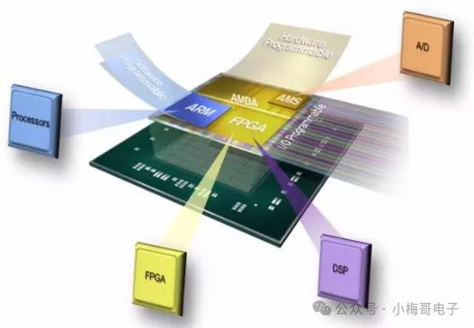

ZYNQ

6

FPGA

Altera

在

发布

个月后，另一家老牌

厂商——

，也发布了其

ARM Cortex-A9

CPU

28nm FPGA

SOC FPGA

集成双核

硬核

以及

的

。其中最具

Cyclone V SoC

SoC FPGA

代表性的就是

系列。笔者曾针对该系列

器件整理了

SoC FPGA

一本名为《

嵌入式设计和开发教程》的出版书籍。

https://xiaomeige.taobao.com

www.corecourse.cn

店铺：

官方网站：

2

http://www.cnblogs.com/xiaomeige/

(

)

技术博客：

技术群组：暂定

客户群

---
*下一页*

小梅哥FPGA 团队    武汉芯路恒科技

专注于培养您的FPGA 独立开发能力   开发板 培训 项目研发三位一体

Xilinx

ZYNQ

Altera

SoC FPGA

不管是

的

还是

的

，两家的器件结构大同小

CPU

Linux

异，都是高性能的

加高性能的可编程逻辑，都可以运行成熟的

系

FPGA

统，也都有着各自完善的开发环境。两大

巨头前后脚押注这种异构器

件，也证明了该结构的巨大魅力和广阔的市场前景。

ZYNQ

自发布以后，

这种令人兴奋的架构就以极快的速度应用到了各行各

业。比如机器人控制、汽车雷达信号处理、无人机控制器、医疗设备、工业打

印机等等，甚至是在区块链货币的发掘领域，都获得了大量应用。

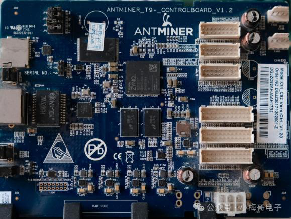

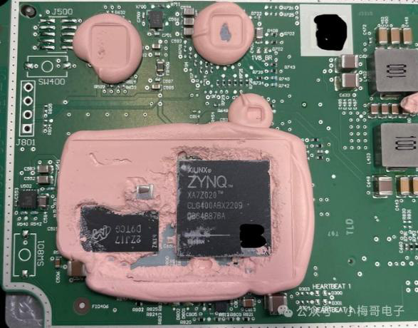

2013

FPGA

同样是在

年前后，国产

开始萌芽，行业里陆陆续续出现了一大

FPGA

批致力于研发和销售拥有自主知识产权的国产

的厂商，如京微雅格、上

海安路、紫光同创、广州高云、西安智多晶、深圳易灵思等等。这些厂家在器

FPGA

件设计和推广时虽各有各的特点，但是由于国外

器件在性能、规模以及

FPGA

应用生态上碾压式的优势，国产

器件的成长之路一直走得很艰难，起步

Altera

Xilinx

晚，技术难度大，市场关注度小，最关键的是经过

和

在中国市场

几十年的深耕，中国的工程师们已经习惯了使用进口器件，惯性使然，大家在

https://xiaomeige.taobao.com

www.corecourse.cn

店铺：

官方网站：

3

http://www.cnblogs.com/xiaomeige/

(

)

技术博客：

技术群组：暂定

客户群

---
*下一页*

小梅哥FPGA 团队    武汉芯路恒科技

专注于培养您的FPGA 独立开发能力   开发板 培训 项目研发三位一体

开发新应用新产品时，更愿意去选择自己熟悉的产品，熟悉的环境。

2020

直到

年，全球缺芯潮来袭，原本用着好好的进口芯片，突然之间全球

100

缺货，涨价，疯狂的涨价，一颗原本不到

元的小芯片，最高时候竟然涨到

2000

了

块，就这，还很难买到，即使买到，还不能百分百保证就是全新正品，

有可能是积压了多年的库存产品，也有可能是经过了油锅洗礼的下岗芯片再就

业，还有可能是李鬼充李逵，根本就不是那个芯。

3

一开始，大家以为缺芯缺几个星期，就缓和了，直到

个月，半年，甚至

一年过去了，缺芯潮不仅没有缓和，反有愈演愈烈的趋势。大家才意识到，我

们必须要打破幻想，从国产芯片找出路了。

FPGA

此时当聚光灯打到国产

厂商头上之时，大家发现，原来在中低端领

FPGA

域，国产

厂商早就已经布局多年，并且拥有了不错的功能和性能。很多

FPGA

原本使用进口芯片的应用中，国产

早已能够满足需求。只是大家之前一

直不知道，不想用，也不敢用。所以，在这缺芯缺到人缺氧的时刻，一场轰轰

烈烈的国产替代运动开始了。

FPGA

国产厂商因为起步较晚，在应用和生态方面

，较进口

存在较大的差

距，大家前期用起来比较受折磨，好在在国产厂家和代理商的辛苦支持下，很

多产品也最终能够迁移成功。当项目成功时，大家也都能长舒一口气，并从此

不再只认为国外的月亮比国内圆。

Cyclone IV E

Spartan3

Spartan-

在这场轰轰烈烈的国产替代运动中，像

、

、

6

Artix-7

Kintex-7

FPGA

、

、甚至

系列的

，大家都找到了不错的国产替代。但唯

ZYNQ

独

这种异构器件，一直没有合适的替代。虽然国内不少厂家也都有做集

Cortex-M3

RISC-V

CPU

FPGA

成

、

硬核

的

，但是这种器件无论是结构、功能还

ZYNQ

ZYNQ

是性能上，都与

差的太远太远。根本无法替代

。因此，如果要说

3

在这场长达

年的缺芯潮中，有哪一款芯片最让人无可奈何、无法释怀，我相

ZYNQ

信很多人都会说是

。

ZYNQ

但是现在，大家不用再为找不到

的国产替代而担心了，因为国产

FPGA

2023

11

11

龙头企业，上海安路信息科技股份有限公司，已经于

年

月

日

ZYNQ7020

SOC FPGA

在广州发布了可以全方面媲美

的国产

器件，也就是

SALDRAGON

FPSoC

系列

，中文简称飞龙。

https://xiaomeige.taobao.com

www.corecourse.cn

店铺：

官方网站：

4

http://www.cnblogs.com/xiaomeige/

(

)

技术博客：

技术群组：暂定

客户群

---
*下一页*

小梅哥FPGA 团队    武汉芯路恒科技

专注于培养您的FPGA 独立开发能力   开发板 培训 项目研发三位一体

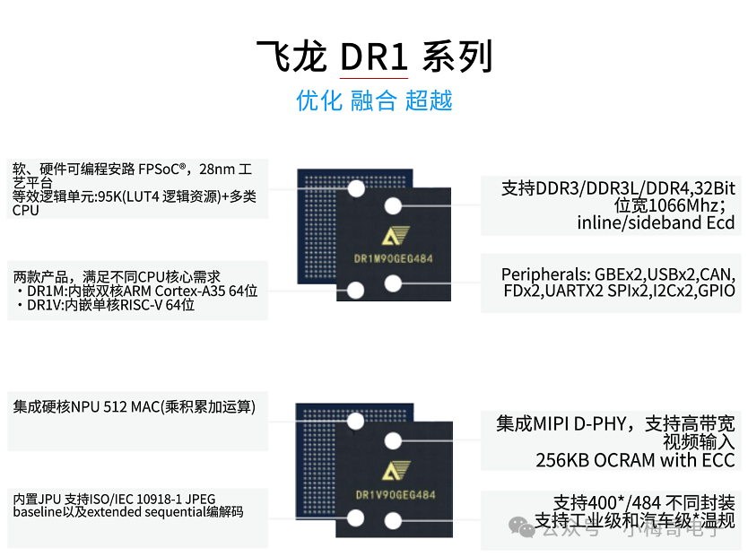

SALDRAGON®

DR1

FPSoC®

安路科技

（以下简称

）系列器件延续安路

家

ARM Cortex-A35

64

RISC-V

FPGA

族，集成了硬核处理器系统双核

或者

位

、

可

AI

ARM v8

RISC-V

编程逻辑和

引擎，形成了硬核高性能

处理器产品或高性能

64bit

FPGA

处理器两个产品系列，并且具备安路

的灵活性、

低功耗、

软硬件

SoC

ARM

RISC-V

RAM

可编程、可扩展

平台的优势。

或

处理器配合片上

，以

及支持多类内存接口和丰富的外设端口，为应用端提供更加丰富的适配场景。

SDK

FD(Future

配套安路科技自主开发嵌入式软件

、集成开发环境工具

Dynasty®)

，定位复杂实时嵌入式系统应用，满足工业等应用领域对计算能力、

FPSoC®

可扩展性、实时性、稳定性等高要求。目前已支持

多平台的软件项目

创建，用户可根据提供的模板，无需配置项目参数，快速创建相应的工程，实

ARM / RISC-V+FPGA+AI

现

异构工程的运行与调试。

FPSoc

恰逢此时，我们受安路原厂邀请，参与最新的

器件——

SALDRAGONR1

DR1

（以下简称

，中文简称飞龙）系列的教学开发板的开发工

6

FAE

FAE

FPGA

20

作，历时

个月，在安路原厂

、世健代理商

、小梅哥

团队近

AC820

SOC FPGA

人的通力合作下

教学型国产

https://xiaomeige.taobao.com

www.corecourse.cn

店铺：

官方网站：

5

http://www.cnblogs.com/xiaomeige/

(

)

技术博客：

技术群组：暂定

客户群

---
*下一页*

小梅哥FPGA 团队    武汉芯路恒科技

专注于培养您的FPGA 独立开发能力   开发板 培训 项目研发三位一体

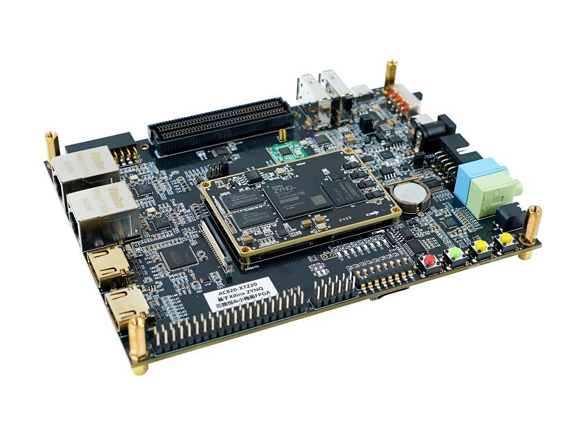

AC820

ARM

同时

开发板采用分体式设计，可以同时兼容安陆飞龙

版的

DR1M90GEG484

RISC-V

DR1V90GEG484

ZYNQ

、安陆飞龙

版的

以及

系列的

xc7z020clg484-2

AC820

芯片。那么接下来，就让我们一起走进

开发板的研学之

旅吧。

https://xiaomeige.taobao.com

www.corecourse.cn

店铺：

官方网站：

6

http://www.cnblogs.com/xiaomeige/

(

)

技术博客：

技术群组：暂定

客户群

---
*下一页*

小梅哥FPGA 团队    武汉芯路恒科技

专注于培养您的FPGA 独立开发能力   开发板 培训 项目研发三位一体

【第一部分】先把环境搭建起来

AC820

zynq 7020

zynq 7020

分为安路飞龙和

两个版本类型，本手册仅针对

版本，阅读前请仔细核对开发板类型。

第一步：给开发板供电

AC820

开发板提供两种供电方案，对于实现绝大多数实验目标，均可以使

Type-c

用和程序下载共用的

口给开发板供电，让使用线缆更加简洁。

Type-C

注意：

开发板采用的单刀三掷开关，单刀三掷开关上拨时则

供电，

居中则开发板断电，下拨时则圆孔电源电缆供电。为了提高圆孔供电电缆的驱

6~12V

动能力，我们将圆孔的电源电压设计为默认

并随板提供支持该电压的电

源适配器。

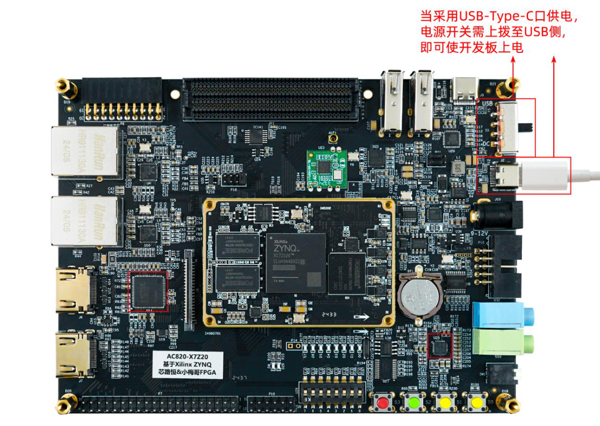

1 AC820

Type-C

图

开发板

供电方法

Linux

对于使用

系统加多硬件协同工作的实验，如果您怀疑开发板供电不

足影响到使用效果，您可以使用我们提供的圆孔电源适配电缆。使用该电缆供

电时，务必使用标配的外接直流电源供电。为保证供电质量，避免开发板工作

异常甚至开发板被劣质电源适配器损坏，请务必使用开发板标配的电源适配器

供

电

。

店铺：

官方网站：

https://xiaomeige.taobao.com

www.corecourse.cn

技术博客：

技术群组：

http://www.cnblogs.com/xiaomeige/

---
*下一页*

小梅哥FPGA 团队    武汉芯路恒科技

专注于培养您的FPGA 独立开发能力   开发板 培训 项目研发三位一体

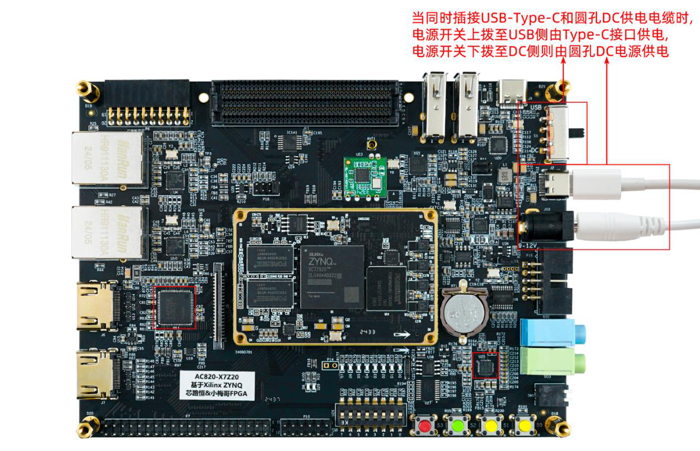

2  AC820

Type-C

DC

图

开发板同时插接

和圆孔

电源电缆供电方法

第二步：安装开发软件

License

从下述链接中下载开发板资料，盘中包含了软件安装包，全功能

文

TD/FD

件和安装指导书，根据安装指导书内容安装安路

软件即可。

http://www.corecourse.cn/forum.php?mod=viewthread&tid=29690

第三步：开发板所需驱动的准备工作

2

为满足开发板的正常开发功能，开发板最常用硬件驱动包括

款：

1.

下载器驱动

2.

串口设计相关驱动

Xilinx

下载器驱动

下载器驱动安装核验

Vivado

Vivado

但凡在该计算机下载

的用户，在

的安装过程都会弹出下面的

界面，这里是安装下载器驱动，点击安装。

店铺：

官方网站：

https://xiaomeige.taobao.com

www.corecourse.cn

技术博客：

技术群组：

http://www.cnblogs.com/xiaomeige/

---
*下一页*

小梅哥FPGA 团队    武汉芯路恒科技

专注于培养您的FPGA 独立开发能力   开发板 培训 项目研发三位一体

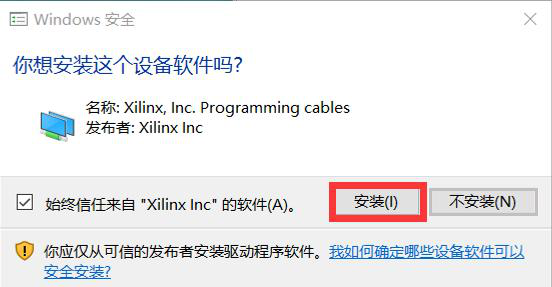

3  VIVADO

图

安装启动提示

Vivado

按照操作流程安装好

的用户，在安装完成后就可以到计算机的设备

管理器界面核实是否有如下选项：

4

VIVADO

图

开发板已安装过

配套下载器驱动

如果在计算机的设备管理器界面有如上所述选项，则说明该计算机下载器

驱动正常。否则，在设备管理器界面会有如下警告选项：

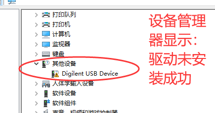

店铺：

官方网站：

https://xiaomeige.taobao.com

www.corecourse.cn

技术博客：

技术群组：

http://www.cnblogs.com/xiaomeige/

---
*下一页*

小梅哥FPGA 团队    武汉芯路恒科技

专注于培养您的FPGA 独立开发能力   开发板 培训 项目研发三位一体

5

图

下载器驱动未安装成功

下载器驱动未安装成功解决办法

Type-c

如果下载器驱动未安装成功，则解决方法为：拔掉连接开发板的

线，

VIVADO

以确保下载器电路断开。打开下图所示的

软件的驱动文件夹，直接双

install_digilent.exe

击

文件进行安装，并在需要的时候勾选所有勾选项以手动安

装下载器服务程序。

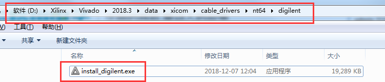

6

图

补充安装下载器驱动的文件路径和安装文件

usb

usb

如果安装成功，可以查看任务管理器，无法识别的

设备类型消失，

驱动加载正常。

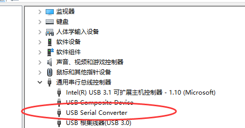

7

图

驱动安装成功后的设备管理器中下载器挂载后标识

串口设计相关驱动

CH9102

PS

驱动安装方法（

端串口）

USB

连接开发板

数据线

USB

PC

USB

使用套件提供的

数据线，一端插入

端的

接口，一端插入开发

USB Type-C

板

接口，如下图所示。

店铺：

官方网站：

https://xiaomeige.taobao.com

www.corecourse.cn

技术博客：

技术群组：

http://www.cnblogs.com/xiaomeige/

---
*下一页*

小梅哥FPGA 团队    武汉芯路恒科技

专注于培养您的FPGA 独立开发能力   开发板 培训 项目研发三位一体

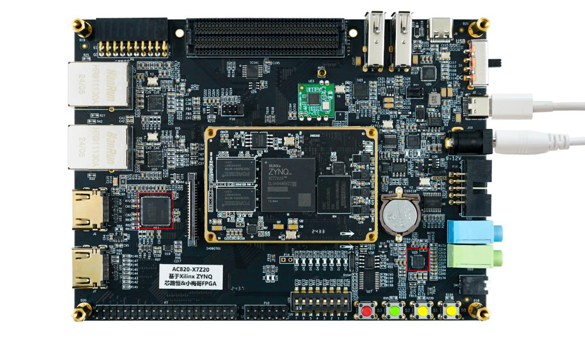

8

USB

图

连接

接口

在设备管理器中查看硬件

USB

PC

数据线连接

端后，打开电脑的设备管理器，在设备管理器中查看驱

win10

win11

动是否安装，

和

系统的电脑可以自动识别芯片并自主安装驱动，或

者有的用户电脑在之前已经安装过相关芯片的驱动，设备管理器的“端口

COM

LPT

COM

（

和

）”下面会出现对应的

口。

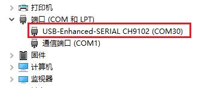

9

图

端口列表

win10

win11

这样就不需要再安装驱动。倘若电脑未成功自动安装，在

和

的

10

设备管理器中就不会出现该硬件信息，同时会给出图

所示未成功识别

CH9102

的显示内容：

店铺：

官方网站：

https://xiaomeige.taobao.com

www.corecourse.cn

技术博客：

技术群组：

http://www.cnblogs.com/xiaomeige/

---
*下一页*

小梅哥FPGA 团队    武汉芯路恒科技

专注于培养您的FPGA 独立开发能力   开发板 培训 项目研发三位一体

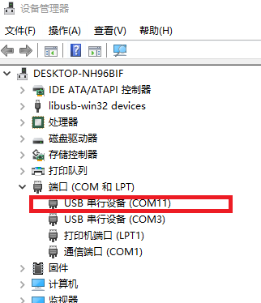

10

图

未安装或安装失败时设备管理器无法识别

win7

11

而在

系统的电脑中，则会出现图

所示的提示：

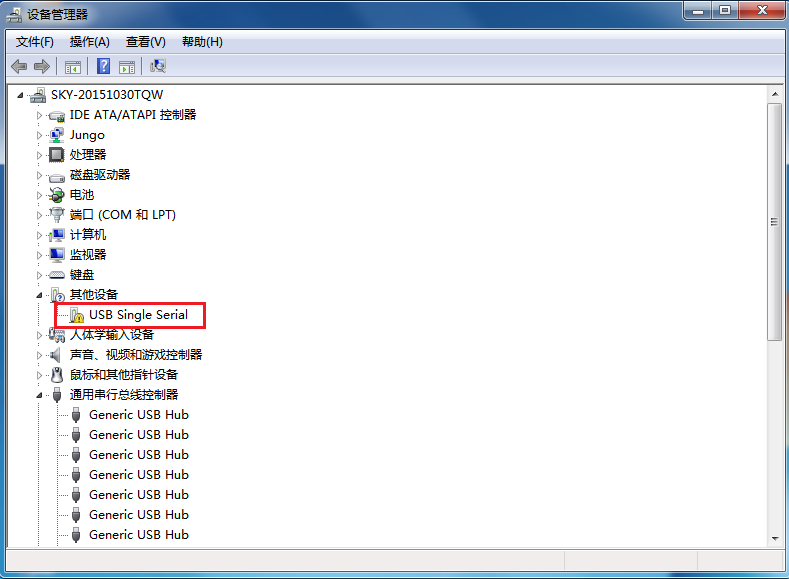

11  win7

CH343

图

系统下

设备无驱动，设备管理器识别情况

COM

LPT

如果“端口（

和

）”和“其他设备”中均没有该硬件，请再次确

PC

USB

认开发板和

端的连接情况是否完好。如果都接好了，考虑使用的

线是

USB

否存在问题。可以尝试更换

线测试。

店铺：

官方网站：

https://xiaomeige.taobao.com

www.corecourse.cn

技术博客：

技术群组：

http://www.cnblogs.com/xiaomeige/

---
*下一页*

小梅哥FPGA 团队    武汉芯路恒科技

专注于培养您的FPGA 独立开发能力   开发板 培训 项目研发三位一体

运行驱动安装包

AC820

USB

CH9102F

开发板上使用的是南京沁恒的一款

转高速串口芯片

，

CH343

该芯片与

共用同一个安装驱动程序。该驱动安装包我们已经提前下载并

CH343SER.ZIP

提供在开发板配套资料中，找到“

”文件，解压文件，双击运行

SETUP.exe

文件中的“

”文件。

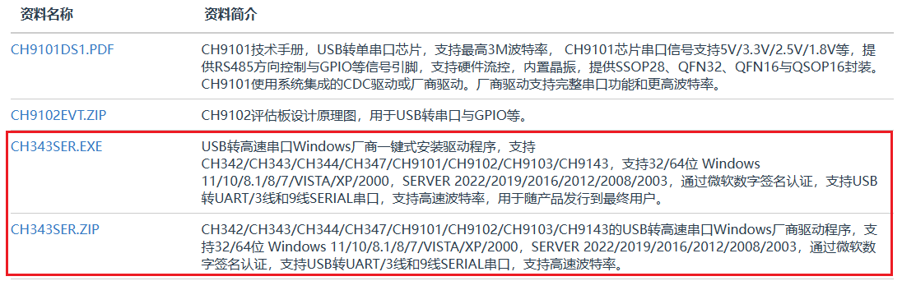

12

图

官网资料说明

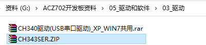

13  CH343SER.ZIP

图

文件

电脑会出现如下弹窗：

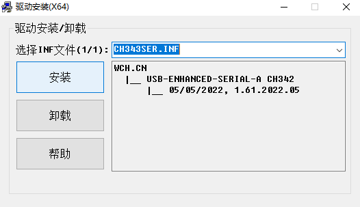

14

CH343

图

安装

驱动导航

点击‘安装’。稍等片刻后，弹出如下界面。

店铺：

官方网站：

https://xiaomeige.taobao.com

www.corecourse.cn

技术博客：

技术群组：

http://www.cnblogs.com/xiaomeige/

---
*下一页*

小梅哥FPGA 团队    武汉芯路恒科技

专注于培养您的FPGA 独立开发能力   开发板 培训 项目研发三位一体

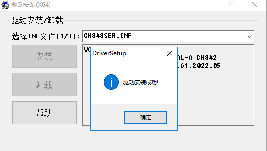

15

图

驱动安装成功

安装完成后，再次连接数据线，打开电脑的设备管理器，查看驱动安装结

果，如下图出现相关硬件信息即为安装成功。

16

图

成功识别串口

到这里，常用的驱动工具就已经安装完成了。后续课程中如果有针对某一

个学习内容需安装驱动或者软件，将在对应章节单独讲解。

第四步：了解我们提供的学习资料

AC820

开发板主要提供两种类型的资料。

1.

教程文档

2.

例程源码

此外还提供一系列工具支持包，官方参考手册等配套资料作为学习参考。

教程文档

3

教程文档根据知识体系，分成

个部分，全部位于开发板资料包网盘的

01_

文档教材

文件夹下。

⚫

01_

AC820

《

【用户手册】

开发板用户手册》

店铺：

官方网站：

https://xiaomeige.taobao.com

www.corecourse.cn

技术博客：

技术群组：

http://www.cnblogs.com/xiaomeige/

---
*下一页*

小梅哥FPGA 团队    武汉芯路恒科技

专注于培养您的FPGA 独立开发能力   开发板 培训 项目研发三位一体

⚫

02_

FPGA

《

【逻辑教程】国产安路

逻辑设计与验证教程》

⚫

03_CPU

-

《

裸机编程教材文档

安路版本》

⚫

04_

Linux

Linux

《

【

教程】基于

的嵌入式系统开发和应用教程》

例程源码

AC820

ZYNQ

FPSoC

根据教程内容不同，我们在网盘

小梅哥

型

或安路

开发

\

02_

板资料

例程源码

下分别提供了有例程源码

⚫

PS

AC820

ZYNQ

网盘中

裸机编程

文件夹下提供了

小梅哥

型

或安路

FPSoC

\

01_

\03_CPU

\

开发板资料

教材文档

裸机编程教材文档

安路

下各

个文档教材中相关的配套例程。

⚫

PL

02_

FPGA

网盘中

逻辑编程

文件夹下提供了《

【逻辑教程】国产安路

逻辑设计与验证教程》文档教材中相关的配套例程。

AC820

ZYNQ

FPSoC

\

05_Linux

同时在网盘

小梅哥

型

或安路

开发板资料

源码

ZYNQ

Linux

下也分别提供了有

版本和安路飞龙版本的

例程源码

第五步：学习建议

1.

详读本用户手册

2.

按照自己在三大体系中的兴趣重点，跟着我们提供的教程文档和视频

课程从开头学习，看懂原理之后建议先动手自己写代码，遇到写不出

来的地方，再参考我们的手册寻找思路。多练习、必仿真、勤提问、

不要让小梅哥闲着。

第六步：关于开发板引脚分配

PL

PS

我们提供了一个专用的引脚分配表格资料包，涵盖开发板

和

两个部

04

分，用户可以直接打开资料包

号文件夹下对应的部分，找到自己需要的管脚

TD/FD

信息输入到安路

软件的引脚分配窗口中。也可以通过下述网页内容查看。

AC820

开发板管脚信息表（点击即可查看）

第七步：关于学习或实验中遇到的问题

大家在学习过程中遇到了问题，请千万不要客气，请直接在我们的客户群

内提问，让技术支持人员协助您解决，就是在提问时，请牢记以下要点：

店铺：

官方网站：

https://xiaomeige.taobao.com

www.corecourse.cn

技术博客：

技术群组：

http://www.cnblogs.com/xiaomeige/

---
*下一页*

小梅哥FPGA 团队    武汉芯路恒科技

专注于培养您的FPGA 独立开发能力   开发板 培训 项目研发三位一体

1

、提问题，先整理，描述清楚啥问题

2

、要提问，先分析，关键信息看清楚

3

、发代码，请截图，文字形式没人理

4

、发代码，带行号，前后内容带一起

5

、遇报错，看信息，报错位置图带起

常去论坛多搜索，常见问题已整理

解决问题莫着急，提问智慧先学习

不管大事和小事，礼貌和气排第一

fpga.cn

芯路恒技术论坛为

店铺：

官方网站：

https://xiaomeige.taobao.com

www.corecourse.cn

技术博客：

技术群组：

http://www.cnblogs.com/xiaomeige/

---
*下一页*

小梅哥FPGA 团队    武汉芯路恒科技

专注于培养您的FPGA 独立开发能力   开发板 培训 项目研发三位一体

【第二部分】熟悉一下板子各个电路结构

AC820

开发板介绍

布局及组件

AC820

下面各图为

开发板上各芯片的详细型号、开发板资源的详细介绍：

17  AC820

图

正面资源一览

启动模式

AC820

JTAG

QSPI

SDcard

3

开发板支持

、

、

，

种启动方式，启动方式的选择

MIO4

MIO5

AC820

MIO4

由

和

两个引脚进行控制。此外在

开发板上

与

店铺：

官方网站：

https://xiaomeige.taobao.com

www.corecourse.cn

技术博客：

技术群组：

http://www.cnblogs.com/xiaomeige/

---
*下一页*

小梅哥FPGA 团队    武汉芯路恒科技

专注于培养您的FPGA 独立开发能力   开发板 培训 项目研发三位一体

PS_QSPI_DQ2

MIO5

PS_QSPI_DQ3

、

与

引脚复用，相关电路如下图所示：

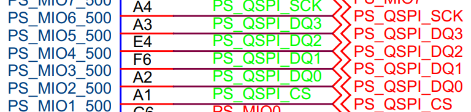

18  AC820

图

启动引脚

MIO4

MIO5

开发板的启动方式与

、

的对应关系如下：

1

表

启动模式与引脚电平

MIO4

MIO5

JTAG

低电平、

低电平

MIO4

MIO5

QSPI

低电平、

高电平

MIO4

MIO5

SD card

高电平、

高电平

NAND

（未使用）

MIO4

MIO5

与

的控制电路如所示：

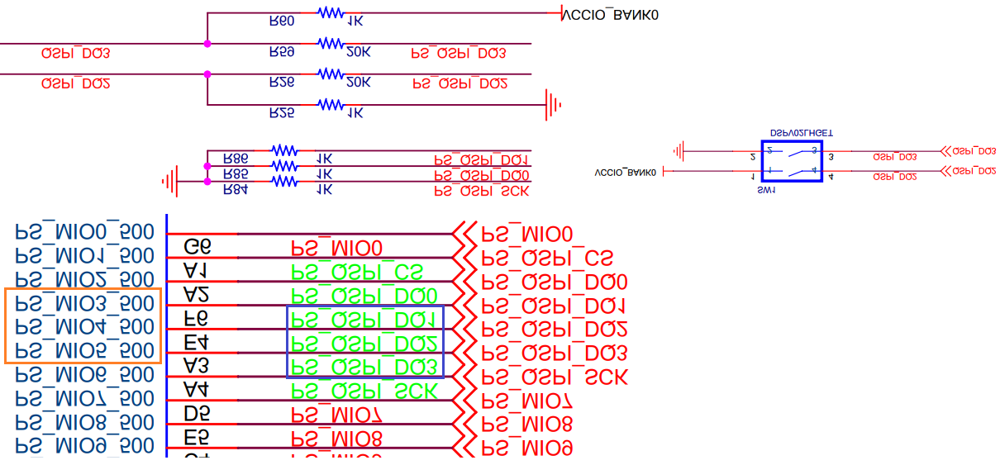

核心板

底板

核心板

19  AC820

图

启动引脚电路

AC820

开发板通过拨码开关对引脚电平进行控制，具体的使用方法如下表：

2

表

启动模式与设置方式

AC820

开发板启动模式

拨码开关

模式

1

2

QSPI

↑

↑

JTAG

↑

↓

SD card

↓

↑

AC820

NAND FLASH

NAND

芯路恒

开发板未设计使用板载

不同启动模式对应硬件上的设置如下：

店铺：

官方网站：

https://xiaomeige.taobao.com

www.corecourse.cn

技术博客：

技术群组：

http://www.cnblogs.com/xiaomeige/

---
*下一页*

小梅哥FPGA 团队    武汉芯路恒科技

专注于培养您的FPGA 独立开发能力   开发板 培训 项目研发三位一体

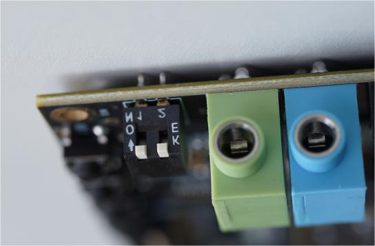

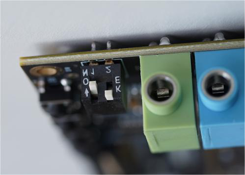

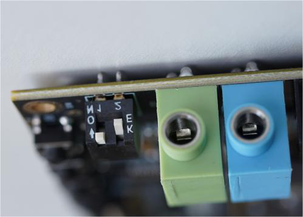

JTAG启动模式

QSPI启动模式

SD卡启动模式

20  AC820

图

启动模式设置

JTAG

启动在三种启动模式中为最高优先级，用户在使用时请正确按照所需

启动模式设置，以免因为模式设置错误而导致程序无法按照预期运行。

时钟输入

AC820

PL

PS

PL

50MHz

芯路恒

开发板

端与

端各有独立的基本时钟。

端为

，

PS

33.333MHz

PS

端为

，分别使用一个独立的有源晶振提供。其中

端的

33.333MHz

PS

PS_CLK

时钟接入了

的专用时钟输入管脚

上，使用时无需用户手

PL

50MHz

FPGA

Y9

动指定。

端的

时钟接入到

的全局时钟输入管脚之一的

PL_GCLK

（

）管脚上，如下图所示：

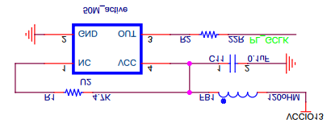

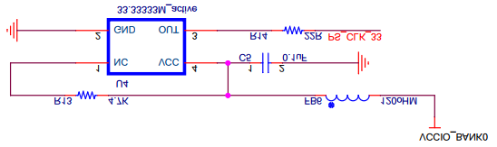

21

图

时钟电路

两个晶振全部位于核心板上，位置如下图：

店铺：

官方网站：

https://xiaomeige.taobao.com

www.corecourse.cn

技术博客：

技术群组：

http://www.cnblogs.com/xiaomeige/

---
*下一页*

小梅哥FPGA 团队    武汉芯路恒科技

专注于培养您的FPGA 独立开发能力   开发板 培训 项目研发三位一体

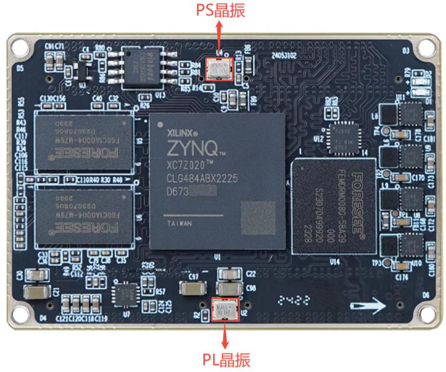

22

图

板载晶振

3  PL

表

端时钟管脚分配表

Signial Name

Pin NO.

FPGA_GCLK

Y9

轻触按键

AC820

PL

PS

芯路恒

开发板上配备了四个侧按按键，

端两个，

端一个，以

及一个复位按键，在没有按键按下时，此四个按键端输出的都是高电平，当按

键按下的时候，被按下的按键端会输出低电平。

S3

PS

PS_PRO_B

PS

其中，

为复位按键，连接到

端的

，也是

系统的全局复

S0

S1

S2

S0

PL

H18

S1

位脚。

、

、

可以由用户自行支配使用，

连接到

端的

引脚，

PL

H19

S2

PS

B10

连接到

端的

引脚，

连接到

端的

引脚。

店铺：

官方网站：

https://xiaomeige.taobao.com

www.corecourse.cn

技术博客：

技术群组：

http://www.cnblogs.com/xiaomeige/

---
*下一页*

小梅哥FPGA 团队    武汉芯路恒科技

专注于培养您的FPGA 独立开发能力   开发板 培训 项目研发三位一体

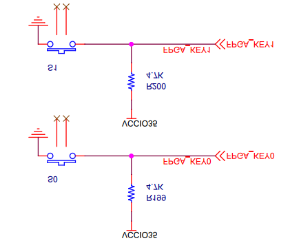

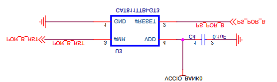

23

图

按键电路

三个轻触按键在开发板上的位置如下图所示：

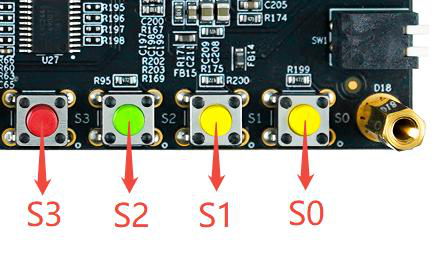

24

图

板载按键

4

表

按键管脚分配

Signial Name

Pin NO.

S1

H18

S2

H19

S3

PS_MIO47

S4

PS_POR_B

店铺：

官方网站：

https://xiaomeige.taobao.com

www.corecourse.cn

技术博客：

技术群组：

http://www.cnblogs.com/xiaomeige/

---
*下一页*

小梅哥FPGA 团队    武汉芯路恒科技

专注于培养您的FPGA 独立开发能力   开发板 培训 项目研发三位一体

拨码开关

AC820

8

8

如下图所示，

开发板提供了

个拨码开关，

个拨码开关分别被称为

SW0~SW7

8

FPGA

。此

个引脚直接与

管脚相连，并接上了上拉电阻。

拨到靠上

FPGA

FPGA

方时，对应

管脚信号检测到高电平，拨到靠下方时，对应

管脚检

测到低电平。

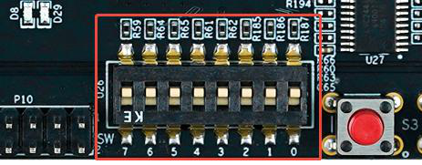

25

图

拨码开关

5

表

拨码开关引脚分配表

Signial Name

Pin NO.

SW0

G21

SW1

G20

SW2

F19

SW3

G19

SW4

G17

SW5

H17

SW6

E20

SW7

E19

PS

LED

用户

AC820

9

LED

PL

8

PS

芯路恒

开发板上配备了

个用户

，也是

端

个，

端一个，

LED

D8

PS

LED

D0~D7

PL

灯

连接在

端，

灯

连接在

端。当引脚输出高电平时，

LED

LED

点亮，当引脚输出低电平时，

熄灭。

店铺：

官方网站：

https://xiaomeige.taobao.com

www.corecourse.cn

技术博客：

技术群组：

http://www.cnblogs.com/xiaomeige/

---
*下一页*

小梅哥FPGA 团队    武汉芯路恒科技

专注于培养您的FPGA 独立开发能力   开发板 培训 项目研发三位一体

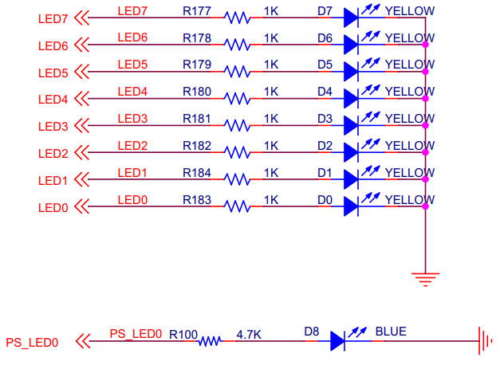

26 LED

图

电路

LED

用户

在开发板上的位置如下图所示：

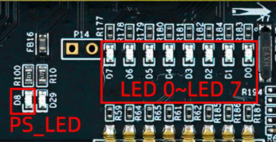

27

LED

图

板载

6  LED

表

管脚分配表

Signial Name

Pin NO.

LED0

P20

LED1

P21

LED2

R20

LED3

R21

LED4

R19

LED5

T19

LED6

T16

LED7

T17

PS_LED0

PS_MOI7(D5)

I2C

总线

AC820

6

I2C

在芯路恒

开发板上共有

个设备使用或带有

接口，分别为

店铺：

官方网站：

https://xiaomeige.taobao.com

www.corecourse.cn

技术博客：

技术群组：

http://www.cnblogs.com/xiaomeige/

---
*下一页*

小梅哥FPGA 团队    武汉芯路恒科技

专注于培养您的FPGA 独立开发能力   开发板 培训 项目研发三位一体

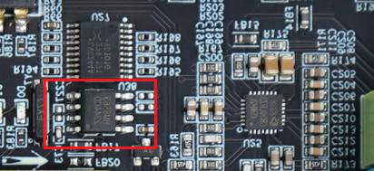

28  EEPROM

24LC64

RTC

PCF8563

图

（

）存储器芯片（左图）和

时钟（

）芯片（右图）

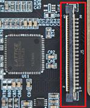

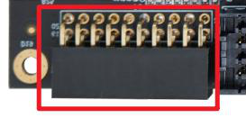

29

图

数字摄像头接口（左图）和电容触摸屏接口（右图）

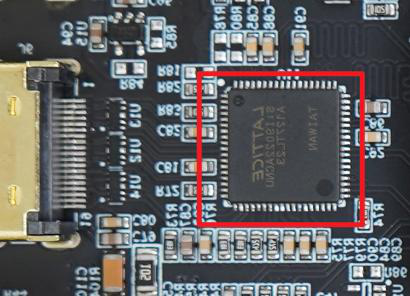

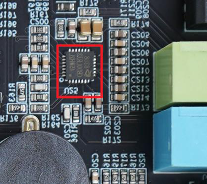

30 HDMI

SiI9022

ES8388

图

音视频输出（

）芯片（左图）和音频编解码器（

）芯片（右图）

I2C

由于

总线本身是一个支持多主多从架构的总线，因此可以在一个总线

I2C

上连接多个

设备。

AC820

HDMI

在

中，考虑到兼容性的问题，我们将

音视频输出设备的引脚

PL

ES8388

HDMI

与

侧的

引脚连接到了一起。这样对于纯逻辑的设计也能使用

，

C

IIC0

EMIO

IIC0

而对于

编程的裸机设计，不再局限于使用

。用户可以使用

将

IIC1

PL

HDMI

AXI IIC

HDMI

或

的引脚路由到

初始化配置

芯片，或使用

核配置

PS

IIC

芯片，而不占用

侧

外设资源。

店铺：

官方网站：

https://xiaomeige.taobao.com

www.corecourse.cn

技术博客：

技术群组：

http://www.cnblogs.com/xiaomeige/

---
*下一页*

小梅哥FPGA 团队    武汉芯路恒科技

专注于培养您的FPGA 独立开发能力   开发板 培训 项目研发三位一体

PS_I2C0_SCL

电容触摸屏

I2C0

PS_I2C0_SDA

（GT911）

0xBA/0x28

PS

I2C1

PL_I2C_SCL

PL_I2C_SDA

音频编解码

HDMI输出

EEPROM

RTC

PL

（ES8388）

（SiI9022）

（24LC64）

（PCF8563）

0x20

0x72

0xA0

0xA2

CAMERA_SCLK

摄像头接口

CAMERA_SDA

OV5640:0x78

31  AC820 IIC

图

设备分布

7  I2C

表

管脚分配表

Signial Name

Pin NO.

PS_I2C0_SDA

PS_MIO51(C1)

PS_I2C0_SCL

PS_MIO50(D13)

IIC

每个

设备都有一个设备地址，上述设备的设备地址如下表所示：

8  IIC

表

设备地址

8

7

器件名称

器件地址

位模式

器件地址

位模式

24LC64

0xA0

0x50

PCF8563

0xA2

0x51

SII9022A

0x72

0x39

GT911

0xBA/0x28

0x5d/0x14

ES8388

0x20

0x10

OV5640

0x78

0x3C

需要注意的是，对于设备的器件地址，不同的应用场景，不同的器件厂家

8

0

7

有不同的理解和定义方式，所以出现了

位（默认最低位读写位为

）和

位

（仅看实际的器件地址部分，不考虑最低位读写标识位）两种常见格式。以上

8

7

Linux

列出的各个器件的，分别提供了

位和

位两种表示方法时对应的值，在

SDK

7

FPGA

设备树和

的软件编程中，一般采用

位模式表示，在

逻辑开发时，

8

一般采用

位表示模式。

店铺：

官方网站：

https://xiaomeige.taobao.com

www.corecourse.cn

技术博客：

技术群组：

http://www.cnblogs.com/xiaomeige/

---
*下一页*

小梅哥FPGA 团队    武汉芯路恒科技

专注于培养您的FPGA 独立开发能力   开发板 培训 项目研发三位一体

PCF8563

RTC

基于

的

时钟硬件

PCF8563

RTC

板载

型

时钟芯片，支持年、月、日、时、分、秒、周和闹钟

I2C

EEPROM

RTC

I2C

功能。该芯片使用

接口与主控通信。

和

连接到同一个

总

线上。

在嵌入式系统中经常需要设备自己能够保持独立且准确的时间，因此在

FPGA

RTC

系统中，就需要用到专门的

芯片。所以我们在开发板上为大家设计

PCF8563

RTC

I2C

RTC

了一个基于

芯片的

电路，方便大家学习基于

总线的

时

间的设置和读取。在开发板未供电情况下，设计的纽扣电池给该芯片供电可以

保证计时的延续。

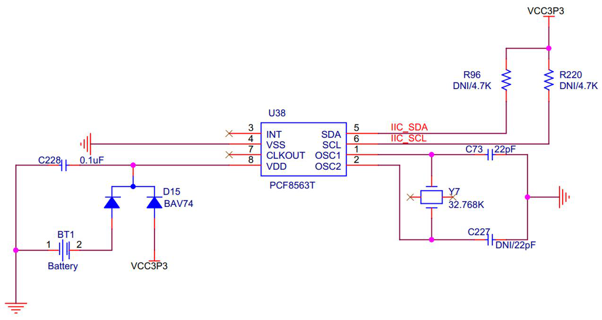

32 PCF8563 RTC

图

时钟芯片电路图

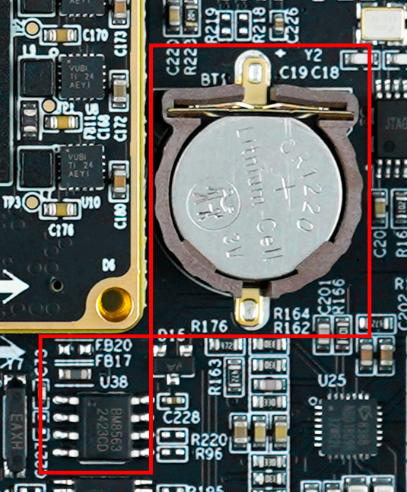

33 PCF8563 RTC

图

时钟芯片及纽扣电池

店铺：

官方网站：

https://xiaomeige.taobao.com

www.corecourse.cn

技术博客：

技术群组：

http://www.cnblogs.com/xiaomeige/

---
*下一页*

小梅哥FPGA 团队    武汉芯路恒科技

专注于培养您的FPGA 独立开发能力   开发板 培训 项目研发三位一体

24LC64

EEPROM

的

存储器

AC820

64Kbit EEPROM

24LC64

开发板板载

存储器，型号为

。该芯片使用

I2C

EEPROM

RTC

I2C

EEPROM

接口与主控通信。

和

连接到同一个

总线上，

存

MAC

储器主要用来存储一些小容量的，需要掉电保存的内容，比如网卡的

地址，

AC820

比如触摸屏的校准数据等等。

开发板上设计这样一个存储器，可以方便

I2C

大家进一步学习

总线的使用。

34 EEPROM

图

存储器电路图

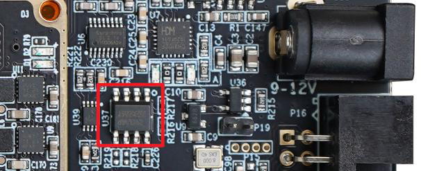

35 EEPROM

图

存储器

LCD

IC_HDMI

和

接口

ARM Linux

在基于

的系统中，经常需要用到显示设备显示各种交互信息。

AC820

LCD

IC_HDMI

(

为此，

开发板上，提供了一个

接口和一个

输出接口

这里

IC_HDMI

IC

SiI9022

HDMI

使用

输出接口指代使用

芯片

实现

输出的接口，为开

HDMI_1)

发板上的

。

LCD

FPC

RGB565

接口使用

软排线连接方式，支持

颜色模式，可支持多种

TFT

480*272

800*480

1024*600

分辨率的

液晶显示屏，包括但不限于

、

、

等。目

TFT

1024*600

前已经测试使用过的

显示屏最大分辨率为

。更高分辨率的显示屏，

RGB

I2C

已经很少使用这种

并行通信接口，所以未做测试。同时该接口提供了

I2C

总线连接，能够支持

接口的电容触摸屏。对于该接口，我们提供了多款带

店铺：

官方网站：

https://xiaomeige.taobao.com

www.corecourse.cn

技术博客：

技术群组：

http://www.cnblogs.com/xiaomeige/

---
*下一页*

小梅哥FPGA 团队    武汉芯路恒科技

专注于培养您的FPGA 独立开发能力   开发板 培训 项目研发三位一体

电容触摸功能的显示屏，可以直接用于该开发板。如下图所示：

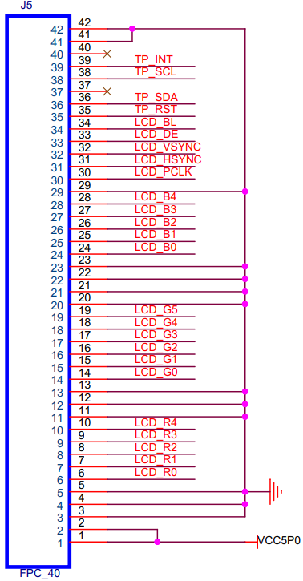

36  LCD

图

接口电路

LCD

接口在开发板上的位置如图所示：

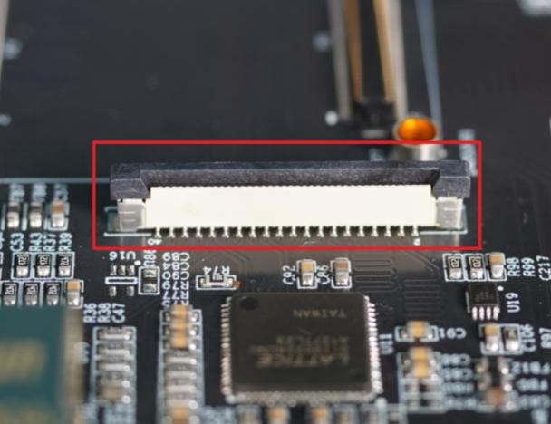

37  LCD

图

接口

TFT

HDMI

AC820

除了

显示屏，

显示器也是一种常用的显示设备。因此

开

HDMI

HDMI_1

HDMI_2

发板上还提供了两路

输出接口（

和

）。这里我们要介绍

HDMI_1

Lattice

SiI9022

HDMI

的是

，该接口使用

公司的

型

输出芯片，最高可支

1920*1080

持

分辨率的图像输出。该部分电路如下图所示（图片太大，插入文

档显示不清晰，需要查看具体细节的，建议直接查看提供的开发板原理图文

件）。

店铺：

官方网站：

https://xiaomeige.taobao.com

www.corecourse.cn

技术博客：

技术群组：

http://www.cnblogs.com/xiaomeige/

---
*下一页*

小梅哥FPGA 团队    武汉芯路恒科技

专注于培养您的FPGA 独立开发能力   开发板 培训 项目研发三位一体

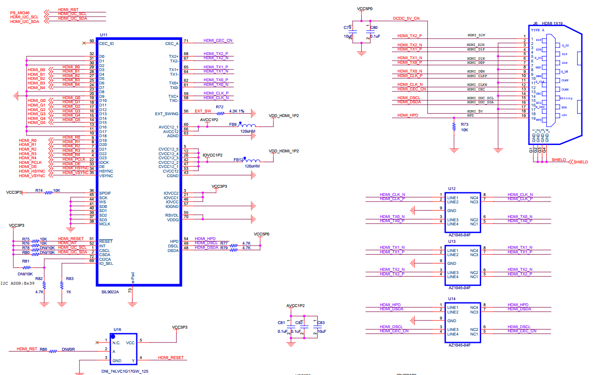

38  HDM_1

图

电路

HDMI_1

相关电路的主要电路元件在开发板上的位置如图所示：

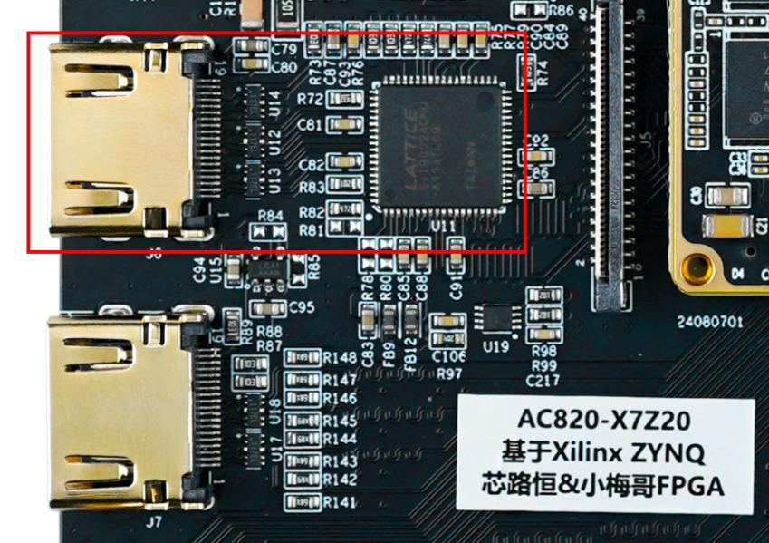

39  HDMI_1

图

接口及主要元件

TFT

HDMI_1

需要注意的是，

显示接口和

输入电路是共享数据和控制信号

PL

IO

TFT

SiI9022

的，也就是说，从

部分输出的数据和

信号，同时接到了

和

相

TFT

同功能的管脚上，如下图所示。当输出分辨率和所连接的

显示屏物理分辨

HDMI

TFT

TFT

率一致时，

和

屏能够同时显示完全相同的内容。反之，如果

显

TFT

示屏和输出图像的分辨率不一致，则会出现

显示屏图像显示残缺甚至完全

无法显示的情况。

店铺：

官方网站：

https://xiaomeige.taobao.com

www.corecourse.cn

技术博客：

技术群组：

http://www.cnblogs.com/xiaomeige/

---
*下一页*

小梅哥FPGA 团队    武汉芯路恒科技

专注于培养您的FPGA 独立开发能力   开发板 培训 项目研发三位一体

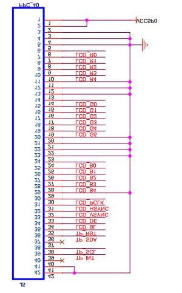

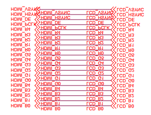

40  TFT

HDMI

图

和

输出电路

TFT/HDMI

RGB

下表为

对应的

数据和控制信号开发板管脚对应表。

9  TFT/HDMI

表

管脚分配

Signial Name

Pin NO.

Signial Name

Pin NO.

LCD_R4

AB21

LCD_B4

AB15

LCD_R3

AA17

LCD_B3

W13

LCD_R2

AB17

LCD_B2

V13

LCD_R1

AA16

LCD_B1

V15

LCD_R0

AB16

LCD_B0

V14

LCD_G5

Y13

LCD_PCLK

V22

LCD_G4

AA13

LCD_HSYNC

AB14

LCD_G3

W22

LCD_VSYNC

U14

LCD_G2

AA22

LCD_DE

AB19

LCD_G1

AB22

LCD_BL

Y8

LCD_G0

AA21

LCD

HDMI_1

TP_RST

显示屏相较于

还多出触摸复位（

）和触摸中断

TP_INT

（

）两个引脚。

10  LCD

表

触摸复位及触摸中断管脚

Signial Name

Pin NO.

TP_RST

R15

TP_INT

PS_MIO0

HDMI_1

I2C

I2C

另外

和触摸屏都需要使用

总线进行控制，这两个设备的

I2C

I2C

接口是挂在同一个

总线上的，具体可查看本手册的

总线说明部分。

店铺：

官方网站：

https://xiaomeige.taobao.com

www.corecourse.cn

技术博客：

技术群组：

http://www.cnblogs.com/xiaomeige/

---
*下一页*

小梅哥FPGA 团队    武汉芯路恒科技

专注于培养您的FPGA 独立开发能力   开发板 培训 项目研发三位一体

IO_HDMI

输入输出接口

AC820

TMDS

为满足客户的学习需求，

开发板上还设计了一个基于

编码的

HDMI

HDMI_2

接口，对应开发板上的

。

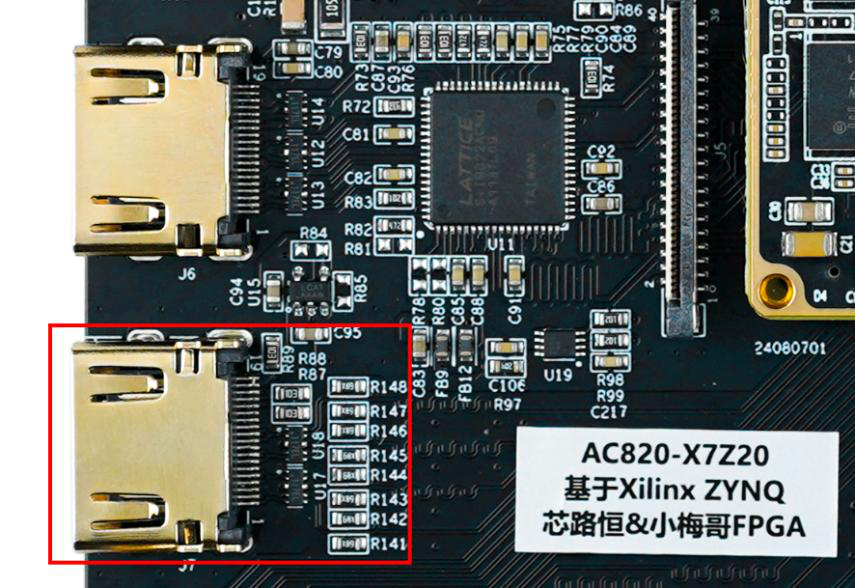

41  HDMI_2

图

接口

该接口由于采用高速差分数字编码传输方式，具有更强的抗干扰能力，现

VGA

阶段已经逐步代替了

接口，成为了所有数字视频传输设备的标配接口。该

接口的电路设计如下：

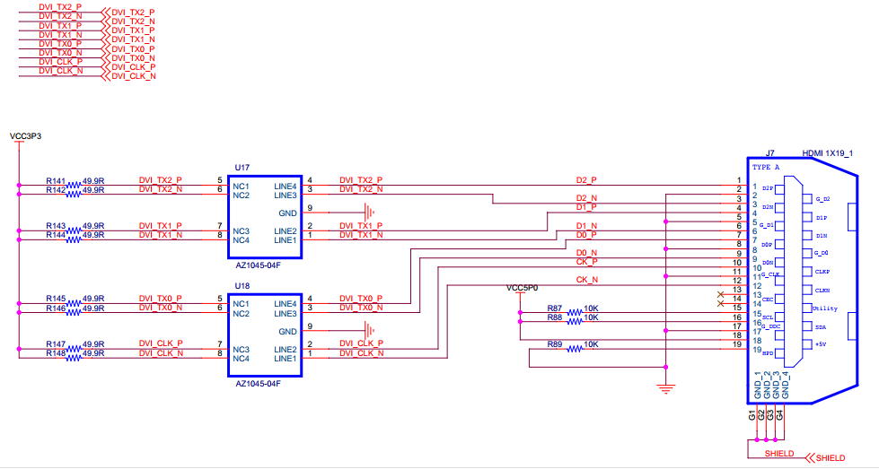

42  HDMI_2

图

接口电路

AC820 上设计的该接口（HDMI_2），支持HDMI 图像的输出，目前最高支持

输出高清1080P 的相关图像信息。该接口在开发板上的管脚分配表如下：

11  HDMI_2

表

引脚分配表

Signial Name

Pin NO.

Signial Name

Pin NO.

hdmi_clk_p

AB2

hdmi_clk_n

AB1

店铺：

官方网站：

https://xiaomeige.taobao.com

www.corecourse.cn

技术博客：

技术群组：

http://www.cnblogs.com/xiaomeige/

---
*下一页*

小梅哥FPGA 团队    武汉芯路恒科技

专注于培养您的FPGA 独立开发能力   开发板 培训 项目研发三位一体

hdmi_dat_p[2]

AB7

hdmi_dat_n[2]

AB6

hdmi_dat_p[1]

AB5

hdmi_dat_n[1]

AB4

hdmi_dat_p[0]

Y4

hdmi_dat_n[0]

AA4

千兆以太网接口

AC820

Realtek

RTL8211F-CG

PHY

芯路恒

开发板开发板通过两片

的

以太网

RTL8211F-CG

10M/100M/1000M

提供对以太网连接的支持，

是一片

自适应以太

RGMII/MII

MAC

PL

PS

网收发器，提供

接口的

连接。

端与

端各设计有一个千兆

PL

FPGA

以太网接口。

端网口既可以使用独立的

逻辑进行控制，实现纯硬件以

PS

MAC

PS

太网协议栈，也可以通过片上互联的方式连接到

的

外设，作为

的通

用网口使用。

其电路对应在开发板上的元件位置如下图所示：

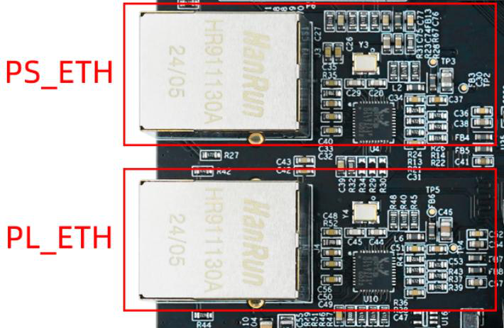

43

图

千兆以太网口

12  PS_ETH

表

引脚分配表

Signial Name

Pin NO.

PS_ENET0_RX_DATA0

PS_MIO23

PS_ENET0_RX_DATA1

PS_MIO24

PS_ENET0_RX_DATA2

PS_MIO25

PS_ENET0_RX_DATA3

PS_MIO26

PS_ENET0_RX_CLK

PS_MIO22

PS_ENET0_RX_DV

PS_MIO27

PS_ENET0_TX_DATA0

PS_MIO17

PS_ENET0_TX_DATA1

PS_MIO18

PS_ENET0_TX_DATA2

PS_MIO19

PS_ENET0_TX_DATA3

PS_MIO20

PS_ENET1_TX_GCLK

PS_MIO16

PS_ENET1_TX_EN

PS_MIO21

PS_ENET1_MDIO

PS_MIO53

PS_ENET1_MDC

PS_MIO52

店铺：

官方网站：

https://xiaomeige.taobao.com

www.corecourse.cn

技术博客：

技术群组：

http://www.cnblogs.com/xiaomeige/

---
*下一页*

小梅哥FPGA 团队    武汉芯路恒科技

专注于培养您的FPGA 独立开发能力   开发板 培训 项目研发三位一体

13  PL_ETH

表

引脚分配表

Signial Name

Signial Name

管脚分配

管脚分配

PL_ENET1_RX_DATA0

AA14

PL_ENET1_TX_DATA3

V20

PL_ENET1_RX_DATA1

Y14

PL_ENET1_TX_GCLK

W16

PL_ENET1_RX_DATA2

W15

PL_ENET1_TX_EN

U15

PL_ENET1_RX_DATA3

U16

PL_ENET1_MDC

AA19

PL_ENET1_RX_CLK

W17

PL_ENET1_MDIO

AB20

PL_ENET1_RX_DV

Y15

PL_ENET1_RESET

Y19

PL_ENET1_TX_DATA0

W18

PL_ENET1_TX_DATA1

Y16

PL_ENET1_TX_DATA2

AA18

USB2.0

高速传输

AC820

USB3320

USB2.0

芯路恒

开发板使用一片

芯片作为

收发器芯片，连

DR 1

PS

USB

CH334H

接到

芯片

端的

控制器上，又使用了一个

芯片作为

USBHUB

3

USBHOST

2

芯片，扩展出

路

接口供用户使用，其中

路使用标准

Type-A

USB2.0

Wifi

母口引出，用做

接口，另一路接到板载的无线局域网（

）电

USB3320

SLAVE

路上，以实现无线联网功能。此外

芯片也外扩了一个

模式的

TYPE-C

Device

U

接口，可以将开发板设定为

模式，实现例如

盘、声卡等多种

通用外设供用户使用。

USB Host1

USB Host2

USB PHY

USB HUB

(USB3320)

(CH334H)

USB WIFI模块

PS

PL

USB Device

44  USB2.0

图

接口

上图所述相关电路结构所对应的主要电路元件如下图所示：

店铺：

官方网站：

https://xiaomeige.taobao.com

www.corecourse.cn

技术博客：

技术群组：

http://www.cnblogs.com/xiaomeige/

---
*下一页*

小梅哥FPGA 团队    武汉芯路恒科技

专注于培养您的FPGA 独立开发能力   开发板 培训 项目研发三位一体

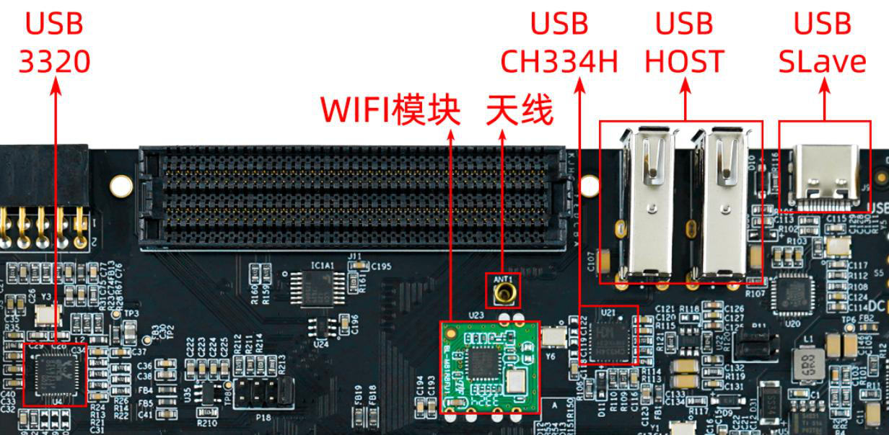

45  USB

图

接口及模块

USB Host

USB Slave

用户在使用时，

和

接口无法同时使用，用户可以通过

跳线帽进行切换，具体设置方式可以参考下图：

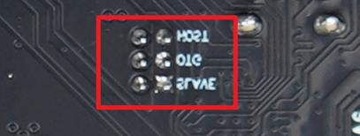

USB模式切换（背面）

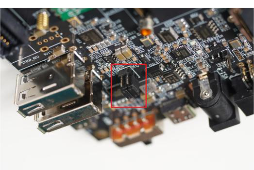

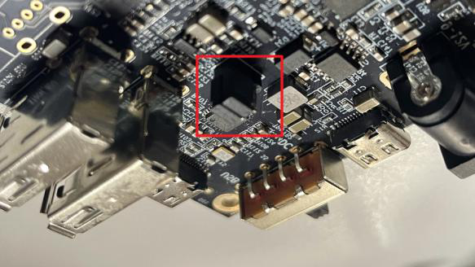

启动USB HOST接口

启动USB SLAVE接口

46 USB

图

接口切换

14  USB

表

管脚一览

Signial Name

Pin NO.

Signial Name

Pin NO.

PS_USB_DATA0

PS_MIO32

PS_USB_DATA6

PS_MIO38

PS_USB_DATA1

PS_MIO33

PS_USB_DATA7

PS_MIO39

PS_USB_DATA2

PS_MIO34

PS_USB_CLKOUT

PS_MIO36

PS_USB_DATA3

PS_MIO35

PS_USB_STP

PS_MIO30

PS_USB_DATA4

SP_MIO28

PS_USB_DIR

PS_MIO29

PS_USB_DATA5

PS_MIO37

PS_USB_NXT

PS_MIO31

店铺：

官方网站：

https://xiaomeige.taobao.com

www.corecourse.cn

技术博客：

技术群组：

http://www.cnblogs.com/xiaomeige/

---
*下一页*

小梅哥FPGA 团队    武汉芯路恒科技

专注于培养您的FPGA 独立开发能力   开发板 培训 项目研发三位一体

WiFi

模块

AC820

RTL8188FTV

wifi

USB2.0

开发板使用

模块来实现

功能，上述

功能

CH334H

4

USBHOST

WiFi

中，

芯片扩展出

路

接口，多出的一路便使用在

功能。

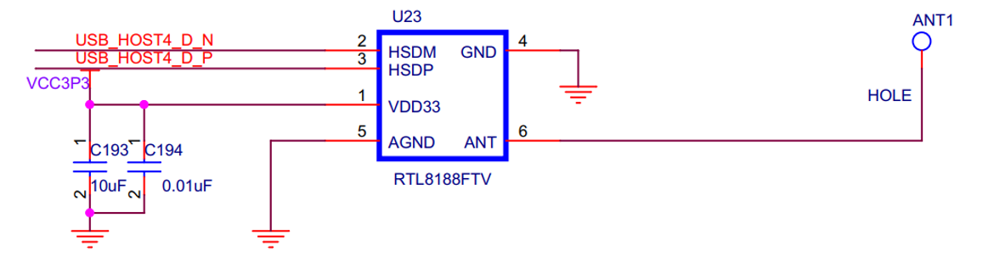

47  WiFi

图

模块电路

如下图所示，上述功能所对应相关元件在开发板上的位置即红色边框框选

RTL8188FTV

WIFI

的区域，绿色模块即为

模块。使用时，用户需要将

天线连接

WIFI

到

天线座上。

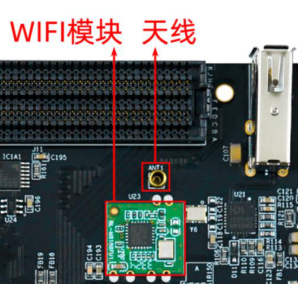

48 WiFi

图

模块及天线座

I2S

音频编解码接口

AC820

ES8388

ES8388

开发板的音频解码芯片使用的是

。

是一款低功耗、高

2-chADC

2-chDAC

质量的立体声编解码器，它由

、

、麦克风放大器、耳机放大

器、数字音效和模拟混频和增益功能组成。

其电路的主要元件在开发板上的位置如下图所示：

店铺：

官方网站：

https://xiaomeige.taobao.com

www.corecourse.cn

技术博客：

技术群组：

http://www.cnblogs.com/xiaomeige/

---
*下一页*

小梅哥FPGA 团队    武汉芯路恒科技

专注于培养您的FPGA 独立开发能力   开发板 培训 项目研发三位一体

49

图

音频输入输出接口及主要元件

15

表

音频编解码器管脚分配表

Signial Name

Pin NO.

Signial Name

Pin NO.

I2S_MCLK

W11

I2S_ADCDAT

W10

I2S_BCLK

R7

AUD_I2C_SDA

H22

I2S_RCLK

U7

AUD_I2C_SCL

G22

I2S_DACDAT

Y8

CMOS

摄像头专用接口

AC820

CMOS

OV7670

30W

OV7725

开发板板载的

接口可以用来连接

（

）、

30W

OV2640

200W

OV5640

500W

（

）、

（

）、

（

）等常用图像采集摄像头。配

SDRAM

合芯路恒板载的片外

数据存储器，用户可以进行数字图像的采集处理，

也可以很方便地验证图像领域的各种算法。

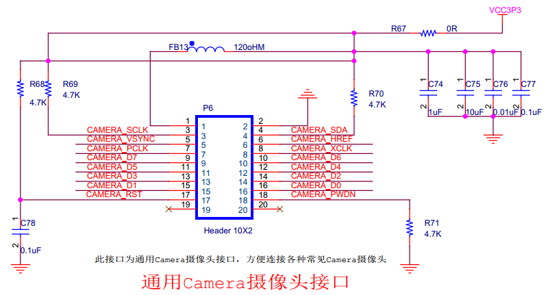

50

图

摄像头接口电路

COMS

摄像头专用接口在开发板上的位置如图所示：

店铺：

官方网站：

https://xiaomeige.taobao.com

www.corecourse.cn

技术博客：

技术群组：

http://www.cnblogs.com/xiaomeige/

---
*下一页*

小梅哥FPGA 团队    武汉芯路恒科技

专注于培养您的FPGA 独立开发能力   开发板 培训 项目研发三位一体

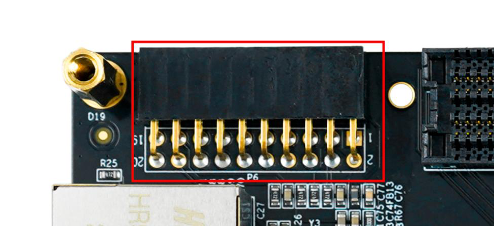

51

图

摄像头接口

16

表

开发板摄像头接口管脚分配表

Signial Name

Pin NO.

Signial Name

Pin NO.

Camera_D0

U17

Camera_D7

W21

Camera_D1

V17

Camera_SCLK

U20

Camera_D2

Y20

Camera_SDA

T22

Camera_D3

Y21

Camera_VSYNC

U21

Camera_D4

V18

Camera_HREF

T21

Camera_D5

V19

Camera_PCLK

Y18

Camera_D6

W20

Camera_XCLK

U22

Micro SD

EMMC

卡接口、

AC820

TXS02612RTWR

开发板使用了

芯片，该芯片是一个具有电压电平转

SDIO

Micro SD

EMMC

换功能的

端口扩展器，将

卡接口与

复用到了一起，连接

DR 1

PS

到了

的

端。

Micro SD

卡卡座的位置如图所示：

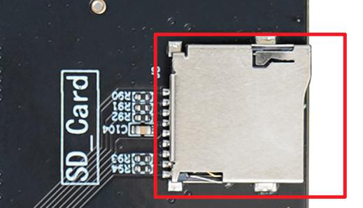

52 SD

图

卡接口

EMMC

的位置如图所示：

店铺：

官方网站：

https://xiaomeige.taobao.com

www.corecourse.cn

技术博客：

技术群组：

http://www.cnblogs.com/xiaomeige/

---
*下一页*

小梅哥FPGA 团队    武汉芯路恒科技

专注于培养您的FPGA 独立开发能力   开发板 培训 项目研发三位一体

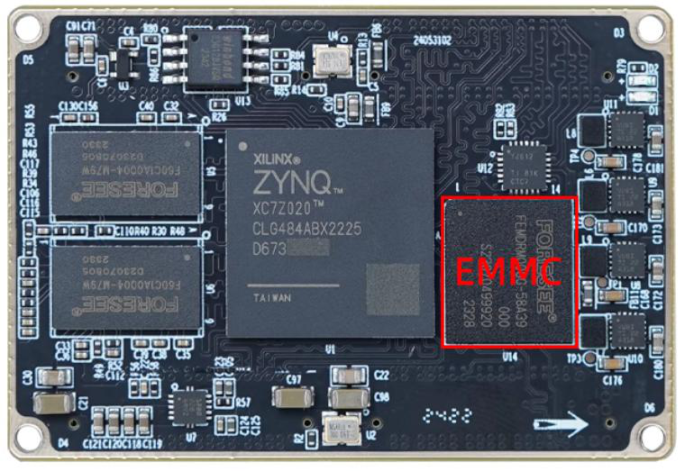

53

EMMC

图

板载

17  SD

表

卡接口管脚一览

Signial Name

Pin NO.

PS_SDMMC_DATA0

PS_MIO42

PS_SDMMC_DATA1

PS_MIO43

PS_SDMMC_DATA2

PS_MIO44

PS_SDMMC_DATA3

PS_MIO45

PS_SDMMC_CMD

PS_MIO41

PS_SDMMC_CLK

PS_MIO40

USB

调试接口

AC820

对于

开发板来说，进行调试时有两个端口，一个是底层调试使用的

JTAG

PS

JTAG

接口，一个是用于

端应用程序调试使用的串口。

接口用来实现

FPGA

PS

PS

配置文件的下载、调试，

寄存器的获取。串口用来在

运行裸机或

Linux

USB Cable

USB

系统时打印各种调试信息。这两种接口一般都使用

和

转

TTL

2

USB

串口实现。所以正常情况下，需要有

根

数据线连接电脑。由下图可

USB

以对

调试电路的结构进行一个比较清晰的理解

PS_UART_RXD

USB To TTL

Port1

PS_UART_TXD

UART

(CH9102F)

FPSoc

FPGA_TCK

Port2

4 Port USB HUB

FPGA_TDO

（

）

SL2.1S

USB Cable

Port3

JTAG

FPGA_TMS

(JTAG18M02HS2)

FPGA_TDI

Port4

USB Type-C

店铺：

官方网站：

https://xiaomeige.taobao.com

www.corecourse.cn

技术博客：

技术群组：

http://www.cnblogs.com/xiaomeige/

---
*下一页*

小梅哥FPGA 团队    武汉芯路恒科技

专注于培养您的FPGA 独立开发能力   开发板 培训 项目研发三位一体

54 USB

图

调试接口电路

USB

AC820

为了降低开发板调试时对电脑

接口的占用，芯路恒

开发板使用

SL2.1S

USB

4

了一个高速四端口集线器——

，将一个

端口拓展为

个，再分别将

USB Cable

USB

USB

和

转串口电路的

端连接到其中的两个端口，以实现简洁的

USB

USB

UART

CH9102F

USB

JTAG

连接，如下图所示。

转

芯片使用的是

，

转

JTAG18M02HS2

AC820

DR1

PS

芯片使用的是

。在

开发板上，使用的是

芯片

端

UART

PS_MIO48

PS_MIO49

的

外设，对应管脚为

和

。

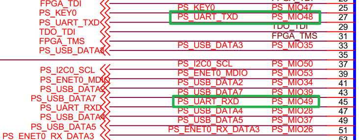

55 PS

UART

图

端

外设电路图

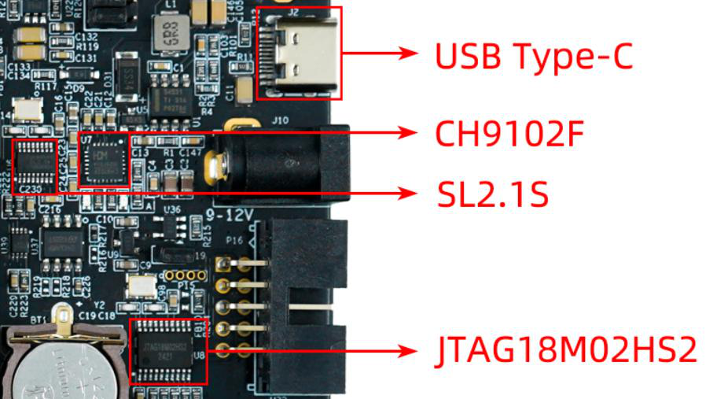

56 USB

图

调试电路相关元件

18

表

调试接口管脚一览

Signial Name

Pin NO.

PS_UART_TXD

PS_MIO48

PS_UART_RXD

PS_MIO49

FMC

接口

AC820

1

160pin

LPC

FMC

芯路恒

开发板提供了

个

，

规格的标准

接口，可适

FMC

用于各类高速信号传输应用场景。可以对接市面上各种

子卡模块，如黑金

FL9627

FL1010

FMCADC-9434

系列的

、

，红麦野电子的

等模块，这个接口在开

发板上位置如下：

店铺：

官方网站：

https://xiaomeige.taobao.com

www.corecourse.cn

技术博客：

技术群组：

http://www.cnblogs.com/xiaomeige/

---
*下一页*

小梅哥FPGA 团队    武汉芯路恒科技

专注于培养您的FPGA 独立开发能力   开发板 培训 项目研发三位一体

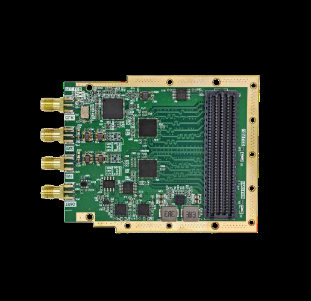

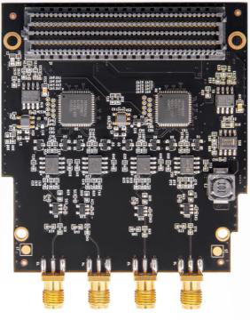

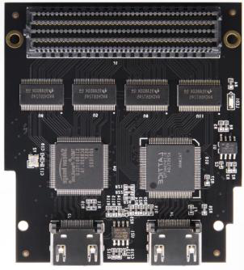

57 FMC

图

子卡模块

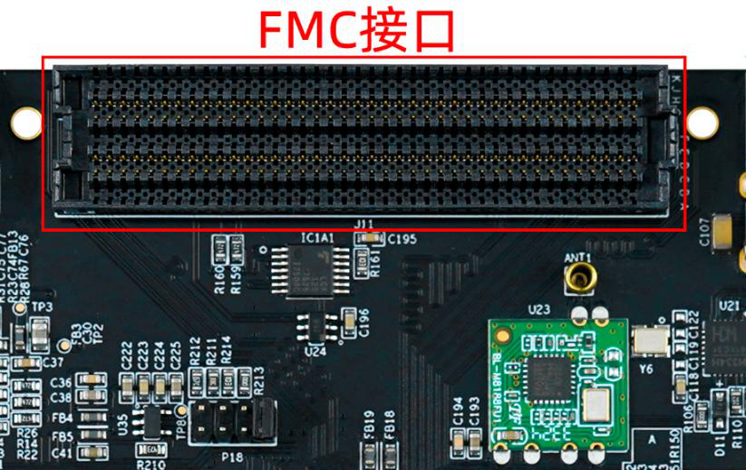

58 FMC

图

接口位置

IO

可调

供电电压

IO

由于使用差分

时，使用的电平标准不一样，为了兼容多种电平标准，我

FMC

Bank

们还专为

接口所在的

设计了一路供电。通过调整供电电路的输出电

IO Bank

压，就可以改变该

的供电电压，从而支持多种电平标准。该部分电路

如下图所示：

店铺：

官方网站：

https://xiaomeige.taobao.com

www.corecourse.cn

技术博客：

技术群组：

http://www.cnblogs.com/xiaomeige/

---
*下一页*

小梅哥FPGA 团队    武汉芯路恒科技

专注于培养您的FPGA 独立开发能力   开发板 培训 项目研发三位一体

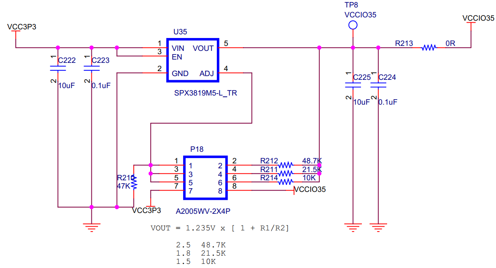

59

图

供电电路

该电路在开发板上的位置如图所示：

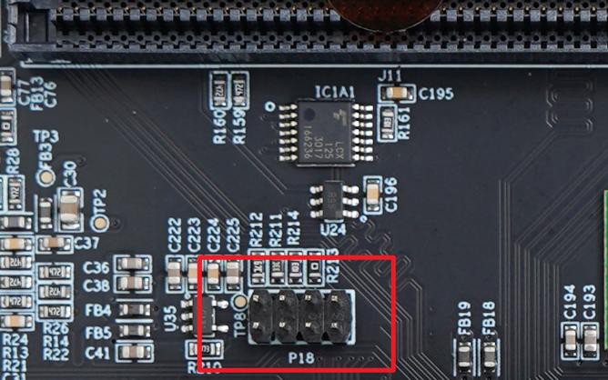

60

图

电压选择

P18

VCCIO

该电路使用跳线帽通过排针

来对

的电压进行控制。如下图所示，

3.3V

1.5V

1.8V

2.5V

在背面的丝印上标注了相关内容，有

、

、

、

四个电压标准可

供使用。

店铺：

官方网站：

https://xiaomeige.taobao.com

www.corecourse.cn

技术博客：

技术群组：

http://www.cnblogs.com/xiaomeige/

---
*下一页*

小梅哥FPGA 团队    武汉芯路恒科技

专注于培养您的FPGA 独立开发能力   开发板 培训 项目研发三位一体

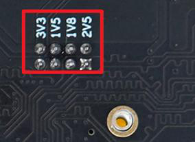

61

图

背部供电电压丝印

PL

GPIO

通用

端

接口

AC820

1

40Pin

GPIO0

PL

芯路恒

开发板提供了

个

的通用标准接口

，用于

端

GPIO

的

接口。这个接口在开发板上位置如下：

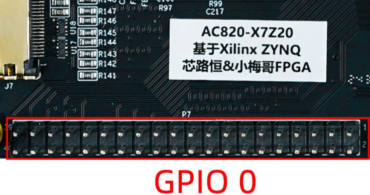

62 GPIO

图

接口

36

FPGA

IO

IO

其中有

个端口直接连接到

芯片的

引脚。这些

都是完全独立

DC+5V(VCC5.0)

的，没有在板上再与其他任何功能复用。同时该接口还输出了

，

DC+3.3V(VCC3P3)

GPIO0

FPGA

，和两个接地的引脚。下图展示了

的端子与

管

脚的连接关系。

店铺：

官方网站：

https://xiaomeige.taobao.com

www.corecourse.cn

技术博客：

技术群组：

http://www.cnblogs.com/xiaomeige/

---
*下一页*

小梅哥FPGA 团队    武汉芯路恒科技

专注于培养您的FPGA 独立开发能力   开发板 培训 项目研发三位一体

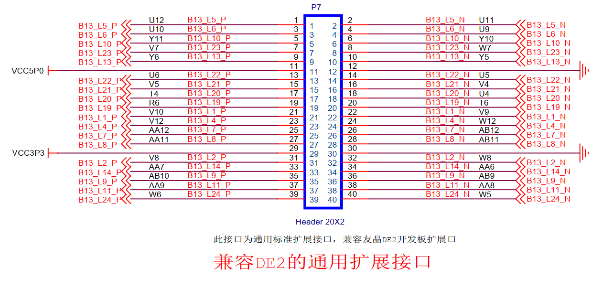

63  40pin

GPIO0

图

拓展接口

及管脚编号

GPIO0

36

对于

接口，

个输出引脚都使用的差分信号，端口使用标准的

IDC3-40

ACM7606

ACM9767

ACM68013

接口，能够适配小梅哥店铺包含

、

、

等

在内的众多模块。

GPIO

接口对应的管脚分配表如下：

19  AC820

GPIO

表

开发板

管脚分配表

Signial Name

Pin NO.

Signial Name

Pin NO.

PL_GPIO0_0

U12

PL_GPIO0_1

U11

PL_GPIO0_2

U10

PL_GPIO0_3

U9

PL_GPIO0_4

Y11

PL_GPIO0_5

Y10

PL_GPIO0_6

V7

PL_GPIO0_7

W7

PL_GPIO0_8

Y6

PL_GPIO0_9

Y5

5V

GND

电源

接地

PL_GPIO0_10

U6

PL_GPIO0_11

U5

PL_GPIO0_12

V5

PL_GPIO0_13

V4

PL_GPIO0_14

T4

PL_GPIO0_15

U4

PL_GPIO0_16

R6

PL_GPIO0_17

T6

PL_GPIO0_18

V10

PL_GPIO0_19

V9

PL_GPIO0_20

V12

PL_GPIO0_21

W12

PL_GPIO0_22

AA12

PL_GPIO0_23

AB12

PL_GPIO0_24

AA11

PL_GPIO0_25

AB11

3.3V

GND

电源

接地

PL_GPIO0_26

V8

PL_GPIO0_27

W8

PL_GPIO0_28

AA7

PL_GPIO0_29

AA6

PL_GPIO0_30

AB10

PL_GPIO0_31

AB9

PL_GPIO0_32

AA9

PL_GPIO0_33

AA8

PL_GPIO0_34

W6

PL_GPIO0_35

W5

店铺：

官方网站：

https://xiaomeige.taobao.com

www.corecourse.cn

技术博客：

技术群组：

http://www.cnblogs.com/xiaomeige/

---
*下一页*

小梅哥FPGA 团队    武汉芯路恒科技

专注于培养您的FPGA 独立开发能力   开发板 培训 项目研发三位一体

PS

GPIO

通用

端

接口

AC820

1

12Pin

PS

GPIO

还提供了

个

的接口用于引出

端的部分

接口。该接

DC+5V(VCC5.0)

DC+3.3V(VCC3P3)

口同样输出了

，

，和两个接地的引脚，端口

PS_GPIO

PS_GPIO

PS

名为

。下图展示了

的端子与

端管脚的连接关系。

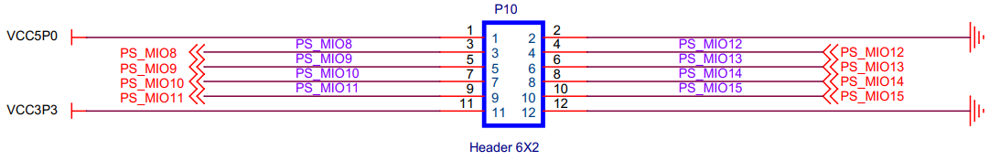

64  PS

图

端通用接口电路

GPIO

P10

接口

在开发板上的位置如下图所示：

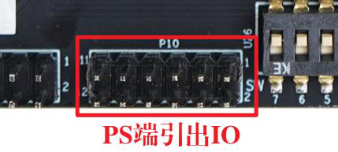

65  PS

IO

图

端引出

店铺：

官方网站：

https://xiaomeige.taobao.com

www.corecourse.cn

技术博客：

技术群组：

http://www.cnblogs.com/xiaomeige/

---
*下一页*

小梅哥FPGA 团队    武汉芯路恒科技

专注于培养您的FPGA 独立开发能力   开发板 培训 项目研发三位一体

【第三部分】正式开始学习

在完成了上述开发环境的搭建以及开发板基本功能的测试之后，大家就可

以根据自己的兴趣方向，基于本开发板进行学习了。以下介绍大家学习时候需

要注意的事项：

1

、踏实严谨，以高中学习数学知识的态度，跟着我们的文档资料学习，并

积极动手跟着文档资料里的内容进行练习

2

、积极求助，学习中遇到疑惑或者自己无法解决的问题，可以到您购买产

品时我们给您提供的客户专属学习指导群内提问。我们的教程作者会为您答疑

解惑

3

、提问时请整理好您的提问内容，确保提问内容饱满，问题描述清晰，相

关信息提供完整，如相关代码截图，报错信息截图。截图时尽量采用截桌面全

屏的方式，避免信息提供不充分，耽误您的学习时间。

4

、既是上帝，也是师友，学习提问过程中，您和我们，都需要尽量保持低

调谦和的沟通态度，避免因为学习和知识问题，导致客户关系紧张。

5

、积极主动，能够通过查询教程、文档、原理图、芯片原厂器件手册解决

的问题，尽量自行查询解决。这样，在给我们降低售后负担的同时，更能培养

您独立思考，自主解决问题的能力。

店铺：

官方网站：

https://xiaomeige.taobao.com

www.corecourse.cn

技术博客：

技术群组：

http://www.cnblogs.com/xiaomeige/

---
*下一页*

小梅哥FPGA 团队    武汉芯路恒科技

专注于培养您的FPGA 独立开发能力   开发板 培训 项目研发三位一体

修订说明：

V1.0

2025.11.18

xilinx zynq

将原用户手册拆分为安路飞龙和

两部分

V1.1

2025.11.27

修改音频接口部分引脚错误

店铺：

官方网站：

https://xiaomeige.taobao.com

www.corecourse.cn

技术博客：

技术群组：

http://www.cnblogs.com/xiaomeige/

