# 04__Linux教程_基于Linux的嵌入式系统开发和应用教程V1_1
*来源 PDF: `04_【Linux教程】基于Linux的嵌入式系统开发和应用教程V1_1.pdf`*

---

小梅哥FPGA 团队    武汉芯路恒科技

专注于培养您的FPGA 独立开发能力   开发板 培训 项目研发三位一体

ping

Linux

基于

的嵌入式系统开发和应用教程

店铺：

官方网站：

https://xiaomeige.taobao.com

www.corecourse.cn

技术博客：

技术群组：

http://www.cnblogs.com/xiaomeige/

---
*下一页*

小梅哥FPGA 团队    武汉芯路恒科技

专注于培养您的FPGA 独立开发能力   开发板 培训 项目研发三位一体

前

言

Xilinx

Zynq-7000

自

推出新一代全可编程片上系统

系列芯片后，该系列芯片

FPGA

凭借其软件可编程性与片上

的硬件可编程性的完美结合，迅速得到各领

Zynq-7000

域电子工程师的热烈欢迎。

系列芯片凭借其出色的性价比，当前已经

成为市面上一款无可争议的片上系统设计主流芯片。

传统的硬件设计架构，主要以板上系统为核心，围绕其进行相关硬件设计

Zynq7000

与验证。与板上系统相比，支持片上系统的主控制器（如

系列芯片）

的解决方案具有如下优势：

⚫

成本更低

⚫

设计更稳定

⚫

数据传输更安全

⚫

整体系统速度更高

⚫

实现相同的功能比板上系统具有更小的物理尺寸和更低的功耗

Zynq

既然

系列芯片片上系统具有如此优异的设计性能，那么这也意味着对

设计工程师的设计能力需要提出更高的要求。而硬件设计工程师的设计能力，

毫无疑问必须要从实验和实践中获得。

AC820

针对以上需求，小梅哥团队强势推出

系列开发板作为实验平台，以

迎合各领域设计工程师的学习、验证和实践需求，并随开发板同步推出本套学

习教材。

本套教程按照知识内容，划分为三个部分：

⚫

HDL

FPGA

Verilog

《基于

的

逻辑设计与验证教程》讲解基于

的逻辑设

计

⚫

C

Zynq

ARM

《基于

编程的

裸机程序设计与应用教程》讲解

嵌入式裸

C

机

编程

⚫

Linux

Linux

《基于

的嵌入式系统开发和应用教程》讲解

操作系统的应

用和驱动开发

Linux

本文档为《基于

的嵌入式系统开发和应用教程》，另外两份教程内

AC820

A

01_

容，可以到

开发板资料盘【

盘】【

教材文档】文件夹下查看。

本文档从实验内容来看难度循序渐进，内容环环相扣，涵盖：

店铺：

官方网站：

https://xiaomeige.taobao.com

www.corecourse.cn

技术博客：

技术群组：

http://www.cnblogs.com/xiaomeige/

---
*下一页*

小梅哥FPGA 团队    武汉芯路恒科技

专注于培养您的FPGA 独立开发能力   开发板 培训 项目研发三位一体

⚫

Ubuntu

Linux

Ubuntu

安装

系统并搭建

编程环境，使用

的各种操作，在

Ubuntu

Linux

下编程和使用各种工具的方法，以及将

操作系统移植到

Zynq

开发板上并运行各种外设和功能。

⚫

Linux

I/O

Linux

基于

标准文件

设备的读写，

驱动的编写和编译以及加

linux

载，还有基于驱动程序编写应用程序，在

系统下运行。

本文档从知识传授的角度来看，除了介绍实验内容涉及的相关内外器件配

置和使用方法外，还不失时机介绍了如下内容：

⚫

Xilinx Zynq

Linux

系列在

下开发环境的搭建

⚫

Linux

系统的各种命令行的操作

⚫

Petalinux

工具的使用方法

⚫

Linux

系统移植的操作与原理

⚫

驱动、应用的编译与加载

本套文档每次有更新，都会第一时间发布到我们技术论坛的专用帖下面，

大家可以前往下述帖子中核对和下载本文档的最新版。

AC820

Xilinx ZYNQ-7020

FPSoC

【

】基于

或安路飞龙

开发板用户自助服务

+

手册【底板

核心板】：

https://www.corecourse.cn/forum.php?mod=viewthread&tid=29690

同时，对于本套文档内容有任何意见和建议，也欢迎到到论坛中的相应板

块留言讨论。或者直接在客户群内和我们的技术人员沟通反馈。

AC820

由于适配本套学习教程的众多硬件资源由

开发板和各类扩展模块共

同完成，所以在购买套餐时，建议读者同时搭配购买、相应的拓展模块，以获

得更为良好的学习效果。

AC820

ARM

同时

开发板采用分体式设计，可以同时兼容安陆飞龙

版的

DR1M90GEG484

RISC-V

DR1V90GEG484

ZYNQ

、安陆飞龙

版的

以及

系列的

xc7z020clg484-2

芯片。

FPGA

6

本套文档内容，为小梅哥

团队历时

个月编写，其中大部分内容为

FPGA

小梅哥

团队原创，原创部分内容，版权归武汉芯路恒科技有限公司所有，

任何企业和个人，未经书面允许，不得使用文档中的部分或全部内容进行任何

商业或变相推广行为，如收费线下培训或收费网课，销售非本公司出品的硬件

板卡，或是通过在线销售平台直接销售资料内容，或是以本套资料内容为基础，

制作不收费的开源网络课程。

店铺：

官方网站：

https://xiaomeige.taobao.com

www.corecourse.cn

技术博客：

技术群组：

http://www.cnblogs.com/xiaomeige/

---
*下一页*

小梅哥FPGA 团队    武汉芯路恒科技

专注于培养您的FPGA 独立开发能力   开发板 培训 项目研发三位一体

对于合理的公益性或非盈利性情况，如高校内部课程，企业内训等，可以

直接使用本套资料而无需联系我们授权。

数千页的手把手学习教程，配合精致的开发板搭载紧凑丰富的硬件实体，

简约的开发环境，完善的学习指导和售后服务保障，相信一定能让你学有所获，

学有所成！

店铺：

官方网站：

https://xiaomeige.taobao.com

www.corecourse.cn

技术博客：

技术群组：

http://www.cnblogs.com/xiaomeige/

---
*下一页*

小梅哥FPGA 团队    武汉芯路恒科技

专注于培养您的FPGA 独立开发能力   开发板 培训 项目研发三位一体

目录

Linux

........................................................ 1

基于

的嵌入式系统开发和应用教程

Ubuntu

............................................................................................. 10

搭建

系统

1.1 Linux

..................................................................................... 10

系统介绍

1.2

VMware .................................................................... 12

安装虚拟机软件

1.3

............................................................................................ 19

创建虚拟机

1.4 Ubuntu

........................................................................... 28

操作系统安装

1.5

................................................................................................ 41

本章小结

Ubuntu

.............................................................................................. 43

系统学习

2.1 Ubuntu

................................................................................... 43

系统操作

2.2 Ubuntu

................................................................................... 50

终端操作

2.3

Shell

..................................................................................... 51

常用

命令

2.3.1 Shell

.................................................................................... 52

介绍

2.3.2

ls ................................................................. 54

目录信息查看命令

2.3.3

pwd ............................................................. 55

当前路径显示命令

2.3.4

clear ............................................................................ 55

清屏命令

2.3.5

cd ........................................................................ 56

目录切换命令

2.3.6

uname ......................................................... 57

系统信息查看命令

2.3.7

sudo .................................................... 58

切换用户执行身份命令

2.3.8

adduser ............................................................... 59

添加用户命令

2.3.9

passwd ................................................................ 60

修改用户密码

2.3.10

deluser .............................................................. 61

删除用户命令

2.3.11

su ...................................................................... 61

切换用户命令

2.3.12

cat ............................................................. 62

显示文件内容命令

2.3.13

................................................................................... 63

建立链接

2.3.14

ifconfig ......................................... 65

显示和配置网络属性命令

2.3.15

man ................................................................... 67

系统帮助命令

2.3.16

install ................................................................ 68

软件安装命令

2.3.17

date ........................................................................... 68

时间显示

2.3.18

kill .................................................................... 70

停止某个进程

2.3.19

............................................................................... 71

重启和关机

2.4 APT

....................................................................................... 71

下载工具

2.4.1 apt-get

................................................................................ 72

运用

2.4.2

................................................................................. 73

更新数据库

店铺：

官方网站：

https://xiaomeige.taobao.com

www.corecourse.cn

技术博客：

技术群组：

http://www.cnblogs.com/xiaomeige/

---
*下一页*

小梅哥FPGA 团队    武汉芯路恒科技

专注于培养您的FPGA 独立开发能力   开发板 培训 项目研发三位一体

2.4.3

............................................................................. 74

查看依赖关系

2.4.4

..................................................................................... 74

软件安装

2.4.5

..................................................................................... 75

软件更新

2.4.6

..................................................................................... 76

软件卸载

2.5 Ubuntu

Vi/Vim

..................................................... 77

下文本编辑

编辑器

2.5.1

Vim

........................................................................... 78

进入

编辑

2.5.2 Vim

............................................................................. 78

模式切换

2.5.3 Vim

............................................................................ 80

指令操作

2.6 Linux

..................................................................................... 84

文件系统

2.6.1 Linux

.................................................................. 86

文件系统结构

2.6.2

............................................................................. 89

文件操作命令

2.6.3

..................................................................... 95

文件压缩和解压缩

2.6.4

....................................................................... 101

文件查询和搜索

2.6.5

................................................................................... 103

文件类型

2.7 Linux

........................................................................... 104

用户权限管理

2.7.1

................................................................................... 104

用户系统

2.7.2

................................................................................... 105

权限管理

2.8 Linux

................................................................................... 111

磁盘管理

2.8.1 Linux

........................................................ 111

磁盘管理基本概念

2.8.2

........................................................................... 112

磁盘管理命令

2.9

.............................................................................................. 116

本章小结

................................................................................................. 118

开发环境搭建

3.1 Ubuntu

Windows

........................................................... 118

和

文件互传

3.1.1 Windows

FTP

................................................. 119

下

客户端安装

3.1.2 FileZilla

.................................................................... 121

软件设置

3.2 Ubuntu

Windows

................................................... 124

和

文件本地共享

3.3 Ubuntu

tftp

............................................................. 132

系统搭建

服务器

3.4 Ubuntu

NFS

SSH

...................................................... 134

下

和

服务开启

3.4.1 NFS

.......................................................................... 134

服务开启

3.4.2

SSH

......................................................................... 136

开启

服务

3.5 Petalinux

...................................................................................... 137

安装

3.5.1

Petalinux

.............................................................. 137

获取

安装包

3.5.2

Petalinux

.............................................................. 138

进行

的安装

3.5.3

Petalinux

......................................................... 143

设置

环境变量

店铺：

官方网站：

https://xiaomeige.taobao.com

www.corecourse.cn

技术博客：

技术群组：

http://www.cnblogs.com/xiaomeige/

---
*下一页*

小梅哥FPGA 团队    武汉芯路恒科技

专注于培养您的FPGA 独立开发能力   开发板 培训 项目研发三位一体

3.6

sdk ............................................................................................... 145

构建

3.6.1 SDK

.......................................................................... 145

是什么？

3.6.2

SDK .................................................................................. 145

安装

3.6.3

SDK .................................................................................. 148

使用

3.7 MobaXterm

................................................................. 149

软件安装使用

3.7.1 MobaXterm

.............................................................. 149

软件安装

3.7.2

MobaXterm

............................................. 151

使用

进行串口连接

3.7.3

MobaXterm

SSH

............................................ 153

使用

进行

连接

3.8 Linux

JTAG cable

...................................................... 157

系统安装

驱动

3.9

.............................................................................................. 158

本章小结

ZYNQ

Linux

.................................................... 159

基于

的

开发流程快速体验

4.1

zynq

.................................................................... 160

搭建最简

硬件系统

4.2 linux

..................................................................................... 176

系统移植

4.2.1

................................................................... 176

构建基本文件结构

4.2.2

....................................................................... 179

修改设备树文件

4.2.3

........................................................................... 181

编译启动镜像

4.2.4

Rootfs ............................................................................... 182

编译

4.2.5

SD

....................................................................... 185

制作

启动卡

4.2.6

SD

................................................................ 187

将文件拷贝到

卡

4.2.7

............................................................................... 189

启动开发板

4.3

.............................................................................................. 191

本章小结

Linux

................................................................. 192

基础外设在

系统下的使用

5.1

...................................................................................... 192

网络连接测试

5.2

...................................................................................... 194

按键功能测试

5.3 GPIO

LED

.............................................................................. 194

的

测试

5.4

.............................................................................................. 195

本章小结

ZYNQ

..................................................................... 196

的启动与配置过程介绍

6.1 ZYNQ

.............................................................................. 196

的启动流程

6.2 linux

............................................................................................. 198

启动

6.3

.............................................................................................. 199

本章小结

uboot

....................................................................................................... 200

概述

7.1 bootloader ............................................................................................ 200

7.2 uboot .................................................................................................... 200

店铺：

官方网站：

https://xiaomeige.taobao.com

www.corecourse.cn

技术博客：

技术群组：

http://www.cnblogs.com/xiaomeige/

---
*下一页*

小梅哥FPGA 团队    武汉芯路恒科技

专注于培养您的FPGA 独立开发能力   开发板 培训 项目研发三位一体

7.2.1

............................................................... 200

自身可开机直接启动

7.2.2

................................................... 201

引导内核启动并给内核传参

7.2.3

............................................................... 201

能提供系统部署功能

7.2.4

soc

............................................... 201

能进行

级和板级硬件管理

7.2.5 uboot

“

” ................................................................. 201

的

生命周期

7.3 uboot

................................................................................ 202

的工作方式

7.3.1

uboot.bin .......................................................... 202

裸机程序镜像

7.3.2 uboot

shell

....................................................... 202

的命令式

界面

7.3.3

uboot

2

................ 202

掌握

使用的

个关键点：命令和环境变量

7.4

.............................................................................................. 203

本章小结

Linux

...................................................................................... 204

设备树的原理

8.1

...................................................................................... 204

什么是设备树

8.2

.................................................................................. 205

设备树基本格式

8.3

.............................................................................................. 211

本章小结

Linux

I/O

.......................................................... 212

基于

标准文件

的设备读写

9.1

I/O ................................................................................... 212

什么是文件

9.2

IO

............................................................ 212

基于文件

操作的一般方法

9.2.1

............................................................................... 212

文件描述符

9.2.2

open

................................................................... 213

打开设备（

）

9.2.3

write

...................................................... 213

向设备写入数据（

）

9.2.4

read

............................................................ 213

读取设备数据（

）

9.2.5

ioctl

................................................................... 214

杂项操作（

）

9.2.6

close

.................................................................. 215

关闭设备（

）

9.2.7

................................................................................... 215

其它操作

9.3

IO

I2C

................................................................ 215

使用文件

实现

编程

9.4

.............................................................................................. 219

本章小结

Linux

................................................................................ 220

驱动编写与编译

10.1 PWM

............................................................................. 220

控制器设计

10.1.1

PWM IP ......................................................................... 222

创建

10.1.2 IP

............................................................................ 222

核的编辑

10.1.3

IP

............................................................... 231

自定义

核的使用

10.1.4

PWM

............................................................. 234

搭建

系统工程

10.2

........................................................................ 236

基本字符型设备驱动

10.2.1

............................................................. 237

字符型设备驱动框架

店铺：

官方网站：

https://xiaomeige.taobao.com

www.corecourse.cn

技术博客：

技术群组：

http://www.cnblogs.com/xiaomeige/

---
*下一页*

小梅哥FPGA 团队    武汉芯路恒科技

专注于培养您的FPGA 独立开发能力   开发板 培训 项目研发三位一体

10.2.2 PWM

.......................................................... 244

控制器驱动编写

10.2.3

pwm_drv.h

........................................................ 248

新建

头文件

10.2.4

Makefile ................................................................. 248

驱动编译

10.2.5 Ubuntu

........................................................ 250

下编译设备驱动

10.2.6

......................................................................... 251

设计测试程序

10.3

............................................................................................ 255

板级验证

10.3.1

......................................................................... 255

系统所需硬件

10.3.2

................................................................................. 255

硬件连接

10.3.3

............................................................. 256

运行测试（待测试）

10.4

............................................................................................ 257

本章小节

HDL

FPGA

................................................ 259

基于

的

逻辑设计与验证教程

C

Zynq

....................................... 260

基于

编程的

裸机程序设计与应用教程

店铺：

官方网站：

https://xiaomeige.taobao.com

www.corecourse.cn

技术博客：

技术群组：

http://www.cnblogs.com/xiaomeige/

---
*下一页*

小梅哥FPGA 团队    武汉芯路恒科技

专注于培养您的FPGA 独立开发能力   开发板 培训 项目研发三位一体

Ubuntu

搭建

系统

章节导读

什么是嵌入式Linux 开发平台？可以理解为一台电脑，嵌入式Linux 开发

平台跟我们平时用的个人电脑没有本质上的区别，在嵌入式Linux 开发平台也

有个人电脑上所描述的处理器CPU、内存、硬盘、显示器、网口、USB 接口、耳

机接口等等。

ARM 只是一个32 位处理器，可以像51 单片机一样用汇编直接操作它的寄存

器、RAM、ROM 等内部资源，当然也可以用Ｃ语言！那么如果只是把ARM 当做单

片机来用，那就有点大材小用了，那也就没必要学什么linux 了。

事实上，ARM通常都是用来做比较复杂的系统的，而且一般都是多任务系统

的，当任务比较多，程序比较大的时候，只用汇编语言和Ｃ语言恐怕难以胜任，

所以我们应该给ARM 配一个操作系统，用来管理这些任务，那么对于ARM，我们

可以使用哪些操作系统呢？Ｗindows XP 行吗？当然不行，太大了，不适合做嵌

入式，微软倒是推出了专门针对嵌入式系统开发的WinCE，可是这可不是免费的，

而且不提供源码的。那么什么样的操作系统才能用于做嵌入式呢？嵌入式操作

系统通常有Ｖxworks,ＷinCE,uC/OS,Linux/ucLinux 等。而uC/OS、Linux 因为

其免费，而且开源，适合学习者进行学习。装有linux 的ARM 处理器，只能运

行linux 环境下编译出来的应用程序，不能编译我们常用的Ｗindows 环境下编

译出来的应用程序。

1.1

Linux

系统介绍

Linux

Linux

是什么？从技术上来说，李纳斯•托瓦兹开发的

只是一个内核。

内核指的是一个提供设备驱动、文件系统、进程管理、网络通信等功能的系统

软件，内核并不是一套完整的操作系统，它只是操作系统的核心。一些组织或

Linux

厂商将

内核与各种软件和文档包装起来，并提供系统安装界面和系统配

Linux

置、设定与管理工具，就构成了

的发行版本。

VMware Workstation Pro

Linux

在第一章节我们将通过安装

软件，获得安装

Linux

系统的基本软硬件。安装好虚拟机后，就可以在该虚拟机中安装

操作系

Linux

统了。

有众多发行版，就算是常用的发行版也有十来种。不同发行版本之

间，在安装和使用上都有差异。选择一个合适的发行版，首先要考虑该发行版

店铺：

官方网站：

https://xiaomeige.taobao.com

www.corecourse.cn

技术博客：

技术群组：

http://www.cnblogs.com/xiaomeige/

---
*下一页*

小梅哥FPGA 团队    武汉芯路恒科技

专注于培养您的FPGA 独立开发能力   开发板 培训 项目研发三位一体

的流行度，越流行的发行版，用户越多，遇到问题寻求技术支持也很方便，如

果选择小众的发行版，寻求技术支持就不那么方便了。

其次要考虑该发行版使用的难易程度，通常来说，越简单易用的发行版越

流行。

Linux

Linux

进行嵌入式

开发，还必须考虑嵌入式

开发工具的问题。最好选

择处理器半导体厂商以及开发平台厂商所选择的发行版，这样能够直接使用半

导体或者开发平台原厂提供的各种工具，减少开发过程中的障碍。

Linux

Linux

在

内核的发展过程中，各种

发行版本起了巨大的作用，正是它

Linux

Linux

Red Hat

们推动了

的应用，从而让更多的人开始关注

。因此，把

、

Ubuntu

SUSE

Linux

Linux

、

等直接说成

其实是不确切的，它们是

的发行版本，

Linux

更确切地说，应该叫作“以

为核心的操作系统软件包”。

Linux

Linux

的各个发行版本使用的是同一个

内核，因此在内核层不存在什

么兼容性问题，每个版本有不一样的感觉，只是在发行版本的最外层（由发行

商整合开发的应用）才有所体现。

Linux

系统是一个高度可裁剪的系统，支持用户根据自己实际的硬件平台，

Linux

选择需要的驱动和功能，并编译得到

系统镜像。通过此种方式，可以使

Linux

得编译得到的

系统镜像文件尺寸非常的小，以便于部署到各种嵌入式硬

件板卡上。

SoC FPGA

开发基于

的嵌入式系统应用，如果仅仅使用基于虚拟地址映射

Linux

Linux

Linux

的方式开发

应用程序，无需开发

内核驱动和修改

内核配置，

Linux

Linux

实际上是可以不用安装

操作系统作为主机环境的。如果需要编写

内

Linux

Linux

核驱动，或者修改

内核的配置，则必须先获得一个

主机环境，通常

Linux

情况下，可以通过以下三种方式获得

环境。

1.

双系统安装

Windows

如果没有闲置的计算机，或者现有

系统的计算机有足够的硬盘空

Linux

间，可以考虑划分一部分硬盘空间，用于安装

操作系统，最终形成双系

统计算机。此种方式经济实惠，且对计算机硬件要求不太高。但是安装双系统

有一定的风险，一不小心有可能造成整个硬盘数据丢失。而且在开发过程使用

Windows

到

工具时，需进行系统切换，不是很方便。

2.

全新硬盘安装

Linux

如果有足够的计算机可用，可以选择一台计算机全新安装

操作系统。

店铺：

官方网站：

https://xiaomeige.taobao.com

www.corecourse.cn

技术博客：

技术群组：

http://www.cnblogs.com/xiaomeige/

---
*下一页*

小梅哥FPGA 团队    武汉芯路恒科技

专注于培养您的FPGA 独立开发能力   开发板 培训 项目研发三位一体

此种方式不用考虑多系统并存的问题，且对计算机硬件硬件要求不太高。但是

Windows

也存在无法方便的使用

系统的问题。

3.

安装虚拟机

Windows

如果计算机配置较高，可以考虑虚拟机方案。在

下安装虚拟机软

Linux

件，然后通过虚拟机软件创建一台虚拟电脑，最后在虚拟电脑中安装

操

Linux

Linux

Windows

作系统；也可以安装

，在

中安装虚拟机再安装

。常用的虚

VMware

Virtual Box

Virtual PC

拟机软件有

、

和

等，不同虚拟机软件的使用方法

VMware

稍有不同。下文以

为例进行介绍。

Linux

Windows

优点：安装和使用

都很方便；还可同时使用

系统。

4GB

缺点：对计算机硬件要求高，特别是内存，推荐

及以上。

Windows

Windows

在

下使用虚拟机，除了可以继续使用

下的工具之外，

还

有下列好处：

⚫



一台电脑可以同时存放多台虚拟机，这样就可以存在多个不同版本的

Linux 系统；

⚫



在硬件允许的情况下，甚至可以同时运行多台虚拟机；

⚫



安装好的虚拟机可以任意复制和拷贝，方便在不同电脑之间迁移和扩

散。

鉴于使用虚拟机方式存在众多的便利，而如今大部分电脑的性能也已经足

够支持虚拟机的运行，因此推荐大家在做开发时使用虚拟机的方式。接下来本

Linux

章将讲解虚拟机以及虚拟机中

发行版系统的安装。

1.2

VMware

安装虚拟机软件

Ubuntu

在进行

系统安装之前，我们需要在电脑上安装虚拟机。

Ubuntu

Windows

Windows

这里把

系统当做

下的一个软件，默认启动

系统，

Ubuntu

Windows

作为

系统下的一个应用。我们需要借助虚拟机，在虚拟机上你

Windows

可以在这个机器上安装你想要的系统，主机上运行

系统，虚拟机中安

Ubuntu

装的

系统共存于电脑主机，并不会相互冲突。

Vmware

借助其他软件我们可以实现安装虚拟机在我们的电脑上，如

Workstation

Virtualbox

Vmware Workstation

、

。本教程我们使用

软件来做虚拟机。

Wmeare

在

官网读者可以下载最新的版本，下载地址：

https://www.vmware.com/products/workstation-pro/workstation-pro-evaluation.html

1-1

Vmware Workstation Pro 16

官网界面如图

所示，可看见

版本。

店铺：

官方网站：

https://xiaomeige.taobao.com

www.corecourse.cn

技术博客：

技术群组：

http://www.cnblogs.com/xiaomeige/

---
*下一页*

小梅哥FPGA 团队    武汉芯路恒科技

专注于培养您的FPGA 独立开发能力   开发板 培训 项目研发三位一体

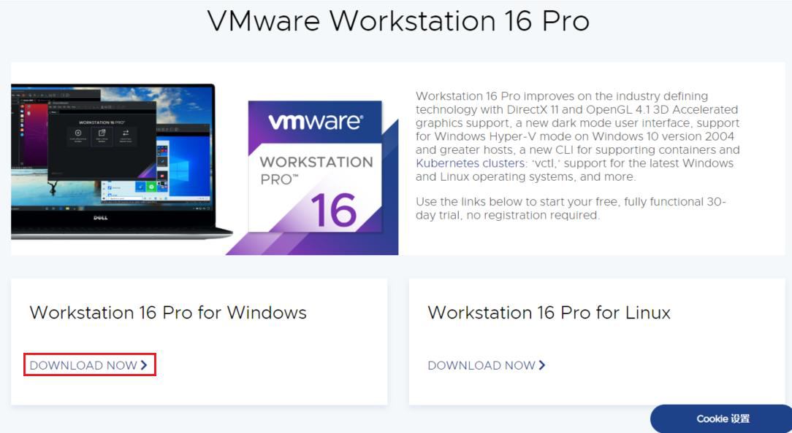

1-1  Wmeare

图

官网下载界面

用户也可在我们提供的资料包中的安装包进行虚拟机的安装，我们提供了

Vmware Workstation Pro 16

Win11

15

安装包（注意

系统在使用

版本打开虚拟机

Win11

16

时会出现蓝屏的现象，所以建议

系统的用户安装

版本）。安装包的路

AC820

ZYNQ

FPSoC

\11_

\VMware

径为：

小梅哥

型

或安路

开发板资料

虚拟机

。解

VMware-workstation-full.exe

压后双击对应版本的

进入安装界面，按照安装提示

进行虚拟机的安装。

1-2

进入开始安装欢迎界面如图

所示，点击“下一步”，进入下一步骤。

店铺：

官方网站：

https://xiaomeige.taobao.com

www.corecourse.cn

技术博客：

技术群组：

http://www.cnblogs.com/xiaomeige/

---
*下一页*

小梅哥FPGA 团队    武汉芯路恒科技

专注于培养您的FPGA 独立开发能力   开发板 培训 项目研发三位一体

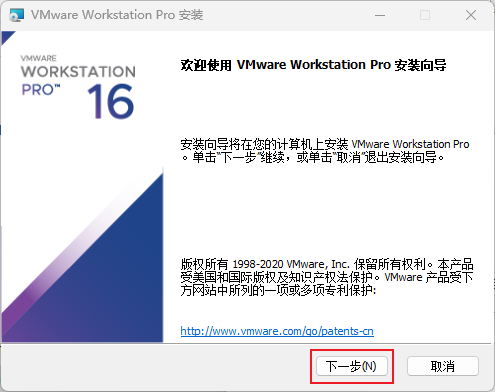

1-2  VMware

图

安装界面

VMWARE

读者在了解

最终用户许可协议后，勾选“我接受许可协议中的

1-3

条款”，如图

所示，点击“下一步”进行后面的步骤。

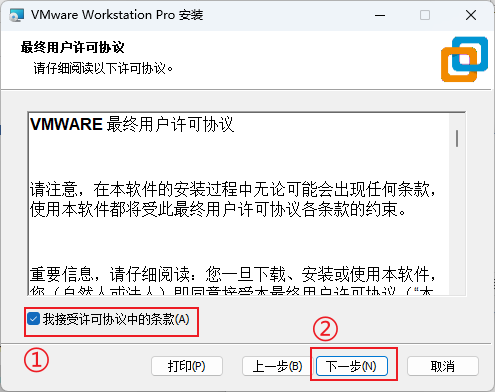

1-3  VMware

图

条款

1-4

图

中，进入安装路径的选择，读者可点击“更改”按钮，根据自己的习

店铺：

官方网站：

https://xiaomeige.taobao.com

www.corecourse.cn

技术博客：

技术群组：

http://www.cnblogs.com/xiaomeige/

---
*下一页*

小梅哥FPGA 团队    武汉芯路恒科技

专注于培养您的FPGA 独立开发能力   开发板 培训 项目研发三位一体

惯和需要选择更改虚拟机的安装路径，这里笔者的安装路径为

A:\ZYNQ\VMware

“

”注意路径必须为纯英文，在设置好安装路径之后，点击

“确认”，回到路径选择界面，可以看到路径已经更改成功，点击“下一步”，

继续后面的步骤。

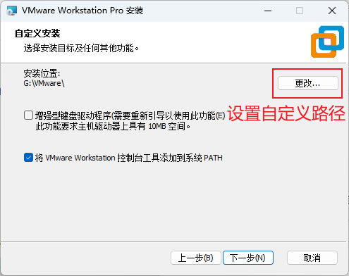

1-4

图

设置择安装路径

1-5

如图

所示，在用户体验设置界面，这里取消勾选“启动时检查产品更新”

VMware

和“加入

客户体验提升计划”选项，点击“下一步”进入后面的安装

步骤。

店铺：

官方网站：

https://xiaomeige.taobao.com

www.corecourse.cn

技术博客：

技术群组：

http://www.cnblogs.com/xiaomeige/

---
*下一页*

小梅哥FPGA 团队    武汉芯路恒科技

专注于培养您的FPGA 独立开发能力   开发板 培训 项目研发三位一体

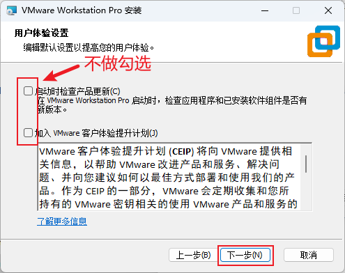

1-5

图

用户体验设置界面

1-6

进入快捷方式的创建，在图

中有两个选项，勾选这两个选项后就可以在

VMware

安装完成以后在开始菜单和桌面上创建

的图标，点击“下一步”。

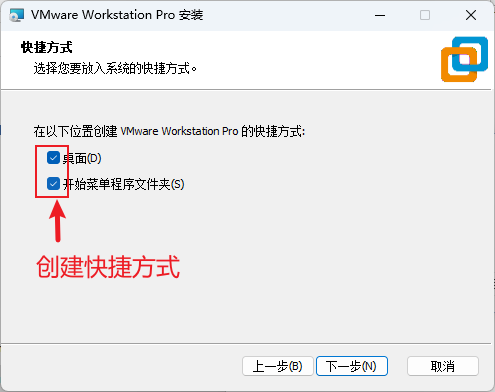

1-6

图

快捷方式设置

到这里，虚拟机安装参数就全部设置完成，如果需要对安装参数修改，点

击“上一步”，对参数进行查看修改，修改完成后就可以点击安装“安装”按

1-7

钮进行虚拟机的安装，如图

所示。

店铺：

官方网站：

https://xiaomeige.taobao.com

www.corecourse.cn

技术博客：

技术群组：

http://www.cnblogs.com/xiaomeige/

---
*下一页*

小梅哥FPGA 团队    武汉芯路恒科技

专注于培养您的FPGA 独立开发能力   开发板 培训 项目研发三位一体

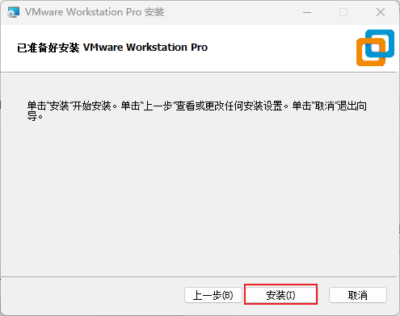

1-7

图

确认安装

1-8

安装的过程会持续几分钟，等待安装完成。安装完成后的界面如图

所示，

点击“完成”，虚拟机的安装到此就结束了，可以进行接下来的设置。

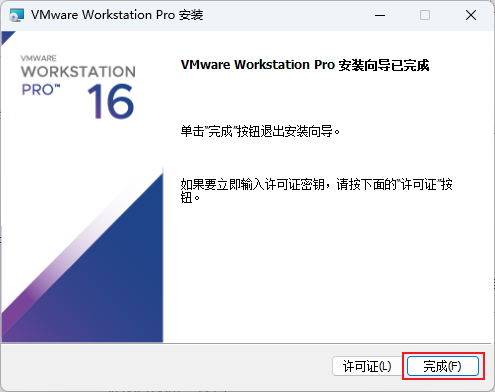

1-8

图

安装完成界面

VMware Workstation

点击“完成”按钮，安装完成以后就会在桌面上出现

店铺：

官方网站：

https://xiaomeige.taobao.com

www.corecourse.cn

技术博客：

技术群组：

http://www.cnblogs.com/xiaomeige/

---
*下一页*

小梅哥FPGA 团队    武汉芯路恒科技

专注于培养您的FPGA 独立开发能力   开发板 培训 项目研发三位一体

Pro

1-9

的图标，如下图

所示，点击图标进入软件

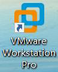

1-9 VMware

图

图标

双击图标进入软件后，第一次打开会询问你输入许可证密钥，输入密匙或

1-10

点击试用后就可以正常使用软件，如下图

所示。

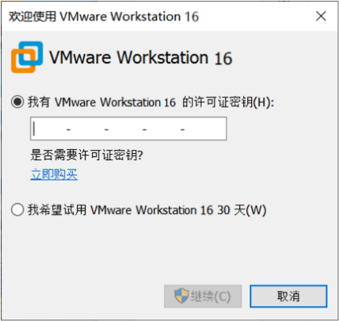

1-10

图

输入密钥

VMware

在你购买

后会获得一串许可密钥，输入你购买获得或者得到的密

匙，输入密钥以后点击“继续按钮”，会显示购买成功。

VMware

VMware

点击“完成”，

软件就可以正常使用了，虚拟机软件

安装

1-11

成功后打开的界面如下图

所示。

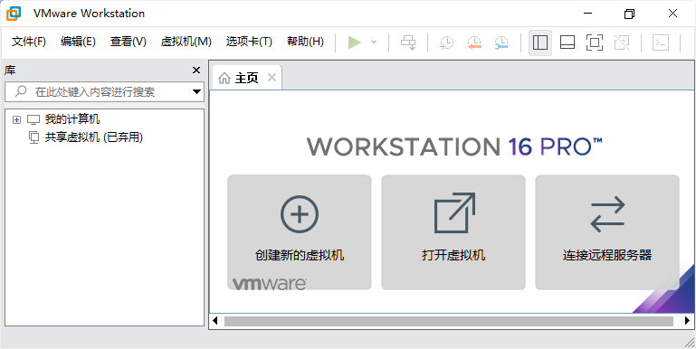

1-11 VMware

图

主界面

店铺：

官方网站：

https://xiaomeige.taobao.com

www.corecourse.cn

技术博客：

技术群组：

http://www.cnblogs.com/xiaomeige/

---
*下一页*

小梅哥FPGA 团队    武汉芯路恒科技

专注于培养您的FPGA 独立开发能力   开发板 培训 项目研发三位一体

1.3

创建虚拟机

VMware

VMware

安装后就可以进入虚拟机的创建，在

的界面中选择

Workstation\

\

1-12

“

文件

新建虚拟机”创建一个虚拟机，如图

所示。

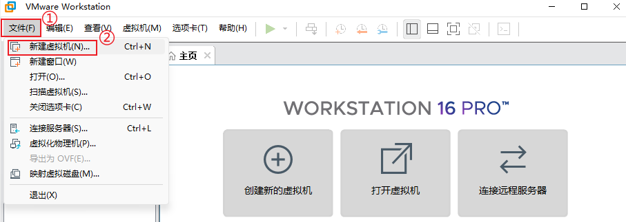

1-12

图

虚拟机创建

1-13

开始进入虚拟机创建向导界面，如图

所示。

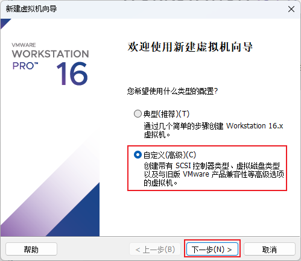

1-13

图

创建向导

在类型配置选项中选择“自定义”选项，选择“下一步”，进入硬件兼容

1-14

性选择界面，如图

所示。

店铺：

官方网站：

https://xiaomeige.taobao.com

www.corecourse.cn

技术博客：

技术群组：

http://www.cnblogs.com/xiaomeige/

---
*下一页*

小梅哥FPGA 团队    武汉芯路恒科技

专注于培养您的FPGA 独立开发能力   开发板 培训 项目研发三位一体

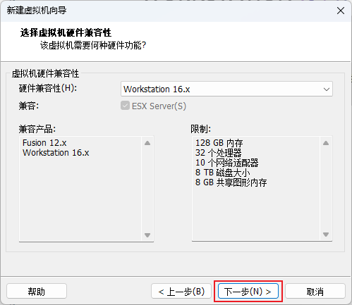

1-14

图

硬件兼容性设置

选择虚拟机硬件兼容性设置界面中我们使用默认值不做特别设置，点击

1-15

“下一步”，进入图

所示界面。

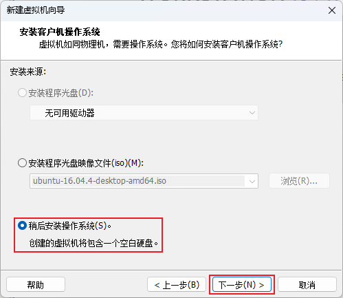

1-15

图

客户机操作系统

店铺：

官方网站：

https://xiaomeige.taobao.com

www.corecourse.cn

技术博客：

技术群组：

http://www.cnblogs.com/xiaomeige/

---
*下一页*

小梅哥FPGA 团队    武汉芯路恒科技

专注于培养您的FPGA 独立开发能力   开发板 培训 项目研发三位一体

Ubuntu

系统在安装时需要进行一些必要的设置，以便在使用的过程中更加

便利，在安装客户机操作系统界面我们现在先不进行安装系统，选择“稍后安

(S)

1-16

装操作系统

”这个选项，然后选择“下一步”，如图

所示。

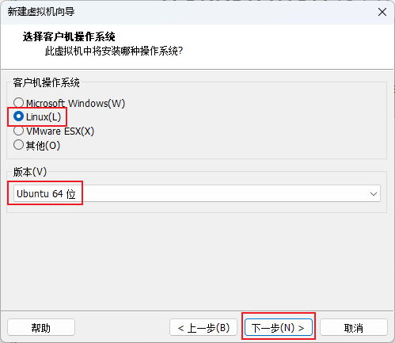

1-16

图

选择客户机操作系统

Linux

Ubuntu 64

客户机操作系统一栏选择“

”，版本选择

位，然后点击

(.iso

)

1-17

“下一步”，不过在上一步骤没有选择放入系统文件

文件

，进入图

所

示界面。

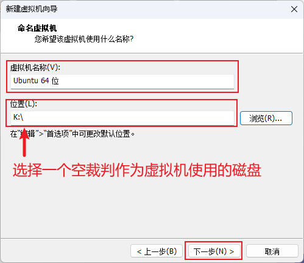

店铺：

官方网站：

https://xiaomeige.taobao.com

www.corecourse.cn

技术博客：

技术群组：

http://www.cnblogs.com/xiaomeige/

---
*下一页*

小梅哥FPGA 团队    武汉芯路恒科技

专注于培养您的FPGA 独立开发能力   开发板 培训 项目研发三位一体

1-17

图

命名及路径选择

这里读者可以为自己的虚拟机命名，选择给虚拟机单独清理出一块磁盘安

100G

装虚拟机，大小根据实际情况进行设置，尽量不小于

，这里为安装虚拟机

179G

1-18

准备了一个

的磁盘，如图

所示。

1-18

图

虚拟机磁盘

1-17

图

点击“下一步”，进入图所示的处理器配置选择界面，配置虚拟机

8

16

所使用的处理器数量，以及每个处理器的内核数量，这里我的电脑是

核

线

CPU

4

VMware

2

1-19

程

，分配

个核给

，每个处理器的内核数量是

，配置如图

所

示。

1-19

图

处理器配置

1-20

如图

所示，进入内存配置界面，根据自己电脑的实际内存配置来设置

2G

分给虚拟机的内存大小，这里推荐内存大小是

，如果电脑的性能较高也可以

16GB

多分配一些内存来提高虚拟机的性能，比如电脑是

的内存，可以给虚拟

8GB

机分配

的内存，点击“下一步”。

店铺：

官方网站：

https://xiaomeige.taobao.com

www.corecourse.cn

技术博客：

技术群组：

http://www.cnblogs.com/xiaomeige/

---
*下一页*

小梅哥FPGA 团队    武汉芯路恒科技

专注于培养您的FPGA 独立开发能力   开发板 培训 项目研发三位一体

1-20

图

内存配置

1-21

如图

示，在网络类型选择界面选择“使用桥接网络”，后点击“下一

步”。

1-21

图

网络类型选择界面

店铺：

官方网站：

https://xiaomeige.taobao.com

www.corecourse.cn

技术博客：

技术群组：

http://www.cnblogs.com/xiaomeige/

---
*下一页*

小梅哥FPGA 团队    武汉芯路恒科技

专注于培养您的FPGA 独立开发能力   开发板 培训 项目研发三位一体

I/O

1-22

LSI Logic

在

控制器类型界面，如图

所示，选择“

”，点击“下一

步”。

1-22 I/O

图

控制器选择

1-23

SCSI

,

进入磁盘类型选择界面，如图

所示，选择“

”

点击“下一步”

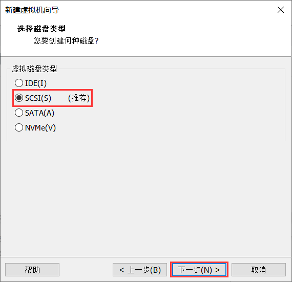

店铺：

官方网站：

https://xiaomeige.taobao.com

www.corecourse.cn

技术博客：

技术群组：

http://www.cnblogs.com/xiaomeige/

---
*下一页*

小梅哥FPGA 团队    武汉芯路恒科技

专注于培养您的FPGA 独立开发能力   开发板 培训 项目研发三位一体

1-23

图

选择磁盘类型

1-24

在磁盘选择界面选择“创建新虚拟磁盘”，如图

所示，为我们前面设

置好的那个空的磁盘创建一个新的磁盘，设置好以后点击“下一步”。

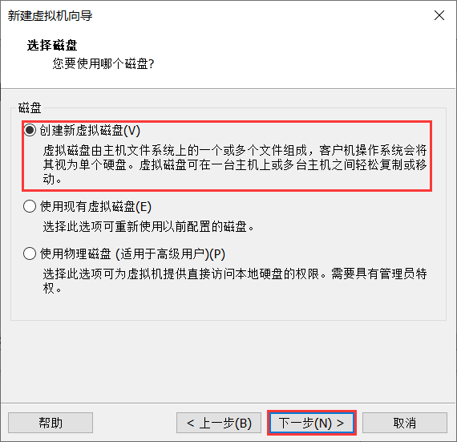

1-24

图

磁盘选择

158

在前面的设置中讲到，我们为虚拟机清理了一个大小为

的磁盘，因此

158G

1-25

设置最大磁盘大小为

，点击“下一步”，如图

所示。

店铺：

官方网站：

https://xiaomeige.taobao.com

www.corecourse.cn

技术博客：

技术群组：

http://www.cnblogs.com/xiaomeige/

---
*下一页*

小梅哥FPGA 团队    武汉芯路恒科技

专注于培养您的FPGA 独立开发能力   开发板 培训 项目研发三位一体

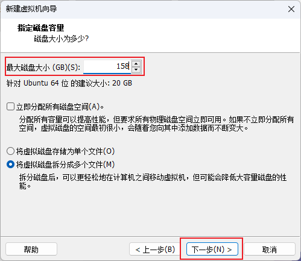

1-25

图

磁盘容量

1-26

指定磁盘文件设置这里保持默认设置，点击“下一步”，如图

所示。

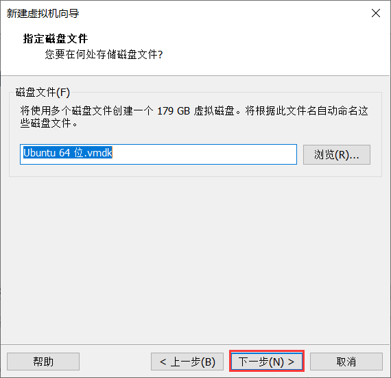

1-26

图

指定磁盘文件

进入已准备好创建虚拟机界面，这里可以对虚拟机的设置进行查看，还可

店铺：

官方网站：

https://xiaomeige.taobao.com

www.corecourse.cn

技术博客：

技术群组：

http://www.cnblogs.com/xiaomeige/

---
*下一页*

小梅哥FPGA 团队    武汉芯路恒科技

专注于培养您的FPGA 独立开发能力   开发板 培训 项目研发三位一体

以点击“上一步”对设置进行修改，确认无误之后就可以点击“完成”，一个

1-27

虚拟机就创建好了，如图

所示。

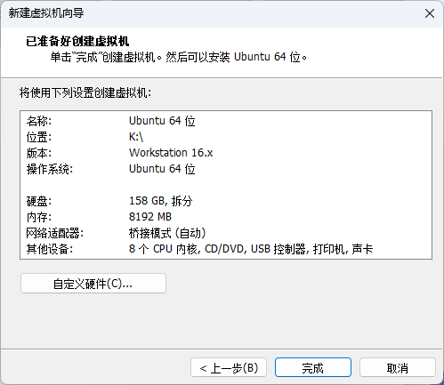

1-27

图

准备创建虚拟机

Ubuntu 64

在“我的计算机”中可以看到我们刚刚创建的虚拟机，点击“

位”

1-28

在右侧会显示虚拟机的详情信息，如图

所示。

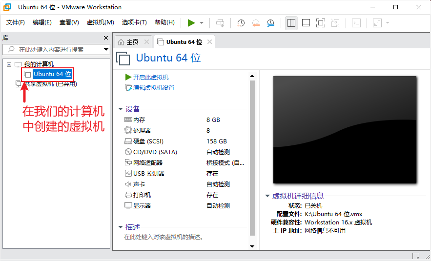

1-28

图

新创建的虚拟机

店铺：

官方网站：

https://xiaomeige.taobao.com

www.corecourse.cn

技术博客：

技术群组：

http://www.cnblogs.com/xiaomeige/

---
*下一页*

小梅哥FPGA 团队    武汉芯路恒科技

专注于培养您的FPGA 独立开发能力   开发板 培训 项目研发三位一体

1.4

Ubuntu

操作系统安装

PC

在虚拟机创建成功后，相当于我们又多了一台

机，现在我们给它安装上

Ubuntu

操作系统，这台“电脑”就可以使用了。接下来就可以在虚拟机中安装

Ubuntu

系统了，在配套的资料中可以找到准备的到

的系统镜像，也可以在官网

https://www.ubuntu.com/download/desktop

进行下载，下载地址为：

。下载界面如

1-29

图

所示。

1-29 Ubuntu

图

系统下载

18.04.4 (64-bit)

Ubuntu

推荐使用的是

版本的

，笔者使用该版本没出现过编译

AC820-ZYNQ

问题，其他版本无法保证；该镜像文件已经提供在了

开发板对应

AC820

ZYNQ

FPSOC

\11_

资料包中，路径为：

小梅哥

型

或安路

开发板资料

虚拟

Ubuntu

VMware

机

。下面开始

操作系统的安装，打开

软件，点击创建的虚拟机，

/

1-30

依次选择“虚拟机

设置”，如图

所示。

店铺：

官方网站：

https://xiaomeige.taobao.com

www.corecourse.cn

技术博客：

技术群组：

http://www.cnblogs.com/xiaomeige/

---
*下一页*

小梅哥FPGA 团队    武汉芯路恒科技

专注于培养您的FPGA 独立开发能力   开发板 培训 项目研发三位一体

1-30

图

虚拟机设置对话框

1-31

打开以后的虚拟机设置对话框如图

所示。点击“网络适配器”，右边

显示对应当先的网络设置，虚拟机默认使用的是桥接模式，此种模式下虚拟机

Windows

IP

和

系统各自使用自己独立的

地址，适用于家庭宽带网络环境。而对

IP

于高校和企业，可能每个电脑的

地址是固定分配的，使用桥接模式虚拟机将

NAT

”

Windows

无法联网。此时可以勾选设置为“

模式

，即可实现虚拟机和

系

统共享网络地址，这样虚拟机就能够正常联网了。

1-31

图

网络连接设置

店铺：

官方网站：

https://xiaomeige.taobao.com

www.corecourse.cn

技术博客：

技术群组：

http://www.cnblogs.com/xiaomeige/

---
*下一页*

小梅哥FPGA 团队    武汉芯路恒科技

专注于培养您的FPGA 独立开发能力   开发板 培训 项目研发三位一体

USB

USB

下面选择设置“

控制器”选项，为了能够兼容

的使用，选择设置

USB3.0

USB

USB3.0

1-32

使用

，因此我们需要调整

兼容性为

，如图

所示。

1-32 USB

图

设置

Ubuntu

CD/DVD(SATA)

开始

系统安装，选中虚拟机设置对话框中“

”选项，

ISO

1-33

选中“使用

映像文件”，如图

所示。

1-33

图

系统镜像设置

Ubuntu

Ubuntu

添加

系统镜像，点击“浏览”按钮，选择

系统镜像，添加

AC820

下载的镜像文件。该镜像文件提供于资料包中，路径如下：

小梅哥

型

ZYNQ

FPSOC

\11_

1-34

或安路

开发板资料

虚拟机

，文件添加完成以后如图

所示：

店铺：

官方网站：

https://xiaomeige.taobao.com

www.corecourse.cn

技术博客：

技术群组：

http://www.cnblogs.com/xiaomeige/

---
*下一页*

小梅哥FPGA 团队    武汉芯路恒科技

专注于培养您的FPGA 独立开发能力   开发板 培训 项目研发三位一体

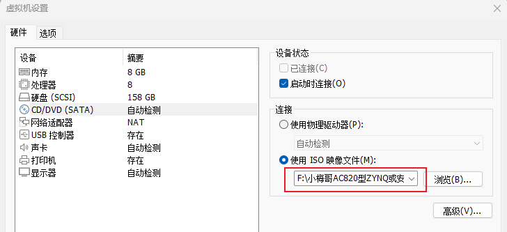

1-34 Ubuntu

图

镜像选择

点击“确定”按钮退出设置界面，退出设置界面以后就可以打开虚拟机进

Ubuntu

1-35

行查看，虚拟机将会安装上对应版本的

系统，如图

所示。

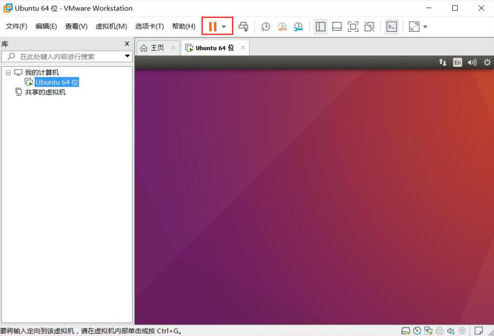

1-35 Ubuntu

图

安装界面

1-36

当然也有可能会出现如图

所示安装失败界面，这是由于软件未自动连

接映像文件造成的。

店铺：

官方网站：

https://xiaomeige.taobao.com

www.corecourse.cn

技术博客：

技术群组：

http://www.cnblogs.com/xiaomeige/

---
*下一页*

小梅哥FPGA 团队    武汉芯路恒科技

专注于培养您的FPGA 独立开发能力   开发板 培训 项目研发三位一体

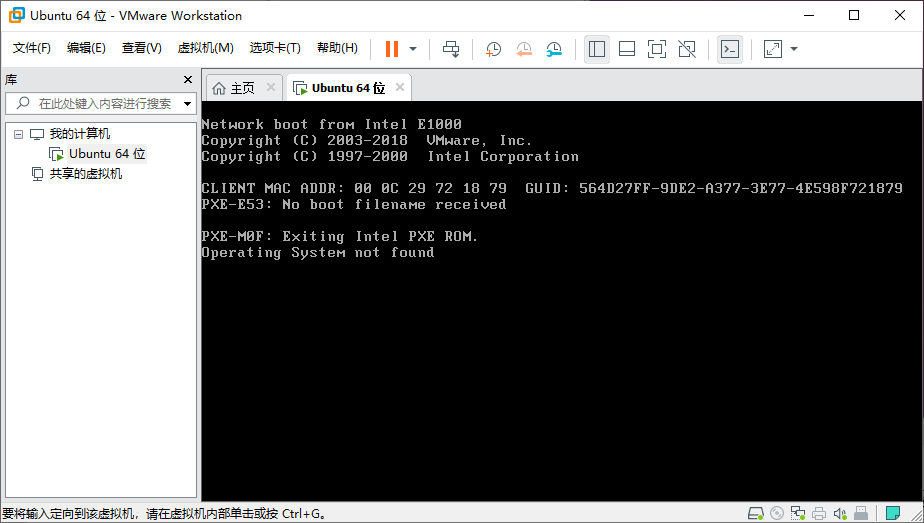

1-36

图

安装失败界面

此时我们可以点击虚拟机右下角的光盘图标，在弹出的选项中选择连接，

1-38

如图

所示。

1-37

图

映像文件信息

1-38

图

连接映像文件

Ubuntu

接下来重启客户端即可进入到

的安装界面。

店铺：

官方网站：

https://xiaomeige.taobao.com

www.corecourse.cn

技术博客：

技术群组：

http://www.cnblogs.com/xiaomeige/

---
*下一页*

小梅哥FPGA 团队    武汉芯路恒科技

专注于培养您的FPGA 独立开发能力   开发板 培训 项目研发三位一体

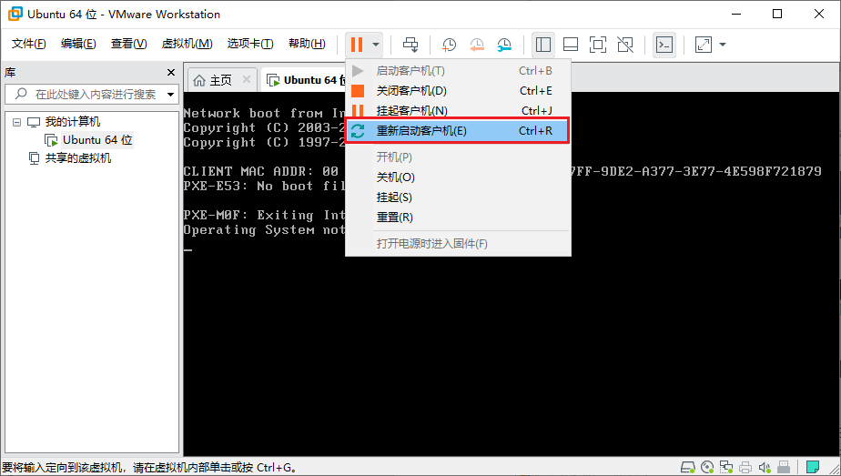

1-39

图

重启客户端

(

)

这里对语言进行设置，选用“中文

简体

”，选择好语言以后点击右侧的

Ubuntu

1-40

“安装

”按钮，进入安装过程，如图

所示。

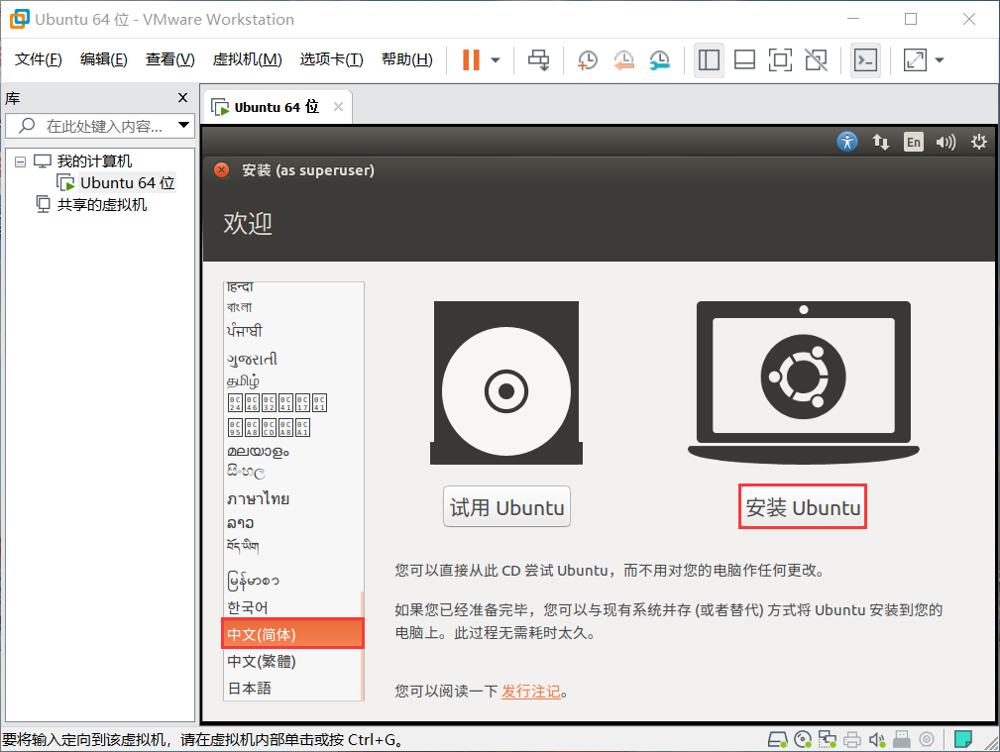

1-40

图

语言选择

在下一步中，系统会显示键盘布局选择界面。如果在之前的步骤中选择了"

1-41

中文"作为系统语言，则该界面会默认选中汉语键盘布局，如图

所示。

店铺：

官方网站：

https://xiaomeige.taobao.com

www.corecourse.cn

技术博客：

技术群组：

http://www.cnblogs.com/xiaomeige/

---
*下一页*

小梅哥FPGA 团队    武汉芯路恒科技

专注于培养您的FPGA 独立开发能力   开发板 培训 项目研发三位一体

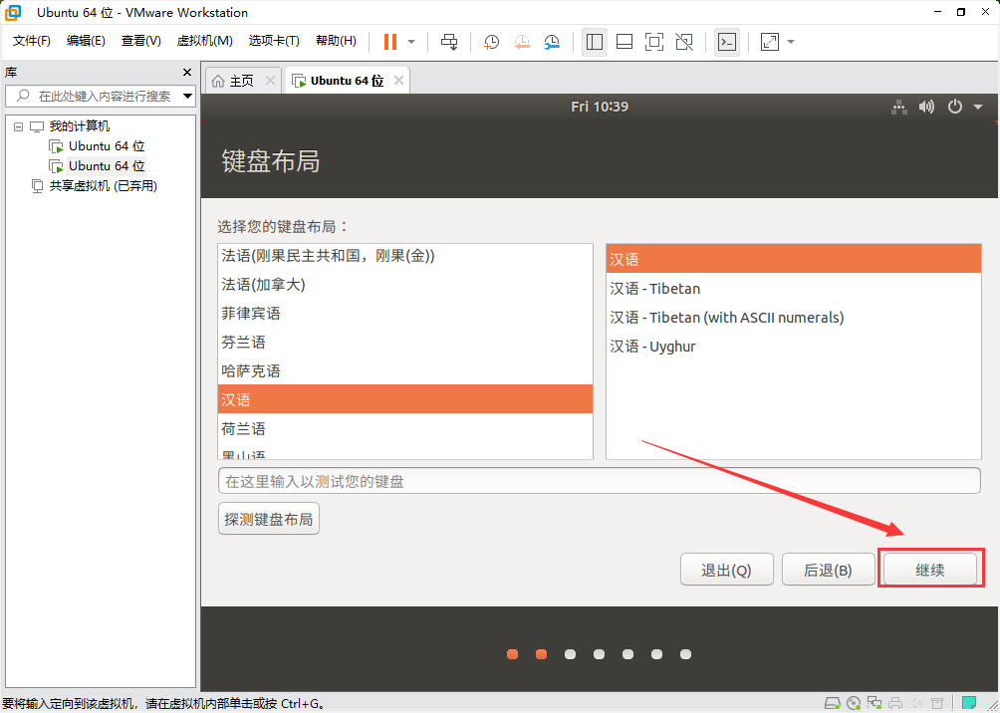

1-41

图

语言

Ubuntu

进入安装准备界面，询问是否安装

时下载更新，以及是否为图形或

1-41

者无线硬件安装其它第三方软件，如图

所示，为了加快安装进度我们不勾

选这两个选项。保持默认，点击继续即可；

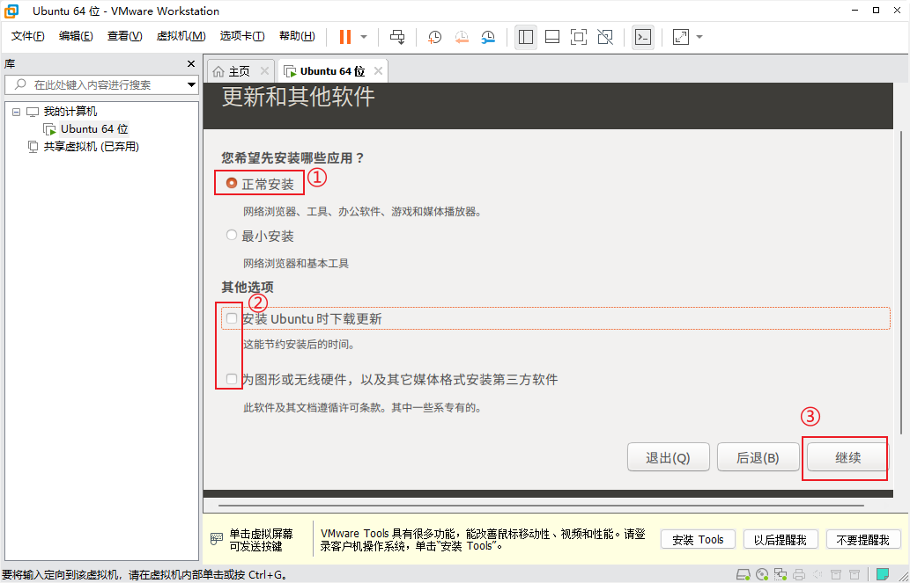

1-42

图

安装软件

店铺：

官方网站：

https://xiaomeige.taobao.com

www.corecourse.cn

技术博客：

技术群组：

http://www.cnblogs.com/xiaomeige/

---
*下一页*

小梅哥FPGA 团队    武汉芯路恒科技

专注于培养您的FPGA 独立开发能力   开发板 培训 项目研发三位一体

在安装类型选择界面，我们为Ubuntu 系统准备了一个空的磁盘，这里使用

1-43

默认的“清除整个磁盘并安装 Ubuntu”安装类型，如图

所示，设置好安

装类型点击“现在安装”按钮，进入下一步安装。

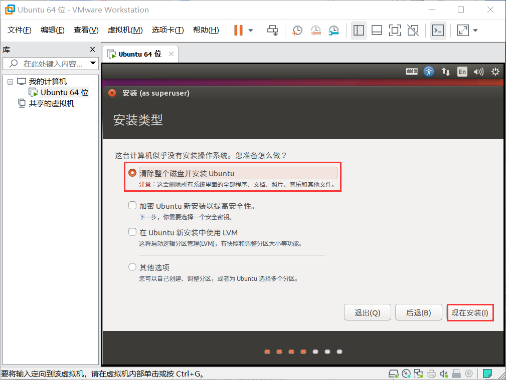

1-43

图

安装类型选择

弹出“将改动写入磁盘吗？”对话框，这里我们不再进行修改，点击“继

1-44

续”，如图

所示。

1-44

图

写入磁盘设置

Ubuntu

带了拼音输入法，点击右上角键盘状图标进入输入法选择设置页，

1-45

切换到拼音输入法，设置过程如图

所示。

店铺：

官方网站：

https://xiaomeige.taobao.com

www.corecourse.cn

技术博客：

技术群组：

http://www.cnblogs.com/xiaomeige/

---
*下一页*

小梅哥FPGA 团队    武汉芯路恒科技

专注于培养您的FPGA 独立开发能力   开发板 培训 项目研发三位一体

1-45

图

修改输入法

1-46

如图

所示，输入你在哪个位置，这里输入自己所在的城市，这里我输

入武汉。

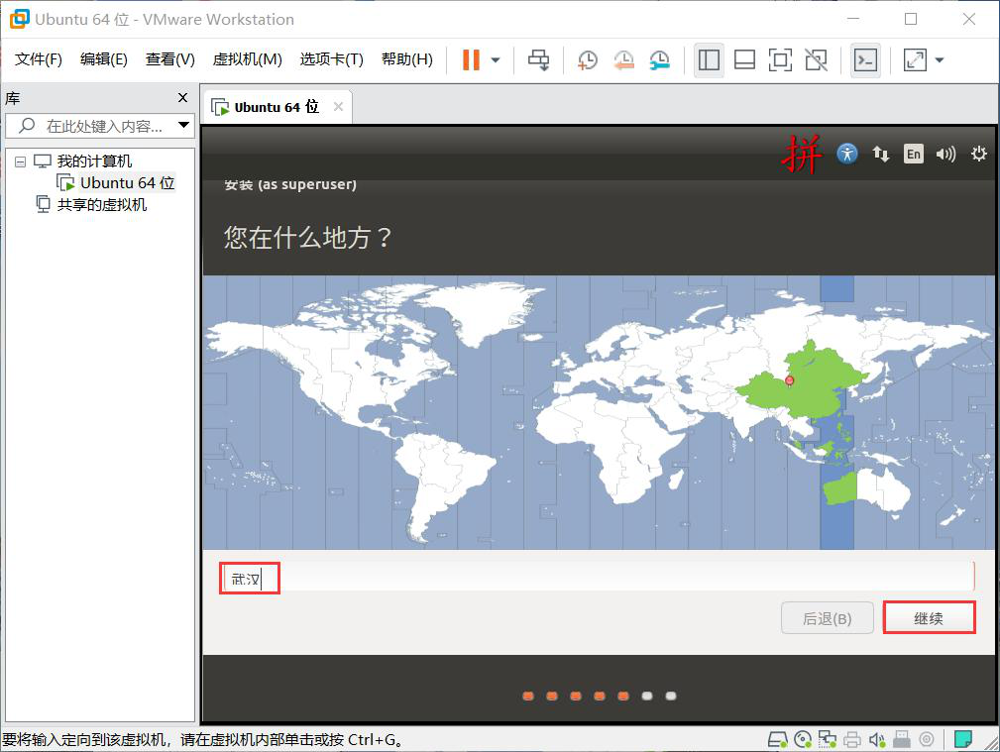

1-46

图

所在位置设置

1-47

输入地址以后点击“继续”按钮，如图

所示会进入键盘布局设置界面，

店铺：

官方网站：

https://xiaomeige.taobao.com

www.corecourse.cn

技术博客：

技术群组：

http://www.cnblogs.com/xiaomeige/

---
*下一页*

小梅哥FPGA 团队    武汉芯路恒科技

专注于培养您的FPGA 独立开发能力   开发板 培训 项目研发三位一体

保持默认设置不需要做任何修改，点击

“继续”按钮，进行后续安装过程。

1-47

图

键盘布局设置

下一步设置用户名和密码，设置自己的用户名和密码，这个用户将是我们

Ubuntu

进入

的默认用户，在进入系统时需要进行用户身份验证，选择用户后输

1-48

入密码便可以进入系统。我的设置如图

所示。

1-48

图

设置用户名和密码

设置好用户名和密码以后下面便可以进行安装，点击“继续”按钮，系统

店铺：

官方网站：

https://xiaomeige.taobao.com

www.corecourse.cn

技术博客：

技术群组：

http://www.cnblogs.com/xiaomeige/

---
*下一页*

小梅哥FPGA 团队    武汉芯路恒科技

专注于培养您的FPGA 独立开发能力   开发板 培训 项目研发三位一体

1-49

安装过程如图

所示。

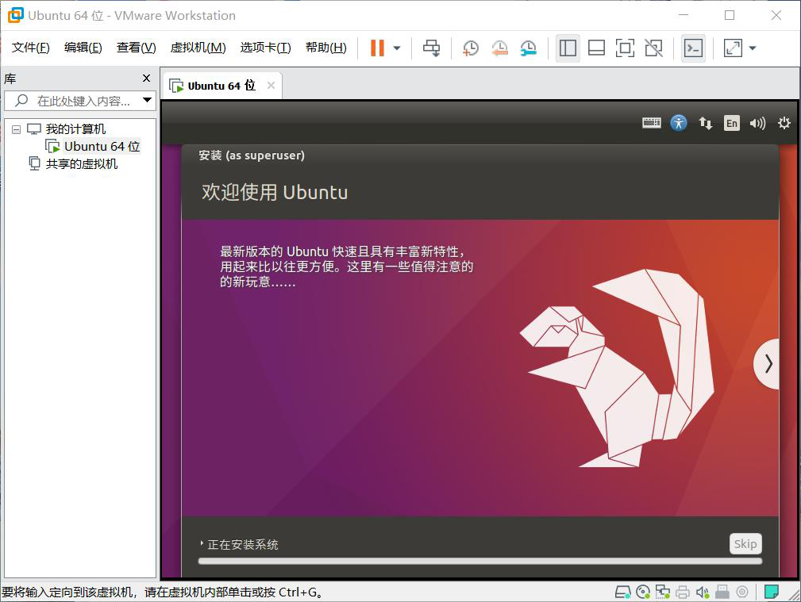

1-49

图

系统安装

耐心等待系统安装完成，安装过程中最好能够正常上网，因为安装过程中

skip

会下载一些文件，如果不能正常上网的话可以点击右侧的“

”按钮来跳过

1-50

下载文件这个步骤，对于系统的安装不会造成影响，如图

所示：

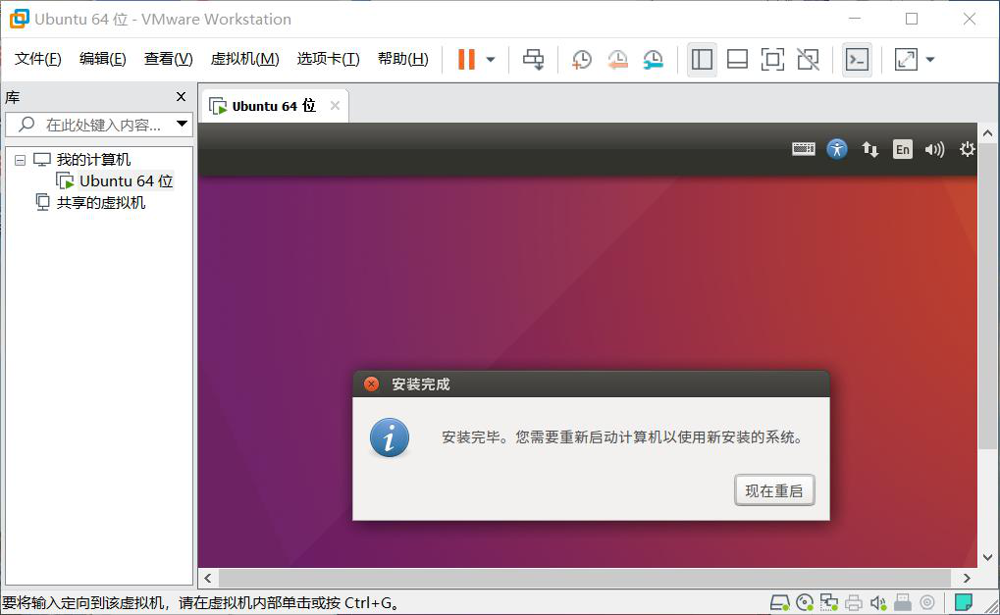

1-50

图

安装完成

安装完成以后提示重启系统，点击“现在重启按钮”。重启系统以后就会

店铺：

官方网站：

https://xiaomeige.taobao.com

www.corecourse.cn

技术博客：

技术群组：

http://www.cnblogs.com/xiaomeige/

---
*下一页*

小梅哥FPGA 团队    武汉芯路恒科技

专注于培养您的FPGA 独立开发能力   开发板 培训 项目研发三位一体

1-51

提示输入密码，进行用户的身份验证，如图

所示，进入系统。

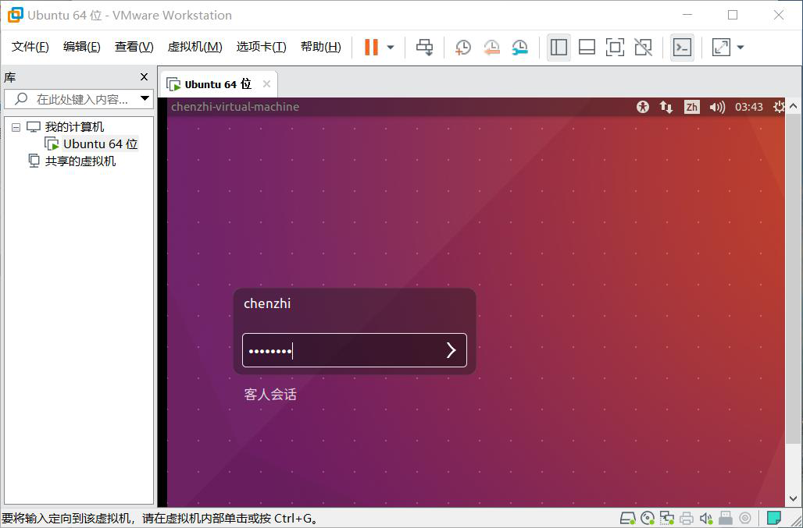

1-51

图

输入密码

chenzhi

在“

”用户下输入密码，验证成功后按回车键就会进入系统主界面，

1-52

系统界面如图

所示。

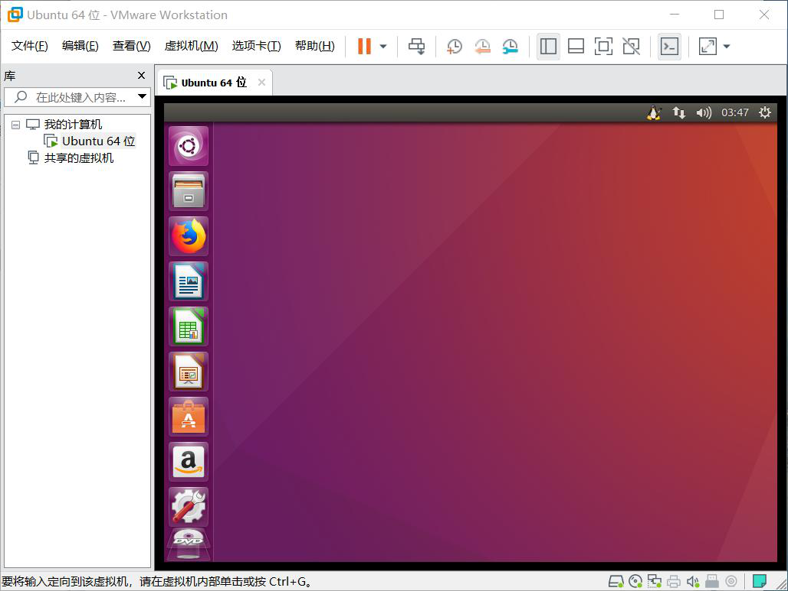

1-52

图

系统桌面

Ubuntu

Ubuntu

系统可以正常运行了，我们可以把

系统当做一个新的电脑使

店铺：

官方网站：

https://xiaomeige.taobao.com

www.corecourse.cn

技术博客：

技术群组：

http://www.cnblogs.com/xiaomeige/

---
*下一页*

小梅哥FPGA 团队    武汉芯路恒科技

专注于培养您的FPGA 独立开发能力   开发板 培训 项目研发三位一体

CD/DVD

用，此时我们的系统镜像已经还在

里面，系统镜像此时就像我们安装

U

Ubuntu

BIOS

电脑时外挂的

盘，

的启动是外挂的系统镜像来启动的，为了调整

Ubuntu

从硬盘启动，我们现在要将它弹出。先关闭

系统，点击系统桌面右上角

1-53

的设置按钮，点击关机，如图

所示。

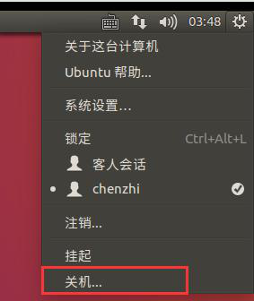

1-53

图

关机

1-54

点击关机按钮会关闭所有程序并关机，如图

所示。

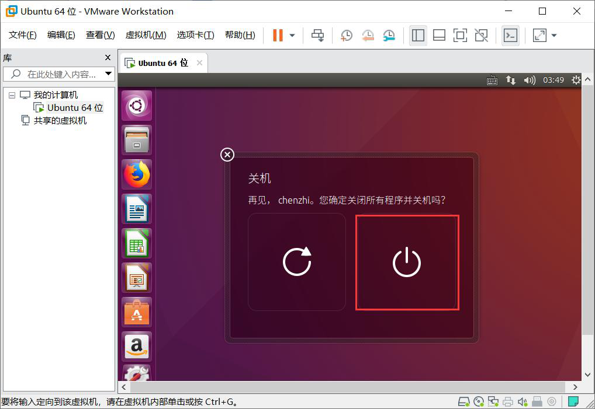

1-54

图

关闭系统

Ubuntu

VMware

下面进行弹出系统镜像设置。关闭

操作系统，重新打开

，

店铺：

官方网站：

https://xiaomeige.taobao.com

www.corecourse.cn

技术博客：

技术群组：

http://www.cnblogs.com/xiaomeige/

---
*下一页*

小梅哥FPGA 团队    武汉芯路恒科技

专注于培养您的FPGA 独立开发能力   开发板 培训 项目研发三位一体

Ubuntu

Ubuntu

这里不要打开

系统，此时打开的话还是

系统镜像打开。打开

VMware

CD/DVD(SATA)

的虚拟机设置界面，然后选中“

”，右侧的“连接”

1-55

选择“使用物理驱动器”，点击“确定”按钮完成设置，如图

所示。

1-55

Ubuntu

图

弹出

系统镜像

Ubuntu

Ubuntu

设置完成之后再次打开

系统，如果能够正常启动代表

系统

安装成功了。

1.5

本章小结

Linux

Linux

ZYNQ

第一章我们从

系统介绍出发，了解什么是

系统。在进行

Linux

ZYNQ

Linux

的

开发之前我们需要搭建好相应的开发环境。而进行

的

的

Linux

开发需要在

系统下进行，这就要求我们能够安装虚拟机以及在虚拟机中

Ubuntu

Ubuntu

安装搭建

系统。准备好了第一章的内容后我们便可以开始进入

系

统学习。

店铺：

官方网站：

https://xiaomeige.taobao.com

www.corecourse.cn

技术博客：

技术群组：

http://www.cnblogs.com/xiaomeige/

---
*下一页*

小梅哥FPGA 团队    武汉芯路恒科技

专注于培养您的FPGA 独立开发能力   开发板 培训 项目研发三位一体

店铺：

官方网站：

https://xiaomeige.taobao.com

www.corecourse.cn

技术博客：

技术群组：

http://www.cnblogs.com/xiaomeige/

---
*下一页*

小梅哥FPGA 团队    武汉芯路恒科技

专注于培养您的FPGA 独立开发能力   开发板 培训 项目研发三位一体

Ubuntu

系统学习

章节导读

经过上一章的系统安装准备工作，相信读者已经安装好虚拟机，并在虚拟

机中安装好Ubuntu 操作系统，对Ubuntu 系统也有了直观的一些认识。本章我

们就将逐步开始学习后续嵌入式开发所需的Ubuntu 基本知识，经过本章的学习，

在了解系统的基本设置、常用的 shell 命令、vim 编辑器的基本操作等操作的

同时，也可以把Ubuntu 操作系统运用起来，就像使用Windows 操作系统一样，

实现基本功能的运用。

2.1

Ubuntu

系统操作

Ubuntu

本章开始，我们将进行

系统的了解学习。

VMware

2-1

首先打开

虚拟机软件，点击“开机”按钮，如图

所示。

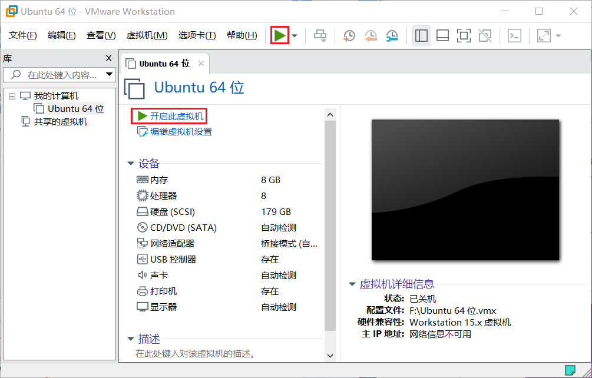

2-1

图

系统开机

VMware

Ubuntu

打开

，点击开机后进入

操作系统，在登录界面输入我们设

,

2-2

置的密码

如图

所示。

店铺：

官方网站：

https://xiaomeige.taobao.com

www.corecourse.cn

技术博客：

技术群组：

http://www.cnblogs.com/xiaomeige/

---
*下一页*

小梅哥FPGA 团队    武汉芯路恒科技

专注于培养您的FPGA 独立开发能力   开发板 培训 项目研发三位一体

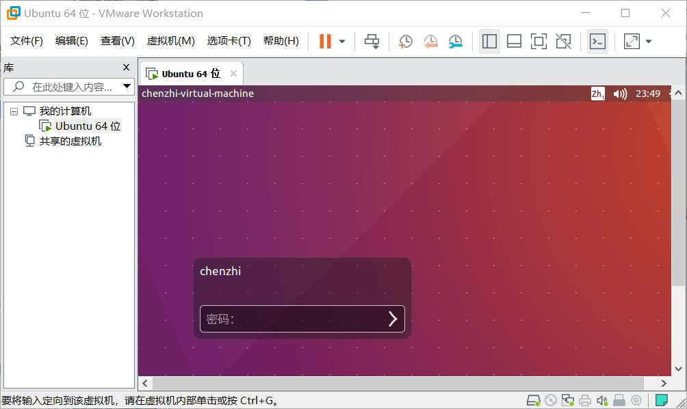

2-2

图

用户登录

2-3

输入密码进入系统界面，系统界面如图

所示。

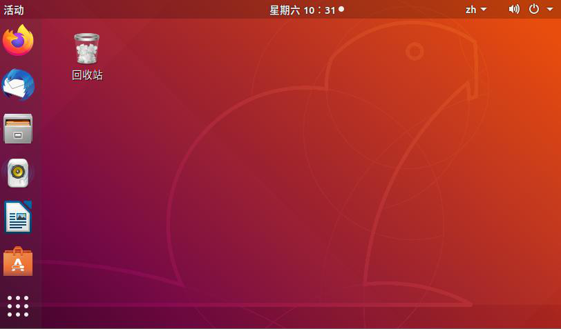

2-3

图

系统界面

Ubuntu

如果我们不使用

系统以后就需要将其关机，此时就可以点击右上角

VMware

“电源”按钮进行关机，不要通过直接退出

软件来关机！直接关机可

2-4

能对文件系统产生影响，关机按钮如图

所示。

店铺：

官方网站：

https://xiaomeige.taobao.com

www.corecourse.cn

技术博客：

技术群组：

http://www.cnblogs.com/xiaomeige/

---
*下一页*

小梅哥FPGA 团队    武汉芯路恒科技

专注于培养您的FPGA 独立开发能力   开发板 培训 项目研发三位一体

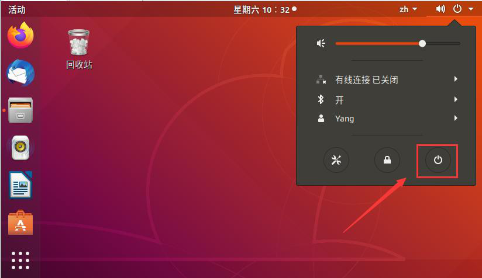

2-4

图

关机

2-5

在确认界面上可以选择“重启”还是“关机”，如图

所示。

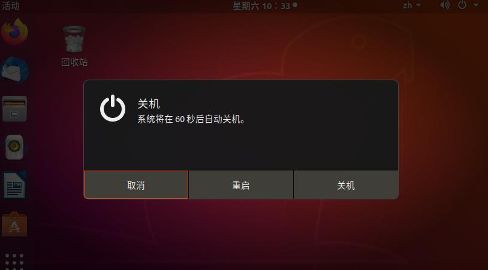

2-5

图

关机确认界面

Ubuntu

Windows

操作系统的主界面与我们常使用的

系统界面没有太大的差

APP

Windows

异，在系统的左侧的功能

也与

系统大同小异，读者完全可以轻松

APP

2-6

操作使用。左侧第一个

就是“搜索计算机”，如图

所示，以在这里搜

Ubuntu

Ubuntu

索

系统中的内容，但也只包括

系统中的内容。

店铺：

官方网站：

https://xiaomeige.taobao.com

www.corecourse.cn

技术博客：

技术群组：

http://www.cnblogs.com/xiaomeige/

---
*下一页*

小梅哥FPGA 团队    武汉芯路恒科技

专注于培养您的FPGA 独立开发能力   开发板 培训 项目研发三位一体

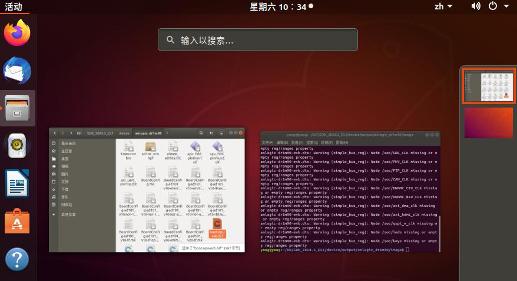

2-6

图

搜索计算机

2-7

Ubuntu

第二个是系统文件夹，点击打开，如图

所示。在里面可以查看

系统文件，使用与我们平常操作电脑无太大差异。

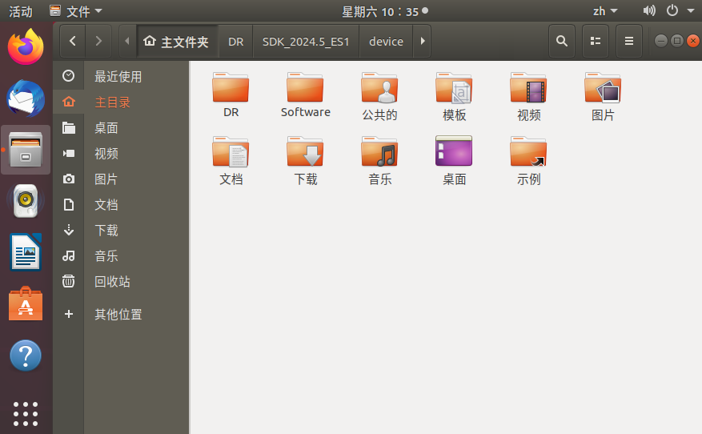

2-7

图

系统文件夹

APP

2-8

第三个

是浏览器，点击打开如图

所示，可以登录网站搜索，计算

firefox

机连接网络就可以正常上网，将

浏览器设置为默认浏览器。

店铺：

官方网站：

https://xiaomeige.taobao.com

www.corecourse.cn

技术博客：

技术群组：

http://www.cnblogs.com/xiaomeige/

---
*下一页*

小梅哥FPGA 团队    武汉芯路恒科技

专注于培养您的FPGA 独立开发能力   开发板 培训 项目研发三位一体

2-8

图

浏览器

2-9

PPT

如图

是办公软件，依次可以进行文档、表格、

的办公处理。

2-9

图

办公软件

APP

系统自带的

在这里就介绍完了，如果读者需要使用其它的应用软件，

可以在浏览器、应用中心进行下载安装。

Ubuntu

为了更便利的使用

系统，我们可以对系统进行个性化的设置，点击

店铺：

官方网站：

https://xiaomeige.taobao.com

www.corecourse.cn

技术博客：

技术群组：

http://www.cnblogs.com/xiaomeige/

---
*下一页*

小梅哥FPGA 团队    武汉芯路恒科技

专注于培养您的FPGA 独立开发能力   开发板 培训 项目研发三位一体

2-10

“系统设置”，如图

所示。

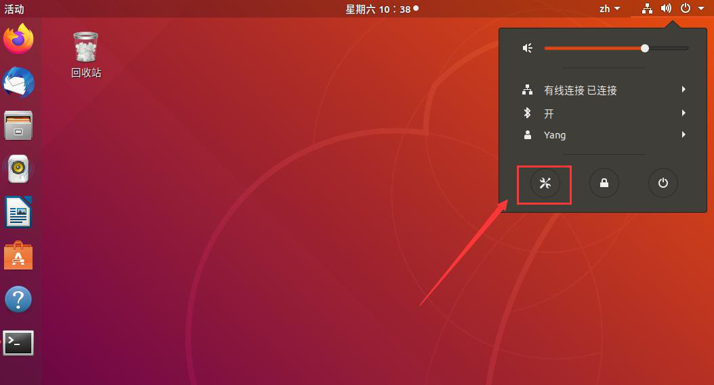

2-10

图

打开系统设置

2-11

系统设置界面如图

所示。

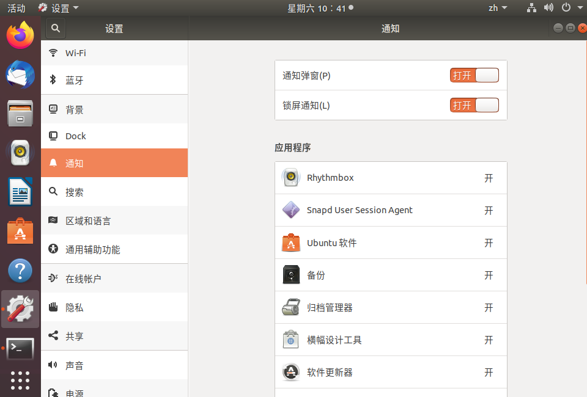

2-11

图

系统设置界面

Ubuntu

Ubuntu

读者在使用

系统的时候会发现，

默认桌面很小，默认分辨率

800*600

2-12

为

。如图

所示，我们可以对系统分辨率进行设置，调整到合适的

大小，找到点击“设备”，在设置窗口选择好分辨率，一般屏幕的分辨率不小

店铺：

官方网站：

https://xiaomeige.taobao.com

www.corecourse.cn

技术博客：

技术群组：

http://www.cnblogs.com/xiaomeige/

---
*下一页*

小梅哥FPGA 团队    武汉芯路恒科技

专注于培养您的FPGA 独立开发能力   开发板 培训 项目研发三位一体

1920X1080

1680X1050

于

，读者可根据自己的习惯选择分辨率，这里设置为

。

点击右下角“应用”确认，由于分辨率太小，确认按钮只显示了一小部分，这

就是我们为什么要调整分辨率的原因。

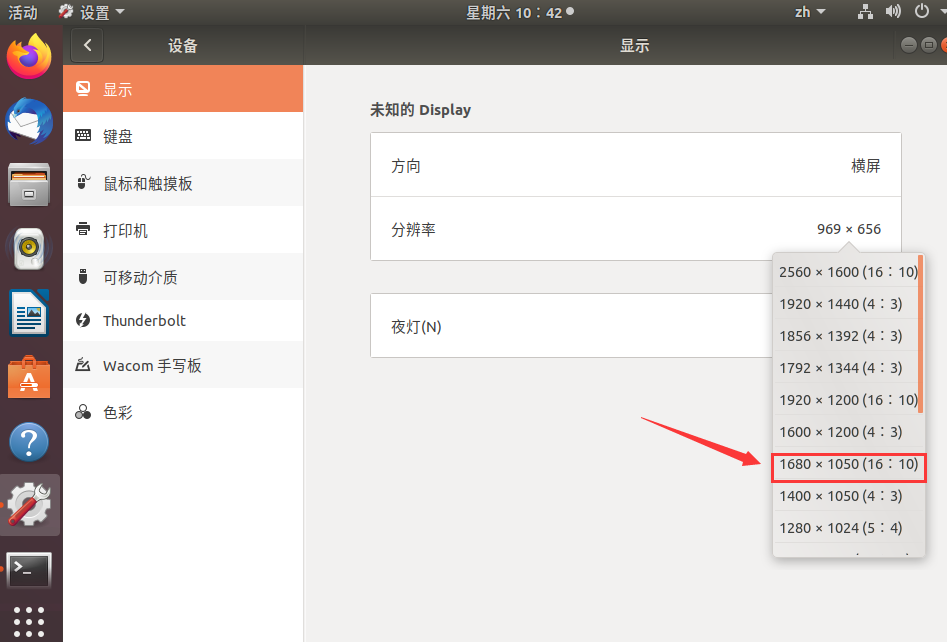

2-12

图

分辨率设置

2-13

分辨率调整好之后屏幕如图

所示。

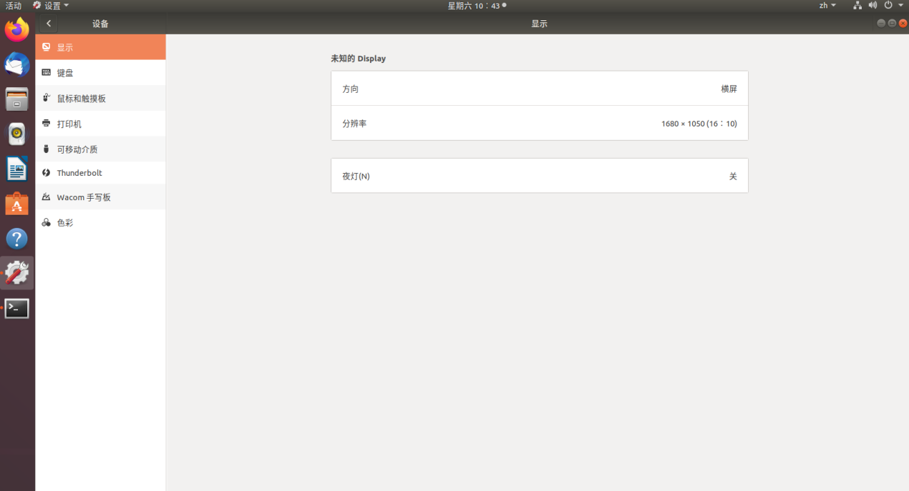

2-13

图

分辨率设置后界面

界面设置完毕，我再进行输入法的设置，点击右上角设置按钮，选择“拼

店铺：

官方网站：

https://xiaomeige.taobao.com

www.corecourse.cn

技术博客：

技术群组：

http://www.cnblogs.com/xiaomeige/

---
*下一页*

小梅哥FPGA 团队    武汉芯路恒科技

专注于培养您的FPGA 独立开发能力   开发板 培训 项目研发三位一体

”

2-14

音

输入，如图

所示。

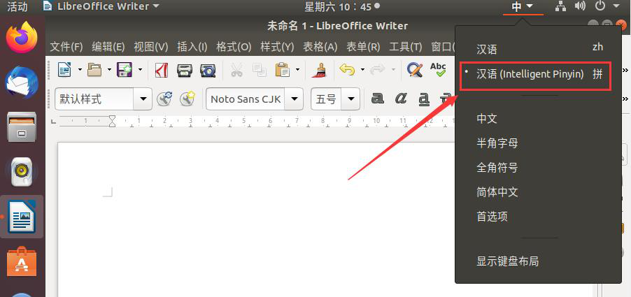

2-14

图

输入法设置

2-15

设置好之后在你创建的文档中就可以正确进行中文输入，如图

所示。

2-15

图

文本输入

2.2

Ubuntu

终端操作

Ubuntu

Linux

终端操作是我们学习的重点内容，在

刚面世时并没有图形界

面，所有的操作全靠命令完成，如磁盘操作、文件存取、文件权限设定等，而

SSH

且在职场中，大量的服务器维护工作都是在远程通过

客户端来完成的，没

有图形界面，所有的维护工作都需要通过命令来完成，所以直到现在不管是哪

Linux

个版本的

发行版系统，它都会提供终端操作功能。在主界面上点击鼠标

2-16

右键，打开终端，如图

所示。

店铺：

官方网站：

https://xiaomeige.taobao.com

www.corecourse.cn

技术博客：

技术群组：

http://www.cnblogs.com/xiaomeige/

---
*下一页*

小梅哥FPGA 团队    武汉芯路恒科技

专注于培养您的FPGA 独立开发能力   开发板 培训 项目研发三位一体

2-16

图

打开终端

2-17

终端打开后的界面如图

所示。

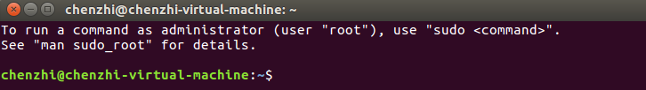

2-17

图

终端界面

在终端界面是一串提示符：

chenzhi@chenzhi-virtual-machine:~$

2-1

表

终端提示符含义

提示符

意义

chenzhi

当前的用户名字

chenzhi-virtual-machine

机器名字

$

表示当前用户是普通用户

要实现相应的功能就需要输入相应的指令，在提示符后面输入命令，比如

ls

ls

输入命令“

”，命令“

”是打印出当前所在目录中所有文件和文件夹，如图

2-18

所示。

2-18  ls

图

指令

2.3

Shell

常用

命令

Shell

Shell

Linux

在嵌入式开发过程中，需要频繁使用

命令，

命令是所有的

Shell

系统发行版所通用的，这里对一些常用的

命令进行介绍。

店铺：

官方网站：

https://xiaomeige.taobao.com

www.corecourse.cn

技术博客：

技术群组：

http://www.cnblogs.com/xiaomeige/

---
*下一页*

小梅哥FPGA 团队    武汉芯路恒科技

专注于培养您的FPGA 独立开发能力   开发板 培训 项目研发三位一体

2.3.1

Shell

介绍

Windows

Mac OS

Android

iOS

现在我们使用的操作系统（

、

、

、

等）都是带

图形界面的，简单直观，容易上手，对专业用户（程序员、网管等）和普通用

户（家庭主妇、老年人等）都非常适用。然而在计算机的早期并没有图形界面，

我们只能通过一个一个地命令来控制计算机，这些命令有成百上千之多，记住

这些命令非常困难，这个时候的计算机还难以普及，只有专业人员才能使用。

对于图形界面，用户点击某个图标就能启动某个程序；对于命令行，用户

输入某个程序的名字（可以看做一个命令）就能启动某个程序。这两者的基本

过程都是类似的，都需要查找程序在硬盘上的安装位置，然后将它们加载到内

存运行。图形界面和命令行要达到的目的是一样的，都是让用户控制计算机。

Shell

Linux

是一个应用程序，它连接了用户和

内核，让用户能够更加高效、

Linux

Shell

安全、低成本地使用

内核，这就是

的本质。

Shell

本身并不是内核的一部分，它只是站在内核的基础上编写的一个应用

QQ

Firefox

Shell

程序，它和

、迅雷、

等其它软件没有什么区别。然而

也有着它

Shell

的特殊性，就是开机立马启动，并呈现在用户面前；用户通过

来使用

Linux

Shell

Linux

，不启动

的话，用户就没办法使用

。

Shell

Shell

C++

并不是简单的堆砌命令，我们还可以在

中编程，这和使用

、

C#

Java

Python

、

、

等常见的编程语言并没有什么两样。

Shell

C++

Java

Python

虽然没有

、

、

等强大，但也支持了基本的编程元素，例如：

⚫

if...else 选择结构，case...in 开关语句，for、while、until 循环；

⚫

变量、数组、字符串、注释、加减乘除、逻辑运算等概念；

⚫

函数，包括用户自定义的函数和内置函数（例如 printf、export、eval

等）。

Shell

Shell

也可以简单的理解为输入命令，

有其命令的格式，格式如下：

command -options     [argument]

2-2  Shell

表

命令的格式

提示符

含义

command

Shell

命令名称

options

命令选项

argument

参数选择

ls

ls

以命令“

”为例，下面“

”命令的不同格式其结果也大不相同，如图

2-19

所示：

店铺：

官方网站：

https://xiaomeige.taobao.com

www.corecourse.cn

技术博客：

技术群组：

http://www.cnblogs.com/xiaomeige/

---
*下一页*

小梅哥FPGA 团队    武汉芯路恒科技

专注于培养您的FPGA 独立开发能力   开发板 培训 项目研发三位一体

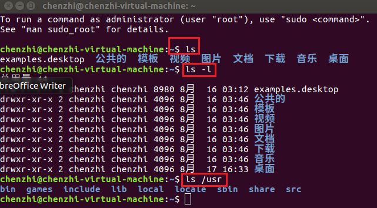

2-19

ls

图

“

”指令不同格式

ls

2-3

“

”指令的参数及含义如表

所示。

2-3  ls

表

参数及含义

指令

含义

ls

打印当前目录下的所有文件和文件夹

ls –l

打印出当前目录下的所有文件和文件夹，并列出所

有文件和文件夹的详细信息，比如文件大小、拥有

者、创建日期等等

ls /usr

“/usr”

打印出目录

下的所有文件和文件

ls –a

查看当前路径包括隐藏文件在内的所有文件

ls –la

查看当前路径包括隐藏文件在内的所有文件的文件

详细信息，包括用户权限，创建日期等

ls –la /dev

查看指定路径下包括隐藏文件在内的所有文件的文

件详细信

息，包括用户权限，创建日期等。

Shell

Shell

命令繁多，为了方便用户使用，

命令支持自动补全功能的。其中

Linux

文件名（或者目录名）是执行

命令中最常见的参数，许多命令都涉及到

了文件名。然而对初学者来说，输入完整的文件名感觉很麻烦，尤其面临文件

Shell

名（目录名）特别长的时候。考虑到这种情况，

提供了一种称为“命令行

自动补全”的功能，即在输入文件名的时候，只需要输入该文件名的前几个字

Tab

Shell

符，然后按

键，

就可以自动将文件名补全。如果有多个命令匹配的话

TAB

系统就会发出报警声音，此时在按下一次

键就会列出所有匹配的命令，比

if

TAB

2-20

如我们输入字母“

”，然后按下

键，如图

所示。

2-20

if

图

“

”指令

店铺：

官方网站：

https://xiaomeige.taobao.com

www.corecourse.cn

技术博客：

技术群组：

http://www.cnblogs.com/xiaomeige/

---
*下一页*

小梅哥FPGA 团队    武汉芯路恒科技

专注于培养您的FPGA 独立开发能力   开发板 培训 项目研发三位一体

2-20

ifup

ifdown

ifup

ifdown

以图

中

和

为例，使用相关的

和

命令可以用来

打开网络连接并根据需要将其关闭，只要该文件具有所需的描述性数据即可。

2-21

“if”在这里意思是接口interface。如图

所示，在终端输入“ifd”，

然后按TAB 键。

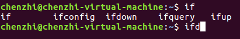

2-21

图

输入不完整命令

TAB

2-22

按下

键后，命令被自动补齐，如图

所示

2-22

图

命令补齐

2.3.2

ls

目录信息查看命令

Shell

ls

下文件浏览命令为

，格式如下：

ls  [选项]  [路径]

ls

命令主要用于显示指定目录下的内容，列出指定目录下包含的所有的文

件以及子目录。

2-4  ls

表

命令

指令

指令参数说明

-a

.

显示所有的文件以及子目录，包括以“

”开头的隐藏文件

-l

显示文件的详细信息，比如文件的形态、权限、所有者、大小

等信息

-t

将文件按照创建时间排序列出

-A

-a

.

(

)

..

(

)

和

一样，但是不列出“

”

当前目录

和“

”

父目录

-R

递归列出所有文件，包括子目录中的文件

2-23

打开终端，输入上面的指令命令，如图

所示。

店铺：

官方网站：

https://xiaomeige.taobao.com

www.corecourse.cn

技术博客：

技术群组：

http://www.cnblogs.com/xiaomeige/

---
*下一页*

小梅哥FPGA 团队    武汉芯路恒科技

专注于培养您的FPGA 独立开发能力   开发板 培训 项目研发三位一体

2-23  ls

图

命令演示

2.3.3

pwd

当前路径显示命令

Linux pwd

print work directory

（英文全拼：

）命令用于显示工作目录。执行

pwd

指令可立刻得知您目前所在的工作目录的绝对路径名称。，不需要任何的

2-24

参数，如图

所示。

2-24  pwd

图

命令

2.3.4

clear

清屏命令

clear

命令用于清除终端上的所有内容，只留下一行提示符。这个命令会刷

新屏幕，本质上只是让终端显示页向后翻了一页，如果向上滚动屏幕还可以看

到之前的操作信息。

clear

clear

2-25

输入

指令，如图

所示。

店铺：

官方网站：

https://xiaomeige.taobao.com

www.corecourse.cn

技术博客：

技术群组：

http://www.cnblogs.com/xiaomeige/

---
*下一页*

小梅哥FPGA 团队    武汉芯路恒科技

专注于培养您的FPGA 独立开发能力   开发板 培训 项目研发三位一体

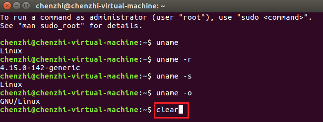

2-25  clear

图

指令

clear

输入

指令后按回车键，终端上所以的内容都被清除，只留下一行提示

2-26

符，如图

所示。

2-26

图

清除后的窗口

reset

clear

指令相比较于

指令这个命令将完全刷新终端屏幕，之前的终端

输入操作信息将都会被清空，这样虽然比较清爽，但整个命令过程速度有点慢，

使用较少

2.3.5

cd

目录切换命令

cd

要想在终端中切换到其它的目录进行操作查看，使用的命令是

，命令格

式如下：

cd      [

]

路径

cd

2-5

后面的路径是我们要进入的目录路径，常用参数如表

所示。

2-5  cd

表

指令参数

指令

指令参数说明

cd /

/

Linux

/

,

进入到根目录“

”下，

系统的根目录为“

”

cd /usr

/usr

进入到目录“

”里面。

cd ..

进入到上一级目录

cd ~

切换到当前用户主目录

/usr

cd /usr

如果需要查看“

”下有什么文件，可以在终端中先使用命令“

”

/usr

ls

/usr

进入到“

”目录下，然后使用

“

”命令显示“

”目录下的所有文件，

/usr

2-27

进入到目录“

”下去，如图

所示。

店铺：

官方网站：

https://xiaomeige.taobao.com

www.corecourse.cn

技术博客：

技术群组：

http://www.cnblogs.com/xiaomeige/

---
*下一页*

小梅哥FPGA 团队    武汉芯路恒科技

专注于培养您的FPGA 独立开发能力   开发板 培训 项目研发三位一体

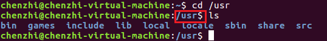

2-27

图

查看文件

$

读者可以观察到，当我们切换到其它目录以后在符号“

”前面就会以蓝色

的字体显示出当前目录名字。

usr

cd ~

查看完“

”目录，要回到我们的主目录也很简单，输入“

”指令，

ls

2-28

再输入“

”查看，可以看到我们回到了我们的主目录，如图

所示。

2-28

图

返回主目录

2.3.6

uname

系统信息查看命令

Linux uname

unix name

（英文全拼：

）命令用于显示系统信息，在查看当前

系统信息时使用，命令的格式如下：

uname     [选项]

uname

2-6

命令

后的选项部分参数如表

所示。

2-6  uname

表

指令参数

指令

指令参数说明

-r

列出当前系统的具体内核版本号

-s

列出系统内核名称

-o

列出系统信息

-a

显示全部的信息

-n

显示在网络上的主机名称

-m

显示电脑类型

2-29

输入对应指令查看系统信息，如图

所示。

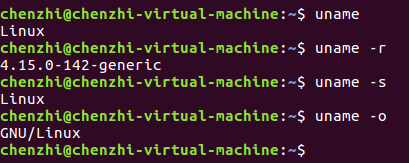

2-29

uname

图

命令

店铺：

官方网站：

https://xiaomeige.taobao.com

www.corecourse.cn

技术博客：

技术群组：

http://www.cnblogs.com/xiaomeige/

---
*下一页*

小梅哥FPGA 团队    武汉芯路恒科技

专注于培养您的FPGA 独立开发能力   开发板 培训 项目研发三位一体

2.3.7

sudo

切换用户执行身份命令

sudo

linux

,

super user do

sudo

是

系统管理指令

全称为：“

”。

最常用的功能

,

就是提升一个命名的执行权限

是允许系统管理员让普通用户执行一些或者全部

root

halt

reboot

su

的

命令的一个工具，如

，

，

等等。

换句话说通过此命令可以让

root

root

Ubuntu(Linux)

非

的用户运行只有

才有权限执行的命令。

允许多用户的

root

操作系统，其中权限最大的就是超级用户

，有时候我们执行一些操作的时

root

sudo

候是需要用

用户身份才能执行。通过

命令可以使我们暂时将身份切换

root

到

用户。命令格式如下：

sudo     [选项]     [命令]

sudo

指令的特点：

◼

sudo 能够限制用户只在某台主机上运行某些命令。

◼

sudo 提供了丰富的日志，详细地记录了每个用户干了什么。它能够将日志

传到中心主机或者日志服务器。

◼

sudo 使用时间戳文件来执行类似的“检票”系统。当用户调用sudo 并且输

入它的密码时，用户获得了一张存活期为5 分钟的票（这个值可以在编译

的时候改变）。

◼

sudo 的配置文件是sudoers 文件，它允许系统管理员集中的管理用户的使

用权限和使用的主机。

2-7

选项主要参数如表

所示：

2-7  sudo

表

指令

指令

指令参数说明

-h

版本编号及指令的使用方式说明

-l

sudo

显示出自己（执行

的使用者）的权限

-p

改变询问密码的提示符

-V

显示版本编号

-v

sudo

N

在第一次执行时或是在

分钟内没有执行

N

（

预设为五）会问密码，这个参数是重新做一

N

次确认，如果超过

分钟，也会问密码

-k

sudo

将会强迫使用者在下一次执行

时问密码

-b

将要执行的指令放在背景执行

-s

SHELL

shell

执行环境变数中的

所指定的

，或是

/etc/passwd

shell

里所指定的

command

要以系统管理者身份执行的指令

-u

以特定用户身份进行编辑文本

!!

root

以

权限执行上一条命令

sudo -l

sudo

输入指令“

”显示出自己（执行

的使用者）的权限。在第一次

店铺：

官方网站：

https://xiaomeige.taobao.com

www.corecourse.cn

技术博客：

技术群组：

http://www.cnblogs.com/xiaomeige/

---
*下一页*

小梅哥FPGA 团队    武汉芯路恒科技

专注于培养您的FPGA 独立开发能力   开发板 培训 项目研发三位一体

sudo

使用

命令的时候是需要输入密码的，这里要注意输入密码的时候是没有任

2-30

何提示的！并且输入的密码没有任何的显示。如图

所示。

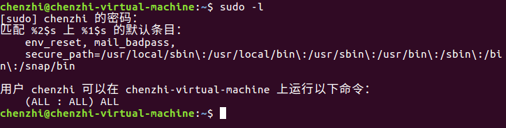

2-30  sudo -l

图

指令

test

user

假如我们现在要创建一个新的用户

，创建新用户的命令为“

”，创

root

建新用户的权限只有

用户才有，我们在装系统的时候创建的那个用户是没

2-31

有这个权限的，如图

所示。

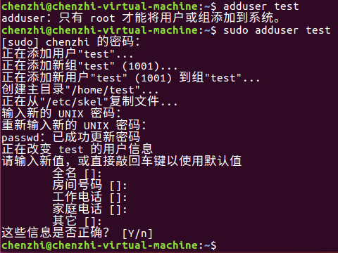

2-31  sudo

图

创建用户

adduser test

adduser

刚开始直接使用“

”命令添加用户的时候提示我们“

：

root

sudo

只有

才能将用户或组添加到系统。”所以我们要在前面加上“

”命令，

root

adduser

sudo

表示以

用户执行

操作。在前面我们说到

使用时间戳文件来执

“

”

5

行类似的

检票

系统，用户获得了一张存活期为

分钟的票，超过时间需要再

次“检票”（输入密码）。

2.3.8

adduser

添加用户命令

Linux

adduser

useradd

下

或

命令用来建立用户帐号和创建用户的起始目录，

root

adduser

sudo

使用权限是超级用户。非

用户执行

需临时调权限，前面加

。命

店铺：

官方网站：

https://xiaomeige.taobao.com

www.corecourse.cn

技术博客：

技术群组：

http://www.cnblogs.com/xiaomeige/

---
*下一页*

小梅哥FPGA 团队    武汉芯路恒科技

专注于培养您的FPGA 独立开发能力   开发板 培训 项目研发三位一体

令格式如下：

adduser     [参数]     name

2-8

常用的参数如表

所示。

2-8  adduser

表

常用参数

指令

指令参数说明

-system

添加一个系统用户

-uid ID

ID

uid

表示用户的

-ingroup GRP

表示用户所属的组名

-password

指定新用户的密码

-group

添加用户组

sudo

adduser

在前面介绍

系统管理指令的时候已经通过

的使用建立了一个

新用户，读者也可以尝试创建一个系统用户，指令如下：

sudo adduser -system nametest

2-32

建立系统用户的演示如图

所示。

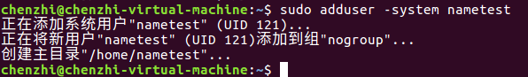

2-32

图

创建系统用户

2.3.9

passwd

修改用户密码

passwd

“

我们可以对用户的密码进行修改。输入“

”命令之后，会弹出

更改

chenzhi

”

的密码

的提示，用户此时需要输入希望修改的密码。需要注意的是，

修改密码需要输入两次密码，两次输入内容必须一致，而且，在输入密码的时

候，终端界面中是不会出现任何信息的，这是为了保护用户的密码安全而设计

的。

如果当前用户没有设置密码，当需要设置用户密码时，操作方式和修改密

passwd

2-33

码一样，直接使用“

”命令即可实现，如图

所示。

2-33

图

修改用户密码

店铺：

官方网站：

https://xiaomeige.taobao.com

www.corecourse.cn

技术博客：

技术群组：

http://www.cnblogs.com/xiaomeige/

---
*下一页*

小梅哥FPGA 团队    武汉芯路恒科技

专注于培养您的FPGA 独立开发能力   开发板 培训 项目研发三位一体

2.3.10

deluser

删除用户命令

deluser

命令功能很简单，就是删除用户的相关数据，退出用户组。

此命令

root

sudo

deluser

拥有

的用户才能使用，或者在前面加上“

”命令，“

”，命令

参数如下：

deluser     [参数]     [用户名]

主要参数命令如

所示。

2-9

表

2-9  deluser

表

指令参数

指令

指令参数说明

-remove-all-files

删除用户拥有的所有文件

-remove-home

删除用户的主目录和邮件后台处理程序

-backup-to

目标目录进行备份

-system

只有系统用户才能删除

sudo

root

这里我们尝试删除我们之前建立的用户，要使用“

”来获取

权限

2-34

运行，如图

所示。

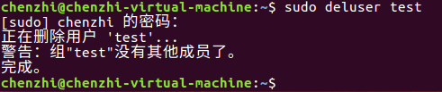

2-34

test

图

删除

用户

2.3.11

su

切换用户命令

su

是最简单的用户切换命令，通过该命令可以实现任何身份的切换，包括

root

root

从普通用户切换为

用户、

用户切换为普通用户以及普通用户之间的切

root

sudo

换。之前在需要用到

身份执行命令时我们都是在指令前加上“

”去执

su

root

行，但并没有改变当前的用户身份，

则是完全完成用户切换。在

用户下，

root

所有的命令都可以无障碍执行。普通用户之间切换以及普通用户切换至

用

root

户，都需要知晓对方的密码，只有正确输入密码，才能实现切换；从

用户

切换至其他用户，无需知晓对方密码，直接可切换成功。

su

“

”命令格式如下：

su     [选项]     [用户名]

2-10

常用选项参数如表

所示。

2-10  su

表

指令参数

指令

指令参数说明

-c

command

–

执行指定的命令，执行完毕以后回复原用户身份。

店铺：

官方网站：

https://xiaomeige.taobao.com

www.corecourse.cn

技术博客：

技术群组：

http://www.cnblogs.com/xiaomeige/

---
*下一页*

小梅哥FPGA 团队    武汉芯路恒科技

专注于培养您的FPGA 独立开发能力   开发板 培训 项目研发三位一体

-login

PATH

改变用户身份，同时改变工作目录和

环境变量

-m

改变用户身份的时候不改变环境变量

-h

显示帮助信息

sudo su

root

2-35

使用命令“

”切换到

用户

，如图

所示

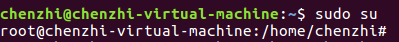

2-35

root

图

切换

用户

root

输入指令，普通用户切换至

用户，需要输入确认用户密码，只有正确

root

输入密码，才能实现切换。输入密码，密码正确切换到

用户。可以看到提

@

root

示符变为白色，提示符的“

”符号前面的用户信息变成了“

”，表示当前

root

#

的用户是

用户，以“

”结束。

root

su chenzhi

,

root

把于

用户切换回普通用户，输入“

”

由于这里是已经

用

sudo

2-36

户，不需要

指令就可以完成用户的切换，也不用确认密码。如图

所示。

2-36

图

切换回普通用户

2.3.12

cat

显示文件内容命令

cat

concatenate

的英文全称是“

”，该命令用来连接文件并将文件内容打印

cat

Windows

type

到标准输出设备上，

经常用来显示文件的内容，类似于

下的

cat

命令。

命令格式如下：

cat     [选项]     [文件]

2-11

主要参数如表

所示。

2-11  cat

表

参数

指令

指令参数说明

-n

1

由

开始对所有输出的行进行编号，包括空行

-s

显示行数，多个空行算一个编号

-b

-n

和

类似，但是不对空白行编号。

-E

$

每行结束处显示

符号

-T

TAB

^I

将

字符显示为

符号

--help

显示帮助信息

--version

显示版本信息

book

2-37

我们可以查看文档目录下的“

”文本文件，如图

所示。

2-37  cat

图

查看文件

店铺：

官方网站：

https://xiaomeige.taobao.com

www.corecourse.cn

技术博客：

技术群组：

http://www.cnblogs.com/xiaomeige/

---
*下一页*

小梅哥FPGA 团队    武汉芯路恒科技

专注于培养您的FPGA 独立开发能力   开发板 培训 项目研发三位一体

2.3.13

建立链接

当我们需要在不同的目录，用到相同的文件或文件夹时，不需要在每一个

需要的目录下都放一个必须相同的文件，我们只要在某个固定的目录，放上该

ln -s

link

文件，然后在其它的目录下用“

”命令链接（

）它就可以，不必重复的

占用磁盘空间。它的功能是为某一个文件在另外一个位置建立一个同步的链接。

Linux

(link)

文件系统中，有所谓的链接

，我们可以将其视为文件的别名，

:

(hard link)

(symbolic link)

而链接又可分为两种

硬链接

与软链接

。

⚫

硬链接（ln）：硬链接的意思是一个文件可以有多个名称，

以文件副本的

形式存在。硬链接只有在同一个文件系统中才能创建，不允许给目录创建

硬链接。

默认情况下，ln 产生硬链接。

⚫

软链接（ln -s）：软链接（符号链接）的方式则是产生一个特殊的文件，

该文件的内容是指向另一个文件的位置。它是以路径的形式存在，类似于

Windows 操作系统中的快捷方式。相较于硬链接，软链接是可以跨文件系

统，

可以对目录进行链接，如果链接到一个目录，那么可以列出多个文

件。符号链接中包含了它所链接的文件的名字。当对链接执行打开操作的

时候，会使用到引用文件。在创建符号链接之前，可以不需要存在源文件

ln

命令会保持每一处链接文件的同步性，也就是说，不论你改动了哪一处，

其它的文件都会发生

同步

的变化，

无论是软链接还是硬链接。

硬链接是存在同

一个文件系统中，而软链接却可以跨越不同的文件系统。

-s,

这个命令最常用的参数是

具体用法是：

ln -s 源文件 目标文件

ln

2-12

的常见参数如表

所示。

2-12  ln

表

的常见参数

指令

指令参数说明

-b

为每个已存在的目标文件创建备份文件，但不接受任何参数

-d

允许超级用户制作目录的硬链接

-f

强行删除任何已存在的目标文件

-i

提示是否移除目标

-n

把符号链接视为一般目录

-s

(

)

软链接

符号链接

-v

显示详细的处理过程

book

下面我们在文档目录下新建一个“

”文本文件并创建它的硬链接文件

book_1

2-38

“

”，查看其信息，如图

所示。

店铺：

官方网站：

https://xiaomeige.taobao.com

www.corecourse.cn

技术博客：

技术群组：

http://www.cnblogs.com/xiaomeige/

---
*下一页*

小梅哥FPGA 团队    武汉芯路恒科技

专注于培养您的FPGA 独立开发能力   开发板 培训 项目研发三位一体

2-38

book_1

图

建立硬链接文件

book

book_1

读者可以尝试在“

”文本中添加或修改内容，“

”链接文件会

book_1

book

自动进行更新，也可以在“

”链接文本中添加或修改内容，“

”源

book

2-39

文件也会自动进行更新。在“

”文本中添加如图

所示内容。

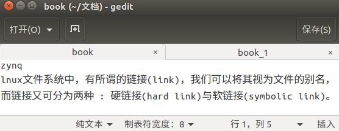

2-39

book

图

在

中添加文本信息

book_1

,

book_1

打开链接文件“

”

可以观察到“

”文件内容也进行了更新，

2-40

如图

所示。

2-40

book_1

图

查看

文本信息

testdir

testdir

book

在用户目录新建一个文件夹“

”，在“

”文件夹下生成“

”

book_1

,

2-41

文件的软链接“

”

如图

所示。

店铺：

官方网站：

https://xiaomeige.taobao.com

www.corecourse.cn

技术博客：

技术群组：

http://www.cnblogs.com/xiaomeige/

---
*下一页*

小梅哥FPGA 团队    武汉芯路恒科技

专注于培养您的FPGA 独立开发能力   开发板 培训 项目研发三位一体

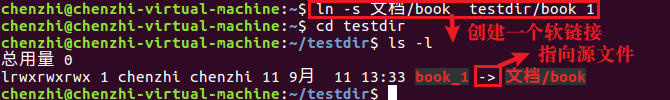

2-41

图

生成软链接

ls

->

如果你用

察看一个目录时，发现有的文件后面有一个指向符号“

”，

ln

ls -l

link

那就是一个用

命令生成的文件，用

命令去察看，就可以看到显示的

的路径了。

2.3.14

ifconfig

显示和配置网络属性命令

PC

在开发时，

通常需要通过网络与开发板互联，因此需要设置开发板、

PC

PC

以及路由器（

也可以不经过路由器，直接和开发板直连）处于同一网段。

PC

ipconfig -all

PC

首先可以在

上通过“

”命令查看

的网络地址并确定网段，然

后再设置开发板的网段与其相同。

ifconfig(interfaces config)

root

sudo

，通常需要以

身份登录或使用

来使用

ifconfig

ifconfig

工具配置网络或显示当前网络接口状态，

命令可以用于查看、显

IP

MAC

示和配置、激活或关闭网络接口，例如设置

地址、掩码、

地址、广播地

址、网关、激活或关闭网络接口。设置开发板的网络地址有两种方式，临时设

置法和永久设置法。

IP

临时设置法是指通过命令指定网卡的

地址，该地址会在系统下一次启动

IP

IP

ifconfig

或者修改

地址前保持不变，临时指定

地址的命令格式为“

网卡名

IP

ifconfig

地址”。需要注意的是用

命令配置的网卡信息为临时设置，在网卡重

启后机器重启后，配置就不存在了。

此命令格式如下：

ifconfig interface options | address

2-13

主要参数如表

所示。

2-13

表

主要参数

指令

指令参数说明

add

IPv6

IP

设置网络设备

的

地址

del

IPv6

IP

删除网络设备

的

地址

down

关闭指定的网络设备

up

启动指定的网络设备

irq

IRQ

设置网络设备的

media

设置网络设备的媒介类型

mem_start

设置网络设备在主内存所占用的起始地址。

店铺：

官方网站：

https://xiaomeige.taobao.com

www.corecourse.cn

技术博客：

技术群组：

http://www.cnblogs.com/xiaomeige/

---
*下一页*

小梅哥FPGA 团队    武汉芯路恒科技

专注于培养您的FPGA 独立开发能力   开发板 培训 项目研发三位一体

metric

指定在计算数据包的转送次数时，所要加上的数目。

mtu

MTU

设置网络设备的

netmask

设置网络设备的子网掩码

tunnel

IPv4

IPv6

建立

与

之间的隧道通信地址

io_addr

I/O

设置网络设备的

地址

-broadcast

将要送往指定地址的数据包当成广播数据包来处理。

-pointopoint

与指定地址的网络设备建立直接连线，此模式具有保密功能。

-promisc

promiscuous

关闭或启动指定网络设备的

模式

ifconfig

2-42

使用

查看网络，如图

所示。

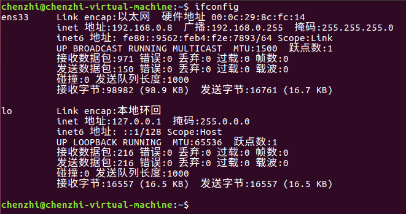

2-42  ifconfig

图

指令

2-42

ens33

lo

图

中可以看到有

和

两个网卡，可以看到网卡的硬件地址等信

ens33

IP

192.168.0.8

ens33

IP

息。

的

地址为

，在上面查看到

的

地址中，

192.168.0

“

”的字段为网段，不同的值代表不同的网段，同一个网段内的设备

PC

能够相互通信。在开发中，

通常需要通过网络与开发板互联，因此需要设置

PC

PC

开发板、

以及路由器（

也可以不经过路由器，直接和开发板直连）处于

PC

“ipconfig -all”

PC

同一网段。首先可以在

上通过

命令查看

的网络地址并确定

网段，然后再设置开发板的网段与其相同。

ens33

IP

sudo ifconfig ens33

这里我们可以尝试修改

的

地址，输入“

192.168.0.12

,

ifconfig

ens33

IP

”

通过指令可以了解到，使用命令“

”修改网卡

的

root

sudo

ifconfig

地址的时候需要

用户权限的，需要补充使用“

”，使用命令“

ens33

ens33

2-43

”可再次查看网卡

，如图

所示。

店铺：

官方网站：

https://xiaomeige.taobao.com

www.corecourse.cn

技术博客：

技术群组：

http://www.cnblogs.com/xiaomeige/

---
*下一页*

小梅哥FPGA 团队    武汉芯路恒科技

专注于培养您的FPGA 独立开发能力   开发板 培训 项目研发三位一体

2-43

IP

图

修改

地址

2.3.15

man

系统帮助命令

man

“manual”

man

Linux

“

”的全称是

。

命令

是

操作系统下的帮助指令，通

man

Linux

过

指令可以查看

中的指令帮助、配置文件帮助和编程帮助等信息。

用来帮助用户完成查看系统命令中其它命令的参数、用法（如果搜索不到这个

命令那就表示命令不是系统命令）。

man

“

”命令格式如下：

man     [命令名]

man

ls

在查询命令时，在“

”后输入要查询的命令就可以，这里我们查询“

”

2-44

命令，如图

所示。

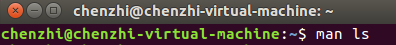

2-44

ls

图

查询

指令

2-45

q

查询后的界面如图

所示，这里展示部分内容，按“

”键可以重新回到

终端界面。

2-45

图

查询界面

店铺：

官方网站：

https://xiaomeige.taobao.com

www.corecourse.cn

技术博客：

技术群组：

http://www.cnblogs.com/xiaomeige/

---
*下一页*

小梅哥FPGA 团队    武汉芯路恒科技

专注于培养您的FPGA 独立开发能力   开发板 培训 项目研发三位一体

2.3.16

install

软件安装命令

install

命令的作用是安装或升级软件或备份数据，它的使用权限是所有用户。

install

/

install

命令可以将文件

目录拷贝到指定的地点，

允许你控制目标文件的属

install

makefile

性。

通常用于程序的

，使用它来将程序拷贝到目标（安装）目录。

install

命令“

”格式如下：

install [

]    [-T]

选项

源文件

目标文件

install [

]

或：

选项

源文件

目录

install [

]    -t

...

或：

选项

目录

源文件

install [

]    -d

...

或：

选项

目录

<

>

<

>

<

>

在前两种格式中，会将

来源

复制至

目的地

或将多个

来源

文件复制至

<

>

/

已存在的

目录

，同时设定权限模式及所有者

所属组。在第三种格式中，会创

建所有指定的目录及它们的主目录。长选项必须用的参数在使用短选项时也是

install

apt-get

必须的。在第四种形式会创建指定的目录。命令“

”通常和命令“

”

组合在一起使用。

2-14

选项如表

所示。

2-14

表

选项

指令

指令参数说明

-backup

为每个已存在的目的地文件进行备份

-b

-backup

类似

，但不接受任何参数。

-c

(

)

此选项不作处理

-d

所有参数都作为目录处理，而且会创建指定目录的所有

主目录

-D

<

>

<

>

<

创建

目的地

前的所有主目录，然后将

来源

复制至

>

目的地

；在第一种使用格式中有用

-g

自行设定所属组，而不是进程目前的所属组

-m

(

chmod)

rwxr-xr-x

自行设定权限模式

像

，而不是

-o

(

)

自行设定所有者

只适用于超级用户

-p

<

>

/

以

来源

文件的访问

修改时间作为相应的目的地文件

的时间属性

-s

strip

symbol table

用

命令删除

，只适用于第一及第二种

使用格式

-S

<

>

自行指定备份文件的

后缀

-v

/

处理每个文件

目录时印出名称

2.3.17

date

时间显示

date

命令可以用来显示或设定系统的日期与时间，在显示方面，使用者可

以设定欲显示的格式，格式设定为一个加号后接数个标记。

店铺：

官方网站：

https://xiaomeige.taobao.com

www.corecourse.cn

技术博客：

技术群组：

http://www.cnblogs.com/xiaomeige/

---
*下一页*

小梅哥FPGA 团队    武汉芯路恒科技

专注于培养您的FPGA 独立开发能力   开发板 培训 项目研发三位一体

2-15

其中可用的时间标记列表如表

所示。

2-15

表

时间标记

时间标记

标记说明

%

%

印出

%n

下一行

%t

跳格

%H

(00..23)

小时

%I

(01..12)

小时

%k

(0..23)

小时

%M

(00..59)

分钟

%p

AM

PM

显示本地

或

%r

(12

hh:mm:ss [AP]M)

直接显示时间

小时制，格式为

%s

1970

1

1

00:00:00 UTC

从

年

月

日

到目前为止的秒数

%S

(00..61)

秒

%T

(24

)

直接显示时间

小时制

%X

%H:%M:%S

相当于

%Z

显示时区

2-16

其中可用的日期标记列表如表

所示。

2-16

表

日期标记

日期标记

标记说明

%a

(Sun..Sat)

星期几

%A

(Sunday..Saturday)

星期几

%b

(Jan..Dec)

月份

%B

(January..December)

月份

%c

直接显示日期与时间

%d

(01..31)

日

%D

(mm/dd/yy)

直接显示日期

%h

%b

同

%j

(001..366)

一年中的第几天

%m

(01..12)

月份

%U

(00..53) (

Sunday

)

一年中的第几周

以

为一周的第一天的情形

%w

(0..6)

一周中的第几天

%W

(00..53) (

Monday

)

一年中的第几周

以

为一周的第一天的情形

%x

(mm/dd/yy)

直接显示日期

%y

(00.99)

年份的最后两位数字

%Y

(0000..9999)

完整年份

root

系统时间显示需要

权限。若是不以加号作为开头，则表示要设定时间，

MMDDhhmm[[CC]YY][.ss]

MM

DD

hh

而时间格式为

，其中

为月份，

为日，

为

mm

CC

YY

ss

小时，

为分钟，

为年份前两位数字，

为年份后两位数字，

为秒数。

语法格式：

date [-u] [-d datestr] [-s datestr] [--utc] [--universal] [--

店铺：

官方网站：

https://xiaomeige.taobao.com

www.corecourse.cn

技术博客：

技术群组：

http://www.cnblogs.com/xiaomeige/

---
*下一页*

小梅哥FPGA 团队    武汉芯路恒科技

专注于培养您的FPGA 独立开发能力   开发板 培训 项目研发三位一体

date=datestr] [--set=datestr] [--help] [--version] [+FORMAT]

[MMDDhhmm[[CC]YY][.ss]]

2-17

参数说明如表

所示。

2-17  date

表

参数

指令

指令参数说明

-d datestr

datestr

(

)

显示

中所设定的时间

非系统时间

-s datestr

datestr

将系统时间设为

中所设定的时间

-u

显示目前的格林威治时间

--version

显示版本编号

date

输入指令“

”来查看时间，可以添加不同的标记显示不同格式的时间，

2-46

如图

所示。

2-46

图

时间显示演示

2.3.18

kill

停止某个进程

当系统中某个程序因为异常退出时，其进程还残留在系统中，其所占用的

资源也没有释放。因此需要强制删除该进程。

ps

查看系统进程使用

命令可以查看当前系统所有正在运行的进程，功能相

Windows

2-47

当于

任务管理器，如图

所示。

2-47

图

查看系统进程

PID

其中

就是该进程的进程号，当我们需要停止某进程时，就得用到该进

程号。需要注意的是，每次系统启动，或者每次进程被开启，相同功能的

PID

ps

进程的

值一般都不一样，因此使用时务必先使用

命令查看当前系统中该

PID

进程的

值。

PID

如果我们要停止某一个，可以通过杀死该进程来实现。记住其进程

，

bash

PID

2983

例如在本次系统启动后的“

”终端进程，该进程

为

，作为演示在

kill -9 2983

终端中输入“

”即可将该进程杀死，当然杀死终端进程之后就会退出

店铺：

官方网站：

https://xiaomeige.taobao.com

www.corecourse.cn

技术博客：

技术群组：

http://www.cnblogs.com/xiaomeige/

---
*下一页*

小梅哥FPGA 团队    武汉芯路恒科技

专注于培养您的FPGA 独立开发能力   开发板 培训 项目研发三位一体

2-48

终端，如图

所示。

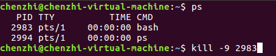

2-48

图

结束进程

杀死进程的操作在调试应用程序时候经常用到。在调试程序时，经常会因

为程序设计不合理而无法正常退出，而设计者只能使用此种方式来将其强制杀

死。

2.3.19

重启和关机

reboot

当需要对系统进行重启时，可以使用“

”命令实现。当需要将系统关

shut down now -h

poweroff

机时，可以使用“

”或者“

”命令实现。

Ubuntu

重启指令的功能与

主界面右上角的齿轮按钮来选择重启系统是一样

reboot

2-49

的，直接输入命令“

”然后点击回车键，如图

所示。

2-49

图

重启演示

poweroff

poweroff

使用命令“

”就可以关闭系统，在终端中输入命令“

”然

2-50

后按下回车键，如图

所示。

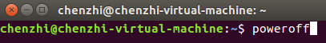

2-50

图

关机演示

2.4

APT

下载工具

Advanced Package Tool

APT

linux

Debian

高级包装工具（

，简称：

）是

的

发

Debian

Ubuntu

行版已经一些以

为基础的发行版（

等）下，做软件包管理的一个

APT

apt-

apt-get

apt-cache

工具。

由几个名字以“

”打头的程序组成“

”、“

”和

apt-cdrom

APT

“

”是处理软件包的命令行工具。

可以提供下载、安装、更新、

删除软件包的功能。

Ubuntu

APT

APT

在

系统运用最多的下载工具就是

下载工具，

下载工具可

APT

以实现软件自动下载、配置、安装二进制或者源码的功能。

下载工具和我

install

Ubuntu

们前面讲解的“

”命令结合在一起构成了

下最常用的下载和安装

店铺：

官方网站：

https://xiaomeige.taobao.com

www.corecourse.cn

技术博客：

技术群组：

http://www.cnblogs.com/xiaomeige/

---
*下一页*

小梅哥FPGA 团队    武汉芯路恒科技

专注于培养您的FPGA 独立开发能力   开发板 培训 项目研发三位一体

软件方法。

2-51

打开系统设置，打开“软件和更新”设置，打开以后如图

所示。

2-51

图

软件和更新

2-51

APT

Ubuntu

Ubuntu

图

中

工具的“

软件”安装源选择中国的服务器，

APT

C/S

PC

安装成功以后要更新源。

采用的

“

”客户端加服务器模式，

机作为

客户端，需要知道服务器的地址，当需要下载软件的时候就向服务器请求。

APT

Ubuntu

这里可以对

工作原理进行了解。

采用集中式的软件仓库机制，

将各式各样的软件包分门别类地存放在软件仓库中，进行有效地组织和管理。

然后，将软件仓库置于许许多多的镜像服务器中，并保持基本一致。这样，所

Ubuntu

有的

用户随时都能获得最新版本的安装软件包。因此，对于用户，这些

镜像服务器就是他们的软件源。然而，由于每位用户所处的网络环境不同，不

Ubuntu

可能随意地访问各镜像站点。为了能够有选择地访问，在

系统中，使用

/etc/apt/sources.list

软件源配置文件

列出最合适访问的镜像站点地址。

2.4.1

apt-get

运用

apt-get

是一个下载安装软件包的简单命令行接口。最常用的命令是

update(

)

install(

)

更新

和

安装

。常用用法如下：

apt-get [选项] 命令 apt-get [选项] install|remove pkg1 [pkg2 ...]

apt-get [选项] source pkg1 [pkg2 ...]

pt-get

2-18

a

的常用参数命令如表

所示。

2-18  apt-get

表

命令

指令

说明

店铺：

官方网站：

https://xiaomeige.taobao.com

www.corecourse.cn

技术博客：

技术群组：

http://www.cnblogs.com/xiaomeige/

---
*下一页*

小梅哥FPGA 团队    武汉芯路恒科技

专注于培养您的FPGA 独立开发能力   开发板 培训 项目研发三位一体

update

重新获取软件包列表

upgrade

进行更新

install

安装新的软件包

remove

移除软件包

autoremove

自动移除全部不使用的软件包

purge

移除软件包和配置文件

source

下载源码档案

build-dep

为源码包配置编译依赖

dist-upgrade

发行版升级

dselect-upgrade

dselect

依照

的选择更新

clean

清除下载的归档文件

autoclean

清除旧的的已下载的归档文件

check

检验是否有损坏的依赖

apt-get

2-19

的选项如表

所示。

2-19  apt-get

表

选项

指令

说明

-h

文本帮助文件

-q

-

输出到日志

无进展指示

-qq

不输出信息，错误除外

-d

-

仅下载

不安装或解压归档文件

-s

不实际安装。模拟执行命令

-y

假定对所有的询问选是，不提示

-f

尝试修正系统依赖损坏处

-m

如果归档无法定位，尝试继续

-u

同时显示更新软件包的列表

-b

-V

获取源码包后编译

显示详细的版本号

2.4.2

更新数据库

apt-get

运用

可以进行本地数据库更新，查看本地软件是否可以更新使用如

下命令：

sudo apt-get update

这个命令会访问源地址，获得最近的软件包的列表，列表中包含一些包的

信息，比如这个包是否更新过，并且获取软件列表并保存在本电脑上，如图

2-52

所示。

店铺：

官方网站：

https://xiaomeige.taobao.com

www.corecourse.cn

技术博客：

技术群组：

http://www.cnblogs.com/xiaomeige/

---
*下一页*

小梅哥FPGA 团队    武汉芯路恒科技

专注于培养您的FPGA 独立开发能力   开发板 培训 项目研发三位一体

2-52

图

更新本地数据库

2.4.3

查看依赖关系

在本地某一些软件存在依赖关系，依赖关系的检查可以使用以下指令：

sudo apt-get check

2-53

在本地检验是否有损坏的依赖，如图

所示。

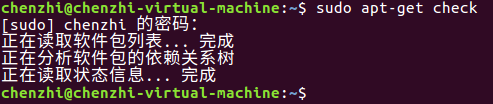

2-53

图

依赖关系检查

2.4.4

软件安装

:

软件安装的指令如下

sudo apt-get install <package-name >

package-name

Ubuntu

“

”就为要安装的软件名字，比如我们要安装软件

下

minicom

sudo apt-get install minicom

的串口工具“

”，我们就可以使用“

2-54

”命令，如图

所示。

2-54  minicom

图

软件

店铺：

官方网站：

https://xiaomeige.taobao.com

www.corecourse.cn

技术博客：

技术群组：

http://www.cnblogs.com/xiaomeige/

---
*下一页*

小梅哥FPGA 团队    武汉芯路恒科技

专注于培养您的FPGA 独立开发能力   开发板 培训 项目研发三位一体

[Y/n]

安装过程中会提示我们“您希望继续执行吗？

”

Y

n

望继续执行的话就输入“

”，如果不希望继续执行的话就输入

，如图

2-55

所示。

2-55

图

安装完成

minicom

安装完成以后我们直接在终端输入如下命令打开

这个串口软件，

2-56

如图

所示。

2-56

minicom

图

打开

ESC

minicom

按下

键可以退出

。

2.4.5

软件更新

有时候我们需要更新软件，更新软件的话使用命令：

sudo apt-get upgrade package-name

2-57

package-name 为要升级的软件名字，如图

所示。

店铺：

官方网站：

https://xiaomeige.taobao.com

www.corecourse.cn

技术博客：

技术群组：

http://www.cnblogs.com/xiaomeige/

---
*下一页*

小梅哥FPGA 团队    武汉芯路恒科技

专注于培养您的FPGA 独立开发能力   开发板 培训 项目研发三位一体

2-57  minicom

图

软件升级

y

继续更新输入“

”，等待更新完成。

2.4.6

软件卸载

卸载某个软件的话使用如下命令：

sudo apt-get remove package-name

package-name

minicom

是要卸载的软件，比如卸载前面安装的

这个软件，

2-58

如图

所示。

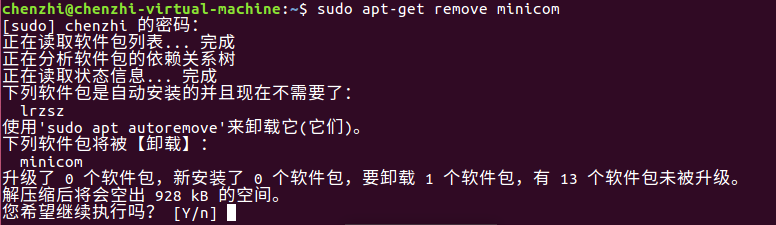

2-58

minicom

图

卸载

店铺：

官方网站：

https://xiaomeige.taobao.com

www.corecourse.cn

技术博客：

技术群组：

http://www.cnblogs.com/xiaomeige/

---
*下一页*

小梅哥FPGA 团队    武汉芯路恒科技

专注于培养您的FPGA 独立开发能力   开发板 培训 项目研发三位一体

Y

询问是否继续执行，继续卸载输入“

”。

2.5

Ubuntu

Vi/Vim

下文本编辑

编辑器

Linux

如果需要对文件进行编辑，除了可以使用

自带的编辑器外，也需要

Vi

Vi

“Visual Interface”/Vim“Vi IMproved”

Linux

使用

编辑器，。

全称

，是

上非常

Vim

Vi

Vi

常用的编辑器，

是

的增强版，相比

拥有更多便利的功能。工作在字符

Vi/Vim

模式下，支持众多的命令，是一款功能强大，效率很高的文本编辑器。

编辑器可以对文本进行编辑、删除、查找和替换、文本块操作等，全部操作都

是在命令模式下进行的。

Vi(Vim)

Linux

命令繁多，如果能灵活使用会大大提高效率，很多

发行版都

Vi(Vim)

Vi(Vim)

默认安装了

。

编辑器都是一种基于指令式的编辑器，没有鼠标

的操作，仅仅使用键盘来完成所有的编辑工作。

Vim

安装

编辑器，命令如下：

sudo apt-get install vim

Y

2-59

输入指令，输入“

”确认安装，如图

所示

2-59

VIM

图

安装

编辑器

店铺：

官方网站：

https://xiaomeige.taobao.com

www.corecourse.cn

技术博客：

技术群组：

http://www.cnblogs.com/xiaomeige/

---
*下一页*

小梅哥FPGA 团队    武汉芯路恒科技

专注于培养您的FPGA 独立开发能力   开发板 培训 项目研发三位一体

Vim

编辑器有两种工作模式：

⚫

命令模式：从键盘上输入的任何字符都被作为编辑命令来解释，Vim 下很

多操作如配置编辑器、文本查找和替换、选择文本等都是在命令模式下进

行的。

其中底行命令模式可以保存文件、退出Vim、设置Vim、查找等功能。

⚫

输入模式：从键盘上输入的所有字符都被插入到正在编辑的缓冲区中，被

当作正文。启动 Vi 后处于命令模式，在命令模式下，输入编辑命令（插

入（i 或者 I）、附加（a 或者 A）以及打开（o 或者 O）），将进入输

入模式；在输入模式下，按 ESC 键将进入命令模式。

2.5.1

Vim

进入

编辑

vim +

在命令窗口中输入“

文件名”即可启动对文件的编辑，例如要编辑

/etc/network/

interfaces

vim

“

” 目录下的“

” 文件，只需要输入“

/etc/network/interfaces

”命令即可打开该文件。

vim

通过切换不同的模式可以完成不同的功能，打开终端，输入命令“

test.txt

2-60

”，编辑一个文本文档，如图

所示。

2-60

图

打开一个文本文档

2-61

打开窗口如图

所示。

2-61

图

文本文档窗口

2.5.2

Vim

模式切换

Vim

为

默认是以只读模式打开的文档，因此我们要切换到输入模式，切换

2-20

到输入模式的命令如表

所示。

2-20  Vim

表

模式切换

指令

说明

店铺：

官方网站：

https://xiaomeige.taobao.com

www.corecourse.cn

技术博客：

技术群组：

http://www.cnblogs.com/xiaomeige/

---
*下一页*

小梅哥FPGA 团队    武汉芯路恒科技

专注于培养您的FPGA 独立开发能力   开发板 培训 项目研发三位一体

i

在当前光标所在字符的前面，转为输入式

I

在当前光标所在行的行首转换为输入模式

a

在当前光标所在字符的后面，转为输入模式

A

在光标所在行的行尾，转换为输入模式

o

在当前光标所在行的下方，新建一行，并转为输入式

O

在当前光标所在行的上方，新建一行，并转为输入式

s

删除光标所在字符

r

替换光标处字符

R

(

)

替换

覆盖

当前光标位置及后面的若干文本

ESC

进入命令模式

i/I

a/A

o/O

在命令模式下输入编辑命令（

、

、

），就可以进入输入模式，

Vim

左下角将会提示“插入”字样。在输入模式下，任何从键盘输入的字符都

2-62

将被当成正文，如图

所示。

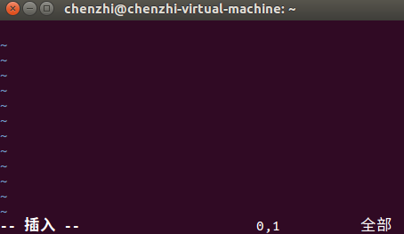

2-62

图

文本输入模式

此时我们可以进行正常的文本输入，中文输入需要在右上角切换输入法，

2-63

输入法设置可以查看第一章节内容，如图

所示，文本可以正常输入。

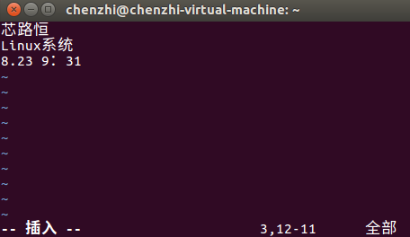

2-63

图

进行文本输入

Ubuntu

Windows

在

系统中各种快捷键的使用与

系统下的快捷键不相同，所

Windows

Ubuntu

以不能按照平时使用

系统的快捷方式在

系统下对文本进行操作。

Ubuntu

Vim

在

系统进行文本保存时涉及到模式的切换，需要从

现在的输入

店铺：

官方网站：

https://xiaomeige.taobao.com

www.corecourse.cn

技术博客：

技术群组：

http://www.cnblogs.com/xiaomeige/

---
*下一页*

小梅哥FPGA 团队    武汉芯路恒科技

专注于培养您的FPGA 独立开发能力   开发板 培训 项目研发三位一体

ESC

2-64

模式切换到指令模式，按下“

”可以切换到指令模式，如图

所示。

2-64

图

指令模式

2-64

图

中左下角“插入”消失，表示我们已经切换到了指令模式，如果需

要再切换到文本模式再次按“a”键即可。在指令模式，我们可以输入指令对文

本进行控制。在指令模式可以切换到底行模式，在底行模式可以对文本进行保

2-65

存等操作，在指令模式输入“：”可切换底行模式，如图

所示。

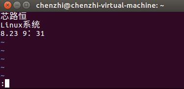

2-65

图

切换底行模式

在底行模式输入指令就可以进行文件保存等操作，这里我们不进行文件操

Vi(Vim)

作，我们可以删除底行的“：”就会重新回到指令模式。下面对

的指令

进行分类列举。

2.5.3

Vim

指令操作

2-21

在指令模式下光标的移动控制键指令如表

所示。

2-21

表

移动光标类

指令

说明

方向键

移动光标

h

向左移动光标

j

向下移动光标

k

向上移动光标

l

向右移动光标

空格键

向右移动光标

店铺：

官方网站：

https://xiaomeige.taobao.com

www.corecourse.cn

技术博客：

技术群组：

http://www.cnblogs.com/xiaomeige/

---
*下一页*

小梅哥FPGA 团队    武汉芯路恒科技

专注于培养您的FPGA 独立开发能力   开发板 培训 项目研发三位一体

Backspace

向左移动光标

Enter

移动到下一行首

-

移动到上一行首

2-22

删除、恢复字符类指令如表

所示。

2-22

表

删除、恢复指令

指令

说明

x

删除当前字符

nx

n

删除从光标开始向后的

个字符

dd

删除当前行

ndd

n

向下删除当前行在内的

行

u

撤销上一步操作

U

撤销对当前行的所有操作

J(shift + j)

删除两行之间的空行，实际上是

合并两行

D

删除当前字符至行尾

dj

删除上一行

dk

删除下一行

PageUp

PageDown

无论在输入模式下还是命令模式下，都支持

和

翻页。另

Vi(Vim)

2-23

外，

支持命令快速光标定位，常用命令如表

所示。

2-23

表

跳转指令

指令

说明

n+

n

向下跳

行

n-

n

向上跳

行

nG

n

跳到行号为

的行

G

跳至文件的底部

gg

1

将光标定位到第

行

ngg

n

将光标定位到第

行

:n

n

将光标定位到第

行

2-24

复制、粘贴指令如表

所示。

2-24

表

复制、粘贴指令

指令

说明

yy

复制当前行

nyy

n

复制当前行及其下面

行

ayy

a

a

a

a

复制当前行到“

”，“

”为缓冲区，

也可以替换为

z

到

的任意字母，可以完成多个复制任务

anyy

n

a

a

复制当前行及其下面

行到“

”缓冲区，

也可以替换

a

z

为

到

的任意字母，可以完成多个复制任务

yw

复制从光标开始到词尾的字符

nyw

n

复制从光标开始的

个单词

y^

复制从光标到行首的内容

y$

复制从光标到行尾的内容

店铺：

官方网站：

https://xiaomeige.taobao.com

www.corecourse.cn

技术博客：

技术群组：

http://www.cnblogs.com/xiaomeige/

---
*下一页*

小梅哥FPGA 团队    武汉芯路恒科技

专注于培养您的FPGA 独立开发能力   开发板 培训 项目研发三位一体

p

粘贴剪切板里的内容在光标后

ap

a

粘贴缓冲区的内容在光标后，“

”为缓冲区

ndd

n

p

剪切当前行之后的

行。利用

命令可以对剪切的内容

进行粘贴

d

剪切选中的内容

2-25

替换命令如表

所示。

2-25

表

替换命令

指令

说明

ra

a

将当前字符替换为

，当期字符即光标所在字符

s/old/new/

old

new

用

替换

，替换当前行的第一个匹配

s/old/new/g

old

new

用

替换

，替换当前行的所有匹配

%s/old/new/

old

new

用

替换

，替换所有行的第一个匹配

%s/old/new/g

old

new

用

替换

，替换整个文件的所有匹配

:10,20 s/^/ /g

10

20

在第

行至第

行每行前面加四个空格，用于缩进

当输入完成，需要保存并退出，或者需要放弃当前输入内容的保存时分别

Ubuntu

输入相应的退出命令即可实现。

系统中保存文本需要使用保存文本的命

令，保存文档的命令是在底行模式中，我们要在指令模式下输入“：”进入底

2-26

行模式，文本保存退出类命令如表

所示，表中“：”代表底行模式输入。

2-26

表

保存文件

指令

说明

:w

保存文件

:w xinlu

xinlu

保存至

文件

:q

退出编辑器

:q!

退出编辑器，且不保存

:wq

退出编辑器，且保存文件

wq

test.txt

Vi/Vim

2-66

在底行模式下输入“

”保存

并退出

编辑器，如图

所

示。

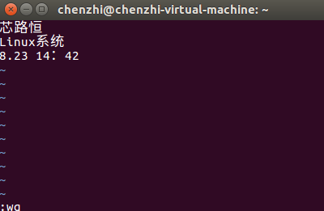

2-66

VI/VIM

图

退出

编辑器

cat

“test.txt”

2-67

我们可以使用命令“

”来查看新建的

文档的内容，如图

所

示。

店铺：

官方网站：

https://xiaomeige.taobao.com

www.corecourse.cn

技术博客：

技术群组：

http://www.cnblogs.com/xiaomeige/

---
*下一页*

小梅哥FPGA 团队    武汉芯路恒科技

专注于培养您的FPGA 独立开发能力   开发板 培训 项目研发三位一体

2-67

图

查看文档

2-27

文件命令如表

所示。

2-27

表

文件命令

指令

说明

vim file

打开单个文件

vim file1 file2 file3 …

同时打开多个文件

:open file

vim

在

窗口中打开一个新文件

:split file

在新窗口中打开文件

:bn

切换到下一个文件

:bp

切换到上一个文件

:args

[]

查看当前打开的文件列表，当前正在编辑的文件会用

括起来

2-28

搜索指令如表

所示。

2-28

表

搜索指令

指令

说明

/xinlu

xinlu

向光标下搜索

字符串

?xinlu

xinlu

向光标上搜索

字符串

n

向下搜索前一个搜素动作

N

向上搜索前一个搜索动作

/

/

表中“

”也是进入底行模式的指令，在指令模式下输入“

”，进入底行模

test.txt

Linux

2-68

式，输入搜索指定的内容，如

文件中“

”，如图

所示。

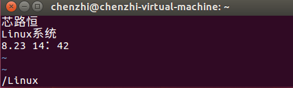

2-68

图

输入查找内容

test.txt

Linux

2-69

按下回车键就会在

中找到与字符串“

”匹配的部分，如图

所示。

店铺：

官方网站：

https://xiaomeige.taobao.com

www.corecourse.cn

技术博客：

技术群组：

http://www.cnblogs.com/xiaomeige/

---
*下一页*

小梅哥FPGA 团队    武汉芯路恒科技

专注于培养您的FPGA 独立开发能力   开发板 培训 项目研发三位一体

2-69

图

查找显示

2.6

Linux

文件系统

现代计算机文件存储功能是由可存储硬件设备提供的，用于存储的硬件设

备保存的数据都是机械可处理的二进制数据，且数据量巨大。为了能让人能看

懂这些数据，在对数据进行调用处理等操作时需要把数据整合成文件的形式进

Linux

行管理，相当于对数据进行整合和标注，反映在

的文件类型上就是：普

通文件、目录文件（也就是文件夹）、设备文件、链接文件、管道文件、套接

Linux

字文件（数据通信的接口）等等。这些文件被

使用目录树进行管理，而

/

目录树是以根目录（

）为主，向下呈现分支状的一种文件体系结构。

如果说操作系统是处理各种数据，文件系统就是实现数据的查询和存储。

Linux

Linux

Linux

文件系统文件系统挂载在

操作系统上，

操作系统整个系统又

Linux

放在文件系统里。为了支持不同的体系，

系统对应了多种文件系统。存储

数据的物理设备不同，存储设备的物理结构也不同，不同的物理结构就需要不

NAND FLASH

YAFFS

同的文件系统去管理，比如管理

的话使用

文件系统。

Windows

系统中我们在对盘符格式化其实就是给这个盘符创建文件系统的

过程，在格式化某个盘的时候都会让你选择文件系统，在对盘符进行分区时，

2-70

也都需要格式化的过程，就是在分区上面创建文件系统，如图

所示。

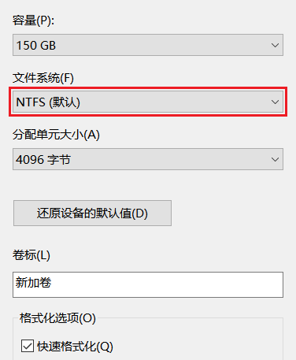

2-70

图

分区格式化

2-70

NTFS

Windows

FAT

NTFS

图

中文件系统我们选择默认的

，

下一般有

、

exFAT

Windows

Linux

和

这些文件系统。

相较于

，

系统下给磁盘分割时需要在

Linux

下创建一个分区并且格式化好以后我们要将其“挂载”到一个目录下才能

店铺：

官方网站：

https://xiaomeige.taobao.com

www.corecourse.cn

技术博客：

技术群组：

http://www.cnblogs.com/xiaomeige/

---
*下一页*

小梅哥FPGA 团队    武汉芯路恒科技

专注于培养您的FPGA 独立开发能力   开发板 培训 项目研发三位一体

访问这个分区。

(mount)

这里提到一个“挂载”

的概念。在一个区被格式化为一个文件系统

Linux

之后，为了让

操作系统找到它，我们还需要把这个文件系统“注册”进

Linux

操作系统的文件体系里，这个操作就叫“挂载”。挂载是利用一个目录当

成入口，将文件系统放置在该目录下，也就是说，进入该目录就可以读取该文

Windows

件系统的内容。这个进入点的目录就称为“挂载点”。

的文件系统其

Windows

实也是有挂载过程的，只是是在

内部完成的，用户无法看见。

Linux

由于整个

系统最重要的是根目录，因此根目录一定需要挂载到某个

分区。

而其他的目录则可依用户自己的需求来给予挂载到不同的分区。

Linux

文件系统类型

Linux

支持多种文件系统，可以和许多操作系统共存。为了对各类文件系统

Linux

VFS(Virtual File System)

进行统一管理，

引入了虚拟文件系统

，为各类文

VFS

Linux

件系统提供一个统一的操作界面和应用编程接口。

使得

可以支持多

个不同的文件系统类型。

Linux

ext2

ext3

ext4

下的文件系统主要有

、

、

等文件系统。同时也支持

Windows

FAT

NFS

Linux

的

文件系统和网络文件系统

等。这里我们对

系统下主

要的几个系统进行介绍。

⚫

NFS 文件系统：NFS 文件系统是指网络文件系统，这种文件系统也是

Linux 的独到之处。它可以很方便地在局域网内实现文件共享，并且使多

台主机共享同一主机上的文件系统。而且 NFS 文件系统访问速度快、稳定

性高，已经得到了广泛的应用，尤其在嵌入式领域，使用 NFS 文件系统可

以很方便地实现文件本地修改，而免去了一次次读写 flash 的忧虑。

⚫

ext3 文件系统：ext2+log 是linux 通用的文件系统，也是linux 常见的默

认文件系统。ext3 是在ext2 的基础上发展起来的。ext3 完全兼容 ext2

文件系统，xt3 文件系统不需要经过任何修改就可以直接挂载成 ext2 文

件系统，ext3 提供的工具 tune2fs 即可轻松进行数据转化，无须进行格

式化。

ext3 强化了系统的日志功能，采用了日志式的管理机制，它使文件系统具

有很强的快速恢复能力，更加安全可靠，即使系统非正常关机、发生死机

等情况， ext3 文件系统也可以快速恢复。 ext3 支持大文件，完整性更

高，不易受到死机或者关机对文件系统的伤害。ext3 的日志功能对磁盘驱

动器读写头进行了优化，保持了较快的文件系统速度。

店铺：

官方网站：

https://xiaomeige.taobao.com

www.corecourse.cn

技术博客：

技术群组：

http://www.cnblogs.com/xiaomeige/

---
*下一页*

小梅哥FPGA 团队    武汉芯路恒科技

专注于培养您的FPGA 独立开发能力   开发板 培训 项目研发三位一体

⚫

Ext4 文件系统：是一种针对ext3 系统的扩展日志式文件系统，是专门为

Linux 开发的原始的扩展文件系统（ext 或extfs）的第四版。ext3 升级到

ext4 能为系统提供更高的性能，消除存储限制，获取新的功能，并且不需

要重新格式化分区，ext4 会在新的数据上用新的文件结构，旧的文件保留

原状。

⚫

xfs 文件系统：一种高级的日志文件系统，最早于1993 年由Silicon

Graphics 为他们的IRIX 操作系统而开发，1994 年随IRIX 5.3 的发布而应

用于计算，是IRIX 5.3 版的默认文件系统。2000 年5 月，Silicon

Graphics 以GNU 通用公共许可证发布这套系统的源代码，之后被移植到

Linux 内核上。xfs 特别擅长处理大文件，同时提供平滑的数据传输。xfs

极具伸缩性，是全新的高性能64 位文件系统。

Ubuntu

Ubuntu

我们可以对我们安装的

文件系统进行查看，了解我们安装的

文件系统，在终端如下指令来查询：

df -T -h

2-71

查询结果如图

所示。

2-71

图

文件系统

2-71

/dev/sda1

/

图

中我们可以看到，我们的磁盘分区为“

”，挂载在“

”根

ext4

目录下，文件系统类型为“

”。我们还可以看到磁盘的使用情况及其它文

件系统情况。

2.6.1

Linux

文件系统结构

Linux

Linux

前面我们讲到，

系统下给磁盘分割时需要在

下创建一个分区并

/

且格式化好以后我们要将其“挂载”到一个目录下才能访问这个分区。“

”是

Linux

系统的根目录，也就是最底层的盘，打开“计算机”此时我们便是进入

/

2-72

“

”根目录。如图

所示。

店铺：

官方网站：

https://xiaomeige.taobao.com

www.corecourse.cn

技术博客：

技术群组：

http://www.cnblogs.com/xiaomeige/

---
*下一页*

小梅哥FPGA 团队    武汉芯路恒科技

专注于培养您的FPGA 独立开发能力   开发板 培训 项目研发三位一体

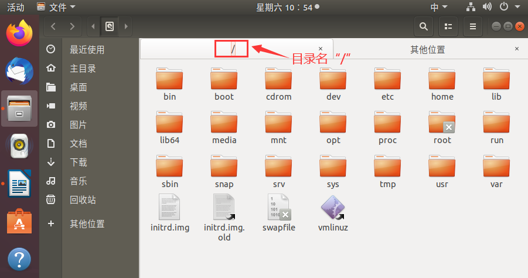

2-72

/

图

“

”根目录

Linux

系统中其余文件都是根文件下的分支，对

系统和用户来说，所有可

操作的计算机资源都存在于如目录树这样的逻辑结构中，对计算机资源的访问

都可以认为是目录树的访问。就硬盘来说，所有对硬盘的访问都变成了对目录

树中某个节点也就是文件夹的访问，访问时不需要知道它是硬盘还是硬盘中的

/

文件夹。目录树的逻辑结构也非常简单，就是从根目录（

）开始，不断向下展

开各级子目录，其中也包括用户的根目录。

Ubuntu

是支持多用户的，每创建一个用户就会创建一个这个用户的根目录，

home

2-73

我们打开计算机下的“

”，如图

所示。

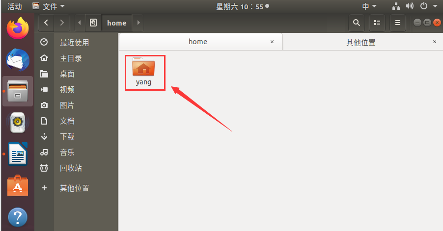

2-73  home

图

目录

店铺：

官方网站：

https://xiaomeige.taobao.com

www.corecourse.cn

技术博客：

技术群组：

http://www.cnblogs.com/xiaomeige/

---
*下一页*

小梅哥FPGA 团队    武汉芯路恒科技

专注于培养您的FPGA 独立开发能力   开发板 培训 项目研发三位一体

2-74

yang

图

展示了我们创建的用户的文件夹，“

”是我们创建系统时创建

2-74

的用户，系统默认打开的也是这个文件夹，我们可以打开主目录和图

中的

yang

2-75

“

”文件夹进行比较，会发现他们的内容是一致的，如图

所示。

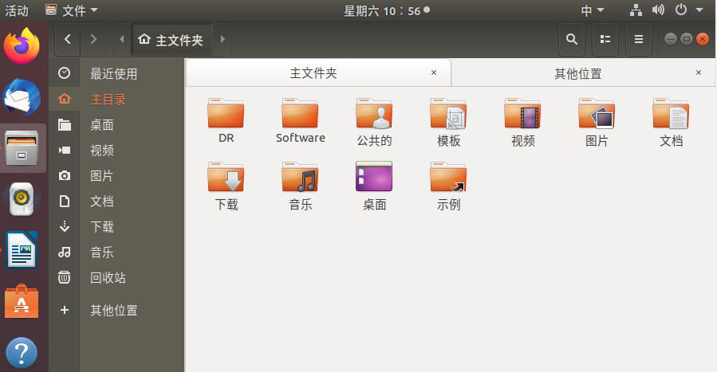

2-74

Home

图

打开“

”

ls

终端操作也是在用户的文件下进行，开终端以后输入“

”命令查看当前

,

2-75

yang

Home

目录下有什么文件

如图

所示，你会发现是显示的“

”用户“

”

里面的内容。

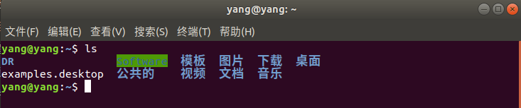

2-75

图

查看当前目录

/

/

当然我们也可以查看“

”根目录里面的内容，查看“

”根目录需要进入

/

cd /

/

,

ls

“

”根目录里面，然后进行查看，可以输入“

”进入“

”

然后运用“

”

2-76

指令进行查看，如图

所示。

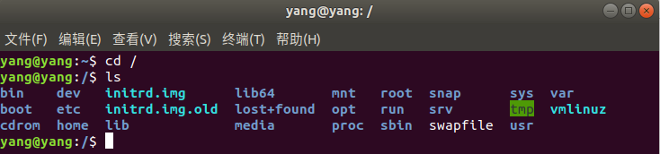

2-76

/

图

查看“

”根目录

店铺：

官方网站：

https://xiaomeige.taobao.com

www.corecourse.cn

技术博客：

技术群组：

http://www.cnblogs.com/xiaomeige/

---
*下一页*

小梅哥FPGA 团队    武汉芯路恒科技

专注于培养您的FPGA 独立开发能力   开发板 培训 项目研发三位一体

2-76

$

/

可以看到图

中“

”前面会显示切换以后的目录路径“

”，对根目录

/

2-29

“

”中的一些重要的文件夹我们可以进行了解，如表

所示。

2-29

表

根目录文件介绍

文件夹

说明

/bin

/usr/bin

存储一些二进制可执行命令文件，

也存放了一些基于用户的命令文件

/sbin

/usr/sbin

存储了很多系统命令，

也存储了许多系统命令

/root

root

超级用户

的根目录文件

/home

普通用户默认目录，在该目录下，每个用户都有一个以本用户名命名的文件夹

/boot

Ubuntu

存放

系统内核和系统启动文件

/mnt

通常包括系统引导后被挂载的文件系统的挂载点

/dev

Linux

存放设备文件，我们后面学习

驱动主要是跟这个文件夹打交道的

/etc

保存系统管理所需的配置文件和目录

/lib

/usr/lib

保存系统程序运行所需的库文件，

下存放了一些用于普通用户的库文件

/lost+found

一般为空，当系统非正常关机以后，此文件夹会保存一些零散文件

/var

存储一些不断变化的文件，比如日志文件

/usr

包括与系统用户直接有关的文件和目录，比如应用程序和所需的库文件

/media

Ubuntu

存放

系统自动挂载的设备文件

/proc

虚拟目录，不实际存储在磁盘上，通常用来保存系统信息和进程信息

/tmp

存储系统和用户的临时文件，该文件夹对所有的用户都提供读写权限

/opt

可选文件和程序的存放目录

/sys

系统设备和文件层次结构，并向用户程序提供详细的内核数据信息

2.6.2

文件操作命令

ls”

在前面我们已经有对文件操作命令的演示，比如运用“

指令察看当前目

,

cd /”

录

“

进入根目录，在终端进行文件操作的常用命令还有很多，我们对一些

常用命令进行学习。

2.6.2.1

(touch)

创建新文件命令

touch

vim

vi

touch

指令用于创建新文件，相较于在

中用

指令创建文本文档，

指令不仅仅可以用来创建文本文档，也可以创建其它类型的文档。命令格式如

下：

touch [-acfm][-d<日期时间>][-r<参考文件或目录>] [-t<日期时

间>][--help][--version][文件或目录…]

touch

运用

在创建文件时如果文件名已经存在将无法创建新的文件，而是修

2-77

改此文件的最后修改日期，如图

所示。

店铺：

官方网站：

https://xiaomeige.taobao.com

www.corecourse.cn

技术博客：

技术群组：

http://www.cnblogs.com/xiaomeige/

---
*下一页*

小梅哥FPGA 团队    武汉芯路恒科技

专注于培养您的FPGA 独立开发能力   开发板 培训 项目研发三位一体

2-77

图

修改日期

touch

2-30

指令常用的命令参数如表

所示。

2-30  touch

表

常用参数

参数

说明

a

改变档案的读取时间记录

m

改变档案的修改时间记录

c

假如目的档案不存在，不会建立新的档案

f

unix

不使用，是为了与其他

系统的相容性而保留

r

--file

使用参考档的时间记录，与

的效果一样

d <

>

日期

设定时间与日期，可以使用各种不同的格式

t <

>

date

时间

设定档案的时间记录，格式与

指令相同

--no-create

不会建立新档案

--help

列出指令格式不会建立新档案

--version

列出版本讯息

2-78

利用参数对时间记录进行修改效果与图

效果一致。

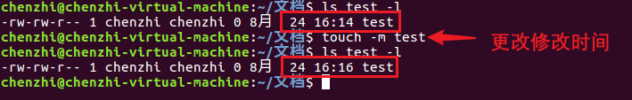

2-78

图

修改时间参数演示

mkdir

文件夹创建命令

mkdir

命令

用于创建文件夹，其命令格式如下：

mkdir [参数] [文件夹名目录名]

2-31

主要参数如表

所示。

2-31  mkdir

表

参数

参数

说明

-p

确保目录名称存在，如所要创建的目录其上层目

录目前还未创建，那么会一起创建上层目录

dir1”

“dir2

2-79

我们在文档目录下建立两个新文件夹，命名为“

、

”，如图

所示。

店铺：

官方网站：

https://xiaomeige.taobao.com

www.corecourse.cn

技术博客：

技术群组：

http://www.cnblogs.com/xiaomeige/

---
*下一页*

小梅哥FPGA 团队    武汉芯路恒科技

专注于培养您的FPGA 独立开发能力   开发板 培训 项目研发三位一体

2-79

图

建立新文件夹

ls

dir1”

“dir2

通过“

”指令查看可以看到文档目录下多出了“

、

”两个目录，

目录在终端中默认显示为蓝色。

2.6.2.2

rm

文件删除命令

Linux

rm +

系统中的文件，当需要删除时，可以使用

文件名的格式来删除。

“rm”

命令

用于删除一个文件或者文件夹，也可以完成删除一个文件或者多个文

Windows

件及文件夹。对于链接文件（

下的快捷方式文件），只删除链接，原

文件保持不变，命令格式如下：

rm [参数] [文件名或文件夹目录名]

主要的命令参数如下:

2-32  rm

表

参数

参数

说明

-d

直接把要删除的目录的硬连接数据删除，删除该目录

-f

(

)

强制删除文件和文件夹

目录

-i

(

)

删除文件或者文件夹

目录

之前先询问用户

-r

(

)

递归删除，指定文件夹

目录

下的所有文件和子文件夹全部删除掉

-v

显示删除过程

rm

test”

使用

命令来删除文件，我们以删除文档目录下的“

文件为例为大家

2-80

演示，如图

所示。

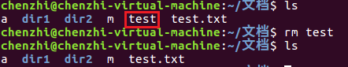

2-80

图

删除文件

rm

dir1

使用

命令来删除文件夹，这里以删除文档下“

”文件夹为例。如图

2-81

所示。

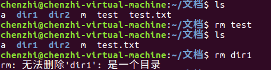

店铺：

官方网站：

https://xiaomeige.taobao.com

www.corecourse.cn

技术博客：

技术群组：

http://www.cnblogs.com/xiaomeige/

---
*下一页*

小梅哥FPGA 团队    武汉芯路恒科技

专注于培养您的FPGA 独立开发能力   开发板 培训 项目研发三位一体

2-81

图

删除文件夹失败

2-81

“dir1”,

-r

图

中显示无法删除文件夹

对于目录的删除还需利用参数“

”将

2-82

目录及以下之档案亦逐一删除，如图

所示。

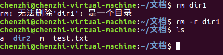

2-82

图

利用参数删除

rm

需要注意的是一旦通过

命令删除文件或文件夹就无法恢复，必须格外小

心地使用该命令。

2.6.2.3

(

)

rmdir

文件夹

目录

删除命令

rmdir

命令只能删除空目录，如果某个目录下已经有文件或子目录存在，则

rmdir

rmdir

执行

命令时会提示目录非空的信息，删除失败。用

命令很安全，不

rm

rm

会误删数据，但是实际上用的不是很多，更常用的是用

命令。

命令既可

以删除文件，也可以删除目录而不管目录是否非空。

通过“rm”指令加上参数删除文件夹是其中一种方式，利用指令“rmdir”，

可以不加任何参数的删除掉指定的文件夹(目录)，命令格式如下

rmdir [参数] [文件夹(目录)]

2-33

命令参数如表

所示。

2-33  rmdir

表

参数

参数

说明

-p

递归刪除目录

rmdir

dir2”

2-83

运用“

”指令删除“

文件夹，如图

所示。

2-83

图

删除

2-83

从图

中发现目录“dir2”删除失败，原因在于rmdir 命令的作用十分

有限，只能刪除空目录，一旦目录中有内容，就会报错。

店铺：

官方网站：

https://xiaomeige.taobao.com

www.corecourse.cn

技术博客：

技术群组：

http://www.cnblogs.com/xiaomeige/

---
*下一页*

小梅哥FPGA 团队    武汉芯路恒科技

专注于培养您的FPGA 独立开发能力   开发板 培训 项目研发三位一体

2.6.2.4

cp

文件复制命令

Ubuntu

在

系统中我们可以通过选中文件点击右键进行复制和粘贴，而在终

Linux

cp

cp

端也可以使用命令来进行文件的复制，

下的复制命令为“

”，“

”

命令既可以复制文件，也可以复制目录命令格式如下：

cp   [参数]   [源地址]   [目的地址]

2-34

常用参数如表

所示。

2-34  cp

表

常用参数

参数

说明

-a

-d

-p

-r

相当于

、

、

选项的集合

-d

如果源文件为软链接（对硬链接无效），则复制出的目标文

件也为软链接

-f

强行复制文件，不管要复制的文件是否已经存在于目标目录

-I

把目标文件建立为源文件的硬链接文件，而不是复制源文件

-p

复制后目标文件保留源文件的属性（包括所有者、所属组、

权限和时间）

-r

-R

或

递归复制，用于复制目录

-i

询问，如果目标文件已经存在，则会询问是否覆盖

-s

把目标文件建立为源文件的软链接文件，而不是复制源文件

-u

若目标文件比源文件有差异，则使用该选项可以更新目标文

件，此选项可用于对文件的升级和备用

book

对文件进行复制并重命名，在文档目录下新建一个文件，命名为“

”，

“book2”

2-84

将其复制重命名为

到当前路径，如图

所示。

2-84

图

复制文件

book

../

2-85

复制

文件到上级目录“

”，不进行重命名，如图

所示。

2-85

图

复制文件到上级目录

“book”

da

2-86

复制

文件到新建“

”文件夹，如图

所示

。

店铺：

官方网站：

https://xiaomeige.taobao.com

www.corecourse.cn

技术博客：

技术群组：

http://www.cnblogs.com/xiaomeige/

---
*下一页*

小梅哥FPGA 团队    武汉芯路恒科技

专注于培养您的FPGA 独立开发能力   开发板 培训 项目研发三位一体

2-86

图

复制到桌面文件夹

“cp”

“-

除了复制文件，

指令还可用于文件夹的复制，复制文件夹时配合参数

r”

2-87

使用，如图

所示。

2-87

图

复制文件夹

2-87

“cp”

“-r”

“da”

图

中运用指令

及其参数

实现了复制

文件夹在当前路径，命

“ca”

“ca”

“da”

名为

，查看

中的内容与复制文件

中的内容一致。

2.6.2.5

mv

文件移动命令

mv

当需要将一个文件移动到另一个位置时，可以使用

命令实现，另外，

mv

当需要对文件进行重命名时，也可以使用

命令。

mv

运用“

”命令我们可以进行文件或者文件夹的移动，或者为文件或者文

件夹进行重命名。命令格式如下：

mv [参数] [源地址] [目的地址]

2-35

主要参数如表

所示。

2-35  mv

表

参数

参数

说明

-b

如果要覆盖文件的话覆盖前先进行备份

-f

若目标文件或目录与现在的文件重复，直接覆盖目标文件或目录

-I

在覆盖之前询问用户

mvtest

ca

book

新建一个文件夹“

”，移动“

” 文件夹下的“

” 文件到

mvtest

2-88

ca

“

”中，如图

所示，文件移动成功后查看“

”文件夹，文件为空。

店铺：

官方网站：

https://xiaomeige.taobao.com

www.corecourse.cn

技术博客：

技术群组：

http://www.cnblogs.com/xiaomeige/

---
*下一页*

小梅哥FPGA 团队    武汉芯路恒科技

专注于培养您的FPGA 独立开发能力   开发板 培训 项目研发三位一体

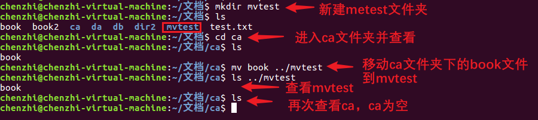

2-88

图

文件

“mvtest”

mv

“mvtest”

,

进入

文件夹，利用“

”命令可以对

中的文件进行重命名

2-89

如图

所示。

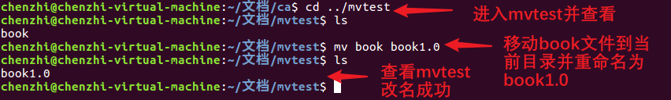

2-89

图

修改文件名

2.6.3

文件压缩和解压缩

Ubuntu

Ubuntu

在

系统下进行文件的压缩和解压有两种方式，一种是

系统

Windows

下图形化的操作方式，这种方式和我们在

下常用的压缩和解压方法相

似，另一种方式是利用命令行进行压缩和解压缩操作。这里需要强调的是，在

Linux

tar

tar.gz

Windows

中压缩文件时尽量使用

压缩为

格式。在从

中拷贝文件

Linux

Linux

到

时，尽量以压缩包的形式拷贝到

中后再进行解压，以免文件在传

输过程中发生错误。

2.6.3.1

图形化压缩和解压缩

图形化压缩和解压缩在选中文件后点击鼠标右键，选择点击压缩，选中

dir2

2-90

“

”这个文件，如图

所示。

店铺：

官方网站：

https://xiaomeige.taobao.com

www.corecourse.cn

技术博客：

技术群组：

http://www.cnblogs.com/xiaomeige/

---
*下一页*

小梅哥FPGA 团队    武汉芯路恒科技

专注于培养您的FPGA 独立开发能力   开发板 培训 项目研发三位一体

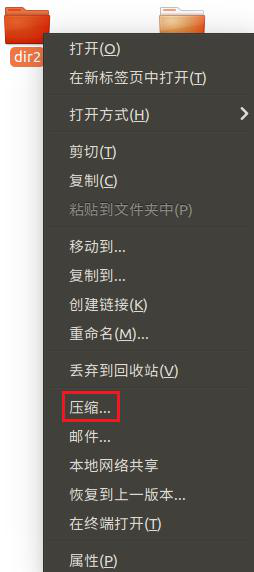

2-90

图

选择压缩

点击“压缩”，对压缩名，压缩格式及压缩文件的路径进行设置。如图

2-91

所示。

2-91

图

压缩设置

2-92

.zip

压缩文件的压缩格式选择如图

所示，这里我们选择“

”格式。

店铺：

官方网站：

https://xiaomeige.taobao.com

www.corecourse.cn

技术博客：

技术群组：

http://www.cnblogs.com/xiaomeige/

---
*下一页*

小梅哥FPGA 团队    武汉芯路恒科技

专注于培养您的FPGA 独立开发能力   开发板 培训 项目研发三位一体

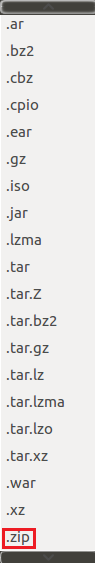

2-92

图

压缩格式选择

2-93

压缩后的文件如图

所示。

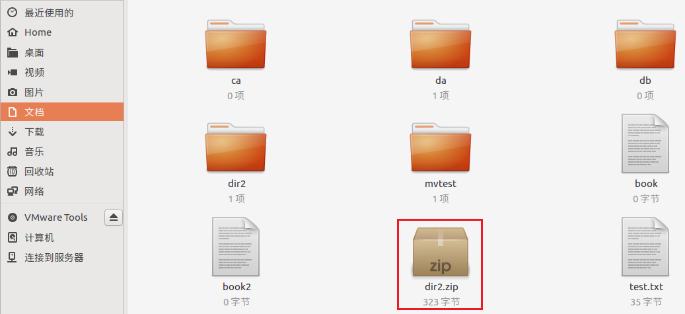

2-93

图

压缩文件展示

“dir2.zip”

2-94

接下来我们对

进行解压演示，如图

所示。

店铺：

官方网站：

https://xiaomeige.taobao.com

www.corecourse.cn

技术博客：

技术群组：

http://www.cnblogs.com/xiaomeige/

---
*下一页*

小梅哥FPGA 团队    武汉芯路恒科技

专注于培养您的FPGA 独立开发能力   开发板 培训 项目研发三位一体

2-94

图

解压缩

点击“提取到此处”提取压缩文件，文件会被系统解压保存到当前目录。

2.6.3.2

命令行进行文件的压缩和解压缩

Ubuntu

在

系统下通过终端使用指令也可以对文件进行压缩和解压缩，在

Linux

“.zip”

“ .gz”

“ bz2”

中可以识别的常见压缩格式有十几种，比如：

、

、

、

“ .tar”

tar.gz

“.tar.bz2”

、

“

”、

等等，运用不同的压缩指令可以对不同压缩格式的

文件进行压缩和解压缩操作。

2.6.3.3

zip

命令

“.zip”

;

用于对文件压缩为

格式的命令，命令格式如下

zip   [参数]   [压缩文件名.zip]   [被压缩的文件]

2-36

主要的参数如表

所示。

2-36  zip

表

参数

参数

说明

-b<

>

工作目录

指定暂时存放文件的目录

-d

zip

从

文件中删除一个文件。

-F

尝试修复已经损毁的压缩文件

-g

将文件压缩入现有的压缩文件中，不需要新建压缩文件。

-h

帮助。

-j

只保存文件的名，不保存目录

店铺：

官方网站：

https://xiaomeige.taobao.com

www.corecourse.cn

技术博客：

技术群组：

http://www.cnblogs.com/xiaomeige/

---
*下一页*

小梅哥FPGA 团队    武汉芯路恒科技

专注于培养您的FPGA 独立开发能力   开发板 培训 项目研发三位一体

-m

压缩完成以后删除源文件

-n<

>

字尾符号

不压缩特定扩展名的文件。

-q

不显示压缩命令执行过程

-r

递归压缩，将指定目录下的所有文件和子目录一起压缩。

-v

显示指令执行过程。

-num

1~9

压缩率，为

的数值

zip

我们可以利用“

”命令对文件实现压缩和解压缩。同样的，我们对

dir2

zip –rv dir2.zip dir2

,

-

“

”这个文件进行压缩，命令为“

”

参数“

率”可以实

dir2

2-95

现“

”文件的递归压缩并显示命令执行过程，图

所示。

2-95

图

压缩演示

2.6.3.4

unzip

命令

zip”

“.zip”

“.zip”

前面“

命令可以实现把文件压缩为

格式，而

格式的压缩文件

“unzip”

的解压则是运用

命令，命令格式如下：

unzip   [参数]   [压缩文件名.zip]

“unzip”

2-37

命令的主要参数如表

所示。

2-37  unzip

表

参数

参数

说明

-l

显示压缩文件内所包含的文件。

-t

检查压缩文件是否损坏，但不解压

-v

显示命令显示的执行过程。

-Z

只显示压缩文件的注解

-C

压缩文件中的文件名称区分大小写。

-j

不处理压缩文件中的原有目录路径

-L

将压缩文件中的全部文件名改为小写

-n

解压缩时不要覆盖原有文件

-P<

>

密码

解压密码。

-q

命令执行，不显示任何信息。

-x<

>

.zip

文件列表

指定不要处理

中的哪些文件。

-d<

>

目录

把压缩文件解到指定目录下

dir2.zip

2-96

我们对“

”进行解压，如图

所示。

店铺：

官方网站：

https://xiaomeige.taobao.com

www.corecourse.cn

技术博客：

技术群组：

http://www.cnblogs.com/xiaomeige/

---
*下一页*

小梅哥FPGA 团队    武汉芯路恒科技

专注于培养您的FPGA 独立开发能力   开发板 培训 项目研发三位一体

2-96

图

解压演示

2.6.3.5

tar

命令

tar

Linux

.bz2

命令“

”可用于其它格式的压缩和解压，比如

下最常用的“

”

.gz

tar

和“

”这两种压缩格式的压缩和解压。使用不同的参数“

”可以实现压缩

和解压缩，命令格式如下：

tar [参数] [压缩文件名] [被压缩文件名]

2-38

主要参数如表

所示。

2-38  tar

表

常用参数

参数

说明

-c

创建新的压缩文件。

-C<

>

目的目录

切换到指定的目录

-f<

>

备份文件

指定压缩文件

-j

tar

bzip2

用

生成压缩文件，然后用

进行压缩

-k

解开备份文件时，不覆盖已有的文件

-m

还原文件时，不变更文件的更改时间

-r

新增文件到已存在的备份文件的结尾部分

-t

列出备份文件内容

-v

显示指令执行过程

-w

遭遇问题时先询问用户

-x

从备份文件中释放文件，也就是解压缩文件

-z

tar

gzip

用

生成压缩文件，用

压缩

-Z

tar

compress

用

生成压缩文件，用

压缩

tar

2-97

我们运用命令“

”可以把文件分别压缩成不同格式，如图

所示使用

“tar –cvf dir2.tar dir2”

tar –vcjf dir2.tar.bz2

了三个不同的命令，运用指令

、

“

dir2

tar –vczf dir2.gz dir2

“dir2”

“.tar”

.bz2

.gz

”、“

”把

文件分别压缩为

、

“

”、“

”

格式。

店铺：

官方网站：

https://xiaomeige.taobao.com

www.corecourse.cn

技术博客：

技术群组：

http://www.cnblogs.com/xiaomeige/

---
*下一页*

小梅哥FPGA 团队    武汉芯路恒科技

专注于培养您的FPGA 独立开发能力   开发板 培训 项目研发三位一体

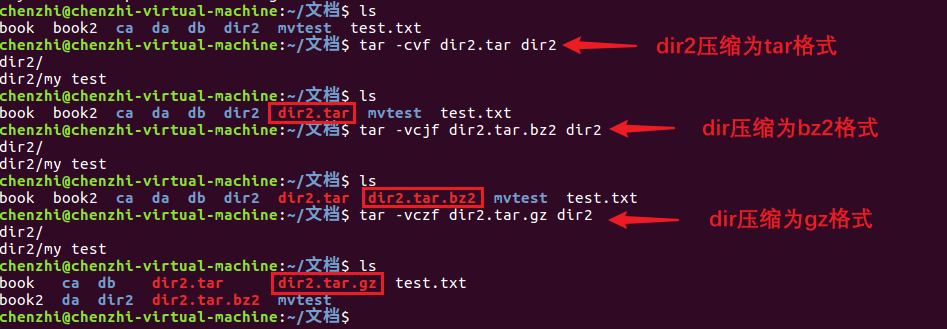

2-97

图

不同格式压缩

查看文档文件夹可以观察到有三种不同格式的压缩包。

tar

“dir2”

“.tar”

运用“

” 可以对不同格式的压缩包进行解压，对

的

、

.bz2

.gz

“

”、“

”三种格式的解压指令如下：

tar  -xvf  dir2.tar

tar  -vxjf  dir2.tar.bz2

tar  -vxzf  dir22.tar.gz

tar

之前说到“

”命令对于不同的格式，运用不同的参数就可以实现不同格

式文件的压缩和不同格式压缩包的解压，这里解压的参数与压缩的相对应只是

-c

-v

把解压参数中的“

”压缩参数替换为“

”解压参数。

2.6.4

文件查询和搜索

Linux

开发中会经常查询文件，搜索文件中函数的调用，文件查询和搜索功

能是系统管理者和普通用户必须掌握的。

2.6.4.1

find

命令

find

是目录文件的查找命令，用来在指定目录下查找文件。任何位于参数

之前的字符串都将被视为查找的目录名。如果使用该命令时，不设置任何路径，

find

则

命令将在当前目录下查找所有子目录与文件，并且将查找到的子目录和

find

文件全部进行显示。需要注意的是

命令模糊搜索是比较消耗系统资源的，

不建议在服务器负载比较高的时候使用。命令格式如下：

find [路径] [参数] [关键字]

2-39

常用的参数如表

所示。

2-39  find

表

常用参数

参数

说明

店铺：

官方网站：

https://xiaomeige.taobao.com

www.corecourse.cn

技术博客：

技术群组：

http://www.cnblogs.com/xiaomeige/

---
*下一页*

小梅哥FPGA 团队    武汉芯路恒科技

专注于培养您的FPGA 独立开发能力   开发板 培训 项目研发三位一体

-name<

>

文件名

按照文件名称查找，可使用通配符

-iname < name >

会忽略大小写

-depth

从指定目录下的最深层的子目录开始查找

-gid<

>

群组识别码

查找符合指定的群组识别码的文件或目录

-group<

>

群组名称

查找符合指定的群组名称的文件或目录

-size<

>

文件大小

按大小查找

-type<

>

文件类型

按类型查找

-user<

>

拥有者名称

查找符合指定的拥有者名称的文件或目录

-amin n

n

在过去

天内被读取过的文件

-cmin n

n

在过去

分钟内被修改过

-cnewer file

file

比文件

更新的文件

-ctime n

n

在过去

天内被修改过的文件

-empty

空的文件

d

目录

.txt

find

我们以查找“文档”目录下的“

”结尾的文件为例，运用指令“

文

–name *.txt

2-98

档

”进行查找，如图

所示。

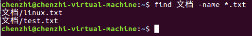

2-98

图

文件搜索

2.6.4.2

grep

搜索命令

find

grep

查找文件运用“

”指令，而需要进行关键词搜索时则需要用到

指

grep

grep

令。

命令用于查找文件里符合条件的字符串，

命令就会把包含指定关

grep

键字文件的对应行进行标记，

命令格式如下：

grep  [参数]  关键字  文件列表

2-40

主要参数如表

所示。

2-40  grep

表

参数

参数

说明

-A<

>

n

显示行数

显示符合范本样式的行，并显示该行之后的

行内容

-b

在显示符合样式的那一行之前，标示出该行第一个字符的编号

-B<

>

显示行数

除了显示符合样式的那一行之外，并显示该行之前的内容

-c

计算符合样式的数量

-C<

>

显示行数

除了显示符合样式的那一行之外，并显示该行之前后的内容

-d <

>

grep

动作

当指定要查找的是目录而非文件时，必须使用这项参数，否则

指令将回报信息并停止动作

-e<

>

范本样式

指定字符串做为查找文件内容的样式

-E

将样式为延伸的正则表达式来使用

-F

将样式视为固定字符串的列表

店铺：

官方网站：

https://xiaomeige.taobao.com

www.corecourse.cn

技术博客：

技术群组：

http://www.cnblogs.com/xiaomeige/

---
*下一页*

小梅哥FPGA 团队    武汉芯路恒科技

专注于培养您的FPGA 独立开发能力   开发板 培训 项目研发三位一体

-G

将样式视为普通的表示法来使用

-h

在显示符合样式的那一行之前，不标示该行所属的文件名称

-i

忽略字符大小写的差别

-l

列出文件内容符合指定的样式的文件名称

-L

列出文件内容不符合指定的样式的文件名称

-n

在显示符合样式的那一行之前，标示出该行的列数编号

-s

不显示错误信息

-v

显示不包含匹配文本的所有行

-r

在指定目录中递归查找

grep –ir “Linux

我们在文档目录下运用命令“

”

文档” 查找关键词

Linux

,

2-99

“

”

如图

所示。

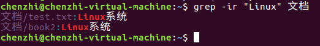

2-99

图

查找关键词

2.6.5

文件类型

ls -l

2-100

使用命令“

”可以查看当前目录下的文件的详细信息，如图

所示。

2-100

图

文件详细信息

2-100

图

是用户“chenzhi”目录的文件详细，每一条信息提供了9 个信息

2-41

内容，他们对应的说明如表

所示。

2-41

表

文件信息

编号

代表含义

说明

1

’-’,

文件类型

文件类型是

则表示这是一个普通文件

2

文件权限

表示文件可读、可写、可执行性

3

1

硬链接个数

文件的硬链接数，连接数是

，就是他本身

4

chenzhi

book

chenzhi

文件属主

第一个

，文件所属的用户，这里

文件被

用户拥有

5

chenzhi

book

chenzhi

文件属组

第二个

，文件所属的用户组，这里

文件属于

用户组

6

4096K

文件大小

文件大小，如图片是

店铺：

官方网站：

https://xiaomeige.taobao.com

www.corecourse.cn

技术博客：

技术群组：

http://www.cnblogs.com/xiaomeige/

---
*下一页*

小梅哥FPGA 团队    武汉芯路恒科技

专注于培养您的FPGA 独立开发能力   开发板 培训 项目研发三位一体

7

文件修改时间

这里的时间是该文件最后被更新（包括文件创建、内容更新、文件名更新

stat

等）的时间可用

命令查看文件的修改、访问、创建时间

8

文件名或目录名

创建文件或目录的名称

-

在查看文件信息中我们举例了“

”表示这是一个普通文件，每行最前面的

2-42

符号就是标记了当前文件类型，字符代表的文件类型如表

所示。

2-42

表

文件类型

字符

说明

-

file

常规文件，即

，比如文档、图片、音乐等等。

d

目录文件

c

character device

Linux

即字符设备文件，

驱动里面的字符设备驱动，比

如串口设备，音频设备等

b

block device

;

block

即块设备文件，如硬盘

支持以

为单位进行随机访问

l

symbolic link

Windwos

即符号链接文件，又称软链接文件，相当于

下的

快捷方式

s

socket

即套接字文件，用于实现两个进程进行通信

p

pipe

FIFO

即命名管道文件，如

文件

2.7

Linux

用户权限管理

2.7.1

用户系统

Linux

是个多用户多任务的分时操作系统，所有想要调用系统资源的用户都

必须先向系统管理员申请一个账号，然后通过这个账号进入系统。我们前面在

Ubuntu

,

安装

系统的时候被要求创建一个账户

用户的账号一方面能帮助系统管理

员对使用系统的用户进行跟踪，控制他们对系统资源的访问；另一方面帮助用

户组织文件，为用户提供安全性保护。

/home

每次创建用户账号的时候都会在目录“

”下生成一个文件夹来存储该

ls

2-101

用户的文件，可以运用“

”指令查看用户文件夹，如图

所示。

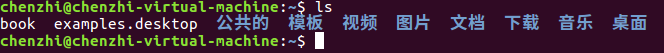

2-101

图

用户文件夹

Linux

事实上我们登录到

系统，使用的登录名和密码实际上就是用户的信

息标识。每个账号都拥有一个唯一的用户名和用户密码，在登录时键入正确的

用户名和密码，才能进入系统和自己的主目录。每个用户实际上代表了一组权

限，而这些权限分别表示可以执行不同的操作，是能够获取系统资源的权限的

Linux

集合。

实际上并不直接认识用户的账号，而是查看用户标识号。用户标识

号（整数）：

店铺：

官方网站：

https://xiaomeige.taobao.com

www.corecourse.cn

技术博客：

技术群组：

http://www.cnblogs.com/xiaomeige/

---
*下一页*

小梅哥FPGA 团队    武汉芯路恒科技

专注于培养您的FPGA 独立开发能力   开发板 培训 项目研发三位一体

⚫

0： root，系统管理员，拥有最高权限。

⚫

1-499：系统用户，保证系统服务正常运行，一般不使用。

⚫

500-60000：普通用户，管理员添加，可登录系统，拥有一定的权限。

Linux

需要注意的是用户名和标识号不一定一一对应，

允许几个登录名对应

同一个用户标识号。系统内部管理进程和文件访问权限时使用用户标识号。账

“/etc/passwd”

2-102

号和标识号的对应关系在

文件查看，如图

所示。

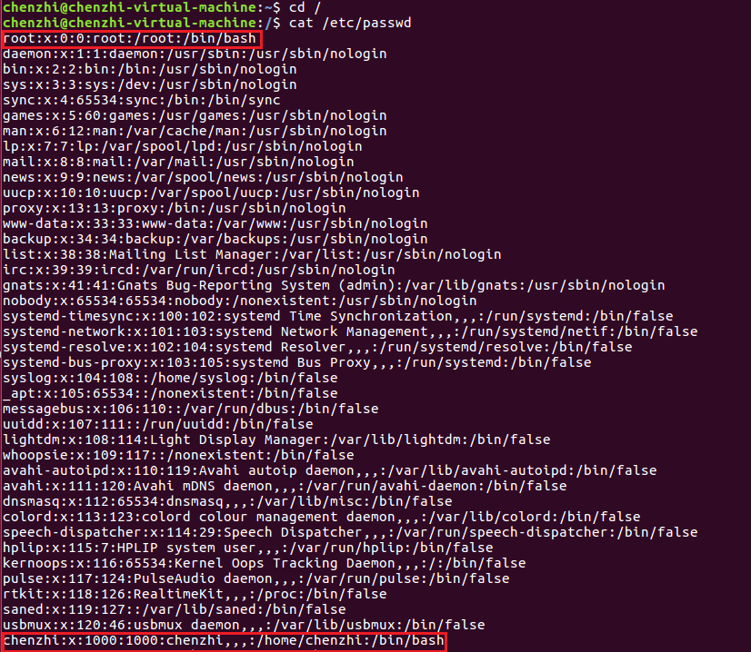

2-102

图

查看用户标识符

passwd

ID

通过查看配置文件

可以看到，每个用户名后面都有用户标识

，和

GID

ID

root

0

是用户的

，用户组

。“

”的用户标识号为“

”，用户组标识也为

0

chenzhi

ID

ID

“

”。系统安装时我们创建的用户“

”的用户

和用户组

为

1000

1000

ID

1-499

2-102

“

”、“

”。用户

在“

”的用户就是系统用户，图

中可

root

chenzhi

以看到在“

”用户和“

”用户之间有许多系统用户来保证系统服务

正常运行。

2.7.2

权限管理

Ubuntu

系统里面所说的权限有用户的权限，用户权限限制了用户对于系

统

店铺：

官方网站：

https://xiaomeige.taobao.com

www.corecourse.cn

技术博客：

技术群组：

http://www.cnblogs.com/xiaomeige/

---
*下一页*

小梅哥FPGA 团队    武汉芯路恒科技

专注于培养您的FPGA 独立开发能力   开发板 培训 项目研发三位一体

root

root

资源的使用情况，

用户拥有最大的权限，装系统的时候创建的用户拥有

用户的部分权限，其它普通用户的权限最低。不过这里所说的权限管理不是对

用户的权限进行管理，而是对文件的权限进行管理。

chenzhi

在前面讲解文件类型时就提及文件的权限，我们再次查看“

”用户

2-103

目录下的文件详细信息，如图

所示。

2-103

图

文件详细信息

2-103

book

图

中标注部分就是文件的权限信息，比如“

”文件的权限信息为

rw-rw-r--

9

3

“

”，文件的权限信息为

位以

位为一组，分别表示文件所属用户的

权限，文件所属用户所在用户组的权限以及其它用户权限。文件通常有三种权

(r)

(w)

(x)

限：读

、写

和执行

，对于文件，可读权限表示可以打开查看文件内容，

可写权限表示可以对文件进行修改，可执行权限就是可以运行此文件。权限信

2-43

息介绍如表

所示。

2-43

表

权限信息

权限项

读

写

执行

读

写

执行

读

写

执行

r

w

x

r

w

x

r

w

x

字符表示

权限分配

文件所有者

文件所属组

其他用户

book

以“

”文件的权限信息为例，对其权限进行分组为：

⚫

第一组，权限为“rw-”，文件 book 的所属用户 chenzhi 对文件

book 拥有读和写两种权限。

⚫

第二组，权限为“rw-”，用户 chenzhi 所在的用户组chenzhi 其组内

用户对于文件 book 拥有读和写这两种权限。

⚫

第三组，权限为“r--”，对于其它用户对于文件 book1 有读权限。

如果某个用户对某个文件不具有相应的权限的话就不能进行相应的操作，

ls

对于文件夹，拥有可读权限才可以使用命令

查看文件夹中的内容，拥有可执

店铺：

官方网站：

https://xiaomeige.taobao.com

www.corecourse.cn

技术博客：

技术群组：

http://www.cnblogs.com/xiaomeige/

---
*下一页*

小梅哥FPGA 团队    武汉芯路恒科技

专注于培养您的FPGA 独立开发能力   开发板 培训 项目研发三位一体

行权限才能进入到文件夹内部。如果遇到权限不够，但又需要执行某项操作时，

root

sudo

root

可以切换到“

”管理员进行操作，如运用“

”指令暂时切换到“

”

sudo

用户进行操作，具体操作可查看“

”指令部分内容。

(r)

(w)

(x)

文件的权限：读

、写

和执行

，也可以使用二进制数的形式表示。每

3

1

一组权限使用

位二进制数，一种权限对应一个二进制位，为

就表示具备此

0

权限，为

就表示没有此权限，同时三位二进制数每个权限对应的位相加，也

2-44

可以转换为八进制数，用八进制数表示文件的权限，如表

所示。

2-44

表

文件权限的表示方法

权限

三位二进制

八进制

---

000

0

--x

001

1

-w-

010

2

-wx

011

3

r--

100

4

r-x

101

5

rw-

110

6

rwx

111

7

rw-rw-r--

表示文件权限的三组权限信息如“

”在这里也可以用十进制表示

664

为：

。在进行权限的修改等操作时，就可以此代表文件的权限信息。

a

u

g

o

=

我们为了直观表示文件的归属关系开始使用

、

、

和

表示其归属，用

、

+

-

和

表示文件权限的变化，这样就可以运用字母表达的方式对文件或者目录的

2-45

权限进行修改，如表

所示。

2-45

表

权限修改字母表示方式

字母

含义

r

可读权限

w

可写权限

x

可执行权限

a

所有用户

u

归属用户

g

归属组

o

其它用户

=

具备权限

+

添加某权限

-

去除某权限

book

(chenzhi)

对于文件

，我们想要修改其归属用户

对其拥有可执行权限，

u+x

那么就可以使用：

。如果希望设置归属用户及其所在的用户组都对其拥有可

gu+x

执行权限就可以使用：

。

店铺：

官方网站：

https://xiaomeige.taobao.com

www.corecourse.cn

技术博客：

技术群组：

http://www.cnblogs.com/xiaomeige/

---
*下一页*

小梅哥FPGA 团队    武汉芯路恒科技

专注于培养您的FPGA 独立开发能力   开发板 培训 项目研发三位一体

2.7.2.1

chmod

权限修改命令

chmod

命令“

”用于修改文件或者文件夹的权限，权限可以使用前面讲的

数字表示也可以使用字母表示，命令格式如下

chmod [参数] [文件名/目录名]

2-46

主要参数如表

所示

2-46  chmod

表

参数

参数

说明

-c

-v

效果类似“

”参数，但仅回显更改的部分

-f

不显示错误信息

-R

递归处理，指定目录下的所有文件及其子文

件目录一起处理

-v

显示指令的执行过程

touch

接下来我们对一个文件的权限的进行修改，可以用“

”指令创建一个

2-104

测试文件，对其文件权限进行修改，如图

所示。

2-104

图

修改文件权限

2-104

图

中我们对新建的测试文件的权限进行修改，新建文件的权限默认为

rw-rw-r--

chmod 775 mytest

rwxrwxr-x

“

”，运用指令“

”设置其权限为“

”，图

rwxrwxr-x

中修改后的权限为“

”与我们设置一致。

除了运用数字对权限进行整个的修改外，我们还可以使用字母修改的方式

mytest

针对单个的归属对象进行权限的修改，如我们对修改后的“

”文件的归

2-105

属组权限进行修改，如图

所示。

店铺：

官方网站：

https://xiaomeige.taobao.com

www.corecourse.cn

技术博客：

技术群组：

http://www.cnblogs.com/xiaomeige/

---
*下一页*

小梅哥FPGA 团队    武汉芯路恒科技

专注于培养您的FPGA 独立开发能力   开发板 培训 项目研发三位一体

2-105  mytest

图

归属组权限修改

2-105

mytest

chmod g-x mytest

,

图

中对“

”文件的修改指令为“

”

查找权限

g-x

mytest

修改字母表示方式表可以了解到“

”代表的含义为去除“

”文件归属

组对其可执行的权限。

完成了对文件的权限修改，我们开始对文件夹的权限的进行修改，文件权

chmod

-R

限的修改在运用“

”指令的同时加上“

”

递归化处理参数，我们新建

mydir

a

b

c

一个文件夹“

”，并且在文件夹中新建三个文件“

”、“

”、“

”，

2-106

并查看文件权限，如图

所示。

2-106

mydir

图

新建文件夹

775

rwxrwxr-

对文件夹的权限进行修改，修改为“

”，对应字母表示为“

x

,

2-107

”

查看修改后的文件权限与我们设置的修改设置一致，如图

所示。

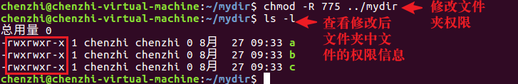

2-107  mydir

图

目录下文件权限信息

mydir

2-108

查看文件“

”修改后的权限信息，如图

所示。

2-108  mydir

图

文件夹权限信息

文件夹权限递归修改后文件夹及其内部的文件的权限都会进行更改。

店铺：

官方网站：

https://xiaomeige.taobao.com

www.corecourse.cn

技术博客：

技术群组：

http://www.cnblogs.com/xiaomeige/

---
*下一页*

小梅哥FPGA 团队    武汉芯路恒科技

专注于培养您的FPGA 独立开发能力   开发板 培训 项目研发三位一体

2.7.2.2

chown

文件归属者修改命令

Linux chown

change owner

（英文全拼：

）命令用于设置文件所有者和文件

关联组的命令，该命令可以向某个用户授权，使该用户变成指定文件的所有者

或者改变文件所属的组。命令格式如下：

chown [参数] [用户名.<组名>] [文件名/目录]

2-47

主要参数如表

所示。

2-47  chown

表

主要参数

参数

说明

-c

-v

效果同

类似，但仅回显更改的部分

-f

不显示错误信息

-h

只对符号连接的文件做修改，不改动其它任

何相关的文件

-R

递归处理，将指定的目录下的所有文件和子

目录一起处理。

-v

显示处理过程

user

ID

新的文件拥有者的使用者

group

新的文件拥有者的使用者组

mytest

新建一个测试文件，查看其归属用户和归属组，“

”文件的归属用

chenzhi

chenzhi

,

mytest

户是“

”归属组是“

”

将“

”文件的归属用户更改为

root

,

root

,

2-109

“

”

归属组更改为“

”

如图

所示。

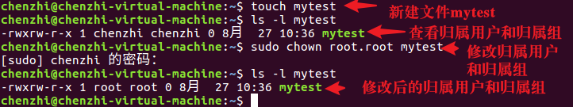

2-109

图

更改文件归属关系

chown

-R

对文件夹归属关系的修改时运用指令“

”并加入“

”参数进行递

归化处理，完成对文件夹进行归属关系进行修改，查看其归属关系的变化，以

mydir

2-110

“

”文件夹为例对其归属关系进行修改，如图

所示。

店铺：

官方网站：

https://xiaomeige.taobao.com

www.corecourse.cn

技术博客：

技术群组：

http://www.cnblogs.com/xiaomeige/

---
*下一页*

小梅哥FPGA 团队    武汉芯路恒科技

专注于培养您的FPGA 独立开发能力   开发板 培训 项目研发三位一体

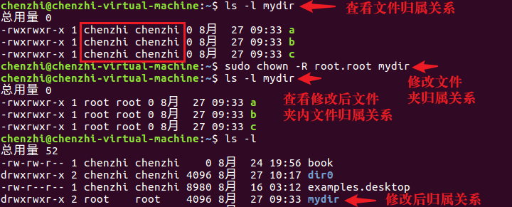

2-110

图

更改归属关系

对文件夹的归属关系修改后查看文件夹及文件夹内文件的归属关系，文件

夹及文件夹内文件的归属关系全部更改完成。

2.8

Linux

磁盘管理

2.8.1

Linux

磁盘管理基本概念

Linux

Linux

磁盘管理对于

十分重要，

磁盘管理的好坏会直接关系到整个系

统的性能问题。在计算机中一般将一块机械硬盘逻辑的分为几个区，每个区都

linux

+

当独立硬盘，以便方便的使用。

中，分区的表示是：设备名称

分区号，如

sda1

sda2

、

等；分区不是硬盘的物理功能，而是软件功能，主流的分区机制有

MBR

GPT

和

两种。

/etc/fstab

Ubuntu

2-111

在文件

可以查看

系统硬盘分区情况，如图

所示。

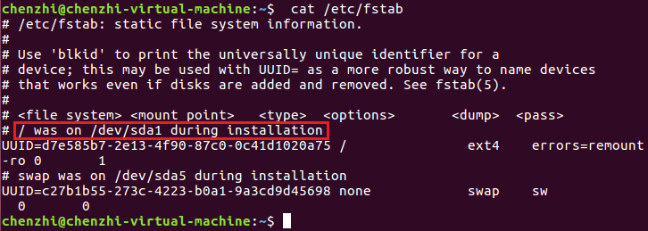

2-111

图

查看硬盘分区

2-112

可以通过如下命令查看当前系统中的磁盘，如图

所示。

ls /dev/sd*

店铺：

官方网站：

https://xiaomeige.taobao.com

www.corecourse.cn

技术博客：

技术群组：

http://www.cnblogs.com/xiaomeige/

---
*下一页*

小梅哥FPGA 团队    武汉芯路恒科技

专注于培养您的FPGA 独立开发能力   开发板 培训 项目研发三位一体

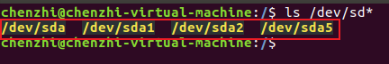

2-112

图

查看磁盘

sda

sda1

sda2

sda5

sda

其中“

”是设备名，“

”“

”“

”代表了“

”设备的三

个分区。

2.8.2

磁盘管理命令

U

连接

盘到电脑，在可移动设备提示栏选择“不在显示此提示”，点击确

2-113

认，如图

所示。

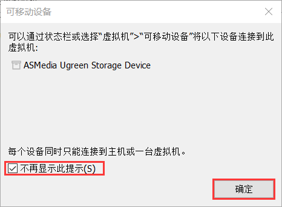

2-113

U

图

连接

盘到电脑

USB

在虚拟机界面显示“检测到新的

设备”。由于每个设备同时只能连接

到主机或一台虚拟机，选择连接到虚拟机，并选择要连接的虚拟机的名称，这

Ubuntu 64

2-114

里系统不会进行默认选择要点击选择“

位”，点击确认，如图

所示。

店铺：

官方网站：

https://xiaomeige.taobao.com

www.corecourse.cn

技术博客：

技术群组：

http://www.cnblogs.com/xiaomeige/

---
*下一页*

小梅哥FPGA 团队    武汉芯路恒科技

专注于培养您的FPGA 独立开发能力   开发板 培训 项目研发三位一体

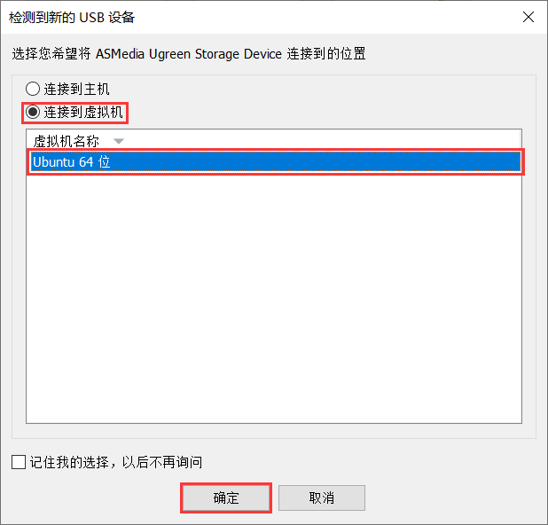

2-114

图

选择连接到虚拟机

SD

再次查看当前系统中的磁盘情况，由于插入的

卡拥有两个分区，这里

sdb

sdb1

sdb2

2-115

“

”显示有“

”和“

”，如图

所示。

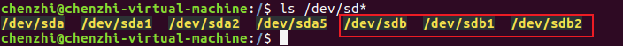

2-115

图

查看磁盘分区

2.8.2.1

fdisk

磁盘分区命令

fdisk

磁盘进行分区，可以使用命令

，命令格如下

fdisk  [参数]

2-48

主要参数如表

所示。

2-48  fdisk

表

参数

参数

说明

p

打印分区表

n

新建一个新分区

d

删除一个分区

q

退出不保存

w

把分区写进分区表，保存并退出

-b<

>

分区大小

指定每个分区的大小。

-l

列出指定设备的分区表

-s<

>

分区编号

将指定的分区大小输出到标准的输出上，单位为块。

店铺：

官方网站：

https://xiaomeige.taobao.com

www.corecourse.cn

技术博客：

技术群组：

http://www.cnblogs.com/xiaomeige/

---
*下一页*

小梅哥FPGA 团队    武汉芯路恒科技

专注于培养您的FPGA 独立开发能力   开发板 培训 项目研发三位一体

-u

-l

搭配“

”参数，会用分区数目取代柱面数目，来表示每

个分区的起始地址

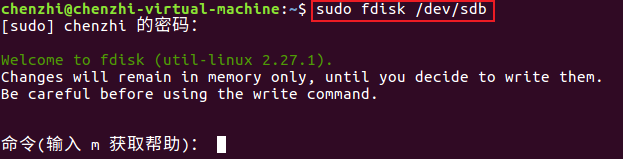

2-116

图

进入分区配置

m

2-117

输入

获取帮助，如图

所示。

2-117

图

进入帮助菜单

n

p

开始新建分区。输入“

”创建一个新分区。通过选择“

”使其为主，使

1

2048

用默认分区号

和第一个扇区

。设置最后一个扇区，也就是设置第一个分

店铺：

官方网站：

https://xiaomeige.taobao.com

www.corecourse.cn

技术博客：

技术群组：

http://www.cnblogs.com/xiaomeige/

---
*下一页*

小梅哥FPGA 团队    武汉芯路恒科技

专注于培养您的FPGA 独立开发能力   开发板 培训 项目研发三位一体

100M

+100M

100MB

区的大小，这里我们设置为

，输入“

”，为该分区预留

，

2-118

如图

所示。

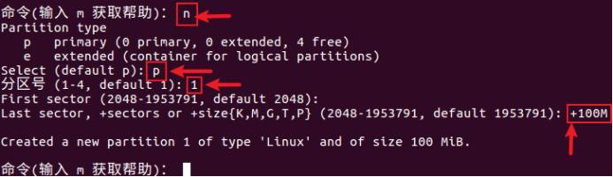

2-118

图

创建分区

2.8.2.2

mkfs

格式化命令

Linux

mkfs

下的格式化命令为

，命令格式如下

mkfs  [参数] [-t 文件系统类型] [分区名称]

2-49

主要参数如表

所示。

2-49  kmfs

表

参数

参数

说明

fs

指定建立文件系统时的参数

-V

显示版本信息和简要的使用方法

-v

显示版本信息和详细的使用方法

2.8.2.3

mount

挂载分区命令

mount

磁盘挂载命令为

，命令格式如下

mount  [参数] –t  [类型]  [设备名称]  [目的文件夹]

2-50

命令主要参数如表

所示。

2-50  mount

表

参数

参数

说明

-V

显示程序版本

-h

显示辅助信息

-v

显示执行过程详细信息

-o ro

只读模式挂载

-o rw

读写模式挂载。

-s-r

-o ro

等于

-w

-o rw

等于

U

”fdisk -l”

dev

当

盘识别成功之后，使

命令，则会看到在

目录下多了一个

sda

U

SD

名为

的设备，该设备就是刚刚接入的

盘，使用和挂载

卡一样的方式，

店铺：

官方网站：

https://xiaomeige.taobao.com

www.corecourse.cn

技术博客：

技术群组：

http://www.cnblogs.com/xiaomeige/

---
*下一页*

小梅哥FPGA 团队    武汉芯路恒科技

专注于培养您的FPGA 独立开发能力   开发板 培训 项目研发三位一体

U

Linux

mnt

U

将

盘挂载到

文件系统中，然后查看

目录下的文件，就可以看到

盘中的内容了。

U

挂载

盘的具体命令如下所示：

mount –t vfat /dev/sda1 /mnt

2.8.2.4

umount

卸载命令

umount

通过

将其从卸载点卸除，命令格式如下：

umount [参数] -t [文件系统类型] [设备名称]

2-51

主要参数如表

所示。

2-51  umount

表

参数

参数

说明

-a

/etc/mtab

卸载

中的所有文件系统

-h

显示帮助。

-n

/etc/mtab

卸载时不要将信息存入到

文件中

-r

如果无法成功卸载，则尝试以只读的方式重新挂载。

-t <

文件系统类

仅卸载选项中指定的文件系统

>

型

-v

-v

显示执行过程。

2.9

本章小结

Ubuntu

Ubuntu

本章我们正式进入

系统的入门学习。打开

系统后进行终端

Shell

的基本操作。对常用的

命令进行了讲解和演示。通过本章的学习，读者还

Ubuntu

Ubuntu

应该掌握对

系统下的应用下载安装、文本创建编辑，对

系统的

文件系统、用户权限、磁盘了解并能够进行基本操作。经过第二章的学习，读

SoC FPGA

者应当掌握

硬件平台的基本使用方法，为后续的学习内容打下基础，

准备着手开始后面的开发。

店铺：

官方网站：

https://xiaomeige.taobao.com

www.corecourse.cn

技术博客：

技术群组：

http://www.cnblogs.com/xiaomeige/

---
*下一页*

小梅哥FPGA 团队    武汉芯路恒科技

专注于培养您的FPGA 独立开发能力   开发板 培训 项目研发三位一体

店铺：

官方网站：

https://xiaomeige.taobao.com

www.corecourse.cn

技术博客：

技术群组：

http://www.cnblogs.com/xiaomeige/

---
*下一页*

小梅哥FPGA 团队    武汉芯路恒科技

专注于培养您的FPGA 独立开发能力   开发板 培训 项目研发三位一体

开发环境搭建

章节导读

在进行嵌入式学习开发之前，我们需要搭建好对应的开发环境，在AC820-

开发板基本使用章节安装了Vivado 在Windows 系统下，进行嵌入式Linux 的开

发还需要在Ubuntu 和 Windows 系统中需要搭建不同的环境以满足开发需求。

3.1

Ubuntu

Windows

和

文件互传

Windows

Ubuntu

FTP

FTP

在

和

下进行文件传输，我们需要使用

服务。

服务

实现了系统的双向数据传输，控制文件下载空间在服务器复制文件从本地计算

Ubuntu

ftp

机或本地上传文件复制到服务器上的空间。在

系统下安装

服务器软

vsftpd

Ubuntu

FTP

件

，把

配置为

服务器。如果你不确定是否已经安装

vsftpd

vsftpd

了

可以

输入指令查看版本信息，会有自己安装的

的版本提示，指

令如下：

vsftpd -v

3-1

vsftpd

输入指令查看版本信息如图

所示，如果你的计算机没有安装

，则

无版本信息显示。

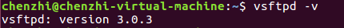

3-1  vsftpd

图

版本信息

vsftpd

vsftpd

Ubuntu

如果需要安装

，

可以对照

安装的设置方法。打开

的终

FTP

端窗口，然后执行如下命令来安装

服务：

sudo apt-get install vsftpd

3-2

安装的终端显示如图

所示。

店铺：

官方网站：

https://xiaomeige.taobao.com

www.corecourse.cn

技术博客：

技术群组：

http://www.cnblogs.com/xiaomeige/

---
*下一页*

小梅哥FPGA 团队    武汉芯路恒科技

专注于培养您的FPGA 独立开发能力   开发板 培训 项目研发三位一体

3-2

FTP

图

安装

服务

vsftpd

VI

/etc/vsftpd.conf

编辑

配置文件，

命令打开

，命令如下：

sudo vi /etc/vsftpd.conf

vsftpd.conf

打开

文件以后找到如下两行设置信息：

local_enable=YES

write_enable=YES

#

3-3

确保上面两行前面没有“

”，有的话就取消掉，如图

所示。

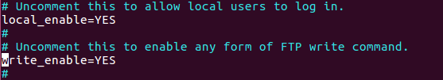

3-3

图

确认配置信息

vsftpd.conf

FTP

修改完

以后保存退出，使用如下命令重启

服务：

sudo /etc/init.d/vsftpd restart

FTP

3-4

重启

服务如图

所示。

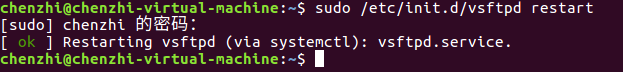

3-4

FTP

图

重启

服务

3.1.1

Windows

FTP

下

客户端安装

Ubuntu

Windows

Windows

FileZilla

要实现

和

文件互传需要在

系统下安装

以

FTP

FileZilla

实现

服务，可以进入

的官网进行下载，下载地址如下：

店铺：

官方网站：

https://xiaomeige.taobao.com

www.corecourse.cn

技术博客：

技术群组：

http://www.cnblogs.com/xiaomeige/

---
*下一页*

小梅哥FPGA 团队    武汉芯路恒科技

专注于培养您的FPGA 独立开发能力   开发板 培训 项目研发三位一体

https://www.filezilla.cn/download

FileZilla

3-5

，

官网界面如图

所示。

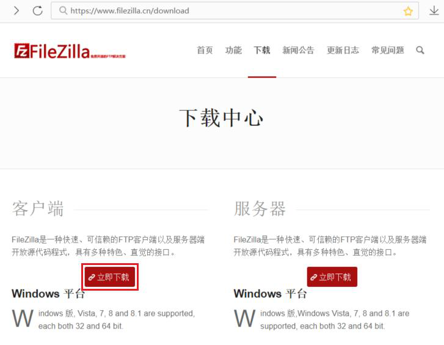

3-5  FileZilla

图

官网下载主页

FileZilla

:

AC820

也可以使用我们已经下载好

安装包，安装包路径为

小梅哥

ZYNQ

FPSoC

\05_

\ Linux\FileZilla

型

或安路

开发板资料

驱动和工具软件

，安装完

3-6

成以后找到安装目录，找到图标，然后发送图标快捷方式到桌面，如图

所示。

3-6  FileZilla

图

图标

FileZill

3-7

打开后的

界面显示如图

所示。

店铺：

官方网站：

https://xiaomeige.taobao.com

www.corecourse.cn

技术博客：

技术群组：

http://www.cnblogs.com/xiaomeige/

---
*下一页*

小梅哥FPGA 团队    武汉芯路恒科技

专注于培养您的FPGA 独立开发能力   开发板 培训 项目研发三位一体

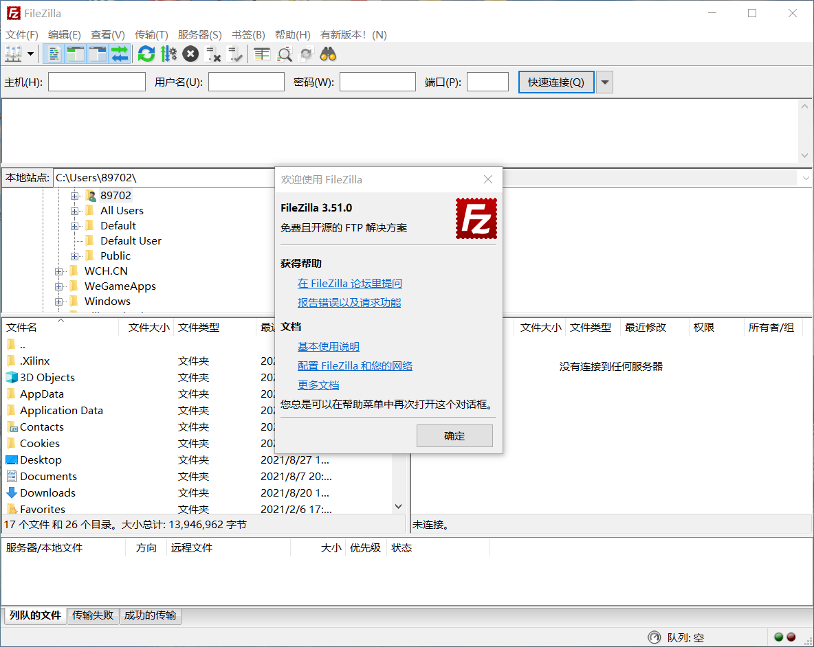

3-7  FileZilla

图

主界面

3.1.2

FileZilla

软件设置

Ubuntu

FTP

Windows

完成软件的安装后，

可作为

服务器，

系统安装

FileZilla

FTP

FTP

作为

客户端，客户端连接到服务器上就可以实现

服务，从而

/

进行两个系统间的文件传输。打开站点管理器，依次点击：“文件

站点管理

3-8

器”，如图

所示。

店铺：

官方网站：

https://xiaomeige.taobao.com

www.corecourse.cn

技术博客：

技术群组：

http://www.cnblogs.com/xiaomeige/

---
*下一页*

小梅哥FPGA 团队    武汉芯路恒科技

专注于培养您的FPGA 独立开发能力   开发板 培训 项目研发三位一体

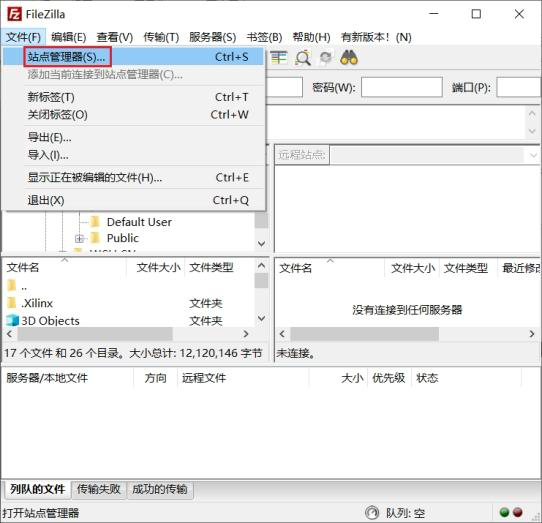

3-8

图

进入站点管理器

(N)

点击“新站点

”按钮来创建站点，新建站点以后就会在“我的站点”下

Ubuntu

出现新建的这个站点，站点重新进行命名为“

”。在新建站点时需要设

Ubuntu

IP

ifconfig

a

Ubuntu

置

系统的

地址，这里输入命令：“

–

”，查看

系统

IP

3-10

，如图

所示。

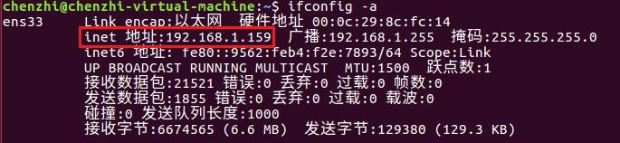

3-9

Ubuntu

IP

图

查看

系统的

点击“新建站点”，对新建的站点进行重命名后，点击“常规”设置界面。

FTP-

文件传输协议设置为“

文件传输协议”，主机这里设置为我们查询到的

Ubuntu

IP

Ubuntu

系统的

地址，

用户设置为

系统用户，我的系统用户为

chenzhi

,

Ubuntu

“

”

密码就是设置的

系统用户的登录密码，这里设置的是我的

chenzhi

3-10

“

”用户的登录密码，如图

所示。

店铺：

官方网站：

https://xiaomeige.taobao.com

www.corecourse.cn

技术博客：

技术群组：

http://www.cnblogs.com/xiaomeige/

---
*下一页*

小梅哥FPGA 团队    武汉芯路恒科技

专注于培养您的FPGA 独立开发能力   开发板 培训 项目研发三位一体

3-10

图

常规设置

常规界面设置好之后点击“字符集”，进入字符集设置界面，在“服务器

UTF-8

U

,

使用以下的字符集编码来处理文件名”栏选择“强制

（

）”

点击

“链

3-11

接”，如图

所示。

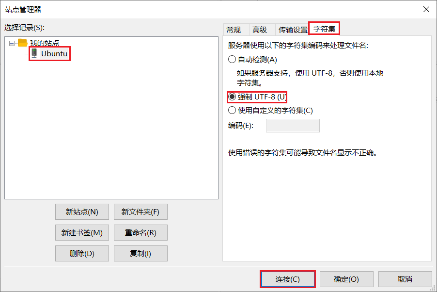

3-11

图

字符集设置

UTF-8(U)

,

Ubuntu

字符集这里如果没有设置为“强制

”

会出现

系统下文件

3-12

乱码的情况。图

为设置好后服务器连接界面，目录显示正常。

店铺：

官方网站：

https://xiaomeige.taobao.com

www.corecourse.cn

技术博客：

技术群组：

http://www.cnblogs.com/xiaomeige/

---
*下一页*

小梅哥FPGA 团队    武汉芯路恒科技

专注于培养您的FPGA 独立开发能力   开发板 培训 项目研发三位一体

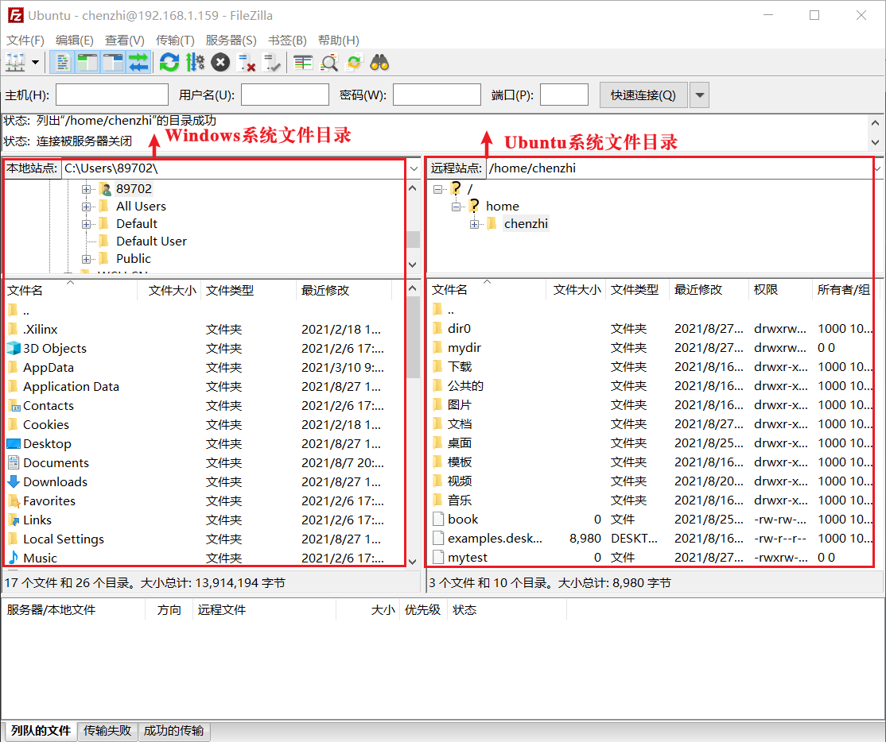

3-12

图

务器连接界面

Ubuntu

在服务器连接界面显示了两个系统的目录，

系统默认进入设置的用

户根目录下。接下来就可以对文件进行操作传输，文件传输的方式和我们在使

Windows

用单一系统时的操作相似，只是拷贝拖放是跨系统进行。如果要将

下

Ubuntu

Windows

的文件或文件夹拷贝到

中，只需要左侧的

区域选中要拷贝的文

Ubuntu

Ubuntu

件或者文件夹，然后直接拖到右侧的

中指定的目录即可。将

中

Windows

的文件或者文件夹拷贝到

中也是如此。

3.2

Ubuntu

Windows

和

文件本地共享

Ubuntu

Windows

Ubuntu

Windows

和

文件互传可以使用本地共享的方式，

和

系统都可以对共享的文件夹进行操作。本地共享的方式可以减少不同系统文件

之间的文件复制和磁盘空间的双重占用，节省资源。

Vmware

Ubuntu

Vmware

首先在

中启动

系统，进入虚拟机后在

的菜单栏，

(M)

VMware Tools(T)

3-13

选择“虚拟机

”选项下的“安装

”，如图

所示。

店铺：

官方网站：

https://xiaomeige.taobao.com

www.corecourse.cn

技术博客：

技术群组：

http://www.cnblogs.com/xiaomeige/

---
*下一页*

小梅哥FPGA 团队    武汉芯路恒科技

专注于培养您的FPGA 独立开发能力   开发板 培训 项目研发三位一体

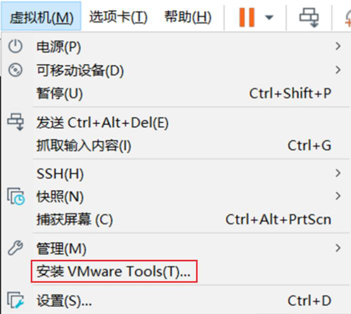

3-13

VMware Tools

图

开始

安装

Ubuntu

VMware Tools

在

系统里弹出挂载

后的文件浏览器界面，在左边栏

VNware Tools

VMwareTools-10.3.22-

先点击

，在弹出的新界面中右键选择“

15902021.tar.gz

3-14

”，在弹出的菜单中选择“用归档管理器打开”，如图

所示。

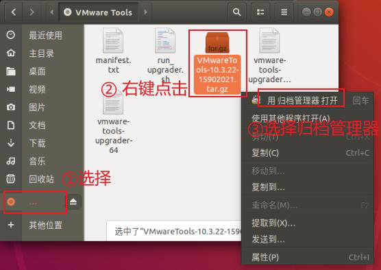

3-14  VMware Tools

图

文件

vmware-tools-distrib

(E)

右键点击

文件夹，然后点击右下角的“提取

”按钮，

3-15

如图

所示。

店铺：

官方网站：

https://xiaomeige.taobao.com

www.corecourse.cn

技术博客：

技术群组：

http://www.cnblogs.com/xiaomeige/

---
*下一页*

小梅哥FPGA 团队    武汉芯路恒科技

专注于培养您的FPGA 独立开发能力   开发板 培训 项目研发三位一体

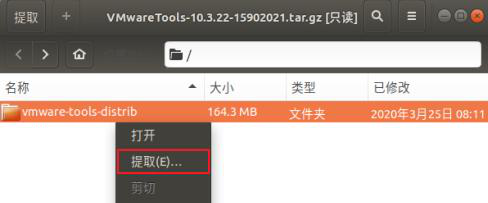

3-15

图

提取文件到目录

继续在弹出的界面中，先点击主目录，再点击提取，如下图所示。

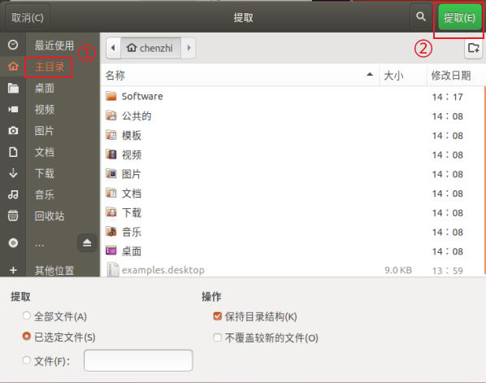

3-16

图

提取

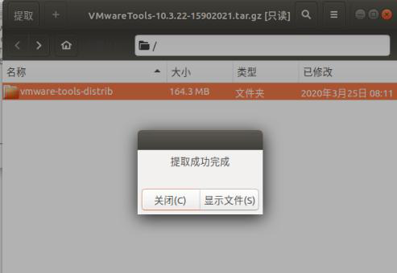

3-17

图

提取成功

店铺：

官方网站：

https://xiaomeige.taobao.com

www.corecourse.cn

技术博客：

技术群组：

http://www.cnblogs.com/xiaomeige/

---
*下一页*

小梅哥FPGA 团队    武汉芯路恒科技

专注于培养您的FPGA 独立开发能力   开发板 培训 项目研发三位一体

vmware-tools-distrib

完成上述解压步骤后，可以在主目录下得到一个“

”的

3-18

文件夹，如图

所示。

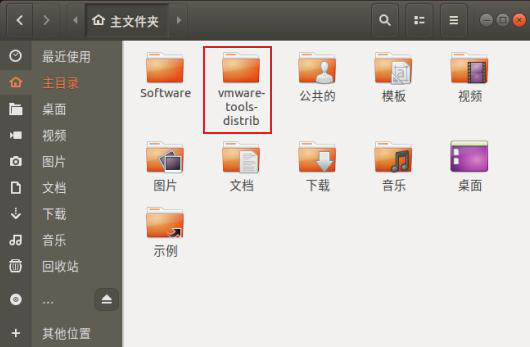

3-18

图

解压后的文件

进入该文件夹，在空白处单击鼠标右键，在弹出的菜单中，选择“在终端

(T)

3-19

打开

”，如图

所示。

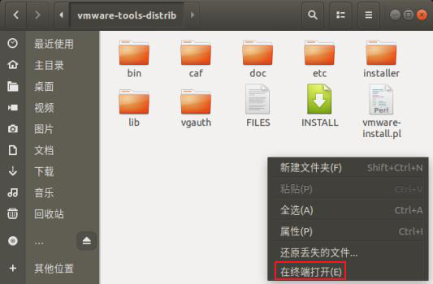

3-19

图

打开文件

ls -l

3-20

“

”命令查看解压文件夹，如图

所示。

店铺：

官方网站：

https://xiaomeige.taobao.com

www.corecourse.cn

技术博客：

技术群组：

http://www.cnblogs.com/xiaomeige/

---
*下一页*

小梅哥FPGA 团队    武汉芯路恒科技

专注于培养您的FPGA 独立开发能力   开发板 培训 项目研发三位一体

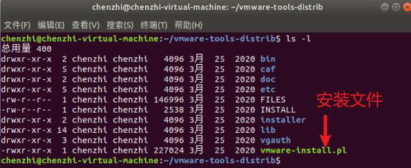

3-20

图

查看文件内容

sudo ./vmware-install.pl

输入命令“

”，这里提示要不要继续这个安装，如图

3-21

所示。

3-21

图

软件安装

open-vm-tools

yes

,

提示该操作系统可以直接安装

安装包，输入“

”

之后一

3-22

直点击回车，即可完成安装过程，如图

所示。

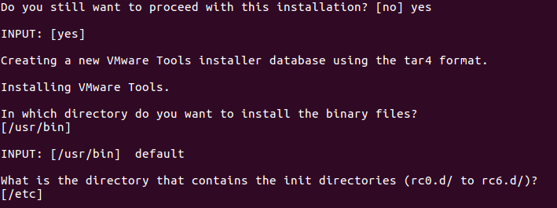

3-22

图

确认安装

3-23

下图

所示信息，代表安装完成了，需要重启图形界面，直接重启虚拟

Ubuntu

机里的

系统。

店铺：

官方网站：

https://xiaomeige.taobao.com

www.corecourse.cn

技术博客：

技术群组：

http://www.cnblogs.com/xiaomeige/

---
*下一页*

小梅哥FPGA 团队    武汉芯路恒科技

专注于培养您的FPGA 独立开发能力   开发板 培训 项目研发三位一体

3-23

Ubuntu

图

重启

系统

Ubuntu

VMware

(S)

重启

之后，在

的虚拟机菜单栏中选择“设置

”，如图

3-24

所示。

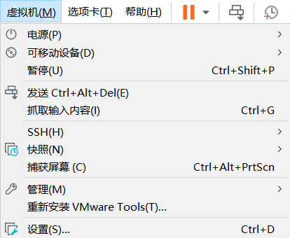

3-24

图

设置

选择“选项”部分设置，在该界面中，单击“共享文件夹”设置按钮，在

(E)

右边界面中选择“总是启用

”表示启用共享文件夹，点击

“添加”，可以添

加共享文件夹，共享文件夹可以选择自己准备的空文件夹，也可以使用其它文

3-25

件夹，如图

所示。

店铺：

官方网站：

https://xiaomeige.taobao.com

www.corecourse.cn

技术博客：

技术群组：

http://www.cnblogs.com/xiaomeige/

---
*下一页*

小梅哥FPGA 团队    武汉芯路恒科技

专注于培养您的FPGA 独立开发能力   开发板 培训 项目研发三位一体

3-25

图

共享文件夹设置

3-26

设置好后点击添加进入共享文件夹添加向导界面，如图

所示。

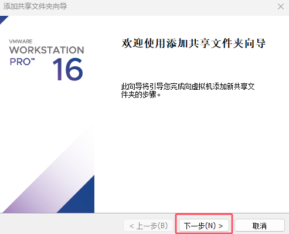

3-26

图

向导界面

file

点击“下一步”，选中准备好的文件夹，这里我选择了

文件夹作为共享

share

文件夹，读者也可以自己创建一个新的文件夹用作共享文件夹，命名为“

”

sharefile

,

或者“

”

便于记忆和调用我添加到设置界面，设置好之后点击“下一

3-27

步”，如图

所示。

店铺：

官方网站：

https://xiaomeige.taobao.com

www.corecourse.cn

技术博客：

技术群组：

http://www.cnblogs.com/xiaomeige/

---
*下一页*

小梅哥FPGA 团队    武汉芯路恒科技

专注于培养您的FPGA 独立开发能力   开发板 培训 项目研发三位一体

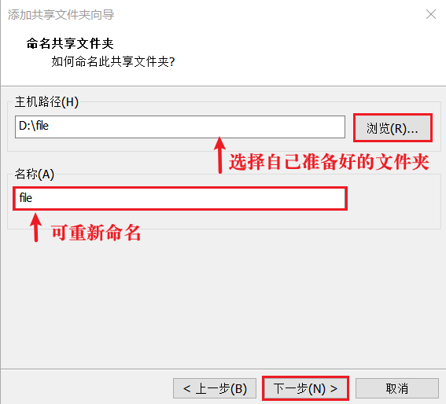

3-27

图

添加共享文件夹

E

进入“指定共享文件夹属性”页面，选择“启用此共享（

）”，点击

3-28

“完成”，共享文件夹的设置就完成了，如图

所示。

3-28

图

属性设置

Ubuntu

file

向

系统传递的文件就都放在共享文件夹“

”文件夹下，该文件

Ubuntu

/mnt/hgfs/file/

夹在

系统中对应的是“

”目录，我们在终端中输入命令可

以查看到文件夹：

店铺：

官方网站：

https://xiaomeige.taobao.com

www.corecourse.cn

技术博客：

技术群组：

http://www.cnblogs.com/xiaomeige/

---
*下一页*

小梅哥FPGA 团队    武汉芯路恒科技

专注于培养您的FPGA 独立开发能力   开发板 培训 项目研发三位一体

ll /mnt/hgfs/文件夹名/

这里的“文件夹名”替换为自己设定的共享文件夹名称，这里笔者的文件

file

file

root

0

夹名为

。查看文件夹你可以发现“

”的所属主为“

”，使用空间为

，

3-29

文件夹为空，查看信息如图

所示。

3-29

file

图

查看共享文件夹

Windows

Ubuntu

通过共享文件夹，我们在

系统向

系统传递文件可以直接将

file

Ubuntu

share

该文件复制到

目录，把向

系统传递的文件就都放在

文件夹下。

Ubuntu

file

Ubuntu

Ubuntu

对

文件夹的访问和

系统下的文件夹一样。从

系统向

Windows

cp

mv

传递文件也非常便利，可以使用“

”命令或

“

”命令复制移动文

Windows

件到该目录，在

系统下就可以直接对文件进行调用。

3.3

Ubuntu

tftp

系统搭建

服务器

TFTP

UDP

是一个基于

协议实现的用于在客户机和服务器之间进行简单文

TFTP

件传输的协议。

专门为小文件传输而设计，只能从服务器上获取文件，或

Ubuntu

者向服务器写入文件，不能列出目录，也不能进行认证。这里我们在

上

TFTP

tftp-hpa

tftpd-hpa

搭建

服务器，安装两个软件包，一个是

，一个是

软件包，

安装的指令如下：

sudo apt-get install tftp-hpa tftpd-hpa

3-30

输入安装指令，安装界面如图

所示。

店铺：

官方网站：

https://xiaomeige.taobao.com

www.corecourse.cn

技术博客：

技术群组：

http://www.cnblogs.com/xiaomeige/

---
*下一页*

小梅哥FPGA 团队    武汉芯路恒科技

专注于培养您的FPGA 独立开发能力   开发板 培训 项目研发三位一体

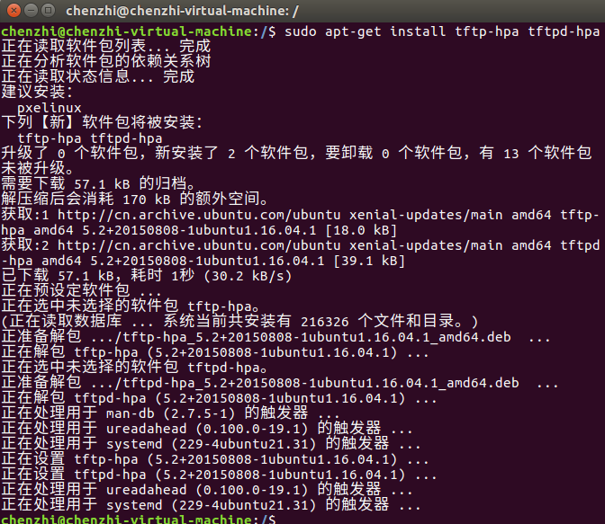

3-30

图

软件包安装

TFTP

/tftpboot

需要一个文件夹来存放文件，我们在根目录下新建一个

目录

TFTP

做为

文件存储目录，创建目录目录如下：

sudo mkdir -p /tftpboot

tftpboot

创建好文件夹后，我们对

文件夹的权限进行修改，以应对后面在使

用过程中的问题，权限修改命令如下：

sudo chmod 777 /tftpboot

tftpboot

如图所示，我们对新建的

“

”文件夹信息进行查看，并更改文件夹

rwxrwxrwx

,

3-31

的权限为“

”

如图

所示。

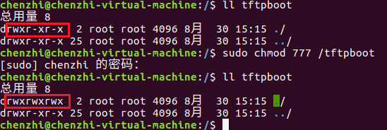

3-31

tftpboot

图

修改

文件权限

tftp

/etc/default/tftpd-hpa

对

进行配置，使用以下命令打开

文件

sudo vi /etc/default/tftpd-hpa

店铺：

官方网站：

https://xiaomeige.taobao.com

www.corecourse.cn

技术博客：

技术群组：

http://www.cnblogs.com/xiaomeige/

---
*下一页*

小梅哥FPGA 团队    武汉芯路恒科技

专注于培养您的FPGA 独立开发能力   开发板 培训 项目研发三位一体

将其内容修改如下：

# /etc/default/tftpd-hpa

TFTP_USERNAME="tftp"

TFTP_DIRECTORY="/tftpboot"

TFTP_ADDRESS="0.0.0.0:69"

TFTP_OPTIONS="-l -c -s"

TFTP_DIRECTORY

Ubuntu

TFTP

“

”

这里是你

虚拟机中

服务器的目录，

TFTP_ADDRESS

IP

TFTP_OPTIONS

“

”是

地址和端口号，“

”设置的内容为：

1.

“-l”是在独立运行服务器（听）模式，而不是从inetd 运行;

2.

“-c”是可以上传文件的参数;

3.

“-s”是指定的TFTP 服务器的目录。

tftpd-hpa

3-32

修改之后的

文件内容，如图

所示。

3-32

tftpd-hpa

图

修改后的

文件

tftp

最后输入如下命令，重启

服务器，无报错信息则重启成功：

sudo service tftpd-hpa restart

3.4

Ubuntu

NFS

SSH

下

和

服务开启

3.4.1

NFS

服务开启

NFS, Network File System,

NFS

即网络文件系统，通常

有提供者和使用者，

export

export

提供者共享（

）自己的目录，使用者将提供者共享（

）的目录挂载

NFS

到自己的机器上，我们将提供者视为服务端，使用者视为客户端，但是在

C-S

中，这个

关系实质上是不固定的。

Ubuntu

NFS

nfs-kernel-server

安装并开启

中的

服务，安装

，将会自动安装

nfs-common

rpcbind

和

等依赖，使用如下命令：

sudo apt-get install nfs-kernel-server

店铺：

官方网站：

https://xiaomeige.taobao.com

www.corecourse.cn

技术博客：

技术群组：

http://www.cnblogs.com/xiaomeige/

---
*下一页*

小梅哥FPGA 团队    武汉芯路恒科技

专注于培养您的FPGA 独立开发能力   开发板 培训 项目研发三位一体

[Y/n]”

Y

输入指令，开始安装，在“您希望继续执行吗？

输入

“

”继续进行

3-33

安装，如图

所示。

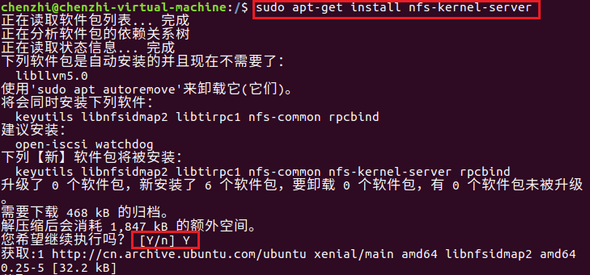

3-33

NFS

图

安装

服务

NFSfile

等待安装完成，在用户根目录下创建一个“

”文件夹用于存放文件，

3-34

如图

所示。

3-34

NFSfile”

图

创建“

文件夹

NFSfile

nfs

nfs

“

”文件夹供

服务器使用，通过网络文件系统可以用来访问

nfs

nfs

/etc/exports

文件夹。下面我们进行

配置，

允许挂载的目录及权限在文件

nfs

中进行定义，使用如下命令打开

配置文件：

sudo vi /etc/exports

/etc/exports

3-35

打开

以后在后面添加如下所示内容，如图

所示。注意这里

@

ovo

的用户名为打开的窗口左上角

前面的名称，例如这里的

即为我的用户名。

/home/用户名/NFSfile *(rw,sync,no_root_squash)

店铺：

官方网站：

https://xiaomeige.taobao.com

www.corecourse.cn

技术博客：

技术群组：

http://www.cnblogs.com/xiaomeige/

---
*下一页*

小梅哥FPGA 团队    武汉芯路恒科技

专注于培养您的FPGA 独立开发能力   开发板 培训 项目研发三位一体

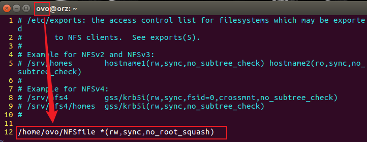

3-35

图

添加配置

/home/ovo/NFSfile

*

“

”是要共享的目录，“

”代表允许所有的网络段访问，

rw

sync

“no_root_squash”

nfs

“

”是可读写权限，“

”是文件同步写入存储器，

是

客户端分享目录使用者的权限。

nfs

重启

服务，使用如下命令：

sudo service nfs-kernel-server restart

运行以下命令来显示共享的目录：

showmount -e

3-36

输入命令后如图

所示。

3-36

图

显示共享目录

nfs

/etc/exports

exportfs

在

运行的过程中，修改了

配置文件，可以使用

命令

使改动生效，具体命令：

sudo exportfs -rv

3.4.2

SSH

开启

服务

SSH

Secure Shell

为

的缩写，是目前较可靠，专为远程登录会话和其他网络

SSH

服务提供安全性的协议。利用

协议可以有效防止远程管理过程中的信息泄

露问题。

linux

ubuntu

centos

有很多人直接使用

系统，比如

和

等。但是也有很多人不

linux

喜欢

系统，虽然它对于做计算很方便，但是对于日常办公软件的支持极差，

QQ

office

SSH

比如

、微信、

等。这个时候

客户端应运而生，它的作用就是帮助

windows

linux

我们在

下去连接并操作

服务器。

店铺：

官方网站：

https://xiaomeige.taobao.com

www.corecourse.cn

技术博客：

技术群组：

http://www.cnblogs.com/xiaomeige/

---
*下一页*

小梅哥FPGA 团队    武汉芯路恒科技

专注于培养您的FPGA 独立开发能力   开发板 培训 项目研发三位一体

Windwos

Ubuntu

如果你想在

系统下使用终端软件登陆到

系统，比如使用

SecureCRT

Ubuntu

SSH

SSH

，就需要开启

的

服务实现，开启

服务的指令如下：

sudo apt-get install openssh-server

[Y/n]”

Y

输入指令，进行安装，在“您希望继续执行吗？

输入

“

”继续进行

3-37

安装，如图

所示。

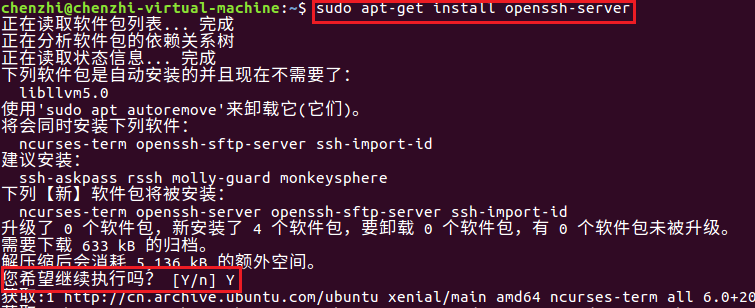

3-37

ssh

图

安装

服务

ssh

/etc/ssh/sshd_config

的配置文件为

，使用默认配置即可。检测是否已启动，

指令如下所示。

ps -e | grep ssh

3.5

Petalinux

安装

Petalinux

Xilinx

Linux

PetaLinux

工具是

公司推出的嵌入式

开发套件，

工具

Xilinx

Linux

提供在

处理系统上定制、构建和调配嵌入式

解决方案所需的所有

Xilinx

组件。该解决方案旨在提升设计生产力，可与

硬件设计工具配合使用，

Versal

Zynq®

UltraScale+™

MPSoC

Zynq®-7000

SoC

以简化针对

、

、

MicroBlaze™

Linux

Petalinux

和

的

系统开发。具体的介绍可访问

工具网站：

https://china.xilinx.com/products/design-tools/embedded-software/petalinux-sdk.html

3.5.1

Petalinux

获取

安装包

Petalinux

Ubuntu

Petalinux

这里安装

开发工具是安装在

操作系统中，在进行

Ubuntu 18.04.4 64

安装之前确保大家已经在虚拟机中安装了

位操作系统，这也

是官方推荐的版本。安装包文件比较大，读者也可以直接使用我们配套资料提

AC820

\12_

\Xilinx\Linux\Petalinux

供的安装包，路径为：

开发板资料

开发软件

。

店铺：

官方网站：

https://xiaomeige.taobao.com

www.corecourse.cn

技术博客：

技术群组：

http://www.cnblogs.com/xiaomeige/

---
*下一页*

小梅哥FPGA 团队    武汉芯路恒科技

专注于培养您的FPGA 独立开发能力   开发板 培训 项目研发三位一体

Xilinx

https://china.xilinx.com/

读者也可以到

的官方网站

进行下（注：需要

注册账号才能下载）。

Petalinux

Vivado

Vivado

由于

的版本要求与

的版本一致，而我们使用的

选

2020.2

Petalinux/

/2020.2

3-38

用的是

版本。在下载页面选择

“

存档

”，如图

所

示。

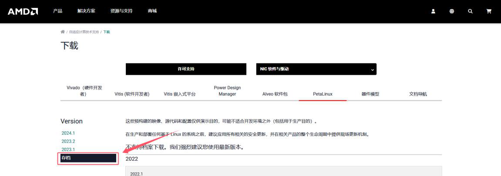

3-38

图

选择版本

Petalinux 2020.2

,

在下拉菜单中找到“

安装版本”

在进行用户注册之后就可

3-39

以进行下载，如图

所示。

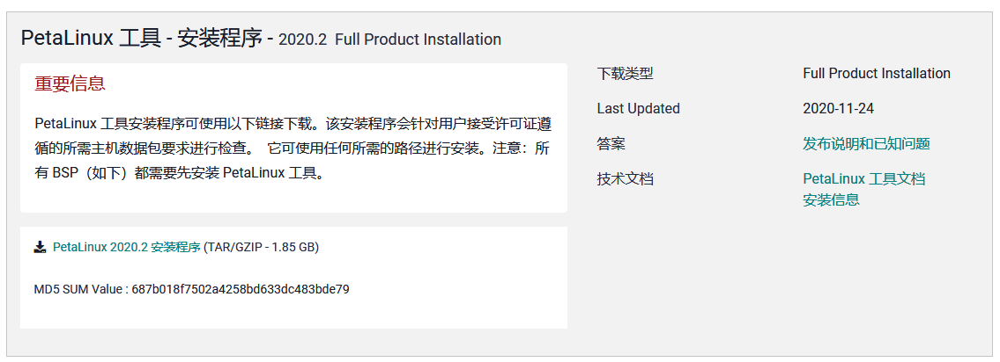

3-39  Petalinux

图

安装包下载

3.5.2

Petalinux

进行

的安装

Petalinux

安装依赖库以及软件，这是安装

之前必要的准备，依赖库以及软

Petalinux

件如果安装不成功我们将无法进行

的安装，指令如下：

sudo apt-get install \

iproute2 gawk python3 python build-essential gcc git make net-tools \

libncurses5-dev tftpd zlib1g-dev libssl-dev flex bison libselinux1 \

gnupg wget git-core diffstat chrpath socat xterm autoconf libtool \

tar unzip texinfo zlib1g-dev gcc-multilib automake zlib1g:i386 \

店铺：

官方网站：

https://xiaomeige.taobao.com

www.corecourse.cn

技术博客：

技术群组：

http://www.cnblogs.com/xiaomeige/

---
*下一页*

小梅哥FPGA 团队    武汉芯路恒科技

专注于培养您的FPGA 独立开发能力   开发板 培训 项目研发三位一体

screen pax gzip cpio python3-pip python3-pexpect xz-utils \

debianutils iputils-ping python3-git python3-jinja2 libegl1-mesa \

libsdl1.2-dev pylint3

3-40

输入指令后进入安装

，如图

所示。

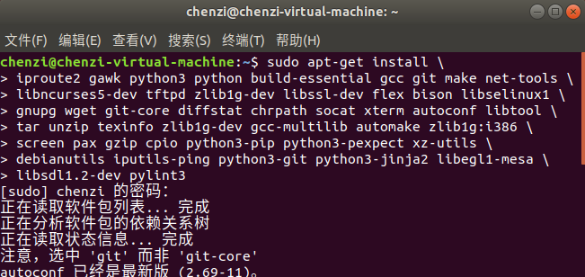

3-40

图

安装依赖库以及软件

Petalinux

等待安装完成就可以进行

的安装了。

Petalinux

体积相对庞大，我们在安装时要对其安装路径进行合理设置。在

Ubuntu

/opt

介绍

文件系统时我们介绍了“

”文件夹可选做文件和程序的存放目

/opt

Petalinux

录，我们在

“

”文件夹下新建一个文件夹作为

的安装路径。由于

Petalinux

Vivado

的版本要求与

的版本一致，后续可能需要安装其它版本的

Petalinux

Petalinux

2020.2

，为了区分版本在“

”文件夹下新建一个“

”显示安装

/opt

版本的文件夹。在创建文件夹之前，对于“

”文件夹，我们可以对其所属关

chenzhi

系进行修改，修改为我的用户“

”所属，方便我们后续进行操作，指令

如下：

sudo chown -R chenzhi:chenzhi /opt

创建文件夹，指令如下：

mkdir -p /opt/Petalinux/2020.2

在获取 Petalinux 安装文件时，有两种常用的方法可以将 Windows 下的

petalinux-v2020.2-final-installer.run 传输到 Ubuntu 系统：

Windows

如果已安装 VMware Tools，可以直接将安装文件从

拖拽到

Ubuntu

的目标目录：/opt/Petalinux/2020.2

vmware-tools

如果未安装上述的

，但是开启了共享文件夹；那么首先将安装

petalinux-v2020.2-final-installer.run

Ubuntu

文件“

”，放到共享文件夹；再在

下

店铺：

官方网站：

https://xiaomeige.taobao.com

www.corecourse.cn

技术博客：

技术群组：

http://www.cnblogs.com/xiaomeige/

---
*下一页*

小梅哥FPGA 团队    武汉芯路恒科技

专注于培养您的FPGA 独立开发能力   开发板 培训 项目研发三位一体

/mnt/hqfs/file/petalinux

使用命令将文件从共享文件夹“

” 移动到安装目录

/opt/Petalinux/2020.2

“

”；这里运用到前面移动文件指令，我们在这里进行复

习，指令如下：

sudo mv /mnt/hgfs/file/petalinux /opt/Petalinux/2020.2

3-41

输入指令进行文件的移动，如图

所示。

3-41

图

安装文件移动

/opt/Petalinux/2020.2

查看“

”安装目录，安装文件已经在我们设置的安装

3-42

路径了，如图

所示，也可以在系统文件夹中进行查看。

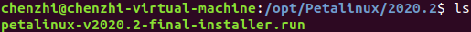

3-42

图

查看安装包

接下来使用安装指令进行安装，指令如下：

sudo chmod

777

petalinux-v2020.

2

-final-installer.run

./petalinux-v2020.

2

-final-installer.run

3-43

输入指令等待安装加载，如图

所示。

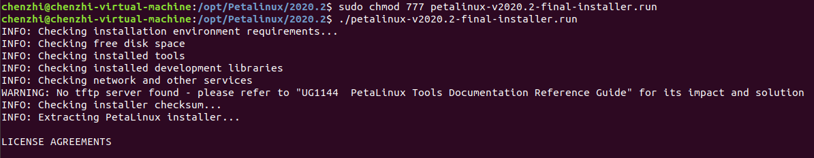

3-43

图

开始安装

Press Enter to display the license agreements

等待出现“

”，这里需要按下

Enter

,

3-44

“

”回车键显示软件许可协议

如图

所示。

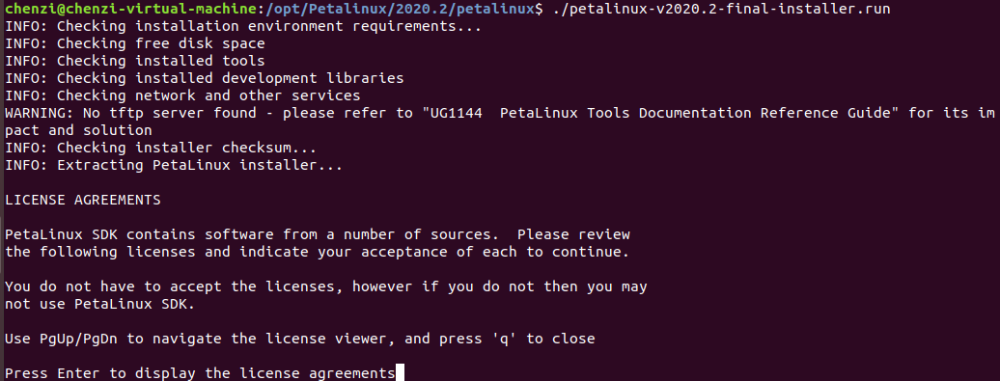

3-44

图

提示查看协议

店铺：

官方网站：

https://xiaomeige.taobao.com

www.corecourse.cn

技术博客：

技术群组：

http://www.cnblogs.com/xiaomeige/

---
*下一页*

小梅哥FPGA 团队    武汉芯路恒科技

专注于培养您的FPGA 独立开发能力   开发板 培训 项目研发三位一体

3-45

Q

进入协议界面如图

所示，查看协议后按“

”可返回原来的界面。

3-45

图

协议界面

xilinx

回到之前的界面会出现一个选择项，询问我们是否接受

最终用户协

y

3-46

议，输入“

”接受协议可进行后面的安装，如图

所示。

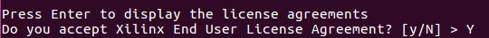

3-46

图

确认协议

Enter

一共有三个协议需要我们确认，确认步骤都是一样的，“

”键进行查

Q

y

3-47

看，“

”键返回，“

”确认，全部确认完成如图

所示。

3-47

图

所有协议确认完成

3-48

如图

所示，这里提示我们“您没有指定安装位置”，由于把安装包放

/opt/Petalinux/2020.2

/opt/Petalinux/2020.2

在安装路径“

”中，在安装路径“

”直

y

接进行安装时没有在指令中指定地址，输入“

” 默认安装在

/opt/Petalinux/2020.2

“

”

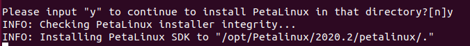

3-48

图

路径确认

PetaLinux

这里提示我们安装路径不为空，提示我们检查

安装器的完整性，

/opt/Petalinux/2020.2

这里我们确认安装在“

”，等待安装完成，安装时间较长，

店铺：

官方网站：

https://xiaomeige.taobao.com

www.corecourse.cn

技术博客：

技术群组：

http://www.cnblogs.com/xiaomeige/

---
*下一页*

小梅哥FPGA 团队    武汉芯路恒科技

专注于培养您的FPGA 独立开发能力   开发板 培训 项目研发三位一体

PetaLinux SDK has been installed to /opt/Petalinux/2020.2/

用户请耐心等待。

“

”

PetaLinux

/opt/Petalinux/2020.2

3-49

提示我们已经将

安装在“

”路径下，如图

所

示。

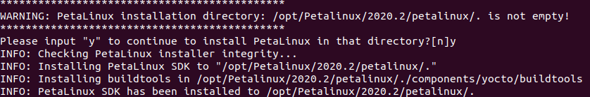

3-49

图

安装完成

3-50

安装完成，我们进入安装目录查看，如图

所示。

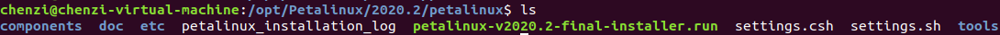

3-50

图

安装目录文件信息

components

doc

etc

安装完成后在安装目录下可以看到“

”、“

”、“

”、

tools

settings.csh

settings.sh

“

”四个文件夹以及

“

”、“

”

两个脚本文件。

bash

petalinux

/bin/sh

bash

Ubuntu

进行

修改。

工具需要主机系统的

是

，而

默

/bin/sh

dash

认的

是

，所以这里需要进行更改，运行如下命令：

sudo dpkg-reconfigure dash

3-51

运行命令显示窗口如图

所示。

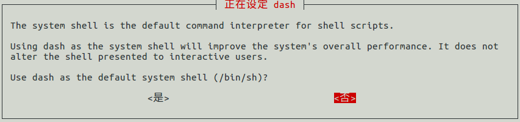

3-51  dash

图

禁用设定（对）

<

>

3-52

方向键选择“

否

”，按回车键确认，显示更改信息如图

所示。

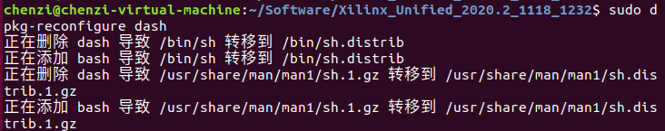

3-52

bash

图

更改为

（对）

店铺：

官方网站：

https://xiaomeige.taobao.com

www.corecourse.cn

技术博客：

技术群组：

http://www.cnblogs.com/xiaomeige/

---
*下一页*

小梅哥FPGA 团队    武汉芯路恒科技

专注于培养您的FPGA 独立开发能力   开发板 培训 项目研发三位一体

3.5.3

Petalinux

设置

环境变量

petalinux

petalinux

在正式使用

工具之前，需要先运行

安装目录下的

settings.sh

petalinux

settings.sh

bash

source

脚本文件设置

工作环境，

脚本用于

，

settings.sh

petalinux

脚本文件

对

所需的运行环境进行配置，命令如下：

source settings.sh

需要注意的是该命令只对当前终端有效，重新打开终端后需要重新执行这

3-53

一步，执行结果如图

所示。

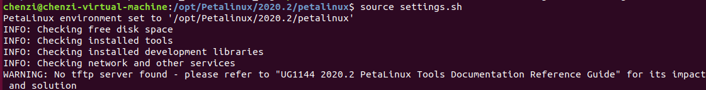

3-53

settings.sh

图

运行

脚本

验证下工作环境是否已设置，在终端输入如下命令：

echo $PETALINUX

3-54

验证如图

所示。

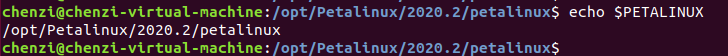

3-54

图

验证工作环境设置

Petalinux

Petalinux

显示

的安装目录，表明工作环境已设置。现在可以使用

Petalinux

工具了。鉴于每次打开终端使用

都需要设置相应的环境变量，且只能

echo

Petalinux

用于当前终端中。为了方便，我们使用

命令将

环境变量的配置命

.bashrc

令重定向到

配置文件中。代码如下：

echo "export PLNX_PATH=$PETALINUX" >> ~/.bashrc

echo "alias splnx='source \$PLNX_PATH/settings.sh'" >> ~/.bashrc

echo "export PATH=\$PATH:/opt/Petalinux/2020.2/tools/xsct/bin" >> ~/.bashrc

echo A >> B

A

B

这里的

的指令会将字符串输出追加重定向，将

追加到

的最

.bashrc

bash

后一行。这里的

文件是账户

的配置文件，主要保存当前账户的一些

个性化设置，用户账户在每次打开终端时会立马执行该文件。这样每次在启动

vi

.bashrc

虚拟机时该语句都会被自动执行。接下来使用

指令查看代码是否写入

，

指令如下：

vi ~/.bashrc

将文本下滑到最后一行，便能看到我们想要写入的语句，如

店铺：

官方网站：

https://xiaomeige.taobao.com

www.corecourse.cn

技术博客：

技术群组：

http://www.cnblogs.com/xiaomeige/

---
*下一页*

小梅哥FPGA 团队    武汉芯路恒科技

专注于培养您的FPGA 独立开发能力   开发板 培训 项目研发三位一体

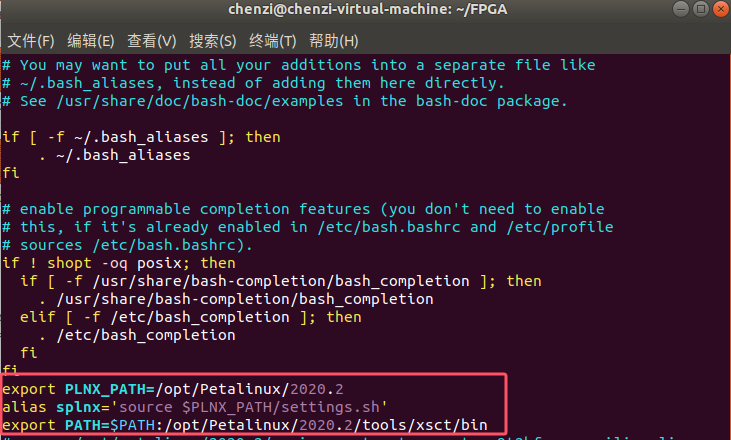

3-55

图

所示。

3-55  Petalinux

图

环境变量设置

.bashrc

:x

可以看到代码已经被写入

中，接下来输入“

”保存并退出文本。

splnx

这里是为了验证代码能否正确执行，我们在桌面新打开一个终端，输入

指

petalinux

3-56

令，可以看到

环境被成功配置，如图

：

店铺：

官方网站：

https://xiaomeige.taobao.com

www.corecourse.cn

技术博客：

技术群组：

http://www.cnblogs.com/xiaomeige/

---
*下一页*

小梅哥FPGA 团队    武汉芯路恒科技

专注于培养您的FPGA 独立开发能力   开发板 培训 项目研发三位一体

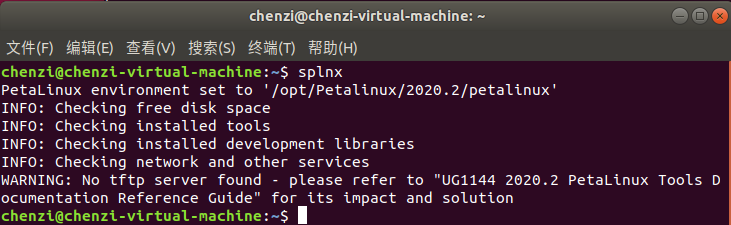

3-56

petalinux

图

配置

运行环境

error

如果在输出页面出现了与上图不一致现象，并且其中带有“

”输出语

Petalinux

句，说明没有配置成功，需要查看

安装过程是否与上述是否一致。

gmake

最后输入以下命令创建一个

软链接。

sudo ln -s /usr/bin/make /usr/bin/gmake

到此，环境就配置完毕了。

3.6

sdk

构建

PetaLinux 2019.1

Xilinx

Linux

从

开始，

不再提供预编译的

交叉编译工具链。

petalinux-build

来构建，这一变化给开发

要获取工具链，必须先创建工程并执行

带来了诸多不便：

1

、每次创建新工程都需要重新构建工具链

2

、编译内核、驱动和应用程序前都需要完整的工程环境

3

、构建过程耗时较长，影响开发效率

petalinux

SDK

构建

并进行安装；后续只需

针对这个问题，笔者建议先用

source

即可使用工具链；

3.6.1

SDK

是什么？

SDK

是一个完整的软件开发工具包，包含了独立开发所需的所有工具和库，

PetaLinux

环境进行应用程序或驱动的开发。

安装后可以脱离

3.6.2

SDK

安装

sdk.sh

AC820

文件，路径为：

开发板资料

首先，从提供的网盘资料中下载

\07_Linux

\ZYNQ7020\2020

\sdk.sh

VMware Tools

源码

版本

的

。如果读者已经完成

“Ubuntu

Windows

”

和

文件本地共享

安装（如果尚未安装，可以参考

章节），则

Ubuntu

中。这里笔者提前在主目录下创建了

可以直接将文件拖拽到

FPGA/AC820-ZYNQ

“

”文件夹，便于项目的管理。

店铺：

官方网站：

https://xiaomeige.taobao.com

www.corecourse.cn

技术博客：

技术群组：

http://www.cnblogs.com/xiaomeige/

---
*下一页*

小梅哥FPGA 团队    武汉芯路恒科技

专注于培养您的FPGA 独立开发能力   开发板 培训 项目研发三位一体

3-57

SDK.sh

图

拖拽

SDK

/opt/petalinux/

安装到

执行以下命令时，默认会将

目录下，也可以选择

所

自定义安装路径。笔者建议保持默认安装位置，直接按回车即可，如

图 3-58

示。

./sdk.sh

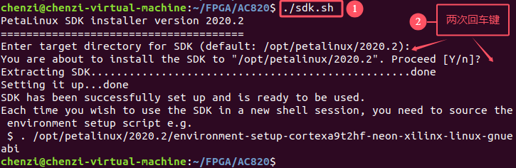

3-58

sdk

图

安装

这样设置后，就可以在任何目录下直接使用交叉编译工具链，不需要每次

PetaLinux

都创建完整的

工程，使开发流程更简易。

SDK.sh

对于

的制作，虽然一些读者可能感兴趣，但笔者不建议自行操作，

因为在制作过程中容易遇到网络相关的错误，且耗时较长。如果读者对此过程

非常感兴趣，下面简要介绍制作流程：

首先，进入一个空白文件夹，在该目录下打开终端，在其中输入以下命令，

PetaLinux

用于创建新的

工程；

splnx

petalinux-create -t project --template zynq -n zynq

店铺：

官方网站：

https://xiaomeige.taobao.com

www.corecourse.cn

技术博客：

技术群组：

http://www.cnblogs.com/xiaomeige/

---
*下一页*

小梅哥FPGA 团队    武汉芯路恒科技

专注于培养您的FPGA 独立开发能力   开发板 培训 项目研发三位一体

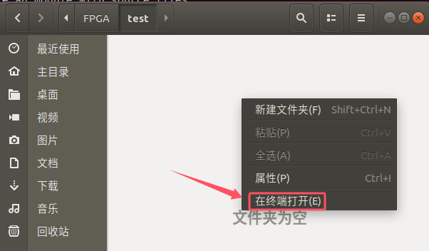

3-59

图

打开文件夹

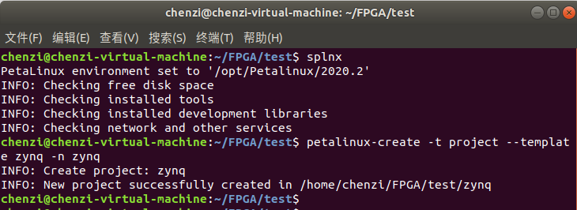

3-60

图

创建新工程

sdk

3-61

接下来，执行以下命令来构建

；构建完成后，参考图

所示，最后

Successfully built project

一行为“

”表明构建成功。

petalinux-build --sdk

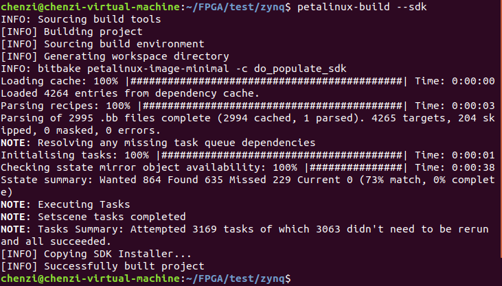

3-61

sdk

图

构建

店铺：

官方网站：

https://xiaomeige.taobao.com

www.corecourse.cn

技术博客：

技术群组：

http://www.cnblogs.com/xiaomeige/

---
*下一页*

小梅哥FPGA 团队    武汉芯路恒科技

专注于培养您的FPGA 独立开发能力   开发板 培训 项目研发三位一体

zynq

images/linux

sdk.sh

在刚创建的项目文件夹为

中，

目录下会生成

文件。

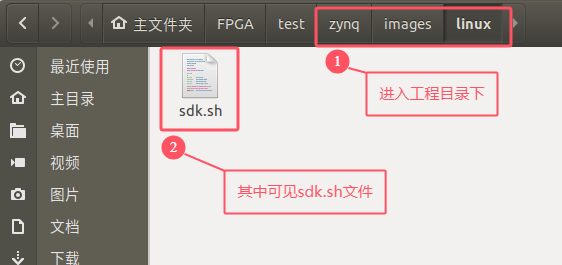

sdk

UG1144

“SDK Generation

如果对于

仍有疑问，可以参考官方的

文档中的

(Target Sysroot Generation)”

章节，里面有详细解答

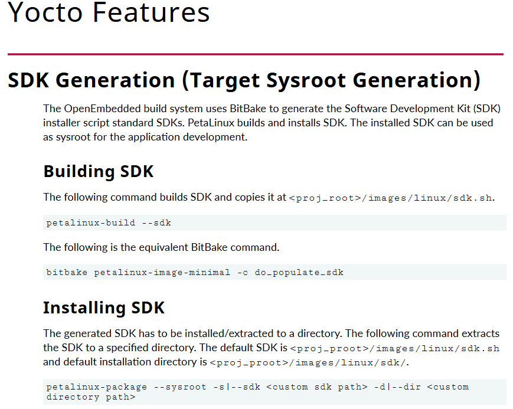

3-62 sdk.

图

生成

3.6.3

SDK

使用

SDK

安装完

后，如果需要编译内核、驱动、应用等，可以先在终端中执行

以下命令，设置交叉编译环境：

店铺：

官方网站：

https://xiaomeige.taobao.com

www.corecourse.cn

技术博客：

技术群组：

http://www.cnblogs.com/xiaomeige/

---
*下一页*

小梅哥FPGA 团队    武汉芯路恒科技

专注于培养您的FPGA 独立开发能力   开发板 培训 项目研发三位一体

source /opt/petalinux/

2020.2

/environment-setup-cortexa9t2hf-neon-

xilinx-linux-gnueabi

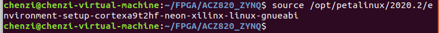

3-63

图

配置环境

arm-linux-gnueabi-gcc

${CC}

但在使用时，不能直接使用

，而应使用

环境变

arm-linux-gnueabi-gcc

量。直接使用

可能会导致编译错误，因为缺乏附加参数。

3-64

${CC}

如图

所示，打印

可见需要的参数。

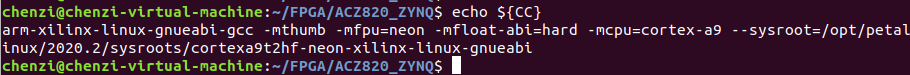

3-64

图

环境变量

uboot

在后续教程中，如果使用我们提供的编译脚本来编译内核、

、或设备

source

树时，则无需去执行

命令，因为这些环境设置已经集成在脚本中。

3.7

MobaXterm

软件安装使用

3.7.1

MobaXterm

软件安装

MobaXterm

ZYNQ

Linux

MobaXterm

软件将做为终端用于

进行

系统开发。

MobaXVT

X

Unix

(GNU/ Cygwin)

又名

，是一款增强型终端、

服务器和

命令集

工

具箱。

MobaXterm

X

X.Org

可以开启多个终端视窗，以最新的

服务器为基础的

，

Unix/Linux

GNU Unix

可以轻松地来试用

上的

命令。如此一来，我们可以不用

MobaXterm

安装虚拟机来试用虚拟环境，然后只要通过

就可以使用大多数的

linux

命令。

⚫

MobaXterm

主要功能：

⚫

SSH

X11

RDP

VNC

FTP

MOSH

支持各种连接

，

，

，

，

，

⚫

Unix

(bash

ls

cat

sed

grep

awk

rsync

)

支持

命令

，

，

，

，

，

，

，…

⚫

SSH

SFTP

连接

终端后支持

传输文件

⚫

(git/dig/aria2

)

各种丰富的插件

…

⚫

Windows

可运行

或软件

MobaXterm

"Home Edition"

,

官网提供

的免费开源版

下载

免费开源版又分便

店铺：

官方网站：

https://xiaomeige.taobao.com

www.corecourse.cn

技术博客：

技术群组：

http://www.cnblogs.com/xiaomeige/

---
*下一页*

小梅哥FPGA 团队    武汉芯路恒科技

专注于培养您的FPGA 独立开发能力   开发板 培训 项目研发三位一体

(

)

(

)

捷版

解压即用

和安装版

需要一步步安装

。下载链接：

https://mobaxterm.mobatek.net/download-home-edition.html

。读者也可以使用我们

AC820

ZYNQ

提供的安装包进行安装使用。安装包放在：

小梅哥

型

或安路

FPSoC

\05_

\ Linux

开发板资料

驱动和工具软件

。打开官网下载界面如

所示。

3-65

图

免安装版无需进行一步步的安装，解压后就可以使用。

3-65

图

官网下载界面

解压安装包后点击如

所示应用程序图标就可以进行使用，如

所

3-66

3-66

图

图

示。

3-66

图

点击图标

MobaXterm

3-67

打开

的主页面如图

所示。

店铺：

官方网站：

https://xiaomeige.taobao.com

www.corecourse.cn

技术博客：

技术群组：

http://www.cnblogs.com/xiaomeige/

---
*下一页*

小梅哥FPGA 团队    武汉芯路恒科技

专注于培养您的FPGA 独立开发能力   开发板 培训 项目研发三位一体

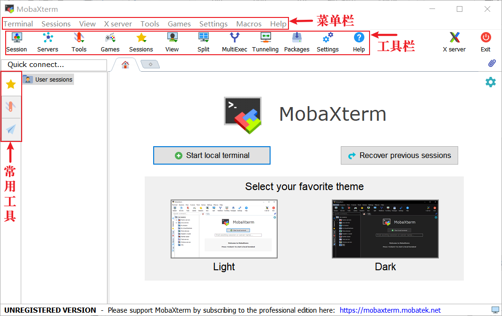

3-67  MobaXterm

图

的主页面

3.7.2

MobaXterm

使用

进行串口连接

MobaXterm

ZYNQ

(

type-c

)

打开终端软件

，连接

开发板串口

靠近电源侧

口

，

session

3-68

进行设置并建立起连接。选择“

”，如图

所示。

3-68

图

串口连接设置

Serial

115200

选择“

”串口连接，设置好连接端口号，波特率为：

。设置好

OK

3-69

之后点击“

”进行连接，如图

所示。

店铺：

官方网站：

https://xiaomeige.taobao.com

www.corecourse.cn

技术博客：

技术群组：

http://www.cnblogs.com/xiaomeige/

---
*下一页*

小梅哥FPGA 团队    武汉芯路恒科技

专注于培养您的FPGA 独立开发能力   开发板 培训 项目研发三位一体

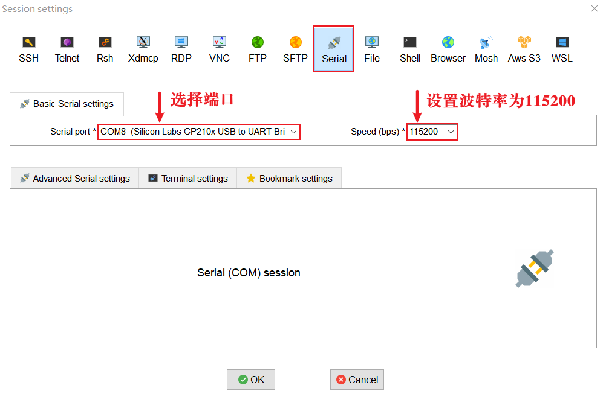

3-69

图

串口连接设置

User sessions”

点击“

下串口图标进行连接，连接完成后如

所示：

3-70

图

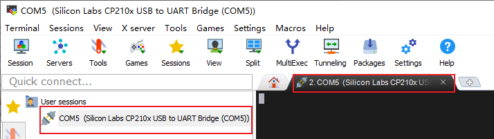

3-70

图

选择连接的串口

3-71

这里需要注意的一点是，同一个串口不能重复连接，否会提出现图

所

示的窗口，警告我们无法连接到串口。

店铺：

官方网站：

https://xiaomeige.taobao.com

www.corecourse.cn

技术博客：

技术群组：

http://www.cnblogs.com/xiaomeige/

---
*下一页*

小梅哥FPGA 团队    武汉芯路恒科技

专注于培养您的FPGA 独立开发能力   开发板 培训 项目研发三位一体

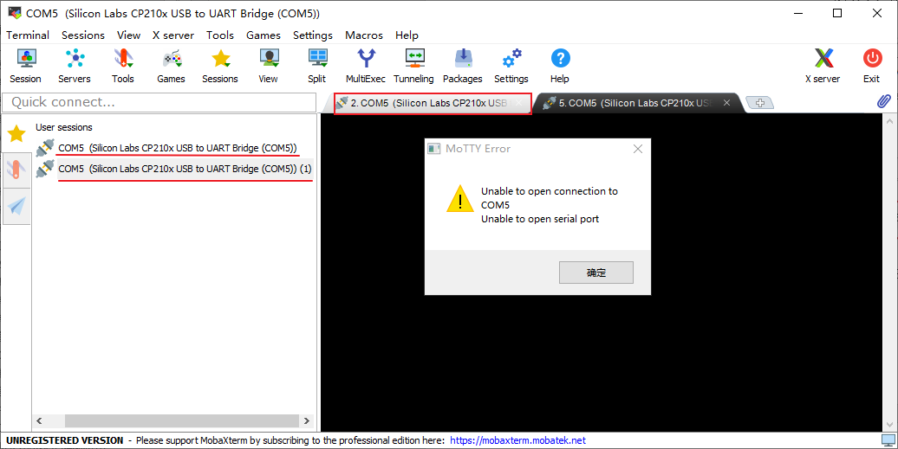

3-71

图

重复连接串口

AC820

注意：当完成

步骤便完成了串口的连接，如果用户是在进行

默

3-70

图

SSH

认系统的运行，不需要继续进行

的连接。

3.7.3

MobaXterm

SSH

使用

进行

连接

SSH

IP

在进行

连接之前，我们首先要确保电脑

设置正确，打开网络连接，

3-72

Internet

4

如图

所示，找到以太网，右键进入属性，双击

协议版本

，按图

3-73

IP

所示设置

地址。

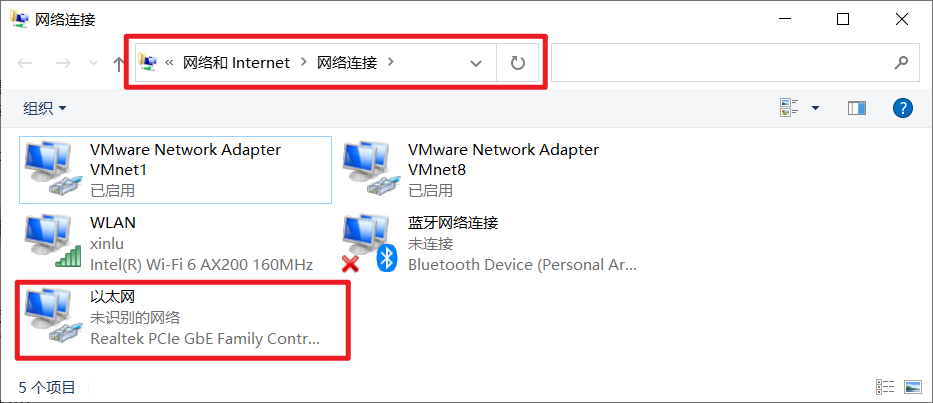

3-72

IP

图

配置网口

店铺：

官方网站：

https://xiaomeige.taobao.com

www.corecourse.cn

技术博客：

技术群组：

http://www.cnblogs.com/xiaomeige/

---
*下一页*

小梅哥FPGA 团队    武汉芯路恒科技

专注于培养您的FPGA 独立开发能力   开发板 培训 项目研发三位一体

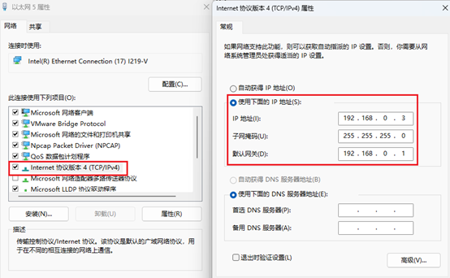

3-73

IP

图

配置网口

Zynq

linux

SSH

接下来连接好开发板电源和网线，

开发板板载的

里面开启了

MobaXterm

SSH

Session

服务，我们可以使用

的

连接到开发板。点击左上角的

SSH

IP

192.168.0.233

会话框，在弹出的窗口中选择

，在新的窗口输入开发板

（

）

22

3-74

和端口号（

），即可登陆开发板系统，如图

所示。

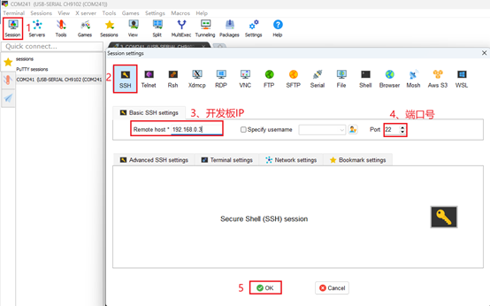

3-74

图

连接开发板

IP

OK

设置好

和端口号后点击“

”，连接到开发板。在显示窗口会显示

login as

root

“

：”，在这里需要输入用户名，默认的用户名为“

”，点击键盘

店铺：

官方网站：

https://xiaomeige.taobao.com

www.corecourse.cn

技术博客：

技术群组：

http://www.cnblogs.com/xiaomeige/

---
*下一页*

小梅哥FPGA 团队    武汉芯路恒科技

专注于培养您的FPGA 独立开发能力   开发板 培训 项目研发三位一体

Enter

root@192. 168.0.233's password:

上的“

”键执行下一步。此时窗口显示“

”

root

这里输入用户的登录密码，密码默认为“

”，输入密码时系统会对密码输入

Enter

进行保护，在输入密码时不会在窗口进行显示，读者输好密码后点击“

”

即可进入系统。进入系统后在左边窗口栏会显示开发板的文件信息，并询问是

Yes

3-75

否保存密码，点击“

”，

进入用户系统，如图

所示。

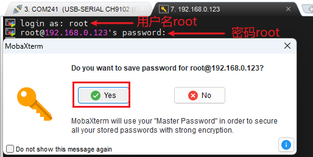

3-75

图

登录用户系统

3-76

SSH

进入用户系统，窗口如图

所示。由于

通过网线连接到开发板，现

在我们可以对开发板的网络功能进行测试。

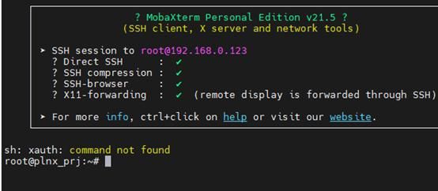

3-76

图

用户指令系统

输入下面的指令并执行。

ping 192.168.0.123

3-77

网络通信正常如图

所示。

店铺：

官方网站：

https://xiaomeige.taobao.com

www.corecourse.cn

技术博客：

技术群组：

http://www.cnblogs.com/xiaomeige/

---
*下一页*

小梅哥FPGA 团队    武汉芯路恒科技

专注于培养您的FPGA 独立开发能力   开发板 培训 项目研发三位一体

3-77

图

网络通信测试

WINDOWS

部分

系统版本由于安全考虑，当开启防火墙时，默认不允许外

ping

ping

ping

主机对其进行

功能，即别的电脑

不通本机。别的主机

不通本机是

ICMP

因为本机的防火墙关闭了

回显功能，可以暂时关闭公用网络防火墙再次

3-78

进行测试，如图

所示关闭公用网络防火墙。

3-78

图

关闭公共网络防火墙

win10

对于部分无法关闭防火墙的用户，可以参考该帖子：

《关于

开了防

ping

火墙无法

通的解决方案》

店铺：

官方网站：

https://xiaomeige.taobao.com

www.corecourse.cn

技术博客：

技术群组：

http://www.cnblogs.com/xiaomeige/

---
*下一页*

小梅哥FPGA 团队    武汉芯路恒科技

专注于培养您的FPGA 独立开发能力   开发板 培训 项目研发三位一体

3.8

Linux

JTAG cable

系统安装

驱动

jtag

linux

jtag

在嵌入式开发中，我们都是通过在线

进行调试的，

系统中，

jtag

jtag

驱动需要手动安装。安装

驱动之前，请不要将

下载器连接到电脑。

Ubuntu

petalinux

opt/petalinux/2020.2

在

系统中，进入到

安装目录（

），打

jtag

tools

开终端。

驱动程序存放于“

”目录下，因此，我们输入以下命令进入到

jtag

驱动程序所在位置：

cd tools/xsct/data/xicom/cable_drivers/lin64/install_script/install_drivers

jtag

进入该目录后输入如下命令，安装

驱动程序：

sudo ./install_drivers

3-79

输入指令后的结果如图

所示，可以看到提示我们已经成功安装

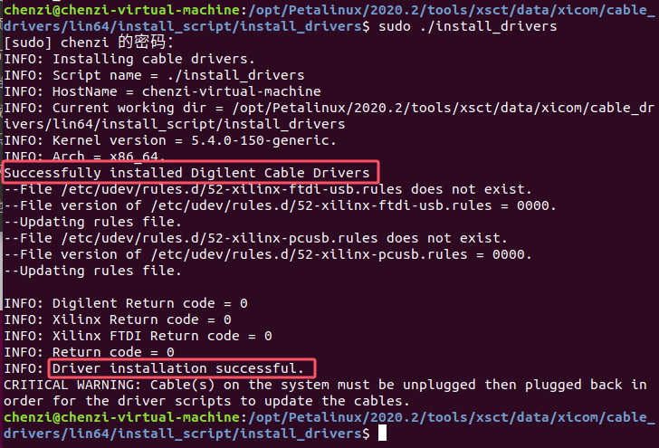

3-79

jtag

图

安装

驱动

:

最后一行警告提示我们

为了驱动程序脚本更新电缆，需要重新插拔。在遇

jtag

jtag

到

驱动问题时，可以使用以下语句删除

驱动。注意如无特需情况，请

不要执行下面的命令：

sudo rm -f /etc/udev/rules.d/52-xilinx-digilent-usb.rules

sudo rm -f /etc/udev/rules.d/52-xilinx-ftdi-usb.rules

sudo rm -f /etc/udev/rules.d/52-xilinx-pcusb.rules

店铺：

官方网站：

https://xiaomeige.taobao.com

www.corecourse.cn

技术博客：

技术群组：

http://www.cnblogs.com/xiaomeige/

---
*下一页*

小梅哥FPGA 团队    武汉芯路恒科技

专注于培养您的FPGA 独立开发能力   开发板 培训 项目研发三位一体

3.9

本章小结

ZYNQ

Linux

ZYNQ

Linux

本章我们搭建起

进行

开发的环境，在进行

的

开

Ubuntu

Windows

发的过程中需要频繁的进行

和

系统间的文件互传，需要我们搭

Petalinux

建起服务器，安装好文本编辑器，安装串口调试工具。本章我们也对

Linux

的安装进行演示，为后面进行嵌入式

开发做准备。

店铺：

官方网站：

https://xiaomeige.taobao.com

www.corecourse.cn

技术博客：

技术群组：

http://www.cnblogs.com/xiaomeige/

---
*下一页*

小梅哥FPGA 团队    武汉芯路恒科技

专注于培养您的FPGA 独立开发能力   开发板 培训 项目研发三位一体

ZYNQ

Linux

基于

的

开发流程快速体验

章节导读

在前面章节中，我们安装了虚拟机，并在虚拟机中安装了Ubuntu 系统，配

置好了开发环境，对Ubuntu 系统进行了了解学习。为了简化流程带领刚接触的

读者快速体验基于ZYNQ 的Linux 开发流程，使用了已经编写好的脚本和配置好

文件包，本次实验工程将带领大家了解ZYNQ 的Linux 开发流程，以搭建的ZYNQ

最简系统为硬件基础，快速体验基于ZYNQ 的Linux 系统开发。

本文分为两步：

1.

搭建硬件系统。

ZYNQ

Linux

硬件系统是

设计开发的基础，首先需要搭建一个供开发的硬件

ZYNQ

ZYNQ

平台。

的硬件系统功能丰富且复杂，要想完全运用

的硬件系统对

ZYNQ

ZYNQ

于刚开始接触

的读者来说还过于复杂。这里我先从

最简单的硬件

ZYNQ

ZYNQ

系统入手，这样不需要开启

过多的功能，可以逐步开始

的学习开

发。

2.

基于该硬件系统在ubuntu 移植linux 到AC820 开发板。

1)

Ubuntu 系统下搭建工程结构, 添加 Vivado 创建得到的 xsa 硬件描述

文件；

2)

修改设备树文件

3)

编译启动镜像

4)

编译Rootfs

5)

制作SD 启动卡

6)

SD

将文件拷贝到

卡

7)

启动开发板并测试

4-1

启动过程如图

所示。

店铺：

官方网站：

https://xiaomeige.taobao.com

www.corecourse.cn

技术博客：

技术群组：

http://www.cnblogs.com/xiaomeige/

---
*下一页*

小梅哥FPGA 团队    武汉芯路恒科技

专注于培养您的FPGA 独立开发能力   开发板 培训 项目研发三位一体

B oot R O M

L oad &  run FSB L

(zynq_fsbl.elf).

L oad bitstream

（.bit）

L oad D evice T ree

(devicetree.dtb)

L oad and run U -boot

(u-boot. elf)

L oad L inux K ernel

(zlm age、system .dtb)

L oad L inux R ootfs

(rootfs.tar.gz、rootfs.t

ar.bz2)

L oad R A M  D isk

( zlm age. gz、system -

top.dtb、system .bit、

B O O T .B IN )

R un L inux

K ernel

4-1

图

设计流程

PL

Load bitstream

.bit

本次设计不涉及

部分，所以这里没有“

”载入“

”文

件的步骤。

4.1

zynq

搭建最简

硬件系统

.xsa

接下来开始硬件的新建、配置，产生“

”的硬件描述文件将用于

Ubuntu

Linux

系统下的

开发设计。这一步我们的目的就是产生个性化配置的硬

Linux

件描述文件，拥有这个文件就可以进行接下来的

开发部分。这里我们在

Windows

Vivado

zynq

系统下利用

进行设计，搭建一个最简

硬件系统。当然读者

Ubuntu

Vivado

也可以尝试在

系统下安装

进行硬件描述文件的设计。

Vivado

Create Project

4-2

打开

，点击“

”，新建一个工程，如图

所示。

店铺：

官方网站：

https://xiaomeige.taobao.com

www.corecourse.cn

技术博客：

技术群组：

http://www.cnblogs.com/xiaomeige/

---
*下一页*

小梅哥FPGA 团队    武汉芯路恒科技

专注于培养您的FPGA 独立开发能力   开发板 培训 项目研发三位一体

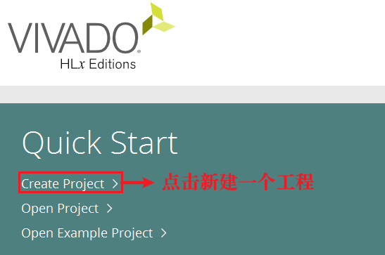

4-2

图

新建工程界面

在创建新工程向导界面，该向导将指导您完成新项目的创建。提示要创建

Vivado

Next

项目，需要设置项目文件的名称和位置等信息。点击“

”进入下步，

4-3

如图

所示。

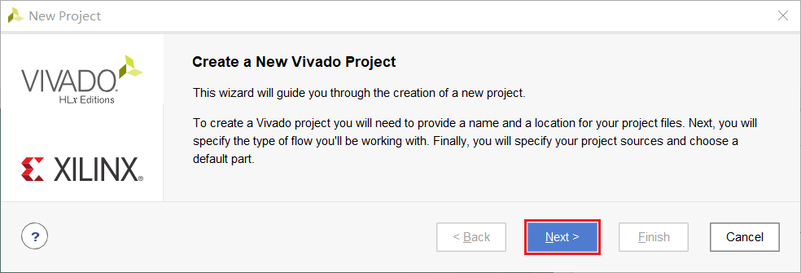

4-3

图

新建工程向导界面

在工程名设置页面，为创建的项目输入名称，并指定将存储项目数据文件

pc

Vivado

zynq

的目录。在

端的

搭建一个最简

硬件系统，本次工程命名为

zynq_linux

“

”，选择好工程路径。点击勾选创建项目目录，勾选后在选择的工

程路径下将会自动创建以工程名命名的工程文件夹，全部设置好之后点击

Next

4-4

“

”进入下一步，如图

所示。

店铺：

官方网站：

https://xiaomeige.taobao.com

www.corecourse.cn

技术博客：

技术群组：

http://www.cnblogs.com/xiaomeige/

---
*下一页*

小梅哥FPGA 团队    武汉芯路恒科技

专注于培养您的FPGA 独立开发能力   开发板 培训 项目研发三位一体

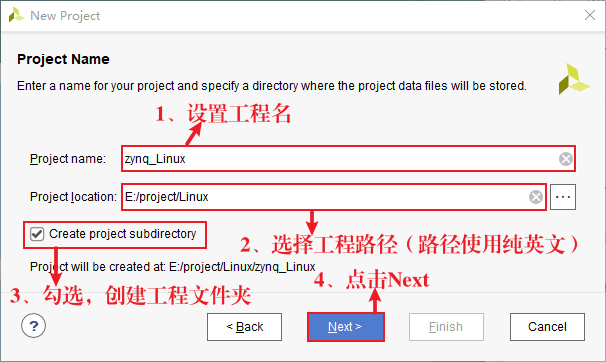

4-4

图

新建工程设置

RTL

进入项目类型选择界面，我们选择创建一个

工程，在不指定来源选项

Next

4-5

进行勾选，点击“

”进入下一步，如图

所示。

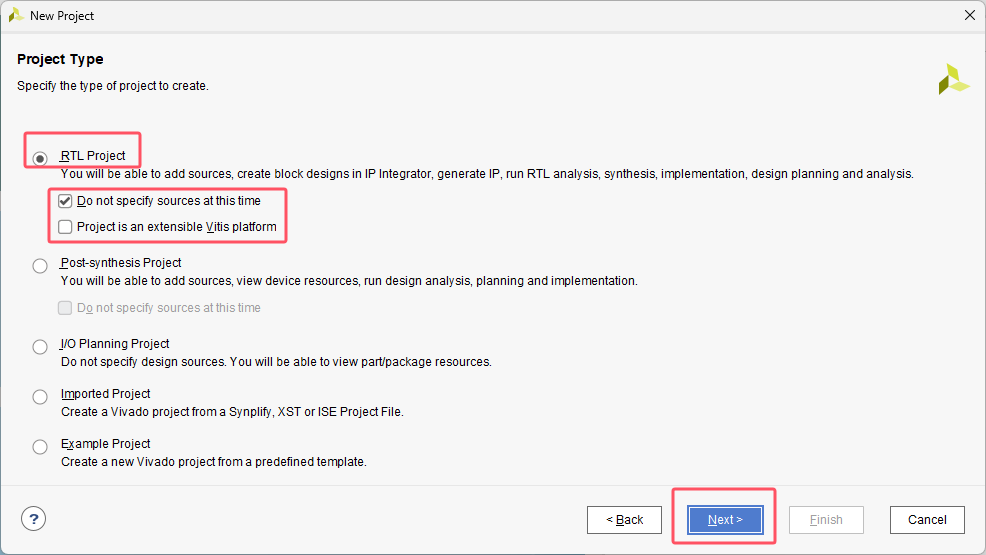

4-5

图

工程类型设置

AC820

xc7z020clg484-

下面进入器件型号选择界面，

开发板的器件型号为“

2

Package

clg484

Speed

-2

”。读者可以在“

”选项选择“

”，在“

”选项选择“

”

xc7z020clg484-2

进行筛选，在芯片型号界面就可以找到对应的“

”型号芯片，

“Search”

读者也可以在

选项直接输入需要使用的芯片型号进行查找，查找到芯片

Next

4-6

后点击选中，点击“

”进入下一步，如图

所示。

店铺：

官方网站：

https://xiaomeige.taobao.com

www.corecourse.cn

技术博客：

技术群组：

http://www.cnblogs.com/xiaomeige/

---
*下一页*

小梅哥FPGA 团队    武汉芯路恒科技

专注于培养您的FPGA 独立开发能力   开发板 培训 项目研发三位一体

4-6

图

器件选择

Finish

新建工程信息汇总页，查看要创建项目，点击

完成工程的创建，如

4-7

图

所示。

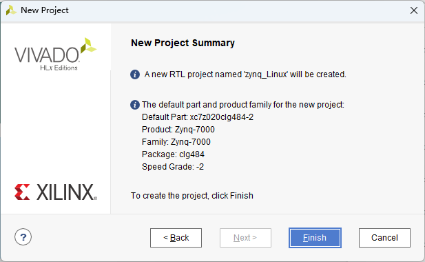

4-7

图

工程总览

4-8

进入编辑界面，如图

所示。

店铺：

官方网站：

https://xiaomeige.taobao.com

www.corecourse.cn

技术博客：

技术群组：

http://www.cnblogs.com/xiaomeige/

---
*下一页*

小梅哥FPGA 团队    武汉芯路恒科技

专注于培养您的FPGA 独立开发能力   开发板 培训 项目研发三位一体

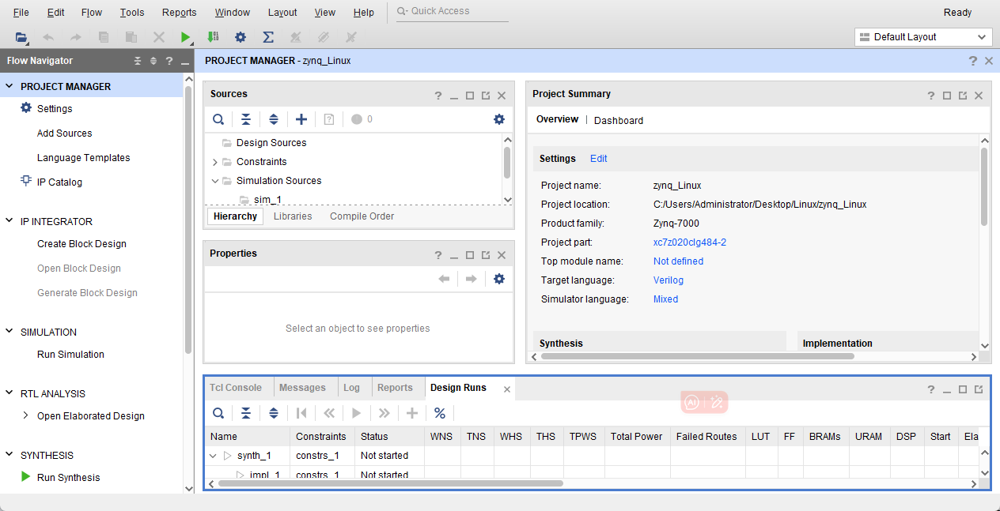

4-8

图

工程编辑界面

IP

“Createt Block Design”

在导航栏的

设计选项下选择创建一个块设计，点击

“Createt Block Design”

在弹出的

窗口指定块设计的名称。设计名称设置好后点击

OK

4-9

“

”，如图

所示。

4-9

图

创建块设计

+

IP

加载完成后可进入图解窗口，在图解窗口中点击“

”添加图标可以添加

4-10

块设计，如图

所示。

店铺：

官方网站：

https://xiaomeige.taobao.com

www.corecourse.cn

技术博客：

技术群组：

http://www.cnblogs.com/xiaomeige/

---
*下一页*

小梅哥FPGA 团队    武汉芯路恒科技

专注于培养您的FPGA 独立开发能力   开发板 培训 项目研发三位一体

4-10

IP

图

添加

块设计

zynq

ZYNQ7 Processing System

在搜索栏搜索

，双击选择筛选出的“

”，如

4-11

图

所示。

4-11

ZYNQ

图

添加

块

ZYNQ

等待加载完成，在窗口中显示我们添加的

系统模块，双击模块可进

ZYNQ

入

模块配置界面，如所示。

店铺：

官方网站：

https://xiaomeige.taobao.com

www.corecourse.cn

技术博客：

技术群组：

http://www.cnblogs.com/xiaomeige/

---
*下一页*

小梅哥FPGA 团队    武汉芯路恒科技

专注于培养您的FPGA 独立开发能力   开发板 培训 项目研发三位一体

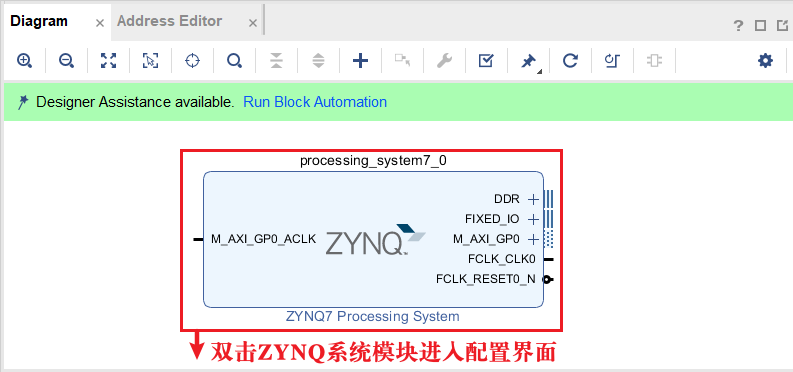

4-12

ZYNQ

图

进入

设置

ZYNQ

4-13

设置界面如图

所示，页面左侧是目录式导航，通过点击下拉进

zynq

行相应配置，右侧是

图形化导航图，通过点击对应的图形框可进入相应的

设置页面。

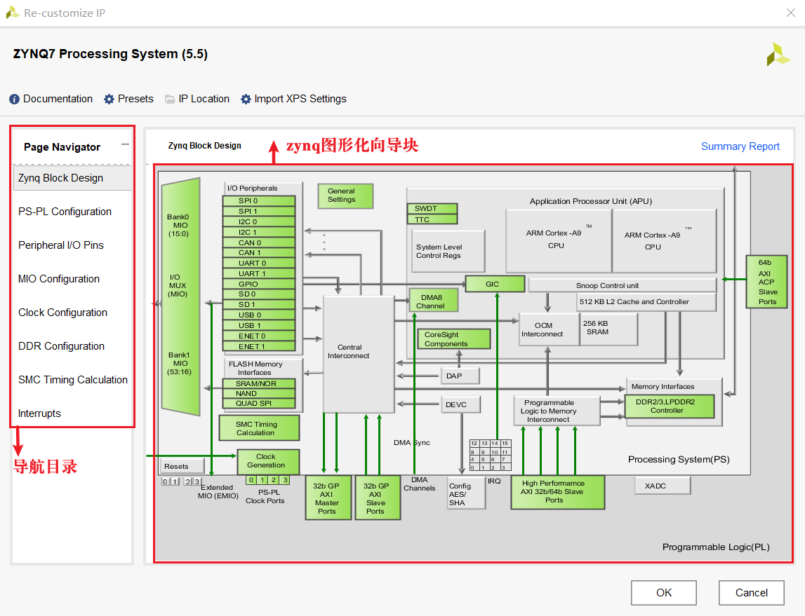

4-13

图

设置导航界面

MIO Confiuration

配置，进行对照配置。

店铺：

官方网站：

https://xiaomeige.taobao.com

www.corecourse.cn

技术博客：

技术群组：

http://www.cnblogs.com/xiaomeige/

---
*下一页*

小梅哥FPGA 团队    武汉芯路恒科技

专注于培养您的FPGA 独立开发能力   开发板 培训 项目研发三位一体

4-14  MIO

图

部分管脚信息

ZYNQ

进入

系统设置，在设置界面我们引出相对应的管脚信号就可以开启

ZYNQ

ZYNQ

对应的功能，比如我们需要进行以太网通信，那就需要在

系统模

块中引出对应以太网管脚，开启以太网通信功能。根据上述原理图配置管脚，

QSPI

QSPI

4-15

需要利用

进行下载，设置开启

功能，如图

所示。

店铺：

官方网站：

https://xiaomeige.taobao.com

www.corecourse.cn

技术博客：

技术群组：

http://www.cnblogs.com/xiaomeige/

---
*下一页*

小梅哥FPGA 团队    武汉芯路恒科技

专注于培养您的FPGA 独立开发能力   开发板 培训 项目研发三位一体

4-15  MIO

图

配置

SD0

UART1

GPIO_MIO

Bank1

分别使能

外设、

外设、

外设，并设置

的如图

4-16

所示。

店铺：

官方网站：

https://xiaomeige.taobao.com

www.corecourse.cn

技术博客：

技术群组：

http://www.cnblogs.com/xiaomeige/

---
*下一页*

小梅哥FPGA 团队    武汉芯路恒科技

专注于培养您的FPGA 独立开发能力   开发板 培训 项目研发三位一体

4-16  MIO

2

图

配置

DDR

Enable DDR”

DDR

DDR

进入

配置界面，选择勾选“

设置支持

，点击“

Controller Configuration

Auto Resize This

”选项。在目录栏右键点击设置“

Column

Memory Part

DDR

”可以显示设置栏所有信息。在“

”选项选择

芯片型

MT41K256M16 RE-125

4-17

号为“

”，设置过程如图

所示。

店铺：

官方网站：

https://xiaomeige.taobao.com

www.corecourse.cn

技术博客：

技术群组：

http://www.cnblogs.com/xiaomeige/

---
*下一页*

小梅哥FPGA 团队    武汉芯路恒科技

专注于培养您的FPGA 独立开发能力   开发板 培训 项目研发三位一体

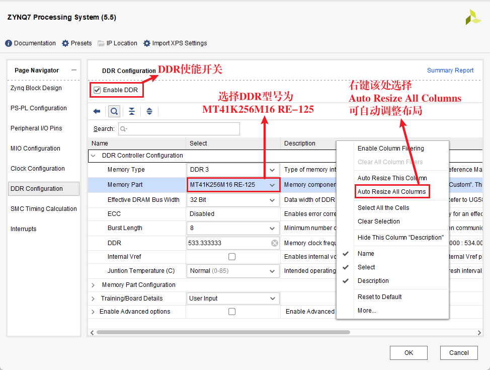

4-17  DDR

图

设置

ZYNQ

OK

到这里本次实验的

系统功能设置就全部完成了，点击“

”保存设

ZYNQ

置。回到图解窗口，可以看到设置后的

系统模块引出了我们设置的功能

+

4-18

引脚，点击引脚后“

”可以显示隐藏起来的引脚，如图

所示。

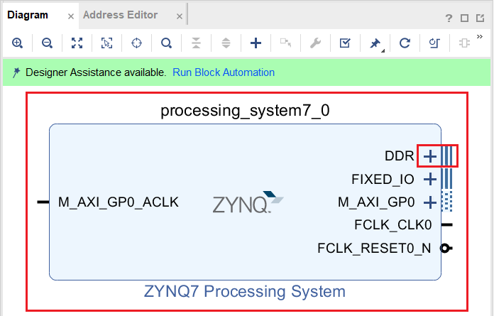

4-18  ZYNQ

图

块设计

店铺：

官方网站：

https://xiaomeige.taobao.com

www.corecourse.cn

技术博客：

技术群组：

http://www.cnblogs.com/xiaomeige/

---
*下一页*

小梅哥FPGA 团队    武汉芯路恒科技

专注于培养您的FPGA 独立开发能力   开发板 培训 项目研发三位一体

Run Block Automation

下面可以进行模块的自动运行连接，点击“

”进入设

4-19

Run Block Automation

置界面，如图

所示。在“

”设置窗口对设计的模块进

OK

Vivado

行全选，点击“

”，

将自动进行端口信号线的连接。

4-19

图

自动运行连接

ZYNQ

自动连接后可以观察到，

的端口信号线自动引出，按照本次实验要

FCLK_CLKO

M_AXI GPO_ACLK

4-20

求，连接“

”到“

”，如图

所示。

4-20

FCLK_CLKO

M_AXI GPO_ACLK

图

连接“

”到“

”

店铺：

官方网站：

https://xiaomeige.taobao.com

www.corecourse.cn

技术博客：

技术群组：

http://www.cnblogs.com/xiaomeige/

---
*下一页*

小梅哥FPGA 团队    武汉芯路恒科技

专注于培养您的FPGA 独立开发能力   开发板 培训 项目研发三位一体

Ctrl + S

运用快捷键“

”保存一下设置，接下来对设计的工程进行输出。鼠

system.bd

Generate

标右键点击设计源目录下的工程“

”，在弹出的界面选择“

Output Products…

4-21

”生成输出，如图

所示。

4-21

图

工程输出

Generate Output Products

进入“

”设置窗口对输出进行设置，在合成选项选

Out of context per IP

择勾选“

”，在运行设置选项选择最大运行线程，可以加快

Generate

4-22

运行加载速度。点击“

”生成硬件配置文件，如图

所示。

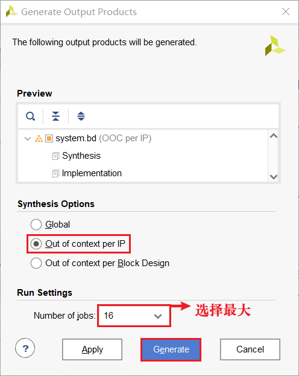

4-22

图

输出设置

店铺：

官方网站：

https://xiaomeige.taobao.com

www.corecourse.cn

技术博客：

技术群组：

http://www.cnblogs.com/xiaomeige/

---
*下一页*

小梅哥FPGA 团队    武汉芯路恒科技

专注于培养您的FPGA 独立开发能力   开发板 培训 项目研发三位一体

OK

4-23

等待加载完成，弹出窗口输出成功，点击“

”，如图

所示。

4-23

图

输出确认

system.bd

下面我们创建一个顶层文件方便对工程进行管理，右键点击“

”

Create HDL Wrapper

4-24

选择“

”来创建顶层文件，如图

所示。

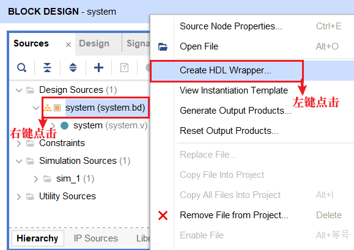

4-24

图

创建顶层

Create HDL Wrapper

Let Vivado manage wrapper and

在“

”设置选项中选择“

auto-update

Vivado

4-25

”让

自动对顶层文件进行管理更新，如图

所示。

店铺：

官方网站：

https://xiaomeige.taobao.com

www.corecourse.cn

技术博客：

技术群组：

http://www.cnblogs.com/xiaomeige/

---
*下一页*

小梅哥FPGA 团队    武汉芯路恒科技

专注于培养您的FPGA 独立开发能力   开发板 培训 项目研发三位一体

4-25

图

设置自动管理更新

system_wrapper

创建完成后读者可以在设计源窗口栏发现生成了一个“

”顶

4-26

层文件，如图

所示。

4-26

图

顶层文件

由于我们全部使用的是PS 侧的资源，所以不需要进行引脚约束，直接点击

Run Synthesis

，对设计进行综合，综合完成后点击Cancel。

店铺：

官方网站：

https://xiaomeige.taobao.com

www.corecourse.cn

技术博客：

技术群组：

http://www.cnblogs.com/xiaomeige/

---
*下一页*

小梅哥FPGA 团队    武汉芯路恒科技

专注于培养您的FPGA 独立开发能力   开发板 培训 项目研发三位一体

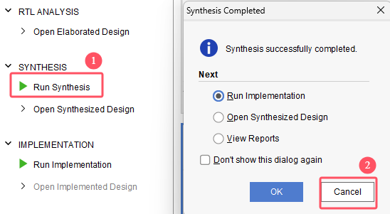

4-27 Run Synthesis

图

现在硬件部分就设计完成了，我们把设计的硬件进行导出。依次点击

File/Export/ Export Hardware”

4-28

“

，如图

所示。

4-28

图

导出硬件

Export Hardware

bit

在“

”设置界面，因为我们不需要

流文件，这里选择

Pre-synthesis

Next

4-29

，如果出现新的弹窗，继续选择

即可，设置如图

所示。

店铺：

官方网站：

https://xiaomeige.taobao.com

www.corecourse.cn

技术博客：

技术群组：

http://www.cnblogs.com/xiaomeige/

---
*下一页*

小梅哥FPGA 团队    武汉芯路恒科技

专注于培养您的FPGA 独立开发能力   开发板 培训 项目研发三位一体

4-29

图

导出硬件设置

“zynq_linux”

导出硬件后，可以在工程目录

文件夹下找到

“system_wrapper.xsa”

linux

文件，这个文件作为硬件平台会加载到后面的

开发当

4-30

中，文件及目录如图

所示。

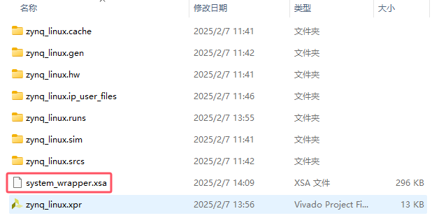

4-30

“system_wrapper.xsa”

图

生成

文件

4.2

linux

系统移植

Windows

Viovado

硬件系统的搭建我们在

系统下利用

搭建，在硬件系统搭

ubuntu

linux

zynq

建好以后，下面开始基于该硬件描述文件在

系统移植

到

开发

板。

4.2.1

构建基本文件结构

Ubuntu

FPGA

打开虚拟机，打开

系统，在用户目录下新建一个文件夹“

”

店铺：

官方网站：

https://xiaomeige.taobao.com

www.corecourse.cn

技术博客：

技术群组：

http://www.cnblogs.com/xiaomeige/

---
*下一页*

小梅哥FPGA 团队    武汉芯路恒科技

专注于培养您的FPGA 独立开发能力   开发板 培训 项目研发三位一体

ZYNQ

,

用于存放

工程

需要提醒的是该文件夹要放在用户目录，不能新建在根目

录下，否则工程会在建立的过程中会遇到权限问题，而且频繁的操作可能会对

系统造成影响。

AC820

ZYNQ

FPSoC

将下载的资料中的

小梅哥

型

或安路

开发板资料

\07_Linux

\ZYNQ7020\Linux

\Linux

\Linux

源码

文档教程所需工程

工程

工程包

路径

AC820_Zynq_Linux_Base.tar.gz

下的

复制该文件夹下，然后解压它。

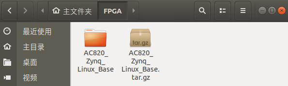

4-31

图

修改工程名

AC820_Zynq_Linux_Base

进入“

”，简单介绍一下里面的内容

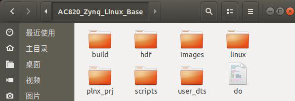

4-32

图

文件夹结构

build

dts

fsbl

“

”文件夹存放编译出来的

和

等文件

hdf

xsa

“

”文件夹存放

文件以及它加载出的其他文件

images

SD

“

”文件夹存放镜像文件和根文件系统等需要放入

卡的文件

linux

uboot

fsbl

“

”文件夹存放内核源码和

源码以及设备树和

官方包

plnx_prj

petalinux

“

”文件夹存放

工程

scripts

“

”文件夹存放一些操作用的脚本

user_dts

“

”文件夹存放用户的设备树文件

do

“

”文件是执行脚本，使用它来执行一些命令

4.1

Vivado

.sdk

接下来我们将

小节创建的

工程目录下的

文件夹中的

system_wrapper.xsa

xsa

xsa

文件放进

文件夹下，切记不要修改

文件名。

店铺：

官方网站：

https://xiaomeige.taobao.com

www.corecourse.cn

技术博客：

技术群组：

http://www.cnblogs.com/xiaomeige/

---
*下一页*

小梅哥FPGA 团队    武汉芯路恒科技

专注于培养您的FPGA 独立开发能力   开发板 培训 项目研发三位一体

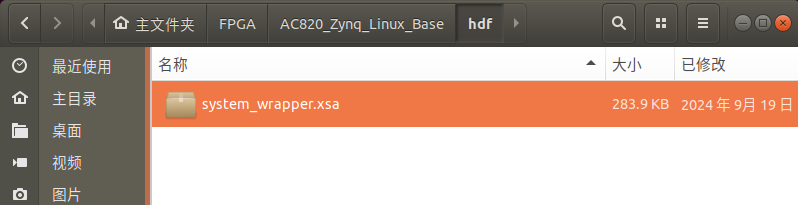

4-33

system_wrapper

图

复制

文件

AC820_Zynq_Linux_Base

在

工程目录下运行以下命令，注意这里黄色高亮

xsa

.xsa

xsa

的部分为

文件名（不带

后缀），根据实际的

文件名来填写。

./do load system_wrapper

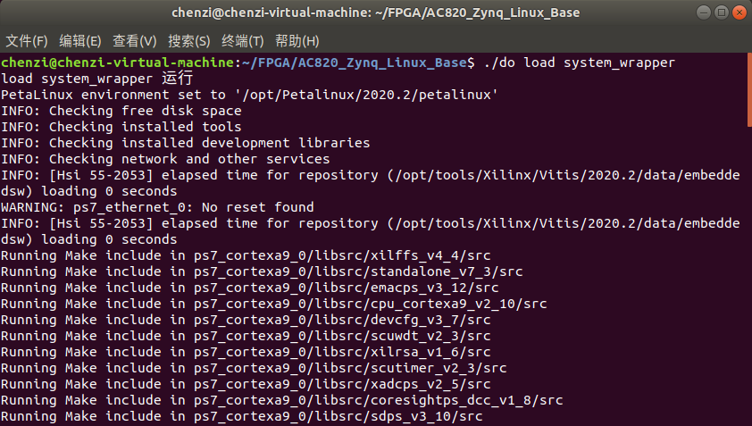

4-34

xsa

图

加载

文件

xsa

fsbl

脚本会加载

文件，生成匹配的设备树文件和

文件，将它们存放在

build

dts

kernel

uboot

文件夹下，将

文件复制到

和

源码的设备树文件夹中，而且

xsa

bit

images

system.bit

会解析出

文件里的

文件，将其复制到

文件夹并重命名为

。

4.1

PL

由于

小节搭建的是最小系统，不含

端，因此出现以下警告属于正常

情况。

店铺：

官方网站：

https://xiaomeige.taobao.com

www.corecourse.cn

技术博客：

技术群组：

http://www.cnblogs.com/xiaomeige/

---
*下一页*

小梅哥FPGA 团队    武汉芯路恒科技

专注于培养您的FPGA 独立开发能力   开发板 培训 项目研发三位一体

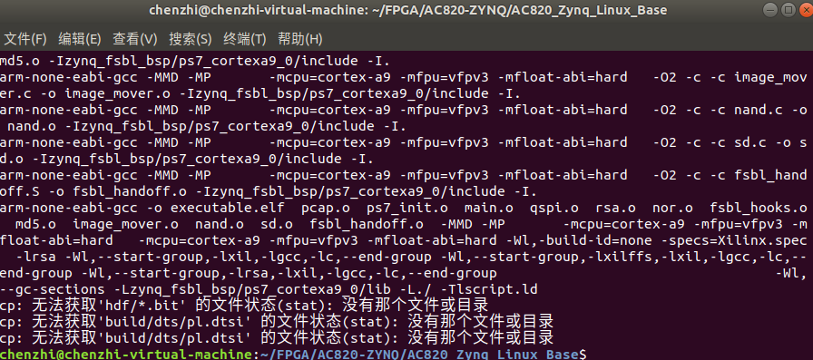

4-35

bit

pl

图

无法获取

和

文件

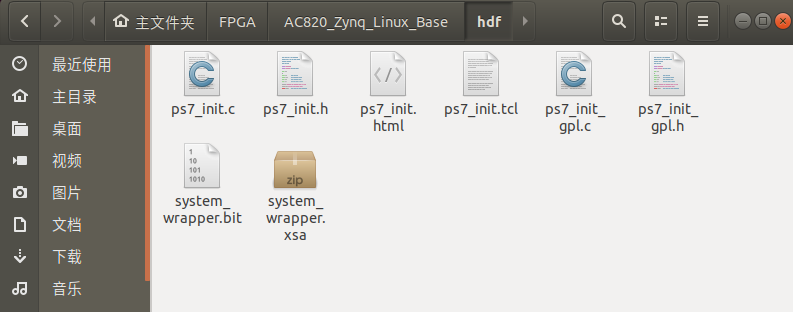

4-36

xsa

图

加载完成后的

文件夹

4.2.2

修改设备树文件

Device Tree

设备树（

）是一种有关硬件系统描述的数据结构，它可以描述

device tree

整个系统上挂载了多少种类的硬件。通过

系统上的硬件信息都可以

OS

linux

Kernel

传递给

（

）。如此便可以不用在

内放置大量的冗长的代码。这

FPGA

样的特性在硬件里面有

的情况下提供了很大的弹性与灵活性。

Vivado

FPGA

Device Tree

当

产生出

的设计后，可以使用产生的

的源文档

dts

PS

FPGA IP

（

）。它描述了有关

的外设还有选择使用到的

以及用户自定义

.dtb

.dts

Device Tree Compiler

的外设等信息。“

”文件是“

”文件被

编译后生成

Device Tree

Linux

的二进制格式的

描述，可被

内核解析。通常在我们为开发板

NAND

Sdcard

image

.dtb

制作

、

启动

时，会为“

”文件预留一个很小的存放区域

FAT

bootloader

kernel

.dtb

（

分区）。之后

在引导

的过程中，会先读取该“

”到

Device Tree

内存。更多关于

的介绍可以参考下面的

链接：

https://rocketboards.org/foswiki/Documentation/GSRDDeviceTreeGenerator

店铺：

官方网站：

https://xiaomeige.taobao.com

www.corecourse.cn

技术博客：

技术群组：

http://www.cnblogs.com/xiaomeige/

---
*下一页*

小梅哥FPGA 团队    武汉芯路恒科技

专注于培养您的FPGA 独立开发能力   开发板 培训 项目研发三位一体

下面开始修改设备树文件：

输入以下命令修改设备树文件

./do config dts

gedit

build

system-user.dtsi

该命令会使用

打开

文件夹下的

文件

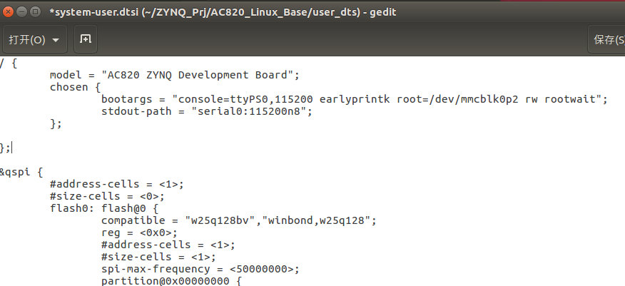

4-37  system-user.dtsi

图

文件

在第一行增加以下代码，添加引用的头文件。

#include "dt-bindings/gpio/gpio.h"

#include "dt-bindings/input/linux-event-codes.h"

led

key

在第六行后面新增以下代码，添加

和

设备。

leds {

compatible = "gpio-leds";

led0 {

label = "ps_led";

gpios = <&gpio0 7 GPIO_ACTIVE_HIGH>;

default-state = "on";

};

};

keys {

compatible = "gpio-keys";

autorepeat;

key0 {

label = "ps_key";

linux,code = <KEY_1>;

gpios = <&gpio0 47 GPIO_ACTIVE_LOW>;

debounce-interval = <15>;

};

};

新增后如下图所示：

店铺：

官方网站：

https://xiaomeige.taobao.com

www.corecourse.cn

技术博客：

技术群组：

http://www.cnblogs.com/xiaomeige/

---
*下一页*

小梅哥FPGA 团队    武汉芯路恒科技

专注于培养您的FPGA 独立开发能力   开发板 培训 项目研发三位一体

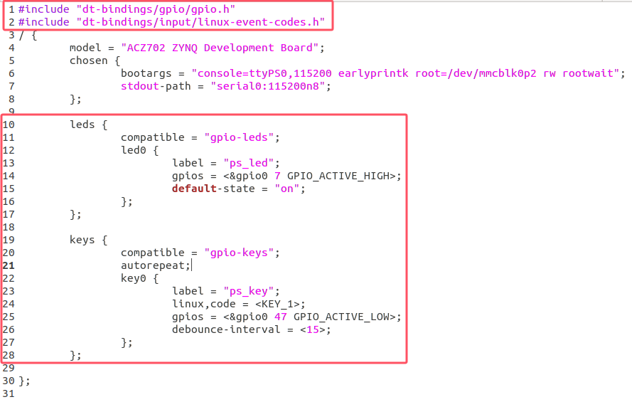

4-38

led

key

图

添加

和

设备

PS

在文件末尾添加如下代码，以配置

端的网口信息

&gem0 {

phy-handle = <&phy0>;

local-mac-address = [00 0a 35 00 1e 53];

phy0: phy@0 {

reg = <1>;

device_type = "ethernet-phy";

};

};

修改之后如下图所示：

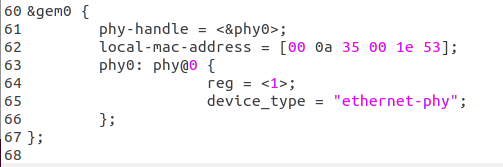

4-39

dtsi

图

修改后的

文件

gedit

dtsi

点击

窗口右上角的按键保存

文件，然后点击左上角的叉，关闭

gedit

窗口。

4.2.3

编译启动镜像

uboot

AC820_Zynq_Linux_Base

由于内核与

目前都无需修改，因此直接在

工

images

zImage

BOOT.BIN

程路径下输入以下命令，在

文件夹里生成

、

、

店铺：

官方网站：

https://xiaomeige.taobao.com

www.corecourse.cn

技术博客：

技术群组：

http://www.cnblogs.com/xiaomeige/

---
*下一页*

小梅哥FPGA 团队    武汉芯路恒科技

专注于培养您的FPGA 独立开发能力   开发板 培训 项目研发三位一体

system.dtb

文件

./do build images

4-40

图

编译启动镜像文件

ERROR

images

若编译过程中未出现任何

提醒，编译完成后，在

文件夹下

4

BOOT.BIN

zImage

system.dtb

有以下

个文件。其中

、

、

是本次生成的文件。

4-41  images

图

文件夹内容

4.2.4

Rootfs

编译

petalinux

rootfs

在终端输入命令使用

配置

./do config rootfs

注意：如果你的图像菜单并未出现，反而出现以下报错，说明当前命令行

UI

界面窗口太小，导致

菜单无法显示，用鼠标拖动窗口的边框把窗口放大，然

后再次运行以上命令即可解决报错。

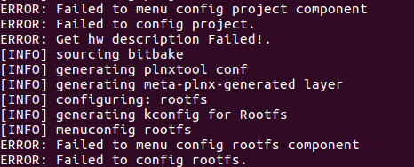

店铺：

官方网站：

https://xiaomeige.taobao.com

www.corecourse.cn

技术博客：

技术群组：

http://www.cnblogs.com/xiaomeige/

---
*下一页*

小梅哥FPGA 团队    武汉芯路恒科技

专注于培养您的FPGA 独立开发能力   开发板 培训 项目研发三位一体

4-42

图

命令行窗口过小引起报错

如果没有报错，则会正常进入配置菜单，这里会先进入工程配置界面，由

< Exit >

于暂时无需修改工程配置，所以使用键盘“→”键切换到

选项，然后按

Enter

Esc

下键盘的“

”键退出配置，或者直接双击“

”键退出配置。

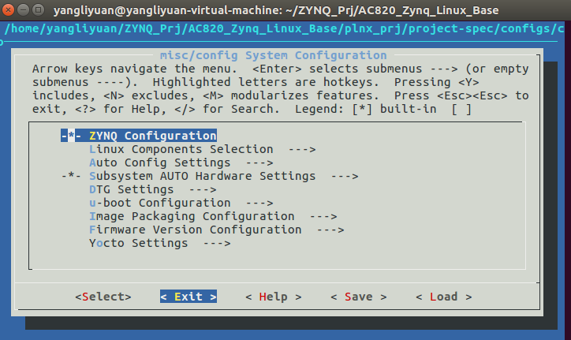

4-43

图

工程配置界面

Yes

出现以下选项询问是否保存配置，默认为“

”，这里直接按下键盘的

Enter

“

”键保存，如果这里不保存后面会报错。

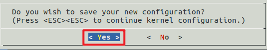

4-44

图

询问是否保存

rootfs

在等待一段时间后，会出现

配置界面，同样无需修改配置，按下键盘

< Exit >

Enter

rootfs

的“→”键切换到

选项，按下键盘的“

”按键退出

配置，或

Esc

者直接双击“

”键退出配置。

店铺：

官方网站：

https://xiaomeige.taobao.com

www.corecourse.cn

技术博客：

技术群组：

http://www.cnblogs.com/xiaomeige/

---
*下一页*

小梅哥FPGA 团队    武汉芯路恒科技

专注于培养您的FPGA 独立开发能力   开发板 培训 项目研发三位一体

4-45  rootfs

图

配置界面

rootfs

出现以下提示说明

配置成功

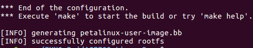

4-46  rootfs

图

配置成功

petalinux

rootfs

接下来输入以下命令使用

编译

./do build rootfs

这个需要编译几分钟，需要耐心等待。

WARNING

编译完成会有如下提示，这里的

无影响，官方的解释是直接忽

略即可。

店铺：

官方网站：

https://xiaomeige.taobao.com

www.corecourse.cn

技术博客：

技术群组：

http://www.cnblogs.com/xiaomeige/

---
*下一页*

小梅哥FPGA 团队    武汉芯路恒科技

专注于培养您的FPGA 独立开发能力   开发板 培训 项目研发三位一体

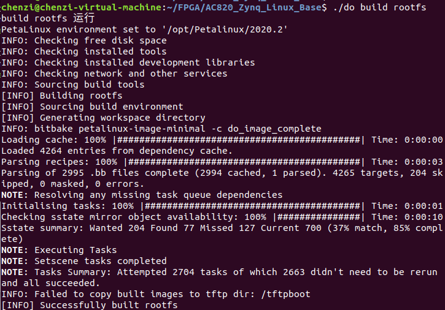

4-47  rootfs

图

编译成功

images

5

rootfs.tar.gz

此时在

文件夹下有如下

个文件，

即为刚刚生成的根文

件系统压缩包。

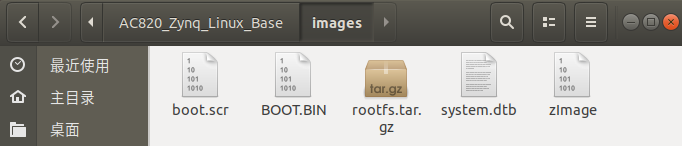

4-48

images

图

此时

文件夹中的内容

4.2.5

SD

制作

启动卡

SD

SD

拿出随开发板附赠的

卡和读卡器，将

卡插入读卡器，将读卡器插入

USB

Ubuntu 64

电脑的

口，在弹出的界面勾选“连接到虚拟机”，然后选择“

SD

位”，在以后点击“确定”，即可将

卡连接到虚拟机。

店铺：

官方网站：

https://xiaomeige.taobao.com

www.corecourse.cn

技术博客：

技术群组：

http://www.cnblogs.com/xiaomeige/

---
*下一页*

小梅哥FPGA 团队    武汉芯路恒科技

专注于培养您的FPGA 独立开发能力   开发板 培训 项目研发三位一体

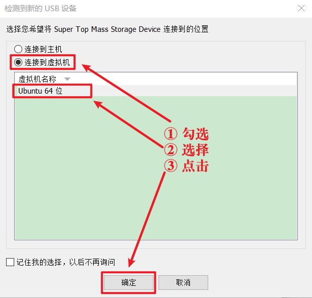

4-49

SD

Ubuntu

图

选择将

卡连接到

boot

rootfs

关闭连接后弹出的文件夹窗口，此时左边会有

和

图标，图标的

数目是一个或者两个都不影响。

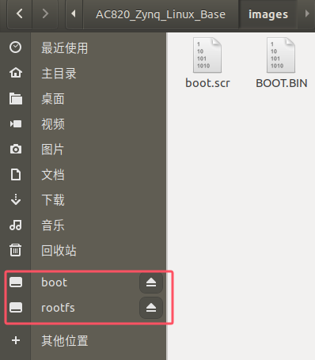

4-50

图

图标

SD

输入以下命令格式化

卡

./do format sdcard

后面会出现提示让你输入密码，输入的密码是不会显示的，直接输入账户

y

密码然后按下回车即可，询问是否继续的时候，输入“

”然后按下回车键。

店铺：

官方网站：

https://xiaomeige.taobao.com

www.corecourse.cn

技术博客：

技术群组：

http://www.cnblogs.com/xiaomeige/

---
*下一页*

小梅哥FPGA 团队    武汉芯路恒科技

专注于培养您的FPGA 独立开发能力   开发板 培训 项目研发三位一体

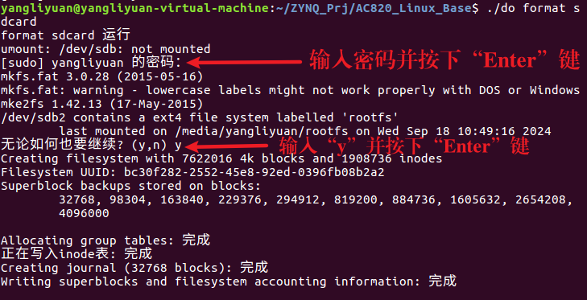

4-51

图

格式化信息

U

SD

格式化完成后，左边窗口必定出现两个“

盘图标”表示

卡的两个分区，

SD

boot

rootfs

boot

依次点击这两个图标即可打开

卡的两个分区“

”和“

”，“

”

rootfs

分区用来存放启动文件，“

”分区用来存放根文件系统。

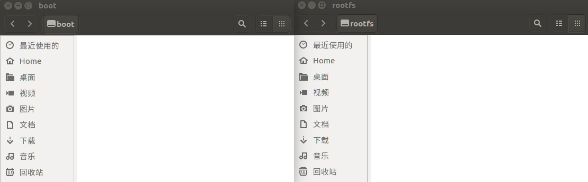

4-52

图

格式化后的两个分区

4.2.6

SD

将文件拷贝到

卡

BOOT.BIN

system.dtb

zImage

SD

boot

将

、

、

文件复制到

卡的“

”分区

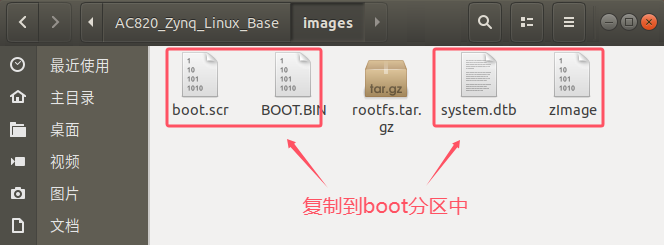

4-53

boot

图

拷贝文件到

分区

店铺：

官方网站：

https://xiaomeige.taobao.com

www.corecourse.cn

技术博客：

技术群组：

http://www.cnblogs.com/xiaomeige/

---
*下一页*

小梅哥FPGA 团队    武汉芯路恒科技

专注于培养您的FPGA 独立开发能力   开发板 培训 项目研发三位一体

images

rootfs.tar.gz

SD

rootfs

在

文件夹下使用解压命令将“

”解压到

卡的“

”

sync

SD

分区，等待解压完毕，最后输入“

”命令，等待系统将缓存的数据写入

卡。

sudo tar -zxvf rootfs.tar.gz -C /media/$USER/rootfs/

sync

SD

U

在系统将缓存写入

卡完成后，右键点击左边的“

盘”图标，选择“弹

出上级驱动器”来弹出读卡器。

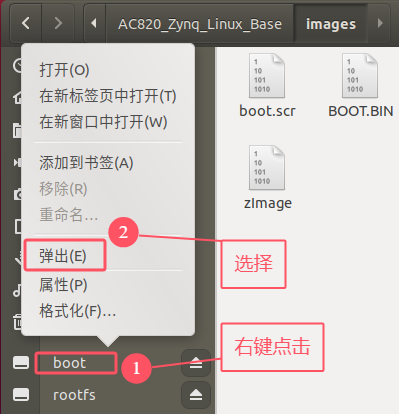

4-54

图

弹出驱动器

然后等待系统出现弹出成功的提示。

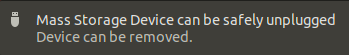

4-55

图

驱动器成功弹出

SD

Linux

拔出读卡器，取出

卡，至此，一张

系统启动卡就制作完成了。

Ubuntu

Ubuntu

接下来不再需要

系统，因此将

关机，点击上面的电源操作，

选择“关闭客户机”将系统关机。

店铺：

官方网站：

https://xiaomeige.taobao.com

www.corecourse.cn

技术博客：

技术群组：

http://www.cnblogs.com/xiaomeige/

---
*下一页*

小梅哥FPGA 团队    武汉芯路恒科技

专注于培养您的FPGA 独立开发能力   开发板 培训 项目研发三位一体

4-56

图

关闭客户机

4.2.7

启动开发板

SD

SD

将

卡插入开发板的

卡槽，根据手头的开发板型号设置启动模式为

SD

“

卡启动”，然后插上电源，启动开发板。

4-57  SD

图

卡启动模式

MobaXterm

ZYNQ

打开终端软件

，连接

开发板串口，进行设置建立起连接。

session

4-58

选择“

”，如图

所示。

4-58

MobaXterm

图

打开

Serial

115200

选择“

”串口连接，设置好连接端口号，波特率为：

。设置好

OK

4-59

之后点击“

”进行连接，如图

所示。

店铺：

官方网站：

https://xiaomeige.taobao.com

www.corecourse.cn

技术博客：

技术群组：

http://www.cnblogs.com/xiaomeige/

---
*下一页*

小梅哥FPGA 团队    武汉芯路恒科技

专注于培养您的FPGA 独立开发能力   开发板 培训 项目研发三位一体

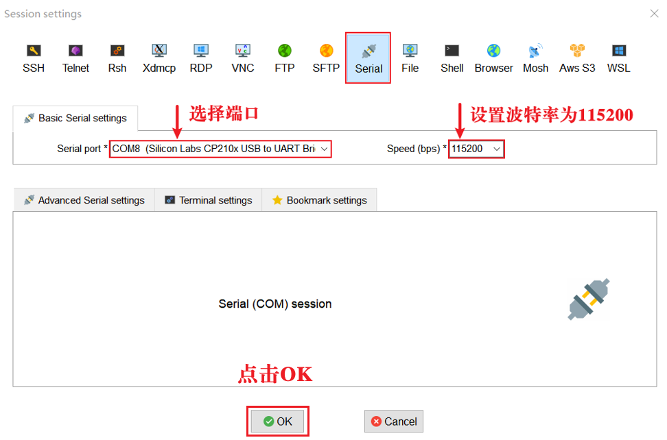

4-59

图

串口连接设置

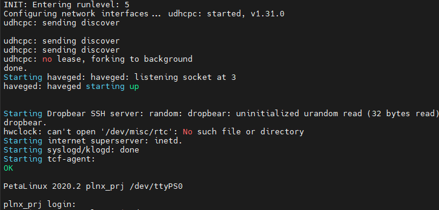

4-60

图

启动界面

root

其中，用户名和密码皆为

，输入即可登录。

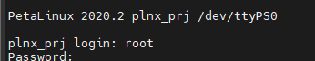

4-61

图

登录

plnx_prj

现在的主机名称为

，我们将其修改为AC820-ZYNQ；继续在终端中

输入“echo "AC820-ZYNQ" > /etc/hostname”，指令如下：

店铺：

官方网站：

https://xiaomeige.taobao.com

www.corecourse.cn

技术博客：

技术群组：

http://www.cnblogs.com/xiaomeige/

---
*下一页*

小梅哥FPGA 团队    武汉芯路恒科技

专注于培养您的FPGA 独立开发能力   开发板 培训 项目研发三位一体

echo "AC820-ZYNQ" > /etc/hostname

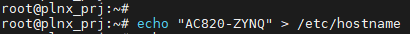

4-62

图

修改主机名

S3

Reset

输入指令之后，再次按下开发板右下角的

键，也就是“

”键，重启

uboot

AC820-ZYNQ

，大家就可以看到用户名称就改为了

了。

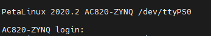

4-63

图

用户名修改

4.3

本章小结

ZYNQ

Linux

通过本章节的内容我们快速体验了利用

进行嵌入式

开发的流

ZYNQ

ZYNQ

程。我们从搭建最简

硬件系统开始，对

的硬件进行最简配置，读

linux

者在设计进行中需要对设计流程有一个整体的认识，熟悉了解

系统移植的

Linux

一般配置步骤。下一章节，我们来使用移植好的

系统，测试几个基础外

设功能。

店铺：

官方网站：

https://xiaomeige.taobao.com

www.corecourse.cn

技术博客：

技术群组：

http://www.cnblogs.com/xiaomeige/

---
*下一页*

小梅哥FPGA 团队    武汉芯路恒科技

专注于培养您的FPGA 独立开发能力   开发板 培训 项目研发三位一体

Linux

基础外设在

系统下的使用

章节导读

在“基于ZYNQ 的Linux 开发流程设计”章节我们从硬件配置开始，定制了

AC820 开发板的 Linux 系统。本章我们利用定制的 Linux 系统学习如何控制开

发板上的基础外设， 如 LED、按键 等。这些外设都可以在终端通过 Shell 来

控制，接下来运用Shell 指令对本次实验中涉及的外设进行控制，包括网口网

络连接，按键功能测试，LED 的控制。

5.1

网络连接测试

AC820-ZYNQ login

进入系统后，需要在“

”栏登录，系统默认的用户名为

root

root

,

5-1

“

”，默认的登录密码为“

”

如图

所示。

5-1

图

用户登录

/

/

/

/

在进行以太网连接前需要在“网络连接

更改适配器选项

以太网

属性

Internet

4 (TCP/IPv4)

5-2

协议版本

”进行设置，如图

所示。

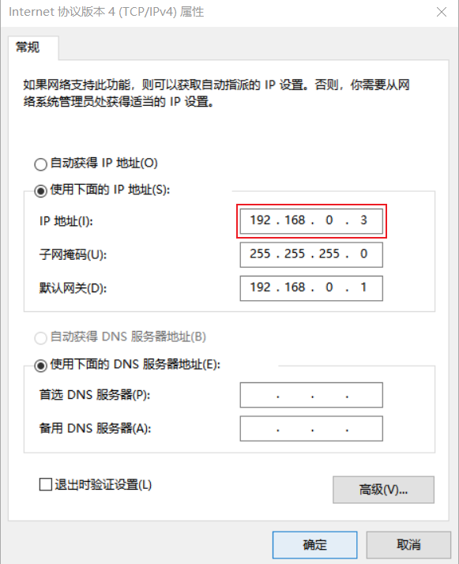

5-2  IP

图

地址设置

店铺：

官方网站：

https://xiaomeige.taobao.com

www.corecourse.cn

技术博客：

技术群组：

http://www.cnblogs.com/xiaomeige/

---
*下一页*

小梅哥FPGA 团队    武汉芯路恒科技

专注于培养您的FPGA 独立开发能力   开发板 培训 项目研发三位一体

IP

192.168.0.3

地址设置为“

”，在进行网络连接时，系统防火墙会干扰连

5-3

接，为了保证系统网络的正确连接，可以暂时关闭网络防火墙，如图

所示。

5-3

图

关闭网络防火墙

ifconfig

IP

ping

运用网络设备配置命令“

”配置网卡的

地址，接着运用“

”

指令，来检测网络的连通情况和分析网络速度，指令如下：

ifconfig eth0 192.168.0.123

ping 192.168.0.3

5-4

指令执行如图

所示。

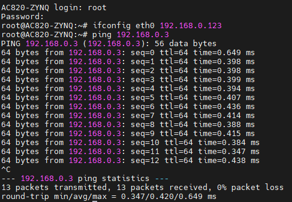

5-4

图

网络连接测试

店铺：

官方网站：

https://xiaomeige.taobao.com

www.corecourse.cn

技术博客：

技术群组：

http://www.cnblogs.com/xiaomeige/

---
*下一页*

小梅哥FPGA 团队    武汉芯路恒科技

专注于培养您的FPGA 独立开发能力   开发板 培训 项目研发三位一体

显示的信息如下：

⚫

bytes 值：数据包大小，包含多少个字节。

⚫

time 值：响应时间，这个时间越小，说明你连接这个地址速度越快。

⚫

TTL（Time To Live）值：表示DNS 记录在DNS 服务器上存在的时间，

它是IP 协议包的一个值，告诉路由器该数据包何时需要被丢弃。

Ctrl+c

192.168.0.3

ping

键盘输入“

”退出本次检测。在“

”本次

的统计信息

中你可以看到以下信息：

⚫

数据包信息：己发送=6，已接收=6，丢失=0(0%丢失率)。

⚫

往返时问(以毫秒为单位):最短=1.053ms,平均=1.268ms,最长=

2.136ms。

通过以上信息可以了解到我们的网络连通并且连接正常。

5.2

按键功能测试

要对按键功能进行测试，输入如下指令：

hexdump /dev/input/event0

ZYNQ

S2

然后按

开发板上对应按键

（只开启了一个按键），每按一次按键

Ctrl+c

5-5

都会在终端打印返回信息，“

”退出本次检测，如图

所示。

5-5

图

按键功能测试

5.3

GPIO

LED

的

测试

Linux

leds

系统中在串口终端中输入如下命令进入到文件系统的“

”处：

cd /sys/class/leds

leds

ZYNQ

PS

LED

对“

”目录进行查看，可以看到对应的在

的

端上的

店铺：

官方网站：

https://xiaomeige.taobao.com

www.corecourse.cn

技术博客：

技术群组：

http://www.cnblogs.com/xiaomeige/

---
*下一页*

小梅哥FPGA 团队    武汉芯路恒科技

专注于培养您的FPGA 独立开发能力   开发板 培训 项目研发三位一体

ps_led

ps_led

“

”目录。进入“

”目录，可以看到目录下包括多个文件，其中

brightness

LED

“

”用于控制

灯的亮灭，

echo 0 > brightness

echo 1 > brightness

trigger

LED

LED

“

”

可以选择触发方式。输入指令设置

为心跳模式，

灯的

LED

亮灭情况如心跳一样闪烁，设置为时钟模式，

则会每秒闪烁一次，指令如

下：

echo heartbeat > trigger

echo timer > trigger

5-6

测试过程如图

所示。

5-6  GPIO_LED

图

测试

5.4

本章小结

ZYNQ

Linux

本章内容基于“基于

的

开发流程设计”建立的系统通过手把

ZYNQ

手的形式带领读者快速体验

外设的启动与配置。

店铺：

官方网站：

https://xiaomeige.taobao.com

www.corecourse.cn

技术博客：

技术群组：

http://www.cnblogs.com/xiaomeige/

---
*下一页*

小梅哥FPGA 团队    武汉芯路恒科技

专注于培养您的FPGA 独立开发能力   开发板 培训 项目研发三位一体

ZYNQ

的启动与配置过程介绍

章节导读

ZYNQ 从开机上电到操作系统启动需要一个引导的过程，ZYNQ

是一个可扩展

处理平台，可以看成一个有

FPGA

外设的

A9

核处理器。

ZYNQ 的PL 和PS 的配置

都可以认为是电脑主机通过 JTAG 完成的。但是，在实际中，ZYNQ 开发板不可

能实时与电脑连接，当 JTAG 不起作用时，ZYNQ 芯片则需要采取其它的方式实

现对自己的配置。

6.1

ZYNQ

的启动流程

ZYNQ

ARM

ZYNQ

PL

的启动流程也和

处理器类似，

是不支持从

端进行直

PS

接启动配置的，一定要通过

部分来完成。它支持从多种设备启动，包括

JTAG

NAND

parallel NOR

Serial NOR (Quad-SPI)

SD

，

，

，

，以及

卡。通过几个特

MIO

ZYNQ

殊的

引脚的状态来确定启动设备。这里对

两种启动模式进行介绍：

JTAG

①

从

被动启动

JTAG

bit

elf

Run As

通过

先下载

流文件，再下载

文件，之后点击

来运行的

JTAG

TCL

PS

JTAG

程序。

的方法是通过

脚本来初始化

，然后用

收发信息，可

JTAG

PS

用于在线调试。但是通过

的方法初始化

只要一断电，程序就丢失了。

Vivado

Zynq

PL

打开

软件，然后实现

可编程逻辑硬件部分

的设置后，把硬件部

SDK

ARM

PS

署导出，再打开

进行

核的软件部分

编程设计，最后再将硬件比特

.bit

.elf

Zynq

流文件（

）和软件的可执行链接文件（

）下载到

开发板中，这样就

可以对自己的软硬件设计进行调试和验证。

BootROM

从

主动启动

②

SD

SD

通过制作镜像文件，将镜像文件拷贝到

卡，然后将启动模式设置为

SD

启动，那么每次断电之后程序都会自动从

启动，程序固化，而不会掉电丢

失。

ZYNQ

arm

3

启动的过程和大多数

启动过程一样，这个启动过程也分为

个

6-1

阶段，如图

所示。

店铺：

官方网站：

https://xiaomeige.taobao.com

www.corecourse.cn

技术博客：

技术群组：

http://www.cnblogs.com/xiaomeige/

---
*下一页*

小梅哥FPGA 团队    武汉芯路恒科技

专注于培养您的FPGA 独立开发能力   开发板 培训 项目研发三位一体

Stage 0

B ootR O M  Executes

Success

L ockdow n

L ockdow n

E rror C ode G enerated

Stage 1

FSB L /U ser C ode

Stage 2

O perating System

6-1

图

启动过程

Stage 0

BootROM

：

阶段

Stage 1

FSBL

First Stage Boot loader

：

（

）阶段

Stage 2

SSBL

Second Stage Boot loader

：

（

）阶段

0

1

2

这三个阶段分别称之为阶段

、阶段

和阶段

。

(1)

0

阶段

：

BootROM

ZYNQ

rom(Read-Only Memory)

即常见的

过程，

芯片里有个

里面

ZYNQ

固化了一段不可修改的程序，只要

一上电，这段程序就会执行，它将对

ZYNQ

NAND

NOR

SD

SD

的

、

、

等基本外设控制器进行初始化。把

卡这类非易

ZYNQ

OCM

On-

失的存储器件初始化好了之后，就会把其中的程序拷贝到

的

（

chip memory

RAM

），那么这个被拷贝到片上

执行的程序就是我们要制作的文

——BOOT.bin

ROM

BootROM

件

。因为是只读的，所以根据

的性质，

中的程序

是无法修改的。

BootROM

ZYNQ

而

最重要的作用就是读取

的启动引脚配置情况，决定从

1

BootROM

何种介质中加载阶段

需要使用的启动镜像。当然在加载之前，

会先

SD

NAND

NOR

QSPI Flash

ARM

完成对

卡，

，

，

等的初始化，从而使得

核能够

BootROM

成功访问并使用这些外设。

在完成以上任务的同时，也会对安全模式

等运行模式进行配置

(2)

1

阶段

：

BOOT.bin

OCM

BOOT.bin

加载到

上就开始执行了，之前说过

其实就是由

FSBL.elf+.bit+.elf

1

PS

PS

“

”构成。而阶段

要做的就是：首先配置

部分，

完成

PL

2

初始化后，会去配置

部分，最后还可以去加载阶段

的代码。

(3)

2

阶段

：

店铺：

官方网站：

https://xiaomeige.taobao.com

www.corecourse.cn

技术博客：

技术群组：

http://www.cnblogs.com/xiaomeige/

---
*下一页*

小梅哥FPGA 团队    武汉芯路恒科技

专注于培养您的FPGA 独立开发能力   开发板 培训 项目研发三位一体

Linux

CPU

这一阶段是可选的，主要是为了完成

系统启动过程。当

上电时，

bootloader

CPU,

操作系统并不在内存中，需要一个叫

的程序初始化

也就是

ZYNQ

SSBL

ZYNQ

Linux

平台的

（第二阶段引导程序）。对于运行在

平台的

系

u-boot

SSBL

统而言，

就是

。

6.2

linux

启动

4

从软件层面共有

个部分：

(1)

引导程序

(firmware)

boot

(

)

BootLoader

包括固化在固件

中的

代码

可选

，和

两大部分，

FSBL

u-boot

u-boot

linux

把

引导到内存中。

将为

内核初始化内存和必要的外设，

ZYNQ

u-

设置好启动参数。由于

平台采用设备树来传递驱动部分的参数，所以

boot

u-boot

linux

还将拷贝设备树到内存当中。而后

将控制权交给

内核。

u-boot

XILINX

zedboard

是

厂家已经为

用户移植好，用户可直接从官网下

u-boot

Ubuntu

载。下载后

压缩文件在

下解压，执行配置和编译两条指令后，可

u-boot

u-boot.elf

生成

文件，将其改名为

(2)

linux

内核

特定于嵌入式板子的定制内核以及内核的启动参数。内核是一个操作系统

的核心，他负责管理系统的任务调度、内存分配、进度管理、设备驱动程序、

文件系统和网络系统等，决定系统的性能和稳定性。

内核拥有控制权之后，将进行初始化，建立起内核的运行环境，内核在完

成虚拟地址到物理地址的映射后，再驱动设备的初始化与挂载。

(3)

文件系统

文件系统对一个存储设备上的数据和元数据进行组织的机制，文件系统包

括文件中的数据还有文件系统的结构。

(4)

应用程序

应用程序存放在文件系统中。特定于用户的应用程序。有时在用户应用程

GUI

序和内核层之间可能还会包括一个嵌入式图形用户界面。常用的嵌入式

有：

MicroWindows

MiniGUI,QT

GTK

和

、

。

店铺：

官方网站：

https://xiaomeige.taobao.com

www.corecourse.cn

技术博客：

技术群组：

http://www.cnblogs.com/xiaomeige/

---
*下一页*

小梅哥FPGA 团队    武汉芯路恒科技

专注于培养您的FPGA 独立开发能力   开发板 培训 项目研发三位一体

6.3

本章小结

ZYNQ

ZYNQ

本章对

的启动与配置过程进行了介绍，

的启动过程中的文件

ZYNQ

Linux

配置在“基于

的

开发流程设计”章节有所体现，读者可以对照进

行理解。

店铺：

官方网站：

https://xiaomeige.taobao.com

www.corecourse.cn

技术博客：

技术群组：

http://www.cnblogs.com/xiaomeige/

---
*下一页*

小梅哥FPGA 团队    武汉芯路恒科技

专注于培养您的FPGA 独立开发能力   开发板 培训 项目研发三位一体

uboot

概述

7.1

bootloader

Bootloader

是在操作系统运行之前执行的一段小程序。而这段小程序的最终

目的，是为了正确地设置好软硬件环境，使之能够成功地引导操作系统，最后

Linux

启动

内核。

bootloader

的核心功能就是引导操作系统，部分工作如下

⚫

初始化部分硬件，包括时钟、内存等等

⚫

加载内核到内存上

⚫

加载文件系统、atags 或者dtb 到内存上

⚫

根据操作系统启动要求正确配置好一些硬件

⚫

启动操作系统

7.2

uboot

bootloader

bootloader

属于

的一种，也是最常见的

，用来引导启动内核的。

flash

它的最终目的就是，从

中读出内核，放到内存中，启动内核。开源的特点

ARM

MIPS

monitor

flash

使其常用于

、

等平台。支持

功能。由于需要从

中读取

UBOOT

flash

内核，要求

需要具有读写

的能力。

uboot

flash

刚开始被放到

中，板子上电后，会自动把其中的一部分代码拷

uboot

uboot

到内存中执行，这部分代码负责把剩余的

代码拷到内存中，然后

代

kernel

码再把

部分代码也拷到内存中，并且启动，内核启动后，挂着根文件系

统，执行应用程序。

7.2.1

自身可开机直接启动

(1)

一般的SoC 都支持多种启动方式，譬如SD 卡启动、NorFlash 启动、

NandFlash 启动等。uboot 要能够开机启动，必须根据具体的SoC 的启

动设计来设计uboot。

(2)

uboot 必须进行和硬件相对应的代码级别的更改和移植，才能够保证可

以从相应的启动介质启动。uboot 中第一阶段的start.S 文件中具体处

理了这一块。

店铺：

官方网站：

https://xiaomeige.taobao.com

www.corecourse.cn

技术博客：

技术群组：

http://www.cnblogs.com/xiaomeige/

---
*下一页*

小梅哥FPGA 团队    武汉芯路恒科技

专注于培养您的FPGA 独立开发能力   开发板 培训 项目研发三位一体

7.2.2

引导内核启动并给内核传参

(1)uboot 的终极目标就是启动内核。

(2)linux 内核在设计的时候，设计为可以被传参。也就是说我们可以在

uboot 中事先给linux 内核准备一些启动参数放在内存中特定位置然后

传给内核，内核启动后会到这个特定位置去取uboot 传给他的参数，然

后在内核中解析这些参数，这些参数将被用来指导linux 内核的启动过

程。

7.2.3

能提供系统部署功能

(1)uboot

(

uboot

kernel

rootfs

必须能够被人借助而完成整个系统

包括

、

、

等的

)

Flash

镜像

在

上的烧录下载工作。

(2)

(ARM

)

uboot

fastboot

裸机教程中刷机

裸机第三部分

就是利用

中的

功能将

Flash

Flash

各种镜像烧录到

中，然后从

启动。

7.2.4

soc

能进行

级和板级硬件管理

(1)uboot

(uboot

)

中实现了一部分硬件的控制能力

中初始化了一部分硬件

，因

uboot

uboot

为

为了完成一些任务必须让这些硬件工作。譬如

要实现刷机必须能

iNand

uboot

LCD

LCD

驱动

，譬如

要在刷机时

上显示进度条就必须能驱动

，譬

uboot

uboot

如

能够通过串口提供操作界面就必须驱动串口。譬如

要实现网络功

能就必须驱动网卡芯片。

(2)SoC

(

)

SoC

SoC

级

譬如串口

就是

内部外设，板级就是

外面开发板上面的

(

)

硬件

譬如网卡等

。

7.2.5

uboot

“

”

的

生命周期

(1)uboot

uboot

的生命周期就是指：

什么时候开始运行，什么时候结束运行。

(2)uboot

(

)

uboot

SoC

本质上是一个裸机程序

不是操作系统

，一旦

开始

就会

uboot(

uboot

)

单纯运行

意思就是

运行的时候别的程序是不可能同时运行的

，一旦

uboot

uboot(

uboot

uboot

结束运行则无法再回到

所以

启动了内核后

自己本身就死

uboot

uboot

了，要想再次看到

界面只能重启系统。重启并不是复活了刚才的

，

uboot

)

重启只是

的另一生

(3)uboot

uboot

uboot

的入口和出口。

的入口就是开机自动启动，

的唯一出口

uboot

(

)

就是启动内核。

还可以执行很多别的任务

譬如烧录系统

，但是其他任务

店铺：

官方网站：

https://xiaomeige.taobao.com

www.corecourse.cn

技术博客：

技术群组：

http://www.cnblogs.com/xiaomeige/

---
*下一页*

小梅哥FPGA 团队    武汉芯路恒科技

专注于培养您的FPGA 独立开发能力   开发板 培训 项目研发三位一体

uboot

uboot

执行完后都可以回到

的命令行继续执行

命令，而启动内核命令一旦

执行就回不来了。

总结来说：一切都是为了启动内核

7.3

uboot

的工作方式

7.3.1

uboot.bin

裸机程序镜像

(1)uboot

xx.bin

的本质就是一个裸机程序，和裸机中写的裸机程序

并没有本

16KB

uboot

质区别。唯一的不同那就是：我们写的大部分小于

，而

大于

16KB(

uboot

180k-400k

)

一般

在

之间

。

(2)uboot

.c

.h

本身是一个开源项目，由若干个

文件和

文件组成，配置编译之

uboot.bin

uboot

后会生成一个

，这就是

这个裸机程序的镜像文件。然后这个镜像

SoC

uboot

文件被合理的烧录到启动介质中拿给

去启动。也就是说

在没有运行

uboot.bin

时表现为

，一般躺在启动介质中。

(3)uboot

CPU

运行时会被加载到内存中然后一条指令一条指令的拿给

去运

行。

7.3.2

uboot

shell

的命令式

界面

(1)

普通的裸机程序运行起来就直接执行了，执行时效果和代码有关。

(2)

shell

uboot

有些程序需要和人进行交互，于是乎程序中就实现了一个

，

就

shell

shell

实现了一个

。注意：

并不是操作系统，和操作系统一点关系都没有。

linux

shell

uboot

中打开一个终端后就得到了一个

，可以输入命令回车执行。

中的

shell

linux

shell

(

工作方式和

中的终端

非常像

其实几乎是一样的，只是命令集不

linux

ls

uboot

ls

)

一样。譬如

中可以

，

中

就不识别

7.3.3

uboot

2

掌握

使用的

个关键点：命令和环境变量

(1)uboot

shell

(

uboot

启动后大部分时间和工作都是在

下完成的

譬如

要部署

shell

系统要在

下输命令、要设置环境变量也得在命令行地下，要启动内核也要

)

在命令行底下敲命令

(2)

uboot

shell

uboot

命令就是

的

中可以识别的各种命令。

中有几十个命令，

uboot

其中有一些常用另一些不常用，我们还可以自己给

添加命令。

(3)uboot

的环境变量和操作系统的环境变量工作原理和方式几乎完全相同。

uboot

(

linux

在设计时借助了操作系统的设计理念

命令行工作方式借鉴了

终端命

uboot

linux

令行，环境变量借鉴了操作系统的环境变量，

的驱动管理参照了

的

店铺：

官方网站：

https://xiaomeige.taobao.com

www.corecourse.cn

技术博客：

技术群组：

http://www.cnblogs.com/xiaomeige/

---
*下一页*

小梅哥FPGA 团队    武汉芯路恒科技

专注于培养您的FPGA 独立开发能力   开发板 培训 项目研发三位一体

)

驱动框架

。

(4)

环境变量可以被认为是系统的全局变量，环境变量名都是系统内置的

PATH;

（这部分是系统自带的默认的环境变量，譬如

但是也有一部分环境变量

)

是自己添加的

。系统或者我们自己的程序在运行时可以通过读取环境变量来指

导程序的运行。这样设计的好处就是灵活性强，譬如我们要让一个程序更改运

行方法，不用去重新修改程序代码再重新编译运行，而只要修改相应的环境变

量就可以了。

7.4

本章小结

uboot

uboot

本章节内容对

进行了介绍，

用于引导启动内核，了解其启动的流程

uboot

可以帮助我们在移植

过程中更加顺利。一般半导体厂商提供给我们的

uboot

uboot

一般是可以直接用的，进行更多样化的配置就要对

有更深入的理解。

店铺：

官方网站：

https://xiaomeige.taobao.com

www.corecourse.cn

技术博客：

技术群组：

http://www.cnblogs.com/xiaomeige/

---
*下一页*

小梅哥FPGA 团队    武汉芯路恒科技

专注于培养您的FPGA 独立开发能力   开发板 培训 项目研发三位一体

Linux

设备树的原理

ZYNQ

Linux

在“基于

的

开发流程设计”章节，我们提到了配置设备树文

Linux

件来配合启动

系统。那么什么是设备树？如何得到适配硬件系统的设备

linux

树？

系统又是如何使用设备树信息来加载各种设备驱动的呢？本节将针对

上述问题，以一个具体的实例，讲解设备树的运用。

8.1

什么是设备树

ARM

在讲到设备树之前，先看一个具体的应用场景。对于一个

处理器，一

I2C

SPI

UART

I2C

般其片上都会集成了有较多的外设接口，包括

、

、

等。而

、

SPI

I2C

都属于总线属性，在这些总线上又会连接其它的外部器件。例如在

总线

EEPROM

I2C

LCD

RTC

上，又会连接

、

接口的各种传感器、

显示屏、

等。那么

Linux

I2C

系统如何能够知道

总线上连接了哪些设备？又如何知道这些设备的具

体信息呢？

Linux

在早期的

系统中，使用的是硬件描述文件的形式来实现该功能的。

Linux

arch/arm/mach-xxx/

每一个具体的硬件平台都会在

系统源码包的“

”目录

GPIO

下存在一个硬件信息描述的源码包，在该源码包中定义了

的使用、外设、

i2c

EEPROM

总线等系统信息。如果对某个硬件平台进行了修改，例如将

的容

16Kb

64Kb

I2C

量从

更换为了

，或者在

总线上新增了一个从机，则需要修改对

应的硬件描述文件，然后重新编译内核。

arch/arm/

mach-xxx

在“

”下定义了很多“

”的文件夹，一般是按照厂商或

mach-msm

marvell

mach-mmp

者平台命名，例如高通平台的为“

”，

的为“

”，

mach-pxa

“

”。

Linux

随着新的硬件平台不断产生，为了支持这些硬件平台，

系统中会增加

越来越多的板级描述文件，从而导致系统中的冗杂文件越来越多。

Linux

3.x

为了解决这个问题，

内核从

开始引入设备树的概念，用于实现驱

Device Tree

动代码与设备信息相分离。

是一种描述硬件的数据结构，它起源于

OpenFirmware (OF)

Linux 2.6

ARM

。在

中，

架构的板极硬件细节过多地被硬编

arch/arm/plat-xxx

arch/arm/mach-xxx

Device Tree

码在

和

，采用

后，许多硬件的

Linux

kernel

细节可以直接透过它传递给

，而不再需要在

中进行大量的冗余编码。

在设备树出现以前，所有关于设备的具体信息都要写在驱动里，一旦外围

设备变化，驱动代码就要重写。引入了设备树之后，驱动代码只负责处理驱动

店铺：

官方网站：

https://xiaomeige.taobao.com

www.corecourse.cn

技术博客：

技术群组：

http://www.cnblogs.com/xiaomeige/

---
*下一页*

小梅哥FPGA 团队    武汉芯路恒科技

专注于培养您的FPGA 独立开发能力   开发板 培训 项目研发三位一体

的逻辑，而关于设备的具体信息存放到设备树文件中，这样，如果只是硬件接

口信息的变化而没有驱动逻辑的变化，驱动开发者只需要修改设备树文件信息，

不需要改写驱动代码。

ARM Linux

.dts(device tree source)

ARM

比如在

内，一个“

”文件对应一个

machine

arch/arm/boot/dts/

的“

”，一般放置在内核的“

”目录内。这个文件可

$make dtbs

.dtb

以通过

命令编译成二进制的

文件供内核驱动使用。

SoC

machine

基于同样的软件分层设计的思想，由于一个

可能对应多个

，如

machine

.dts

.dts

果每个

的设备树都写成一个完全独立的

文件，那么势必相当一些

Linux

SoC

文件有重复的部分，为了解决这个问题，

设备树目录把一个

公用的部

machine

.dtsi

.dts

分或者多个

共同的部分提炼为相应的

文件。这样每个

就只有自

"include"

.dtsi

,

己差异的部分，公有的部分只需要

相应的

文件

这样就使整个设备

树的管理更加有序。通过这种方式，简化了设备树的构成。

SOC

总结来说，设备树就是基于系统总线作为主干，将芯片

和各类外设以

及外部器件用数据结构的形式组合起来描述硬件结构的文件，是对硬件模型的

抽象，设备树就是对硬件结构的抽象描述。

8.2

设备树基本格式

设备树用树状结构描述设备信息，它有以下几种特性：

⚫

每个设备树文件都有一个根节点，每个设备都是一个节点。

⚫

节点间可以嵌套，形成父子关系，这样就可以方便的描述设备间的关

系。

⚫

每个设备的属性都用一组key-value 对(键值对)来描述。

⚫

每个属性的描述用“;”结束。

Device Tree

node

property

由一系列被命名的结点（

）和属性（

）组成，而结

name

value

点本身可包含子结点。所谓属性，其实就是成对出现的

和

。在

Device Tree

中，可描述的信息包括：

⚫

CPU

的数量和类别

⚫

内存基地址和大小

⚫

总线和桥

⚫

外设连接

⚫

中断控制器和中断使用情况

店铺：

官方网站：

https://xiaomeige.taobao.com

www.corecourse.cn

技术博客：

技术群组：

http://www.cnblogs.com/xiaomeige/

---
*下一页*

小梅哥FPGA 团队    武汉芯路恒科技

专注于培养您的FPGA 独立开发能力   开发板 培训 项目研发三位一体

⚫

GPIO

GPIO

控制器和

使用情况

⚫

Clock

Clock

控制器和

使用情况

ZYNQ

Linux

为了方便分析，这里以“基于

的

开发流程设计”章节中生成

system.dts

的

文件的内容为例，介绍设备树文件的基本格式。

1/*

2 * CAUTION: This file is automatically generated by Xilinx.

3 * Version:

4 * Today is: Fri Sep 10 16:14:05 2021

5 */

6

7

表示这个

文件的版本

8/dts-v1/;  //

dts

9#include "zynq-7000.dtsi"

10#include "pcw.dtsi"

11#include <dt-bindings/interrupt-controller/irq.h>

12#include <dt-bindings/input/linux-event-codes.h>

口的有效状态定义

13// gpio

14#define GPIO_ACTIVE_HIGH   0

15#define GPIO_ACTIVE_LOW    1

1

5

至

行：

为注释部分。

9

12

至

行：

#include

C

设备树中

语法和

语言中类似，支持将包裹的文件直接放置在

#include

位置从而访问到其它文件的数据。设备树也支持头文件，设备树的头文

.dtsi

.dtsi

SOC

件扩展名为“

”。一般“

”文件用于描述

的内部外设信息，比如

CPU

UART

IIC

架构、主频、外设寄存器地址范围，比如

、

等等。

14

15

、

行：

GPIO

对

有效状态进行定义。

17/ {

18      model = "AC820 ZYNQ Development Board";

19      chosen {

20          bootargs = "console=ttyPS0,115200 earlyprintk root=/dev/mmcblk0p2 rw

rootwait";

21              stdout-path = "serial0:115200n8";

22             };

17

22

至

行：

⚫

/

“

”：根目录节点，对于设备树来说，都是由根节点开始，在添加不同

店铺：

官方网站：

https://xiaomeige.taobao.com

www.corecourse.cn

技术博客：

技术群组：

http://www.cnblogs.com/xiaomeige/

---
*下一页*

小梅哥FPGA 团队    武汉芯路恒科技

专注于培养您的FPGA 独立开发能力   开发板 培训 项目研发三位一体

的设备节点描述的，每个设备只有一个根节点，其它所有设备都作为子节点存

在，由节点名和一组节点属性构成。

⚫

model：model 属性是一个指定设备型号的字符串,并且通常定义在根节点

中。其主要目的是帮助描述设备,并且在内核解析设备树时会印出字符串。比如

有2 款板子配置基本一致, 它们的compatible 是一样的那么就通过model 来分

辨这2 款板子。这里产品型号描述为“AC820 ZYNQ Development Board”。

⚫

chosen：位于根节点下，为了 uboot 向 Linux 内核传递数据。

⚫

bootargs：位于chosen 节点下。环境变量，bootargs 保存着uboot 传递

给linux 内核的参数，该变量是由mmcargs 设置的。其中console 用来设置与

linux 通信终端方式。root 用来设置根文件系统存放的位置 mmcblkXpY ，

“X”表示设备，“Y”表示分区，这里分别是“0”和“2”。属性stdout-

path = "serial0:115200n8";将serial0 作为节点，并将波特率设置为

115200，8 个bit 位，无奇偶校验。

24  aliases {

25      ethernet0 = &gem0;

26      serial0 = &uart1;

27      spi0 = &qspi;

28  };

29  memory {

30      device_type = "memory";

31      reg = <0x0 0x20000000>;//

用来指定内存的地址、大小

32  };

33

24 至33 行：

⚫

aliases：节点的主要功能就是用来定义别名，定义别名的目的就是为了

方便访问节点。不过我们一般会在节点命名的时候会加上 label，然后通过

&label 来访问节点，这样也很方便，而且设备树里面大量的使用&label 的形

式来访问节点。这里对“ethernet0”、“serial0”、“spi0”设置了别名。

⚫

memory：节点用来描述硬件内存布局的。如果有多块内存，既可以通过

多个memory 节点表示，也可以通过一个memory 节点的reg 属性的多个元素支

reg

持。

用来指定内存的地址、大小，

节点地址必须和reg 属性第一个地址相

同。

店铺：

官方网站：

https://xiaomeige.taobao.com

www.corecourse.cn

技术博客：

技术群组：

http://www.cnblogs.com/xiaomeige/

---
*下一页*

小梅哥FPGA 团队    武汉芯路恒科技

专注于培养您的FPGA 独立开发能力   开发板 培训 项目研发三位一体

34  leds {

35      compatible = "gpio-leds";

36      led0 {

37            label = "ps_led";

38            gpios = <&gpio0 7 GPIO_ACTIVE_HIGH>;

39            default-state = "on";

40      };

41  };

42

43  keys {

44      compatible = "gpio-keys";

45      autorepeat;

46      key0 {

47          label = "ps_key";

48          linux,code = <KEY_1>;

49          gpios = <&gpio0 47 GPIO_ACTIVE_LOW>;

50          debounce-interval = <15>;

51      };

52  };

53};

54

34

41

至

行：

⚫

leds

leds

leds-gpio

：

的设备树，这里

驱动会以设备树的形式加载到内核

中。

⚫

Compatible

,

：兼容性属性的值可以是字符串也可以是字符串列表

其中格

<

>,<

>

compatible

式通常为

制造商

型号

。

属性用于在设备和驱动程序之间创建关

联。

⚫

led0：驱动name 为gpio-leds，设备树LED 这个设备节点名字也要是一

样的。label = "ps_led"，Lable 就是给linux 系统下的设备取一个比较直观

的名字，方便用户识别。通过label，我们可以在mount 挂载分区时，避免使

用/dev/sda 这样的设备名，取而代之的是设置的label。&gpio0：表示leds 使

用的IO 属于GPIO0 组；GPIO_ACTIVE_HIGH，说明高电平点亮。

43 至53：

店铺：

官方网站：

https://xiaomeige.taobao.com

www.corecourse.cn

技术博客：

技术群组：

http://www.cnblogs.com/xiaomeige/

---
*下一页*

小梅哥FPGA 团队    武汉芯路恒科技

专注于培养您的FPGA 独立开发能力   开发板 培训 项目研发三位一体

⚫

keys：keys 的设备树驱动，autorepeat 表示设置为自动重复模式，按键

可以进行连按。“linux,code = <KEY_1>”

要模拟的按键

应用code 值为

<KEY_1>。IO 属于GPIO0 组，GPIO_ACTIVE_LOW 表示低电平有效。“debounce-

interval = <15>”这个配上后，相当于是开启硬件防抖。

55&gem0 {

56  phy-handle = <&ethernet_phy>;

57  local-mac-address = [00 0a 35 00 1e 53];

58  ethernet_phy: ethernet-phy@1 {

59      reg = <0x1>;

60      device_type = "ethernet-phy";

61  };

62};

63

phy-handle

phy

[00 0a 35 00

以太网设备树驱动，

指向外部

设备，本地地址为

1e 53]

ethernet-phy

1

。以太网设备树节点名“

”，设备地址为“

”。

64&qspi {

65      #address-cells = <1>;   //reg

,

u32

属性中

使用多少个

整数来描述地址

(address)

66      #size-cells = <0>;//reg

,

u32

(size)

属性中

使用多少个

整数来描述大小

67      flash0: flash@0 {

68              //compatible = "n25q512a","micron,m25p80";

69              compatible = "n25q128a","micron,m25p80";

70              reg = <0x0>;

71              #address-cells = <1>;

72              #size-cells = <1>;

73              spi-max-frequency = <50000000>;

74              partition@0x00000000 {

75                      label = "boot";

76                      reg = <0x00000000 0x00500000>;

77              };

78              partition@0x00500000 {

79                      label = "bootenv";

80                      reg = <0x00500000 0x00020000>;

81              };

82              partition@0x00520000 {

83                      label = "kernel";

84                      reg = <0x00520000 0x00a80000>;

店铺：

官方网站：

https://xiaomeige.taobao.com

www.corecourse.cn

技术博客：

技术群组：

http://www.cnblogs.com/xiaomeige/

---
*下一页*

小梅哥FPGA 团队    武汉芯路恒科技

专注于培养您的FPGA 独立开发能力   开发板 培训 项目研发三位一体

85              };

86              partition@0x00fa0000 {

87                      label = "spare";

88                      reg = <0x00fa0000 0x00000000>;

89              };

90      };

91};

67

91

至

行：

⚫

cell:

u32

一个

整数。

⚫

Qspi

#address-cells = <1>;

32

设备树控制器节点，

表示用一个

位的数来描

#size-cells = <0>;

0

32

述地址，

表示用

个

位的数来描述该地址的大小，主要用来

reg

#address-cells

<1>

#size-

描述子节点里面

的信息。因为父节点把

设为了

且把

cells

<0>,

0

length

设为了

所以地址是

并且没有一个

长度值。相当设了首地址但

是没有设地址长度。

⚫

flash0: flash@0

子节点

⚫

compatible

compatible

“

”

：

属性也叫做

兼容性

属性，是一个字符串列表，

compatible

属性用于将设备和驱动绑定起来。字符串列表用于选择设备所要使

用的驱动程序，

格式如下所示。

compatible =

manufacturer,model”

“

⚫

compatible = "n25q128a","micron,m25p80"

spi

，此属性值用于与

设备驱动

匹配。

⚫

reg = <0x0>

spi

cs-gpios

io

reg

“

”指使用

控制器的

里的第几个片选

。

的参

address

length, reg

,

数通常是成对的

和

通常用于描述设备地址和资源

其主要关于

,

flash

外设寄存

器和

设备分区信息。

⚫

spi-max-frequency = <50000000>

,

spi

“

”

指定

设备的最大工作时钟为

50MHz,

⚫

flash partition

boot

0x00000000

：用于存放“

” ，

起始地址

，大小

0x00500000

bootenv

0x00500000

0x00020000

；用于存放“

”，

起始地址

，

大小

；

kernel

0x00520000

0x00a80000

用于存放“

”，

起始地址

，

大小

；用于存放

spare

0x00fa0000

0x00000000

“

”，

起始地址

，

大小

。

店铺：

官方网站：

https://xiaomeige.taobao.com

www.corecourse.cn

技术博客：

技术群组：

http://www.cnblogs.com/xiaomeige/

---
*下一页*

小梅哥FPGA 团队    武汉芯路恒科技

专注于培养您的FPGA 独立开发能力   开发板 培训 项目研发三位一体

8.3

本章小结

ZYNQ

Linux

本章对“基于

的

开发流程设计”章节中配置的设备树进行说

明，帮助读者了解设备树的基本格式内容。

店铺：

官方网站：

https://xiaomeige.taobao.com

www.corecourse.cn

技术博客：

技术群组：

http://www.cnblogs.com/xiaomeige/

---
*下一页*

小梅哥FPGA 团队    武汉芯路恒科技

专注于培养您的FPGA 独立开发能力   开发板 培训 项目研发三位一体

Linux

I/O

基于

标准文件

的设备读写

9.1

I/O

什么是文件

Linux

(I/O)

下的输入输出

，设计成“一切皆文件”，把各种各样的输入输出

(I/O)

I/O

当成文件来操作，统一用文件

函数的形式，提供给应用程序调用。

Linux

txt

sh

下的文件概念不仅仅是我们日常所理解的文件例如

文本、

脚本，

Linux

系统下一个目录，一个设备也会被当做文件。尤其是字符设备，对一个设

备的操作，就像是操作实际的文件一样方便。对于文件，可以执行打开

open

read

write

close

（

）、读取（

）、写入（

）、关闭（

）等操作，而对于一个

I/O

设备，也可以使用相同的方式进行操作。基于文件

的方式，用户在编写应用

I/O

程序时，无需考虑底层硬件的差异，只需要使用系统提供的标准文件

操作函

数进行读写即可，从而保证用户编写的应用程序能够在不做修改或做较少修改

I/O

的情况下适配到其它硬件平台上。本书重点是讲解如任何使用文件

的方式来

SoC FPGA

I/O

使用

开发板上的外设，不对文件

的具体底层实现做过多的介绍，

Linux

有兴趣的读者可以查阅专业

系统编程的相关资料。

9.2

IO

基于文件

操作的一般方法

I/O

使用文件

操作一个设备文件，基本的编程流程是打开、操作（读、写、

ioctl

）、关闭的顺序。

9.2.1

文件描述符

fd

file descriptor

文件描述符

（

）是进程中代表某个文件的整数，有的文献资

file handle

料中又称它为文件句柄（

）。

0

有效的文件描述符取值范围从

开始，直到系统定义的某个界限值。这些

指定范围的整数，实际上是进程文件描述符表的索引。文件描述符表是进程用

来保存它所打开的文件信息的、由操作系统维护的一个登记表，用户程序不能

直接访问该表。

通俗一点解释，文件描述符的作用，类似在生活中排队取的号牌，业务员

（进程）通过叫号（引用文件描述符）就能找到办事的人（打开的文件）。

店铺：

官方网站：

https://xiaomeige.taobao.com

www.corecourse.cn

技术博客：

技术群组：

http://www.cnblogs.com/xiaomeige/

---
*下一页*

小梅哥FPGA 团队    武汉芯路恒科技

专注于培养您的FPGA 独立开发能力   开发板 培训 项目研发三位一体

9.2.2

open

打开设备（

）

Linux

open

在

中，使用

函数打开一个文件，打开成功会返回一个大于等于

0

的数值，也就是文件描述符。在打开文件过程中，系统会将该文件的信息生成

一个描述符内容，并存放到描述符索引表中，而该文件描述符就是文件信息在

open

FPGA

I2C

描述符索引表中的编号。例如，使用

函数打开

侧添加的

控制器

代码如下所示：

定义文件描述符

int

fd

;

//

打开

总线设备

fd

=

open

(

"/dev/i2c-2"

,

O_RDWR

);

//

I2C-2

如果描述符小于

，则证明打开失败

if

(

fd

<

0

)

{

//

0

printf

(

"open %s failed\n"

,

"/dev/i2c-2"

);

return

-

1

;

}

注意，打开设备文件

时候一定要检查函数的返回值，因为有效的设备描述

0

open

符是从

开始的直到到系统定义的某个界限值，因此如果

函数的返回值小

0

于

，则表明设备文件打开失败。

9.2.3

write

向设备写入数据（

）

write()

write()

<unistd.h>

把数据写入文件，可调用

函数实现，

的函数原型在

中定义：

ssize_t write(int fd, const void *buf, size_t count);

-1

操作成功，返回实际写入的字节数，出错则返回

，

同时设置全局变量

errno

errno=ENOSPC

报告具体错误的原因，比如

表示磁盘满了。

fd

buf

参数

是打开文件的描述符，

是数据缓冲区，存放着准备写入文件的

count

数据，

是请求写入的字节数。实际写入的字节数可以小于请求写的字节数。

write

FPGA

I2C

8

例如，使用

函数向已经打开的

侧添加的

控制器中写入

个字节

数据的代码如下所示：

初始化要写入的数据：

、

for

(

i

=

0

;

i

<

8

;

i

++)

//

0

1„„7

tx_buf

[

i

]

=

i

;

向

设备写入

个字节数据

len

=

write

(

fd

,

tx_buf

,

8

);

//

I2C

8

if

(

len

<

0

)

{

printf

(

"write data faile \n"

);

return

-

1

;

}

0

0

写完之后，需要检查返回值是否小于

，如果小于

则表明写入失败。

9.2.4

read

读取设备数据（

）

read()

read()

从打开的文件读取数据，可调用

函数实现。

函数原型在

店铺：

官方网站：

https://xiaomeige.taobao.com

www.corecourse.cn

技术博客：

技术群组：

http://www.cnblogs.com/xiaomeige/

---
*下一页*

小梅哥FPGA 团队    武汉芯路恒科技

专注于培养您的FPGA 独立开发能力   开发板 培训 项目研发三位一体

<unistd.h>

中定义：

ssize_t read(int fd, void *buf, size_t count);

0

操作成功，返回实际读取的字节数，如果已到达文件结尾，返回

，否则

-1

errno

返回

表示出错，同时设置全局变量

报告具体错误的原因。

⚫

实际读取的字节数，可以小于请求的字节数 count，比如下面两种情

况：

⚫

文件长度小于请求的长度，即还没达到请求的字节数时，就已到达文件

结尾。如果文件是 50 字节长，而 read 请求读 100 字节

（count=100），则首次调用 read 时，它返回 50，紧接着的下次调

用，它返回 0，表示已到达文件结尾；

读设备文件时，有些设备每次返回的数据长度小于请求的字节数，如终端

设备一般按行返回，即每读到一行数据就返回。

fd

open()

buf

参数

是调用

时返回的文件描述符，

是用来接收所读数据的缓冲

count

区，

是请求读取的字节数。

read

FPGA

I2C

8

例如，使用

函数从已经打开

侧添加的

控制器中读取

个字

节数据的代码如下所示：

用于储存接收数据

char

rx_buf

[

8

];

/*

*/

在设置的数据地址连续读入数据

len

=

read

(

fd

,

rx_buf

,

8

);

/*

*/

if

(

len

<

0

)

{

printf

(

"read data faile \n"

);

return

-

1

;

}

read

注意，读取数据完成后，需要检查实际读取到的数据大小，即

函数的

0

返回值，如果小于

则表明读取失败。

9.2.5

ioctl

杂项操作（

）

I/O

read()/write()

文件

操作还有很多不好归到

的，只好放到这个函数中。尤

read()/write()

其是设备文件，比如修改设备寄存器的值等，

函数会比较的麻烦，

ioctl()

ioctl()

I/O

因此通过

函数提供设备特有的操作。

是文件

的杂项函数，其函

<sys/ioctl.h>

数原型在

中定义：

int ioctl(int fd, int cmd, …);

0

-1

errno

一般情况下，

操作成功返回

，失败返回

，

由

报告具体错误原因。

但有的设备文件可能会返回一个正值表示输出参数，其含义取决于具体的设备

文件。

fd

cmd

参数

是打开文件的描述符，参数

是文件的操作命令，这个参数的取

店铺：

官方网站：

https://xiaomeige.taobao.com

www.corecourse.cn

技术博客：

技术群组：

http://www.cnblogs.com/xiaomeige/

---
*下一页*

小梅哥FPGA 团队    武汉芯路恒科技

专注于培养您的FPGA 独立开发能力   开发板 培训 项目研发三位一体

值还决定后面的参数含义，“„”表示参数是可选的、类型不确定的。

ioctl()

cmd

cmd

的

操作命令是文件专有的，不同的文件，

往往是不同的，

SPI

I2C

ioctl()

没有共用性，比如嵌入式系统中的设备文件，

和

所支持的

操作命

SPI

ioctl()

SPI

I2C

令就不同。对于

设备，支持使用

来设置

的工作模式。而

则不

I2C

ioctl()

I2C

支持该命令。同时，

设备支持通过

指定

总线上的从设备地址，而

SPI

ioctl()

SPI

ioctl()

则没有此命令。以下为使用

函数指定

工作模式和使用

函数

I2C

设定

总线上从设备地址的代码：

设置

工作在模式

//

SPI

0

ret

=

ioctl

(

fd_spi

,

SPI_IOC_WR_MODE

,

0

);

设置

从设备地址为

//

I2C

0x78

ret

=

ioctl

(

fd_i2c

,

I2C_SLAVE

,

0x78

>>

1

);

ioctl()

ioctl()

函数在设备文件中应用非常的广泛，很多情况下，使用

函数来

write()

read()

操作硬件设备，会比直接使用

或

函数拥有更高的效率。

9.2.6

close

关闭设备（

）

I/O

close()

文件

操作完成后，应该调用

关闭打开的文件，释放打开文件时所

close()

<unistd.h>

占用的系统资源。

函数原型在

文件中定义：

int close(int fd);

0

-1

errno

如果文件顺利关闭，返回

，否则返回

，

同时设置全局变量

报告具

fd

open()

creat()

体错误的原因。参数

是打开文件时调用

或

函数返回的文件描述

符。

9.2.7

其它操作

I/O

fsync()

fseek()

关于文件

，还有其它的一些常用函数，例如

、

。在设备文

5

件中，由于这两个函数不如前面讲的

个用的普遍，因此这里不做介绍。但仍

然需要说明的是，这两个函数虽然针对设备文件使用的不是很多，但是在普通

文件的应用中，却有重要的功能价值。

9.3

IO

I2C

使用文件

实现

编程

I/O

I2C

使用文件

来编程使用

控制器，就比使用基于虚拟地址映射的方式要

I/O

Linux

简单方便许多了。不仅如此，由于基于文件

的操作使用的是

内核驱动

I2C

Linux

的方式来获取

控制器中的寄存器数据的，而在

内核中，可以很方便的

注册中断，以使用中断的方式来完成数据的收发，因此能够提高程序的运行效

店铺：

官方网站：

https://xiaomeige.taobao.com

www.corecourse.cn

技术博客：

技术群组：

http://www.cnblogs.com/xiaomeige/

---
*下一页*

小梅哥FPGA 团队    武汉芯路恒科技

专注于培养您的FPGA 独立开发能力   开发板 培训 项目研发三位一体

率。

Linux

在基于虚拟地址映射的

硬件编程中，我们介绍了如何自己编写驱动

I2C

linux

程序，使用

控制器映射到

用户空间的虚拟地址来完成数据的传输。本

I/O

I2C

EEPROM

节实验将使用文件

的方式，实现通过

控制器完成

存储器读写

的功能。

I2C

对于

总线上的每一个设备，都有一个器件地址，当访问该设备时必须

I2C

ioctl

先指定其器件地址，

设备驱动提供了一个

命令用来指定需要操作的设

16

0x0703

ioctl

备地址，该命令的

进制值为

，使用时，仅需在

函数中传入该命

令即可设置从设备地址，代码如下所示：

#define

I2C_SLAVE

0x0703

#define

I2C_ADDR

0x50

设置从机地址

ret =

ioctl

(fd, I2C_SLAVE, I2C_ADDR );

/*

*/

eeprom

0

7

使用时，先向

的地址

中写入

个字节的数据，然后再读取出来，

将读出的数据与写入数据对比，如果相同则测试成功，不同则表明测试失败，

测试程序如下所示：

#include

<stdio.h>

#include

<stdlib.h>

#include

<unistd.h>

#include

<sys/types.h>

#include

<sys/stat.h>

#include

<fcntl.h>

#include

<termios.h>

#include

<errno.h>

#include

<sys/ioctl.h>

#include

<linux/i2c-dev.h>

#define

I2C_SLAVE

0x0703

#define

I2C_TENBIT

0x0704

位地址

#define

I2C_ADDR

0x50

//  7

#define

DATA_LEN

8

#define

I2C_DEV_NAME

"/dev/i2c-2"

int

main

(

int

argc

,

char

*

argv

[]

) {

int

ret, len;

int

i, flag =

0

;

int

fd;

需要多两个字节用于

位地址

char

tx_buf

[DATA_LEN +

2

];

//

16

char

rx_buf

[DATA_LEN];

位数据地址，可根据实际修改

unsigned

int

addr =

0x0010

;

// 16

店铺：

官方网站：

https://xiaomeige.taobao.com

www.corecourse.cn

技术博客：

技术群组：

http://www.cnblogs.com/xiaomeige/

---
*下一页*

小梅哥FPGA 团队    武汉芯路恒科技

专注于培养您的FPGA 独立开发能力   开发板 培训 项目研发三位一体

打开

设备

//

I2C

fd =

open

(I2C_DEV_NAME, O_RDWR);

if

(fd <

0

) {

printf

(

"open

%s

failed

\n

"

, I2C_DEV_NAME);

return

-

1

;

}

设置从机地址

//

直接设置

位

地址，

ret =

ioctl

(fd, I2C_SLAVE, I2C_ADDR);

// //

7

I2C

不需要

>> 1

if

(ret <

0

) {

printf

(

"setenv address failed ret:

%x

\n

"

, ret);

return

-

1

;

}

设置

位数据地址和要写入的数据

//

16

地址的高

位

tx_buf

[

0

] = (addr >>

8

) &

0xFF

;

//

8

地址的低

位

tx_buf

[

1

] = addr &

0xFF

;

//

8

初始化要写入的数据：

for

(i =

0

; i < DATA_LEN; i++)

//

0, 1, ...,

7

数据部分从

开始

tx_buf

[i +

2

] = i;

//

tx_buf[2]

将数据写入

//

EEPROM

len =

write

(fd, tx_buf, DATA_LEN +

2

);

if

(len <

0

) {

printf

(

"write data failed

\n

"

);

return

-

1

;

}

延迟等待

写入完成

usleep

(

1000

*

100

);

//

EEPROM

再次设置要读取的起始地址（发送

位地址）

//

16

地址的高

位

tx_buf

[

0

] = (addr >>

8

) &

0xFF

;

//

8

地址的低

位

tx_buf

[

1

] = addr &

0xFF

;

//

8

len =

write

(fd, tx_buf,

2

);

if

(len <

0

) {

printf

(

"write data addr failed

\n

"

);

return

-

1

;

}

从

读取数据

//

EEPROM

len =

read

(fd, rx_buf, DATA_LEN);

if

(len <

0

) {

printf

(

"read data failed

\n

"

);

return

-

1

;

}

打印读取到的数据

//

店铺：

官方网站：

https://xiaomeige.taobao.com

www.corecourse.cn

技术博客：

技术群组：

http://www.cnblogs.com/xiaomeige/

---
*下一页*

小梅哥FPGA 团队    武汉芯路恒科技

专注于培养您的FPGA 独立开发能力   开发板 培训 项目研发三位一体

printf

(

"read from eeprom:"

);

for

(i =

0

; i < DATA_LEN; i++) {

printf

(

"

%x

"

,

rx_buf

[i]);

if

(

rx_buf

[i] != i)

flag =

1

;

}

printf

(

"

\n

"

);

if

(!flag) {

printf

(

"eeprom write and read test succeeded!

\r\n

"

);

}

else

{

printf

(

"eeprom write and read test failed!

\r\n

"

);

}

关闭

设备

close

(fd);

//

I2C

return

0

;

}

Ubuntu

APP

首先，在

中创建一个

文件夹，专门存放应用程序；继续将上面

eeprom.c

代码保存为

；执行下面代码配置交叉编译环境和编译出应用。

source

/opt/petalinux/2020.2/environment-setup-cortexa9t2hf-neon-xilinx-

linux-gnueabi

${CC} eeprom.c -o EEPROM

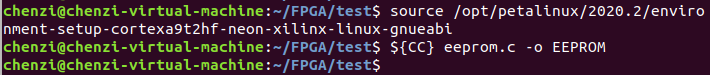

9-1

图

配置交叉编译环境与编译应用

9-2

将应用程序移入根文件中后，执行程序会打印如图

所示信息，显示

EEPROM

读写成功。

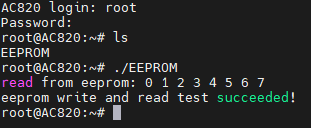

9-2EEPROM

图

测试

店铺：

官方网站：

https://xiaomeige.taobao.com

www.corecourse.cn

技术博客：

技术群组：

http://www.cnblogs.com/xiaomeige/

---
*下一页*

小梅哥FPGA 团队    武汉芯路恒科技

专注于培养您的FPGA 独立开发能力   开发板 培训 项目研发三位一体

9.4

本章小结

I/O

FPGA

本章通过简单的例子，介绍了使用文件

的方式操作

侧添加的常见

FPGA

外设控制器的方法。相较于使用虚拟地址映射的方式实现

侧设备驱动，

Linux

使用

系统支持的驱动程序来完成这些外设的控制不仅简化了程序编写过

程，提高了程序可移植性，而且内核驱动方式实现的设备驱动，能够方便的实

现中断的功能，从而提高控制器的运行效率。

店铺：

官方网站：

https://xiaomeige.taobao.com

www.corecourse.cn

技术博客：

技术群组：

http://www.cnblogs.com/xiaomeige/

---
*下一页*

小梅哥FPGA 团队    武汉芯路恒科技

专注于培养您的FPGA 独立开发能力   开发板 培训 项目研发三位一体

Linux

驱动编写与编译

章节导读

在32 位系统上，Linux 内核默认将4G 空间分为0~3G 的用户空间和3~4G 的

内核空间。64 位地址系统可管理的地址空间为2^48=256T，将128T 地址

（0x0000,0000,0000,0000 – 0x0000,7fff,ffff,f000）用于用户空间。用户

程序运行在用户空间，可通过中断或者系统调用进入内核空间；Linux内核以及

内核模块则只能在内核空间运行。

Linux内核具有很强的可裁剪性，很多功能或者外设驱动都可以编译成模块，

可在系统运行中动态插入或者卸载，在此过程中无需重启系统。模块化设计使

得Linux 系统在使用中更加灵活，可以将一些很少使用或者暂时不用的功能编

译为模块，在需要的时候再动态加载进内核，可以减小内核的体积，加快启动

速度，这对嵌入式应用极为重要。

SoC FPGA 作为一种新型的异构嵌入式芯片，既包含了可以运行Linux 操作

系统的PS 部分，又包含了通用的可编程逻辑。针对PS 部分，Xilinx 提供了成

熟的板级支持包。但是对于FPGA 部分添加的各种外设，由于定制化程度高，所

以很多时候要提供一个非常通用的驱动也并不容易。尤其是当用户自己设计了

一个自定义的IP 并希望通过内核驱动的方式在Linux 系统中来使用该IP 核时，

用户不得不自行编写驱动程序。关于Linux 驱动开发的详细介绍，读者可以参

阅专门讲解Linux 驱动开发的书籍，本章仅以SoC FPGA 应用系统中最常用的两

个驱动程序为例进行讲解，通过讲解其程序框架和硬件相关操作的具体实现，

引导读者掌握SoC FPGA 中驱动程序开发的一般方法。

10.1PWM

控制器设计

IP

PWM

IP

本节将按照该

核编写框架，设计一个

波

核，产生频率和占空比

PWM

FPGA

_V3.0

FPGA

可变的

波。在笔者的《

系统设计与验证实战指南

》（《

——

5.1

自学笔记

设计与验证》）

章节无源蜂鸣器驱动设计与验证章节中，设计

Verilog

PWM

10-1

了一个基于

的

波生成模块。该模块符号图如图

所示。

店铺：

官方网站：

https://xiaomeige.taobao.com

www.corecourse.cn

技术博客：

技术群组：

http://www.cnblogs.com/xiaomeige/

---
*下一页*

小梅哥FPGA 团队    武汉芯路恒科技

专注于培养您的FPGA 独立开发能力   开发板 培训 项目研发三位一体

Clk50M

Rst_n

cnt_en

o_pwm

pwm_generator

counter_arr

counter_ccr

10-1  PWM

图

发生器模块接口

10-1  PWM

表

生成模块接口功能描述

I/O

接口名称

功能描述

Clk

I

模块工作时钟信号

Rst_n

I

异步复位输入信号

cnt_en

I

PWM

输出使能信号

counter_arr

I

32

位预重装值输入端口，确定频率

counter_ccr

I

32

位输出比较值输入端口，确定占空比

o_pwm

O

PWM

输出信号

PWM

最终输出

波的频率计算公式为：

𝑓

𝑐𝑙𝑘

𝑓

=

𝑝𝑤𝑚

𝑐𝑜𝑢𝑛𝑡𝑒𝑟_𝑎𝑟𝑟+ 1

因此，当输出频率确定时，可计算得到预重装值，计算公式为：

𝑐𝑜𝑢𝑛𝑡𝑒𝑟_𝑎𝑟𝑟=

𝑓

𝑐𝑙𝑘

−1

𝑓

𝑝𝑤𝑚

5KHz

例如，当希望设置输出信号频率为

时

𝑐𝑜𝑢𝑛𝑡𝑒𝑟_𝑎𝑟𝑟=

𝑓

−1 =

50000000

𝑐𝑙𝑘

−1 = 9999

5000

𝑓

𝑝𝑤𝑚

counter_arr

9999

5KHz

因此，只需要设置

值为

即可使得最终输出信号频率为

。

PWM

当输出

频率确定后，其输出占空比计算法则为输出比较值与预重装

值之商。计算公式为：

𝑐𝑜𝑢𝑛𝑡𝑒𝑟_𝑐𝑐𝑟

PW =

𝑐𝑜𝑢𝑛𝑡𝑒𝑟_𝑎𝑟𝑟

因此，当输出占空比确定时，可计算得到输出比较值，计算公式为：

𝑐𝑜𝑢𝑛𝑡𝑒𝑟_𝑐𝑐𝑟=  PW ×  𝑐𝑜𝑢𝑛𝑡𝑒𝑟_𝑎𝑐𝑟

5KHz

70%

例如，当输出频率为

，输出占空比为

时：

𝑐𝑜𝑢𝑛𝑡𝑒𝑟_𝑐𝑐𝑟=  PW ×  𝑐𝑜𝑢𝑛𝑡𝑒𝑟_𝑎𝑟𝑟= 9999 ∗0.7 = 6999

PWM

在运行过程中，修改预重装值可以设置输出

信号的频率，并将同时

影响输出占空比，而在预重装值确定的情况下，修改输出比较值，则可以设置

输出占空比。

店铺：

官方网站：

https://xiaomeige.taobao.com

www.corecourse.cn

技术博客：

技术群组：

http://www.cnblogs.com/xiaomeige/

---
*下一页*

小梅哥FPGA 团队    武汉芯路恒科技

专注于培养您的FPGA 独立开发能力   开发板 培训 项目研发三位一体

10.1.1

PWM IP

创建

Linux

Zynq

在进行

驱动编写与编译开发前，我们要先搭建起

硬件平台。如

果读者对硬件搭建这一部分已经比较熟悉可以跳过这一部分，利用我们提供的

system_wrapper.xsa

AC820

ZYNQ

FPSoC

“

”文件，目录为：

小梅哥

型

或安路

开

\07_Linux

\AXI_PWM\ system_wrapper.xsa

发板资料

源码

，从《基本字符型设备驱

动》小节部分开始。

AC820

ZYNQ

FPSoC

/01_

读者可参照本教程的

梅哥

型

或安路

开发板资料

教

/03_CPU

/ZYNQ

12

AXI-Lite

材文档

裸机编程教材

中的第

章节《创建带

接口的自

IP

IP

AXI_PWM

定义

核》的创建小节自己创建一个新的

命名为“

”，下面我们

IP

开始

核的编辑。

10.1.2IP

核的编辑

IP

在读者存放自定义

的路径下，比如我选择在

A:\zynq_project\My_ip\ip_repo

IP

“

”目录下新建一个自定义

，由于所在路径是

IP

IP

IP

原来创建自定义

的

存放路径，再次创建

到此选定路径后会询问此位置

IP

Open

IP

已存在

项目，是否打开现有的项目，这里选择“

”，在我们的自定义

IP

10-2

库中添加本次设计的

，如图

所示。

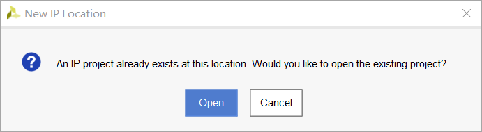

10-2

IP

图

添加本次设计的

AXI Peripheral

进入编辑界面，点开

分组，右键点击该创建的

AXI_PWM_v1.0

IP

IP

10-3

“

”

，选择编辑

封装如图

所示。

店铺：

官方网站：

https://xiaomeige.taobao.com

www.corecourse.cn

技术博客：

技术群组：

http://www.cnblogs.com/xiaomeige/

---
*下一页*

小梅哥FPGA 团队    武汉芯路恒科技

专注于培养您的FPGA 独立开发能力   开发板 培训 项目研发三位一体

10-3

IP

图

编辑

封装

工程创建界面，需要选择工程创建路径并命名，这里我们保持默认，点击

OK

10-4

即可，如图

所示。

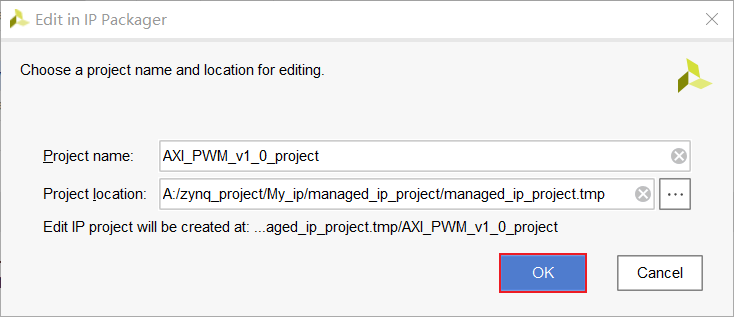

10-4

图

工程创建

+

10-5

进入了编辑界面，点击源文件界面上的“

”号来添加源文件，如图

所示。

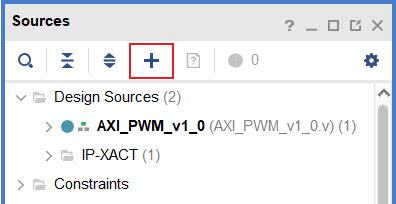

10-5

图

添加源文件

Add or create design source

在添加资源文件导航界面，我们勾选“

”来添加

Next

10-6

设计资源，点击

进行下一步，如图

所示。

店铺：

官方网站：

https://xiaomeige.taobao.com

www.corecourse.cn

技术博客：

技术群组：

http://www.cnblogs.com/xiaomeige/

---
*下一页*

小梅哥FPGA 团队    武汉芯路恒科技

专注于培养您的FPGA 独立开发能力   开发板 培训 项目研发三位一体

10-6

图

添加设计文件

Create File

在添加或创建设计源文件界面，我们点击“

”来创建文件。在创

pwm_generator

建源文件界面输入文件名“

”，选择文件路径为之前创建的

My_ip

My_ip/ip_repo/AXI_PWM_1.0/hdl

OK

文件夹下的“

”文件夹，点击

进行

10-7

下一步，如图

所示。

10-7

图

创建源文件

Finish

点击“

”完成该步骤。接下来会弹出模块定义界面，这里我们保持默

OK

Yes

认，直接点击

。随后系统会提示模块定义未被修改是否继续，点击“

”

完成添加。

pwm_generator.v

此时我们创建了一个名为

的文件，我们把这个文件里的代

码全部删除，然后在这个文件里添加以下代码：

module

pwm_generator

(

Clk

,

Rst_n

,

cnt_en

,

counter_arr

,

counter_ccr

,

o_pwm

);

input

Clk

;

//

时钟输入

店铺：

官方网站：

https://xiaomeige.taobao.com

www.corecourse.cn

技术博客：

技术群组：

http://www.cnblogs.com/xiaomeige/

---
*下一页*

小梅哥FPGA 团队    武汉芯路恒科技

专注于培养您的FPGA 独立开发能力   开发板 培训 项目研发三位一体

input

Rst_n

;

//

复位输入，低电平复位

input

cnt_en

;

//

计数使能信号

input

[

31

:

0

]

counter_arr

;

//

32

输入

位预重装值

input

[

31

:

0

]

counter_ccr

;

//

32

输入

位输出比较值

output

reg

o_pwm

;

//pwm

输出信号

reg

[

31

:

0

]

counter

;

//

32

定义

位计数器

always

@(

posedge

Clk

or

negedge

Rst_n

)

if

(!

Rst_n

)

counter

<=

32'd0

;

else

if

(

cnt_en

)

begin

if

(

counter

==

0

)

counter

<=

counter_arr

;

//

0

计数到

，加载自动预重装寄存器值

else

counter

<=

counter

-

1'b1

;

//

1

计数器自减

end

else

counter

<=

counter_arr

;

//

没有使能时，计数器值等于预重装寄存器值

always

@(

posedge

Clk

or

negedge

Rst_n

)

if

(!

Rst_n

)

//

PWM

让

输出信号复位时输出低电平

o_pwm

<=

1'b0

;

else

if

(

counter

>=

counter_ccr

)

//

计数值大于比较值

o_pwm

<=

1'b0

;

//

0

输出为

else

//

计数值小于比较值

o_pwm

<=

1'b1

;

//

1

输出为

endmodule

添加以后，我们点击保存，保存当前更改。保存后我们在左侧源文件列表

AXI_PWM

10-8

可以观察当前我们添加的

文件并不在顶层文件中，如图

所示。

IP

这是因为该模块并没有真正加入该

核的顶层，他们之间还没有在代码层面上

AXI_PWM

IP

建立联系，因此接下来需要将写好的

模块的添加入该

的顶层中。

10-8

图

源文件列表

Xinlinx

PL

PS

AXI

AXI

ARM

由于

的

和

之间数据传输通过

总线连接，而

是

AMBA

AMBA

总线系列中的一个协议。

协议是一个开放的片内互联规范标准，

AXI

能在多主机设计中实现许多控制器和外围设备之间的连接和管理。

协议是

Xilinx

FPGA

FPGA

被优化用于通过使用

进行的相应的开发来做

实现，它被用作

IP

PL-PS

AXI

设计的

核之间的一种通信方式。因此实现

协同通信就需要用到

接

店铺：

官方网站：

https://xiaomeige.taobao.com

www.corecourse.cn

技术博客：

技术群组：

http://www.cnblogs.com/xiaomeige/

---
*下一页*

小梅哥FPGA 团队    武汉芯路恒科技

专注于培养您的FPGA 独立开发能力   开发板 培训 项目研发三位一体

口控制模块。

AXI

AXI_PWM

为了使用

接口对我们所写的

模块进行控制，所以我们首先

AXI_PWM

AXI_PWM_v1_0_S00_AXI

要将

模块添加入顶层文件下的

模块中，

AXI_PWM_v1_0_S00_AXI

AXI_PWM

也就是在

模块中例化

模块，因此我们先

AXI_PWM_v1_0_S00_AXI

双击打开

文件进行设置。

// Users to add ports here

10-9

在“

”下添加用户定义端口，如图

所示。

output

wire

o_pwm

,

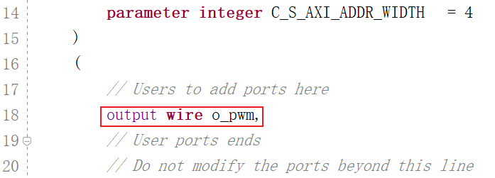

10-9

图

添加用户端口

4

4

AXI

我们继续往下看，可以看到

个寄存器，这

个寄存器，就是使用

来

进行读写的寄存器，使用这些寄存器与自定义模块的接口进行连接，即可完成

10-10

对模块的控制，如图

所示。

10-10  AXI

图

寄存器

AXI_PWM

下面我们来使用这四个寄存器与

模块的输入数据端口进行连接，

400

// Add user logic here

找到代码最下面的

行附近的

，然后在下面添加以下例化

代码：

pwm_generator pwm_generator (

.Clk(S_AXI_ACLK),

.Rst_n(S_AXI_ARESETN),

.cnt_en(slv_reg2),

.counter_arr(slv_reg0),

.counter_ccr(slv_reg1),

.o_pwm(o_pwm)

);

这里的时钟信号我们连接的是全局时钟信号，复位也是全局复位信号，低

店铺：

官方网站：

https://xiaomeige.taobao.com

www.corecourse.cn

技术博客：

技术群组：

http://www.cnblogs.com/xiaomeige/

---
*下一页*

小梅哥FPGA 团队    武汉芯路恒科技

专注于培养您的FPGA 独立开发能力   开发板 培训 项目研发三位一体

10-11

电平复位，信号如图

所示。

10-11

图

时钟与复位信号

AXI_PWM_v1_0_S00_AXI

AXI_PWM

我们已经在

模块中例化了

模块，我

AXI_PWM_v1_0

们先点击保存，接下来我们只需要在顶层文件

中添加

AXI_PWM_v1_0_S00_AXI

模块的改变部分即可。

AXI_PWM_v1_0_S00_AXI

在

模块中，我们添加了一个额外的输出端口：

o_pwm

AXI_PWM_v1_0

，因此我们需要在顶层文件

中添加这个部分。

AXI_PWM_v1_0

// Users to add ports here

双击顶层文件

打开，寻找

在下面添

10-12

加端口定义，如图

所示。

output

wire

o_pwm

,

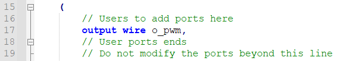

10-12

图

添加端口定义

1

10-13

（

）找到例化代码，添加端口并连接，如图

所示。

10-13

图

添加端口并连接

店铺：

官方网站：

https://xiaomeige.taobao.com

www.corecourse.cn

技术博客：

技术群组：

http://www.cnblogs.com/xiaomeige/

---
*下一页*

小梅哥FPGA 团队    武汉芯路恒科技

专注于培养您的FPGA 独立开发能力   开发板 培训 项目研发三位一体

至此，对代码的部分的修改已经全部完成了，我们点击保存。此时我们再

Water_LED

看源文件列表，可以发现

模块已经添加到顶层文件下了，说明该模

10-14

块已经完成了添加，如图

所示。

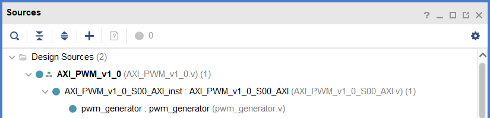

10-14

图

顶层文件列表

SYNTHESIS

Run Synthesized

我们点击左侧

下的的

对代码进行分析和综合，

10-15

如图

所示。

10-15

图

分析和综合

Synthesized Completed

综合完成后，弹出

说明综合成功，并询问我们是否

Cancel

10-16

进行下一步操作，这里无需下一步操作，点击

，如图

所示。

10-16

图

综合成功

IP

IP-XACT

接下来我们对用户自定义

进行封装，我们双击

下的

component.xml

IP

10-17

文件，打开封装

界面，如图

所示。

店铺：

官方网站：

https://xiaomeige.taobao.com

www.corecourse.cn

技术博客：

技术群组：

http://www.cnblogs.com/xiaomeige/

---
*下一页*

小梅哥FPGA 团队    武汉芯路恒科技

专注于培养您的FPGA 独立开发能力   开发板 培训 项目研发三位一体

10-17

IP

图

双击打开封装

界面

Compatibility

IP

10-18

点击

选项，添加该

所支持的芯片系列，如图

所示。

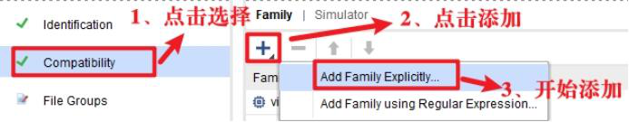

10-18

IP

图

添加

所支持芯片

zynq

zynq-7000

OK

10-19

勾选

（

）系列，点击

，如图

所示。

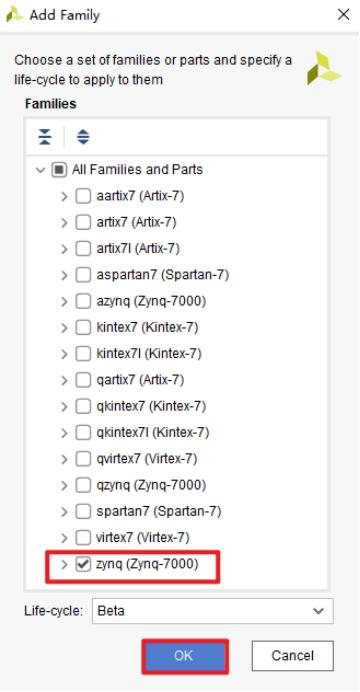

10-19

图

添加芯片型号

店铺：

官方网站：

https://xiaomeige.taobao.com

www.corecourse.cn

技术博客：

技术群组：

http://www.cnblogs.com/xiaomeige/

---
*下一页*

小梅哥FPGA 团队    武汉芯路恒科技

专注于培养您的FPGA 独立开发能力   开发板 培训 项目研发三位一体

File Groups

Merge changes from File Groups Wizard

选择

文件分组，点击

来

10-20

合并文件组向导中的更改，如图

所示。

10-20

图

合并组向导更改

Customization Parameters

Merge changes from Customization

点击

，点击

Parameters Wizard

10-21

来合并自定义参数向导中的更改，如图

所示。

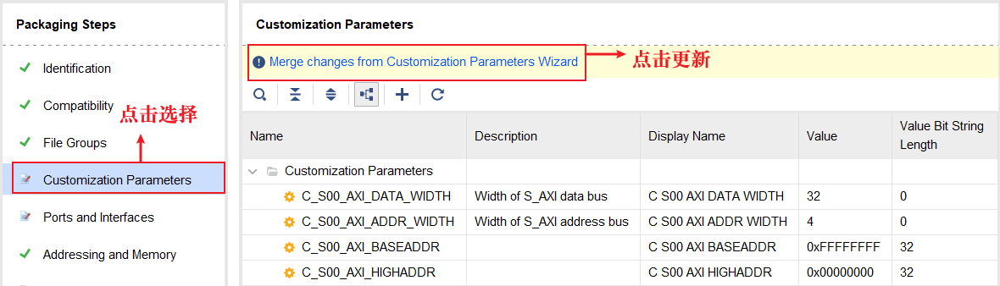

10-21

图

合并参数向导的更改

GUI

GUI

接着我们点击进入定制

界面，在左侧界面来进行

的定制，在右侧

GUI

会实时显示更改后的

界面效果，我们在这里不对其进行更改，保持默认即

10-22

可，如图

所示。

10-22

GUI

图

定制

界面

Review and Package

Re-Package IP

点击

进入检查与封装界面，点击

重新封

IP

10-23

装

，如图

所示。

店铺：

官方网站：

https://xiaomeige.taobao.com

www.corecourse.cn

技术博客：

技术群组：

http://www.cnblogs.com/xiaomeige/

---
*下一页*

小梅哥FPGA 团队    武汉芯路恒科技

专注于培养您的FPGA 独立开发能力   开发板 培训 项目研发三位一体

10-23

IP

图

对

重新封装

Yes

IP

弹出封装完成，是否关闭该工程，点击

关闭该工程。至此，自定义

IP

核的建立与封装就完成了，接下来我们会在实战中使用该

核，以此来验证它

10-24

的功能，如图

所示。

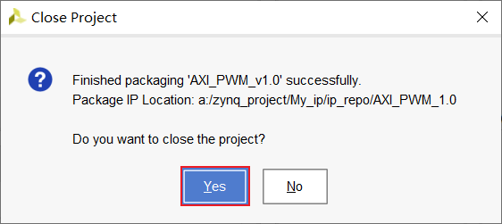

10-24

图

关闭工程

10.1.3

IP

自定义

核的使用

IP

vivado

本次设计将使用我们在前面设计好的自定

核，在

中配置好硬件信

AXI_PWM IP

vivado

息，我们需要创建一个带有该

核的

最简工程就行。

1.

ZYNQ_PWM

首先还是创建一个

工程，步骤和前面章节一致，芯片型

xc7z020clg484-2

号为“

”

2.

IP

IP

创建好设计模块后接下来开始添加

，但是此时在

库里还无法找到

AXI_PWM

我们创建的

，这是因为我们还没有将其添加到储存库里，所

以接下来我们要先将其添加到储存库，然后再从储存库里将其添加到

模块设计。

1

10-25

（

）点击设置图标，进入设置界面，如图

所示。

店铺：

官方网站：

https://xiaomeige.taobao.com

www.corecourse.cn

技术博客：

技术群组：

http://www.cnblogs.com/xiaomeige/

---
*下一页*

小梅哥FPGA 团队    武汉芯路恒科技

专注于培养您的FPGA 独立开发能力   开发板 培训 项目研发三位一体

10-25

图

进入设置界面

2

Repository

+

（

）在设置界面选择

，点击右侧“

”号添加库文件路径，如图

10-26

所示。

10-26

图

添加库文件路径

3

IP

AXI_PWM

（

）选择之前创建的

的库文件的路径，找到创建的

点击

Select

10-27

，如图

所示。

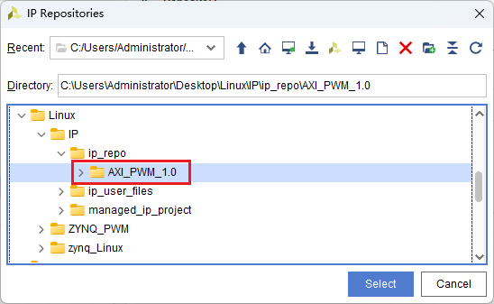

10-27

图

AXI_PWM IP

4

IP

OK

10-28

（

）选中路径下包含的

核，点击

，如图

所示。

店铺：

官方网站：

https://xiaomeige.taobao.com

www.corecourse.cn

技术博客：

技术群组：

http://www.cnblogs.com/xiaomeige/

---
*下一页*

小梅哥FPGA 团队    武汉芯路恒科技

专注于培养您的FPGA 独立开发能力   开发板 培训 项目研发三位一体

10-28

IP

图

选择

核

5

10-29

（

）下面就可以进入系统模块的设置，如图

所示。

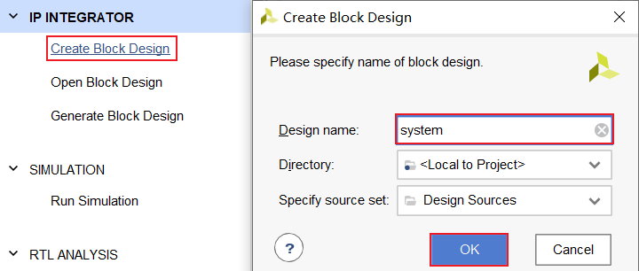

10-29

图

系统模块设置

6

IP

PWM

10-30

（

）点击添加模块，在搜索栏搜索

名“

”，如图

所示。可

IP

10-31

以看到我们自定义好的

，双击添加，如图

所示。

10-30

IP

图

添加

店铺：

官方网站：

https://xiaomeige.taobao.com

www.corecourse.cn

技术博客：

技术群组：

http://www.cnblogs.com/xiaomeige/

---
*下一页*

小梅哥FPGA 团队    武汉芯路恒科技

专注于培养您的FPGA 独立开发能力   开发板 培训 项目研发三位一体

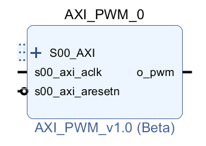

10-31  PWM IP

图

核视图

10.1.4

PWM

搭建

系统工程

PWM IP

Zynq IP

Zynq IP

除了自定义的

核，我们还需要添加

核，添加后对

PS

SD

PL

AXI_PWM IP

核进行配置。

内置

卡接口、串口、网口，

部分添加

核

PWM

P19

ILA IP

PWM

ILA

（

输出脚设定为

），外加一个

核来分析产生的

（

加

100M

Zynq IP

不加都行），时钟设置为

。

核配置步骤可参看本教程第四章《基

ZYNQ

Linux

10-32

于

的

开发流程设计》部分内容，工程视图如图

所示。

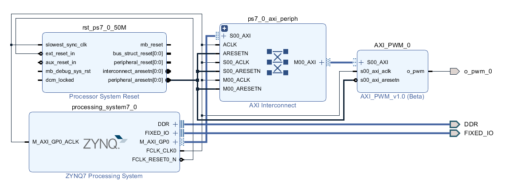

10-32

图

工程视图

对过程进行端口连接封装及管脚约束，还不熟悉这部分的读者可以参看

AC820

ZYNQ

FPSoC

\

01_

\03_CPU

小梅哥

型

或安路

开发板资料

教材文档

裸

\ZYNQ \

3

AXI GPIO

LED

机编程教材文档

第

章

基于

的

亮灭

的硬件逻辑系统设计

xsa

部分。最后生成

文件。

xsa

xsa

xsa

ubuntu

在生成

文件之后，导出

文件（包含比特流）。将

文件放进

ZYNQ

Linux

xsa

中，然后按照上文“基于

的

开发流程快速体验”章节，基于该

Linux

zImage

BOOT.BIN

system.dtb

system.bit

文件生成

内核镜像

、

、

、

、根文件

SD

boot

系统。将以下几个所需文件拷贝到

卡的

分区：

店铺：

官方网站：

https://xiaomeige.taobao.com

www.corecourse.cn

技术博客：

技术群组：

http://www.cnblogs.com/xiaomeige/

---
*下一页*

小梅哥FPGA 团队    武汉芯路恒科技

专注于培养您的FPGA 独立开发能力   开发板 培训 项目研发三位一体

⚫

zImage

内核镜像

⚫

system.dtb

设备树

⚫

system.bit

文件

⚫

BOOT.BIN

文件

⚫

boot.scr

文件

boot.scr

U-Boot

其中，

是

使用的启动脚本文件，主要用于设置环境变量，

加载内核、设备树和根文件系统，这里笔者已经提前制作好了，将其移入即可。

SD

最后，对最简系统进行验证，连接好开发板，开发板设置为

卡

启动，

SD

10-33

插入

卡，如图

所示。

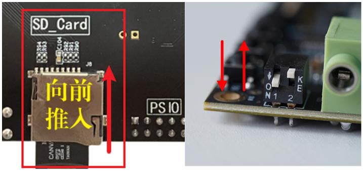

10-33

SD

图

设置为

卡启动

MobaXterm_Personal_21.3

uboot

打开

进行连接，在

启动后的倒计时里，按

uboot

下任意键可以打断倒计时，进入

命令行模式。

root

10-34

系统启动后登录用户，用户名称和密码默认为“

”，如图

所示成

功登录用户。

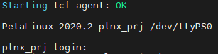

10-34

图

用户登录

PWM

在系统搭建起来后，我们开始为

进行驱动的编写和编译。

店铺：

官方网站：

https://xiaomeige.taobao.com

www.corecourse.cn

技术博客：

技术群组：

http://www.cnblogs.com/xiaomeige/

---
*下一页*

小梅哥FPGA 团队    武汉芯路恒科技

专注于培养您的FPGA 独立开发能力   开发板 培训 项目研发三位一体

10.2

基本字符型设备驱动

Linux

I/O

IO

在“基于

标准文件

的设备读写”一节中，讲解了使用标准文件

I/O

I2C

open()

操作设备的方法。使用标准文件

操作一个

设备，使用简单的

、

write()

read()

ioctl()

、

、

函数即可实现设备中数据的读写。那么，在应用程序中使

用的这些函数，又是怎样最终作用于硬件上的呢，这些标准函数和硬件寄存器

之间，是通过怎样的桥梁进行连接的呢。

Linux

设备驱动是具有入口和出口的一组方法的集合，各方法之间相互独立。

10-35

驱动内部逻辑结构如图

所示：

insmod

入口：初始化函数

各种操作方法

xxx_open

xxx_release

xxx_read

xxx_write

xxx_ioctl

…

rmmod

出口：清除函数

10-35

图

驱动内部逻辑结构

Linux

设备在内核中是用设备号进行区分的，而决定这些设备号的正是设备

驱动程序。另外，在用户空间如何管理这些设备，这也是与驱动程序息息相关

的。一个完整的设备驱动必须具备以下基本要素：

1)

驱动的入口和出口。驱动入口和出口部分的代码，并不与应用程序直

接交互，仅仅只与内核模块管理子系统有交互。

在加载内核的时候执行入

口代码，卸载的时候执行出口代码。这部分代码与内核版本关系较大，严

重依赖于驱动子系统的架构和实现。

店铺：

官方网站：

https://xiaomeige.taobao.com

www.corecourse.cn

技术博客：

技术群组：

http://www.cnblogs.com/xiaomeige/

---
*下一页*

小梅哥FPGA 团队    武汉芯路恒科技

专注于培养您的FPGA 独立开发能力   开发板 培训 项目研发三位一体

2)

操作设备的各种方法。驱动程序实现了各种用于系统服务的各种方

法，但是这些方法并不能主动执行，发挥相应的功能，只能被动的等待应

用程序的系统调用，只有经过相应的系统调用，各方法才能发挥相应的功

read()

xxx_read()

能，如应用程序执行

系统调用，内核才能执行驱动

方法的

代码。这部分代码主要与硬件和所需要实现的操作相关。

3)

提供设备管理方法支持。包括设备号的分配和设备的注册等。这部分

udev

代码与内核版本以及最终所采用的设备管理方法相关系，如采用

，则

驱动必须提供相应的支持代码。

10.2.1

字符型设备驱动框架

PWM IP

Linux

IP

以下以

核驱动为例，介绍一个基本的

字符

的基本架构。

10.2.1.1

头文件包含

Linux

驱动程序的实现，都需要包含一些基本的

系统提供的头文件，这些

pwm

头文件为驱动程序中实现各种操作提供了底层支持。

控制器驱动的该部分

代码如下所示：

1

#include <linux/init.h>

2

#include <linux/module.h>

3

#include <linux/fs.h>

4

#include <linux/cdev.h>

5

#include <linux/device.h>

6

#include <linux/version.h>

7

#include <linux/slab.h>

8

#include <asm/uaccess.h>

9

#include <asm/io.h>

10

#include <asm/mach/arch.h>

11

#include <asm/mach/map.h>

12

#include <linux/uaccess.h>

13

#include <linux/types.h>

14

#include <linux/kernel.h>

15

16

#include "pwm_drv.h"

/*

PWM

*/

包含

驱动自身头文件

(1)~(14)

Linux

代码

行为基本的

字符型驱动程序所需头文件。不同内核模块

<linux/module.h>

根据功能的差异，所需要的头文件也不相同，但是

和

<linux/init.h>

是必不可少的。

(16)

pwm

PWM

代码

行为

驱动自己的头文件。在该文件中定义了

设备的结

ioctl

构体和

操作的一些相关参数命令。该文件内容如下所示：

#ifndef _PWM_DRV_H

#define _PWM_DRV_H

店铺：

官方网站：

https://xiaomeige.taobao.com

www.corecourse.cn

技术博客：

技术群组：

http://www.cnblogs.com/xiaomeige/

---
*下一页*

小梅哥FPGA 团队    武汉芯路恒科技

专注于培养您的FPGA 独立开发能力   开发板 培训 项目研发三位一体

#define PWM_IOC_MAGIC 'x'

/*

PWM

ioctl

*/

定义

驱动

幻数

#define PWM_SET_ARR _IOW(PWM_IOC_MAGIC, 0, int)

/*

ARR

构造设置

寄存器

*/

命令

#define PWM_SET_CCR _IOW(PWM_IOC_MAGIC, 1, int)

/*

CCR

构造设置

寄存器

*/

命令

#define PWM_SET_CTL _IOW(PWM_IOC_MAGIC, 2, int)

/*

CTL

构造设置

寄存器

*/

命令

#define PWM_IOCTL_MAXNR 3

/*

PWM ioctl

定义

方法的命令最大值，以防止非

*/

法命令传入

/*pwm

*/

设备结构体

struct

pwm_device

{

unsigned

int

counter_arr

;

/*32

*/

位预重装值寄存器

unsigned

int

counter_ccr

;

/*

*/

输出比较值寄存器

unsigned

int

control

;

/*PWM

*/

输出使能寄存器

};

#endif

/*_PWM_DRV_H*/

10.2.1.2

变量和宏定义

在驱动程序中，需要用到一些变量和宏定义，该部分代码如下所示：

18

static

int

major

;

19

static

int

minor

;

20

struct

cdev

*

pwm

;

/* cdev

*/

数据结构

21

static

dev_t devno

;

/*

*/

设备编号

22

static

struct

class

*

pwm_class

;

23

24

unsigned

long

*

LWH2F_bridge_addr

=

0

;

25

unsigned

long

*

h2p_pwm_addr

=

0

;

26

27

#define MAP_PWM_ADDR

(

0x43C00000

)

//PWMPwripheral

基地址

28

#define MAP_SIZE

(

0x10

)

29

30

#define DEVICE_NAME

"pwm"

/*

*/

定义设备名称

(18)~(22)

代码

行定义了设备驱动中需要用到的一些基本变量。

(24)~(30)

代码

行定义了一些与硬件相关的变量或宏定义。例如

LWH2F_bridge_addr

h2p_pwm_addr

和

是用来保存设备虚拟地址的，而三个宏定

义则分别定义了硬件的一些具体信息如地址和地址空间大小等。

DEVICE_NAME

定义了驱动程序最终要创建的设备名称。

10.2.1.3open

方法

如果某些外设在开始工作前需要设置某些寄存器以进行初始化，则可以在

PWM IP

open

此操作中进行。

核寄存器设置非常简单，无需初始化操作，因此

操作中没有操作寄存器的部分，仅打印了一个字符串信息以指示该程序被调用。

店铺：

官方网站：

https://xiaomeige.taobao.com

www.corecourse.cn

技术博客：

技术群组：

http://www.cnblogs.com/xiaomeige/

---
*下一页*

小梅哥FPGA 团队    武汉芯路恒科技

专注于培养您的FPGA 独立开发能力   开发板 培训 项目研发三位一体

pwm

控制器驱动的该部分代码如下所示：

32

static

int

pwm_open

(

struct

inode

*

inode

,

struct

file

*

file

)

33

{

34

try_module_get

(

THIS_MODULE

);

35

printk

(

"pwm_open\n"

);

36

return

0

;

37

}

10.2.1.4release

方法

如果某些外设在停止工作前需要设置某些寄存器才能关闭功能，则可以在

pwm

此操作中进行。

控制器驱动的该部分代码如下所示：

39

static

int

pwm_release

(

struct

inode

*

inode

,

struct

file

*

file

)

40

{

41

module_put

(

THIS_MODULE

);

42

printk

(

"pwm_close\n"

);

43

return

0

;

44

}

10.2.1.5read

方法

read

pwm

操作主要实现从内核空间中拷贝若干个数据到用户空间中。

控制

器驱动的该部分代码如下所示：

46

ssize_t pwm_read

(

struct

file

*

filp

,

char

*

buf

,

size_t

count

,

loff_t

*

f_pos

)

47

{

48

struct

pwm_device

*

pwm

;

/*

pwm

*/

定义

寄存器结构体指针

49

printk

(

"pwm_read\n"

);

50

/*

*/

为结构体指针分配一块内存

51

pwm

=

(

struct

pwm_device

*)

kmalloc

(

sizeof

(

struct

pwm_device

),

GFP_KERNEL

);

52

pwm

->

counter_arr

=

ioread32

(

h2p_pwm_addr

+

0

);

/*

PWM

0

读

寄存器

，即

ARR

*/

寄存器

53

pwm

->

counter_ccr

=

ioread32

(

h2p_pwm_addr

+

1

);

/*

PWM

1

读

寄存器

，即

CCR

*/

寄存器

54

pwm

->

control

=

ioread32

(

h2p_pwm_addr

+

2

);

/*

PWM

2

读

寄存器

，即控制

*/

寄存器

55

printk

(

"arr:%d; crr:%d; control:%d\n"

,

pwm

->

counter_arr

,

pwm

->

counter_ccr

,

pwm

->

control

);

56

/*

*/

将读取到的数据拷贝到用户空间

57

if

(

copy_to_user

(

buf

,

pwm

,

count

))

return

-

EFAULT

;

58

printk

(

"read done\n"

);

59

return

count

;

60

}

57

copy_to_user()

pwm

在

行使用

函数从内核空间中将

结构体的数据拷贝到

ioread32()

PWM IP

用户空间中。而内核空间中的这些数据，又是通过

函数从

核

的寄存器中读取出来的。

店铺：

官方网站：

https://xiaomeige.taobao.com

www.corecourse.cn

技术博客：

技术群组：

http://www.cnblogs.com/xiaomeige/

---
*下一页*

小梅哥FPGA 团队    武汉芯路恒科技

专注于培养您的FPGA 独立开发能力   开发板 培训 项目研发三位一体

10.2.1.6write

方法

write

操作主要实现从用户空间中拷贝若干个数据到内核空间中，然后再对

pwm

这些数据进行处理，如写入到外设寄存器中。

控制器驱动的该部分代码如

下所示：

062

ssize_t pwm_write

(

struct

file

*

filp

,

const

char

*

buf

,

size_t

count

,

loff_t

*

f_pos

)

063

{

064

printk

(

"write"

);

：

；

：

；

：

065

int

data

[

3

];

/*data[0]

ARR

data[1]

CCR

data[2]

CTL*/

066

printk

(

"pwm_write\n"

);

从用户空间将数据拷贝到

数组中

067

/*

data

*/

068

if

(

copy_from_user

(

data

,

(

int

*)

buf

,

count

))

return

-

EFAULT

;

写

寄存器

，即

寄存器

069

iowrite32

(

data

[

0

],

h2p_pwm_addr

+

0

);

/*

PWM

0

ARR

*/

写

寄存器

，即

寄存器

070

iowrite32

(

data

[

1

],

h2p_pwm_addr

+

1

);

/*

PWM

1

CCR

*/

写

寄存器

，即控制寄存器

071

iowrite32

(

data

[

2

],

h2p_pwm_addr

+

2

);

/*

PWM

2

*/

072

printk

(

"set arr:%d; crr:%d; control:%d\n"

,

data

[

0

],

data

[

1

],

data

[

2

]);

073

printk

(

"write done\n"

);

074

075

return

count

;

076

}

(62)~(76)

代码

行为驱动程序写操作方法的具体实现。该函数中，首先定义

3

copy_from_user()

了一个

个元素的数组，然后使用

函数从用户空间中拷贝数据

iowrite32

到到该数组中，最后再把数组中三个元素的数据使用

函数分别写入到

PWM IP

3

write

的

个寄存器中，以实现应用程序通过

函数写外设寄存器中的操

作。

10.2.1.7ioctl

方法

ioctl

read

write

操作主要实现一些无法方便的使用

或

方法实现的操作。例如

pwm

对单个寄存器的操作。

控制器驱动的该部分代码如下所示：

078

static

int

pwm_ioctl

(

struct

file

*

filp

,

unsigned

int

cmd

,

unsigned

long

arg

)

079

{

080

unsigned

int

Updata

;

081

printk

(

"pwm_ioctl\n"

);

检查命令所带函数是否匹配

082

/*

*/

083

if

(

_IOC_TYPE

(

cmd

)

!=

PWM_IOC_MAGIC

)

084

{

085

return

-

ENOTTY

;

086

}

检查命令号是否超过了驱动所允许的最大值

087

/*

*/

088

if

(

_IOC_NR

(

cmd

)

>

PWM_IOCTL_MAXNR

)

089

{

090

return

-

ENOTTY

;

091

}

解析命令

092

/*

*/

093

switch

(

cmd

)

094

{

设置预重装寄存器值

095

case

PWM_SET_ARR

:

/*

*/

096

printk

(

"PWM_SET_ARR\n"

);

店铺：

官方网站：

https://xiaomeige.taobao.com

www.corecourse.cn

技术博客：

技术群组：

http://www.cnblogs.com/xiaomeige/

---
*下一页*

小梅哥FPGA 团队    武汉芯路恒科技

专注于培养您的FPGA 独立开发能力   开发板 培训 项目研发三位一体

097

get_user

(

Updata

,

(

unsigned

int

*)

arg

);

098

iowrite32

(

Updata

,

h2p_pwm_addr

+

0

);

099

break

;

100

设置输出比较寄存器值

101

case

PWM_SET_CCR

:

/*

*/

102

printk

(

"PWM_SET_CCR\n"

);

103

get_user

(

Updata

,

(

unsigned

int

*)

arg

);

104

iowrite32

(

Updata

,

h2p_pwm_addr

+

1

);

105

break

;

106

设置控制寄存器值

107

case

PWM_SET_CTL

:

/*

*/

108

printk

(

"PWM_SET_Control\n"

);

109

get_user

(

Updata

,

(

unsigned

int

*)

arg

);

110

iowrite32

(

Updata

,

h2p_pwm_addr

+

2

);

111

break

;

112

default

:

113

break

;

114

}

115

return

0

;

116

}

(62)~(76)

ioctl

代码

行为驱动程序

操作方法的具体实现。该函数中，首先检

cmd

查用户空间传入进来的命令（

）中幻数部分与驱动程序所使用的幻数是否

一致，如果不一致则退出。接着检查命令中的命令编号是否超过了驱动所允许

的最大值，如果超过了最大值则为不支持的命令，同样退出函数。然后开始根

cmd

PWM_SET_CTL

据

的不同值，执行不同的操作。例如

命令就是写控制寄存

get_user()

器，在该操作中，程序会首先使用

函数从用户空间拷贝一个值到内核

iowrite32()

write

空间，然后再将这个值使用

函数写入到控制寄存器中。与

方法

ioctl()

一次性操作所有寄存器不同，

一次性可以仅操作一个寄存器。这样，用户

空间的程序通过不同的命令就能够分别操作不同的寄存器了。

10.2.1.8fops

定义

(118)~(127)

Linux

代码

行为驱动程序操作方法映射部分，在前面提到过，

文

write()

read()

件操作提供了多个标准的接口函数来对文件进行操作，如

、

等。在

Linux

驱动程序中，为了能够支持这些操作，都会编写相应的实现函数，而

系

统是如何将这些标准操作与驱动程序中某个函数对应起来的呢？这里就需要一

pwm

个映射表，实现驱动程序操作方法映射，

控制器驱动的该部分代码如下所

示。

定义驱动程序操作函数

118

/*

*/

119

struct

file_operations pwm_fops

=

120

{

121

.

owner

=

THIS_MODULE

,

122

.

open

=

pwm_open

,

123

.

write

=

pwm_write

,

124

.

read

=

pwm_read

,

125

.

release

=

pwm_release

,

126

.

unlocked_ioctl

=

pwm_ioctl

,

店铺：

官方网站：

https://xiaomeige.taobao.com

www.corecourse.cn

技术博客：

技术群组：

http://www.cnblogs.com/xiaomeige/

---
*下一页*

小梅哥FPGA 团队    武汉芯路恒科技

专注于培养您的FPGA 独立开发能力   开发板 培训 项目研发三位一体

127

};

(118)~(127)

在

行代码中，为各种标准操作函数分别指定了一个特定的函数。

open

pwm_open()

read

例如

操作就指向了驱动程序中的

函数，

操作指向了驱动程

pwm_read()

PWM IP

序中的

函数。这样当用户空间的程序要对通过该驱动程序读

read()

的寄存器时，就可以通过调用

函数并指定该设备的文件描述符，系统就会

read

pwm_read()

自动根据指定的文件描述符找到驱动程序中实现

操作的

函数并

PWM IP

调用，从而将数据从

寄存器读取到内核空间，并进一步将数据拷贝到

用户空间。

10.2.1.9

模块初始化代码

insmod

驱动程序入口函数，也称为模块初始化函数。当使用

命令加载该驱

pwm

动程序时，驱动程序入口函会被调用。

控制器驱动的该部分代码如下所示：

驱动程序入口

129

/*

*/

130

static

int

__init pwm_init

(

void

)

131

{

132

int

ret

;

映射得到

桥上

核的虚拟地址

133

/*

LW AXI Master

PWM IP

*/

134

LWH2F_bridge_addr

=(

unsigned

long

*)

ioremap_nocache

(

MAP_PWM_ADDR

,

MAP_SIZE

);

135

if

(

LWH2F_bridge_addr

==

0

)

136

{

137

printk

(

"Faipwm to allocate virtual space for LWH2F bridge

space.\n"

);

138

return

-

1

;

139

}

140

printk

(

"LWH2F_bridge_addr is %x\n"

,

LWH2F_bridge_addr

);

141

h2p_pwm_addr

=

LWH2F_bridge_addr

;

从系统获取主设备号

142

/*

*/

143

ret

=

alloc_chrdev_region

(&

devno

,

minor

,

1

,

"pwm"

);

144

major

=

MAJOR

(

devno

);

145

if

(

ret

<

0

)

146

{

147

printk

(

KERN_ERR

"cannot get major %d \n"

,

major

);

148

return

-

1

;

149

}

150

分配

结构

151

pwm

=

cdev_alloc

();

/*

pwm

*/

152

if

(

pwm

!=

NULL

)

153

{

初始化

结构

154

cdev_init

(

pwm

,

&

pwm_fops

);

/*

pwm

*/

155

pwm

->

owner

=

THIS_MODULE

;

增加

到系统中

156

if

(

cdev_add

(

pwm

,

devno

,

1

)

!=

0

)

/*

pwm

*/

157

{

158

printk

(

KERN_ERR

"add cdev error!\n"

);

159

goto

error

;

160

}

161

}

162

else

163

{

164

printk

(

KERN_ERR

"cdev_alloc error!\n"

);

165

return

-

1

;

166

}

增加

类

167

/*

pwm

*/

店铺：

官方网站：

https://xiaomeige.taobao.com

www.corecourse.cn

技术博客：

技术群组：

http://www.cnblogs.com/xiaomeige/

---
*下一页*

小梅哥FPGA 团队    武汉芯路恒科技

专注于培养您的FPGA 独立开发能力   开发板 培训 项目研发三位一体

168

pwm_class

=

class_create

(

THIS_MODULE

,

"pwm_class"

);

169

if

(

IS_ERR

(

pwm_class

))

170

{

171

printk

(

KERN_INFO

"create class error\n"

);

172

return

-

1

;

173

}

创建

设备

174

/*

PWM

*/

175

device_create

(

pwm_class

,

NULL

,

devno

,

NULL

,

"pwm"

);

176

return

0

;

177

178

error

:

释放已经获得的设备号

179

unregister_chrdev_region

(

devno

,

1

);

/*

*/

180

return

ret

;

181

}

◼

134

在驱动程序入口函数中的第

行，同样是进行了虚拟地址映射，得到

PWM IP

LWH2F_bridge_addr

了

的虚拟地址并存放在

变量中。需要注意

的是，在内核驱动程序中，要实现对外设实现基于地址的操作，需要

ioremap()

先进行虚拟地址映射，不过在内核空间，映射使用的是

函数

ioremap_nocache()

ioremap()

cache

和

函数，

函数使用的是处理器系统的

ioremap_nocache()

cache

中的存储资源，而

是旁路

直接映射物理地址，

在对硬件进行操作的应用中，应当直接操作实际的物理地址，避开

cache

。因此在驱动程序中进行虚拟地址映射时一般使用

ioremap_nocache()

函数。

◼

(143)~(144)

alloc_chrdev_region()

pwm

第

行，调用

函数为

设备获取了主

次设备号。

◼

151

152

166

第

行向系统申请了一个字符设备结构。第

行到

行，初始化

pwm

(118)~(127)

申请的

设备结构体，在这其中，就使用了

行的操作方

pwm_fops

法映射部分。在初始化结构体的时候，将

作为指针传入了字

符设备结构体初始化函数。

◼

(168)~(173)

PWM

第

行，增加了

的设备类。

◼

175

第

行，在所有的准备工作都完成后，调用设备创建函数正式创建

pwm

设备。

10.2.1.10

模块退出代码

rmmod

驱动出口函数，也称为模块退出函数。当在系统中使用

命令卸载驱

动程序时调用此函数，此函数是驱动入口函数的逆过程，在此函数中，对驱动

pwm

入口函数中申请的一系列资源进行了释放。

控制器驱动的该部分代码如下

所示：

驱动程序出口

183

/*

*/

店铺：

官方网站：

https://xiaomeige.taobao.com

www.corecourse.cn

技术博客：

技术群组：

http://www.cnblogs.com/xiaomeige/

---
*下一页*

小梅哥FPGA 团队    武汉芯路恒科技

专注于培养您的FPGA 独立开发能力   开发板 培训 项目研发三位一体

184

static

void

__exit pwm_exit

(

void

)

185

{

取消虚拟地址映射

186

iounmap

((

void

*)

LWH2F_bridge_addr

);

/*

*/

移除字符设备

187

cdev_del

(

pwm

);

/*

*/

释放设备号

188

unregister_chrdev_region

(

devno

,

1

);

/*

*/

销毁设备

189

device_destroy

(

pwm_class

,

devno

);

/*

*/

销毁设备类

190

class_destroy

(

pwm_class

);

/*

*/

191

}

10.2.1.11

模块声明

pwm

控制器驱动的模块信息声明部分代码如下所示：

指定驱动入口函数

193

module_init

(

pwm_init

);

/*

*/

指定驱动出口函数

194

module_exit

(

pwm_exit

);

/*

*/

195

196

MODULE_LICENSE

(

"GPL"

);

197

MODULE_AUTHOR

(

"xiaomeige, www.corecourse.cn"

);

(193)

(194)

(196)

代码

行声明了驱动函数入口，代码

行声明了驱动出口函数，

“GPL”

(197)

行声明了源码所遵循的开源协议为

，

行声明了源码的作者信息。

10.2.2PWM

控制器驱动编写

ubuntu

AXI_PWM IP

下面进行在

里进行

核驱动程序的编写与编译。

AC820_Linux_Base

在你依照上文创建的

工程文件夹下，创建一个名为

AXI_PWM_DRV

10-36

的驱动文件夹，如图

所示。

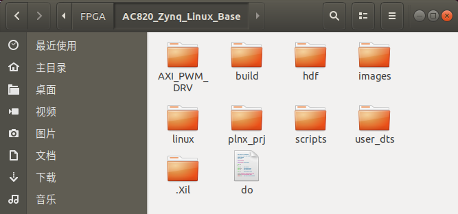

10-36

PWM

图

新建

驱动文件夹

pwm

在上一节对

驱动代码的编写进行了讲解，编写了完整的驱动代码，在

AXI_PWM_DRV

pwm_drv.c

文件夹里创建一个名为

的文件，在里面添加完整的

pwm

驱动代码，如下所示。

#include <linux/init.h>

#include <linux/module.h>

#include <linux/fs.h>

#include <linux/cdev.h>

#include <linux/device.h>

店铺：

官方网站：

https://xiaomeige.taobao.com

www.corecourse.cn

技术博客：

技术群组：

http://www.cnblogs.com/xiaomeige/

---
*下一页*

小梅哥FPGA 团队    武汉芯路恒科技

专注于培养您的FPGA 独立开发能力   开发板 培训 项目研发三位一体

#include <linux/version.h>

#include <linux/slab.h>

#include <asm/uaccess.h>

#include <asm/io.h>

#include <asm/mach/arch.h>

#include <asm/mach/map.h>

#include <linux/uaccess.h>

#include <linux/types.h>

#include <linux/kernel.h>

#include "pwm_drv.h"

/*

PWM

*/

包含

驱动自身头文件

static

int

major

;

static

int

minor

;

struct

cdev

*

pwm

;

/* cdev

*/

数据结构

static

dev_t devno

;

/*

*/

设备编号

static

struct

class

*

pwm_class

;

unsigned

long

*

LWH2F_bridge_addr

=

0

;

unsigned

long

*

h2p_pwm_addr

=

0

;

//#define MAP_BASE_ADDR (0xFF200000) //lwAxiMaster

桥基地址

#define MAP_PWM_ADDR (0x43C00000)

//PWMPwripheral

基地址

#define MAP_SIZE (0x10)

#define DEVICE_NAME "pwm"

/*

*/

定义设备名称

static

int

pwm_open

(

struct

inode

*

inode

,

struct

file

*

file

)

{

try_module_get

(

THIS_MODULE

);

printk

(

"pwm_open\n"

);

return

0

;

}

static

int

pwm_release

(

struct

inode

*

inode

,

struct

file

*

file

)

{

module_put

(

THIS_MODULE

);

printk

(

"pwm_close\n"

);

return

0

;

}

ssize_t pwm_read

(

struct

file

*

filp

,

char

*

buf

,

size_t

count

,

loff_t

*

f_pos

)

{

struct

pwm_device

*

pwm

;

/*

pwm

*/

定义

寄存器结构体指针

printk

(

"pwm_read\n"

);

/*

*/

为结构体指针分配一块内存

pwm

=

(

struct

pwm_device

*)

kmalloc

(

sizeof

(

struct

pwm_device

),

GFP_KERNEL

);

pwm

->

counter_arr

=

ioread32

(

h2p_pwm_addr

+

0

);

/*

PWM

0

ARR

读

寄存器

，即

寄存

*/

器

pwm

->

counter_ccr

=

ioread32

(

h2p_pwm_addr

+

1

);

/*

PWM

1

CCR

读

寄存器

，即

寄存

*/

器

pwm

->

control

=

ioread32

(

h2p_pwm_addr

+

2

);

/*

PWM

2

*/

读

寄存器

，即控制寄存器

printk

(

"arr:%d; crr:%d; control:%d\n"

,

pwm

->

counter_arr

,

pwm

->

counter_ccr

,

pwm

->

control

);

/*

*/

将读取到的数据拷贝到用户空间

if

(

copy_to_user

(

buf

,

pwm

,

count

))

return

-

EFAULT

;

printk

(

"read done\n"

);

return

count

;

}

ssize_t pwm_write

(

struct

file

*

filp

,

const

char

*

buf

,

size_t

count

,

loff_t

*

f_pos

)

店铺：

官方网站：

https://xiaomeige.taobao.com

www.corecourse.cn

技术博客：

技术群组：

http://www.cnblogs.com/xiaomeige/

---
*下一页*

小梅哥FPGA 团队    武汉芯路恒科技

专注于培养您的FPGA 独立开发能力   开发板 培训 项目研发三位一体

{

int

data

[

3

];

/*data[0]

ARR

data[1]

CCR

data[2]

CTL*/

：

；

：

；

：

printk

(

"pwm_write\n"

);

/*

data

*/

从用户空间将数据拷贝到

数组中

if

(

copy_from_user

(

data

,

(

int

*)

buf

,

count

))

return

-

EFAULT

;

iowrite32

(

data

[

0

],

h2p_pwm_addr

+

0

);

/*

PWM

0

ARR

*/

写

寄存器

，即

寄存器

iowrite32

(

data

[

1

],

h2p_pwm_addr

+

1

);

/*

PWM

1

CCR

*/

写

寄存器

，即

寄存器

iowrite32

(

data

[

2

],

h2p_pwm_addr

+

2

);

/*

PWM

2

*/

写

寄存器

，即控制寄存器

printk

(

"set arr:%d; crr:%d; control:%d\n"

,

data

[

0

],

data

[

1

],

data

[

2

]);

printk

(

"write done\n"

);

return

count

;

}

static

long

pwm_ioctl

(

struct

file

*

filp

,

unsigned

int

cmd

,

unsigned

long

arg

)

{

unsigned

int

Updata

;

printk

(

"pwm_ioctl\n"

);

/*

*/

检查命令所带幻数是否匹配

if

(

_IOC_TYPE

(

cmd

)

!=

PWM_IOC_MAGIC

)

{

return

-

ENOTTY

;

}

/*

*/

检查命令号是否超过了驱动所允许的最大值

if

(

_IOC_NR

(

cmd

)

>

PWM_IOCTL_MAXNR

)

{

return

-

ENOTTY

;

}

/*

*/

解析命令

switch

(

cmd

)

{

case

PWM_SET_ARR

:

/*

*/

设置预重装寄存器值

printk

(

"PWM_SET_ARR\n"

);

get_user

(

Updata

,

(

unsigned

int

*)

arg

);

iowrite32

(

Updata

,

h2p_pwm_addr

+

0

);

break

;

case

PWM_SET_CCR

:

/*

*/

设置输出比较寄存器值

printk

(

"PWM_SET_CCR\n"

);

get_user

(

Updata

,

(

unsigned

int

*)

arg

);

iowrite32

(

Updata

,

h2p_pwm_addr

+

1

);

break

;

case

PWM_SET_CTL

:

/*

*/

设置控制寄存器值

printk

(

"PWM_SET_Control\n"

);

get_user

(

Updata

,

(

unsigned

int

*)

arg

);

iowrite32

(

Updata

,

h2p_pwm_addr

+

2

);

break

;

default

:

break

;

}

return

0

;

}

/*

*/

定义驱动程序操作函数

struct

file_operations pwm_fops

=

{

.

owner

=

THIS_MODULE

,

.

open

=

pwm_open

,

.

write

=

pwm_write

,

.

read

=

pwm_read

,

.

release

=

pwm_release

,

店铺：

官方网站：

https://xiaomeige.taobao.com

www.corecourse.cn

技术博客：

技术群组：

http://www.cnblogs.com/xiaomeige/

---
*下一页*

小梅哥FPGA 团队    武汉芯路恒科技

专注于培养您的FPGA 独立开发能力   开发板 培训 项目研发三位一体

.

unlocked_ioctl

=

pwm_ioctl

,

};

/*

*/

驱动程序入口

static

int

__init pwm_init

(

void

)

{

int

ret

;

/*

LW AXI Master

PWM IP

*/

映射得到

桥上

核的虚拟地址

LWH2F_bridge_addr

=(

unsigned

long

*)

ioremap_nocache

(

MAP_PWM_ADDR

,

MAP_SIZE

);

if

(

LWH2F_bridge_addr

==

0

)

{

printk

(

"Faipwm to allocate virtual space for LWH2F bridge space.\n"

);

return

-

1

;

}

printk

(

"LWH2F_bridge_addr is %x\n"

,

LWH2F_bridge_addr

);

h2p_pwm_addr

=

LWH2F_bridge_addr

;

/*

*/

从系统获取主设备号

ret

=

alloc_chrdev_region

(&

devno

,

minor

,

1

,

"pwm"

);

major

=

MAJOR

(

devno

);

if

(

ret

<

0

)

{

printk

(

KERN_ERR

"cannot get major %d \n"

,

major

);

return

-

1

;

}

pwm

=

cdev_alloc

();

/*

pwm

*/

分配

结构

if

(

pwm

!=

NULL

)

{

cdev_init

(

pwm

,

&

pwm_fops

);

/*

pwm

*/

初始化

结构

pwm

->

owner

=

THIS_MODULE

;

if

(

cdev_add

(

pwm

,

devno

,

1

)

!=

0

)

/*

pwm

*/

增加

到系统中

{

printk

(

KERN_ERR

"add cdev error!\n"

);

goto

error

;

}

}

else

{

printk

(

KERN_ERR

"cdev_alloc error!\n"

);

return

-

1

;

}

/*

pwm

*/

增加

类

pwm_class

=

class_create

(

THIS_MODULE

,

"pwm_class"

);

if

(

IS_ERR

(

pwm_class

))

{

printk

(

KERN_INFO

"create class error\n"

);

return

-

1

;

}

/*

PWM

*/

创建

设备

device_create

(

pwm_class

,

NULL

,

devno

,

NULL

,

"pwm"

);

return

0

;

error

:

unregister_chrdev_region

(

devno

,

1

);

/*

*/

释放已经获得的设备号

return

ret

;

}

/*

*/

驱动程序出口

static

void

__exit pwm_exit

(

void

)

{

iounmap

((

void

*)

LWH2F_bridge_addr

);

/*

*/

取消虚拟地址映射

cdev_del

(

pwm

);

/*

*/

移除字符设备

店铺：

官方网站：

https://xiaomeige.taobao.com

www.corecourse.cn

技术博客：

技术群组：

http://www.cnblogs.com/xiaomeige/

---
*下一页*

小梅哥FPGA 团队    武汉芯路恒科技

专注于培养您的FPGA 独立开发能力   开发板 培训 项目研发三位一体

unregister_chrdev_region

(

devno

,

1

);

/*

*/

释放设备号

device_destroy

(

pwm_class

,

devno

);

/*

*/

销毁设备

class_destroy

(

pwm_class

);

/*

*/

销毁设备类

}

module_init

(

pwm_init

);

/*

*/

指定驱动入口函数

module_exit

(

pwm_exit

);

/*

*/

指定驱动出口函数

MODULE_LICENSE

(

"GPL"

);

MODULE_AUTHOR

(

"xiaomeige, www.corecourse.cn"

);

10.2.3

pwm_drv.h

新建

头文件

pwm_drv.h

继续在该目录下创建一个名为

的文件，在文件中添加以下代码。

#ifndef _PWM_DRV_H

#define _PWM_DRV_H

#define PWM_IOC_MAGIC 'x'

/*

PWM

ioctl

*/

定义

驱动

幻数

#define PWM_SET_ARR _IOW(PWM_IOC_MAGIC, 0, int)

/*

ARR

构造设置

寄存器

*/

命令

#define PWM_SET_CCR _IOW(PWM_IOC_MAGIC, 1, int)

/*

CCR

构造设置

寄存器

*/

命令

#define PWM_SET_CTL _IOW(PWM_IOC_MAGIC, 2, int)

/*

CTL

构造设置

寄存器

*/

命令

#define PWM_IOCTL_MAXNR 3

/*

PWM ioctl

定义

方法的命令最大值，以防止非法

*/

命令传入

/*pwm

*/

设备结构体

struct

pwm_device

{

unsigned

int

counter_arr

;

/*32

*/

位预重装值寄存器

unsigned

int

counter_ccr

;

/*

*/

输出比较值寄存器

unsigned

int

control

;

/*PWM

*/

输出使能寄存器

};

#endif

/*_PWM_DRV_H*/

10.2.4

Makefile

驱动编译

make

在软件开发中，

通常被视为一种软件构建工具。该工具主要经由读取

“makefile”

“Makefile”

一种名为

或

的文件来实现软件的自动化建构。它会通过一

“target”

种被称之为

概念来检查相关文件之间的依赖关系，这种依赖关系的检查

系统非常简单，主要通过对比文件的修改时间来实现。在大多数情况下，我们

主要用它来编译源代码，生成结果代码，然后把结果代码连接起来生成可执行

文件或者库文件。

Makefile

完整的

编写语法内容较多，不作为本书讨论的范畴。本书仅介绍

Ubuntu

Linux

Makefile

一个基本的用于在

系统中编译

驱动程序的

模版。当读者

Makefile

理解了该

中各段的含义之后，自己需要编译其它驱动程序时，基于该

Makefile

Makefile

PWM

Linux

进行修改得到新的

文件即可。

控制器

驱动程序编

店铺：

官方网站：

https://xiaomeige.taobao.com

www.corecourse.cn

技术博客：

技术群组：

http://www.cnblogs.com/xiaomeige/

---
*下一页*

小梅哥FPGA 团队    武汉芯路恒科技

专注于培养您的FPGA 独立开发能力   开发板 培训 项目研发三位一体

Makefile

译所使用的

文件内容如下所示。

Makefile

备注：因为

里的格式很严格，所以这一段一定不要复制粘贴，要

tab

自己手敲，缩进用

键，灰色标记为空格部分，黄色标记处填写自己创建的

linux

kernel

`

Tab

工程的

（内核源码）文件夹路径，文本中的“

”为

上方的点号。

KERN_DIR := /home/$(USER)/FPGA/AC820_Zynq_Linux_Base/linux/kernel

obj-m := pwm_drv.o

all:

make ARCH=arm CROSS_COMPILE=arm-xilinx-linux-gnueabi- -C $(KERN_DIR) M=`pwd` modules

clean:

make -C $(KERN_DIR) M=`pwd` clean

Linux

Linux

编译

驱动程序时，需要用到

系统中很多函数，所以需要有

Linux

(1)

KERN_DIR := /home/$(USER)

系统源码的支持。第

行“

/FPGA/AC820_Zynq_Linux_Base/linux/kernel

Ubuntu

”指定了内核源码的路径为

/home/$(USER)/FPGA/AC820_Zynq_Linux_Base/linux/kernel

系统下的“

”目录，

KERN_DIR

$(USER)

将该目录信息存放在

变量中，其中的“

”指的是你的虚拟

机的用户名。

(3)

pwm_drv.o

第

行表示将该文件作为模块编译，因此编译最后得到的就是

文件，即我们所希望的内核驱动文件。

(6)

all

make

第

行作为一个标号，标号名称为“

：”，即指定执行

命令时的默

认操作。

(05)

Linux

第

行为默认操作的内容，即使用

内核源码，在当前路径下编译出

模块。

(8)

make clean

第

行为清除指令的标号，在终端中输入“

”，就会执行该操作。

make clean

(9)

执行

命令时，会执行

行的指令，清除内核源码和当前目录下编译

生成的各种中间文件和最终的二进制程序文件。

Linux

Makefile

当用户在编译自己的

驱动程序时，需要根据实际内容对该

进

(01)

行修改，主要修改的内容包括两个部分，第一个就是

行的内核源码路径，

ubuntu

不同的用户，其内核源码在

系统中的位置也不一样，例如用户名为

“zhangsan”

Linux

/home/zhangsan

的用户，其

内核源码可能存放在“

/FPGA/AC820_Zynq_Linux_Base/linux/kernel

”，当然，也可能在其它的路径下，

所以需要用户根据自己的实际情况修改指定该路径。另一个需要修改的内容是

(3)

第

行需要根据自己的驱动程序源码的名称进行修改。如果驱动程序源码为

driver.c

obj-m += pwm_drv.o

obj-m

= driver.o

“

”，那么就修改

内容为

：

即可。

店铺：

官方网站：

https://xiaomeige.taobao.com

www.corecourse.cn

技术博客：

技术群组：

http://www.cnblogs.com/xiaomeige/

---
*下一页*

小梅哥FPGA 团队    武汉芯路恒科技

专注于培养您的FPGA 独立开发能力   开发板 培训 项目研发三位一体

Makefile

对于一些基本的驱动程序，使用该

就能够完成编译了。更加高级

复杂的内容，需要读者阅读这方面的资料以进行更加深入的学习了解。

10-37

至此，该文件夹下应该会有以下三个文件，如图

所示。

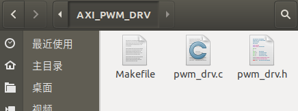

10-37  pwm

图

驱动文件

10.2.5Ubuntu

下编译设备驱动

PWM IP

Ubuntu

接下来就以

的驱动编译为例，进行

环境下编译驱动程序。

make

接下来在该路径打开终端，输入

命令，执行如所示。

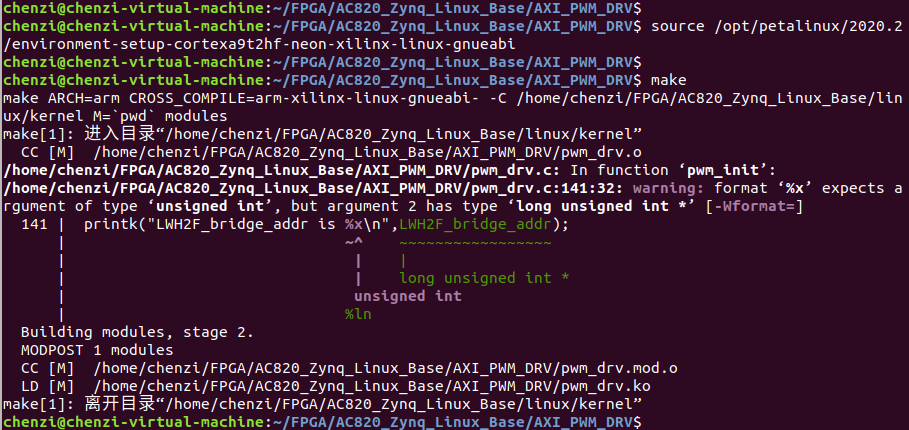

10-38

图

编译驱动程序

10-39

编译成功后，文件夹下会有这些文件，如图

所示。

店铺：

官方网站：

https://xiaomeige.taobao.com

www.corecourse.cn

技术博客：

技术群组：

http://www.cnblogs.com/xiaomeige/

---
*下一页*

小梅哥FPGA 团队    武汉芯路恒科技

专注于培养您的FPGA 独立开发能力   开发板 培训 项目研发三位一体

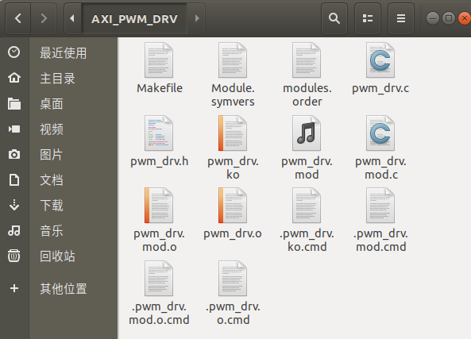

10-39

图

编译的驱动程序文件

pwm_drv.ko

我们要用的是

驱动模块文件。

10.2.6

设计测试程序

PWM

Linux

Linux

以上只是完成了

控制器

驱动的安装。经过安装，已经在

“pwm”

系统中创建了名为

的设备，安装好驱动之后，没有经过应用程序调用，

PWM IP

驱动程序中的各个操作方法是不会主动去执行的。自建的

核由于比较

3

简单，只有

个寄存器，因此其驱动程序测试起来也并不复杂。我们需要在

AXI_PWM_DRV

pwm_test.c

文件，创建一个测试程序“

”来进行测试，以下为

设计的该驱动程序的测试程序清单：

#include

<stdio.h>

#include

<stdlib.h>

#include

<unistd.h>

#include

<sys/ioctl.h>

#include

<errno.h>

#include

<fcntl.h>

包含

头文件

#include

"pwm_drv.h"

/*

pwm_drv.h

*/

定义需要使用的设备名称

#define

DEV_NAME

"/dev/pwm"

/*

*/

int

main

(

int

argc

,

char

*

argv

[]

)

{

设备文件描述符变量

int

fd =

0

;

//

int

data

[

3

]={

0

,

0

,

0

};

int

ret=

0

;

struct

pwm_device *pwm;

pwm = (

struct

pwm_device*)

malloc

(

sizeof

(

struct

pwm_device));

if

(!pwm)

店铺：

官方网站：

https://xiaomeige.taobao.com

www.corecourse.cn

技术博客：

技术群组：

http://www.cnblogs.com/xiaomeige/

---
*下一页*

小梅哥FPGA 团队    武汉芯路恒科技

专注于培养您的FPGA 独立开发能力   开发板 培训 项目研发三位一体

{

printf

(

"malloc error

\n

"

);

return

-

1

;

}

预重装值为

pwm

->

counter_arr

=

9999

;

/*

9999*/

输出比较值为

pwm

->

counter_ccr

=

4999

;

/*

4999*/

控制值为

pwm

->

control

=

1

;

/*

1*/

以可读写方式打开

设备

fd =

open

(DEV_NAME, O_RDWR);

/*

pwm

*/

if

(fd <

0

)

{

perror

(

"Open "

DEV_NAME

" Failed!

\n

"

);

exit

(

1

);

}

else

{

ioctl

(fd, PWM_SET_ARR, &

pwm

->

counter_arr

);

ioctl

(fd, PWM_SET_CCR, &

pwm

->

counter_ccr

);

ioctl

(fd, PWM_SET_CTL, &

pwm

->

control

);

调用

方法读取寄存器数据到用户空

ret =

read

(fd,data,

12

);

/*

read

间的

数组中

data

*/

if

(ret <

0

)

{

printf

(

"read error

\n

"

);

exit

(

1

);

}

打印读取到的数据

/*

*/

printf

(

"Read ARR:

%d

; CCR:

%d

;

Control:

%d

;

\n

"

,

data

[

0

],

data

[

1

],

data

[

2

]);

}

延时

秒钟

usleep

(

10000000

);

/*

10

*/

控制值为

pwm

->

control

=

0

;

/*

0*/

写

寄存器为

，关闭

ioctl

(fd, PWM_SET_CTL, &

pwm

->

control

);

/*

CTL

0

输出

PWM

*/

预重装值为

pwm

->

counter_arr

=

19999

;

/*

19999*/

输出比较值为

pwm

->

counter_ccr

=

7499

;

/*

7499*/

控制值为

pwm

->

control

=

1

;

/*

1*/

ret =

write

(fd, pwm,

12

);

if

(ret <

0

)

{

printf

(

"write error

\n

"

);

exit

(

1

);

}

调用

方法读取寄存器数据到用户空间的

ret =

read

(fd,data,

12

);

/*

read

数组中

data

*/

if

(ret <

0

)

{

printf

(

"read error

\n

"

);

店铺：

官方网站：

https://xiaomeige.taobao.com

www.corecourse.cn

技术博客：

技术群组：

http://www.cnblogs.com/xiaomeige/

---
*下一页*

小梅哥FPGA 团队    武汉芯路恒科技

专注于培养您的FPGA 独立开发能力   开发板 培训 项目研发三位一体

exit

(

1

);

}

printf

(

"Read ARR:

%d

; CCR:

%d

; Control:

%d

;

\n

"

,

pwm

->

counter_arr

,

pwm

->

counter_ccr

,

pwm

->

control

);

控制值为

pwm

->

control

=

0

;

/*

0*/

写

寄存器为

，关闭

ioctl

(fd, PWM_SET_CTL, &

pwm

->

control

);

/*

CTL

0

输出

PWM

*/

close

(fd);

printf

(

"Test done!

\n

"

);

return

0

;

}

➢

open

◼

open()

/dev/pwm

测试中，首先使用

函数打开“

”设备，此时，会调用驱

pwm_open()

pwm_open

动程序中的

函数，在该函数中，会打印一句“

”

的信息。

➢

ioctl

◼

ioctl()

PWM_SET_ARR

打开设备后，使用

函数，通过

、

PWM_SET_CCR

PWM_SET_CTL

ounter_arr

、

三个命令向

、

counter_ccr

control

9999

4999

1

、

三个寄存器中分别写入

、

、

。此时，会

pwm_ioctl()

三次调用驱动程序中的

函数，每次进入该函数，都会打印

pwm_ioctl

一句“

”的信息并打印命令名称。

➢

read

◼

ioctl()

PWM IP

read()

当数据已经通过

写入到

的寄存器中，再使用

函数

读取所有寄存器数据到用户空间中。此时会调用驱动程序中的

pwm_read()

pwm_read

函数，在该函数中，会打印一句“

”的信息，并打

arr

crr

control

read done

印出读取到的

、

、

的值，读取完成后会打印“

”

信息。

➢

write

◼

10

当读取操作完成后，程序会保持该状态

秒钟，以方便用户使用示波

PWM

write()

器、逻辑分析仪等工具查看

引脚的波形，然后再使用

函数

PWM IP

向

中所有寄存器一次性写入新的值。此时会调用驱动程序中的

店铺：

官方网站：

https://xiaomeige.taobao.com

www.corecourse.cn

技术博客：

技术群组：

http://www.cnblogs.com/xiaomeige/

---
*下一页*

小梅哥FPGA 团队    武汉芯路恒科技

专注于培养您的FPGA 独立开发能力   开发板 培训 项目研发三位一体

pwm_write()

pwm_write

函数，在该函数中，会打印一句“

”，然后再打

ioctl

印写入三个寄存器中的值。为了以示区别，写入的值与第一次使用

write done

方式写入的值不相同。写入完成后，打印“

”信息。

write

read

当

操作完成后，再次使用

函数读取寄存器中的值并打印。设计者

PWM

只需要比对新写入的数据与新读出的数据是否相同，以及

实际输出的信

号频率及占空比是否与理论值一致，即可验证驱动程序是否能够正确的完成

PWM IP

10-40

与用户程序的数据交互工作。输入命令编译该应用程序，如图

所

示。

source /opt/petalinux/

2020.2

/environment-setup-cortexa9t2hf-neon-

xilinx-linux-gnueabi

${CC} pwm_test.c -o pwm_test

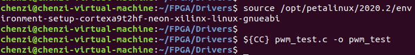

10-40

图

编译应用程序

pwm_test

10-41

会生成应用文件

，如图

所示。

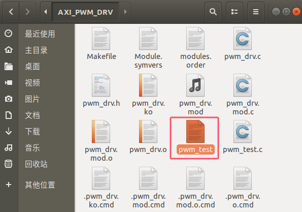

10-41

pwm_test

图

生成

文件

10-42

至此，所需的两个文件已经全部就绪，如图

所示。

店铺：

官方网站：

https://xiaomeige.taobao.com

www.corecourse.cn

技术博客：

技术群组：

http://www.cnblogs.com/xiaomeige/

---
*下一页*

小梅哥FPGA 团队    武汉芯路恒科技

专注于培养您的FPGA 独立开发能力   开发板 培训 项目研发三位一体

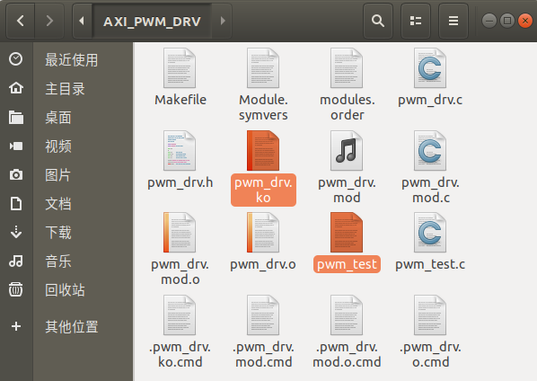

10-42

图

驱动文件

pwm_drv.ko

pwm_test

linux

将

和

复制到上文制作的板载

系统的根文件系的

/home/root/

SD

路径下。到这里

配置完毕，我们可以进行接下来的上板验证。

10.3

板级验证

10.3.1

系统所需硬件

1.AC820-ZYNQ

开发板一个。

2.

(

)

电源线一根

可选

。

3.Type-c

下载线一根。

4.

杜邦线两根。

5.

示波器。

6.

SD

配置的

卡。

10.3.2

硬件连接

10-43

本次系统设计硬件方面连接如图

所示：

1.连接好串口调试接口以及电源接口。

2.

SD

设置开发板板启动模式为

卡启动。

3.

SD

插入配置好的

卡。

店铺：

官方网站：

https://xiaomeige.taobao.com

www.corecourse.cn

技术博客：

技术群组：

http://www.cnblogs.com/xiaomeige/

---
*下一页*

小梅哥FPGA 团队    武汉芯路恒科技

专注于培养您的FPGA 独立开发能力   开发板 培训 项目研发三位一体

4.

PWM

W5

杜邦线一端连接

信号输出引脚

到示波器信号输入口，连接

GND

好

。

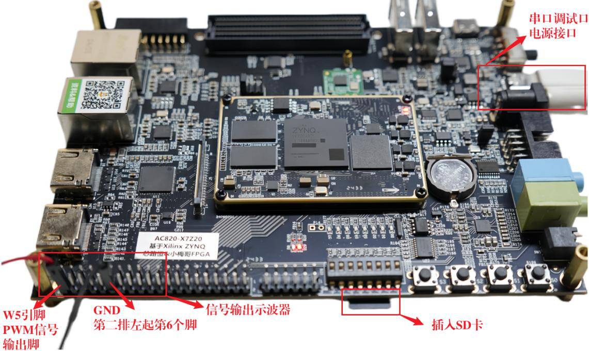

10-43

图

硬件连接图

10.3.3

运行测试

chmod

先使用

修改权限，再在开发板的终端里运行以下两个命令，测试如

10-44

图

所示。

insmod pwm_drv.ko

./pwm_test

店铺：

官方网站：

https://xiaomeige.taobao.com

www.corecourse.cn

技术博客：

技术群组：

http://www.cnblogs.com/xiaomeige/

---
*下一页*

小梅哥FPGA 团队    武汉芯路恒科技

专注于培养您的FPGA 独立开发能力   开发板 培训 项目研发三位一体

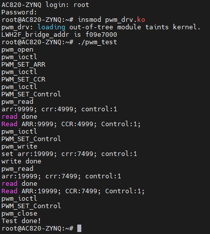

10-44

图

驱动测试

AC820

W5

50%

pwm

如果实验成功的话，

的

脚会输出占空比

的

波，这里的

AXI_PWM IP

100M

pwm

频率由

核输入的频率决定，如果输入的是

，那么

波的

10kHz

50M

pwm

5kHz

10-45

频率为

，

则

频率为

，成比例关系，如图

所示。

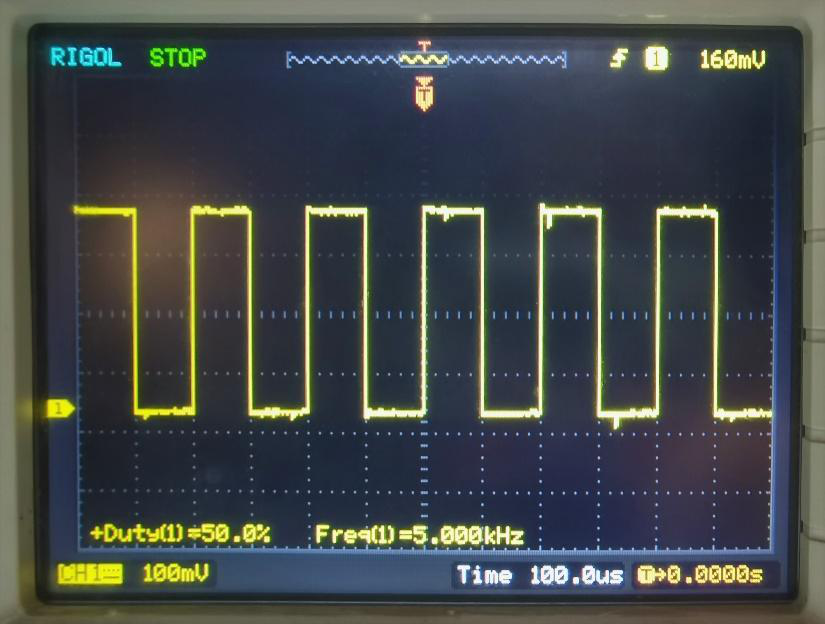

10-45

pwm

图

输出

波

10.4

本章小节

SoC FPGA

Linux

至此，在基于

的系统中，一种典型的应用所需的

侧驱动程

店铺：

官方网站：

https://xiaomeige.taobao.com

www.corecourse.cn

技术博客：

技术群组：

http://www.cnblogs.com/xiaomeige/

---
*下一页*

小梅哥FPGA 团队    武汉芯路恒科技

专注于培养您的FPGA 独立开发能力   开发板 培训 项目研发三位一体

PWM

序就介绍完了。针对

控制器的基本字符型驱动带领读者了解了基本的

Linux

字符型驱动程序的框架以及实现驱动程序与控制器寄存器、驱动程序与用

户空间交互数据的方式。同时给出了针对驱动程序的测试和验证方法。希望读

者能够仔细消化这个驱动程序，理解其中的数据交互方法，并能够举一反三，

FPGA

将其应用到其它的

侧添加的控制器中。

店铺：

官方网站：

https://xiaomeige.taobao.com

www.corecourse.cn

技术博客：

技术群组：

http://www.cnblogs.com/xiaomeige/

---
*下一页*

小梅哥FPGA 团队    武汉芯路恒科技

专注于培养您的FPGA 独立开发能力   开发板 培训 项目研发三位一体

HDL

FPGA

基于

的

逻辑设计与验证教程

AC820

A

该部分内容参考本文档所在相同文件夹，即

开发板配套资料包

盘

01

号文件夹。

店铺：

官方网站：

https://xiaomeige.taobao.com

www.corecourse.cn

技术博客：

技术群组：

http://www.cnblogs.com/xiaomeige/

---
*下一页*

小梅哥FPGA 团队    武汉芯路恒科技

专注于培养您的FPGA 独立开发能力   开发板 培训 项目研发三位一体

C

Zynq

基于

编程的

裸机程序设计与应用教程

AC820

A

该部分内容参考本文档所在相同文件夹，即

开发板配套资料包

盘

01

号文件夹。

店铺：

官方网站：

https://xiaomeige.taobao.com

www.corecourse.cn

技术博客：

技术群组：

http://www.cnblogs.com/xiaomeige/

---
*下一页*

小梅哥FPGA 团队    武汉芯路恒科技

专注于培养您的FPGA 独立开发能力   开发板 培训 项目研发三位一体

修订记录

V1.0

2025-02-11

首次发布

V1.1

2025-11-27

sdk.sh

修改

路径

店铺：

官方网站：

https://xiaomeige.taobao.com

www.corecourse.cn

技术博客：

技术群组：

http://www.cnblogs.com/xiaomeige/

