# 05_AC820-ZYNQ开发板QT环境构建手册V1_0_1
*来源 PDF: `05_AC820-ZYNQ开发板QT环境构建手册V1.0.1.pdf`*

---

小梅哥FPGA 团队    武汉芯路恒科技

专注于培养您的FPGA 独立开发能力   开发板 培训 项目研发三位一体

Qt

ARM

移植

库到嵌入式

平台

章节导读

本章将简要介绍

Qt

框架的基本概念、其在嵌入式开发中的应用，以及为什

么我们需要将

Qt

移植到开发板上。读者将了解到

Qt

的跨平台特性以及它在嵌

入式设备上开发图形界面应用的优势。并且由于petalinux 的工具过于庞大，

许多用户也使用不到petalinux 的其他功能，所以这里给出的是单独交叉编译

Qt 源码的方法，以便于更多不使用petalinux 的用户移植Qt。

在进行实验之前请先点击下方的链接进入论坛下载开发板资料。

https://www.corecourse.cn/forum.php?mod=viewthread&tid=29690

1.1

下载并配置交叉编译工具链

什么是交叉编译工具链？交叉编译工具链是为了在主机上为目标设备编译

代码的一组工具，它包含了编译器、汇编器、链接器、库文件和调试器等。交

叉编译是嵌入式开发中的关键步骤，因为它解决了开发平台与目标设备架构不

同的问题，可以确保生成的程序可以在资源有限的嵌入式设备上正确运行。就

比如我们此次的实验就需要用到它。

7.3.1-2018.05

本次我们交叉编译工具链使用的是

版本，经过我们测试使用此

qt5.9.6

qt

版本的交叉编译工具链可以和

版本兼容，但如果使用其他版本的

可以

qt

自己进行测试或者查询官方推荐交叉编译工具链的版本。现在我们开始移植

https://r

的第一步下载交叉编译工具链（如果想自己从官网进行下载也可以点击

eleases.linaro.org/components/toolchain/binaries/

）。

~/tools

首先将我们提供的交叉编译工具的源码包复制到虚拟机的

路径下（源

AC820

ZYNQ

FPSoC

\07_Linux

码包在网盘下载的：

小梅哥

型

或安路

开发板资料

\ZYNQ7020\AC820_Zynq_Qt\gcc-linaro-7.3.1-2018.05-x86_64_arm-linux-gnue

源码

abihf.tar.xz

），将源码包解压到当前目录下，然后进入到源码包的目录下创建一

gcc_path.sh

:

个

配置环境变量的脚本文件。具体指令如下

cd

~/tools/

店铺：

官方网站：

https://xiaomeige.taobao.com

www.corecourse.cn

技术博客：

技术群组：

http://www.cnblogs.com/xiaomeige/

---
*下一页*

小梅哥FPGA 团队    武汉芯路恒科技

专注于培养您的FPGA 独立开发能力   开发板 培训 项目研发三位一体

tar -xvf

gcc-linaro-7.3.1-2018.05-x86_64_arm-linux-

gnueabihf.tar.xz

cd

gcc-linaro-7.3.1-2018.05-x86_64_arm-linux-gnueabihf/

touch

gcc_path.sh

gedit

gcc_path.sh

gcc_path.sh

:

打开

文件后将如下内容复制到里面

export

PATH

=

/home/$USER/tools/gcc-linaro-7.3.1-2018.05-

x86_64_arm-linux-gnueabihf/bin:

$PATH

source gcc_path.sh

source

保存退出后输入

使配置的环境变量生效（使用

指

source

令只能在当前终端生效，如果创建新终端则需要重新使用

指令）。

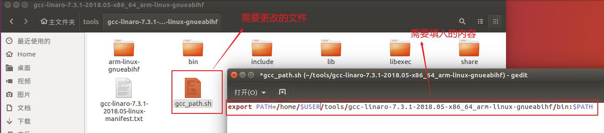

1-1 gcc_path.sh

图

文件的更改

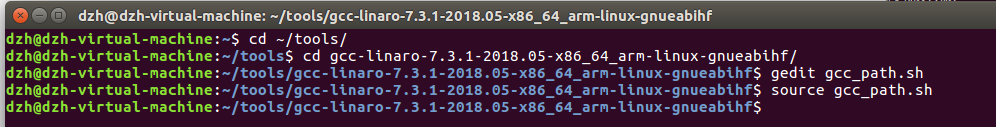

1-2

图

指令输入结果

source

arm

Tab

在使用

指令执行脚本之后也可以通过输入

加两次

键测试环

1-3

1-4

境变量是否设置成功，如图

为没有设置环境变量，如图

为终端设置了环

:

境变量，很明显执行脚本的终端多出了很多工具链

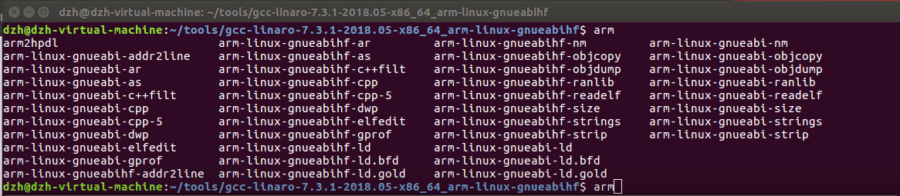

1-3

1

图

对比设置环境变量

店铺：

官方网站：

https://xiaomeige.taobao.com

www.corecourse.cn

技术博客：

技术群组：

http://www.cnblogs.com/xiaomeige/

---
*下一页*

小梅哥FPGA 团队    武汉芯路恒科技

专注于培养您的FPGA 独立开发能力   开发板 培训 项目研发三位一体

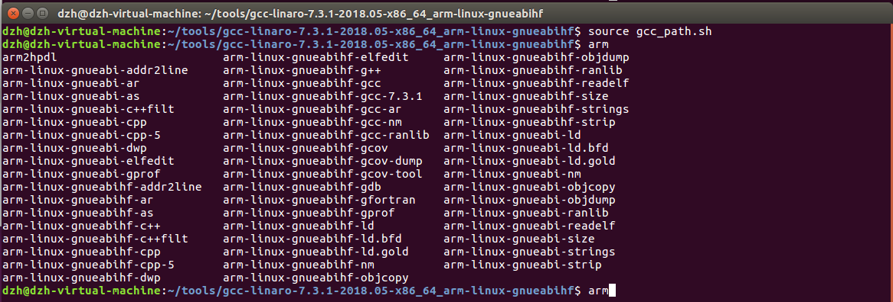

1-4

2

图

对比设置环境变量

arm-linux-gnueabihf-gcc-7.3.1

如果你的打印结果也是和作者一样出现了

就说

明交叉编译工具链已经配置到环境变量里了，后续编译其他的源码就会直接使

用这个工具链了。

1.2

tslib

编译

源码

因为在上一个小节配置好了交叉编译工具链，所以我们就可以开始下一步

tslib

tslib

tslib

编译

源码了。首先需要搞清楚什么是

源码。

源码是指用于触摸屏

tslib

tslib

设备的开源库

的原始代码。

是一个用于处理触摸屏输入事件的轻量级

Linux

库，通常用于嵌入式系统，尤其是在

平台上，帮助处理低层次的触摸屏

输入。

tslib

而交叉编译

源码的主要目的是为了将其移植到与开发环境不同的目标

tslib

平台上，通常用于嵌入式设备。

是一个轻量级的触摸屏处理库，专门用于

Linux

处理

环境下的触摸屏输入。它负责对触摸屏输入的坐标进行校准、过滤

等操作，并将结果传递给上层应用。

tslib

1.21

这次我们选择的

库的版本为

，此版本经过测试可以兼容交叉编译

7.3.1

qt5.9.6

AC820

ZYNQ

工具链

版本和

版本（源码包在网盘下载的：

小梅哥

型

FPSoC

\07_Linux

\ZYNQ7020\AC820_Zynq_Qt\tslib-1.21.ta

或安路

开发板资料

源码

r.gz

tslib

tslib

~/tools

）。那么要编译

源码得先将我们提供的

源码包复制并解压到

https://gitcode.com/gh_mirrors/ts

目录下（如果想自己从官网进行下载也可以点击

l/tslib/

:

），进入刚刚解压的目录。具体指令如下

cd

~/tools/

tar -xvf

tslib-1.

21.tar.gz

店铺：

官方网站：

https://xiaomeige.taobao.com

www.corecourse.cn

技术博客：

技术群组：

http://www.cnblogs.com/xiaomeige/

---
*下一页*

小梅哥FPGA 团队    武汉芯路恒科技

专注于培养您的FPGA 独立开发能力   开发板 培训 项目研发三位一体

cd

tslib-1.21/

tslib

再输入指令进行设置

源码构建信息，比如设置构建的最终位置，设置

1.1

source

构建的工具等等，但是首先得链接交叉编译工具链，如

章节中使用

脚

本指令。

source

~/tools/gcc-linaro-7.3.1-2018.05-x86_64_arm-linux-

gnueabihf/gcc_path.sh

./autogen.sh

./configure --prefix=/home/$USER/tools/tslib-1.21/install \

--host=arm-linux-gnueabihf \

CC=arm-linux-gnueabihf-gcc

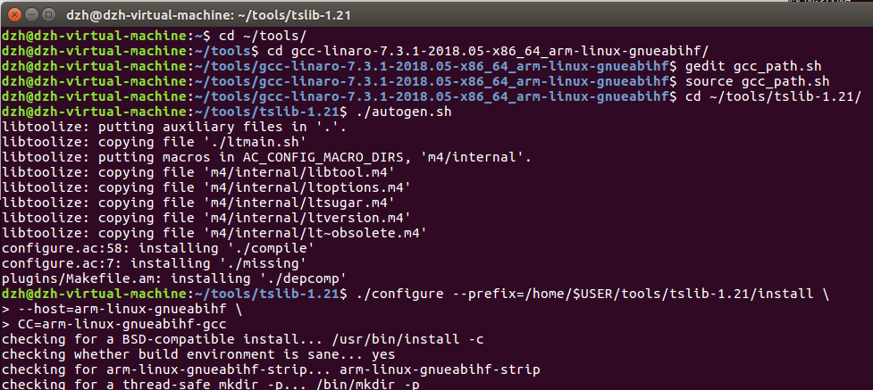

1-5

图

输入指令

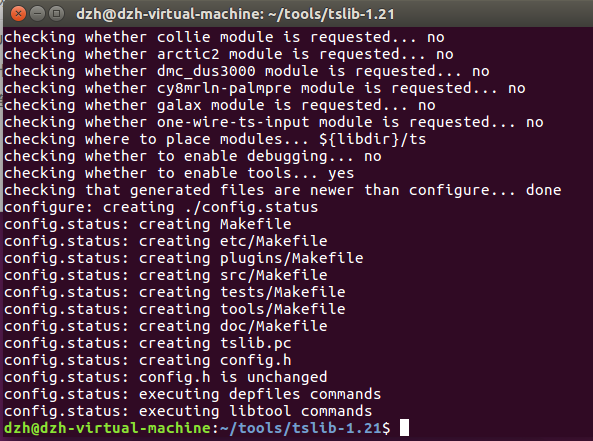

1-6

图

编译成功

店铺：

官方网站：

https://xiaomeige.taobao.com

www.corecourse.cn

技术博客：

技术群组：

http://www.cnblogs.com/xiaomeige/

---
*下一页*

小梅哥FPGA 团队    武汉芯路恒科技

专注于培养您的FPGA 独立开发能力   开发板 培训 项目研发三位一体

:

构建完成后就是进行安装了

make -j16

make

install

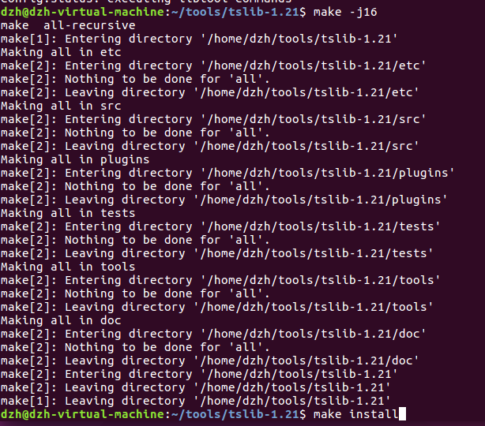

1-7 make

图

成功

1-8 install

图

成功

install

bin

安装成功后会在

文件夹下我们可以看到五个文件夹，

目录下存放

tslib

etc

tslib

include

了一些

提供的测试工具，

目录下存放了

相关的配置文件，

tslib

目录下存放了

相关头文件。

店铺：

官方网站：

https://xiaomeige.taobao.com

www.corecourse.cn

技术博客：

技术群组：

http://www.cnblogs.com/xiaomeige/

---
*下一页*

小梅哥FPGA 团队    武汉芯路恒科技

专注于培养您的FPGA 独立开发能力   开发板 培训 项目研发三位一体

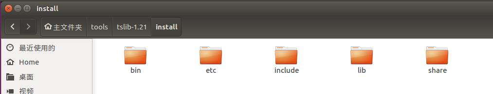

1-9

图

成功生成目录

1-10

:

如下图

就是之后移植会用到的触摸的库文件的一部分

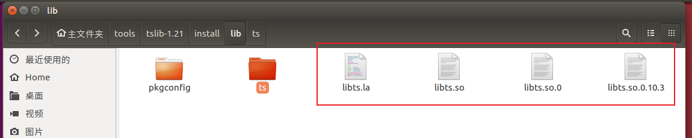

1-10 tslib

图

库文件

tslib

Qt

这一节交叉编译

源码的操作也就是相当于下一节编译

源码的试手而

Qt

已，操作大致相同但是交叉编译

源码更大也更繁杂更重要。

1.3

Qt

交叉编译编译

源码

前面几个小节我们已经将交叉编译工具链和触摸库安装好了，接下来就可

Qt

以开始

源码的交叉编译编译了。

Qt

Qt

Qt

但是首先得搞清楚什么是

源码。

源码是指构成

框架的原始代码文

C++

QML

JavaScript

件。这些文件用

和其他脚本语言（如

、

等）编写，包含了

Qt

Qt

框架的所有功能、模块和工具。通过编译这些源码，可以生成

库以及各种

开发工具。

Qt

1

那又为什么要交叉编译

源码呢？（

）开发环境和目标平台不同。我们一

x86

PC

Windows

Linux

Qt

般是在

架构的

端（如

、

）上进行

开发，但目标设备一

ARM

Qt

Q

般是嵌入式平台（如

架构的开发板）。为了能兼容运行

应用，需要对

t

2

库进行交叉编译。（

）嵌入式系统需求。对于嵌入式开发，这些设备的硬件资

Qt

源有限，无法在目标设备上直接编译

源码，需要通过开发主机上进行交叉编

译，生成可以在目标设备上运行的二进制文件，避免占用目标设备有限的资源。

3

Qt

Qt

（

）定制

库。比如我们只使用

库中的某些功能，减小库的大小亦或者添

Qt

加特定硬件支持，那么就需要重新编译

源码，而在目标平台上直接编译显然

店铺：

官方网站：

https://xiaomeige.taobao.com

www.corecourse.cn

技术博客：

技术群组：

http://www.cnblogs.com/xiaomeige/

---
*下一页*

小梅哥FPGA 团队    武汉芯路恒科技

专注于培养您的FPGA 独立开发能力   开发板 培训 项目研发三位一体

不现实，因此需要在开发主机上进行交叉编译。

Qt

既然说明清楚了为什么要交叉编译

源码那么就要开始动手进行实验了。

Qt

5.9.6

Qt

这次我们选择的

源码的版本为

，此

版本经过多次测试可以兼容我们

前面配置好的交叉编译工具链和触摸库，当然如果你有需要也可以切换为其他

Qt

tslib

版本的

源码，但是相应的得查看官方的文档以保持交叉编译工具链和

与

Qt

Qt

https://download.qt.io

源码版本的一致性（这里我们也给出

官网的下载链接

/

）。

Qt

~/tools

首先将我们提供的

源码包复制并解压到虚拟机的

目录下（源码包

AC820

ZYNQ

FPSoC

\07_Linux

在网盘下载的：

小梅哥

型

或安路

开发板资料

源码

\ZYNQ7020\AC820_Zynq_Qt\qt-everywhere-opensource-src-5.9.6.tar.xz

），修改当前

qtbase/mkspecs/linux-arm-gnueabi-g++/qmake.conf

目录下的

配置文件以适应我们

:

自己搭建的环境，修改内容如下（请注意修改为自己的安装路径）

#

# qmake configuration

for

building with arm

-

linux

-

gnueabi

-

g

++

#

MAKEFILE_GENERATOR

=

UNIX

CONFIG

+=

incremental

QMAKE_INCREMENTAL_STYLE

=

sublib

include

(..

/

common

/

linux.conf)

include

(..

/

common

/

gcc

-

base

-

unix.conf)

include

(..

/

common

/

g

++-

unix.conf)

QT_QPA_DEFAULT_PLATFORM

=

linuxfb

QMAKE_CFLAGS

+=

-

O2

-

mcpu

=

cortex

-

a9

QMAKE_CXXFLAGS

+=

-

O2

-

mcpu

=

cortex

-

a9

QMAKE_INCDIR

+=

/

home

/

$USER

/

tools

/

tslib

-

1.21

/

install

/

include

QMAKE_LIBDIR

+=

/

home

/

$USER

/

tools

/

tslib

-

1.21

/

install

/

lib

店铺：

官方网站：

https://xiaomeige.taobao.com

www.corecourse.cn

技术博客：

技术群组：

http://www.cnblogs.com/xiaomeige/

---
*下一页*

小梅哥FPGA 团队    武汉芯路恒科技

专注于培养您的FPGA 独立开发能力   开发板 培训 项目研发三位一体

# modifications to g

++

.conf

QMAKE_CC

=

/

home

/

$USER

/

tools

/

gcc

-

linaro

-

7.3.1

-

2018.05

-

x86_64_arm

-

linux

-

gnueabihf

/

bin

/

arm

-

linux

-

gnueabihf

-

gcc

QMAKE_CXX

=

/

home

/

$USER

/

tools

/

gcc

-

linaro

-

7.3.1

-

2018.05

-

x86_64_arm

-

linux

-

gnueabihf

/

bin

/

arm

-

linux

-

gnueabihf

-

g

++

QMAKE_LINK

=

/

home

/

$USER

/

tools

/

gcc

-

linaro

-

7.3.1

-

2018.05

-

x86_64_arm

-

linux

-

gnueabihf

/

bin

/

arm

-

linux

-

gnueabihf

-

g

++

QMAKE_LINK_SHLIB

=

/

home

/

$USER

/

tools

/

gcc

-

linaro

-

7.3.1

-

2018.05

-

x86_64_arm

-

linux

-

gnueabihf

/

bin

/

arm

-

linux

-

gnueabihf

-

g

++

# modifications to linux.conf

QMAKE_AR

=

arm

-

linux

-

gnueabihf

-

ar cqs

QMAKE_OBJCOPY

=

arm

-

linux

-

gnueabihf

-

objcopy

QMAKE_NM

=

arm

-

linux

-

gnueabihf

-

nm

-

P

QMAKE_STRIP

=

arm

-

linux

-

gnueabihf

-

strip

load

(qt_config)

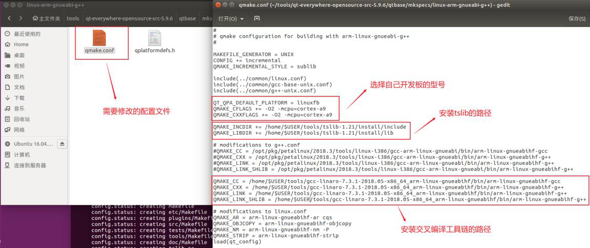

1-11

qmake.conf

图

修改

文件

保存并退出。

qt5.9.6_conf.sh

紧接着创建

脚本，这个文件是用来配置构建的信息，比如安

装位置信息、跳过构建某些功能等。添加如下内容（请注意修改为自己最终生

:

成的路径）

店铺：

官方网站：

https://xiaomeige.taobao.com

www.corecourse.cn

技术博客：

技术群组：

http://www.cnblogs.com/xiaomeige/

---
*下一页*

小梅哥FPGA 团队    武汉芯路恒科技

专注于培养您的FPGA 独立开发能力   开发板 培训 项目研发三位一体

./configure -prefix

/home/

$USER

/tools/qt-everywhere-

opensource-src-5.9.6/install

\

-opensource \

-confirm-license \

-release \

-strip \

-shared \

-xplatform

linux-arm-gnueabi-g++

\

-optimized-qmake \

-c++std

c++

11

\

--rpath=no \

-pch \

-skip

qt3d

\

-skip

qtactiveqt

\

-skip

qtandroidextras

\

-skip

qtcanvas3d

\

-skip

qtcharts

\

-skip

qtconnectivity

\

-skip

qtdatavis3d

\

-skip

qtdeclarative

\

-skip

qtdoc

\

-skip

qtgamepad

\

-skip

qtgraphicaleffects

\

-skip

qtlocation

\

-skip

qtmacextras

\

-skip

qtnetworkauth

\

-skip

qtpurchasing

\

-skip

qtquickcontrols

\

-skip

qtquickcontrols2

\

-skip

qtremoteobjects

\

-skip

qtscript

\

店铺：

官方网站：

https://xiaomeige.taobao.com

www.corecourse.cn

技术博客：

技术群组：

http://www.cnblogs.com/xiaomeige/

---
*下一页*

小梅哥FPGA 团队    武汉芯路恒科技

专注于培养您的FPGA 独立开发能力   开发板 培训 项目研发三位一体

-skip

qtscxml

\

-skip

qtsensors

\

-skip

qtspeech

\

-skip

qtsvg

\

-skip

qttools

\

-skip

qttranslations

\

-skip

qtwayland

\

-skip

qtwebchannel

\

-skip

qtwebengine

\

-skip

qtwebsockets

\

-skip

qtwebview

\

-skip

qtwinextras

\

-skip

qtx11extras

\

-skip

qtxmlpatterns

\

-make

libs

-make

examples

\

-nomake

tools

-nomake

tests

\

-gui \

-widgets \

-dbus-runtime \

--glib=no \

--iconv=no \

--pcre=qt \

--zlib=qt \

-no-openssl \

--freetype=qt \

--harfbuzz=qt \

-no-opengl \

-linuxfb \

--xcb=no \

-tslib \

--libpng=qt \

店铺：

官方网站：

https://xiaomeige.taobao.com

www.corecourse.cn

技术博客：

技术群组：

http://www.cnblogs.com/xiaomeige/

---
*下一页*

小梅哥FPGA 团队    武汉芯路恒科技

专注于培养您的FPGA 独立开发能力   开发板 培训 项目研发三位一体

--libjpeg=qt \

--sqlite=qt

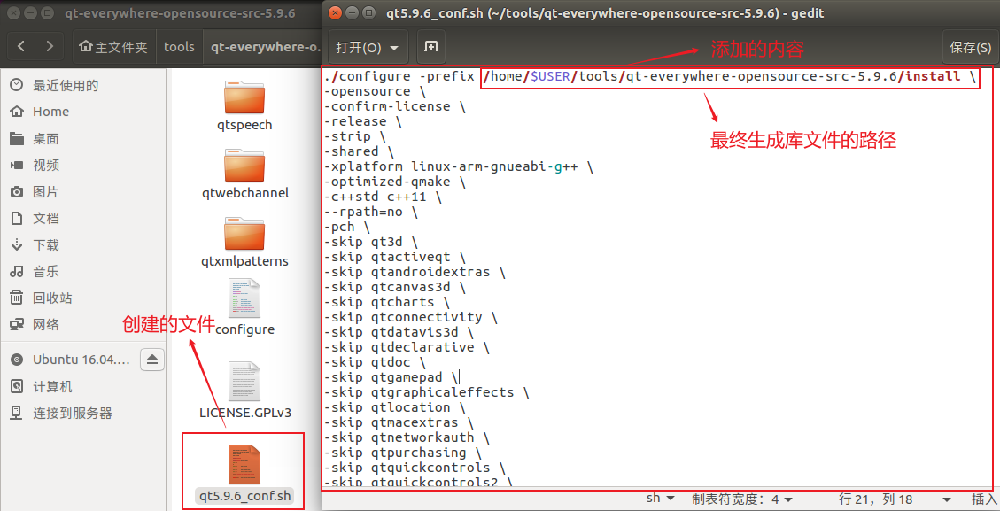

1-12

qt5.9.6_conf.sh

图

创建

文件

(

)

然后运行此脚本进行配置

可能会需要一部分时间

，但是首先得链接交叉编

1.1

source

:

译工具链，如

章节中使用

脚本指令。

source

~/tools/gcc-linaro-7.3.1-2018.05-x86_64_arm-linux-

gnueabihf/gcc_path.sh

./qt5.9.6_conf.sh

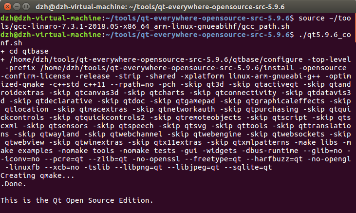

1-13

qt5.9.6_conf.sh

图

运行

脚本

店铺：

官方网站：

https://xiaomeige.taobao.com

www.corecourse.cn

技术博客：

技术群组：

http://www.cnblogs.com/xiaomeige/

---
*下一页*

小梅哥FPGA 团队    武汉芯路恒科技

专注于培养您的FPGA 独立开发能力   开发板 培训 项目研发三位一体

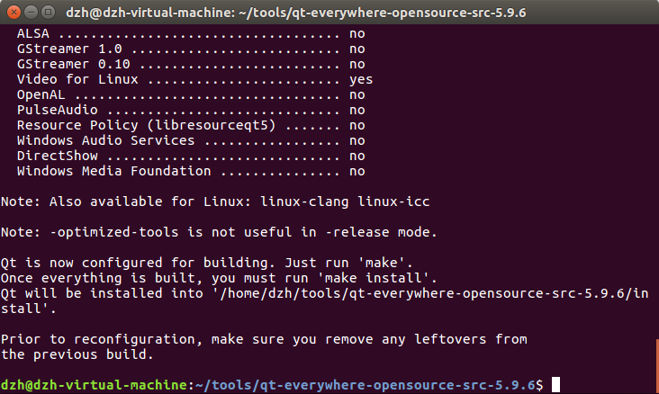

1-14

图

运行脚本成功

make

:

配置完成后使用

指令进行编译和安装

make -j16

make

install

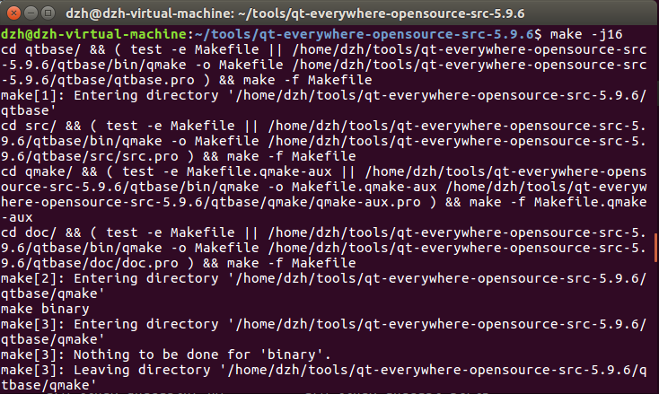

1-15

make

图

输入

指令

店铺：

官方网站：

https://xiaomeige.taobao.com

www.corecourse.cn

技术博客：

技术群组：

http://www.cnblogs.com/xiaomeige/

---
*下一页*

小梅哥FPGA 团队    武汉芯路恒科技

专注于培养您的FPGA 独立开发能力   开发板 培训 项目研发三位一体

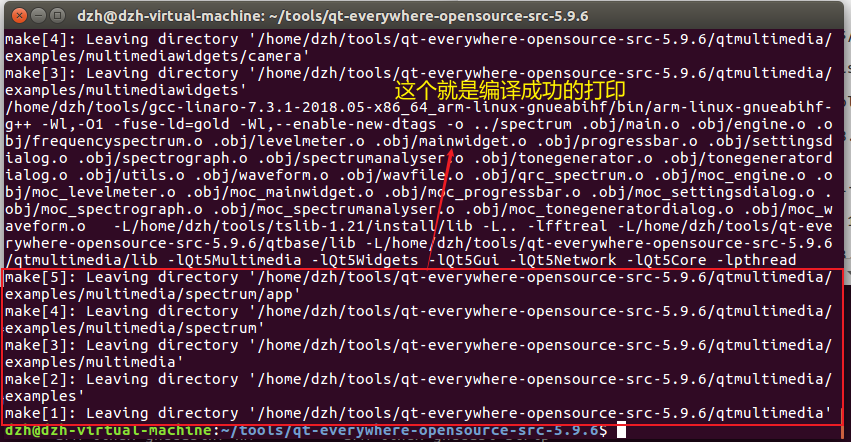

1-16

图

编译完成

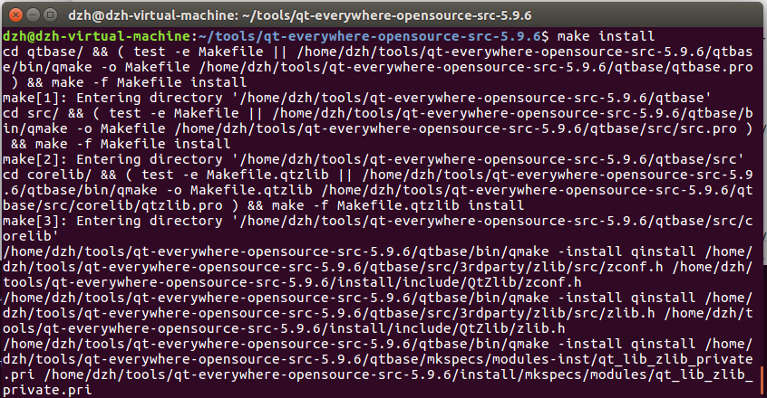

1-17

图

输入安装指令

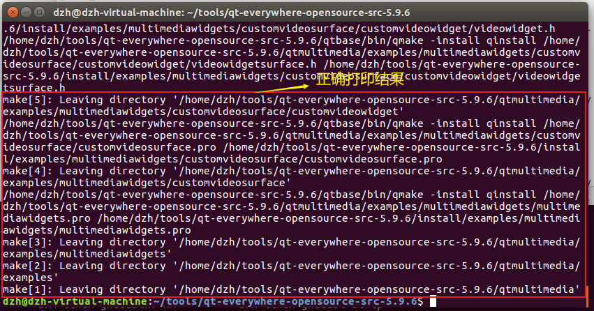

1-18

图

安装完成

/home/$USER/tools/qt-everywhere-opensource-src-5.9.6/install

然后可以进入

路

店铺：

官方网站：

https://xiaomeige.taobao.com

www.corecourse.cn

技术博客：

技术群组：

http://www.cnblogs.com/xiaomeige/

---
*下一页*

小梅哥FPGA 团队    武汉芯路恒科技

专注于培养您的FPGA 独立开发能力   开发板 培训 项目研发三位一体

:

径下查看刚刚生成的文件

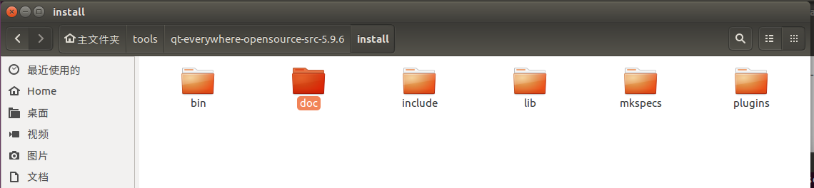

1-19

图

生成的文件夹

:

查看生成的库文件

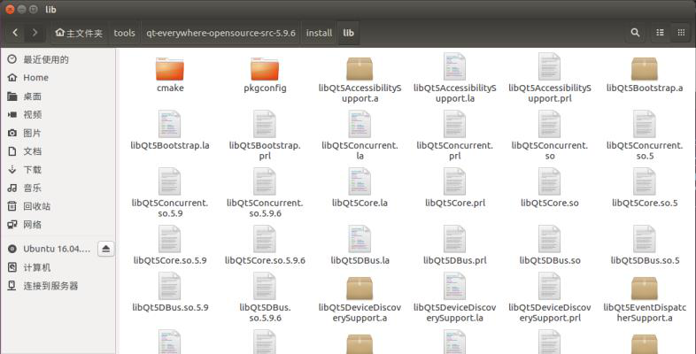

1-20

图

成功生成库文件

buildroot

这些库文件将会在后续移植的部分用到。下一节就是使用

工具构

Qt

建根文件系统了，虽然和移植

的关系不是特别紧密，但是一个干净的根文件

系统可以大幅度减少移植过程中出现会的问题。

1.4

buildroot

使用

构建根文件系统

Buildroot

Linux

是一个开源的构建系统，专门用于为嵌入式

系统生成完整

Linux

的系统镜像。它提供了一套工具来自动化生成根文件系统、

内核、工具

Bootloader

Lin

链、

以及各种软件包。为什么我们会使用它呢，因为它是嵌入式

ux

系统开发中的一个重要工具，可以用来快速生成轻量级、可定制的根文件系

buildroot

统以及相关工具链、内核和用户空间应用，使用

可以大幅度减少我们

buildroot

构建根文件系统的流程。接下来将教你如何安装和使用

工具。

在使用buildroot 之前，先点击下面的网址进入到我们的论坛，然后点击

提供网盘链接，下载其中中的镜像文件并且烧录到SD 卡里:

https://www.corecourse.cn/forum.php?mod=viewthread&tid=29690

店铺：

官方网站：

https://xiaomeige.taobao.com

www.corecourse.cn

技术博客：

技术群组：

http://www.cnblogs.com/xiaomeige/

---
*下一页*

小梅哥FPGA 团队    武汉芯路恒科技

专注于培养您的FPGA 独立开发能力   开发板 培训 项目研发三位一体

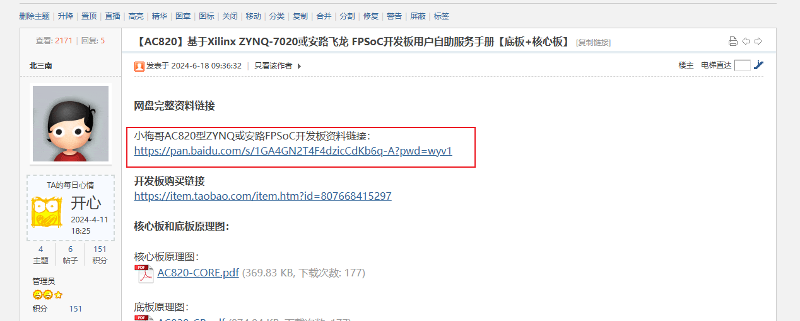

1-21

图

选择网盘链接

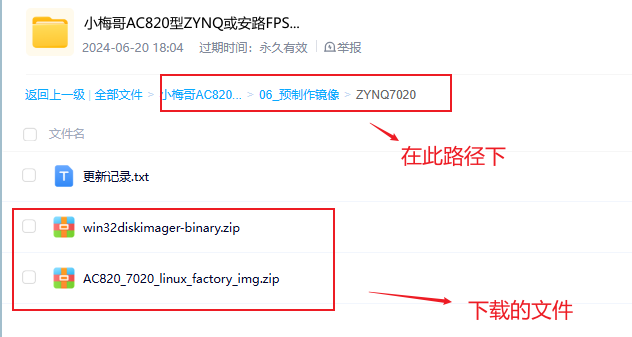

1-22

图

下载两个文件

SD

:

AC820-ZYNQ

SD

烧录

卡教程请参考如下链接教程

【

】

系统启动卡制作

- AC820-ZYNQ

-

- Powered by Discuz! (corecourse.cn)

开发板

芯路恒电子技术论坛

buildroot-2019.02.6.tar.gz

~/tools

首先将我们提供的

包复制并解压到虚拟机的

AC820

ZYNQ

FPSoC

目录下（源码包在网盘下载的：

小梅哥

型

或安路

开发板资

\07_Linux

\ZYNQ7020\AC820_Zynq_Qt\buildroot-2019.02.6.tar.gz

:

料

源码

）

cd

~/tools/

tar -xvf

buildroot-2019.

02.6.tar.gz

cd

buildroot-2019.02.6/

店铺：

官方网站：

https://xiaomeige.taobao.com

www.corecourse.cn

技术博客：

技术群组：

http://www.cnblogs.com/xiaomeige/

---
*下一页*

小梅哥FPGA 团队    武汉芯路恒科技

专注于培养您的FPGA 独立开发能力   开发板 培训 项目研发三位一体

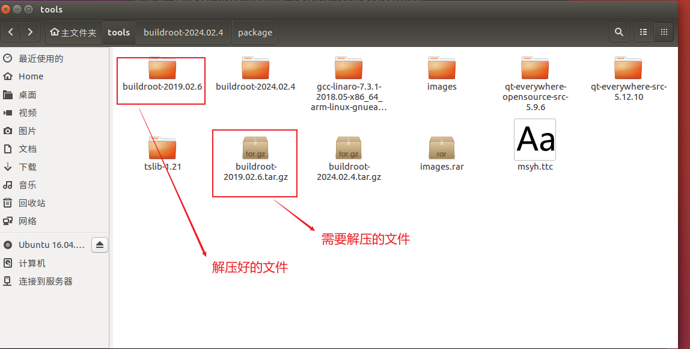

1-23

buildroot

图

解压

UI

1.1

输入如下指令打开

配置界面，但是首先得链接交叉编译工具链，如

章

source

:

节中使用

脚本指令。

source

~/tools/gcc-linaro-7.3.1-2018.05-x86_64_arm-linux-

gnueabihf/gcc_path.sh

sudo

make

menuconfig

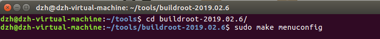

1-24

make

图

输入

指令

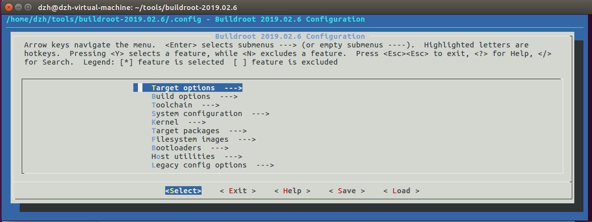

1-25 UI

图

配置界面

(

):

配置如下选项

如果你的开发板不同，也可以根据自己的开发板进行配置

1.

Target options

配置

（主要是配置架构相关）

1)

Target Architecture

ARM(

)

如图将

设置为

小端模式

。

店铺：

官方网站：

https://xiaomeige.taobao.com

www.corecourse.cn

技术博客：

技术群组：

http://www.cnblogs.com/xiaomeige/

---
*下一页*

小梅哥FPGA 团队    武汉芯路恒科技

专注于培养您的FPGA 独立开发能力   开发板 培训 项目研发三位一体

2)

Target Binary Format

ELF

将

设置为

模式。

3)

Target Architecture Variant

cortex-A9

将

选择

型号。

4)

Enable NEON SIMD extension support

不启用

扩展支持

5)

Enable VFP extension support

(

Target

启用

扩展支持

不启用则会导致

ABI

EABIhf)

无法选择

。

6)

Target ABI

EABIhf

将

设置为

模式。

7)

Floating point strategy

VFPv3-D16

将

设置为

模式。

8)

ARM instruction set

ARM

将

选择为

。

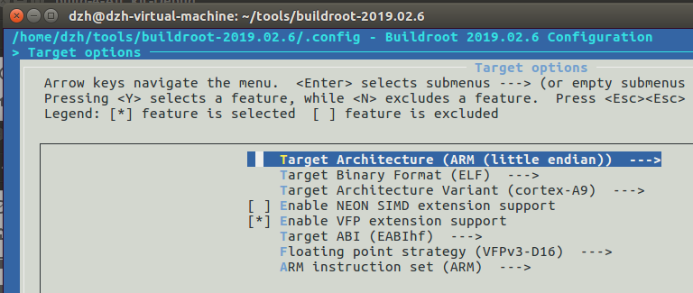

1-26

Target options

图

配置

2.

Build options(

配置

主要是配置构建过程通用选项，比如启用多线程编译等

)

功能，可以直接跳过

。

3.

Toolchain(

buildroot

配置

主要是配置构建相关工具链的，因为

是从网络上

下载工具链构建，此过程会很漫长且容易发生错误。所以这里我们选择自己的

):

下载安装的交叉编译工具链

1)

Toolchain type

External toolchain

如图将

选择

为外部提供的工具链，

buildroot

而不是

自行构建。

2)

Toolchain

Custom toolchain

将

选择为

为自定义工具链。

3)

Toolchain origin

Pre-installed toolchain

将

选择

为预安装的工具链。

4)

Toolchain path

(

将自己交叉编译工具的绝对路径填写到

里

就是之前

)

安装的编译工具

。

5)

arm-linux-gnueabihf

Toolchain prefix

指定工具链前缀

填入到

里。

店铺：

官方网站：

https://xiaomeige.taobao.com

www.corecourse.cn

技术博客：

技术群组：

http://www.cnblogs.com/xiaomeige/

---
*下一页*

小梅哥FPGA 团队    武汉芯路恒科技

专注于培养您的FPGA 独立开发能力   开发板 培训 项目研发三位一体

6)

External toolchain gcc version

7.x

将

版本设置为

。

7)

External toolchain kernel headers series

4.10.x

将

版本设置为

。

8)

External toolchain C library

glibc/eglibc

将

选择为

。

9)

SSP

RPC

C++

Fortran

启用

、

、

和

四项支持。

10)

MMU

最后使能

支持。

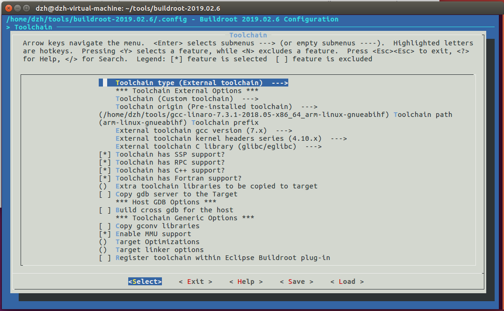

1-27

Toolchain

图

配置

4.

System configuration(

配置

主要是配置开发板登陆信息的，在当前界面只

):

需要配置两项即可

1)

Enable root login with password

如图使能

。

2)

root

Root password

输入

设置为

。

店铺：

官方网站：

https://xiaomeige.taobao.com

www.corecourse.cn

技术博客：

技术群组：

http://www.cnblogs.com/xiaomeige/

---
*下一页*

小梅哥FPGA 团队    武汉芯路恒科技

专注于培养您的FPGA 独立开发能力   开发板 培训 项目研发三位一体

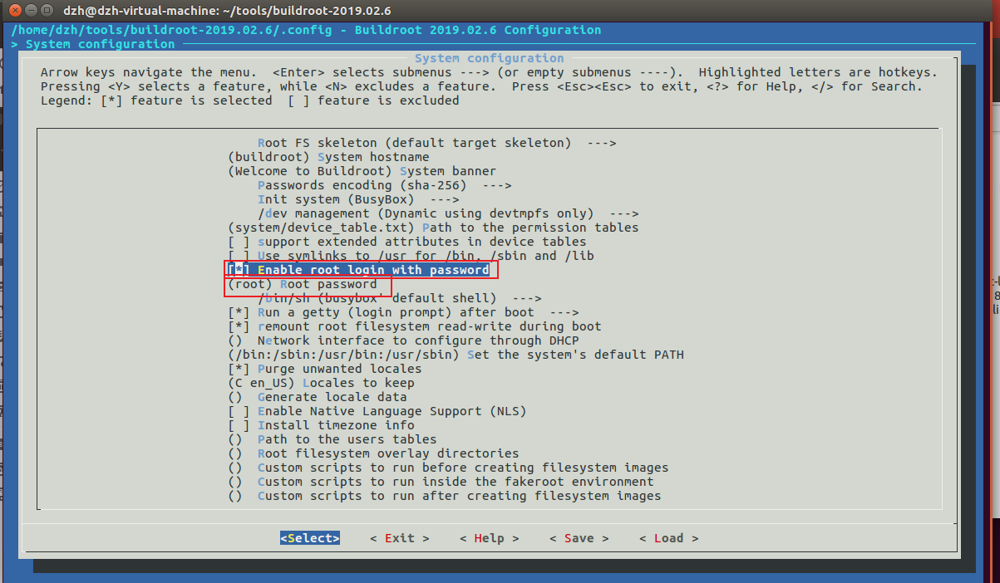

1-28

System configuration

图

配置

5.

Kernel(

)

1-29:

配置

取消构建内核，启用构建内核会导致版本冲突

如图

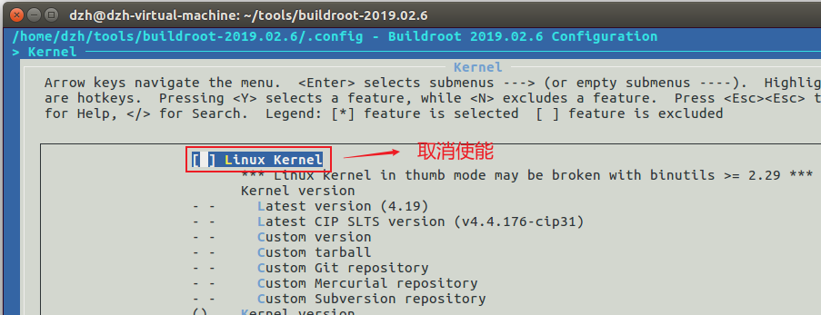

1-29

Kernel

图

配置

6.

Target packages

:

配置

（主要是配置添加一些工具软件包的）

Networking applications

:

当前界面什么都不需要配置，只需要进入到

界面

店铺：

官方网站：

https://xiaomeige.taobao.com

www.corecourse.cn

技术博客：

技术群组：

http://www.cnblogs.com/xiaomeige/

---
*下一页*

小梅哥FPGA 团队    武汉芯路恒科技

专注于培养您的FPGA 独立开发能力   开发板 培训 项目研发三位一体

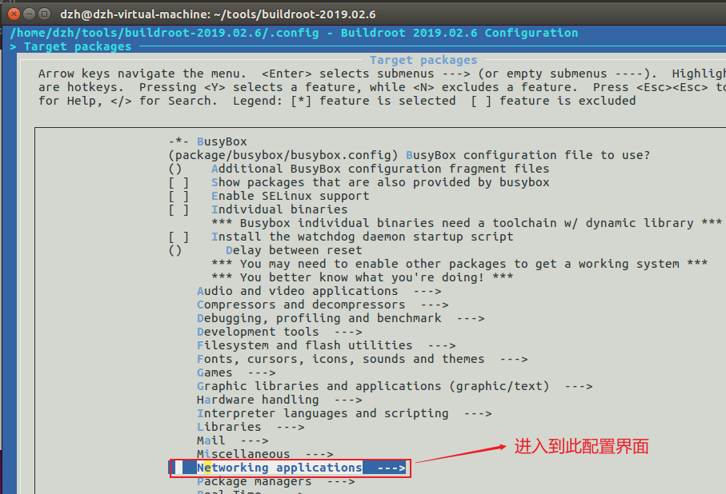

1-30

Target packages

图

配置

这四个配置主要用于提供设备的网络配置、远程访问和网络接口的管理。

1)

dhcpcd

IP

如图使能

。自动为设备配置

地址，简化网络配置。

2)

dropbear

SSH

使能

。轻量级

服务器，适合嵌入式设备和资源有限的

系统，提供远程访问。

3)

ethtool

使能

。管理网络接口设备，查看和修改以太网设备参数，进

行网络故障排查。

4)

openssh(

)

SSH

使能

其他的根据需要配置

。通用的

服务器，用于安全

远程访问和文件传输，适合各种服务器和嵌入式设备。

店铺：

官方网站：

https://xiaomeige.taobao.com

www.corecourse.cn

技术博客：

技术群组：

http://www.cnblogs.com/xiaomeige/

---
*下一页*

小梅哥FPGA 团队    武汉芯路恒科技

专注于培养您的FPGA 独立开发能力   开发板 培训 项目研发三位一体

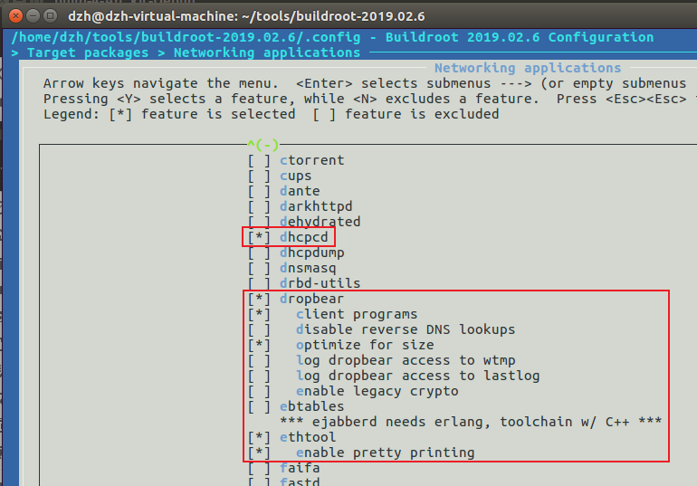

1-31

图

使能三项

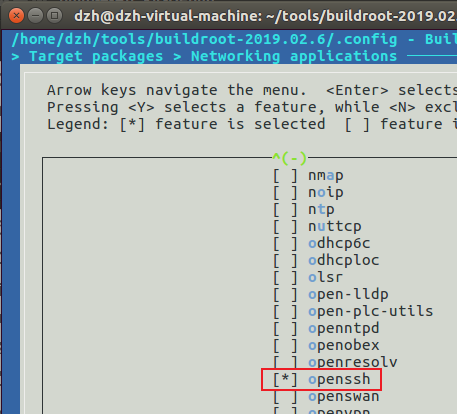

1-32

图

使能一项

7.

Filesystem images

配置

（主要是配置构建出的根文件系统格式的）

1)

ext2/3/4 root filesystem

ext2/3/4 variant

ext4

如图使能

。在

选择

格式

ext4

（因为

最被广泛使用比其他的更强大所以选择此项）。

2)

tar the root filesystem

Compression method

gzip

使能

。在

选择

格式

gzip

（因为

兼容性比较好所以选择此项）。

店铺：

官方网站：

https://xiaomeige.taobao.com

www.corecourse.cn

技术博客：

技术群组：

http://www.cnblogs.com/xiaomeige/

---
*下一页*

小梅哥FPGA 团队    武汉芯路恒科技

专注于培养您的FPGA 独立开发能力   开发板 培训 项目研发三位一体

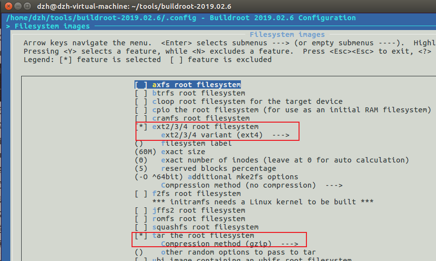

1-33

图

使能文件格式

8.

剩下的配置都可以根据自己需求来，如果只是需要启动则上述配置足够

了。

根据上述操作配置完成后就可以开始构建根文件系统了，先将刚刚配置保

1-34:

存并退出。图

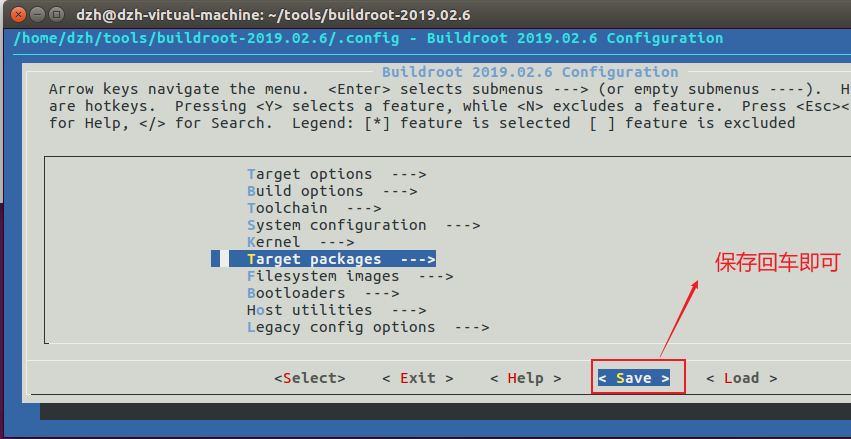

1-34

图

保存配置

输入如下指令进行编译

sudo

make

店铺：

官方网站：

https://xiaomeige.taobao.com

www.corecourse.cn

技术博客：

技术群组：

http://www.cnblogs.com/xiaomeige/

---
*下一页*

小梅哥FPGA 团队    武汉芯路恒科技

专注于培养您的FPGA 独立开发能力   开发板 培训 项目研发三位一体

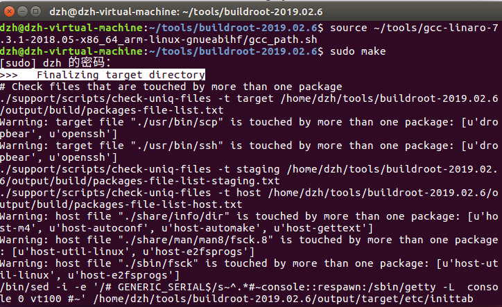

1-35 make

图

指令

此过程可能需要一段时间，耐心等待。

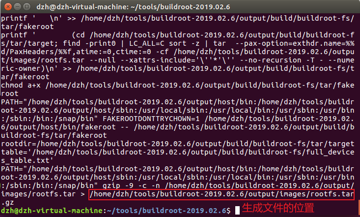

1-36

图

构建完成

buildroot-2019.02.6/output/images/

:

结束后进入到

可以查看到生成的包文件

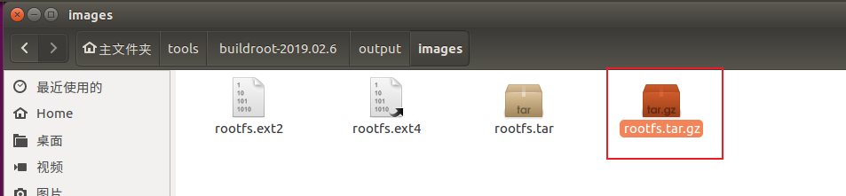

1-37

图

生成的包文件

SD

:

然后将需要写入根文件系统的

卡连接到虚拟机中

店铺：

官方网站：

https://xiaomeige.taobao.com

www.corecourse.cn

技术博客：

技术群组：

http://www.cnblogs.com/xiaomeige/

---
*下一页*

小梅哥FPGA 团队    武汉芯路恒科技

专注于培养您的FPGA 独立开发能力   开发板 培训 项目研发三位一体

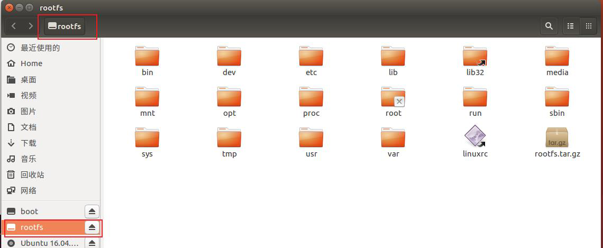

1-38

SD

图

连接

卡

rootfs

(

右键打开当前界面的终端输入如下指令清空

分区

在输入指令之前请

):

确保没有需要备份的文件

sudo

rm

-rf

/media/

$

USER/rootfs/*

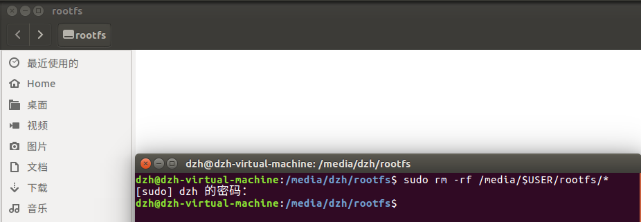

1-39

rootfs

图

清空

空间

rootfs

:

解压刚刚生成的根文件系统包到

下

sudo

tar

--strip-components=1 -xvzf

~/tools/buildroot-

2019.02.6/output/images/rootfs.tar.gz

-C

.

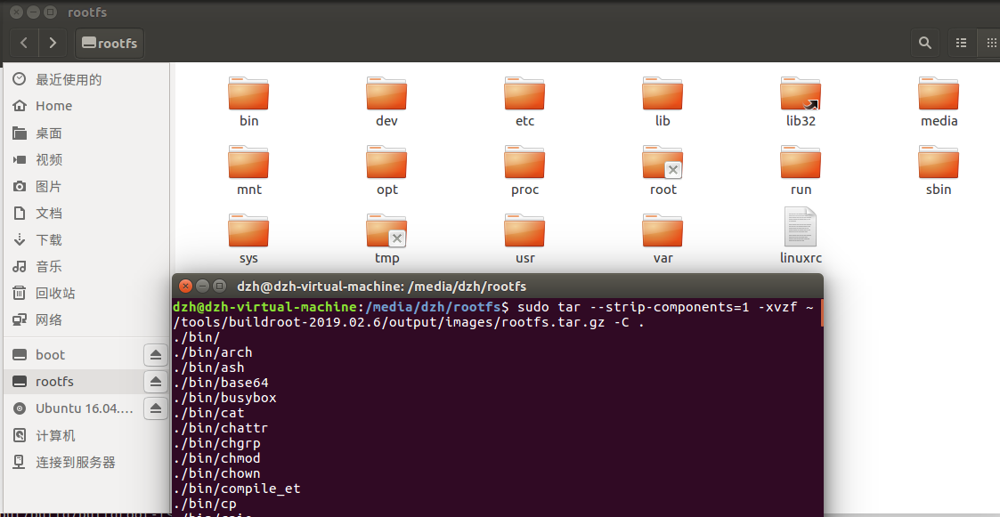

1-40

图

解压到当前路径

店铺：

官方网站：

https://xiaomeige.taobao.com

www.corecourse.cn

技术博客：

技术群组：

http://www.cnblogs.com/xiaomeige/

---
*下一页*

小梅哥FPGA 团队    武汉芯路恒科技

专注于培养您的FPGA 独立开发能力   开发板 培训 项目研发三位一体

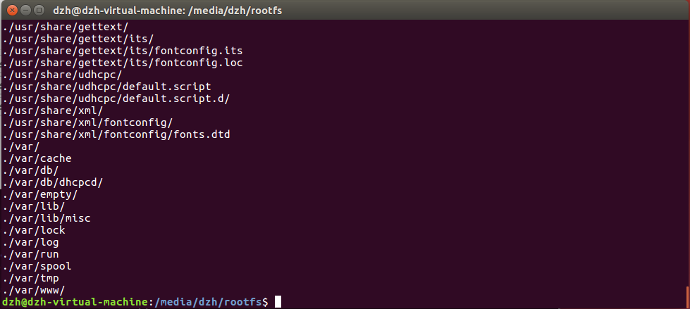

1-41

图

解压成功

profile

:

修改

文件以显示跟踪路径

cd

/media/

$USER

/rootfs/etc

sudo

vim

profile

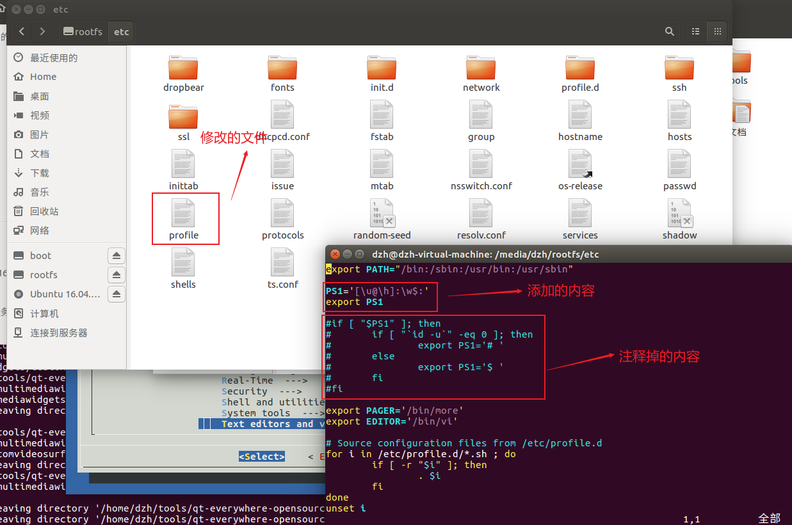

1-42

profile

图

修改

文件

PS1

=

'[\u@\h]:\w$:'

export

PS1

Esc

:wq

:

wq

按下

后输入

（这个“

”和“

”都是要输入的）

回车就会保存并退

出。

SD

root

:

测试启动，弹出

卡插入到开发板然后启动，输入

登陆

店铺：

官方网站：

https://xiaomeige.taobao.com

www.corecourse.cn

技术博客：

技术群组：

http://www.cnblogs.com/xiaomeige/

---
*下一页*

小梅哥FPGA 团队    武汉芯路恒科技

专注于培养您的FPGA 独立开发能力   开发板 培训 项目研发三位一体

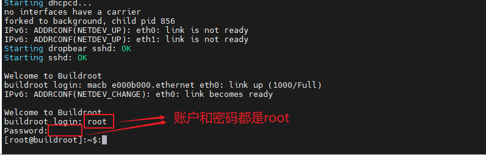

1-43

图

测试网口功能

ifconfig

ifconfig

:

测试

，输入

回车查看打印信息

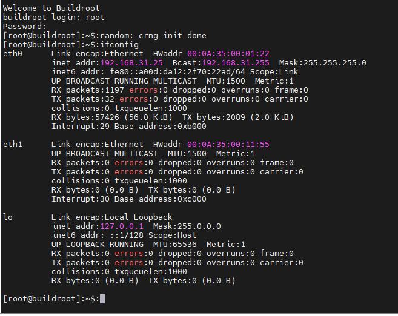

1-44

0

图

网口

已连接

Qt

到这里根文件系统就成功部署好了，下一小节就是对

软件的环境搭建了，

1.6

如果对这部分不感兴趣也可以直接到

章移植库。

1.5

Qt

Qt

搭建

软件的环境和测试

功能

Qt

Qt

Qt

Qt

软件

和

源码有什么区别？

软件

和

源码

的区别就是一个是作为

已经编译好的工具或库，另一个是开发者可以查看、修改和编译的源代码。那

Qt

Qt

为什么需要下载安装

软件呢，因为在开发板上运行

应用的常规流程是：

Qt

首先在桌面系统上使用

软件

进行开发和编译，生成可执行文件；然后才能

将这些可执行文件移植到开发板上运行。

店铺：

官方网站：

https://xiaomeige.taobao.com

www.corecourse.cn

技术博客：

技术群组：

http://www.cnblogs.com/xiaomeige/

---
*下一页*

小梅哥FPGA 团队    武汉芯路恒科技

专注于培养您的FPGA 独立开发能力   开发板 培训 项目研发三位一体

Qt

Qt

配置

主要是为了能使用

这个功能强大的软件来编译出我们需要在目标

Qt

设备上运行的二进制文件，所以

使用的交叉编译工具链也是之前我们安装好

gcc7.3.1

的

版本的。

1.5.1

Qt

安装

软件

Qt

Qt

Qt

想要配置

首先得安装

，请按照如下流程安装

软件（如果想自己去官

https://download.qt.io/

:

Qt

qt-opens

网下载也可以点击

）

首先将我们提供的

安装包

ource-linux-x64-5.9.6.run

AC820

ZYNQ

（源码包在网盘下载的：

小梅哥

型

或安路

FPSoC

\07_Linux

\ZYNQ7020\AC820_Zynq_Qt\qt-opensource-linux

开发板资料

源码

-x64-5.9.6.run

tools

(

tools

）复制到虚拟机的

里

空间不够可以将之前存放在

文件夹

):

里的安装包删除

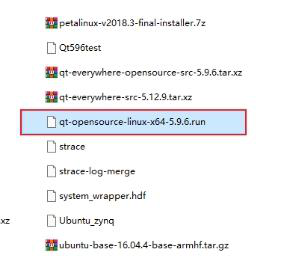

1-45 qt

图

安装包

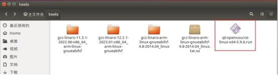

1-46

tools

图

复制到虚拟机

下

.run

qt:

运行这个

文件安装

店铺：

官方网站：

https://xiaomeige.taobao.com

www.corecourse.cn

技术博客：

技术群组：

http://www.cnblogs.com/xiaomeige/

---
*下一页*

小梅哥FPGA 团队    武汉芯路恒科技

专注于培养您的FPGA 独立开发能力   开发板 培训 项目研发三位一体

cd

~/tools/

./qt-opensource-linux-x64-5.9.6.run

1-47

图

安装指令

会出现如下界面

1-48

1

图

安装

1-49

2

图

安装

qt

这里需要去

官网注册账户，这里就不做多余的说明，注册了直接下一步

即可。

店铺：

官方网站：

https://xiaomeige.taobao.com

www.corecourse.cn

技术博客：

技术群组：

http://www.cnblogs.com/xiaomeige/

---
*下一页*

小梅哥FPGA 团队    武汉芯路恒科技

专注于培养您的FPGA 独立开发能力   开发板 培训 项目研发三位一体

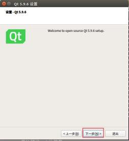

1-50

3

图

安装

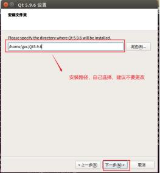

1-51

4

图

安装

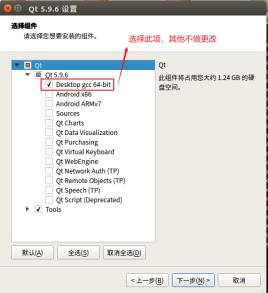

1-52

5

图

安装

店铺：

官方网站：

https://xiaomeige.taobao.com

www.corecourse.cn

技术博客：

技术群组：

http://www.cnblogs.com/xiaomeige/

---
*下一页*

小梅哥FPGA 团队    武汉芯路恒科技

专注于培养您的FPGA 独立开发能力   开发板 培训 项目研发三位一体

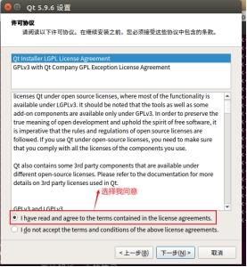

1-53

6

图

安装

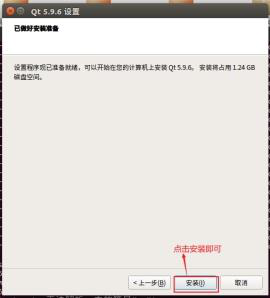

1-54

7

图

安装

等待安装完成

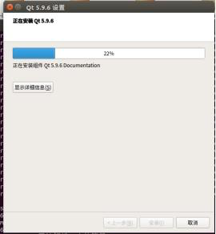

1-55

8

图

安装

店铺：

官方网站：

https://xiaomeige.taobao.com

www.corecourse.cn

技术博客：

技术群组：

http://www.cnblogs.com/xiaomeige/

---
*下一页*

小梅哥FPGA 团队    武汉芯路恒科技

专注于培养您的FPGA 独立开发能力   开发板 培训 项目研发三位一体

:

安装完成

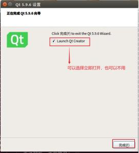

1-56

9

图

安装

Qt

Qt

1-57

这样

就安装完成了，可以到下列路径查看启动

的脚本文件如图

：

/home/$USER/Qt5.9.6/Tools/QtCreator/bin

qt

qt

从终端启动

。进入到

安装路径，但

1.1

source

是首先得链接交叉编译工具链，如

章节中使用

脚本指令。

source

~/tools/gcc-linaro-7.3.1-2018.05-x86_64_arm-linux-

gnueabihf/gcc_path.sh

cd

/home/

$USER

/Qt5.9.6/Tools/QtCreator/bin

./qtcreator.sh

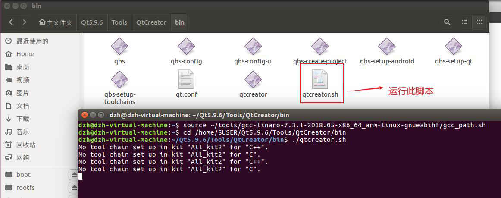

1-57

qt

图

运行

脚本

:

运行后的界面

店铺：

官方网站：

https://xiaomeige.taobao.com

www.corecourse.cn

技术博客：

技术群组：

http://www.cnblogs.com/xiaomeige/

---
*下一页*

小梅哥FPGA 团队    武汉芯路恒科技

专注于培养您的FPGA 独立开发能力   开发板 培训 项目研发三位一体

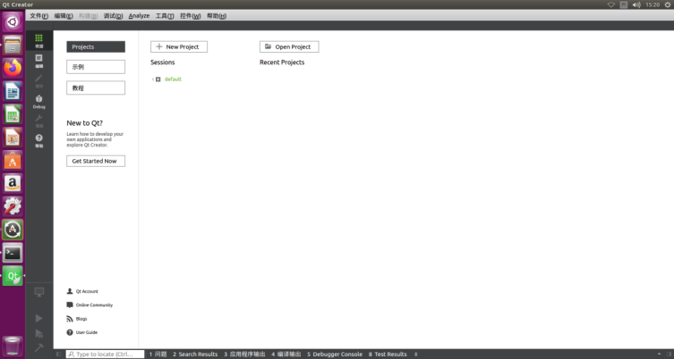

1-58 qt

图

界面

qt

打开了之后我们需要对

软件进行配置，否则无法编译，并且就算编译出

来了二进制文件开发板也无法运行。

1.5.2

Qt

配置

软件

-->

点击

工具

选项

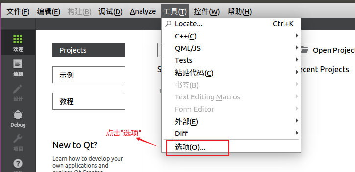

1-59

图

配置选项

”

”

出现如下界面，选择

构建和运行

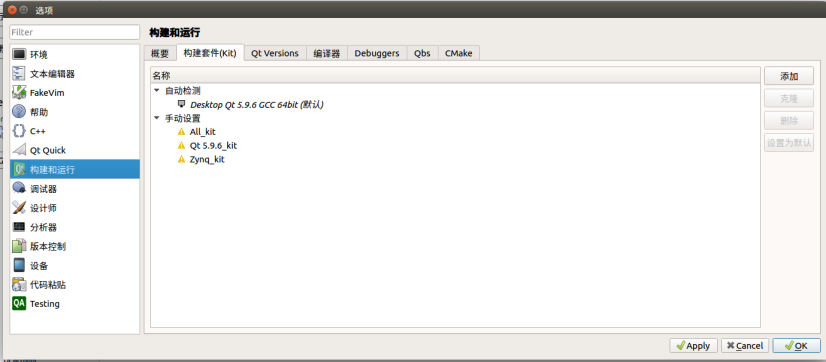

1-60

图

选择构建

配置编译器

1.

店铺：

官方网站：

https://xiaomeige.taobao.com

www.corecourse.cn

技术博客：

技术群组：

http://www.cnblogs.com/xiaomeige/

---
*下一页*

小梅哥FPGA 团队    武汉芯路恒科技

专注于培养您的FPGA 独立开发能力   开发板 培训 项目研发三位一体

”

”

选择

编译器

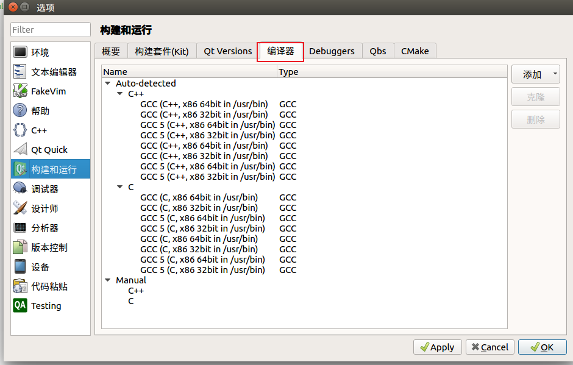

1-61

图

选择编译器

qt

qt

添加我们安装的交叉编译编译工具，让

和

源码使用同样的交叉编译工

具链编译。

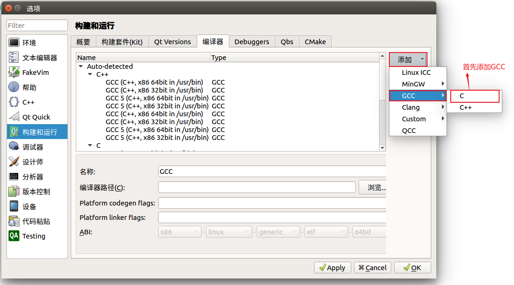

1-62

GCC

图

添加

编译器

(

):

/home/$USER/tools/gcc-linaro-

路径为

选择你自己安装交叉编译工具的路径

7.3.1-2018.05-x86_64_arm-linux-gnueabihf/bin/arm-linux-gnueabihf-gcc

店铺：

官方网站：

https://xiaomeige.taobao.com

www.corecourse.cn

技术博客：

技术群组：

http://www.cnblogs.com/xiaomeige/

---
*下一页*

小梅哥FPGA 团队    武汉芯路恒科技

专注于培养您的FPGA 独立开发能力   开发板 培训 项目研发三位一体

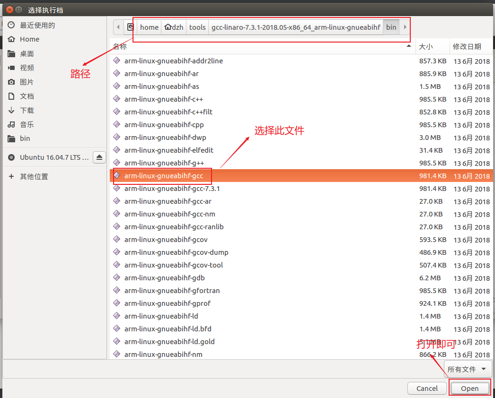

1-63

gcc

图

选择

编译器

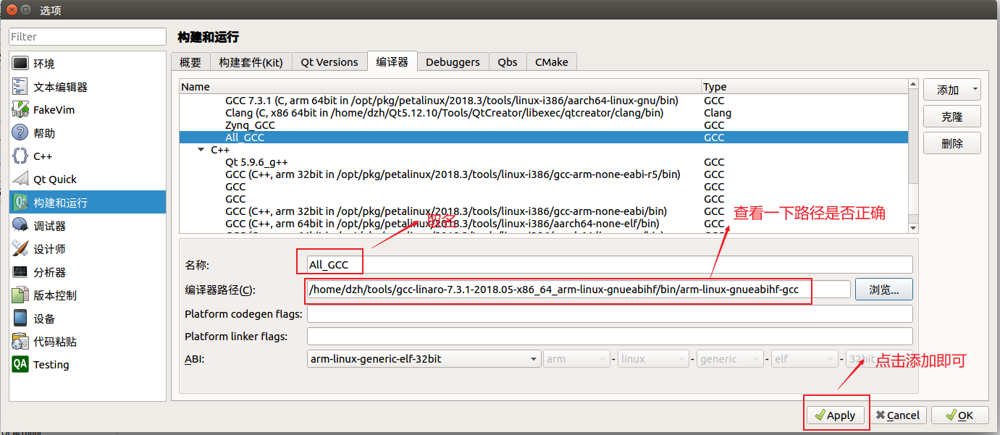

1-64

图

添加

G++

GCC

arm-xilin

然后同样的步骤添加

，路径和

相同，但是选择的文件为

x-linux-gnueabi-g++

:

/home/$USER/tools/gcc-linaro-7.3.1-2018.05-x86_6

，其路径为

4_arm-linux-gnueabihf/bin/arm-linux-gnueabihf-g++

店铺：

官方网站：

https://xiaomeige.taobao.com

www.corecourse.cn

技术博客：

技术群组：

http://www.cnblogs.com/xiaomeige/

---
*下一页*

小梅哥FPGA 团队    武汉芯路恒科技

专注于培养您的FPGA 独立开发能力   开发板 培训 项目研发三位一体

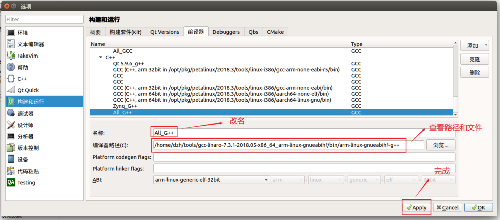

1-65

g++

图

选择

编译器

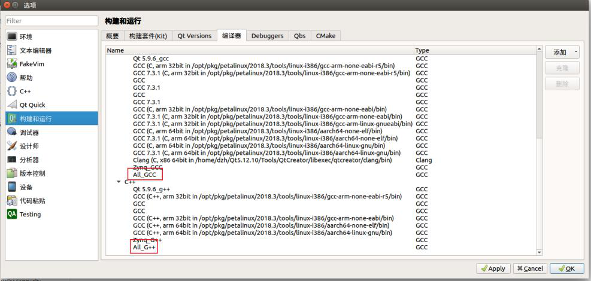

1-66

图

添加

1.

Debuggers

qt

配置

，添加

调试功能使用的文件

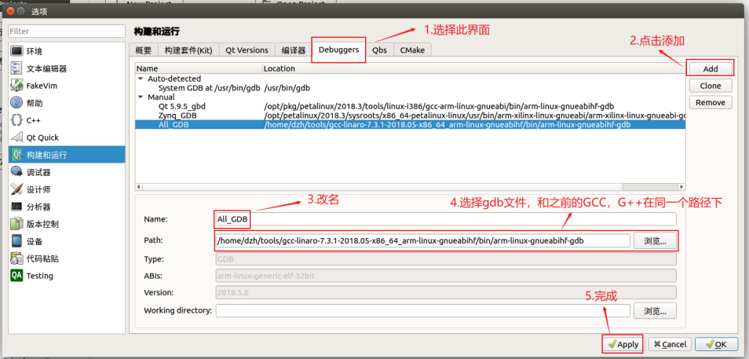

1-67

Debuggers

图

配置

2.

Qt Versions

配置

店铺：

官方网站：

https://xiaomeige.taobao.com

www.corecourse.cn

技术博客：

技术群组：

http://www.cnblogs.com/xiaomeige/

---
*下一页*

小梅哥FPGA 团队    武汉芯路恒科技

专注于培养您的FPGA 独立开发能力   开发板 培训 项目研发三位一体

qmake

:

/home/$USER/tools/qt-everywhere-opensource-s

添加的

文件，其路径为

rc-5.9.6/install/bin/qmake

，可以帮助生成和管理项目的一个工具。

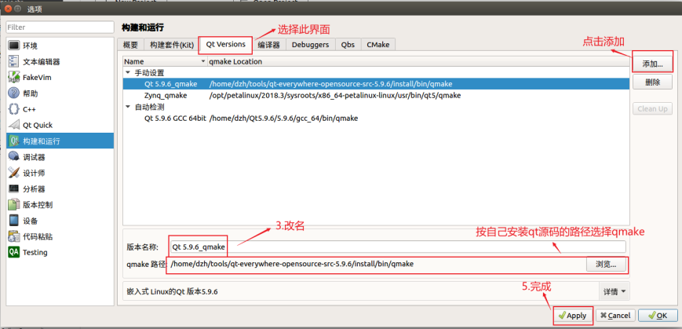

1-68

qmake

图

配置

3.

Kit

配置

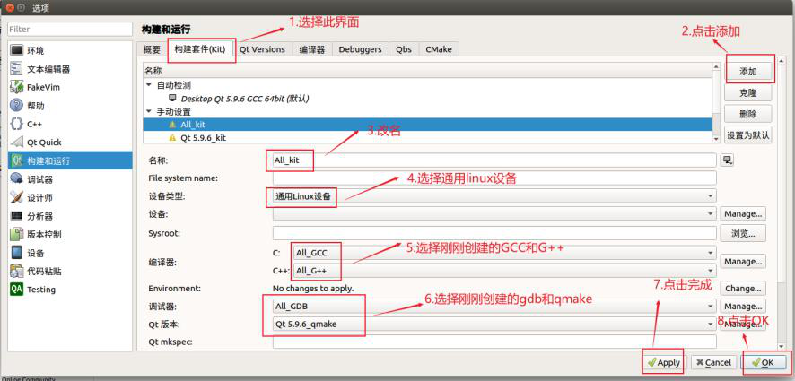

1-69

kit

图

配置

qt

Qt

配置完成后就可以编译

程序了，不过为了方便后续测试

是否移植成功，

所以这里可以先编写一个简单的测试程序。

1.5.3

编写测试程序

首先创建新工程

店铺：

官方网站：

https://xiaomeige.taobao.com

www.corecourse.cn

技术博客：

技术群组：

http://www.cnblogs.com/xiaomeige/

---
*下一页*

小梅哥FPGA 团队    武汉芯路恒科技

专注于培养您的FPGA 独立开发能力   开发板 培训 项目研发三位一体

1-70

图

创建新工程

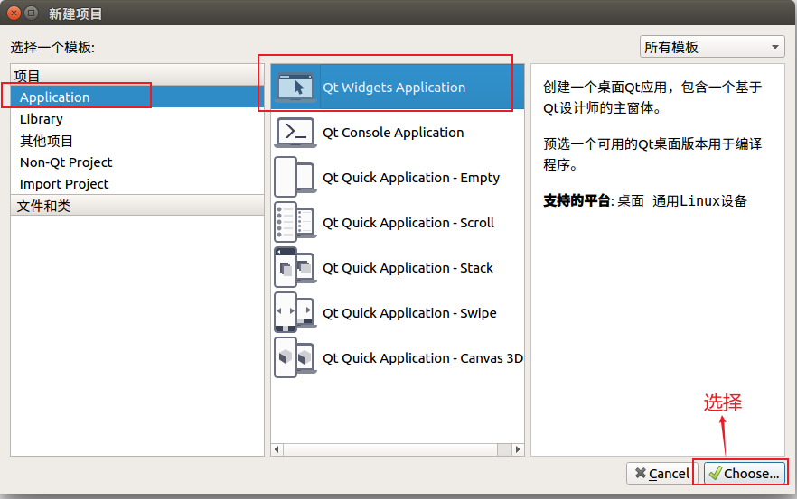

1-71

widgets

图

选择

模板

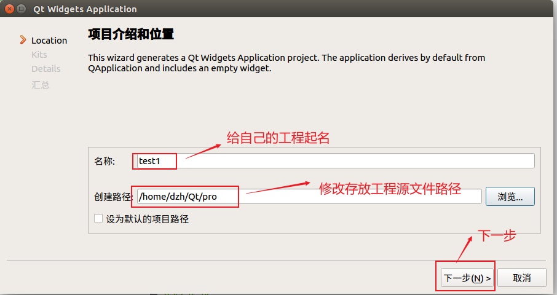

1-72

图

改工程名

店铺：

官方网站：

https://xiaomeige.taobao.com

www.corecourse.cn

技术博客：

技术群组：

http://www.cnblogs.com/xiaomeige/

---
*下一页*

小梅哥FPGA 团队    武汉芯路恒科技

专注于培养您的FPGA 独立开发能力   开发板 培训 项目研发三位一体

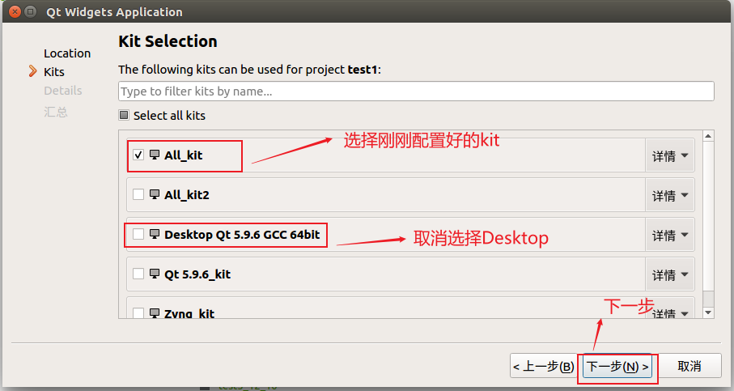

1-73

kit

图

选择

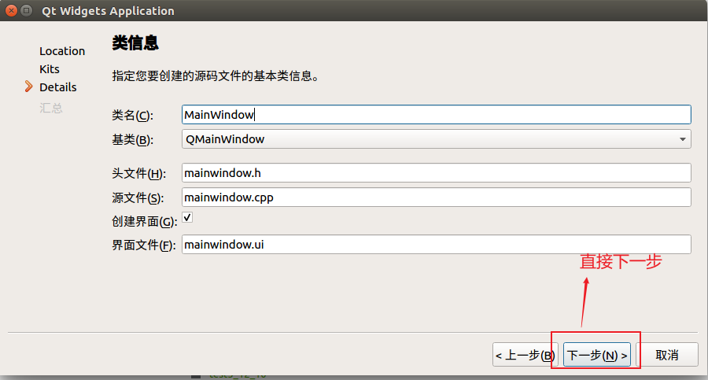

1-74

图

不用修改下一步

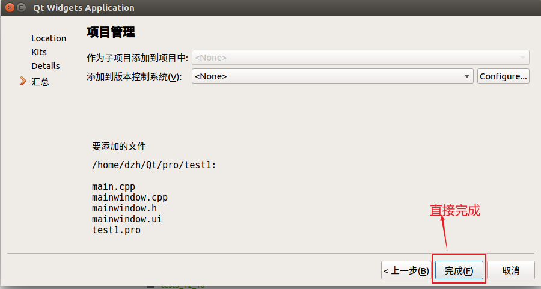

1-75

图

完成

工程创建完成之后进行如下操作：

店铺：

官方网站：

https://xiaomeige.taobao.com

www.corecourse.cn

技术博客：

技术群组：

http://www.cnblogs.com/xiaomeige/

---
*下一页*

小梅哥FPGA 团队    武汉芯路恒科技

专注于培养您的FPGA 独立开发能力   开发板 培训 项目研发三位一体

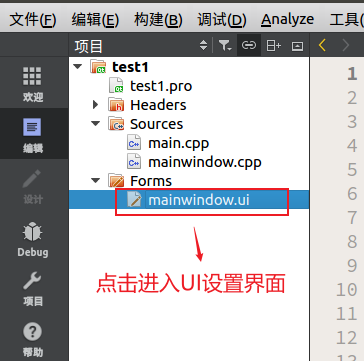

1-76 UI

图

配置

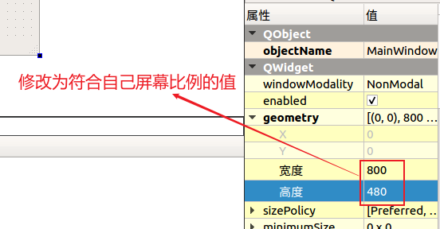

1-77

图

修改界面比例

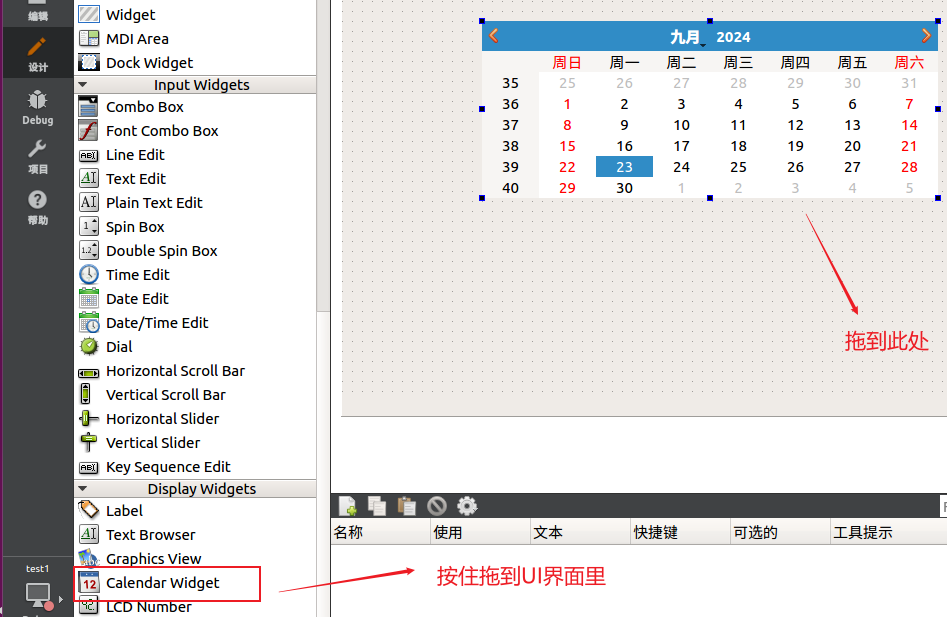

店铺：

官方网站：

https://xiaomeige.taobao.com

www.corecourse.cn

技术博客：

技术群组：

http://www.cnblogs.com/xiaomeige/

---
*下一页*

小梅哥FPGA 团队    武汉芯路恒科技

专注于培养您的FPGA 独立开发能力   开发板 培训 项目研发三位一体

1-78

图

添加日历

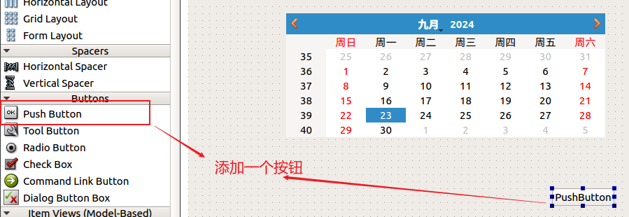

1-79

图

添加按钮

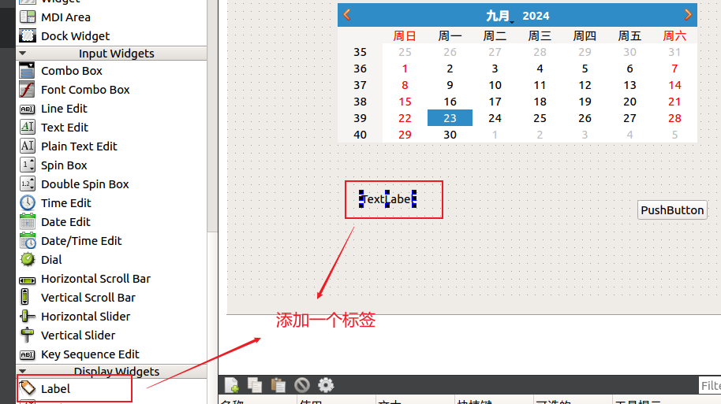

1-80

图

添加一个标签

CTRL

S

添加完成之后，按住

加

保存，点击编辑进入到编辑界面。

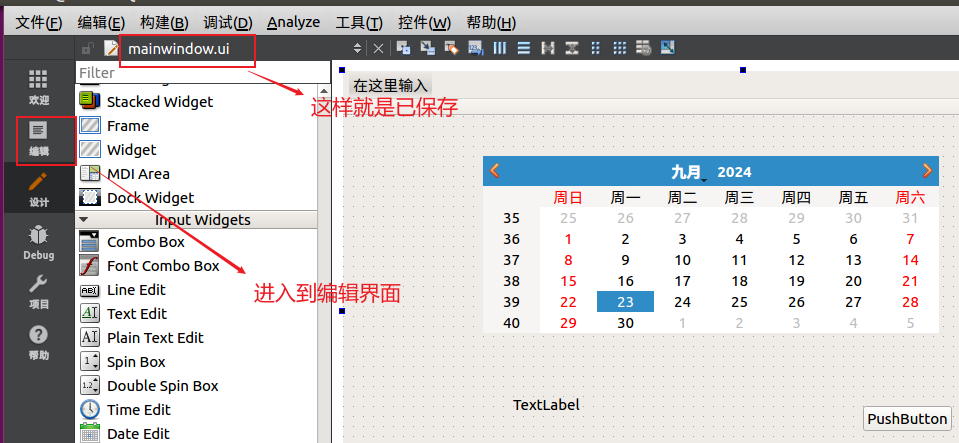

1-81

图

保存

店铺：

官方网站：

https://xiaomeige.taobao.com

www.corecourse.cn

技术博客：

技术群组：

http://www.cnblogs.com/xiaomeige/

---
*下一页*

小梅哥FPGA 团队    武汉芯路恒科技

专注于培养您的FPGA 独立开发能力   开发板 培训 项目研发三位一体

点击锤子图像进行构建

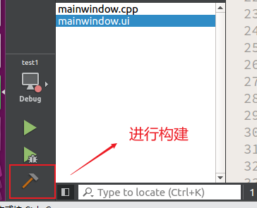

1-82

图

构建

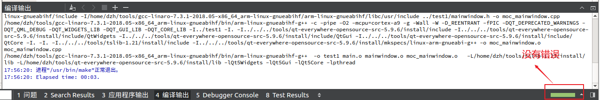

1-83

图

构建成功

1-72

构建成功后会在图

选择的目录生成二进制文件

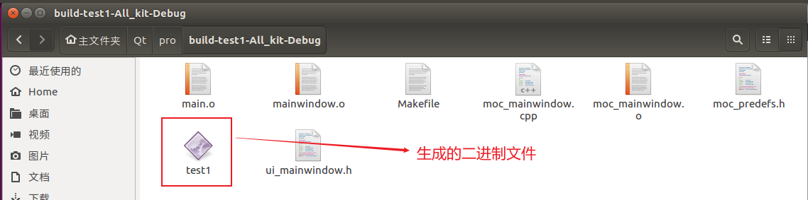

1-84

图

二进文件

1-85

也可以到终端查看这个二进制文件详细信息，如图

可以看到生成的二

32

ARM

:

进制文件为

位

端的

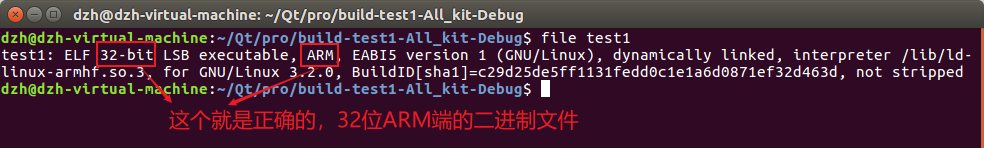

1-85

图

文件类型

Qt

Qt

在进行了安装

、配置

和编写测试程序之后就算完成了搭建和测试部分

店铺：

官方网站：

https://xiaomeige.taobao.com

www.corecourse.cn

技术博客：

技术群组：

http://www.cnblogs.com/xiaomeige/

---
*下一页*

小梅哥FPGA 团队    武汉芯路恒科技

专注于培养您的FPGA 独立开发能力   开发板 培训 项目研发三位一体

的内容，后面的小节就是移植的部分了，移植部分算是比较重要的一节了，也

算是为最后验证成功前的最后一步操作了。

1.6

移植库到根文件系统

1.6.1

移植库到目标板根文件系统

前面几个小节已经将两个库文件交叉编译编译好了，现在只需要将库文件

移植到根文件系统即可。

但是我们为什么要移植库呢？其实将库移植到根文件系统中是为了确保应

Qt

用程序在嵌入式设备上能够正确找到并加载它们的依赖库，让我们编译的

程

序可以在开发板上正常运行。

tslib

SD

那么首先移植的是

库，将需要移植的根文件系统存放的

卡连接到虚

:

/home/$USER/tools/tslib-1.21/install

拟机中，然后进入到如下路径中

，再输入下

(

):

列指令

根据自己真实路径修改

sudo

cp

-a

bin/ts_*

/media/

$USER

/rootfs/usr/bin/

sudo

cp

-a

etc/ts.conf

/media/

$USER

/rootfs/etc/

sudo

cp

-a

lib/*

/media/

$USER

/rootfs/usr/lib/

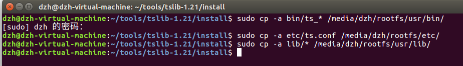

1-86

tslib

图

移植

库

tslib

Qt

库移植完成后再到如下路径继续进行

库移植。请注意移植的根文件

Qt

/home/$USER/to

系统里不能含有其他版本的

库文件，否则会导致一些错误。

ols/qt-everywhere-opensource-src-5.9.6/install

:

，输入下列指令

sudo

cp

-a

lib/*

/media/

$USER

/rootfs/usr/lib

sudo

mkdir

-p

/media/

$USER

/rootfs/usr/lib/qt5

sudo

mkdir

-p

/media/

$USER

/rootfs/usr/share/fonts

sudo

cp

-a

mkspecs

plugins

/media/

$USER

/rootfs/usr/lib/qt5

sudo

cp

-a

mkspecs

examples

/media/

$USER

/rootfs/usr/lib/qt5

sync

店铺：

官方网站：

https://xiaomeige.taobao.com

www.corecourse.cn

技术博客：

技术群组：

http://www.cnblogs.com/xiaomeige/

---
*下一页*

小梅哥FPGA 团队    武汉芯路恒科技

专注于培养您的FPGA 独立开发能力   开发板 培训 项目研发三位一体

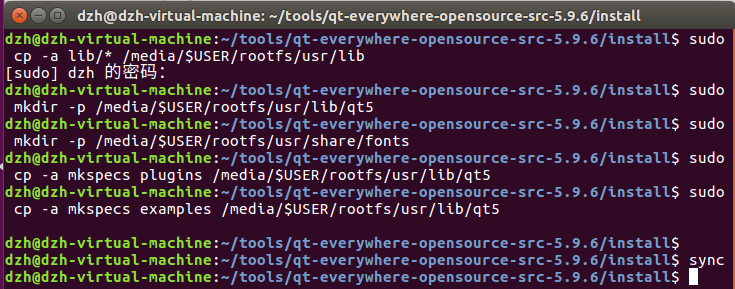

1-87

qt

图

移植

库

1.6.2

QT

运行

示例

SD

两个库都移植完成之后弹出

卡插入到开发板中，启动开发板。将开发板

PC

WinSCP

AC8

和

端网口进行连接。打开

软件（安装包在网盘下载的：

小梅哥

20

ZYNQ

FPSoC

\07_Linux

\ZYNQ7020\AC820_Zynq_Qt

型

或安路

开发板资料

源码

\WinSCP-5.13.3-Setup.exe

:

），连接开发板

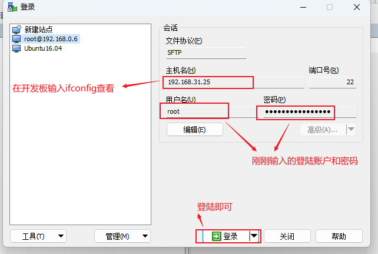

1-88

WinSCP

图

登陆

PC

1.5

qt

WinSCP

在

端将我们在

章构建用于测试的

程序拖动复制到

软件连

接开发板的一侧，如果没有在前面的章节做出此测试文件，我们也提供了：

小

AC820

ZYNQ

FPSoC

\07_Linux

\ZYNQ7020\AC820

梅哥

型

或安路

开发板资料

源码

_Zynq_Qt\

\test1

:

测试二进制文件

店铺：

官方网站：

https://xiaomeige.taobao.com

www.corecourse.cn

技术博客：

技术群组：

http://www.cnblogs.com/xiaomeige/

---
*下一页*

小梅哥FPGA 团队    武汉芯路恒科技

专注于培养您的FPGA 独立开发能力   开发板 培训 项目研发三位一体

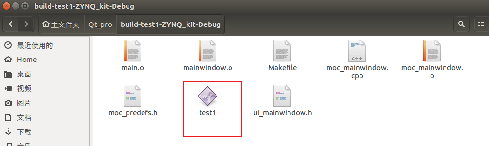

1-89

图

选中测试文件

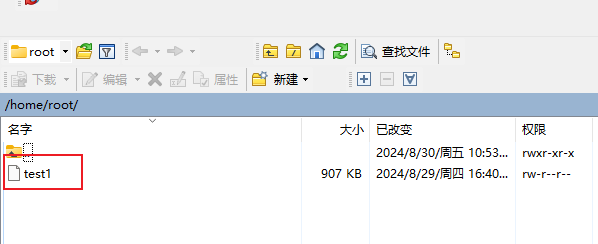

1-90

/root

图

拖动到

下

/usr/share/fonts/

复制完测试文件之后还需要复制一个字体文件到

下，并且这

PC

C:\Windows\Fonts

个字体文件是微软官方的，就存放在我们

端的

下，将其复

/usr/share/fonts/

:

制到

下即可（这个字体都是有版权的，我们只做学习用）

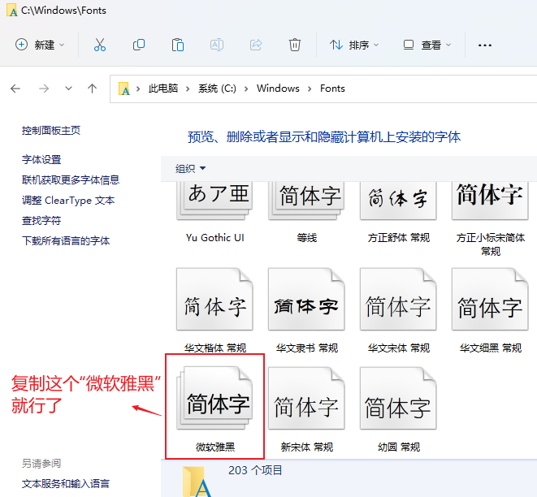

1-91

图

选中字体文件

ttc

:

拖动复制到桌面下，则会生成三个

文件

店铺：

官方网站：

https://xiaomeige.taobao.com

www.corecourse.cn

技术博客：

技术群组：

http://www.cnblogs.com/xiaomeige/

---
*下一页*

小梅哥FPGA 团队    武汉芯路恒科技

专注于培养您的FPGA 独立开发能力   开发板 培训 项目研发三位一体

1-92

图

字体

ttc

WinSCP

然后再将桌面的

文件（无论哪个都可以）拖动复制到

的

/usr/share/fonts/

:

路径下

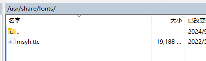

1-93

ttc

图

复制

文件

在将所有的测试文件准备好后就可以开始在配置环境变量了，但是在这之

前还需要查看一下自己的触摸屏输入设备的标号是否和指令相对应，比如作者

event0

event0

的触摸屏输入设备位

，所以配置的的环境变量也指向

，如果你有多

1-94

个输入设备并且不清楚哪个是触摸屏设备，则可以在开发板中通过如下图

:

指令查看

cat

/proc/bus/input/devices

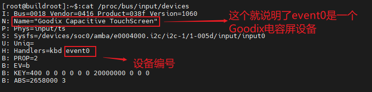

1-94

图

设备识别

店铺：

官方网站：

https://xiaomeige.taobao.com

www.corecourse.cn

技术博客：

技术群组：

http://www.cnblogs.com/xiaomeige/

---
*下一页*

小梅哥FPGA 团队    武汉芯路恒科技

专注于培养您的FPGA 独立开发能力   开发板 培训 项目研发三位一体

event

:

输入如下指令配置环境（根据自己刚刚查看的

设备标号修改指令）

export

TSLIB_CONSOLEDEVICE

=

none

export

TSLIB_FBDEVICE

=

/dev/fb0

export

TSLIB_TSDEVICE

=

/dev/input/event0

export

TSLIB_CONFFILE

=

/etc/ts.conf

export

TSLIB_PLUGINDIR

=

/usr/lib/ts

export

QT_QPA_FB_TSLIB

=

1

export

QT_QPA_PLATFORM

=

linuxfb

export

QT_QPA_PLATFORM_PLUGIN_PATH

=

/usr/lib/qt5/plugins

export

QT_QPA_FONTDIR

=

/usr/share/fonts

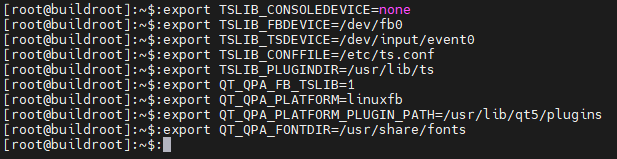

1-95

图

配置环境变量

:

运行可执行文件，但是首先得先给可执行文件权限它才能运行

chmod

+x

test1

./test1

1-96:

效果如图

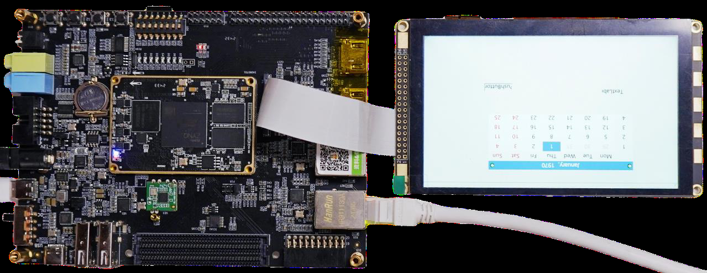

1-96

图

效果图

店铺：

官方网站：

https://xiaomeige.taobao.com

www.corecourse.cn

技术博客：

技术群组：

http://www.cnblogs.com/xiaomeige/

---
*下一页*

小梅哥FPGA 团队    武汉芯路恒科技

专注于培养您的FPGA 独立开发能力   开发板 培训 项目研发三位一体

1-97

1-98

也可以点击屏幕测试触摸设备是否正常启动如图

图

。

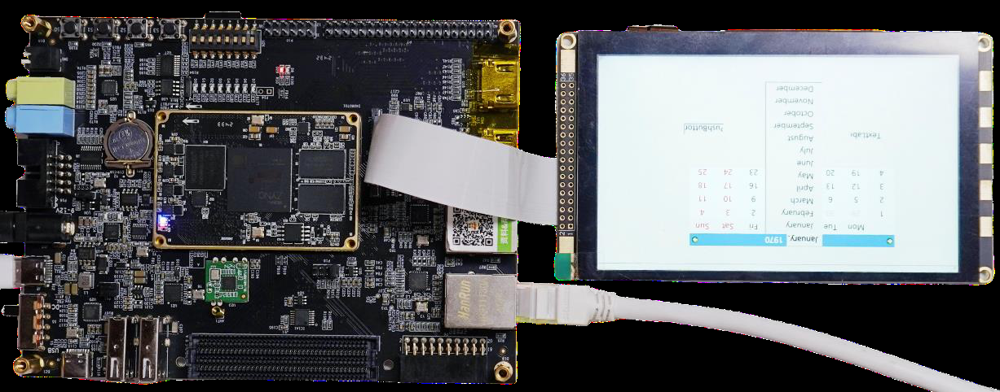

1-97

图

点击更换月份

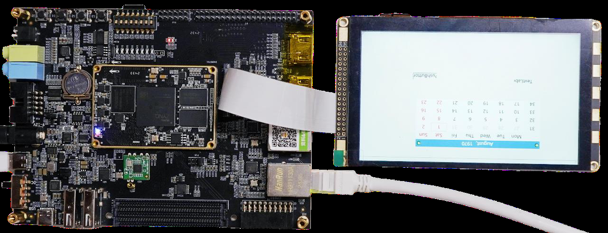

1-98

图

更换月份

Qt

1-99:

亦或者执行

官方提供的示例文件，输入下列指令，效果如图

/usr/lib/qt5/examples/widgets/animation/animatedtiles/animate

dtiles

店铺：

官方网站：

https://xiaomeige.taobao.com

www.corecourse.cn

技术博客：

技术群组：

http://www.cnblogs.com/xiaomeige/

---
*下一页*

小梅哥FPGA 团队    武汉芯路恒科技

专注于培养您的FPGA 独立开发能力   开发板 培训 项目研发三位一体

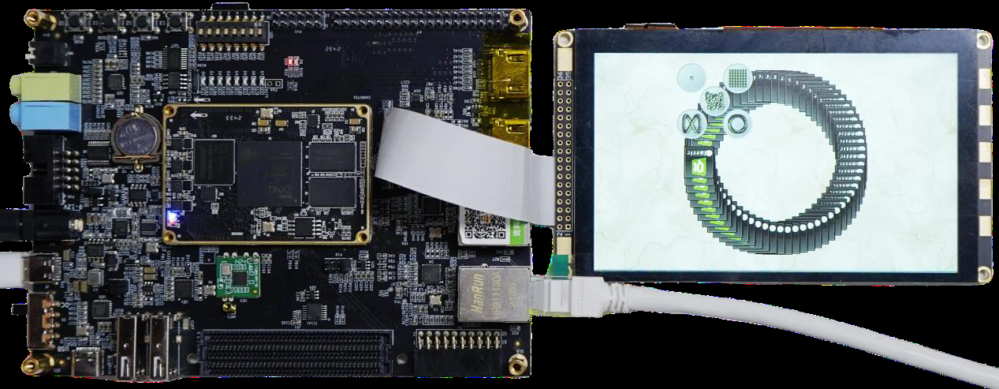

1-99

图

官方示例效果图

Qt

做到这里想必你已经等不及想自己上手做出自己的

程序了，不妨先到开

/usr/lib/qt5/examples/

Qt

发板的

路径下，试试其他的官方示例，可以提高你对

开

发的兴趣。

1.7

本章小节

Qt

通过本章的学习，我们了解了

框架的基本配置步骤以及如何将其移植到

开发板上。我们从准备交叉编译环境入手，详细讨论了如何选择和配置适合的

Qt

工具链，编译

源码，并将其部署到目标设备中。重点内容包括：

1.

交叉编译环境的搭建：了解了交叉编译工具链的选择、配置和安装。

2.

Qt

源码的配置与编译：掌握了如何根据开发板的硬件和软件环境，对

Qt

源码进行适当的配置，并成功完成编译。

3.

Qt

Qt

库的移植与部署：学习了如何将生成的

库和相关文件移植到开发

Qt

板，并成功运行

应用程序。

Qt

通过完成这一系列步骤，我们成功将

框架移植到开发板，为后续的应用

开发奠定了基础。希望本教程能够为有类似需求的开发者提供清晰的指导。

店铺：

官方网站：

https://xiaomeige.taobao.com

www.corecourse.cn

技术博客：

技术群组：

http://www.cnblogs.com/xiaomeige/

