# RTL8211F-CG
*来源 PDF: `RTL8211F-CG.pdf`*

---

RTL8211F-CG     RTL8211FD-CG

RTL8211FI-CG    RTL8211FDI-CG

INTEGRATED 10/100/1000M ETHERNET

TRANSCEIVER

DATASHEET

(CONFIDENTIAL: Development Partners Only)

Rev. 1.1

21 February 2014

Track ID: JATR-8275-15

Realtek Semiconductor Corp.

No. 2, Innovation Road II, Hsinchu Science Park, Hsinchu 300, Taiwan

Tel.: +886-3-578-0211   Fax: +886-3-577-6047

www.realtek.com

---
*下一页*

RTL8211F(I)/RTL8211FD(I)

Datasheet

COPYRIGHT

©2014 Realtek Semiconductor Corp. All rights reserved. No part of this document may be reproduced,

transmitted, transcribed, stored in a retrieval system, or translated into any language in any form or by any

means without the written permission of Realtek Semiconductor Corp.

DISCLAIMER

Realtek provides this document ‘as is’, without warranty of any kind. Realtek may make improvements

and/or changes in this document or in the product described in this document at any time. This document

could include technical inaccuracies or typographical errors.

TRADEMARKS

Realtek is a trademark of Realtek Semiconductor Corporation. Other names mentioned in this document are

trademarks/registered trademarks of their respective owners.

LICENSE

This product is covered by one or more of the following patents: US5,307,459, US5,434,872, US5,732,094,

US6,570,884, US6,115,776, and US6,327,625.

USING THIS DOCUMENT

This document is intended for the software engineer’s reference and provides detailed programming

information.

Though every effort has been made to ensure that this document is current and accurate, more information

may have become available subsequent to the production of this guide.

REVISION HISTORY

Revision

Release Date

Summary

1.0

2013/05/20

First release.

1.1

2014/02/21

Added RTL8211FD-CG, RTL8211FI-CG, and RTL8211FDI-CG data.

Integrated 10/100/1000M Ethernet Transceiver

Track ID: JATR-8275-15   Rev. 1.1

ii

---
*下一页*

RTL8211F(I)/RTL8211FD(I)

Datasheet

Table of Contents

1.

GENERAL DESCRIPTION..............................................................................................................................................1

2.

FEATURES.........................................................................................................................................................................2

3.

SYSTEM APPLICATIONS...............................................................................................................................................3

3.1.

A

D

-

RTL8211F(I) ......................................................................................................................3

PPLICATION

IAGRAM

3.2.

A

D

-

RTL8211FD(I) ...................................................................................................................4

PPLICATION

IAGRAM

4.

BLOCK DIAGRAM...........................................................................................................................................................5

5.

PIN ASSIGNMENTS .........................................................................................................................................................6

5.1.

P

I

...........................................................................................................................................6

ACKAGE

DENTIFICATION

6.

PIN DESCRIPTIONS ........................................................................................................................................................7

6.1.

T

I

............................................................................................................................................7

RANSCEIVER

NTERFACE

6.2.

C

.........................................................................................................................................................................7

LOCK

6.3.

RGMII.........................................................................................................................................................................8

6.4.

M

I

...........................................................................................................................................8

ANAGEMENT

NTERFACE

6.5.

R

..........................................................................................................................................................................9

ESET

6.6.

M

S

........................................................................................................................................................9

ODE

ELECTION

6.7.

LED

D

S

...........................................................................................................................................10

EFAULT

ETTINGS

6.8.

R

R

....................................................................................................................................10

EGULATOR AND

EFERENCE

6.9.

P

G

................................................................................................................................................10

OWER AND

ROUND

7.

FUNCTION DESCRIPTION ..........................................................................................................................................11

7.1.

T

............................................................................................................................................................11

RANSMITTER

7.1.1.

1000Mbps Mode...................................................................................................................................................11

7.1.2.

100Mbps Mode.....................................................................................................................................................11

7.1.3.

10Mbps Mode.......................................................................................................................................................11

7.2.

R

...................................................................................................................................................................11

ECEIVER

7.2.1.

1000Mbps Mode...................................................................................................................................................11

7.2.2.

100Mbps Mode.....................................................................................................................................................11

7.2.3.

10Mbps Mode.......................................................................................................................................................12

7.3.

E

E

E

(EEE)........................................................................................................................12

NERGY

FFICIENT

THERNET

7.4.

W

-O

-LAN

(WOL)............................................................................................................................................12

AKE

N

7.5.

I

.................................................................................................................................................................13

NTERRUPT

7.6.

INTB/PMEB

P

U

...........................................................................................................................................13

IN

SAGE

7.7.

MDI

I

........................................................................................................................................................14

NTERFACE

7.8.

H

C

....................................................................................................................................15

ARDWARE

ONFIGURATION

7.9.

LED

PHY

A

C

...............................................................................................................16

AND

DDRESS

ONFIGURATION

7.10.

G

E

(1000/100M

M

O

) .....................................................................................................17

REEN

THERNET

BPS

ODE

NLY

7.10.1.

Cable Length Power Saving ............................................................................................................................17

7.10.2.

Register Setting................................................................................................................................................17

7.11.

MAC/PHY

I

..............................................................................................................................................18

NTERFACE

7.11.1.

RGMII..............................................................................................................................................................18

7.11.2.

Management Interface.....................................................................................................................................18

7.11.3.

Change Page ...................................................................................................................................................19

7.11.4.

Access to MDIO Manageable Device (MMD).................................................................................................20

7.12.

A

-N

..................................................................................................................................................20

UTO

EGOTIATION

7.12.1.

Auto-Negotiation Priority Resolution..............................................................................................................23

Integrated 10/100/1000M Ethernet Transceiver

Track ID: JATR-8275-15   Rev. 1.1

iii

---
*下一页*

RTL8211F(I)/RTL8211FD(I)

Datasheet

7.12.2.

Auto-Negotiation Master/Slave Resolution .....................................................................................................23

7.12.3.

Auto-Negotiation PAUSE/ASYMMETRIC PAUSE Resolution........................................................................24

7.13.

C

D

A

-C

....................................................................................................24

ROSSOVER

ETECTION AND

UTO

ORRECTION

7.14.

LED

C

................................................................................................................................................26

ONFIGURATION

7.14.1.

Customized LED Function...............................................................................................................................26

7.14.2.

EEE LED Function..........................................................................................................................................27

7.15.

P

C

.............................................................................................................................................28

OLARITY

ORRECTION

7.16.

P

.......................................................................................................................................................................28

OWER

7.17.

PHY

R

(H

R

) ..............................................................................................................................28

ESET

ARDWARE

ESET

8.

REGISTER DESCRIPTIONS.........................................................................................................................................29

8.1.

R

M

D

.......................................................................................................................29

EGISTER

APPING AND

EFINITIONS

8.2.

MMD

R

M

D

............................................................................................................30

EGISTER

APPING AND

EFINITIONS

8.3.

O

P

R

M

D

.................................................................................................30

THER

AGE

EGISTER

APPING AND

EFINITIONS

8.4.

R

T

......................................................................................................................................................30

EGISTER

ABLES

8.4.1.

BMCR (Basic Mode Control Register, Address 0x00) .........................................................................................30

8.4.2.

BMSR (Basic Mode Status Register, Address 0x01).............................................................................................32

8.4.3.

PHYID1 (PHY Identifier Register 1, Address 0x02) ............................................................................................33

8.4.4.

PHYID2 (PHY Identifier Register 2, Address 0x03) ............................................................................................33

8.4.5.

ANAR (Auto-Negotiation Advertising Register, Address 0x04) ...........................................................................33

8.4.6.

ANLPAR (Auto-Negotiation Link Partner Ability Register, Address 0x05) .........................................................34

8.4.7.

ANER (Auto-Negotiation Expansion Register, Address 0x06).............................................................................35

8.4.8.

ANNPTR (Auto-Negotiation Next Page Transmit Register, Address 0x07).........................................................36

8.4.9.

ANNPRR (Auto-Negotiation Next Page Receive Register, Address 0x08)...........................................................36

8.4.10.

GBCR (1000Base-T Control Register, Address 0x09).....................................................................................37

8.4.11.

GBSR (1000Base-T Status Register, Address 0x0A) .......................................................................................37

8.4.12.

MACR (MMD Access Control Register, Address 0x0D) .................................................................................38

8.4.13.

MAADR (MMD Access Address Data Register, Address 0x0E)......................................................................38

8.4.14.

GBESR (1000Base-T Extended Status Register, Address 0x0F) .....................................................................39

8.4.15.

INER (Interrupt Enable Register, Address 0x12)............................................................................................39

8.4.16.

PHYCR1 (PHY Specific Control Register 1, Address 0x18)............................................................................40

8.4.17.

PHYCR2 (PHY Specific Control Register 2, Address 0x19)............................................................................41

8.4.18.

PHYSR (PHY Specific Status Register, Address 0x1A) ...................................................................................41

8.4.19.

INSR (Interrupt Status Register, Address 0x13)..............................................................................................42

8.4.20.

EPAGSR (Extension Page Select Register, Address 0x1F) .............................................................................43

8.4.21.

PC1R (PCS Control 1 Register, MMD Device 3, Address 0x00) ....................................................................43

8.4.22.

PS1R (PCS Status1 Register, MMD Device 3, Address 0x01) ........................................................................43

8.4.23.

EEECR (EEE Capability Register, MMD Device 3, Address 0x14)................................................................44

8.4.24.

EEEWER (EEE Wake Error Register, MMD Device 3, Address 0x16) ..........................................................44

8.4.25.

EEEAR (EEE Advertisement Register, MMD Device 7, Address 0x3c) ..........................................................44

8.4.26.

EEELPAR (EEE Link Partner Ability Register, MMD Device 7, Address 0x3d)............................................45

8.4.27.

LCR (LED Control Register, ExtPage 0xd04, Address 0x10) .........................................................................45

8.4.28.

EEELCR (EEE LED Control Register, ExtPage 0xd04, Address 0x11)..........................................................45

9.

REGULATORS AND POWER SEQUENCE................................................................................................................46

9.1.

S

R

(RTL8211F(I))...................................................................................................................46

WITCHING

EGULATOR

9.1.1.

PCB Layout ..........................................................................................................................................................46

9.1.2.

Inductor and Capacitor Parts List .......................................................................................................................47

9.1.3.

Measurement Criteria ..........................................................................................................................................48

9.1.4.

Efficiency Measurement .......................................................................................................................................54

9.2.

L

-

R

(RTL8211FD(I))..........................................................................................................55

OW

DROPOUT

EGULATOR

9.3.

P

S

.....................................................................................................................................................56

OWER

EQUENCE

10.

CHARACTERISTICS.................................................................................................................................................57

Integrated 10/100/1000M Ethernet Transceiver

Track ID: JATR-8275-15   Rev. 1.1

iv

---
*下一页*

RTL8211F(I)/RTL8211FD(I)

Datasheet

10.1.

A

M

R

.................................................................................................................................57

BSOLUTE

AXIMUM

ATINGS

10.2.

R

O

C

.................................................................................................................57

ECOMMENDED

PERATING

ONDITIONS

10.3.

C

R

..........................................................................................................................................58

RYSTAL

EQUIREMENTS

10.4.

O

/E

C

R

......................................................................................................58

SCILLATOR

XTERNAL

LOCK

EQUIREMENTS

10.5.

DC

C

...............................................................................................................................................59

HARACTERISTICS

10.6.

AC

C

...............................................................................................................................................60

HARACTERISTICS

10.6.1.

MDC/MDIO Timing ........................................................................................................................................60

10.6.2.

RGMII Timing Modes......................................................................................................................................61

11.

MECHANICAL DIMENSIONS.................................................................................................................................64

11.1.

M

D

N

............................................................................................................................64

ECHANICAL

IMENSIONS

OTES

12.

ORDERING INFORMATION...................................................................................................................................65

List of Tables

T

1.

T

I

..............................................................................................................................................7

ABLE

RANSCEIVER

NTERFACE

T

2.

C

............................................................................................................................................................................7

ABLE

LOCK

T

3.

RGMII...........................................................................................................................................................................8

ABLE

T

4.

M

I

.............................................................................................................................................8

ABLE

ANAGEMENT

NTERFACE

T

5.

R

.............................................................................................................................................................................9

ABLE

ESET

T

6.

M

S

..........................................................................................................................................................9

ABLE

ODE

ELECTION

T

7.

LED

D

S

.............................................................................................................................................10

ABLE

EFAULT

ETTINGS

T

8.

R

R

......................................................................................................................................10

ABLE

EGULATOR AND

EFERENCE

T

9.

P

G

...................................................................................................................................................10

ABLE

OWER AND

ROUND

T

10.

CONFIG

P

.

C

R

............................................................................................................15

ABLE

INS VS

ONFIGURATION

EGISTER

T

11.

C

R

D

....................................................................................................................15

ABLE

ONFIGURATION

EGISTER

EFINITIONS

T

12.

M

F

F

..................................................................................................................................18

ABLE

ANAGEMENT

RAME

ORMAT

T

13.

M

F

D

...........................................................................................................................18

ABLE

ANAGEMENT

RAME

ESCRIPTION

T

14.

1000B

-T

B

N

P

B

A

..............................................................................................21

ABLE

ASE

ASE AND

EXT

AGE

IT

SSIGNMENTS

T

15.

LED

D

D

........................................................................................................................................26

ABLE

EFAULT

EFINITIONS

T

16.

LED

R

T

.................................................................................................................................................26

ABLE

EGISTER

ABLE

T

17.

LED

C

T

......................................................................................................................................27

ABLE

ONFIGURATION

ABLE

T

18.

R

A

T

............................................................................................................................................29

ABLE

EGISTER

CCESS

YPES

T

19.

R

M

D

........................................................................................................................29

ABLE

EGISTER

APPING AND

EFINITIONS

T

20.

MMD

R

M

D

..............................................................................................................30

ABLE

EGISTER

APPING AND

EFINITIONS

T

21.

O

P

R

M

D

...................................................................................................30

ABLE

THER

AGE

EGISTER

APPING AND

EFINITIONS

T

22.

BMCR

(B

M

C

R

,

A

0

00) ......................................................................................30

ABLE

ASIC

ODE

ONTROL

EGISTER

DDRESS

X

T

23.

BMSR

(B

M

S

R

,

A

0

01)..........................................................................................32

ABLE

ASIC

ODE

TATUS

EGISTER

DDRESS

X

T

24.

PHYID1

(PHY

I

R

1,

A

0

02) ...........................................................................................33

ABLE

DENTIFIER

EGISTER

DDRESS

X

T

25.

PHYID2

(PHY

I

R

2,

A

0

03) ...........................................................................................33

ABLE

DENTIFIER

EGISTER

DDRESS

X

T

26.

ANAR

(A

-N

A

R

,

A

0

04)....................................................................33

ABLE

UTO

EGOTIATION

DVERTISING

EGISTER

DDRESS

X

T

27.

ANLPAR

(A

-N

L

P

A

R

,

A

0

05) ...............................................34

ABLE

UTO

EGOTIATION

INK

ARTNER

BILITY

EGISTER

DDRESS

X

T

28.

ANER

(A

-N

E

R

,

A

0

06)........................................................................35

ABLE

UTO

EGOTIATION

XPANSION

EGISTER

DDRESS

X

T

29.

ANNPTR

(A

-N

N

P

T

R

,

A

0

07).................................................36

ABLE

UTO

EGOTIATION

EXT

AGE

RANSMIT

EGISTER

DDRESS

X

T

30.

ANNPRR

(A

-N

N

P

R

R

,

A

0

08) ...................................................36

ABLE

UTO

EGOTIATION

EXT

AGE

ECEIVE

EGISTER

DDRESS

X

T

31.

GBCR

(1000B

-T

C

R

,

A

0

09) .......................................................................................37

ABLE

ASE

ONTROL

EGISTER

DDRESS

X

T

32.

GBSR

(1000B

-T

S

R

,

A

0

0A)..........................................................................................37

ABLE

ASE

TATUS

EGISTER

DDRESS

X

T

33.

MACR

(MMD

A

C

R

,

A

0

0D) ..................................................................................38

ABLE

CCESS

ONTROL

EGISTER

DDRESS

X

T

34.

MAADR

(MMD

A

A

D

R

,

A

0

0E) ......................................................................38

ABLE

CCESS

DDRESS

ATA

EGISTER

DDRESS

X

Integrated 10/100/1000M Ethernet Transceiver

Track ID: JATR-8275-15   Rev. 1.1

v

---
*下一页*

RTL8211F(I)/RTL8211FD(I)

Datasheet

T

35.

GBESR

(1000B

-T

E

S

R

,

A

0

0F)......................................................................39

ABLE

ASE

XTENDED

TATUS

EGISTER

DDRESS

X

T

36.

INER

(I

E

R

,

A

0

12)..............................................................................................39

ABLE

NTERRUPT

NABLE

EGISTER

DDRESS

X

T

37.

PHYCR1

(PHY

S

C

R

1,

A

0

18)..............................................................................40

ABLE

PECIFIC

ONTROL

EGISTER

DDRESS

X

T

38.

PHYCR2

(PHY

S

C

R

2,

A

0

19)..............................................................................41

ABLE

PECIFIC

ONTROL

EGISTER

DDRESS

X

T

39.

PHYSR

(PHY

S

S

R

,

A

0

1A).....................................................................................41

ABLE

PECIFIC

TATUS

EGISTER

DDRESS

X

T

40.

INSR

(I

S

R

,

A

0

13)...............................................................................................42

ABLE

NTERRUPT

TATUS

EGISTER

DDRESS

X

T

41.

EPAGSR

(E

P

S

R

,

A

0

1F)...............................................................................43

ABLE

XTENSION

AGE

ELECT

EGISTER

DDRESS

X

T

42.

PC1R

(PCS

C

1

R

,

MMD

D

3,

A

0

00)........................................................................43

ABLE

ONTROL

EGISTER

EVICE

DDRESS

X

T

43.

PS1R

(PCS

S

1

R

,

MMD

D

3,

A

0

01)...........................................................................43

ABLE

TATUS

EGISTER

EVICE

DDRESS

X

T

44.

EEECR

(EEE

C

R

,

MMD

D

3,

A

0

14) ...................................................................44

ABLE

APABILITY

EGISTER

EVICE

DDRESS

X

T

45.

EEEWER

(EEE

W

E

R

,

MMD

D

3,

A

0

16).............................................................44

ABLE

AKE

RROR

EGISTER

EVICE

DDRESS

X

T

46.

EEEAR

(EEE

A

R

,

MMD

D

7,

A

0

3

)...........................................................44

ABLE

DVERTISEMENT

EGISTER

EVICE

DDRESS

X

C

T

47.

EEELPAR

(EEE

L

P

A

R

,

MMD

D

7,

A

0

3

)............................................45

ABLE

INK

ARTNER

BILITY

EGISTER

EVICE

DDRESS

X

D

T

48.

LCR

(LED

C

R

,

E

P

0

04,

A

0

10) ..........................................................................45

ABLE

ONTROL

EGISTER

XT

AGE

XD

DDRESS

X

T

49.

EEELCR

(EEE

LED

C

R

,

E

P

0

04,

A

0

11)...........................................................45

ABLE

ONTROL

EGISTER

XT

AGE

XD

DDRESS

X

T

50.

I

C

P

L

......................................................................................................................47

ABLE

NDUCTOR AND

APACITOR

ARTS

IST

T

51.

P

S

P

.................................................................................................................................56

ABLE

OWER

EQUENCE

ARAMETERS

T

52.

A

M

R

..................................................................................................................................57

ABLE

BSOLUTE

AXIMUM

ATINGS

T

53.

R

O

C

...................................................................................................................57

ABLE

ECOMMENDED

PERATING

ONDITIONS

T

54.

C

R

............................................................................................................................................58

ABLE

RYSTAL

EQUIREMENTS

T

55.

O

/E

C

R

........................................................................................................58

ABLE

SCILLATOR

XTERNAL

LOCK

EQUIREMENTS

T

56.

DC

C

.................................................................................................................................................59

ABLE

HARACTERISTICS

T

57.

MDC/MDIO

M

T

P

....................................................................................................60

ABLE

ANAGEMENT

IMING

ARAMETERS

T

58.

RGMII

T

P

......................................................................................................................................63

ABLE

IMING

ARAMETERS

T

59.

O

I

............................................................................................................................................65

ABLE

RDERING

NFORMATION

Integrated 10/100/1000M Ethernet Transceiver

Track ID: JATR-8275-15   Rev. 1.1

vi

---
*下一页*

RTL8211F(I)/RTL8211FD(I)

Datasheet

List of Figures

F

1.

A

D

–

RTL8211F(I) ......................................................................................................................3

IGURE

PPLICATION

IAGRAM

F

2.

A

D

-

RTL8211FD(I) ....................................................................................................................4

IGURE

PPLICATION

IAGRAM

F

3.

B

D

..........................................................................................................................................................5

IGURE

LOCK

IAGRAM

F

4.

P

A

(40-P

QFN) .................................................................................................................................6

IGURE

IN

SSIGNMENTS

IN

F

5.

LED

PHY

A

C

................................................................................................................16

IGURE

AND

DDRESS

ONFIGURATION

F

6.

MDC/MDIO

R

T

........................................................................................................................................19

IGURE

EAD

IMING

F

7.

MDC/MDIO

W

T

.......................................................................................................................................19

IGURE

RITE

IMING

F

8.

EEE

LED

B

..................................................................................................................................................27

IGURE

EHAVIOR

F

9.

PHY

R

T

....................................................................................................................................................28

IGURE

ESET

IMING

F

10.

S

R

.............................................................................................................................................46

IGURE

WITCHING

EGULATOR

F

11.

I

V

O

<4V

(G

)................................................................................................................48

IGURE

NPUT

OLTAGE

VERSHOOT

OOD

F

12.

I

V

O

>4V

(B

) ..................................................................................................................48

IGURE

NPUT

OLTAGE

VERSHOOT

AD

F

13.

C

10

F

0603

(X5R)

(G

) ..........................................................................................................................49

IGURE

ERAMIC

µ

OOD

F

14.

L=GLK2510P-2R2M,

C=C

4.7

F

0805

X5R

TDK

(R

12.4

V)...........................................................49

IGURE

ERAMIC

µ

IPPLE

M

F

15.

L=GLK2510P-2R2M,

C=C

10

F

0603

X5R

YAGEO

(R

13.2

V) ......................................................50

IGURE

ERAMIC

µ

IPPLE

M

F

16.

L=GLK2510P-4R7M,

C=C

4.7

F

0805

X5R

TDK

(R

12

V)..............................................................50

IGURE

ERAMIC

µ

IPPLE

M

F

17.

L=GLK2510P-4R7M,

C=C

10

F

0603

X5R

YAGEO

(R

11.2

V) ......................................................51

IGURE

ERAMIC

µ

IPPLE

M

F

18.

L=GTSD32P-2R2M,

C=C

4.7

F

0805

X5R

TDK

(R

9.2

V)...............................................................51

IGURE

ERAMIC

µ

IPPLE

M

F

19.

C

10

F

(Y5V)

(B

)......................................................................................................................................52

IGURE

ERAMIC

µ

AD

F

20.

E

100

F

(R

T

H

).................................................................................................................52

IGURE

LECTROLYTIC

µ

IPPLE

OO

IGH

F

21.

GTSD32P-2R2M

(G

)..........................................................................................................................................53

IGURE

OOD

F

22.

1

H

B

(B

)........................................................................................................................................................53

IGURE

µ

EAD

AD

F

23.

S

R

E

M

C

..........................................................................54

IGURE

WITCHING

EGULATOR

FFICIENCY

EASUREMENT

HECKPOINT

F

24.

P

S

......................................................................................................................................................56

IGURE

OWER

EQUENCE

F

25.

MDC/MDIO

S

,

H

T

,

V

MDC

R

E

T

D

....................................60

IGURE

ETUP

OLD

IME

AND

ALID FROM

ISING

DGE

IME

EFINITIONS

F

26.

MDC/MDIO

M

T

P

...................................................................................................60

IGURE

ANAGEMENT

IMING

ARAMETERS

F

27.

RGMII

T

M

(F

TXC) ...........................................................................................................................61

IGURE

IMING

ODES

OR

F

28.

RGMII

T

M

(F

RXC) ...........................................................................................................................62

IGURE

IMING

ODES

OR

Integrated 10/100/1000M Ethernet Transceiver

Track ID: JATR-8275-15   Rev. 1.1

vii

---
*下一页*

RTL8211F(I)/RTL8211FD(I)

Datasheet

1.

General Description

The Realtek RTL8211F-CG/RTL8211FD-CG/RTL8211FI-CG/RTL8211FDI-CG is a highly integrated

Ethernet transceiver that complies with 10Base-T, 100Base-TX, and 1000Base-T IEEE 802.3 standards. It

provides all the necessary physical layer functions to transmit and receive Ethernet packets over CAT.5

UTP cable. The RTL8211FI and RTL8211FDI are manufactured to industrial grade standards.

The RTL8211F(I)/RTL8211FD(I) uses state-of-the-art DSP technology and an Analog Front End (AFE) to

enable high-speed data transmission and reception over UTP cable. Functions such as Crossover Detection

& Auto-Correction, polarity correction, adaptive equalization, cross-talk cancellation, echo cancellation,

timing recovery, and error correction are implemented in the RTL8211F(I)/RTL8211FD(I) to provide

robust transmission and reception capabilities at 10Mbps, 100Mbps, or 1000Mbps.

Data transfer between MAC and PHY is via the Reduced Gigabit Media Independent Interface (RGMII) for

1000Base-T, 10Base-T, and 100Base-TX. The RTL8211F(I)/RTL8211FD(I) supports various RGMII

signaling voltages, including 3.3, 2.5, 1.8, and 1.5V.

Integrated 10/100/1000M Ethernet Transceiver

Track ID: JATR-8275-15   Rev. 1.1

1

---
*下一页*

RTL8211F(I)/RTL8211FD(I)

Datasheet

2.

Features

„

„

Selectable 3.3/2.5/1.8/1.5V signaling for

1000Base-T IEEE 802.3ab Compliant

RGMII

„

100Base-TX IEEE 802.3u Compliant

„

Supports 25MHz external crystal or OSC

„

10Base-T IEEE 802.3 Compliant

„

Provides 125MHz clock source for MAC

„

Supports RGMII

„

Provides 3 network status LEDs

„

Supports IEEE 802.3az-2010 (Energy

„

Supports Link Down power saving

Efficient Ethernet)

„

„

Green Ethernet (1000/100Mbps mode only)

Built-in Wake-on-LAN (WOL)

„

„

Built-in Switching Regulator and LDO

Supports Interrupt function

„

„

40-pin QFN Green Package

Supports Parallel Detection

„

„

55 nm process with ultra-low power

Crossover Detection & Auto-Correction

consumption

„

Automatic polarity correction

„

Industrial grade manufacturing process

„

Supports PHYRSTB core power Turn-Off

(RTL8211FI/RTL8211FDI)

„

Baseline Wander Correction

„

Supports 120m for CAT.5 cable in

1000Base-T

Integrated 10/100/1000M Ethernet Transceiver

Track ID: JATR-8275-15   Rev. 1.1

2

---
*下一页*

RTL8211F(I)/RTL8211FD(I)

Datasheet

3.

System Applications

„

DTV (Digital TV)

„

MAU (Media Access Unit)

„

CNR (Communication and Network Riser)

„

Game Console

„

Printer and Office Machine

„

DVD Player and Recorder

„

Ethernet Hub

„

Ethernet Switch

In addition, the RTL8211F(I)/RTL8211FD(I) can be used in any embedded system with an Ethernet MAC

that needs a UTP physical connection.

3.1.

Application Diagram - RTL8211F(I)

*Note: 3.3/2.5/1.8/1.5V power here means I/O pad power sourced from external power, not from the

internal LDO.

Figure 1.   Application Diagram – RTL8211F(I)

Integrated 10/100/1000M Ethernet Transceiver

Track ID: JATR-8275-15   Rev. 1.1

3

---
*下一页*

RTL8211F(I)/RTL8211FD(I)

Datasheet

3.2.

Application Diagram - RTL8211FD(I)

*Note: 3.3/2.5/1.8/1.5V power here means I/O pad power sourced from external power, not from the

internal LDO.

Figure 2.   Application Diagram - RTL8211FD(I)

Integrated 10/100/1000M Ethernet Transceiver

Track ID: JATR-8275-15   Rev. 1.1

4

---
*下一页*

RTL8211F(I)/RTL8211FD(I)

Datasheet

4.

Block Diagram

Figure 3.   Block Diagram

Integrated 10/100/1000M Ethernet Transceiver

Track ID: JATR-8275-15   Rev. 1.1

5

---
*下一页*

RTL8211F(I)/RTL8211FD(I)

Datasheet

5.

Pin Assignments

Figure 4.   Pin Assignments (40-Pin QFN)

5.1.

Package Identification

Green package is indicated by the ‘G’ in GXXXV (Figure 4).

Integrated 10/100/1000M Ethernet Transceiver

Track ID: JATR-8275-15   Rev. 1.1

6

---
*下一页*

RTL8211F(I)/RTL8211FD(I)

Datasheet

6.

Pin Descriptions

Some pins have multiple functions. Refer to the Pin Assignments figure on page 6 for a graphical

representation.

I: Input

LI:

Latched Input During Power up or Reset

O: Output

IO:

Bi-Directional Input and Output

P: Power

PD:

Internal Pull Down During Power On Reset

PU: Internal Pull Up During Power On Reset

OD:

Open Drain

G: Ground

6.1.

Transceiver Interface

Table 1.   Transceiver Interface

Pin No.

Pin Name

Type Description

1

MDIP0

IO

In MDI mode, this is the first pair in 1000Base-T, i.e., the BI_DA+/- pair, and is the

transmit pair in 10Base-T and 100Base-TX.

In MDI crossover mode, this pair acts as the BI_DB+/- pair, and is the receive pair in

2

MDIN0

IO

10Base-T and 100Base-TX.

4

MDIP1

IO

In MDI mode, this is the second pair in 1000Base-T, i.e., the BI_DB+/- pair, and is

the receive pair in 10Base-T and 100Base-TX.

In MDI crossover mode, this pair acts as the BI_DA+/- pair, and is the transmit pair

5

MDIN1

IO

in 10Base-T and 100Base-TX.

In MDI mode, this is the third pair in 1000Base-T, i.e., the BI_DC+/- pair.

6

MDIP2

IO

In MDI crossover mode, this pair acts as the BI_DD+/- pair.

7

MDIN2

IO

In MDI mode, this is the fourth pair in 1000Base-T, i.e., the BI_DD+/- pair.

9

MDIP3

IO

In MDI crossover mode, this pair acts as the BI_DC+/- pair.

10

MDIN3

IO

6.2.

Clock

Table 2.   Clock

Pin No.

Pin Name

Type Description

36

XTAL_IN

I

25MHz Crystal Input.

Connect to GND if an external 25MHz oscillator drives XTAL_OUT/EXT_CLK.

37

XTAL_OUT/E

O

25MHz Crystal Output.

XT_CLK

If a 25MHz oscillator is used, connect XTAL_OUT/EXT_CLK to the oscillator’s

output (see section 10.3, page 58 for clock source specifications).

35

CLKOUT

O

125/25MHz Reference Clock Generated from Internal PLL.

This pin should be kept floating if this clock is not used by MAC.

Integrated 10/100/1000M Ethernet Transceiver

Track ID: JATR-8275-15   Rev. 1.1

7

---
*下一页*

RTL8211F(I)/RTL8211FD(I)

Datasheet

6.3.

RGMII

Table 3.   RGMII

Pin No.

Pin Name

Type

Description

20

TXC

I

The transmit reference clock will be 125MHz, 25MHz, or 2.5MHz depending

on speed.

Transmit Data.

18

TXD0

I

Data is transmitted from MAC to PHY via TXD[3:0].

17

TXD1

I

16

TXD2

I

15

TXD3

I

19

TXCTL

I

Receive Control Signal from the MAC.

27

RXC

O/LI/PD

The continuous receive reference clock will be 125MHz, 25MHz, or 2.5MHz,

and is derived from the received data stream.

Receive Data.

25

RXD0

O/LI/PU

Data is transmitted from PHY to MAC via RXD[3:0].

24

RXD1

O/LI/PD

23

RXD2

O/LI/PD

22

RXD3

O/LI/PU

26

RXCTL

O/LI/PD

Transmit Control Signal to the MAC.

6.4.

Management Interface

Table 4.   Management Interface

Pin No.

Pin Name

Type

Description

13

MDC

I

Management Data Clock.

14

MDIO

IO/PU

Input/Output of Management Data.

Pull up 3.3/2.5/1.8/1.5V for 3.3/2.5/1.8/1.5V RGMII, respectively.

31

INTB/PMEB

O/OD

1. Interrupt (supports 3.3V pull up).

Set low if status changed; active low.

2. Power Management Event (supports 3.3V pull up).

Set low if received a magic packet or wake up frame; active low.

Keep this pin floating if either of the functions is not used.

Note 1: The behavior of this pin is level-triggered.

Note 2: The function of this pin (INTB/PMEB) can be assigned by Page 0xd40,

Reg.22, bit[5]:

1: Pin 31 functions as PMEB.

0: Pin 31 functions as INTB (default)

Integrated 10/100/1000M Ethernet Transceiver

Track ID: JATR-8275-15   Rev. 1.1

8

---
*下一页*

RTL8211F(I)/RTL8211FD(I)

Datasheet

6.5.

Reset

Table 5.   Reset

Pin No.

Pin Name

Type

Description

12

PHYRSTB

I

Hardware Reset. Active low.

For a complete PHY reset, this pin must be asserted low for at least 10ms.

All registers will be cleared after a hardware reset.

6.6.

Mode Selection

Table 6.   Mode Selection

Pin No.

Pin Name

Type

Description

22

PHYAD0

O/LI/PU

PHYAD[2:0]. PHY Address Configuration.

27

PHYAD1

O/LI/PD

26

PHYAD2

O/LI/PD

23

PLLOFF

O/LI/PD ALDPS Mode PLL Off Configuration.

Pull up to stop PLL when entering ALDPS mode.

Note:

Whole system power consumption in typical ALDPS mode is 39.6mW for the

RTL8211F(I), and 69.3mW for the RTL8211FD(I).

Whole system power consumption in ALDPS low power mode (with PLL turned

off) is 10.3mW for the RTL8211F(I), and 23.1 mW for the RTL8211FD(I).

All with 1.8V RGMII.

24

TXDLY

O/LI/PD RGMII Transmit Clock Timing Control.

Pull up to add 2ns delay to TXC for TXD latching

25

RXDLY

O/LI/PU RGMII Receiver Clock Timing Control.

Pull up to add 2ns delay to RXC for RXD latching

32

CFG_EXT

O/LI/PD IO Pad External Power Source Mode Configuration.

Pull up to use the external power source for the IO pad.

Pull down to use the integrated LDO to transform the desired voltage for the IO

pad.

LDO Output Voltage Selection for I/O Pad/

33

CFG_LDO0

O/LI/PU

External Power Source Voltage Selection for I/O Pad.

34

CFG_LDO1

O/LI/PD

When pulling down CFG_EXT pin, CFG_LDO[1:0] represent LDO output

voltage setting for IO pad:

2’b00: Reserved.

2’b01: 2.5V.

2’b10: 1.8V.

2’b11: 1.5V.

When pulling up CFG_EXT pin, CFG_LDO[1:0] stand for input voltage

selection of the external power for IO pad:

2’b00: 3.3V.

2’b01: 2.5V.

2’b10: 1.8V.

2’b11: 1.5V.

Integrated 10/100/1000M Ethernet Transceiver

Track ID: JATR-8275-15   Rev. 1.1

9

---
*下一页*

RTL8211F(I)/RTL8211FD(I)

Datasheet

6.7.

LED Default Settings

Table 7.   LED Default Settings

Pin No.

Pin Name

Type

Description

32

LED0

O/LI/PD

High=Link Up at 10Mbps

Blinking=Transmitting or Receiving.

33

LED1

O/LI/PU

Low=Link Up at 100Mbps

Blinking=Transmitting or Receiving.

34

LED2

O/LI/PD

High=Link Up at 1000Mbps

Blinking=Transmitting or Receiving.

Note: High/Low active depends on hardware configuration setting. See section 7.14 LED Configuration, page 26 for

details.

6.8.

Regulator and Reference

Table 8.   Regulator and Reference

Pin No.

Pin Name

Type

Description

39

RSET

O

Reference.

External Resistor Reference.

30

REG_OUT

O

For RTL8211F(I):

Switching Regulator 1.0V Output. Connect to a 2.2µH or 4.7µH inductor.

For RTL8211FD(I):

Low-dropout Regulator 1.0V Output.

6.9.

Power and Ground

Table 9.   Power and Ground

Pin No.

Pin Name

Type

Description

29

DVDD33

P

Digital Power. 3.3V.

28

DVDD_RG

P

Digital I/O Pad Power.

When pulling high CFG_EXT pin during Hardware Configuration (External

Power mode), connect this pin to the external power source for

3.3/2.5/1.8/1.5V RGMII I/O.

21

DVDD10

P

Digital Core Power. 1.0V.

11, 40

AVDD33

P

Analog Power. 3.3V.

3, 8, 38

AVDD10

P

Analog Power. 1.0V.

41

GND

G

Ground.

Exposed Pad (E-Pad) is Analog and Digital Ground (see section 11

Mechanical Dimensions, page 64).

Integrated 10/100/1000M Ethernet Transceiver

Track ID: JATR-8275-15   Rev. 1.1

10

---
*下一页*

RTL8211F(I)/RTL8211FD(I)

Datasheet

7.

Function Description

7.1.

Transmitter

7.1.1.

1000Mbps Mode

The RTL8211F(I)/RTL8211FD(I)’s PCS layer receives data bytes from the MAC through the RGMII

interface and performs generation of continuous code-groups through 4D-PAM5 coding technology. These

code groups are passed through a waveform-shaping filter to minimize EMI effect, and are transmitted onto

the 4-pair CAT.5 cable at 125MBaud/s through a D/A converter.

7.1.2.

100Mbps Mode

The transmitted 4-bit nibbles (TXD[3:0]) from the MAC, clocked at 25MHz (TXCLK), are converted into

5B symbol code through 4B/5B coding technology, then through scrambling and serializing, are converted

to 125MHz NRZ and NRZI signals. The NRZI signals are passed to the MLT3 encoder, then to the D/A

converter and transmitted onto the media.

7.1.3.

10Mbps Mode

The transmit 4-bit nibbles (TXD[3:0]) from the MAC, clocked at 2.5MHz (TXCLK), are serialized into

10Mbps serial data. The 10Mbps serial data is converted into a Manchester-encoded data stream and is

transmitted onto the media by the D/A converter.

7.2.

Receiver

7.2.1.

1000Mbps Mode

Input signals from the media first pass through the on-chip sophisticated hybrid circuit to subtract the

transmitted signal from the input signal for effective reduction of near-end echo. The received signal is

processed with state-of-the-art technology, such as adaptive equalization, BLW (Baseline Wander)

correction, cross-talk cancellation, echo cancellation, timing recovery, error correction, and 4D-PAM5

decoding. The 8-bit-wide data is recovered and is sent to the RGMII interface at a clock speed of 125MHz.

The Rx MAC retrieves the packet data from the receive RGMII interface and sends it to the Rx Buffer

Manager.

7.2.2.

100Mbps Mode

The MLT3 signal is processed with an ADC, equalizer, BLW (Baseline Wander) correction, timing

recovery, MLT3 and NRZI decoder, descrambler, 4B/5B decoder, and is then presented to the RGMII

interface in 4-bit-wide nibbles at a clock speed of 25MHz.

Integrated 10/100/1000M Ethernet Transceiver

Track ID: JATR-8275-15   Rev. 1.1

11

---
*下一页*

RTL8211F(I)/RTL8211FD(I)

Datasheet

7.2.3.

10Mbps Mode

The received differential signal is converted into a Manchester-encoded stream first. Next, the stream is

processed with a Manchester decoder, and is de-serialized into 4-bit-wide nibbles. The 4-bit nibbles are

presented to the RGMII interface at a clock speed of 2.5MHz.

7.3.

Energy Efficient Ethernet (EEE)

The RTL8211F(I)/RTL8211FD(I) supports IEEE 802.3az-2010, also known as Energy Efficient Ethernet

(EEE), at 10Mbps, 100Mbps, and 1000Mbps. It provides a protocol to coordinate transitions to/from a

lower power consumption level (Low Power Idle mode) based on link utilization. When no packets are

being transmitted, the system goes to Low Power Idle mode to save power. Once packets need to be

transmitted, the system returns to normal mode, and does this without changing the link status and without

dropping/corrupting frames.

To save power, when the system is in Low Power Idle mode, most of the circuits are disabled, however, the

transition time to/from Low Power Idle mode is kept small enough to be transparent to upper layer

protocols and applications.

EEE also specifies a negotiation method to enable link partners to determine whether EEE is supported.

Refer to http://www.ieee802.org/3/az/index.html for more details.

7.4.

Wake-On-LAN (WOL)

The RTL8211F(I)/RTL8211FD(I) can monitor the network for a Wakeup Frame or a Magic Packet, and

notify the system via the PMEB (Power Management Event; ‘B’ means low active) pin when such a packet

1

or event occurs

. The system can then be restored to a normal state to process incoming jobs. The PMEB

pin needs to be connected with a 4.7k-ohm resistor and pulled up to 3.3V. When the Wakeup Frame or a

Magic Packet is sent to the PHY, the PMEB pin will be set low to notify the system to wake up. Refer to the

WOL application note for details.

Magic Packet Wakeup occurs only when the following conditions are met:

•

The destination address of the received Magic Packet is acceptable to the RTL8211F(I)/RTL8211FD(I),

e.g., a broadcast, multicast, or unicast packet addressed to the current RTL8211F(I)/RTL8211FD(I).

•

The received Magic Packet does not contain a CRC error.

•

The Magic Packet pattern matches; i.e., 6 * FFh + MISC (can be none) + 16 * DID (Destination ID) in

any part of a valid Ethernet packet.

Integrated 10/100/1000M Ethernet Transceiver

Track ID: JATR-8275-15   Rev. 1.1

12

---
*下一页*

RTL8211F(I)/RTL8211FD(I)

Datasheet

A Wakeup Frame event occurs only when the following conditions are met:

•

The destination address of the received Wakeup Frame is acceptable to the

RTL8211F(I)/RTL8211FD(I), e.g., a broadcast, multicast, or unicast address to the current

RTL8211F(I)/RTL8211FD(I).

•

The received Wakeup Frame does not contain a CRC error.

•

2

The 16-bit CRC

of the received Wakeup Frame matches the 16-bit CRC of the sample Wakeup Frame

pattern given by the local machine’s OS. Or, the RTL8211F(I)/RTL8211FD(I) is configured to allow

direct packet wakeup, e.g., a broadcast, multicast, or unicast network packet.

Note 1: The INTB and PMEB functions share the same pin (pin 31), and can be determined by Page 0xd40,

Reg.22, bit[5].

Note 2: 16-bit CRC: The RTL8211F(I)/RTL8211FD(I) supports eight long wakeup frames (covering 128

16

12

5

mask bytes from offset 0 to 127 of any incoming network packet). CRC16 polynomial=x

+x

+x

+1.

7.5.

Interrupt

Whenever there is a status change on the media detected by the RTL8211F(I)/RTL8211FD(I), they will

drive the interrupt pin (INTB) low to issue an interrupt event. The MAC senses the status change and

accesses the registers (Page 0, Register 19) through the MDC/MDIO interface in response.

Once these status registers (Page 0, Register 19) have been read by the MAC through the MDC/MDIO, the

INTB is de-asserted. The RTL8211F(I) /RTL8211FD(I) interrupt function removes the need for continuous

polling through the MDC/MDIO management interface.

Note 1: The interrupt of the RTL8211F(I)/RTL8211FD(I) is a level-triggered mechanism.

Note 2: The INTB and PMEB functions share the same pin (pin 31), and can be determined by Page 0xd40,

Reg.22, bit[5].

7.6.

INTB/PMEB Pin Usage

The INTB/PMEB pin (pin 31) of the RTL8211F(I)/RTL8211FD(I) is designed to notify in cases of both

interrupt and WOL events. The default mode of this pin is INTB (Page 0xd40, Reg.22, bit[5] = 0). For

general use, indication of a WOL event is also integrated into one of the interrupt events (Page 0, Reg 18,

bit[7] which is triggered when any specified WOL event occurs. However, the ‘Low Pulse’ waveform

format is not supported during this mode; only the active low, level-triggered waveform is provided.

If PMEB mode is selected (Page 0xd40, Reg.22, bit[5] = 1), pin 31 becomes a fully functional PMEB pin.

Note that the interrupt function is disabled in this mode.

Integrated 10/100/1000M Ethernet Transceiver

Track ID: JATR-8275-15   Rev. 1.1

13

---
*下一页*

RTL8211F(I)/RTL8211FD(I)

Datasheet

7.7.

MDI Interface

This interface consists of four signal pairs; MDI0, MDI1, MDI2, and MDI3. Each signal pair consists of

two bi-directional pins that can transmit and receive at the same time. The MDI interface has internal

termination resistors to reduce BOM cost and PCB complexity. For 1000Base-T, all four pairs are used in

both directions at the same time. For 10/100 links and during auto-negotiation, only pairs A and B are used.

Integrated 10/100/1000M Ethernet Transceiver

Track ID: JATR-8275-15   Rev. 1.1

14

---
*下一页*

RTL8211F(I)/RTL8211FD(I)

Datasheet

7.8.

Hardware Configuration

The I/O pad voltage, interface mode, and PHY address can be set by the CONFIG pins. The respective

value mapping of CONFIG with the configurable vector is listed in Table 10. To set the CONFIG pins, an

external pull-high or pull-low via resistor is required.

Table 10. CONFIG Pins vs. Configuration Register

CONFIG Pin

Configuration

RXD3

PHYAD[0]

RXC

PHYAD[1]

RXCTL

PHYAD[2]

RXD2

PLLOFF

RXD1

TXDLY

RXD0

RXDLY

LED0

CFG_EXT

LED1

CFG_LDO[0]

LED2

CFG_LDO[1]

Table 11. Configuration Register Definitions

Configuration

Description

PHYAD[2:0]

PHY Address.

PHYAD sets the PHY address for the device. The RTL8211F(I)/ RTL8211FD(I)  supports PHY

addresses from 00001 to 00111.

Note 1: An MDIO command with PHY address=0 is a broadcast from the MAC; each PHY

device should respond. This function can be disabled by setting Reg24.13=0 (See Table 37).

Note 2: The RTL8211F(I)/ RTL8211FD(I)  with PHYAD[2:0]=000 can automatically

remember the first non-zero PHY address. This function can be enabled by setting Reg24.6 = 1

(See Table 37).

PLLOFF

ALDPS Mode PLL Off Configuration.

1: Stop PLL when entering ALDPS mode (via 4.7k-ohm to DVDD_RG)

0: PLL continue toggling when entering ALDPS mode (via 4.7k-ohm to GND)

TXDLY

RGMII Transmit Clock Timing Control.

1: Add 2ns delay to RXC for RXD latching (via 4.7k-ohm to DVDD_RG)

0: No delay (via 4.7k-ohm to GND)

RXDLY

RGMII Receive Clock Timing Control.

1: Add 2ns delay to RXC for RXD latching (via 4.7k-ohm to DVDD_RG)

0: No delay (via 4.7k-ohm to GND)

CFG_EXT

I/O Pad External Power Source Mode Configuration.

1: Use the external power source for the IO pad (via 4.7k-ohm to 3.3V)

0: Use the integrated LDO to transform the desired voltage for the IO pad (via 4.7k-ohm to

GND)

Integrated 10/100/1000M Ethernet Transceiver

Track ID: JATR-8275-15   Rev. 1.1

15

---
*下一页*

RTL8211F(I)/RTL8211FD(I)

Datasheet

Configuration

Description

CFG_LDO[1:0]

LDO Output Voltage Selection for I/O pad/

External Power Source Voltage Selection for I/O pad.

When pulling down CFG_EXT pin, CFG_LDO[1:0] represent LDO output voltage setting for

IO pad: (via 4.7k-ohm to GND)

00: Reserved.

01: 2.5V

10: 1.8V

11: 1.5V

When pulling up CFG_EXT pin, CFG_LDO[1:0] stand for external power voltage selection for

IO pad: (via 4.7k-ohm to 3.3V)

00: 3.3V

01: 2.5V

10: 1.8V

11: 1.5V

7.9.

LED and PHY Address Configuration

In order to reduce the pin count on the RTL8211F(I)/RTL8211FD(I), the LED pins are duplexed with the

CFG_EXT and CFG_LDO pins. As the Hardware Configuration shares the LED output pins, the external

combinations required for strapping and LED usage must be considered in order to avoid contention.

Specifically, when the LED outputs are used to drive LEDs directly, the active state of each output driver is

dependent on the logic level sampled by the corresponding CFG_EXT/CFG_LDO inputs upon

power-on/reset.

For example, as Figure 5 (left-side) shows, if a given CFG_EXT/CFG_LDO inputs are resistively pulled

high then the corresponding LED outputs will be configured as an active low driver. On the right side, we

can see that if a given CFG_EXT/CFG_LDO inputs are resistively pulled low then the corresponding

output will be configured as an active high driver. The Hardware Configuration pins should not be

connected to GND or VCC directly, but must be pulled high or low through a resistor (e.g., 4.7KΩ). If no

LED indications are needed, the components of the LED path (LED+510Ω) can be removed.

CFG_LDO[1:0] = Logical 1

CFG_LDO[1:0] = Logical 0

CFG_EXT = Logical 1

CFG_EXT = Logical 0

LED Indication=Active low

LED Indication=Active High

Figure 5.   LED and PHY Address Configuration

Integrated 10/100/1000M Ethernet Transceiver

Track ID: JATR-8275-15   Rev. 1.1

16

---
*下一页*

RTL8211F(I)/RTL8211FD(I)

Datasheet

7.10.

Green Ethernet (1000/100Mbps Mode Only)

7.10.1.

Cable Length Power Saving

In 1000/100Mbps mode the RTL8211F(I)/RTL8211FD(I) provides dynamic detection of cable length and

dynamic adjustment of power required for the detected cable length. This feature provides intermediate

performance with minimum power consumption.

7.10.2.

Register Setting

Follow the register settings below to DISABLE Green Ethernet (Default is ‘Enabled’)

Write Reg27, Data=0x8011

Write Reg28, Data=0x573f

Follow the register settings below to ENABLE Green Ethernet (Default is ‘Enabled’)

Write Reg27, Data=0x8011

Write Reg16, Data=0xd73f

Integrated 10/100/1000M Ethernet Transceiver

Track ID: JATR-8275-15   Rev. 1.1

17

---
*下一页*

RTL8211F(I)/RTL8211FD(I)

Datasheet

7.11.

MAC/PHY Interface

The RTL8211F(I)/RTL8211FD(I) supports industry standards and is suitable for most off-the-shelf MACs

with an RGMII interface.

7.11.1.

RGMII

Among the RGMII interface in 100Base-TX and 10Base-T modes, TXC and RXC sources are 25MHz and

2.5MHz respectively; while in 1000Base-T mode, TXC and RXC sources are 125MHz. TXC will always

be generated by the MAC and RXC will always be generated by the PHY. TXD[3:0] and RXD[3:0] signals

are used for data transitions on the rising and falling edge of the clock.

7.11.2.

Management Interface

The management interface provides access to the internal registers through the MDC and MDIO pins as

described in IEEE 802.3u section 22. The MDC signal, provided by the MAC, is the management data

clock reference to the MDIO signal. The MDIO is the management data input/output and is a bi-directional

signal that runs synchronously to MDC. The MDIO pin needs a 1.5k Ohm pull-up resistor to maintain the

MDIO high during idle and turnaround.

The RTL8211F(I)/RTL8211FD(I) can share the same MDIO line. In switch/router applications, each port

should be assigned a unique address during the hardware reset sequence, and it can only be addressed via

that unique PHY address. For detailed information on the management registers, see section 8 Register

Descriptions, page 29.

Table 12. Management Frame Format

Management Frame Fields

Preamble

ST

OP

PHYAD

REGAD

TA

DATA

IDLE

Read

1…1

01

10

AAAAA

RRRRR

Z0

DDDDDDDDDDDDDDDD

Z

Write

1…1

01

01

AAAAA

RRRRR

10

DDDDDDDDDDDDDDDD

Z

Table 13. Management Frame Description

Name

Description

Preamble

32 Contiguous Logical 1’s Sent by the MAC on MDIO, along with 32 Corresponding Cycles on MDC.

This provides synchronization for the PHY.

ST

Start of Frame.

Indicated by a 01 pattern.

OP

Operation Code.

Read: 10

Write: 01

PHYAD

PHY Address.

Up to eight PHYs can be connected to one MAC. This 3-bit field selects which PHY the frame is directed to.

REGAD

Register Address.

This is a 5-bit field that sets which of the 32 registers of the PHY this operation refers to.

Integrated 10/100/1000M Ethernet Transceiver

Track ID: JATR-8275-15   Rev. 1.1

18

---
*下一页*

RTL8211F(I)/RTL8211FD(I)

Datasheet

Name

Description

TA

Turnaround.

This is a 2-bit-time spacing between the register address and the data field of a frame to avoid contention

during a read transaction. For a read transaction, both the STA and the PHY remain in a high-impedance state

for the first bit time of the turnaround. The PHY drives a zero bit during the second bit time of the turnaround

of a read transaction.

DATA

Data. These are the 16 bits of data.

IDLE

Idle Condition.

Not truly part of the management frame. This is a high impedance state. Electrically, the PHY’s pull-up

resistor will pull the MDIO line to a logical ‘1’.

Figure 6.   MDC/MDIO Read Timing

MDC

MDIO(MAC)

z

z

1...1

0

0

0

0

0

0

0

0

0

0

0

0

0

0

0

0

0

0

0

0

0

0

0

0

1

1

1

1

1

1

1

1

Write

Pre

PHY Address

Reg. Address

Turn

Reg. Data

Start

Idle

OP

0x1340

0x01

Around

0x00(BMCR)

(Code)

Figure 7.   MDC/MDIO Write Timing

7.11.3.

Change Page

Set MDIO commands as shown below to switch to the other Page 0xXY (in Hex).

1. Write Register 31 Data=0x00XY (Page XY)

2. Read/Write the target Register Data

3. Write Register 31 Data=0x0000 (switch to Page 0)

Integrated 10/100/1000M Ethernet Transceiver

Track ID: JATR-8275-15   Rev. 1.1

19

---
*下一页*

RTL8211F(I)/RTL8211FD(I)

Datasheet

7.11.4.

Access to MDIO Manageable Device (MMD)

The MDIO Manageable Device (MMD) is an extension to the management interface that provides the

ability to access more device registers while still retaining logical compatibility with the MDIO interface,

defined in section 8.1 Register Mapping and Definitions, page 29. Access to MMD configuration is

provided via Registers 13 and 14.

MMD Read/Write Operation

1. Write Function field to 00 (address mode) and DEVAD field to the device address value for the desired

MMD (Register 13).

2. Write the desired address value to the MMD’s address register (Register 14).

3. Write Function field to 01 (data mode; no post increment) and DEVAD field to the same device address

for the desired MMD (Register 13).

4. Read: Go to step 5. Write: Go to step 6.

5. Read the content of the selected register in MMD (Register 14).

6. Write the content of the selected register in MMD (Register 14).

7.12.

Auto-Negotiation

Auto-Negotiation is a mechanism to determine the fastest connection between two link partners. For copper

media applications, it was introduced in IEEE 802.3u for Ethernet and Fast Ethernet, and then in

IEEE 802.3ab to address extended functions for Gigabit Ethernet. It performs the following:

•

Auto-Negotiation Priority Resolution

•

Auto-Negotiation Master/Slave Resolution

•

Auto-Negotiation PAUSE/ASYMMETRIC PAUSE Resolution

•

Crossover Detection & Auto-Correction Resolution

Upon de-assertion of a hardware reset, the RTL8211F(I)/RTL8211FD(I) can be configured to have

auto-negotiation enabled, or be set to operate in 10Base-T, 100Base-TX, or 1000Base-T mode via the

ANAR and GBCR register (register 4 and 9).

The auto-negotiation process is initiated automatically upon any of the following:

•

Power-up

•

Hardware reset

•

Software reset (register 0.15)

Integrated 10/100/1000M Ethernet Transceiver

Track ID: JATR-8275-15   Rev. 1.1

20

---
*下一页*

RTL8211F(I)/RTL8211FD(I)

Datasheet

•

Restart auto-negotiation (register 0.9)

•

Transition from power down to power up (register 0.11)

•

Entering the link fail state

Table 14. 1000Base-T Base and Next Page Bit Assignments

Bit

Name

Bit Description

Register Location

Base Page

D15

NP

Next Page.

-

1: Indicates that Next Pages follow

0: Indicates that no Next Pages follow

D14

Ack

Acknowledge.

-

1: Indicates that a device has successfully received its link

partner’s Link Code Word (LCW)

D13

RF

Remote Fault.

-

1: Indicates to its link partner that a device has encountered a fault

condition

D[12:5]

A[7:0]

Technology Ability Field.

Register 4.[12:5]

Indicates to its link partner the supported technologies specific to

Table 26, page 33.

the selector field value.

D[4:0]

S[4:0]

Selector Field.

Register 4.[4:0]

Always 00001.

Table 26, page 33.

Indicates to its link partner that it is an IEEE 802.3 device.

PAGE 0 (Message Next Page)

M15

NP

Next Page.

-

1: Indicates that Next Pages follow

0: Indicates that no Next Pages follow

M14

Ack

Acknowledge.

-

1: Indicates that a device has successfully received its link

partner’s Link Code Word (LCW)

M13

MP

Message Page.

-

1: Indicates to its link partner that this is a message page, not an

unformatted page.

M12

Ack2

Acknowledge 2.

-

1: Indicates to its link partner that the device has the ability to

comply with the message.

M11

T

Toggle.

-

Used by the NWay arbitration function to ensure synchronization

with its link partner during Next Page exchange.

M[10:0]

-

1000Base-T Message Code (Always 8).

-

PAGE 1 (Unformatted Next Page)

U15

NP

Next Page.

-

1: Indicates that Next Pages follow

0: Indicates that no Next Pages follow

U14

Ack

Acknowledge.

-

1: Indicates that a device has successfully received its link

partner’s Link Code Word (LCW)

Integrated 10/100/1000M Ethernet Transceiver

Track ID: JATR-8275-15   Rev. 1.1

21

---
*下一页*

RTL8211F(I)/RTL8211FD(I)

Datasheet

Bit

Name

Bit Description

Register Location

U13

MP

Message Page.

-

1: Indicates to its link partner that this is a message page, not an

unformatted page.

U12

Ack2

Acknowledge 2.

-

1: Indicates to its link partner that the device has the ability to

comply with the message.

U11

T

Toggle.

-

Used by the NWay arbitration function to ensure synchronization

with its link partner during Next Page exchange.

U[10:5]

-

Reserved. Transmit as 0

-

U4

-

1000Base-T Half Duplex.

-

1: Half duplex

0: No half duplex

U3

-

1000Base-T Full Duplex.

-

1: Full duplex

0: No full duplex

U2

-

1000Base-T Port Type Bit.

Register 9.10 (GBCR)

1: Multi-port device

0: Single-port device

Table 31, page 37.

U1

-

1000Base-T Master-Slave Manual Configuration Value.

Register 9.11 (GBCR)

1: Master

0: Slave

Table 31, page 37.

This bit is ignored if bit 9.12=0

U0

-

1000Base-T Master-Slave Manual Configuration Enable.

Register 9.12 (GBCR)

1: Manual Configuration Enable

Table 31, page 37.

This bit is intended to be used for manual selection in

Master-Slave mode, and is to be used in conjunction with bit 9.11

PAGE 2 (Unformatted Next Page)

U15

NP

Next Page.

-

1: Indicates that Next Pages follow

0: Indicates that no Next Pages follow

U14

Ack

Acknowledge.

-

1: Indicates that a device has successfully received its link

partner’s Link Code Word (LCW)

U13

MP

Message Page.

-

1: Indicates to its link partner that this is a message page, not an

unformatted page

U12

Ack2

Acknowledge 2.

-

1: Indicates to its link partner that the device has the ability to

comply with the message

U11

T

Toggle.

-

Used by the NWay arbitration function to ensure synchronization

with its link partner during Next Page exchange.

U[10:0]

-

1000Base-T Master-Slave Seed Bit[10:0]

Master-Slave

Seed Value SB[10:0]

Integrated 10/100/1000M Ethernet Transceiver

Track ID: JATR-8275-15   Rev. 1.1

22

---
*下一页*

RTL8211F(I)/RTL8211FD(I)

Datasheet

7.12.1.

Auto-Negotiation Priority Resolution

Upon the start of auto-negotiation, to advertise its capabilities each station transmits a 16-bit packet called

a Link Code Word (LCW), within a burst of 17 to 33 Fast Link Pulses (FLP). A device capable of

auto-negotiation transmits and receives the FLPs. The receiver must identify three identical LCWs before

the information is authenticated and used in the arbitration process. The devices decode the base LCW and

select capabilities with the highest common denominator supported by both devices.

To advertise 1000Base-T capability, both link partners, sharing the same link medium, should engage in

Next Page (1000Base-T Message Page, Unformatted Page 1, and Unformatted Page 2) exchange.

Auto-negotiation ensures that the highest priority protocol will be selected as the link speed based on the

following priorities advertised through the Link Code Word (LCW) exchange. Refer to IEEE 802.3 Clause

28 for detailed information.

1. 1000Base-T Full Duplex (highest priority)

2. 1000Base-T Half Duplex

3. 100Base-TX Full Duplex

4. 100Base-TX Half Duplex

5. 10Base-T Full Duplex

6. 10Base-T Half Duplex (lowest priority)

7.12.2.

Auto-Negotiation Master/Slave Resolution

To establish a valid 1000Base-T link, the Master/Slave mode of both link partners should be resolved

through the auto-negotiation process:

•

Master Priority

ƒ

Multi-port > Single-port

ƒ

Manual > Non-manual

•

Determination of Master/Slave configuration from LCW

ƒ

Manual_MASTER=U0*U1

ƒ

Manual_SLAVE=U0*!U1

ƒ

Single-port device=!U0*!U2

ƒ

Multi-port device=!U0*U2

Where: U0 is bit 0 of the Unformatted Page 1

U1 is bit 1 of the Unformatted Page 1

U2 is bit 2 of the Unformatted Page 1

Integrated 10/100/1000M Ethernet Transceiver

Track ID: JATR-8275-15   Rev. 1.1

23

---
*下一页*

RTL8211F(I)/RTL8211FD(I)

Datasheet

•

Where there are two stations with the same configuration, the one with higher Master-Slave seed

SB[10:0] in the unformatted page 2 shall become Master.

•

Master-Slave configuration process resolution:

ƒ

Successful: Bit 10.15 Master-Slave Configuration Fault is set to logical 0, and bit 10.14 is set to

logical 1 for Master resolution, or set to logical 0 for Slave resolution.

ƒ

Unsuccessful: Auto-Negotiation restarts.

ƒ

Fault Detect: Bit 10.15 is set to logical 1 to indicate that a configuration fault has been detected.

Auto-Negotiation restarts automatically. This happens when both stations are set to manual

Master mode or manual Slave mode, or after seven attempts to configure the Master-Slave

relationship through the seed method has failed.

7.12.3.

Auto-Negotiation PAUSE/ASYMMETRIC PAUSE Resolution

Auto-negotiation is also used to determine the flow control capability between link partners. Flow control

is a mechanism that can force a busy transmitting link partner to stop transmitting in a full duplex

environment by sending special MAC control frames. In IEEE 802.3u, a PAUSE control frame had already

been defined. However, in IEEE 802.3ab, a new ASY-PAUSE control frame was defined; if the MAC can

only generate PAUSE frames but is not able to respond to PAUSE frames generated by the link partner,

then it is called ASYMMETRIC PAUSE.

PAUSE/ASYMMETRIC PAUSE capability can be configured by setting the ANAR bits 10 and 11 (Table

26, page 33). Link partner PAUSE capabilities can be determined from ANLPAR bits 10 and 11 (Table 27,

page 34). A PHY layer device such as the RTL8211F(I)/RTL8211FD(I) is not directly involved in PAUSE

resolution, but simply advertises and reports PAUSE capabilities during the Auto-Negotiation process. The

MAC is responsible for final PAUSE/ASYMMETRIC PAUSE resolution after a link is established, and is

responsible for correct flow control actions thereafter.

7.13.

Crossover Detection and Auto-Correction

Ethernet needs a crossover mechanism between both link partners to cross the transmit signal to the

receiver when the medium is twisted-pair cable. Crossover Detection & Auto-Correction Configuration

eliminates the need for crossover cables between devices, such as two computers connected to each other

with a CAT.5 Ethernet cable. The basic concept is to assume the initial default setting is MDI mode, and

then check the link status. If no link is established after a certain time, change to MDI Crossover mode and

repeat the process until a link is established. An 11-bit pseudo-random timer is applied to decide the mode

change time interval.

Crossover Detection & Auto-Correction is not a part of the Auto-Negotiation process, but it utilizes the

process to exchange the MDI/MDI Crossover configuration. If the RTL8211F(I)/RTL8211FD(I) is

configured to only operate in 100Base-TX or only in 10Base-T mode, then Auto-Negotiation is disabled

only if the Crossover Detection & Auto-Correction function is also disabled. If Crossover Detection &

Auto-Correction are enabled, then Auto-Negotiation is enabled and the RTL8211F(I)/RTL8211FD(I)

advertises only 100Base-TX mode or 10Base-T mode. If the speed of operation is configured manually and

Auto-Negotiation is still enabled because the Crossover Detection & Auto-Correction function is enabled,

then the duplex advertised is as follows:

Integrated 10/100/1000M Ethernet Transceiver

Track ID: JATR-8275-15   Rev. 1.1

24

---
*下一页*

RTL8211F(I)/RTL8211FD(I)

Datasheet

1. If it is set to half duplex, then only half duplex is advertised.

2. If it is set to full duplex, then both full and half duplex are advertised.

If the user wishes to advertise only full duplex at a particular speed with the Crossover Detection &

Auto-Correction function enabled, then Auto-Negotiation should be enabled (register 0.12) with the

appropriate advertising capabilities set in registers 4 or 9. The Crossover Detection & Auto-Correction

function may be enabled/disable by setting (register 24.[9:8]) manually.

After initial configuration following a hardware reset, Auto-Negotiation can be enabled and disabled via

register 0.12, speed via registers 0.13, 0.6, and duplex via register 0.8. The abilities that are advertised can

be changed via registers 4 and 9. Changes to registers 0.12, 0.13, 0.6, and 0.8 do not take effect unless at

least one of the following events occurs:

•

Software reset (register 0.15)

•

Restart of Auto-Negotiation (register 0.9)

•

Transition from power-down to power-up (register 0.11)

Registers 4 and 9 are internally latched once each time Auto-Negotiation enters the ABILITY DETECT

state in the arbitration state machine (IEEE 802.3). Hence a write into register 4 or 9 has no effect once the

RTL8211F(I)/RTL8211FD(I) begins to transmit Fast Link Pulses.

Register 7 is treated in a similar manner as 4 and 9 during additional Next Page exchanges. Once the

RTL8211F(I)/RTL8211FD(I) completes Auto-Negotiation, it updates the various statuses in registers 1, 5,

6, and 10. The speed, duplex, page received, and Auto-Negotiation completed statuses are also available in

registers 26 and 29.

Integrated 10/100/1000M Ethernet Transceiver

Track ID: JATR-8275-15   Rev. 1.1

25

---
*下一页*

RTL8211F(I)/RTL8211FD(I)

Datasheet

7.14.

LED Configuration

7.14.1.

Customized LED Function

The RTL8211F(I)/RTL8211FD(I) supports three LED pins, suitable for multiple types of applications that

can directly drive the LEDs. The output of these pins is determined by setting the corresponding bits in

Page 0xd04 Register 16. The functionality of the RTL8211F(I)/RTL8211FD(I) LEDs is shown in Table 15.

Table 15. LED Default Definitions

Pin

Description

LED0

10M Link and Active (Transmitting or Receiving)

LED1

100M Link and Active (Transmitting or Receiving)

LED2

1000M Link and Active (Transmitting or Receiving)

The LED pins can be customized from Page 0xd04 Register 16. To change the register page, see note

(below) and Table 16 LED Register Table. There are 16 configuration types (see Table 17 LED

Configuration Table, page 27).

Note: To switch to Page 0xd04, set Register 31 Data=0x0d04 (set page). After LED setting, switch to PHY`s

Page 0 (Register 31 Data=0x0000).

Table 16. LED Register Table

LINK Speed

Active (Tx/Rx)

10Mbps

100Mbps

1000Mbps

LED0

Reg16 Bit0

Reg16 Bit1

Reg16 Bit3

Reg16 Bit4

LED1

Reg16 Bit5

Reg16 Bit6

Reg16 Bit8

Reg16 Bit9

LED2

Reg16 Bit10

Reg16 Bit11

Reg16 Bit13

Reg16 Bit14

Integrated 10/100/1000M Ethernet Transceiver

Track ID: JATR-8275-15   Rev. 1.1

26

---
*下一页*

RTL8211F(I)/RTL8211FD(I)

Datasheet

Table 17. LED Configuration Table

Pin

LINK Bit

Active (TX/RX) Bit

Description

10Mbps

100 Mbps

1000 Mbps

LED

0

0

0

0

N/A

0

0

0

1

N/A

0

0

1

0

Link 1000

0

0

1

1

Link 1000+Active

0

1

0

0

Link 100

0

1

0

1

Link 100+Active

0

1

1

0

Link 100/1000

0

1

1

1

Link 100/1000+Active

1

0

0

0

Link 10

1

0

0

1

Link 10+Active

1

0

1

0

Link 10/1000

1

0

1

1

Link 10/1000+Active

1

1

0

0

Link 10/100

1

1

0

1

Link 10/100+Active

1

1

1

0

Link 10/100/1000

1

1

1

1

Link 10/100/1000+Active

7.14.2.

EEE LED Function

EEE Idle mode: LED continuous slow blinking.

EEE Active mode: LED fast and slow blinking (on packet transmitting and receiving).

Refer to Table 49, page 45 for EEE LED enable setting.

Figure 8.   EEE LED Behavior

Integrated 10/100/1000M Ethernet Transceiver

Track ID: JATR-8275-15   Rev. 1.1

27

---
*下一页*

RTL8211F(I)/RTL8211FD(I)

Datasheet

7.15.

Polarity Correction

The RTL8211F(I)/RTL8211FD(I) automatically corrects polarity errors on the receive pairs in 1000Base-T

and 10Base-T modes. In 100Base-TX mode polarity is irrelevant. In 1000Base-T mode, receive polarity

errors are automatically corrected based on the sequence of idle symbols. Once the descrambler is locked,

the polarity is also locked on all pairs. The polarity becomes unlocked only when the receiver loses lock.

In 10Base-T mode, polarity errors are corrected based on the detection of validly spaced link pulses. The

detection begins during the MDI crossover detection phase and locks when the 10Base-T link is up. The

polarity becomes unlocked when the link is down.

7.16.

Power

A voltage regulator is implemented to generate operating power (switching regulator for the RTL8211F(I);

LDO for the RTL8211FD(I)). The system vendor needs to supply a 3.3V, 1A steady power source. The

RTL8211F(I)/RTL8211FD(I) converts the 3.3V steady power source to 1.0V via a switching

regulator/LDO.

Another possible implementation is to use an external regulator to generate 1.0V. Be sure that the regulator

meets the required current rate (0.95V~1.05V).

The RTL8211F(I)/RTL8211FD(I) implements an option for the RGMII power pins. The standard I/O

voltage of the RGMII interface is 3.3V, with support for 2.5/1.8/1.5V to lower EMI. The 2.5/1.8/1.5V

power source for RGMII is supplied from an internal LDO or from an external power source.

7.17.

PHY Reset (Hardware Reset)

The RTL8211F(I)/RTL8211FD(I) has a PHYRSTB pin to reset the chip. For a complete PHY reset, this pin

must be asserted low for at least 10ms (Tgap in Figure 9) for the internal regulator. Wait for a further 30ms

(for internal circuits settling time) before accessing the PHY register. All registers will return to default

values after a hardware reset. Refer to the RTL8211xx-xx_Power_Sequence_App_Note for more detailed

information.

Figure 9.   PHY Reset Timing

Integrated 10/100/1000M Ethernet Transceiver

Track ID: JATR-8275-15   Rev. 1.1

28

---
*下一页*

RTL8211F(I)/RTL8211FD(I)

Datasheet

8.

Register Descriptions

8.1.

Register Mapping and Definitions

Table 18. Register Access Types

Type

Description

LH

Latch high. If the status is high, this field is set to ‘1’ and remains set.

RC

Read-cleared. The register field is cleared after read.

RO

Read only.

RW

Read and Write

SC

Self-cleared. Writing a ‘1’  to this register field causes the function to be activated immediately, and then the

field will be automatically cleared to’0’ .

Table 19. Register Mapping and Definitions

Offset

Access

Name

Description

0

RW

BMCR

Basic Mode Control Register.

1

RO

BMSR

Basic Mode Status Register.

2

RO

PHYID1

PHY Identifier Register 1.

3

RO

PHYID2

PHY Identifier Register 2.

4

RW

ANAR

Auto-Negotiation Advertising Register.

5

RO

ANLPAR

Auto-Negotiation Link Partner Ability Register.

6

RO

ANER

Auto-Negotiation Expansion Register.

7

RW

ANNPTR

Auto-Negotiation Next Page Transmit Register.

8

RO

ANNPRR

Auto-Negotiation Next Page Receive Register.

9

RW

GBCR

1000Base-T Control Register.

10

RO

GBSR

1000Base-T Status Register.

11~12

RO

RSVD

Reserved.

13

WO

MACR

MMD Access Control Register.

14

RW

MAADR

MMD Access Address Data Register.

15

RO

GBESR

1000Base-T Extended Status Register.

16~17

RO

RSVD

Reserved.

18

RW

INER

Interrupt Enable Register.

19~23

RO

RSVD

Reserved.

24

RW

PHYCR1

PHY Specific Control Register 1.

25

RW

PHYCR2

PHY Specific Control Register 2.

26

RO

PHYSR

PHY Specific Status Register.

27~28

RO

RSVD

Reserved.

29

RO

INSR

Interrupt Status Register.

30

RO

RSVD

Reserved.

31

RW

PAGSR

Page Select Register.

Integrated 10/100/1000M Ethernet Transceiver

Track ID: JATR-8275-15   Rev. 1.1

29

---
*下一页*

RTL8211F(I)/RTL8211FD(I)

Datasheet

8.2.

MMD Register Mapping and Definitions

Table 20. MMD Register Mapping and Definitions

Device

Offset

Access

Name

Description

3

0

RW

PC1R

PCS Control 1 Register.

3

1

RW

PS1R

PCS Status 1 Register.

3

20

RO

EEECR

EEE Capability Register.

3

22

RC

EEEWER

EEE Wake Error Register.

7

60

RW

EEEAR

EEE Advertisement Register.

7

61

RO

EEELPAR

EEE Link Partner Ability Register.

8.3.

Other Page Register Mapping and Definitions

Table 21. Other Page Register Mapping and Definitions

Page

Offset

Access

Name

Description

d04

16

RW

LCR

LED Control Register.

d04

17

RW

EEELCR

EEE LED Control Register.

Note: To switch to Page 0xd04, set Register 31 Data=0x0d04 (change to Page 0xd04). After LED setting, switch to the

PHY’s Page 0 (Register 31 Data=0000).

8.4.

Register Tables

8.4.1.

BMCR (Basic Mode Control Register, Address 0x00)

Table 22. BMCR (Basic Mode Control Register, Address 0x00)

Bit

Name

Type

Default

Description

0.15

Reset

RW, SC

0

Reset.

1: PHY reset

0: Normal operation

Register 0 (BMCR) and register 1 (BMSR) will return to default

values after a software reset (set Bit15 to 1).

This action may change the internal PHY state and the state of the

physical link associated with the PHY.

0.14

Loopback

RW

0

Loopback Mode.

1: Enable PCS loopback mode

0: Disable PCS loopback mode

The loopback function enables RGMII transmit data to be routed to the

RGMII receive data path.

Integrated 10/100/1000M Ethernet Transceiver

Track ID: JATR-8275-15   Rev. 1.1

30

---
*下一页*

RTL8211F(I)/RTL8211FD(I)

Datasheet

Bit

Name

Type

Default

Description

0.13

Speed[0]

RW

0

Speed Select Bit 0.

In forced mode, i.e., when Auto-Negotiation is disabled, bits 6 and 13

determine device speed selection.

Speed[1]

Speed[0]

Speed Enabled

1

1

Reserved

1

0

1000Mbps

0

1

100Mbps

0

0

10Mbps

0.12

ANE

RW

1

Auto-Negotiation Enable.

1: Enable Auto-Negotiation

0: Disable Auto-Negotiation

0.11

PWD

RW

0

Power Down.

1: Power down (only Management Interface and logic are active; link

is down)

0: Normal operation

0.10

Isolate

RW

0

Isolate.

1: RGMII interface is isolated; the serial management interface (MDC,

MDIO) is still active. When this bit is asserted, the

RTL8211F(I)/RTL8211FD(I) ignores TXD[3:0], and TXCTL inputs,

and presents a high impedance on TXC, RXC, RXCTL, RXD[3:0].

0: Normal operation

0.9

Restart_AN

RW, SC

0

Restart Auto-Negotiation.

1: Restart Auto-Negotiation

0: Normal operation

0.8

Duplex

RW

1

Duplex Mode.

1: Full Duplex operation

0: Half Duplex operation

This bit is valid only in force mode, i.e., NWay is disabled.

0.7

Collision Test

RW

0

Collision Test.

1: Collision test enabled

0: Normal operation

0.6

Speed[1]

RW

1

Speed Select Bit 1.

Refer to bit 0.13.

0.5

Uni-directional

RW

0

Uni-Directional Enable

enable

1: Enable packet transmit without respect to linkok status

0: Packet transmit permitted when link is established

0.4:0

RSVD

RO

00000

Reserved.

Note 1: When the RTL8211F(I)/RTL8211FD(I) is switched from power down to normal operation, a software reset and

restart auto-negotiation is performed, even if bits Reset (0.15) and Restart_AN (0.9) are not set by the user.

Note 2: Auto-Negotiation is enabled when speed is set to 1000Base-T. Crossover Detection & Auto-Correction takes

precedence over Auto-Negotiation disable (0.12=0). If ANE is disabled, speed and duplex capabilities are advertised by

0.13, 0.6, and 0.8. Otherwise, register 4.8:5 and 9.9:8 take effect.

Note 3: Auto-Negotiation automatically restarts after hardware or software reset regardless of whether or not the restart bit

(0.9) is set.

Integrated 10/100/1000M Ethernet Transceiver

Track ID: JATR-8275-15   Rev. 1.1

31

---
*下一页*

RTL8211F(I)/RTL8211FD(I)

Datasheet

8.4.2.

BMSR (Basic Mode Status Register, Address 0x01)

Table 23. BMSR (Basic Mode Status Register, Address 0x01)

Bit

Name

Type

Default

Description

1.15

100Base-T4

RO

0

100Base-T4 Capability.

The RTL8211F(I)/RTL8211FD(I) does not support 100Base-T4

mode. This bit should always be 0.

1.14

100Base-TX (full)

RO

1

100Base-TX Full Duplex Capability.

1: Device is able to perform 100Base-TX in full duplex mode

0: Device is not able to perform 100Base-TX in full duplex mode

1.13

100Base-TX (half)

RO

1

100Base-TX Half Duplex Capability.

1: Device is able to perform 100Base-TX in half duplex mode

0: Device is not able to perform 100Base-TX in half duplex mode

1.12

10Base-T (full)

RO

1

10Base-T Full Duplex Capability.

1: Device is able to perform 10Base-T in full duplex mode.

0: Device is not able to perform 10Base-T in full duplex mode.

1.11

10Base-T (half)

RO

1

10Base-T Half Duplex Capability.

1: Device is able to perform 10Base-T in half duplex mode

0: Device is not able to perform 10Base-T in half duplex mode

1.10

10Base-T2 (full)

RO

0

10Base-T2 Full Duplex Capability.

The RTL8211F(I)/RTL8211FD(I) does not support 10Base-T2

mode and this bit should always be 0.

1.9

10Base-T2 (half)

RO

0

10Base-T2 Half Duplex Capability.

The RTL8211F(I)/RTL8211FD(I) does not support 10Base-T2

mode. This bit should always be 0.

1.8

1000Base-T

RO

1

1000Base-T Extended Status Register.

Extended Status

1: Device supports Extended Status Register 0x0F (15)

0: Device does not support Extended Status Register 0x0F

This register is read-only and is always set to 1.

1.7

Uni-directional

RO

1

Uni-directional ability.

ability

1: PHY able to transmit from RGMII without linkok

0: PHY not able to transmit from RGMII without linkok

1.6

Preamble

RO

1

Preamble Suppression Capability (Permanently On).

Suppression

The RTL8211F(I)/RTL8211FD(I) always accepts transactions

with preamble suppressed.

1.5

Auto-Negotiation

RO

0

Auto-Negotiation Complete.

Complete

1: Auto-Negotiation process complete, and contents of registers

5, 6, 8, and 10 are valid

0: Auto-Negotiation process not complete

1.4

Remote Fault

RC, LH

0

Remote Fault.

1: Remote fault condition detected (cleared on read or by reset).

Indication or notification of remote fault from Link Partner

0: No remote fault condition detected

1.3

Auto-Negotiation

RO

1

Auto Configured Link.

Ability

1: Device is able to perform Auto-Negotiation

0: Device is not able to perform Auto-Negotiation

Integrated 10/100/1000M Ethernet Transceiver

Track ID: JATR-8275-15   Rev. 1.1

32

---
*下一页*

RTL8211F(I)/RTL8211FD(I)

Datasheet

Bit

Name

Type

Default

Description

1.2

Link Status

RO

0

Link Status.

1: Linked

0: Not Linked

This register indicates whether the link was lost since the last read.

For the current link status, either read this register twice or read

register bit 17.10 Link Real Time.

1.1

Jabber Detect

RC, LH

0

Jabber Detect.

1: Jabber condition detected

0: No Jabber occurred

1.0

Extended Capability

RO

1

1: Extended register capabilities, always 1

8.4.3.

PHYID1 (PHY Identifier Register 1, Address 0x02)

Table 24. PHYID1 (PHY Identifier Register 1, Address 0x02)

Bit

Name

Type

Default

Description

2.15:0

OUI_MSB

RO

0000000000011100

Organizationally Unique Identifier Bit 3:18.

Always 0000000000011100.

Note: Realtek OUI is 0x000732.

8.4.4.

PHYID2 (PHY Identifier Register 2, Address 0x03)

Table 25. PHYID2 (PHY Identifier Register 2, Address 0x03)

Bit

Name

Type

Default

Description

3.15:10 OUI_LSB

RO

110010

Organizationally Unique Identifier Bit 19:24.

Always 110010.

3.9:4

Model Number

RO

010001

Manufacture’s Model Number

3.3:0

Revision Number

RO

0110

Revision Number

8.4.5.

ANAR (Auto-Negotiation Advertising Register, Address 0x04)

Table 26. ANAR (Auto-Negotiation Advertising Register, Address 0x04)

Bit

Name

Type

Default

Description

4.15

NextPage

RW

0

1: Additional next pages exchange desired

0: No additional next pages exchange desired

4.14

RSVD

RO

0

Reserved.

4.13

Remote Fault

RW

0

1: Set Remote Fault bit

0: No remote fault detected

4.12

RSVD

RO

0

Reserved.

4.11

Asymmetric PAUSE

RW

0

1: Advertise support of asymmetric pause

0: No support of asymmetric pause

Integrated 10/100/1000M Ethernet Transceiver

Track ID: JATR-8275-15   Rev. 1.1

33

---
*下一页*

RTL8211F(I)/RTL8211FD(I)

Datasheet

Bit

Name

Type

Default

Description

4.10

PAUSE

RW

0

1: Advertise support of pause frames

0: No support of pause frames

4.9

100Base-T4

RO

0

1: 100Base-T4 support

0: 100Base-T4 not supported

4.8

100Base-TX (Full)

RW

1

1: Advertise support of 100Base-TX full-duplex mode

0: Not advertised

4.7

100Base-TX (Half)

RW

1

1: Advertise support of 100Base-TX half-duplex mode

0: Not advertised

4.6

10Base-T (Full)

RW

1

1: Advertise support of 10Base-TX full-duplex mode

0: Not advertised

4.5

10Base-T (Half)

RW

1

1: Advertise support of 10Base-TX half-duplex mode

0: Not advertised

4.4:0

Selector Field

RO

00001

Indicates the RTL8211F(I)/RTL8211FD(I) supports IEEE 802.3

Note 1: The setting of Register 4 has no effect unless NWay is restarted or the link goes down, i.e., software reset (0.15) is

asserted, Restart_AN (0.9) is asserted, or PWD (0.11) transitions from power down to normal operation.

Note 2: If 1000Base-T is advertised, then the required next pages are automatically transmitted. Register 4.15 should be set

to 0 if no additional next pages are needed.

8.4.6.

ANLPAR (Auto-Negotiation Link Partner Ability Register,

Address 0x05)

Table 27. ANLPAR (Auto-Negotiation Link Partner Ability Register, Address 0x05)

Bit

Name

Type

Default

Description

5.15

Next Page

RO

0

Next Page Indication.

Received Code Word Bit 15.

5.14

ACK

RO

0

Acknowledge.

Received Code Word Bit 14.

5.13

Remote Fault

RO

0

Remote Fault indicated by Link Partner.

Received Code Word Bit 13.

5.12

RSVD

RO

0

Reserved.

5.11:5

Technology Ability Field

RO

00000000

Received Code Word Bit 12:5.

5.4:0

Selector Field

RO

00000

Received Code Word Bit 4:0.

Note: Register 5 is not valid until the Auto-Negotiation complete bit 1.5 indicates completed.

Integrated 10/100/1000M Ethernet Transceiver

Track ID: JATR-8275-15   Rev. 1.1

34

---
*下一页*

RTL8211F(I)/RTL8211FD(I)

Datasheet

8.4.7.

ANER (Auto-Negotiation Expansion Register, Address 0x06)

Table 28. ANER (Auto-Negotiation Expansion Register, Address 0x06)

Bit

Name

Type

Default

Description

6.15:5

RSVD

RO

0x000

Reserved.

6.6

RX NP location ability

RO

1

Received next page storage location ability.

1: Received next page storage location is specified by

bit 6.5

0: Received next page storage location is not specified by

bit 6.5

6.5

RX NP location

RO

1

Received next page storage location.

1: Link partner next pages are stored in Register 8

0: Link partner next pages are stored in Register 5

6.4

Parallel Detection Fault

RC, LH

0

1: A fault has been detected via the Parallel Detection

function

0: A fault has not been detected via the Parallel Detection

function

6.3

Link Partner Next Page Able

RO

0

1: Link Partner supports Next Page exchange

0: Link Partner does not support Next Page exchange

6.2

Local Next Page Able

RO

1

1: Local Device is able to send Next Page

Always 1.

6.1

Page Received

RC, LH

0

1: A New Page (new LCW) has been received

0: A New Page has not been received

6.0

Link Partner

RO

0

1: Link Partner supports Auto-Negotiation

Auto-Negotiation capable

0: Link Partner does not support Auto-Negotiation

Note: Register 6 is not valid until the Auto-Negotiation complete bit 1.5 indicates completed.

Integrated 10/100/1000M Ethernet Transceiver

Track ID: JATR-8275-15   Rev. 1.1

35

---
*下一页*

RTL8211F(I)/RTL8211FD(I)

Datasheet

8.4.8.

ANNPTR (Auto-Negotiation Next Page Transmit Register,

Address 0x07)

Table 29. ANNPTR (Auto-Negotiation Next Page Transmit Register, Address 0x07)

Bit

Name

Type

Default

Description

7.15

Next Page

RW

0

Next Page Indication.

0: No more next pages to send

1: More next pages to send

Transmit Code Word Bit 15.

7.14

RSVD

RO

0

Transmit Code Word Bit 14.

7.13

Message Page

RW

1

Message Page.

0: Unformatted Page

1: Message Page

Transmit Code Word Bit 13.

7.12

Acknowledge 2

RW

0

Acknowledge2.

0: Local device has no ability to comply with the

message received

1: Local device has the ability to comply with the

message received

Transmit Code Word Bit 12.

7.11

Toggle

RO

0

Toggle Bit.

Transmit Code Word Bit 11.

7.10:0

Message/Unformatted Field

RW

0x001

Content of Message/Unformatted Page.

Transmit Code Word Bit 10:0.

8.4.9.

ANNPRR (Auto-Negotiation Next Page Receive Register,

Address 0x08)

Table 30. ANNPRR (Auto-Negotiation Next Page Receive Register, Address 0x08)

Bit

Name

Type

Default

Description

8.15

Next Page

RO

0

Received Link Code Word Bit 15.

8.14

Acknowledge

RO

0

Received Link Code Word Bit 14.

8.13

Message Page

RO

0

Received Link Code Word Bit 13.

8.12

Acknowledge 2

RO

0

Received Link Code Word Bit 12.

8.11

Toggle

RO

0

Received Link Code Word Bit 11.

8.10:0

Message/Unformatted Field

RO

0x00

Received Link Code Word Bit 10:0.

Note: Register 8 is not valid until the Auto-Negotiation complete bit 1.5 indicates completed.

Integrated 10/100/1000M Ethernet Transceiver

Track ID: JATR-8275-15   Rev. 1.1

36

---
*下一页*

RTL8211F(I)/RTL8211FD(I)

Datasheet

8.4.10.

GBCR (1000Base-T Control Register, Address 0x09)

Table 31. GBCR (1000Base-T Control Register, Address 0x09)

Bit

Name

Type

Default

Description

9.15:13 Test Mode

RW

0

Test Mode Select.

000: Normal Mode

001: Test Mode 1 – Transmit Jitter Test

010: Test Mode 2 – Transmit Jitter Test (MASTER mode)

011: Test Mode 3 – Transmit Jitter Test (SLAVE mode)

100: Test Mode 4 – Transmit Distortion Test

101, 110, 111: Reserved

9.12

MASTER/SLAVE Manual

RW

0

Enable Manual Master/Slave Configuration.

Configuration Enable

1: Manual MASTER/SLAVE configuration

0: Automatic MASTER/SLAVE

9.11

MASTER/SLAVE

RW

0

Advertise Master/Slave Configuration Value.

Configuration Value

1: Manual configure as MASTER

0: Manual configure as SLAVE

9.10

Port Type

RW

0

Advertise Device Type Preference.

1: Prefer multi-port device (MASTER)

0: Prefer single port device (SLAVE)

9.9

1000Base-T Full Duplex

RW

1

Advertise 1000Base-T Full-Duplex Capability.

1: Advertise

0: Do not advertise

9.8

RSVD

RW

0

Reserved.

9.7:0

RSVD

RO

0

Reserved.

Note 1: Values set in register 9.12:9 have no effect unless Auto-Negotiation is restarted (Reg0.9) or the link goes down.

Note 2: Bits 9.11 and 9.10 are ignored when bit 9.12=0.

8.4.11.

GBSR (1000Base-T Status Register, Address 0x0A)

Table 32. GBSR (1000Base-T Status Register, Address 0x0A)

Bit

Name

Type

Default

Description

10.15

MASTER/SLAVE

RO, RC,

0

Master/Slave Manual Configuration Fault Detected.

Configuration Fault

LH

1: MASTER/SLAVE configuration fault detected

0: No MASTER/SLAVE configuration fault detected

10.14

MASTER/SLAVE

RO

0

Master/Slave Configuration Result.

Configuration Resolution

1: Local PHY configuration resolved to MASTER

0: Local PHY configuration resolved to SLAVE

10.13

Local Receiver Status

RO

0

Local Receiver Status.

1: Local Receiver OK

0: Local Receiver Not OK

10.12

Remote Receiver Status

RO

0

Remote Receiver Status.

1: Remote Receiver OK

0: Remote Receiver Not OK

Integrated 10/100/1000M Ethernet Transceiver

Track ID: JATR-8275-15   Rev. 1.1

37

---
*下一页*

RTL8211F(I)/RTL8211FD(I)

Datasheet

Bit

Name

Type

Default

Description

10.11

Link Partner 1000Base-T

RO

0

Link Partner 1000Base-T Full Duplex Capability.

Full Duplex Capability

1: Link Partner is capable of 1000Base-T full duplex

0: Link Partner is not capable of 1000Base-T full duplex

10.10

Link Partner 1000Base-T

RO

0

Link Partner 1000Base-T Half Duplex Capability.

Half Duplex Capability

1: Link Partner is capable of 1000Base-T half duplex

0: Link Partner is not capable of 1000Base-T half duplex

10.9:8

RSVD

RO

00

Reserved.

10.7:0

Idle Error Count

RO, RC

0x00

MSB of Idle Error Counter.

The counter stops automatically when it reaches 0xff.

Note 1: Values set in register 10.11:10 are not valid until register 6.1 is set to 1.

Note 2: Register 10 is not valid until the Auto-Negotiation complete bit 1.5 indicates completed.

8.4.12.

MACR (MMD Access Control Register, Address 0x0D)

Table 33. MACR (MMD Access Control Register, Address 0x0D)

Bit

Name

Type

Default

Description

13.15:14 Function

WO

0

00: Address

01: Data with no post increment

10: Data with post increment on reads and writes

11: Data with post increment on writes only

13.13:5

RSVD

RO

000000000 Reserved.

13.4:0

DEVAD

WO

0

Device Address.

Note 1: This register is used in conjunction with the MAADR (Register 14) to provide access to the MMD address space.

Note 2: If the MAADR accesses for address (Function=00), then it is directed to the address register within the MMD

associated with the value in the DEVAD field.

Note 3: If the MAADR accesses for data (Function≠00), both the DEVAD field and MMD’s address register direct the

MAADR data accesses to the appropriate registers within the MMD.

8.4.13.

MAADR (MMD Access Address Data Register, Address 0x0E)

Table 34. MAADR (MMD Access Address Data Register, Address 0x0E)

Bit

Name

Type

Default

Description

14.15:0 Address Data

RW

0x0000

13.15:14 = 00

Æ

MMD DEVAD’s address register

13.15:14 = 01, 10, or 11

Æ

MMD DEVAD’s data register as indicated by the contents of its

address register

Note: This register is used in conjunction with the MACR (Register 13; Table 33) to provide access to the MMD address

space.

Integrated 10/100/1000M Ethernet Transceiver

Track ID: JATR-8275-15   Rev. 1.1

38

---
*下一页*

RTL8211F(I)/RTL8211FD(I)

Datasheet

8.4.14.

GBESR (1000Base-T Extended Status Register, Address 0x0F)

Table 35. GBESR (1000Base-T Extended Status Register, Address 0x0F)

Bit

Name

Type

Default

Description

15.15

1000Base-X FD

RO

0

0: Not 1000Base-X full duplex capable

15.14

1000Base-X HD

RO

0

0: Not 1000Base-X half duplex capable

15.13

1000Base-T FD

RO

1

1: 1000Base-T full duplex capable

15.12

1000Base-T HD

RO

0

1: 1000Base-T half duplex capable

15.11:0 RSVD

RO

0x000

Reserved.

8.4.15.

INER (Interrupt Enable Register, Address 0x12)

Table 36. INER (Interrupt Enable Register, Address 0x12)

Bit

Name

Type

Default

Description

18.15:12 RSVD

RW

00000

Reserved.

18.10

Jabber Interrupt

RW

0

1: Interrupt Enable

0: Interrupt Disable

Setting this bit to 0 only masks a jabber interrupt

event in the INT interface.

Reg29 Bit10 always reflects the jabber interrupt

behavior.

18.9

ALDPS State Change Interrupt

RW

0

1: Interrupt Enable

0: Interrupt Disable

Setting this bit to 0 only masks an ALDPS state

change interrupt event in the INT interface.

Reg29 Bit9 always reflects the ALDPS state change

interrupt behavior.

18.8

RSVD

RW

0

Reserved.

18.7

PME (Power Management Event

RW

0

1: Interrupt Enable

0: Interrupt Disable

of WOL)

Setting this bit to 0 only masks a PME interrupt

event in the INT interface.

Reg29 Bit7 always reflects the PME interrupt

behavior.

18.6

RSVD

RW

0

Reserved.

18.5

PHY Register Access Interrupt

RW

0

1: Interrupt Enable

0: Interrupt Disable

Setting this bit to 0 only masks a PHY register

access interrupt event in the INT interface.

Reg29 Bit12 always reflects the PHY register access

interrupt behavior.

18.4

Link Status Change Interrupt

RW

0

1: Interrupt Enable

0: Interrupt Disable

Setting this bit to 0 only masks a link status change

interrupt event in the INT interface.

Reg29 Bit4 always reflects the link change interrupt

behavior.

18.3

Auto-Negotiation Completed

RW

0

1: Interrupt Enable

0: Interrupt Disable

Interrupt

Setting this bit to 0 only masks an auto-negotiation

completed interrupt event in the INT interface.

Reg29 Bit3 always reflects the auto-negotiation

completed interrupt behavior.

Integrated 10/100/1000M Ethernet Transceiver

Track ID: JATR-8275-15   Rev. 1.1

39

---
*下一页*

RTL8211F(I)/RTL8211FD(I)

Datasheet

Bit

Name

Type

Default

Description

18.2

Page Received Interrupt

RW

0

1: Interrupt Enable

0: Interrupt Disable

Setting this bit to 0 only masks a page received

interrupt event in the INT interface.

Reg29 Bit2 always reflects the page received

interrupt behavior.

18.1

RSVD

RW

0

Reserved.

18.0

Auto-Negotiation Error Interrupt

RW

0

1: Interrupt Enable

0: Interrupt Disable

Setting this bit to 0 only masks an auto-negotiation

error interrupt event in the INT interface.

Reg29 Bit0 always reflects the auto-negotiation

error interrupt behavior.

8.4.16.

PHYCR1 (PHY Specific Control Register 1, Address 0x18)

Table 37. PHYCR1 (PHY Specific Control Register 1, Address 0x18)

Bit

Name

Type

Default Description

24.15:14 RSVD

RO

00

Reserved.

24.13

PHYAD_0 Enable

RW

1

1: A broadcast from MAC (A command with PHY

address = 0) is valid. MDC/MDIO will respond to this

command.

24.12:10 RSVD

RO

000

Reserved.

24.9

MDI Mode Manual Configuration

RW

0

1: Enable Manual Configuration of MDI mode

Enable

24.8

MDI Mode

RW

1

Set the MDI/MDIX mode.

1: MDI

0: MDIX

This bit will take effect only when Reg 24.9 = 1.

24.7

TX CRS Enable

RW

0

1: Assert CRS on transmit

0: Never assert CRS on transmit

24.6

PHYAD Non-zero Detect

RW

0

1: The RTL8211F(I)/RTL8211FD(I) with

PHYAD[2:0] = 000 will latch the first non-zero PHY

address as its own PHY address

24.5

RSVD

RO

0

Reserved.

24.4

Preamble Check Enable

RW

1

1: Check preamble when receiving an MDC/MDIO

command

24.3

Jabber Detection Enable

RW

1

1: Enable Jabber Detection

24.2

ALDPS Enable

RO

0

1: Enable Link Down Power Saving Mode

24.1:0

RSVD

RO

00

Reserved.

Note: The method to disable auto-crossover and force MDI or MDIX mode is as follows:

Step 1: Set Reg24 bit[9]=1 (Manual Configuration of MDI mode) and set Reg24 bit[8]=1 (MDI) or 0 (MDIX).

Step 2: Perform a PHY reset, i.e., set Reg0 bit[15]=1.

Integrated 10/100/1000M Ethernet Transceiver

Track ID: JATR-8275-15   Rev. 1.1

40

---
*下一页*

RTL8211F(I)/RTL8211FD(I)

Datasheet

8.4.17.

PHYCR2 (PHY Specific Control Register 2, Address 0x19)

Table 38. PHYCR2 (PHY Specific Control Register 2, Address 0x19)

Bit

Name

Type

Default

Description

25.15:12 RSVD

RO

0000

Reserved.

25.11

CLKOUT Frequency Select

RW

1

Frequency select of the CLKOUT pin clock output.

0: 25MHz

1: 125MHz

25.10:8 RSVD

RO

000

Reserved.

25.7

CLKOUT SSC Enable

RW

0

1: Enable Spread-Spectrum Clocking (SSC) on

CLKOUT output clock.

25.6:4

RSVD

RO

000

Reserved.

25.3

RXC SSC Enable

RW

0

1: Enable Spread-Spectrum Clocking (SSC) on

RXC clock output.

25.2

RSVD

RO

0

Reserved.

25.1

RXC Enable

RO

0

1: RXC clock output enabled.

25.0

CLKOUT Enable

RW

1

1: CLKOUT clock output enabled.

8.4.18.

PHYSR (PHY Specific Status Register, Address 0x1A)

Table 39. PHYSR (PHY Specific Status Register, Address 0x1A)

Bit

Name

Type

Default Description

26.15

RSVD

RO

0

Reserved.

26.14

ALDPS State

RO

0

Link Down Power Saving Mode.

1: Reflects local device entered Link Down Power Saving Mode,

i.e., cable not plugged in (reflected after 3 sec).

0: With cable plugged in

26.13

MDI Plug

RO

0

MDI Status.

1: Plugged

0: Unplugged

26.12

NWay Enable

RO

1

Auto-Negotiation (NWay) Status.

1: Enable

0: Disable

26.11

Master Mode

RO

0

Device is in Master/Slave Mode.

1: Master mode

0: Slave mode

26.10:9 RSVD

RO

00

Reserved.

26.8

EEE capability

RO

0

1: Both local and link-partner have EEE capability of current speed

26.7

Rxflow Enable

RO

0

Rx Flow Control.

1: Enable

0: Disable

26.6

Txflow Enable

RO

0

Tx Flow Control.

1: Enable

0: Disable

26.5:4

Speed

RO

00

Link Speed.

11: Reserved

10: 1000Mbps

01: 100Mbps

00: 10Mbps

26.3

Duplex

RO

0

Full/Half Duplex Mode.

1: Full duplex

0: Half duplex

26.2

Link (Real Time)

RO

0

Real Time Link Status.

1: Link OK

0: Link not OK

Integrated 10/100/1000M Ethernet Transceiver

Track ID: JATR-8275-15   Rev. 1.1

41

---
*下一页*

RTL8211F(I)/RTL8211FD(I)

Datasheet

Bit

Name

Type

Default Description

26.1

MDI Crossover

RO

1

MDI/MDI Crossover Status.

Status

1: MDI

0: MDI Crossover

26.0

Jabber (Real Time)

RO

0

Real Time Jabber Indication.

1: Jabber Indication

0: No Jabber Indication

Note 1: Bit 26.11 valid only when in Giga mode.

Note 2: Bit 26.8 assert at 10M speed when local device is EEE capable.

8.4.19.

INSR (Interrupt Status Register, Address 0x13)

Table 40. INSR (Interrupt Status Register, Address 0x13)

Bit

Name

Type

Default

Description

29.15:11 RSVD

RO, RC

00000

Reserved.

29.10

Jabber

RO, RC

0

1: Jabber detected

0: No jabber detected

29.9

ALDPS State Change

RO, RC

0

1: ALDPS state changed

0: ALDPS state not

changed

29.8

RSVD

RO, RC

0

Reserved.

29.7

PME (Power Management

RO, RC

0

1: WOL event occurred

0: WOL event did not occur

Event of WOL)

29.6

RSVD

RO, RC

0

Reserved.

29.5

PHY Register Access

RO, RC

0

1: Can access PHY Register through MDC/MDIO

0: Cannot access PHY Register through MDC/MDIO

29.4

Link Status Change

RO, RC

0

1: Link status changed

0: Link status not changed

29.3

Auto-Negotiation Completed RO, RC

0

1: Auto-Negotiation completed

0: Auto-Negotiation not completed

29.2

Page Received

RO, RC

0

1: Page (a new LCW) received

0: Page not received

29.1

RSVD

RO, RC

0

Reserved.

29.0

Auto-Negotiation Error

RO, RC

0

1: Auto-Negotiation Error 0: No Auto-Negotiation Error

Integrated 10/100/1000M Ethernet Transceiver

Track ID: JATR-8275-15   Rev. 1.1

42

---
*下一页*

RTL8211F(I)/RTL8211FD(I)

Datasheet

8.4.20.

EPAGSR (Extension Page Select Register, Address 0x1F)

Table 41. EPAGSR (Extension Page Select Register, Address 0x1F)

Bit

Name

Type

Default

Description

31.15:12

RSVD

RW

0

Reserved.

31.11:0

ExtPageSel

RW

0x000

Page Select (in HEX).

0x000: Page 0 (default page)

8.4.21.

PC1R (PCS Control 1 Register, MMD Device 3, Address 0x00)

Table 42. PC1R (PCS Control 1 Register, MMD Device 3, Address 0x00)

Bit

Name

Type

Default

Description

3.0.15:11 RSVD

RW

0

Reserved.

3.0.10

Clock Stop Enable

RW

0

1: PHY stops RXC in LPI

0: RXC not stoppable

3.0.9:0

RSVD

RW

0

Reserved.

8.4.22.

PS1R (PCS Status1 Register, MMD Device 3, Address 0x01)

Table 43. PS1R (PCS Status 1 Register, MMD Device 3, Address 0x01)

Bit

Name

Type

Default Description

3.1.15:12 RSVD

RO

0

Reserved.

3.1.11

TX LPI Received

RO, LH

0

1: TX PCS has received LPI

0: LPI not received

3.1.10

RX LPI Received

RO, LH

0

1: RX PCS has received LPI

0: LPI not received

3.19

TX LPI Indication

RO

0

1: TX PCS is currently receiving LPI

0: TX PCS is not currently receiving LPI

3.1.8

RX LPI Indication

RO

0

1: RX PCS is currently receiving LPI

0: RX PCS is not currently receiving LPI

3.1.7

RSVD

RO

0

Reserved.

3.1.6

Clock Stop Capable

RO

1

1: MAC stops TXC in LPI

0: TXC not stoppable

3.1.5:0

RSVD

RO

0

Reserved.

Integrated 10/100/1000M Ethernet Transceiver

Track ID: JATR-8275-15   Rev. 1.1

43

---
*下一页*

RTL8211F(I)/RTL8211FD(I)

Datasheet

8.4.23.

EEECR (EEE Capability Register, MMD Device 3, Address 0x14)

Table 44. EEECR (EEE Capability Register, MMD Device 3, Address 0x14)

Bit

Name

Type

Default Description

3.20.15:3 RSVD

RO

0

Reserved.

3.20.2

1000BASE-T EEE

RO

1

1: EEE is supported for 1000Base-T EEE

0: EEE is not supported for 1000Base-T EEE

3.20.1

100BASE-TX EEE

RO

1

1: EEE is supported for 100Base-TX EEE

0: EEE is not supported for 100Base-TX EEE

3.20.0

RSVD

RO

0

Reserved.

8.4.24.

EEEWER (EEE Wake Error Register, MMD Device 3,

Address 0x16)

Table 45. EEEWER (EEE Wake Error Register, MMD Device 3, Address 0x16)

Bit

Name

Type

Default

Description

3.22.15:0 EEE Wake Error

RC

0

Used by PHY types that support EEE to count wake time faults

Counter

where the PHY fails to complete its normal wake sequence within

the time required for the specific PHY type.

8.4.25.

EEEAR (EEE Advertisement Register, MMD Device 7,

Address 0x3c)

Table 46. EEEAR (EEE Advertisement Register, MMD Device 7, Address 0x3c)

Bit

Name

Type

Default

Description

7.60.15:3 RSVD

RW

0

Reserved.

7.60.2

1000BASE-T EEE

RW

1

Advertise 1000Base-T EEE Capability.

1: Advertise

0: Do not advertise

7.60.1

100BASE-TX EEE

RW

1

Advertise 100Base-TX EEE Capability.

1: Advertise

0: Do not advertise

7.60.0

RSVD

RW

0

Reserved.

Integrated 10/100/1000M Ethernet Transceiver

Track ID: JATR-8275-15   Rev. 1.1

44

---
*下一页*

RTL8211F(I)/RTL8211FD(I)

Datasheet

8.4.26.

EEELPAR (EEE Link Partner Ability Register, MMD Device 7,

Address 0x3d)

Table 47. EEELPAR (EEE Link Partner Ability Register, MMD Device 7, Address 0x3d)

Bit

Name

Type

Default

Description

7.61.15:3 RSVD

RO

0

Reserved.

7.61.2

LP 1000BASE-T EEE

RO

0

1: Link Partner is capable of 1000Base-T EEE

0: Link Partner is not capable of 1000Base-T EEE

7.61.1

LP 100BASE-TX EEE

RO

0

1: Link Partner is capable of 100Base-TX EEE

0: Link Partner is not capable of 100Base-TX EEE

7.61.0

RSVD

RO

0

Reserved.

8.4.27.

LCR (LED Control Register, ExtPage 0xd04, Address 0x10)

Table 48. LCR (LED Control Register, ExtPage 0xd04, Address 0x10)

Bit

Name

Type

Default Description

16.15

RSVD

RO

0

Reserved.

16.14

LED2_ACT

RW

1

LED2 Active (Transmitting or Receiving) Indication

16.13

LED2_LINK_1000

RW

1

LED2 Link Indication: 1000Mbps

16.12

RSVD

RO

0

Reserved.

16.11

LED2_LINK_100

RW

0

LED2 Link Indication: 100Mbps

16.10

LED2_LINK_10

RW

0

LED2 Link Indication: 10Mbps

16.9

LED2_ACT

RW

1

LED1 Active (Transmitting or Receiving) Indication

16.8

LED1_LINK_1000

RW

0

LED1 Link Indication: 1000Mbps

16.7

RSVD

RO

0

Reserved.

16.6

LED1_LINK_100

RW

1

LED1 Link Indication: 100Mbps

16.5

LED1_LINK_10

RW

0

LED1 Link Indication: 10Mbps

16.4

LED0_ACT

RW

1

LED0 Active (Transmitting or Receiving) Indication

16.3

LED0_LINK_1000

RW

0

LED0 Link Indication: 1000Mbps

16.2

RSVD

RO

0

Reserved.

16.1

LED0_LINK_100

RW

0

LED0 Link Indication: 100Mbps

16.0

LED0_LINK_10

RW

1

LED0 Link Indication: 10Mbps

8.4.28.

EEELCR (EEE LED Control Register, ExtPage 0xd04,

Address 0x11)

Table 49. EEELCR (EEE LED Control Register, ExtPage 0xd04, Address 0x11)

Bit

Name

Type

Default

Description

17.15:4

RSVD

RO

0

Reserved.

17.3

LED2 EEE Enable

RW

1

1: Enable EEE LED indication of LED2.

17.2

LED1 EEE Enable

RW

1

1: Enable EEE LED indication of LED1.

17.1

LED0 EEE Enable

RW

1

1: Enable EEE LED indication of LED0.

17.0

RSVD

RO

0

Reserved.

Integrated 10/100/1000M Ethernet Transceiver

Track ID: JATR-8275-15   Rev. 1.1

45

---
*下一页*

RTL8211F(I)/RTL8211FD(I)

Datasheet

9.

Regulators and Power Sequence

9.1.

Switching Regulator (RTL8211F(I))

The RTL8211F(I) incorporates a state-of-the-art switching regulator that requires a well-designed PCB

layout in order to achieve good power efficiency and lower the output voltage ripple and input overshoot.

The switching regulator 1.0V output pin (REG_OUT) should be connected only to DVDD10 and AVDD10

(do not provide this power source to other devices).

9.1.1.

PCB Layout

•

The input 3.3V power trace connected to DVDD33 must be wider than 40mils

•

The bulk de-coupling capacitors (Cin1 and Cin2) must be placed within 200mils (0.5cm) of DVDD33

to prevent input voltage overshoot

•

The output power trace out of REG_OUT must be wider than 60mils

•

Lx (2.2µH/4.7µH) must be kept within 200mils (0.5cm) of REG_OUT

•

Cout1 and Cout2 must be kept within 200mils (0.5cm) of Lx to ensure stable output power and better

power efficiency

•

For switching regulator stability, the capacitor Cout1 and Cout2 must be a ceramic (X5R) capacitor.

Cin1 and Cin2 are recommended to be ceramic capacitors

•

Place Lx and Cin1 on the same layer as the RTL8211F(I). Do not use vias on DVDD33 and REG_OUT

traces

Note: Violation of the above rules will damage the IC.

Figure 10. Switching Regulator

Integrated 10/100/1000M Ethernet Transceiver

Track ID: JATR-8275-15   Rev. 1.1

46

---
*下一页*

RTL8211F(I)/RTL8211FD(I)

Datasheet

9.1.2.

Inductor and Capacitor Parts List

Table 50. Inductor and Capacitor Parts List

Inductor Type

Inductance

Max IDC (mA)

Variation

Output Ripple (mV)

≤ 20%

GLK2510P-2R2M

2.2µH

1000

(See Figure 14, page 49, and

Figure 15, page 50)

≤ 20%

GLK2510P-4R7M

4.7µH

750

(See Figure 16, page 50, and

Figure 17, page 51)

≤ 20%

GTSD32P-2R2M

2.2µH

1500

(See Figure 18, page 51)

Note 1: The ESR is equivalent to RDC or DCR. Lower ESR inductor values will promote a higher-efficiency switching

regulator.

Note 2: The power inductor used by the switching regulator must be able to withstand 600mA of current.

Note 3: Typically, if the power inductor’s ESR at 1MHz is below 0.8Ω, the switching regulator efficiency will be above 75%.

However the actual switching regulator efficiency should be measured according to the method described in section 9.1.4

Efficiency Measurement, page 54.

Note 4: If the inductor does not meet this requirement, it may damage the switching regulator.

ESR at 1MHz (mΩ)

Capacitor Type

Capacitance

Output Ripple (mV)

4.7µF 0805 X5R TDK

4.838

40.28

(See Figure 14, Figure 16)

10µF 0603 X5R YAGEO

11.956

58.29

(See Figure 15, Figure 17)

Note: Capacitors (Cin1 & Cin2) must be ceramic due to their low ESR value. Lower ESR values will yield lower output

voltage ripple.

Integrated 10/100/1000M Ethernet Transceiver

Track ID: JATR-8275-15   Rev. 1.1

47

---
*下一页*

RTL8211F(I)/RTL8211FD(I)

Datasheet

9.1.3.

Measurement Criteria

In order for the switching regulator to operate properly, the input and output voltage measurement criteria

must be met. From the input side, the voltage overshoot cannot exceed 4V; otherwise the chip may be

damaged. Note that the voltage signal must be measured directly at the DVDD33 pin, not at the capacitor.

In order to reduce the input voltage overshoot, the Cin1 and Cin2 must be placed close to the DVDD33 pin.

The following figures show what a good input voltage and a bad one look like.

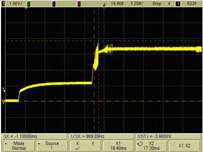

Figure 11. Input Voltage Overshoot <4V (Good)

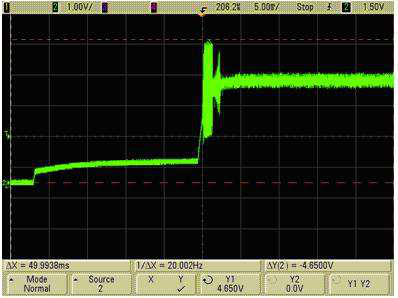

Figure 12. Input Voltage Overshoot >4V (Bad)

Integrated 10/100/1000M Ethernet Transceiver

Track ID: JATR-8275-15   Rev. 1.1

48

---
*下一页*

RTL8211F(I)/RTL8211FD(I)

Datasheet

From the output side measured at the REG_OUT pin, the voltage ripple must be within

100mV peak-to-peak. Choosing different types and values of input and output capacitor (Cin1, Cin2;

Cout1, Cout2) and power inductor (Lx) will seriously affect the efficiency and output voltage ripple of

switching regulators. The following figures show the effects of different types of capacitors on the

switching regulator’s output voltage.

The blue square wave signal (top row) is measured at the output of the REG_OUT pin before the power

inductor (Lx). The yellow signal (second row) is measured after the power inductor (Lx), and shows there is

a voltage ripple. The green signal (lower row) is the current. Data in the following figures was measured at

gigabit speed.

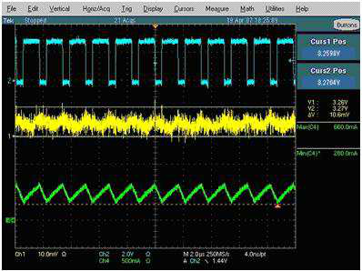

Figure 13. Ceramic 10µF 0603 (X5R) (Good)

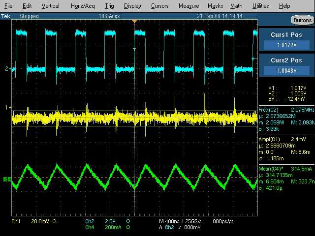

Figure 14. L=GLK2510P-2R2M, C=Ceramic 4.7µF 0805 X5R TDK (Ripple 12.4mV)

Integrated 10/100/1000M Ethernet Transceiver

Track ID: JATR-8275-15   Rev. 1.1

49

---
*下一页*

RTL8211F(I)/RTL8211FD(I)

Datasheet

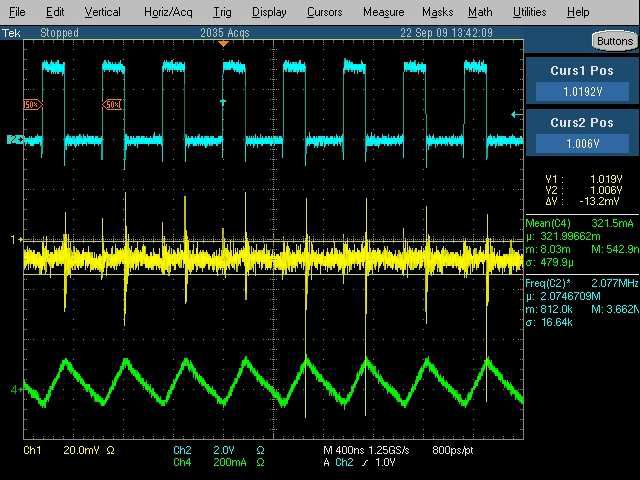

Figure 15. L=GLK2510P-2R2M, C=Ceramic 10µF 0603 X5R YAGEO (Ripple 13.2mV)

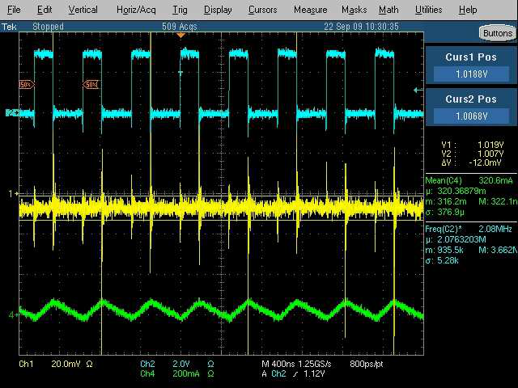

Figure 16. L=GLK2510P-4R7M, C=Ceramic 4.7µF 0805 X5R TDK (Ripple 12mV)

Integrated 10/100/1000M Ethernet Transceiver

Track ID: JATR-8275-15   Rev. 1.1

50

---
*下一页*

RTL8211F(I)/RTL8211FD(I)

Datasheet

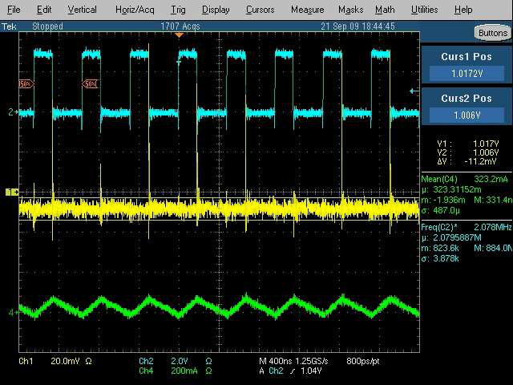

Figure 17. L=GLK2510P-4R7M, C=Ceramic 10µF 0603 X5R YAGEO (Ripple 11.2mV)

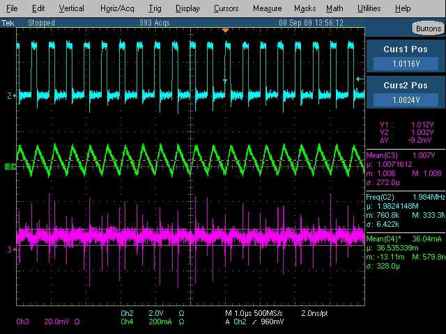

Figure 18. L=GTSD32P-2R2M, C=Ceramic 4.7µF 0805 X5R TDK (Ripple 9.2mV)

Integrated 10/100/1000M Ethernet Transceiver

Track ID: JATR-8275-15   Rev. 1.1

51

---
*下一页*

RTL8211F(I)/RTL8211FD(I)

Datasheet

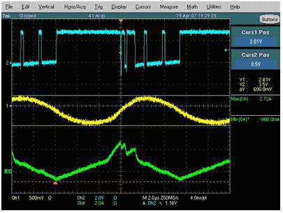

Figure 19. Ceramic 10µF (Y5V) (Bad)

A ceramic 10µF (X5R) will have a lower voltage ripple compared to an electrolytic 100µF. The key to

choosing a proper output capacitor is to choose the lowest ESR to reduce the output voltage ripple.

Choosing a ceramic 10µF (Y5V) in this case will cause malfunction of the switching regulator. Placing

several Electrolytic capacitors in parallel will help lower the output voltage ripple.

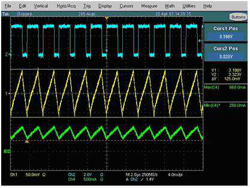

Figure 20. Electrolytic 100µF (Ripple Too High)

Integrated 10/100/1000M Ethernet Transceiver

Track ID: JATR-8275-15   Rev. 1.1

52

---
*下一页*

RTL8211F(I)/RTL8211FD(I)

Datasheet

The following figures show how different inductors affect the REG_OUT output waveform. The typical

waveform should look like Figure 21, which has a square waveform with a dip at the falling edge and the

rising edge. If the inductor is not carefully chosen, the waveform may look like Figure 22, where the

waveform looks like a distorted square. This will cause insufficient current supply and will undermine the

stability of the system at gigabit speed. Data in the following figures was measured at gigabit speed

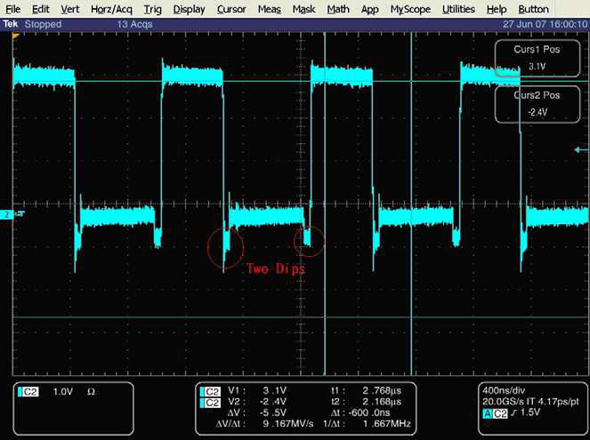

Figure 21. GTSD32P-2R2M

(Good)

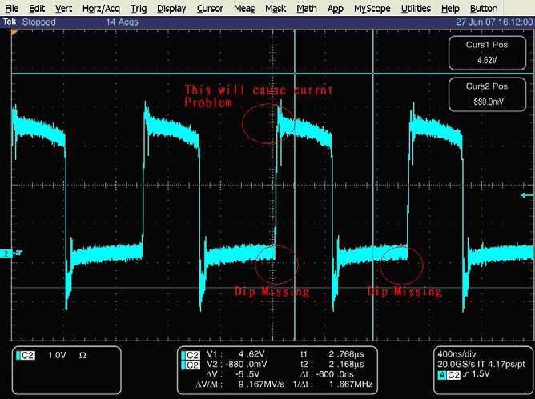

Figure 22. 1µH Bead (Bad)

Integrated 10/100/1000M Ethernet Transceiver

Track ID: JATR-8275-15   Rev. 1.1

53

---
*下一页*

RTL8211F(I)/RTL8211FD(I)

Datasheet

9.1.4.

Efficiency Measurement

The efficiency of the switching regulator is designed to be above 75% in gigabit traffic mode. It is very

important to choose a suitable inductor before Gerber certification, as the Inductor ESR value will affect the

efficiency of the switching regulator. An inductor with a lower ESR value will result in a higher-efficiency

switching regulator.

The efficiency of the switching regulator is easily measured using the following method.

Figure 23 shows two checkpoints, checkpoint A (CP_A) and checkpoint B (CP_B). The switching

regulator input current (Icpa) should be measured at CP_A, and the switching regulator output current

(Icpb) should be measured at CP_B.

To determine efficiency, apply the following formula:

Efficiency = Vcpb*Icpb/Vcpa*Icpa

Where Vcpb is 1.05V; Vcpa is 3.3V. The measurements should be performed in gigabit traffic mode.

For example: The inductor used in the evaluation board is a GOTREND GTSD32-4R7M:

•

The ESR value @ 1MHz is approximately 0.712ohm

•

The measured Icpa is 101mA at CP_A

•

The measured Icpb is 263mA at CP_B

These values are measured in gigabit traffic mode, so the efficiency of the GOTREND GTSD32-4R7M can

be calculated as follows:

Efficiency = (1.05V*263mA)/(3.3V*101mA) = 0.823 = 82.3%.

We strongly recommend that when choosing an inductor for the switching regulator, the efficiency should

be measured, and that the inductor should yield an efficiency rating higher than 75%. If the efficiency does

not meet this requirement, there may be risk to the switching regulator reliability in the long run.

CP_A

CP_B

Figure 23. Switching Regulator Efficiency Measurement Checkpoint

Integrated 10/100/1000M Ethernet Transceiver

Track ID: JATR-8275-15   Rev. 1.1

54

---
*下一页*

RTL8211F(I)/RTL8211FD(I)

Datasheet

9.2.

Low-dropout Regulator (RTL8211FD(I))

The RTL8211FD(I) incorporates a state-of-the-art low-dropout regulator (LDO). The regulator 1.0V

output pin (LDO_OUT) should be connected only to DVDD10 and AVDD10 pins (do not provide this

power source to other devices).

Integrated 10/100/1000M Ethernet Transceiver

Track ID: JATR-8275-15   Rev. 1.1

55

---
*下一页*

RTL8211F(I)/RTL8211FD(I)

Datasheet

9.3.

Power Sequence

Figure 24. Power Sequence

Table 51. Power Sequence Parameters

Symbol

Description

Min

Typical

Max

Units

Rt1

3.3V Rise Time

0.5*

-

100

ms

Rt1

2.5/1.8/1.5V RGMII Rise Time

-

-

100

ms

Rt2

3.3V Off Time

100

-

-

ms

Rt3

Core Logic Ready Time

20

-

-

ms

Rt4

LDO Ready time

1.5

-

-

ms

Note 1: The RTL8211F(I)/RTL8211FD(I) does not support fast 3.3V rising. The 3.3V rise time should be controlled over

0.5ms.

* A 3.3V rise time between 0.1ms to 0.5ms is conditionally permitted only if the system 3.3V power budget is sufficient to

ensure that 3.3V Overcurrent Protection (OCP) will NOT be triggered during the power-on procedure. If the rise time is less

than 0.1ms, it will induce a peak voltage in DVDD33 which may cause permanent damage to the regulator.

Note 2: If there is any action that involves consecutive ON/OFF toggling of the switching-regulator source (3.3V), the

design must make sure the OFF state of both the switching-regulator source (3.3V) and output (1.05V) reach 0V, and the

time period between the consecutive ON/OFF toggling action must be longer than 100ms.

Note 3: When using an external oscillator or clock source, on stopping the clock source the RTL8211F(I)/RTL8211FD(I)

must also be powered off.

Note 4: The RTL8211F(I)/ RTL8211FD(I) use the integrated LDO to generate the 2.5V, 1.8V/1.5V voltages for the I/O pad,

the I/O pad voltage can be selected by using the CONFIG pins CFG_LDO[1:0]. Moreover, external power source for the

I/O pad is also supported, please refer to the setting of CFG_EXT and CFG_LDO[1:0] pins (section 7.8 Hardware

Configuration, page 15).

Note 5: When using an external power source for the I/O pad , 2.5V (or 1.8/1.5V) RGMII power should rise  simultaneously

or slightly earlier than 3.3V power. Rising 2.5V (or 1.8/1.5V) power later than 3.3V power may lead to errors.

Integrated 10/100/1000M Ethernet Transceiver

Track ID: JATR-8275-15   Rev. 1.1

56

---
*下一页*

RTL8211F(I)/RTL8211FD(I)

Datasheet

10.

Characteristics

10.1.

Absolute Maximum Ratings

WARNING: Absolute maximum ratings are limits beyond which permanent damage may be caused to the

device, or device reliability will be affected. All voltages are specified reference to GND unless otherwise

specified.

Table 52. Absolute Maximum Ratings

Symbol

Description

Minimum

Maximum

Unit

VDD33, AVDD33

Supply Voltage 3.3V

-0.3

3.6

V

AVDD10, DVDD10

Supply Voltage 1.0V

-0.3

1.2

V

2.5V RGMII/GMII

Supply Voltage 2.5V

-0.2

2.8

V

1.8V RGMII

Supply Voltage 1.8V

-0.2

2.3

V

1.5V RGMII

Supply Voltage 1.5V

-0.2

2.0

V

3.3V DCinput

Input Voltage

-0.3

3.6

V

3.3V DCoutput

Output Voltage

1.0V DCinput

Input Voltage

-0.3

1.2

V

1.0V DCoutput

Output Voltage

°

NA

Storage Temperature

-55

+125

C

Note: Refer to the most updated schematic circuit for correct configuration.

10.2.

Recommended Operating Conditions

Table 53. Recommended Operating Conditions

Description

Pins

Minimum

Typical

Maximum

Unit

Supply Voltage VDD

DVDD33, AVDD33

2.97

3.3

3.63

V

AVDD10, DVDD10

0.95

1.0

1.05

V

2.5V RGMII/GMII

2.25

2.5

2.75

V

1.8V RGMII

1.62

1.8

1.98

V

1.5V RGMII

1.5

1.55

1.6

V

°

Ambient Operating Temperature T

-

0

-

70

C

A

(RTL8211F/RTL8211FD)

°

Ambient Operating Temperature T

-

-40

-

85

C

A

(RTL8211FI/RTL8211FDI)

°

Maximum Junction Temperature

-

-

-

125

C

Integrated 10/100/1000M Ethernet Transceiver

Track ID: JATR-8275-15   Rev. 1.1

57

---
*下一页*

RTL8211F(I)/RTL8211FD(I)

Datasheet

10.3.

Crystal Requirements

Table 54. Crystal Requirements

Symbol

Description/Condition

Minimum

Typical

Maximum

Unit

F

Parallel Resonant Crystal Reference Frequency,

-

25

-

MHz

ref

Fundamental Mode, AT-Cut Type.

F

Tolerance

Parallel Resonant Crystal Frequency Tolerance,

-50

-

+50

ppm

ref

°

°

Fundamental Mode, AT-Cut Type. T

=0

C~70

C.

a

F

Duty Cycle

Reference Clock Input Duty Cycle.

40

-

60

%

ref

Ω

ESR

Equivalent Series Resistance.

-

-

50

DL

Drive Level.

-

-

0.5

mW

Jitter

Broadband Peak-to-Peak Jitter1, 2

-

-

200

ps

V

_CKXTAL

Crystal Output High Level

1.4

-

-

V

ih

V

_CKXTAL

Crystal Output Low Level

-

-

0.4

V

il

Note 1: 25kHz  to 25MHz RMS < 3ps.

Note 2: Broadband RMS < 9ps.

Tolerance +/- 50ppm including effects of aging of the first year, external crystal capacitors, and PCB layout.

Note3: F

ref

10.4.

Oscillator/External Clock Requirements

Table 55. Oscillator/External Clock Requirements

Parameter

Condition

Minimum

Typical

Maximum

Unit

Frequency

-

-

25/50

-

MHz

Frequency Tolerance (RTL8211F/RTL8211FD)

Ta=0°C~70°C

-50

-

50

ppm

Frequency Tolerance (RTL8211FI/RTL8211FDI)

Ta=-40°C~85°C

-50

-

50

ppm

Duty Cycle

-

40

-

60

%

1, 2

Broadband Peak-to-Peak Jitter

-

-

-

200

ps

Vpeak-to-peak

-

3.15

3.3

3.45

V

Rise Time (10%~90%)

-

-

-

10

ns

Fall Time (10%~90%)

-

-

-

10

ns

Operating Temperature Range

-

-40

-

85

°C

Note 1: 25kHz to 25MHz RMS < 3ps.

Note 2: Broadband RMS < 9ps.

Note3: Frequency Tolerance +/- 50ppm including effects of aging of the first year, external crystal capacitors, and PCB

layout.

Integrated 10/100/1000M Ethernet Transceiver

Track ID: JATR-8275-15   Rev. 1.1

58

---
*下一页*

RTL8211F(I)/RTL8211FD(I)

Datasheet

10.5.

DC Characteristics

Table 56. DC Characteristics

Symbol

Parameter

Conditions

Minimum

Typical

Maximum

Units

VDD33, AVDD33

3.3V Supply Voltage

-

2.97

3.3

3.63

V

1. MDIO (Table 4,

page 8)

2.5V RGMII Supply Voltage

-

2.25

2.5

2.75

V

2. RGMII I/O

(Table 3, page 8)

1. MDIO (Table 4,

page 8)

1.8V RGMII Supply Voltage

-

1.62V

1.8V

1.98V

V

2. RGMII I/O

(Table 3, page 8)

1. MDIO (Table 4,

page 8)

1.5V RGMII Supply Voltage

-

1.5V

1.55V

1.6V

V

2. RGMII I/O

(Table 3, page 8)

DVDD10,

1.0V Supply Voltage

-

0.95

1.0

1.05

V

AVDD10

Voh (3.3V)

Minimum High Level Output Voltage

-

2.4

-

VDD33 + 0.3

V

Voh (2.5V)

Minimum High Level Output Voltage

-

2.0

-

VDD25 + 0.3

V

Voh (1.8V)

Minimum High Level Output Voltage

-

0.9*VDD18

-

VDD18 + 0.3

V

Voh (1.5V)

Minimum High Level Output Voltage

-

0.9*VDD15

-

VDD15 + 0.3

V

Vol (3.3V)

Maximum Low Level Output Voltage

-

-0.3

-

0.4

V

Vol (2.5V)

Maximum Low Level Output Voltage

-

-0.3

-

0.4

V

Vol (1.8V)

Maximum Low Level Output Voltage

-

-0.3

-

0.1*VDD18

V

Vol (1.5V)

Maximum Low Level Output Voltage

-

-0.3

-

0.1*VDD15

V

Vih (3.3V)

Minimum High Level Input Voltage

-

2.0

-

-

V

Vil (3.3V)

Maximum Low Level Input Voltage

-

-

-

0.8

V

Vih (2.5V)

Minimum High Level Input Voltage

-

1.7

-

-

V

Vil (2.5V)

Maximum Low Level Input Voltage

-

-

-

0.7

V

Vih (1.8V)

Minimum High Level Input Voltage

-

1.2

-

-

V

Vil (1.8V)

Maximum Low Level Input Voltage

-

-

-

0.5

V

Vih (1.5V)

Minimum High Level Input Voltage

-

1.0

-

-

V

Vil (1.5V)

Maximum Low Level Input Voltage

-

-

-

0.3

V

Vin=VDD33

Iin

Input Current

0

-

0.5

µA

or GND

Note: Pins not mentioned above remain at 3.3V.

Integrated 10/100/1000M Ethernet Transceiver

Track ID: JATR-8275-15   Rev. 1.1

59

---
*下一页*

RTL8211F(I)/RTL8211FD(I)

Datasheet

10.6.

AC Characteristics

10.6.1.

MDC/MDIO Timing

Figure 25. MDC/MDIO Setup, Hold Time, and Valid from MDC Rising Edge Time Definitions

MDC/MDIO Timing – Management Port

Figure 26. MDC/MDIO Management Timing Parameters

Table 57. MDC/MDIO Management Timing Parameters

Symbol

Description

Minimum

Maximum

Unit

t

MDC High Pulse Width

32

-

ns

1

t

MDC Low Pulse Width

32

-

ns

2

t

MDC Period

80

-

ns

3

t

MDIO Setup to MDC Rising Edge

10

-

ns

4

t

MDIO Hold Time from MDC Rising Edge

10

-

ns

5

t

MDIO Valid from MDC Rising Edge

0

300

ns

6

Integrated 10/100/1000M Ethernet Transceiver

Track ID: JATR-8275-15   Rev. 1.1

60

---
*下一页*

RTL8211F(I)/RTL8211FD(I)

Datasheet

10.6.2.

RGMII Timing Modes

Timing for this interface will be such that the clock and data are generated simultaneously by the source of

the signals and therefore skew between the clock and data is critical to proper operation.

Figure 27 shows the effect of adding an internal delay to TXC when in RGMII mode.

Figure 27. RGMII Timing Modes (For TXC)

Integrated 10/100/1000M Ethernet Transceiver

Track ID: JATR-8275-15   Rev. 1.1

61

---
*下一页*

RTL8211F(I)/RTL8211FD(I)

Datasheet

Figure 28 shows the effect of adding an internal delay to the RXC flow when in RGMII mode.

Figure 28. RGMII Timing Modes (For RXC)

Integrated 10/100/1000M Ethernet Transceiver

Track ID: JATR-8275-15   Rev. 1.1

62

---
*下一页*

RTL8211F(I)/RTL8211FD(I)

Datasheet

Table 58. RGMII Timing Parameters

Symbol

Description

Min

Typical

Max

Units

TGCC

Clock Cycle Duration (1000Mbps)

7.2

8

8.8

ns

Clock Cycle Duration (100Mbps)

36

40

44

ns

Clock Cycle Duration (10Mbps)

360

400

440

ns

Duty_G

Duty Cycle for 1000

45

50

55

%

Duty_T

Duty Cycle for 10/100

40

50

60

%

tR

TXC/RXC Rise Time (20%~80%)

-

-

0.75

ns

tF

TXC/RXC Fall Time (20%~80%)

-

-

0.75

ns

TsetupT

Data to Clock Output Setup (at transmitter

1.2

2

-

ns

integrated delay)

TholdT

Data to Clock Output Hold (at transmitter

1.2

2

-

ns

integrated delay)

TsetupR

Data to Clock Input Setup (at receiver integrated

1.0

2

-

ns

delay)

TholdR

Data to Clock Input Hold (at receiver integrated

1.0

2

-

ns

delay)

TskewT

Data to Clock Output Skew (at transmitter)

-0.5

0

0.5

ns

TskewR

Data to Clock Input Skew (at receiver)

1

1.8

2.6

ns

This implies that PC board design will require

clocks to be routed such that an additional trace

delay of greater than 1.5ns and less than 2.0ns

will be added to the associated clock signal.

Integrated 10/100/1000M Ethernet Transceiver

Track ID: JATR-8275-15   Rev. 1.1

63

---
*下一页*

RTL8211F(I)/RTL8211FD(I)

Datasheet

11.

Mechanical Dimensions

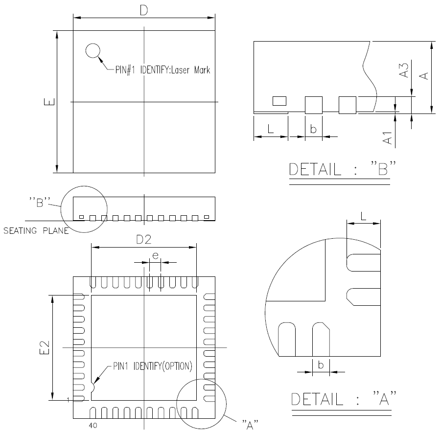

11.1.

Mechanical Dimensions Notes

Symbol

Dimension in mm

Dimension in inch

Min

Nom

Max

Min

Nom

Max

A

0.80

0.85

0.90

0.031

0.033

0.035

A

0.00

0.02

0.05

0.000

0.001

0.002

1

A

0.20REF

0.008REF

3

b

0.15

0.20

0.25

0.006

0.008

0.010

D/E

5.00 BSC

0.197 BSC

D2/E2

3.45

3.70

3.95

0.136

0.146

0.156

e

0.40 BSC

0.016 BSC

L

0.30

0.40

0.50

0.012

0.016

0.020

Note 1: CONTROLLING DIMENSION: MILLIMETER (mm).

Note 2: REFERENCE DOCUMENT: JEDEC MO-220.

Integrated 10/100/1000M Ethernet Transceiver

Track ID: JATR-8275-15   Rev. 1.1

64

---
*下一页*

RTL8211F(I)/RTL8211FD(I)

Datasheet

12.

Ordering Information

Table 59. Ordering Information

Part Number

Package

Status

RTL8211F-CG

40-Pin QFN with ‘Green’ Package (Switching Regulator model)

ES ready

MP in Mar/2014

RTL8211FD-CG

40-Pin QFN with ‘Green’ Package (LDO model)

ES ready

MP in Mar/2014

RTL8211FI-CG

40-Pin QFN with ‘Green’ Package (Switching Regulator model)

-

Industrial grade.

RTL8211FDI-CG

40-Pin QFN with ‘Green’ Package (LDO model). Industrial grade.

-

Note: See page 6  for package identification.

Realtek Semiconductor Corp.

Headquarters

No. 2, Innovation Road II

Hsinchu Science Park, Hsinchu 300, Taiwan

Tel.: +886-3-578-0211   Fax: +886-3-577-6047

www.realtek.com

Integrated 10/100/1000M Ethernet Transceiver

Track ID: JATR-8275-15   Rev. 1.1

65

