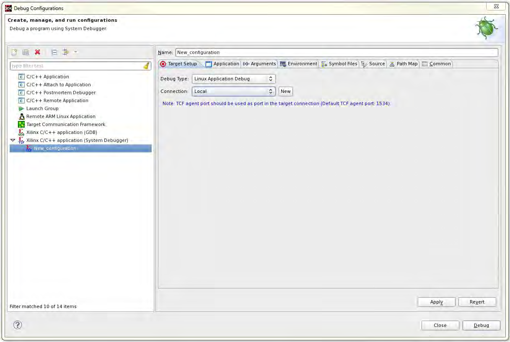
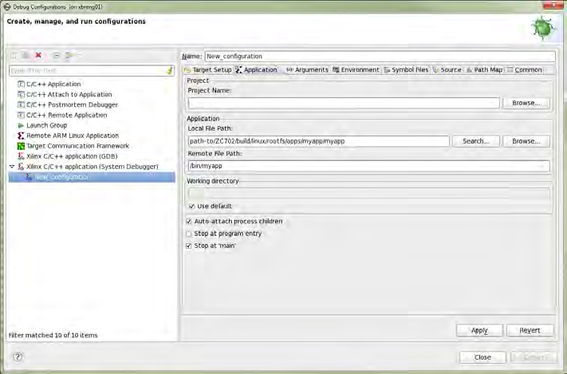
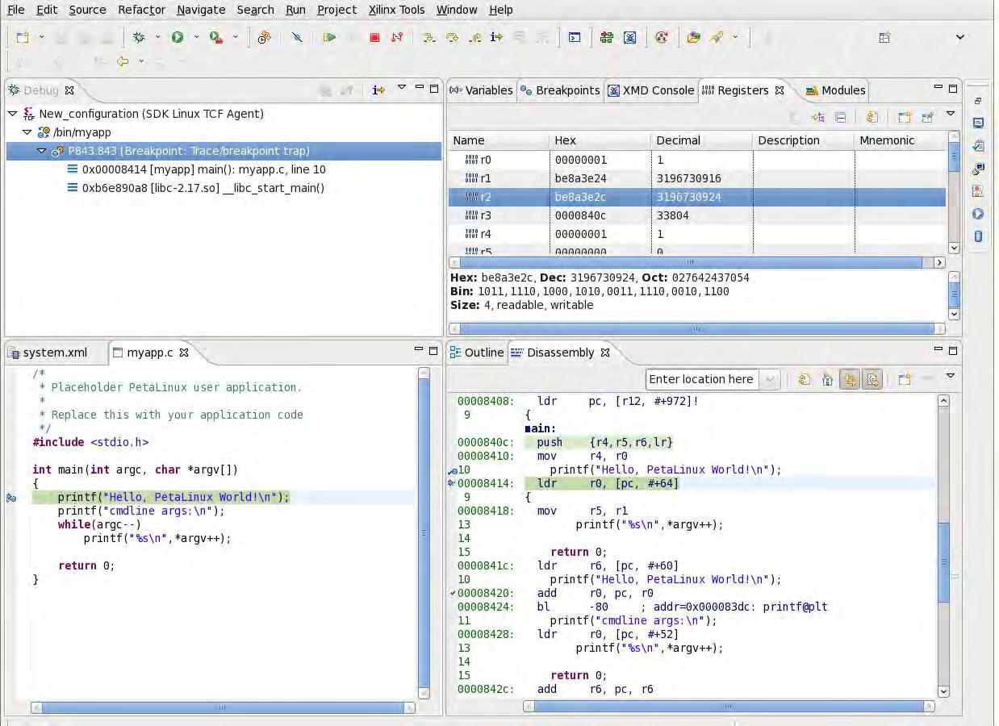
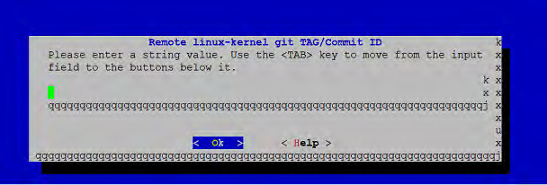

# c_ug1144-petalinux-tools-reference-guide
*来源 PDF: `c_ug1144-petalinux-tools-reference-guide.pdf`*

---

工具文档

PetaLinux

参考指南

年

月

日

UG1144 (v2019.1) 2019

5

22

条款中英文版本如有歧义，概以英文本为准。

---
*下一页*

修订历史

修订历史

下表列出了本文档的修订历史。

章节

修订总结

年

月

日

版

2019

5

22

2019.1

第

章

升级工作空间

新增“

命令”一节。

6

:

petalinux-upgrade

新增“封装管理”一节。

第

章

技术

FAQ

12

:

第

章

高级设置

更新“

和

器件

管

10

:

Zynq

UltraScale+

MPSoC

Zynq-7000

FPGA

®

™

理器配置和使用”。

年

月

日

UG1144 (v2019.1) 2019

5

22

china.xilinx.com

Send Feedback

工具文档参考指南

PetaLinux

2

---
*下一页*

目录

修订历史

..........................................................................................................................................................................2

第

章

简介

1

:

................................................................................................................................................................. 6

引言

..................................................................................................................................................................................6

第

章

建立环境

2

:

...................................................................................................................................................... 8

安装要求

.......................................................................................................................................................................... 8

安装步骤

........................................................................................................................................................................ 10

工作环境建立

PetaLinux

...............................................................................................................................................12

设计流程简介

.................................................................................................................................................................13

第

章

创建工程

3

:

.................................................................................................................................................... 14

安装

PetaLinux BSP

......................................................................................................................................................14

使用

设置硬件平台

Vivado Design Suite

.....................................................................................................................15

将硬件平台导出到

工程

PetaLinux

...............................................................................................................................16

创建新的

工程

PetaLinux

..............................................................................................................................................17

第

章

设置和构建

4

:

...............................................................................................................................................19

版本控制

........................................................................................................................................................................ 19

导入硬件配置

.................................................................................................................................................................20

构建系统镜像

.................................................................................................................................................................21

生成

的启动镜像

Zynq UltraScale+ MPSoC

.................................................................................................................24

生成

器件的启动镜像

Zynq-7000

..................................................................................................................................24

生成

处理器的启动镜像

MicroBlaze

.............................................................................................................................25

生成

比特流文件

MicroBlaze

........................................................................................................................................25

构建最优化

.....................................................................................................................................................................26

第

章

启动和封装

5

:

...............................................................................................................................................30

封装预建镜像

.................................................................................................................................................................30

使用

命令处理预建镜像

petalinux-boot

...................................................................................................................... 30

启动

上的

镜像

QEMU

PetaLinux

................................................................................................................................ 31

利用

卡在硬件上启动

镜像

SD

PetaLinux

.................................................................................................................... 34

利用

在硬件上启动

镜像

JTAG

PetaLinux

.....................................................................................................................36

使用

启动硬件上的

镜像

TFTP

PetaLinux

.................................................................................................................... 39

封装

BSP

........................................................................................................................................................................41

第

章

升级工作空间

6

:

..........................................................................................................................................43

选项

petalinux-upgrade

.............................................................................................................................................. 43

年

月

日

UG1144 (v2019.1) 2019

5

22

china.xilinx.com

Send Feedback

工具文档参考指南

PetaLinux

3

---
*下一页*

升级

工具

PetaLinux

.....................................................................................................................................................43

升级

工程

PetaLinux

.....................................................................................................................................................44

第

章

自定义工程

7

:

...............................................................................................................................................46

固件版本设置

.................................................................................................................................................................46

根文件系统类型配置

......................................................................................................................................................46

启动镜像存储配置

......................................................................................................................................................... 47

主闪存分区配置

............................................................................................................................................................. 48

管理镜像大小

.................................................................................................................................................................48

配置

INITRD BOOT.......................................................................................................................................................49

设置

启动

INITRAMFS

...................................................................................................................................................50

设置

启动

TFTP

..............................................................................................................................................................51

设置

启动

NFS

............................................................................................................................................................... 52

设置

启动

JFFS2

............................................................................................................................................................. 53

配置

卡

文件系统启动

SD

ext

........................................................................................................................................54

第

章

自定义

8

:

Rootfs

........................................................................................................................................ 57

包含预构建库

.................................................................................................................................................................57

包含预构建应用

............................................................................................................................................................. 58

创建和添加定制库

......................................................................................................................................................... 59

测试用户库

.....................................................................................................................................................................61

创建和添加定制应用

......................................................................................................................................................62

创建和添加定制模块

......................................................................................................................................................63

构建用户应用

.................................................................................................................................................................64

测试用户应用

.................................................................................................................................................................66

构建用户模块

.................................................................................................................................................................66

自动登录

PetaLinux

......................................................................................................................................................67

开机时应用程序自动运行

.............................................................................................................................................. 68

添加层级

........................................................................................................................................................................ 69

将现有配方添加到

RootFS............................................................................................................................................ 70

添加封装组

.....................................................................................................................................................................71

第

章

调试

9

:

............................................................................................................................................................... 72

在

中调试

内核

QEMU

Linux

........................................................................................................................................ 72

使用

代理调试应用程序

TCF

..........................................................................................................................................73

使用

调试

应用

GDB

Zynq UltraScale+ MPSoC

.......................................................................................................... 78

调试单独的

组件

PetaLinux

..........................................................................................................................................81

第

章

高级设置

10

:

................................................................................................................................................. 83

使用方法

Menuconfig

.................................................................................................................................................. 83

的

系统

PetaLinux

menuconfig

...................................................................................................................................83

配置树外构建

.................................................................................................................................................................89

设置工程组件

.................................................................................................................................................................92

第

章

功能

11

: Yocto

.............................................................................................................................................97

生成（目标系统引导生成）

SDK

.................................................................................................................................. 97

年

月

日

UG1144 (v2019.1) 2019

5

22

china.xilinx.com

Send Feedback

工具文档参考指南

PetaLinux

4

---
*下一页*

访问工程中的

BitBake.................................................................................................................................................. 98

共享

sstate-cache.........................................................................................................................................................99

下载镜像

........................................................................................................................................................................ 99

机器支持

........................................................................................................................................................................ 99

变体支持

SoC

...............................................................................................................................................................100

镜像功能

...................................................................................................................................................................... 101

第

章

技术

12

:

FAQ

.............................................................................................................................................. 102

故障排除

...................................................................................................................................................................... 102

附录

移植

A:

..............................................................................................................................................................106

工具目录结构

...............................................................................................................................................................106

覆盖支持

DT

................................................................................................................................................................ 106

更改构建

...................................................................................................................................................................... 106

附录

工程结构

B: PetaLinux

.........................................................................................................................107

工程层级

...................................................................................................................................................................... 110

附录

生成启动组件

C:

........................................................................................................................................ 111

第一阶段启动加载器

(FSBL)........................................................................................................................................111

可信固件

Arm

(ATF)....................................................................................................................................................111

固件

PMU

.................................................................................................................................................................... 112

仅用于

平台的

MicroBlaze

FS-Boot........................................................................................................................... 113

附录

虚拟网络模式

D: QEMU

...................................................................................................................... 114

非根模式下重定向端口

................................................................................................................................................114

指定

虚拟子网络

QEMU

..............................................................................................................................................115

附录

支持的赛灵思

模型

E: QEMU

IP

.....................................................................................................116

附录

示例

F: Xen Zynq UltraScale+ MPSoC

.....................................................................................118

要求

..............................................................................................................................................................................118

附录

附加资源与法律提示

G:

........................................................................................................................121

赛灵思资源

.................................................................................................................................................................. 121

参考资料

...................................................................................................................................................................... 121

与设计中心

Documentation Navigator

....................................................................................................................121

请阅读：重要法律提示

................................................................................................................................................122

年

月

日

UG1144 (v2019.1) 2019

5

22

china.xilinx.com

Send Feedback

工具文档参考指南

PetaLinux

5

---
*下一页*

第

章

简介

1

:

第

章

1

简介

引言

是一种嵌入式

软件开发套件

，主要用于赛灵思

基片上系统设计。本指南可帮助读者熟悉

PetaLinux

Linux

(SDK)

FPGA

实现

全面用途的工具。

PetaLinux

我们假定您具有

基本知识，比如了解如何运行

命令。您应该知晓操作系统和主机系统功能，比如操作系统

Linux

Linux

版本、

分布、安全权限以及

基本

概念

。

Linux

Yocto

工具包含：

PetaLinux

•

可扩展

Yocto

SDK (eSDK)

• 最少量的下载

•

和工具链

XSCT

•

工具

PetaLinux CLI

注释

赛灵思软件开发套件

是集成设计环境

，用于在赛灵思微处理器上创建嵌入式应用程序。

:

(SDK) (XSDK)

(IDE)

是一种赛灵思开发工具，含有构建、开发、测试和部署嵌入式

系统所需的所有功能。

PetaLinux SDK

Linux

可扩展

Yocto

SDK (eSDK)

下表详细说明了已安装的四个可扩展

。

SDK

表

可扩展

1:

SDK

路径

架构

Zynq

UltraScale+

MPSoC

®

™

$PETALINUX/components/yocto/source/aarch64

器件

Zynq-7000

$PETALINUX/components/yocto/source/arm

平台完整设计

MicroBlaze

™

$PETALINUX/components/yocto/source/

microblaze_full

平台简化设计

MicroBlaze

$PETALINUX/components/yocto/source/

microblaze_lite

最少量的下载

在查找上游任何源文件之前要校验

。当您拥有未使用

变量定义的共享目录时，

BitBake

PREMIRRORS

DL_DIR

即合适。工具的所有工程都使用这些

并从中获取源代码。

PREMIRRORS

PREMIRRORS

工具中的

指向：

。下载目录拥有

内核、

PREMIRROR

Linux

U-Boot

$PETALINUX/components/yocto/downloads

以及其他小型实用工具的源代码打包工具。如需了解更多信息，请参阅

下载镜像

。

年

月

日

UG1144 (v2019.1) 2019

5

22

china.xilinx.com

Send Feedback

工具文档参考指南

PetaLinux

6

---
*下一页*

第

章

简介

1

:

和工具链

XSCT

对于所有内嵌式软件应用程序，

工具都使用下面的

。所有三个架构的

工具链都来自

。

PetaLinux

XSCT

Linux

Yocto

命令行接口

工具

PetaLinux

(CLI)

这包含您需要的所有

命令。

PetaLinux

年

月

日

UG1144 (v2019.1) 2019

5

22

china.xilinx.com

Send Feedback

工具文档参考指南

PetaLinux

7

---
*下一页*

第

章

建立环境

2

:

第

章

2

建立环境

安装要求

工具安装要求如下：

PetaLinux

• 工作站最低要求：

（推荐的赛灵思工具的最低要求）

8 GB RAM

○

时钟或同等频率（最低

核）

2 GHz CPU

8

○

未使用

空间

100 GB

HDD

○

支持的操作系统：

○

工作站

服务器

（

位）

-

Red Hat Enterprise

/

7.4, 7.5, 7.6

64

、

、

位

-

CentOS 7.4

7.5

7.6 (64

)

、

位

-

Ubuntu Linux 16.04.5

18.04.1 (64

)

• 您需要拥有根访问权才能安装下表所示的所需软件包。

工具需要以非根用户的身份安装。

PetaLinux

•

要求在您的

主机工作站中安装很多标准开发工具和库。在

主机上安装下表所列的库和工具。

PetaLinux

Linux

Linux

下文列出的所有

工作站环境都拥有

工具所需的

位库。如果还有任何其他工具链软件包需要主机

Linux

PetaLinux

32

上有

位库，在发布

之前要安装相同的库和工具。下表列出了所需的软件包，并介绍了在不

32

petalinux-build

同

工作站环境中的安装方法。

Linux

•

工具要求您的主机系统

为“

”。如果您在使用

分布，而您的

为

PetaLinux

bash

Ubuntu

/bin/sh

/bin/sh

“

”，请咨询系统管理员，更改默认的系统

，请使用

命令

dash

shell

/bin/sh

sudo dpkg-reconfigure dash

更改。

表

封装和

工作站环境

2:

Linux

、

工作站

服

Ubuntu Linux 16.04.5

Red Hat Enterprise

/

工具

库

、

、

位

/

CentOS 7.4

7.5

7.6 (64

)

、

、

位

位

务器

7.4

7.5

7.6 (64

)

18.04.1 (64

)

dos2unix

dos2unix-6.0.3-4.el7.x86_64.r

dos2unix-6.0.3-4.el7.x86_64.r

tofrodos_1.7.13+ds-2.debian.

pm

pm

tar.xz

ip

iproute-3.10.0-74.el7.x86_64.r

iproute-3.10.0-74.el7.x86_64.r

iproute2 4.3.0-1ubuntu3

pm

pm

gawk

gawk-4.0.2-4.el7.x86_64.rpm

gawk-4.0.2-4.el7.x86_64.rpm

gawk (1:4.1.3+dfsg-0.1)

gcc

gcc-4.8.5-11.el7.x86_64

gcc-4.8.5-11.el7.x86_64

-

g++ (gcc-c++)

gcc-c++-4.8.5-11.el7.x86_64

gcc-c++-4.8.5-11.el7.x86_64

-

make

make 3.81

make 3.82

make 3.81

netstat

net-tools

net-tools

net-tools

2.0

2.0

年

月

日

UG1144 (v2019.1) 2019

5

22

china.xilinx.com

Send Feedback

工具文档参考指南

PetaLinux

8

---
*下一页*

第

章

建立环境

2

:

表

封装和

工作站环境

续

2:

Linux

(

)

工作站

服

、

Red Hat Enterprise

/

Ubuntu Linux 16.04.5

工具

库

、

、

位

/

CentOS 7.4

7.5

7.6 (64

)

务器

、

、

位

位

7.4

7.5

7.6 (64

)

18.04.1 (64

)

ncurses

ncurses

ncurses

libncurses5

devel

-devel

-devel

-dev

5.9-13

5.9-13

tftp server

tftp-server

tftp-server

tftpd

（另，安装此版本的

zlib1g:i386

zlib-

zlib devel

zlib-

位版本）

devel-1.2.7-17.el7.x86_64.rp

devel-1.2.7-17.el7.x86_64.rp

32

m

m

openssl

openssl

openssl

libssl

devel

-devel 1.0

-devel 1.0

-dev

flex

flex 2.5.37

flex 2.5.37

flex

bison

bison-2.7

bison-2.7.4

bison

libselinux

libselinux

libselinux

libselinux1

2.2.2

2.2.2

gnupg

gnupg

gnupg

gnupg

wget

wget

wget

wget

diffstat

diffstat

diffstat

diffstat

chrpath

chrpath

chrpath

chrpath

socat

socat

socat

socat

xterm

xterm

xterm

xterm

autoconf

autoconf

autoconf

autoconf

libtool

libtool

libtool

libtool

tar

tar:1.24

tar:1.24

tar:1.24

unzip

unzip

unzip

unzip

texinfo

texinfo

texinfo

texinfo

zlib1g-dev

-

-

zlib1g-dev

gcc-multilib

-

-

gcc-multilib

build-essential

-

-

build-essential

SDL-devel

SDL-devel

SDL-devel

-

glibc-devel

glibc-devel

glibc-devel

-

32-bit glibc

glibc-2.17-157.el7_3.4.i686

glibc-2.17-157.el7_3.4.i686

-

glibc-2.17-157.el7_3.4.x86_64

glibc-2.17-157.el7_3.4.x86_64

glib2-devel

glib2-devel

glib2-devel

-

automake

automake

automake

-

screen

screen

screen

screen

pax

pax

pax

pax

gzip

gzip

gzip

gzip

libstdc++

libstdc++-4.8.5-11.el7.x86_64

libstdc++-4.8.5-11.el7.x86_64

-

libstdc++-4.8.5-11.el7.i686

libstdc++-4.8.5-11.el7.i686

年

月

日

UG1144 (v2019.1) 2019

5

22

china.xilinx.com

Send Feedback

工具文档参考指南

PetaLinux

9

---
*下一页*

第

章

建立环境

2

:

快速安装软件包

以下几节将描述如何快速安装

和

软件包。

Ubuntu

Redhat/CentOS

Ubuntu

sudo apt-get install -y gcc git make net-tools libncurses5-dev tftpd zlib1g-dev libssl-dev flex bison libselinux1 gnupg

wget diffstat chrpath socat xterm autoconf libtool tar unzip texinfo zlib1g-dev gcc-multilib build-essential -dev

zlib1g:i386 screen pax gzip

Redhat/CentOS

sudo yum install gawk make wget tar bzip2 gzip python unzip perl patch diffutils diffstat git cpp gcc gcc-c++ glibc-

devel texinfo chrpath socat perl-Data-Dumper perl-Text-ParseWords perl-Thread-Queue python34-pip xz which SDL-

devel xterm autoconf libtool zlib-devel automake glib2-devel zlib ncurses-devel openssl-devel dos2unix flex bison

glibc.i686 screen pax glibc-devel.i686 compat-libstdc+-33.i686 libstdc+.i686

注意

如果不确定主机系统封装管理的正确流程，请咨询系统管理员。

!

只适用于从

导出的硬件设计。

重要提示

PetaLinux 2019.1

Vivado

Design Suite 2019.1.

!

®

安装步骤

要求

• 完成

工具安装要求。如需了解更多信息，请参阅

安装要求

。

PetaLinux

• 下载

发行包。可以从

下载

页面下载

安装程序。

PetaLinux

PetaLinux

PetaLinux

•

、赛灵思

和

版本同步。

Vivado

Design Suite

SDK

PetaLinux

®

运行

工具安装程序

PetaLinux

在不选择任何选项的情况下，

工具即被安装到当前工作目录中。此外，您还可以指定安装路径。

PetaLinux

例如：若要将

工具安装在

中：

PetaLinux

/opt/pkg/petalinux/2019.1

$ mkdir -p /opt/pkg/petalinux/2019.1

$ ./petalinux-v2019.1-final-installer.run /opt/pkg/petalinux/2019.1

错误。

注释

切勿将安装程序权限更改为

，否则将产生

BitBake

:

CHMOD 775

这会将

工具安装到

目录中。

PetaLinux

/opt/pkg/petalinux/2019.1

重要提示

一旦安装，您就无法移动或拷贝已安装的目录。在上述举例中，您无法移动或拷贝

!

/opt/pkg/

环境文件中。

，因为完整路径将被存储在

Yocto e-SDK

petalinux

年

月

日

UG1144 (v2019.1) 2019

5

22

china.xilinx.com

Send Feedback

工具文档参考指南

PetaLinux

10

---
*下一页*

第

章

建立环境

2

:

注释

您无法将工具作为根用户安装。确保

可写入。您可以在安装之后更改权限，以便使其在

:

/opt/pkg/petalinux

全局可读取可执行

。将工具安装到

目录不是强制要求。您可以在具有

权限的任何

(0755)

755

/opt/pkg/petalinux

所需位置安装。

阅读并同意

最终用户许可协议

是

工具安装流程中的强制和不可分割的组成部分。您可以

PetaLinux

(EULA)

PetaLinux

在安装之前阅读许可协议。如果您希望保存许可备查，可在以下文件中查找纯

文本许可：

ASCII

•

详细规定了

拥有的权利和限制条件。

: EULA

PetaLinux

$PETALINUX/etc/license/petalinux_EULA.txt

•

该第三方

:

$PETALINUX/etc/license/Third_Party_Software_End_User_License_Agree ment.txt

协议详细说明了

工具的可分发和不可分发组件。

PetaLinux

默认设置是启用

选项，向赛灵思反馈工具使用统计数据。您可以运行

命

WebTalk

petalinux-util --webtalk

令，关闭

功能：

Web Talk

重要提示

在运行

命令之前，您需要找到

设置源。如需了解更多信息，请参阅

工作环

!

PetaLinux

PetaLinux

PetaLinux

境建立

。

$ petalinux-util --webtalk off

注释

若需了解下载区中的共享状态，请参见

构建最优化

。

:

故障排除

本节描述在安装

工具时可能遇到的一些常见问题。如果

工具安装失败，则会在

安装目

PetaLinux

PetaLinux

PetaLinux

录中生成

文件。

$PETALINUX/post-install.log

表

安装故障排除

3:

PetaLinux

描述

错误消息

描述和解决方案

/

问题描述

WARNING: You have less than 1 GB

此警告消息表明安装驱动几乎已满。安装之后，可能没有足够的空闲空间来开发硬

free space on the installation

件工程和

或软件工程。

drive

/

解决方案：

清理安装驱动以腾出更多的空闲空间。

或者，将

安装至另一个硬盘驱动。

PetaLinux

问题描述

WARNING: No tftp server found

此警告消息表明工作站没有运行

服务。如果没有

服务，就不能使用

TFTP

TFTP

U-

网络

功能将

系统镜像下载到目标系统。对于其他启动模式，可

Boot

/ TFTP

Linux

以忽略此警告。

解决方案：

工作站启用

服务。如果不确定如何启用此服务，请与系统管理员联系。

TFTP

问题描述

ERROR: GCC is not installed -

此警告消息表明主机工作站没有安装

。

unable to continue. Please

gcc

install and retry

解决方案：

使用

工作站封装管理系统安装

。如果不确定如何安装，请与系统管理员

Linux

gcc

联系。请参阅

安装步骤

。

问题描述

ERROR: You are missing the

”中未列有所需

此错误消息表明，“

”或“

following system tools required

missing-library-list

missing-tools-list

的工具或库。

by PetaLinux: missing-tools-list

或

解决方案：

安装所缺少的工具包。如需了解更多信息，请参阅

安装要求

。

ERROR: You are missing these

development libraries required by

PetaLinux: missing-library-list

年

月

日

UG1144 (v2019.1) 2019

5

22

china.xilinx.com

Send Feedback

工具文档参考指南

PetaLinux

11

---
*下一页*

第

章

建立环境

2

:

表

安装故障排除

续

3:

PetaLinux

(

)

描述

错误消息

描述和解决方案

/

问题描述

./petalinux-v2019.1-final-

安装目录没有写入权限。

此错误消息表明

installer.run: line 52: /proj/

PetaLinux

petalinux/petalinux-

解决方案：

v2019.1_daily_latest/

授予安装目录

权限。

755

petalinux_installation_log:

Permission denied

工作环境建立

PetaLinux

在安装之后，根据提供的

脚本源，可自动完成剩余的建立。

settings

要求

本节假设

工具安装完成。如需了解更多信息，请参阅

安装步骤

。

PetaLinux

步骤建立

工作环境

PetaLinux

获取适当的设置脚本：

1.

•

作为用户登录

：

Bash

shell

$ source <path-to-installed-PetaLinux>/settings.sh

•

作为用户登录

：

C shell

shell

$ source <path-to-installed-PetaLinux>/settings.csh

下面是第一次获取建立脚本时的一个输出例子：

PetaLinux environment set to '/opt/pkg/petalinux'

INFO: Checking free disk space

INFO: Checking installed tools

INFO: Checking installed development libraries

INFO: Checking network and other services

WARNING: No tftp server found - please see "PetaLinux SDK Installation

Guide" for its

impact and solution

验证工作环境已经设置为：

2.

$ echo $PETALINUX

输出：

/opt/pkg/petalinux

路径。根据

安装路径，输出可能与本例不同。

环境变量

应该指向已安装的

PetaLinux

PetaLinux

$PETALINUX

故障排除

本节介绍了在设定

工作环境过程中您可能遇到的一些常见问题。

PetaLinux

年

月

日

UG1144 (v2019.1) 2019

5

22

china.xilinx.com

Send Feedback

工具文档参考指南

PetaLinux

12

---
*下一页*

第

章

建立环境

2

:

表

工作环境问题解答

4:

PetaLinux

描述

错误消息

描述和解决方案

/

问题描述

WARNING: /bin/sh is not

该警告消息表示您的默认

已连接到

。

bash

shell

dash

解决方案：

工具要求您的主机系统

为

。如果您在使用

分布而且您

PetaLinux

/bin/sh

bash

Ubuntu

的

是

，请咨询您的系统管理员使用

命令

/bin/sh

dash

sudo dpkg-reconfigure dash

来更改您的默认主机系统

。

/bin/sh

问题描述

Failed to open PetaLinux

该错误消息表示

库加载失败。可能的原因如下：

lib

PetaLinux

•

未加载。

PetaLinux

settings.sh

•

正在运行的

已配置了

。这可造成安全性背景和加载库方面的问

Linux Kernel

SELinux

题。

解决方案：

从顶层

目录中找到

脚本源。如需了解更多信息，请参阅

1.

PetaLinux

settings.sh

工作环境建立

。

PetaLinux

如果您已启用

，请确定

是否处于强制模式。如果

配置为强

2.

SELinux

SELinux

SELinux

手册）或更改库安全性环境

制模式，请重新配置

至授权模式（参见

SELinux

SELinux

以允许访问。

$ cd $PETALINUX/tools/xsct/lib/lnx64.o

$ chcon -R -t textrel_shlib_t lib

设计流程简介

一般而言，

工具遵从顺序工作流程模型。下表提供了一个示例设计工作流程，展示了任务应完成的顺序以及

PetaLinux

该任务的相应工具或工作流程。

表

设计流程简介

5:

设计流程步骤

工具

工作流程

/

硬件平台创建（仅用于定制硬件）

设计工具

Vivado

®

创建

工程

PetaLinux

petalinux-create -t project

初始化

工程（仅用于定制硬件）

PetaLinux

petalinux-config --get-hw-description

设置系统级选项

petalinux-config

创建用户组件

petalinux-create -t COMPONENT

设置

内核

Linux

petalinux-config -c kernel

配置根文件系统

petalinux-config -c rootfs

构建系统

petalinux-build

部署系统的封装

petalinux-package

启动系统进行测试

petalinux-boot

年

月

日

UG1144 (v2019.1) 2019

5

22

china.xilinx.com

Send Feedback

工具文档参考指南

PetaLinux

13

---
*下一页*

第

章

创建工程

3

:

第

章

3

创建工程

安装

PetaLinux BSP

参考板级支持包

是受支持的电路板上的参考设计，以便您可以开始在自己的工程上工作并进行自定

PetaLinux

(BSP)

义。此外，这些设计可作为在受支持的电路板上创建自己的工程的基础使用。

以可安装

文件的形式

PetaLinux BSP

BSP

提供并包含所有必要的设计和配置文件、预建和测试硬件以及可随时下载到您的电路板或在

系统仿真环境中启

QEMU

动的软件镜像。您可以将

下载到您选择的任何位置。

BSP

参考设计未包含在

工具安装程序中，需要单独下载和安装。

包可在

下载中心

BSP

PetaLinux

PetaLinux BSP

Xilinx.com

获得

。在每个

中都有一个

，介绍了

的详细内容。

BSP

README

BSP

注释

只下载您需要的

。

:

BSP

要求

本节假定已满足了以下要求：

•

已下载。您可以从

下载

中下载

。

PetaLinux BSP

PetaLinux

PetaLinux BSP

•

工作环境建立已完成。有关更多详细信息，请参见

工作环境建立

。

PetaLinux

PetaLinux

从

中创建工程

BSP

更改至您要在其中创建

工程的目录。例如，如果您要在

下创建工程：

1.

PetaLinux

/home/user

$ cd /home/user

在命令控制台上运行

命令：

2.

petalinux-create

petalinux-create -t project -s <path-to-bsp>

所引用的电路板基于已安装的

。您将看到与下列输出类似的输出：

BSP

INFO: Create project:

INFO: Projects:

INFO:   * xilinx-zcu102-v2019.1

INFO: has been successfully installed to /home/user/

INFO: New project successfully created in /home/user/

在上述示例中，当命令运行时，它就告诉您从

中提取和安装工程。如果规定的位置在网络文件系统

BSP

(NFS)

上，它将

更改为

；否则，它将被设置为

。

TMPDIR

/tmp/<projname_timestamp>

$PROOT/build/tmp

如果

也在

上，则它会抛出一个错误。您可以通过

“

→

NFS

petalinux-config

/tmp/<projname_timestamp>

”随时更改

。切勿为两个不同的

工程配置与

相同的位置，否则可能造

Yocto-settings

TMPDIR

PetaLinux

TMPDIR

成构建错误。

年

月

日

UG1144 (v2019.1) 2019

5

22

china.xilinx.com

Send Feedback

工具文档参考指南

PetaLinux

14

---
*下一页*

第

章

创建工程

3

:

如果您从

运行

，您将看到已安装的工程。如需了解有关

工程结构的详情，请参见

附

PetaLinux

/home/user

ls

录

工程结构

。

B: PetaLinux

注意

切勿在安装区创建

工程，切勿将安装区作为临时构建区使用。

!

PetaLinux

故障排除

本节描述在安装

时可能遇到的一些常见问题。

PetaLinux BSP

表

安装故障排除

6:

PetaLinux BSP

描述

错误消息

描述和解决方案

/

问题描述：

petalinux-create: command not found

此消息表明无法找到

命令，因此无法继续

petalinux-create

安装

。

BSP

解决方案：

必须为

工具建立环境。如需了解更多信息，请参阅

PetaLinux

工作环境建立

。

PetaLinux

设置硬件平台

使用

Vivado Design Suite

工程设置硬件平台。

本节描述如何为

PetaLinux

要求

本节假定已满足了以下要求：

• 已安装

。可以从

设计工具下载

页面下载

。

Vivado

Design Suite

Vivado

Vivado Design Suite

®

• 已设置

工具工作环境。如果还没有，请按照以下步骤获取适当的设置脚本：

Vivado

$ source <path-to-installed-Xilinx-Vivado>/settings64.sh

• 熟悉

和赛灵思

工具。如需了解更多信息，请参阅

《

用户指南：着手

Vivado Design Suite

SDK

Vivado Design Suite

设计》

。

(

UG910

)

设置

硬件平台

Linux

可以用

创建自己的硬件平台。无论如何创建和配置硬件平台，都需要更改少量的硬件

和软件平台配置，以

®

Vivado

IP

便硬件平台适用于

。这些更改说明如下：

Linux

Zynq UltraScale+ MPSoC

以下列出

硬件工程启动

的硬件要求：

®

™

Zynq

UltraScale+

MPSoC

Linux

外部存储器至少有

内存（必要）

1.

64 MB

串行控制台

（必要）

2.

UART

非易失性存储器（可选），如

闪存和

3.

QSPI

SD/MMC

年

月

日

UG1144 (v2019.1) 2019

5

22

china.xilinx.com

Send Feedback

工具文档参考指南

PetaLinux

15

---
*下一页*

第

章

创建工程

3

:

以太网（可选，对网络访问必不可少）

4.

重要提示

如果使用带中断的软

或带中断的外部

器件，确保中断信号已连接。

!

IP

PHY

器件

Zynq-7000

硬件工程启动

的硬件要求：

以下列出

Zynq-7000

Linux

一个三时序计数器

（必要）

1.

(TTC)

，

内核将使用来自设备树的第一个

块。请确保

没有被使用。

重要提示

如果启用多个

TTC

Zynq-7000 Linux

TTC

TTC

!

外部存储器至少有

内存（必要）

2.

32 MB

（必要）

串行控制台

UART

3.

非易失性存储器（可选），如

闪存和

4.

QSPI

SD/MMC

以太网（可选，对网络访问必不可少）

5.

，请确保中断信号已连接。如果使用带中断的软

或带中断的外部

器件，确保中断信号

重要提示

如果使用软

IP

PHY

!

IP

已连接。

处理器

MicroBlaze

(AXI)

硬件工程启动

的要求：

以下列出

™

MicroBlaze

Linux

核检查清单：

1.

IP

• 外部存储器至少有

内存（必要）

32 MB

• 带中断连接的双通道定时器（必要）

• 串行控制台带中断连接的

（必要）

UART

• 非易失性存储器，如线性闪存或

闪存（必要）

SPI

• 带中断连接的以太网（可选，但是网络访问的必要条件）

处理器设置：

2.

MicroBlaze

• 通过在

设置向导中选择带

的

或带

的低端

设置模板来支持带

的

MicroBlaze

MMU

Linux

MMU

Linux

MMU

处理器。

MicroBlaze

注释

不要禁用模板所启用的任何与指令集相关的选项，除非您理解此类变动的含义。

:

• 系统从非易失性存储器启动时，

处理器初始引导加载程序

的并行闪存至少需要

的块

MicroBlaze

fs-boot

4 KB

，

闪存至少需要

的块

。

RAM

SPI

8 KB

RAM

将硬件平台导出到

工程

PetaLinux

本节介绍了如何向

工程导出硬件平台。

PetaLinux

注释

器件支持存档

是一种硬件描述格式，将在

中推出。

是一种超级

:

(DSA)

Vivado

Design Suite 2019.1

DSA

HDF

®

集，含有附加配置，可用

进行更改。

XSCT/XSDK

年

月

日

UG1144 (v2019.1) 2019

5

22

china.xilinx.com

Send Feedback

工具文档参考指南

PetaLinux

16

---
*下一页*

第

章

创建工程

3

:

要求

本节假设用

创建硬件平台。如需了解更多信息，请参阅

使用

设置硬件平台

。

Vivado Design Suite

Vivado Design Suite

导出硬件平台

在您配置了硬件工程之后，要构建硬件比特流。

工程要有硬件描述文件（

文件），并包含有关

PetaLinux

.hdf/.dsa

处理器系统的信息。您可以从

中运行导出硬件，获得硬件描述文件。

®

Vivado

Design Suite

在工程初始化（或更新）过程中，

生成设备树源文件、

配置报头文件，并根据硬件描述文件启用

PetaLinux

U-Boot

内核驱动程序。这些详细信息可在

附录

工程结构

中查阅。

Linux

B: PetaLinux

对于

平台，您需要利用平台管理单元

固件和

启动。有关构建

固件和

®

™

Zynq

UltraScale+

MPSoC

(PMU)

ATF

PMU

的信息，请参见

附录

生成启动组件

。如果您要为

启动构建第一阶段引导加载程序

，您还需

™

ATF

C:

Cortex

-R5F

(FSBL)

要利用赛灵思

进行构建，因为利用

工具构建的

是用于

启动的。有关如何利用赛灵思

SDK

PetaLinux

FSBL

Cortex-A53

为

构建

的详细信息，请参见《

：软件开发指南》

。

SDK

Cortex-R5F

FSBL

Zynq UltraScale+ MPSoC

(

UG1137

)

创建新的

工程

PetaLinux

本节介绍了如何创建新的

工程。从模板中创建的工程在构建之前必须捆绑到实际硬件实例上。

PetaLinux

要求

本节假定

工作环境建立已完成。如需了解更多信息，请参阅

工作环境建立

。

PetaLinux

PetaLinux

创建新的工程

命令用于创建新的

工程：

PetaLinux

petalinux-create

$ petalinux-create --type project --template <PLATFORM> --name

<PROJECT_NAME>

参数如下：

•

支持下列平台类型：

-

--template <PLATFORM>

(UltraScale+

MPSoC)

™

zynqMP

○

器件

(Zynq-7000

)

zynq

○

(MicroBlaze

CPU)

™

microblaze

○

注释

选项不得与

器件或可编程逻辑电路

中的

设计配合使用。

:

MicroBlaze

Zynq-7000

(PL)

Zynq UltraScale+

•

您正在构建的工程名称。

-

--name <PROJECT_NAME>

该命令可从默认模板中创建新的

工程文件夹。以下步骤可自定义这些设置，以便与以前创建的硬件工程匹

PetaLinux

配。

如果使用了

选项，而未使用

，您可以使用

命令来选择与您的电路板设计接近

BSP

--template

petalinux-config

的默认电路板配置，如下所示：

年

月

日

UG1144 (v2019.1) 2019

5

22

china.xilinx.com

Send Feedback

工具文档参考指南

PetaLinux

17

---
*下一页*

第

章

创建工程

3

:

1.

petalinux-config --get-hw-description=<PATH-TO-HDF/DSA-DIRECTORY>

按需设置

。

2.

CONFIG_SUBSYSTEM_MACHINE_NAME

• 可能的値：

、

、

、

、

、

、

、

ac701-full

ac701-lite

kc705-full

kcu105

zc1275-revb

zcu1285-reva

zc1751-dc1

、

、

、

、

、

、

、

zc1751-dc2

zc702

zc706

avnet-ultra96-rev1

zcu100-revc

zcu102-rev1.0

zcu104-revc

zcu106-

、

、

、

、

reva

zcu111-reva

zedboard

vcu118- rev2.0

sp701-rev1.0

• 在

中，选择“

→

”，将模板更改为任何上述

DTG Settings

(template) MACHINE_NAME

petalinux-config

可能的值。

提示

如需了解有关

工程结构的详细信息，请参阅

附录

工程结构

。

:

PetaLinux

B: PetaLinux

注意

当在

上创建

工程时，

自动将

更改为

!

NFS

PetaLinux

TMPDIR

petalinux-create

/tmp/

。如果

也在

上，它会抛出一个错误。如果您要将

更改至本地存储，请

NFS

TMPDIR

<projname_timestamp>

/tmp

使用

“

→

→

”。切勿为两个不同的

工程配置与

相同的位

petalinux-config

Yocto-settings

TMPDIR

PetaLinux

TMPDIR

置。这可能造成构建错误。如果

位于

，删除工程不会将其清理干净。您必须显式执行此步骤或使用

TMPDIR

/tmp/..

。

petalinux-build -x mrproper

年

月

日

UG1144 (v2019.1) 2019

5

22

china.xilinx.com

Send Feedback

工具文档参考指南

PetaLinux

18

---
*下一页*

第

章

4

设置和构建

版本控制

本节详细介绍了有关

工程中的版本管理

控制的内容。

PetaLinux

/

要求

本节假定您已创建了一个新的

工程或有现有的

工程。如需了解更多创建

工程的信息，

PetaLinux

PetaLinux

PetaLinux

请参见

创建新的

工程

。

PetaLinux

版本控制

您可以对您的

工程目录

进行版本控制，但下列内容除外：

PetaLinux

<plnx-proj-root>

•

<plnx-proj-root>/.petalinux

•

<plnx-proj-root>/!.petalinux/metadata

•

<plnx-proj-root>/build/

•

<plnx-proj-root>/images/linux

•

<plnx-proj-root>/pre-built/linux

•

<plnx-proj-root>/project-spec/meta-plnx-generated/

•

<plnx-proj-root>/components/plnx-workspace/

•

<plnx-proj-root>/*/*/config.old

•

<plnx-proj-root>/*/*/rootfs_config.old

•

<plnx-proj-root>/*.o

•

<plnx-proj-root>/*.log

•

<plnx-proj-root>/*.jou

默认情况下，在创建工程的过程中，这些文件被添加到

中。

.gitignore

注释

在提交源控制之前，应利用

清理

工程。

:

PetaLinux

petalinux-build -x mrproper

重要提示

版本控制是目前在进程中的一项工作。建议您用

方法分享工程。

!

BSP

在并行开发中，在

中的

对每个用户都应该是唯一的。在将工程登入版本控制之

注释

TMPDIR

:

petalinux-config

前，使用

作为参考来指定

的相对路径。

TMPDIR

${PROOT}

年

月

日

UG1144 (v2019.1) 2019

5

22

china.xilinx.com

Send Feedback

工具文档参考指南

PetaLinux

19

---
*下一页*

第

章

设置和构建

4

:

导入硬件配置

本节介绍了利用新建硬件配置更新现有

新建

工程的流程。这可让您使

工具软件平台做好准备，

/

PetaLinux

PetaLinux

以构建一个按照您的新硬件平台自定义的

系统。

Linux

要求

本节假定已满足了以下要求：

• 您已导出了硬件平台并生成了

文件。如需了解更多信息，请参阅

导出硬件平台

。

.hdf/.dsa

• 您已创建了一个新的

工程或有现有的

工程。如需了解更多创建

工程

的信息，请参

PetaLinux

PetaLinux

PetaLinux

阅

创建新的

工程

。

PetaLinux

步骤导入硬件配置

导入硬件配置的步骤如下：

更改至您的

工程目录中。

1.

PetaLinux

$ cd <plnx-proj-root>

利用

命令导入硬件描述，按如下要求提供含有

文件的目录路径：

2.

petalinux-config

.hdf/.dsa

$ petalinux-config --get-hw-description=<path-to-directory-containing-

hardware description-file>

和

文件都被放入硬件描述目录，则

文件所赋予的优先权要大于

文件。

注释

如果

DSA

HDF

DSA

HDF

:

当

为

工程进行第一次运行或工具检测到系统主硬件候选

PetaLinux

petalinux-config --get-hw-description

项发生变化时，它会启动顶层系统配置菜单：

-*- ZYNQMP Configuration

Linux Components Selection --->

Auto Config Settings --->

-*- Subsystem AUTO Hardware Settings --->

DTG Settings --->

ARM Trusted Firmware Compilation Configuration --->

PMU FIRMWARE Configuration --->

FPGA Manager --->

u-boot Configuration --->

Image Packaging Configuration --->

Firmware Version Configuration --->

Yocto Settings --->

年

月

日

UG1144 (v2019.1) 2019

5

22

china.xilinx.com

Send Feedback

工具文档参考指南

PetaLinux

20

---
*下一页*

第

章

设置和构建

4

:

确保选定了“

”，然后进入菜单，与以下所示类似：

Subsystem AUTO Hardware Settings

Subsystem AUTO Hardware Settings

System Processor (psu_cortexa53_0)  --->

Memory Settings  --->

Serial Settings  --->

Ethernet Settings  --->

Flash Settings  --->

SD/SDIO Settings  --->

RTC Settings  --->

[*]Advanced bootable images storage Settings  --->

“

→”菜单可自定义整个系统范围内的硬件设置。

Subsystem AUTO Hardware Settings

该步骤可能需要几分钟才能完成，因为工具将根据“自动配置设置

”和“子系统自动硬件设置

”设置，解析硬

--->

--->

件描述文件，以获取更新设备树、

配置文件以及内核配置文件所需的硬件信息。

PetaLinux U-Boot

例如，如果选定

作为“

”，而您启用了内核配置和

配置的自动更新，则

Primary Ethernet

U-Boot

ps7_ethernet_0

该工具将自动启用其内核驱动并更新

头文件配置，以便

使用选定的以太网控制器。

U-Boot

U-Boot

注释

如需了解有关自动配置设置菜单的详情，请参见

设置

。

:

选项可允许您重复使用以前的配置。旧配置在含有无人值守更新的规定组件的目录

--oldconfig/--silentconfig

内拥有文件名

。

CONFIG.old

注释

选项在未来版本中将被废弃。使用

代替。

:

--oldconfig

--silentconfig

构建系统镜像

要求

本节假定您已使

工具软件平台做好准备，以构建一个按照您的硬件平台自定义的

系统。如需了解更多

PetaLinux

Linux

信息，请参阅

导入硬件配置

。

构建

系统镜像的步骤

PetaLinux

更改至您的

工程目录中。

1.

PetaLinux

$ cd <plnx-proj-root>

运行

，构建系统镜像：

2.

petalinux-build

$ petalinux-build

该步骤生成设备树

文件、第一阶段引导加载程序（如果选定的话）、

、

内核以及根文件系统镜

DTB

U-Boot

Linux

像。最后，它生成必需的启动镜像。

编译进展在控制台上显示。等待编译完成。

3.

提示

详细的编译日志详见

。

:

<plnx-proj-root>/build/build.log

在构建完成时，生成的镜像将位于

和

目录之内。

<plnx-proj-root>/ images

/tftpboot

年

月

日

UG1144 (v2019.1) 2019

5

22

china.xilinx.com

Send Feedback

工具文档参考指南

PetaLinux

21

---
*下一页*

第

章

设置和构建

4

:

控制台显示编译进展。例如：

[INFO] building project

[INFO] generating Kconfig for project

[INFO] silentconfig project

[INFO] sourcing bitbake

[INFO] generating plnxtool conf

[INFO] generating meta-plnx-generated layer

[INFO] generating bbappends for project . This may take time !

[INFO] generating u-boot configuration files

[INFO] generating kernel configuration files

[INFO] generating user layers

[INFO] generating kconfig for Rootfs

[INFO] silentconfig rootfs

[INFO] generating petalinux-user-image.bb

INFO: bitbake petalinux-user-image

Parsing recipes: 100% |

############################################################################

#########################################| Time: 0:00:29

Parsing of 2777 .bb files complete (0 cached, 2777 parsed). 3812 targets,

147 skipped, 0 masked, 0 errors.

NOTE: Resolving any missing task queue dependencies

Initialising tasks: 100% |

############################################################################

######################################| Time: 0:00:05

Checking sstate mirror object availability: 100% |

############################################################################

##############| Time: 0:00:10

Sstate summary: Wanted 923 Found 685 Missed 476 Current 0 (74% match, 0%

complete)

NOTE: Executing SetScene Tasks

NOTE: Executing RunQueue Tasks

NOTE: Tasks Summary: Attempted 3316 tasks of which 2254 didn't need to be

rerun and all succeeded.

INFO: Copying Images from deploy to images

INFO: Creating images/linux directory

NOTE: Failed to copy built images to tftp dir:  /tftpboot

[INFO] successfully built project

默认镜像

在您运行

时，它为

器件和

平台生成

镜像。还会生成

磁盘镜

®

™

Zynq

-7000

MicroBlaze

FIT

RAM

petalinux-build

像

。

rootfs.cpio.gz.u-boot

完整编译日志

存储在您的

工程的构建子目录中。最终镜像

PetaLinux

build.log

<plnx-proj-root>/images/

是一种

镜像。内核镜像（包括

）是

的“

”、

®

™

FIT

RootFS

Zynq

UltraScale+

MPSoC

linux/image.ub,

Image

器件的“

”以及

处理器的“

”。构建镜像位于

Zynq-7000

MicroBlaze

zImage

image.elf

<plnx-proj-root>/

目录中。如果在

工程的系统级配置中启用了该选项，其副本也被放置在

目录

PetaLinux

images/linux

/tftpboot

中。

重要提示

默认情况下，除了内核、

和

之外，

工程也被配置为生成和构建第一阶段引导加载

!

RootFS

U-Boot

PetaLinux

程序。如需了解更多有关自动生成的第一阶段引导加载程序的详细信息，请参见

附录

生成启动组件

。

C:

故障排除

本节介绍了在构建

镜像过程中您可能遇到的一些常见问题

警告。

PetaLinux

/

年

月

日

UG1144 (v2019.1) 2019

5

22

china.xilinx.com

Send Feedback

工具文档参考指南

PetaLinux

22

---
*下一页*

第

章

设置和构建

4

:

警告

错误：

/

<package-name> do_package: Could not copy license file /opt/pkg/petalinux/

components/yocto/source/<arch>/layers/core/meta/files/common-licenses/

to /opt/pkg/petalinux/build/tmp/work/<machine-name>-xilinx-linux/image/usr/

share/licenses/<package-name>/COPYING.MIT: [Errno 1] Operation not

permitted:

描述：

当安装了工具时，

/opt/pkg/petalinux/components/yocto/source/<arch>/layers/core/meta/

中的所有许可证文件都将拥有“

”读写权限。因此，这些文件可由其他人读取，但

644

files/common-licenses/

不可写入。

解决方案：

• 方法

：手动修改来自层级的许可证文件的权限

1

$ chmod 666  /opt/pkg/petalinux/components/yocto/source/<arch>/layers/

core/meta/files/common-licenses/*

在创建硬链接时，用户将拥有对链接源的写入权限。

• 方法

：禁用内核上的硬链接保护

2

$ sysctl fs.protected_hardlinks=0

在创建硬链接时，该内核将允许源不被当前用户写入。

• 方法

：在

中设置以下

变量

3

Yocto

<plnx-proj>/meta-user/conf/petalinuxbsp.conf

LICENSE_CREATE_PACKAGE_forcevariable = "0"

SIGGEN_LOCKEDSIGS_TASKSIG_CHECK = "none"

构建系统不会尝试创建链接，但许可证也不会在最终镜像上。

生成

uImage

如果想使用

，请使用

。例如：

uImage

petalinux-package --image

$ petalinux-package --image -c kernel --format uImage

注释

该选项仅支持

器件和

处理器。

:

Zynq-7000

MicroBlaze

™

将生成到

项目的子目录

。然后，需要设置

，以使用

启动。如果已选

uImage

PetaLinux

U-Boot

uImage

images/linux

择

作为

设置目标，则可以修改

工程的

U-Boot

PetaLinux

PetaLinux u-boot config

<plnx-proj-root>/

以覆盖

project-spec/meta-user/recipes-bsp/u-boot/files/platform-top.h

宏，从而定义

启动命令来使用

启动。

U-Boot

uImage

CONFIG_EXTRA_ENV_SETTINGS

注释

在未来版本中不推荐使用该选项，因为

会生成

。

:

uImage

petalinux-build

年

月

日

UG1144 (v2019.1) 2019

5

22

china.xilinx.com

Send Feedback

工具文档参考指南

PetaLinux

23

---
*下一页*

第

章

设置和构建

4

:

生成

的启动镜像

Zynq UltraScale+ MPSoC

本节仅用于

，其中介绍了如何为

生成

。

®

™

Zynq

UltraScale+

MPSoC

Zynq UltraScale+ MPSoC

BOOT.BIN

要求

本节假定您已经构建了

系统镜像。如需了解更多信息，请参阅

构建系统镜像

。

PetaLinux

生成启动镜像

在执行此步骤之前，要确保您已构建了硬件比特流。启动镜像可放入闪存或

卡。在您打开电路板的电源时，它可从

SD

启动镜像中启动。启动镜像通常含有第一阶段引导加载程序、

比特流（可选）、

固件、

和

。

FPGA

PMU

ATF

U-Boot

执行下列命令，生成

格式的启动镜像。

.BIN

petalinux-package --boot --format BIN --fsbl images/linux/zynqmp_fsbl.elf --

u-boot

images/linux/u-boot.elf --pmufw images/linux/pmufw.elf --fpga images/linux/

*.bit

--force

INFO: File in BOOT BIN:

"<plnx-proj-root>/images/linux/zynqmp_fsbl.elf"

INFO: File in BOOT BIN:

"/images/linux/pmufw.elf"

INFO: File in BOOT BIN:

"/images/linux/system.bit"

INFO: File in BOOT BIN:

"/images/linux/bl31.elf"

INFO: File in BOOT BIN:

"/images/linux/u-boot.elf"

INFO: Generating zynqmp binary package BOOT.BIN...

对于详细的用途，请参见

选项或《

工具文档：

命令行参考》

。

PetaLinux

PetaLinux

(

UG1157

)

--help

生成

器件的启动镜像

Zynq-7000

本节仅用于

器件，描述如何生成

。

Zynq-7000

BOOT.BIN

要求

本节假定您已经构建了

系统镜像。如需了解更多信息，请参阅

构建系统镜像

。

PetaLinux

生成启动镜像

在执行此步骤之前，要确保您已构建了硬件比特流。启动镜像可放入闪存或

卡。在您打开电路板的电源时，它可从

SD

启动镜像中启动。启动镜像通常包含第一阶段启动加载器镜像、

比特流（可选）和

。

FPGA

U-Boot

年

月

日

UG1144 (v2019.1) 2019

5

22

china.xilinx.com

Send Feedback

工具文档参考指南

PetaLinux

24

---
*下一页*

第

章

设置和构建

4

:

按照下面的步骤生成

格式的启动镜像。

.BIN

$ petalinux-package --boot --fsbl <FSBL image> --fpga <FPGA bitstream> --u-

boot

有关详细用法，请参阅

选项或《

工具文档：

命令行参考》

。

PetaLinux

PetaLinux

(

UG1157

)

--help

生成

处理器的启动镜像

MicroBlaze

本节仅用于

处理器，描述如何生成

处理器的

文件。

™

MicroBlaze

MicroBlaze

MCS

要求

本节假定您已经构建了

系统镜像。如需了解更多信息，请参阅

构建系统镜像

。

PetaLinux

生成启动镜像

执行下列命令，为

处理器生成

启动文件。

MicroBlaze

MCS

$ petalinux-package --boot --fpga <FPGA bitstream> --u-boot --kernel

它可在您的工作目录中生成

，然后被拷贝到

目录中。利用上述命

boot.mcs

<plnx-proj-root>/images/linux/

令，

文件含有

比特流、

、

和内核镜像

。

MCS

FPGA

fs-boot

U-Boot

image.ub

生成只具有

和

比特流的

文件的命令：

fs-boot

FPGA

MCS

$ petalinux-package --boot --fpga <FPGA bitstream>

生成具有

比特流、

和

的

文件的命令：

FPGA

fs-boot

U-Boot

MCS

$ petalinux-package --boot --fpga <FPGA bitstream> --u-boot

对于详细的用途，请参见

选项或《

工具文档：

命令行参考》

。

PetaLinux

PetaLinux

(

UG1157

)

--help

生成

比特流文件

MicroBlaze

要求

本节假定您已经构建了

系统镜像和

。如需了解更多信息，请参阅

构建系统镜像

。

PetaLinux

FSBL

年

月

日

UG1144 (v2019.1) 2019

5

22

china.xilinx.com

Send Feedback

工具文档参考指南

PetaLinux

25

---
*下一页*

第

章

设置和构建

4

:

生成比特流

执行下列命令，为

处理器生成比特流文件。

™

MicroBlaze

$ petalinux-package --boot --fpga <FPGA bitstream> --fsbl <FSBL_ELF> --

format DOWNLOAD.BIT

这将在

目录中生成

。利用以上命令，它将

数据映射到设

ELF

<plnx-proj-root>images/linux/

download.bit

计中的块

的内存映射信息

，从而将

合并到

比特流中。对于详细的用途，请参见

选

RAM

(MMI)

fs-boot

FPGA

--help

项或参见《

工具文档：

命令行参考》

。

PetaLinux

PetaLinux

(

UG1157

)

构建最优化

本节描述

工具的构建最优化技术。

PetaLinux

禁用默认组件

如果不需要，可以禁用默认组件。禁用

和

固件方式：取消选择

“

→

FSBL

PMU

petalinux-config

Linux Components

”

Selection

• “

→

”

FSBL

[ ] First Stage Boot Loader

• “

→

”

PMUFW

[ ] PMU Firmware

取消选择这些组件将从默认构建流中删除这些组件。

注释

如果

和

固件不是用

构建的，则必须在赛灵思

中构建。

:

FSBL

PMU

PetaLinux

SDK

本地镜像服务器

您可以在

或网络服务器上设置内部镜像，这样可以加快构建速度。默认情况下，

使用

并从

NFS

PetaLinux

sstate-cache

下载镜像。通过以下步骤处理

中

的本地、

或内部网络服务器副本。可以从下

petalinux.xilinx.com

PetaLinux

sstate

NFS

载区域下载

和

。

sstate

PetaLinux

表

本地镜像服务器

7:

服务器

描述

下载文件源位于

downloads

http://petalinux.xilinx.com/sswreleases/rel-v${PETALINUX_VER}/

downloads

aarch64

Zynq

UltraScale+

MPSoC

®

™

镜像

arm

Zynq UltraScale+ MPSoC sstate

处理器

镜像

mb-full

MicroBlaze

sstate

™

设计

镜像

mb-lite

MicroBlaze

sstate

注意

如要用视频编解码器构建

，则必须通过

或本地访问

!

Zynq UltraScale+ MPSoC PetaLinux BSP

petalinux.xilinx.com

该

。

sstate

年

月

日

UG1144 (v2019.1) 2019

5

22

china.xilinx.com

Send Feedback

工具文档参考指南

PetaLinux

26

---
*下一页*

第

章

设置和构建

4

:

源镜像

可以通过

“

→

→

”

设置源镜像。

petalinux-config

Yocto-settings

Add pre-mirror URL

file:///<sstate path>/

用于所有工程。保存配置以使用下载镜像并验证

中的变动。例如：

downloads

build/conf/plnxtool.conf

file:///proj/petalinux/released/Petalinux-v${PETALINUX_VER}/sstate-rel-v$

。

{PETALINUX_VER}/downloads

减少构建时间

如需通过禁用网络

来减少构建时间，请取消选择“

→

→

sstate feeds

petalinux-config

Yocto Settings

Enable Network

”。

sstate feeds

Sstate Feeds

可以通过

设置

。

sstate feeds

petalinux-config

•

上的

：转到

“

→

→

”

并输入

目

NFS

sstate feeds

petalinux-config

Yocto Settings

Local sstate feeds settings

sstate

录的完整路径。启用此选项后，即可指向

本地挂载点上可用的自有共享状态。

NFS /

• 网络服务器上的

：转到

“

→

→

→

sstate feeds

petalinux-config

Yocto Settings

Enable Network sstate feeds

”

并输入

的

。

Network sstate feeds URL

sstate feeds

URL

注释

默认情况下，这设置到

:

http://petalinux.xilinx.com/sswreleases/rel-v${PETALINUX_VER}/

。

aarch64/sstate-cache

构建忽略相依性

默认镜像配置启用了

。这可产生多重相依性，比如：

initramfs

• 内核需要已为

构建了

initramfs

RootFS

• 构建

的同时构建

、

固件和

，因为它们都是完整镜像的一部分

RootFS

FSBL

PMU

ATF

• 设备树需要内核报头

•

需要设备树，因为它使用

设备树编译

U-Boot

Linux

您可以通过明确处理相依性来构建各个组件

。应小心处理该选项，因为它可构

(

)

petalinux-build -b component

建忽略其相依性的指定的配方

任务。如果用户未明确解决相依性问题，该选项的使用可导致多重间歇式错误。若要清

/

理含有随机错误的工程，需使用

。

petalinux-build -x mrproper

模式

initramfs

的默认模式是

模式。该模式有多重相依性，比如：

PetaLinux BSP

initramfs

• 内核需要已为

构建了

initramfs

RootFS

• 构建

的同时构建

、

固件和

RootFS

FSBL

PMU

ATF

• 设备树需要内核报头

•

需要设备树，因为它使用

设备树编译

U-Boot

Linux

因此，构建设备树即构建所有组件。

年

月

日

UG1144 (v2019.1) 2019

5

22

china.xilinx.com

Send Feedback

工具文档参考指南

PetaLinux

27

---
*下一页*

第

章

设置和构建

4

:

例

：只构建设备树

1

以下示例展示了从

工程中生成设备树的步骤。设备树配方依赖

、本机工具（

、

）以及

PetaLinx

HDF

dtc

python-yaml..

内核报头。

建立命令为：

将

导入到工作空间：

1.

HDF

petalinux-config --get-hw-description=<PATH-to-HDF/DSA-DIRECTORY>

以上命令只能从外部地点将硬件设计拷贝到

petalinux project <proj-root>/project-spec/hw-

。外部

是

中的一个配方，可将

从该位置导入到

工作空间。所有

相依

hdf

Yocto

HDF

Yocto

HDF

description/

性配方都使用

空间中的硬件设计。默认情况下，该相依性在配方内部处理。如果您在进行无相依性构建，则

Yocto

在硬件设计每次更新时，您都必须运行以下命令。

petalinux-build -c external-hdf

准备所有要求（本机实用程序）。

2.

该命令只需在首次时运行，只有在清理之后才需要重新运行

petalinux-build -c device-tree -x do_prepare_recipe_sysroot

注释

在未来版本中，该功能被弃用。利用

:

petalinux-build -c <app/package/component> -x

来构建组件的单个任务，因为

命令的一部分将被弃用。

<task>

petalinux-build

利用以下命令构建忽略相依性的设备树任务：

3.

petalinux-build -b device-tree

该命令可构建可忽略所有相依性的设备树并将其部署在

目录中。如果存在未满足的相依性，则

images/linux/

会产生输出错误。以上命令也可用于增量构建。

注释

以上各个命令需要利用

选项运行。您可以在一次运行中获得所有上述功能：

:

-b

petalinux-build -c

。它可自动取消所有相依性，从而导致构建更多相依性组件。

device-tree

例

：只构建

2

U-Boot

以下示例展示了如何构建忽略相依性的

。

配方依赖

、设备树和本机工具（

、

U-Boot

HDF

mkimage

u-boot-xlnx

。）

dtc

由于其强制性，您无法跳过设备树相依性。相反，您可以利用以上示例来构建设备树。

1.

为

配方建立本机工具。若要这么做，使用下列命令：

2.

U-Boot

petalinux-build -c u-boot-xlnx -x do_prepare_recipe_sysroot

上述命令只需在首次运行或在每次清理后运行。

注释

在未来版本中，该功能被弃用。利用

:

petalinux-build -c <app/package/component> -x

来构建组件的单个任务，因为

命令的一部分将被弃用。

<task>

petalinux-build

构建忽略相依性的

任务。若要这么做，使用下列命令：

3.

U-Boot

petalinux-build -b u-boot-xlnx_2019.1

上述命令可构建

中的

和封装。

U-Boot

images/linux

选项需要配方的完整名称

路径；虚拟目标不起作用。

/

-b

年

月

日

UG1144 (v2019.1) 2019

5

22

china.xilinx.com

Send Feedback

工具文档参考指南

PetaLinux

28

---
*下一页*

第

章

设置和构建

4

:

表

配方的路径

8:

配方

路径

，

kernel

virtual/kernel

linux-xlnx_2019.1

，

u-boot

virtual/bootloader

u-boot-xlnx-2019.1

device-tree

device-tree

利用以下命令查找配方的路径：

petalinux-build -c "-e virtual/kernel" | grep "^FILE="

用任何虚拟目标或配方名称替换虚拟

内核。

/

注释

需要用户明确满足所有要求。

自动处理所有相依性；不需要直

:

petalinux-build -b

petalinux-build -c

接运行单个命令。

在未来版本要弃用的命令

•

petalinux-build -c rootfs

•

petalinux-build -c <package_group>

•

petalinux-build -x distclean(for image)

•

，其中任务是获取、解包、编译等。

petalinux-build -c component -x <task>

年

月

日

UG1144 (v2019.1) 2019

5

22

china.xilinx.com

Send Feedback

工具文档参考指南

PetaLinux

29

---
*下一页*

第

章

启动和封装

5

:

第

章

5

启动和封装

封装预建镜像

本节介绍了如何将新建镜像封装到预建目录中。

一般在您想要以

方式向其他用户分发您的工程时执行该步骤。

BSP

要求

本节假定已满足了以下要求：

• 对于

器件，已生成启动镜像。如需了解更多信息，请参阅

生成

的启动镜

Zynq

-7000

Zynq UltraScale+ MPSoC

®

像

。

• 对于

，已生成系统镜像。如需了解更多信息，请参阅

构建系统镜像

。

MicroBlaze

CPU

™

封装预构建镜像的步骤

切换到工程的根目录。

1.

$ cd <plnx-proj-root>

使用

封装预构建镜像。

2.

petalinux-package --prebuilt

$ petalinux-package --prebuilt --fpga <FPGA bitstream>

有关详细用法，请参阅

选项或《

工具文档：

命令行参考》

。

PetaLinux

PetaLinux

(

UG1157

)

--help

使用

命令处理预建镜像

petalinux-boot

您可以使用

命令启动

镜像。在硬件电路板上使用

选项和

在软件仿真

PetaLinux

petalinux-boot

--qemu

--jtag

状态启动镜像。本节介绍了预建选项的不同启动级别。

(QEMU)

要求

本节假设已封装预构建镜像。如需了解更多信息，请参阅

封装预建镜像

。

年

月

日

UG1144 (v2019.1) 2019

5

22

china.xilinx.com

Send Feedback

工具文档参考指南

PetaLinux

30

---
*下一页*

第

章

启动和封装

5

:

预建选项的启动级别

启动预建镜像（覆盖所有设置）。受支持的启动级别为

至

。

1

3

--prebuilt <BOOT_LEVEL>

•

级：下载预建

比特流。

1

FPGA

它启动

的

和

固件。

Zynq

UltraScale+

MPSoC

FSBL

PMU

®

™

○

它启动

器件的

。

Zynq-7000

FSBL

○

•

级：下载预建

比特流并启动预建

。

2

FPGA

U-Boot

对于

器件：它在启动

之前启动

。

Zynq-7000

U-Boot

FSBL

○

对于

：它在启动

之前启动

固件、

和

。

Zynq UltraScale+ MPSoC

U-Boot

PMU

FSBL

ATF

○

•

级：

3

对于

处理器：下载预建

比特流并启动目标上的预建内核镜像。

MicroBlaze

FPGA

™

○

对于

器件：下载预建

比特流和

、启动预建

并启动目标上的预建内核。

Zynq-7000

FPGA

FSBL

U-Boot

○

对于

：下载

固件、预建

、预建内核、预建

比特流、

、

Zynq UltraScale+ MPSoC

PMU

FSBL

FPGA

linux-boot.elf

○

以及目标上的预建

。

DTB

ATF

展示预建选项启动级别用途的示例：

$ petalinux-boot --jtag --prebuilt 3

上的

镜像

启动

QEMU

PetaLinux

环境下启动

镜像。

本节描述如何在软件仿真

(QEMU)

PetaLinux

有关

支持的赛灵思

模型的详情，请参阅

附录

支持的赛灵思

模型

。

QEMU

IP

E: QEMU

IP

要求

本节假定已满足了以下要求。

• 通过安装

（请参阅

安装

）或自行构建

工程（请参阅

构建系统镜像

）而拥

PetaLinux BSP

PetaLinux BSP

PetaLinux

有

系统镜像。

PetaLinux

• 如果打算使用

选项进行

启动，则需要将预先构建的镜像封装。如需了解更多信息，请参阅

封

QEMU

--prebuilt

装预建镜像

。

重要提示

除非另有说明，

工具命令必须在工程目录

中运行。

!

PetaLinux

(

)

<plnx-proj-root>

上启动

镜像的步骤

在

QEMU

PetaLinux

提供

支持，以便在不需要任何硬件的情况下在仿真环境中启用

软件镜像的测试。

PetaLinux

QEMU

PetaLinux

采用以下步骤利用

测试

参考设计：

QEMU

PetaLinux

年

月

日

UG1144 (v2019.1) 2019

5

22

china.xilinx.com

Send Feedback

工具文档参考指南

PetaLinux

31

---
*下一页*

第

章

启动和封装

5

:

更改至您的工程目录并启动预建的

内核镜像：

1.

Linux

$ petalinux-boot --qemu --prebuilt 3

如果您不希望使用预建能力进行

启动，请参见

用于

上引导的其他选项

。

QEMU

QEMU

选项可命令

启动

，而不是通过

启动真实的硬件。

启动

QEMU

JTAG

--qemu

petalinux-boot

--prebuilt 3

内核，同时

在后台运行。

Linux

PMUFW

•

执行

级（

比特流）启动。该选项对

无效。

1

FPGA

QEMU

--prebuilt 1

•

级启动包括

。

2

U-Boot

•

级启动包括预建

镜像。

3

Linux

如需了解更多有关预建选项的不同启动级别的信息，请参见

使用

命令处理预建镜像

。

petalinux-boot

在成功运行

期间在控制台上显示的内核启动日志消息的示例如下所示：

petalinux-kernel

[   10.709243] Freeing unused kernel memory: 5568K (ffffffc000c20000 -

ffffffc001190000)

[   13.448003] udevd[1666]: starting version 3.2

[   13.458788] random: udevd: uninitialized urandom read (16 bytes read)

[   13.556064] udevd[1667]: starting eudev-3.2

[   14.045406] random: udevd: uninitialized urandom read (16 bytes read)

[   37.446360] random: dd: uninitialized urandom read (512 bytes read)

[   40.406936] IPv6: ADDRCONF(NETDEV_UP): eth0: link is not ready

[   41.460975] macb ff0e0000.ethernet eth0: link up (100/Full)

[   41.474152] IPv6: ADDRCONF(NETDEV_CHANGE): eth0: link becomes ready

[   44.787172] random: dropbearkey: uninitialized urandom read (32 bytes

read)

PetaLinux 2019.1 xilinx-zcu102-2019_1 /dev/ttyPS0

xilinx-zcu102-2019_1 login: root

Password:

root@xilinx-zcu102-2019_1:~#

root@xilinx-zcu102-2019_1:~#

使用默认用户名

和密码

登录到

。

2.

PetaLinux

root

root

提示

若要退出

，同时按下

“

”，然后按下

“

”。

:

QEMU

Ctrl+A

X

用于

上引导的其他选项

QEMU

• 若要利用

下载新构建的

：

QEMU

<plnx-proj-root>/images/linux/u-boot.elf

$ petalinux-boot --qemu --u-boot

，它加载

并利用

对于

Zynq

UltraScale+

MPSoC

®

™

<plnx-proj-root>/images/linux/u-boot.elf

○

启动

镜像

。然后

则启动已加载的

QEMU

ATF

ATF

U-Boot

<plnx-proj-root>/images/linux/bl31.elf

镜像。利用

构建系统镜像。

petalinux-build

对于

和

器件，它将利用

启动

MicroBlaze

CPU

Zynq-7000

QEMU

™

<plnx-proj-root>/images/linux/u-

○

。

boot.elf

• 若要利用

下载新构建的内核：

QEMU

$ petalinux-boot --qemu --kernel

年

月

日

UG1144 (v2019.1) 2019

5

22

china.xilinx.com

Send Feedback

工具文档参考指南

PetaLinux

32

---
*下一页*

第

章

启动和封装

5

:

对于

处理器，它利用

启动

。

MicroBlaze

QEMU

<plnx-proj-root>/images/linux/image.elf

○

对于

器件，它将利用

启动

。

Zynq-7000

QEMU

<plnx-proj-root>/images/linux/zImage

○

对于

，它利用

加载内核镜像

Zynq UltraScale+ MPSoC

QEMU

<plnx-proj-root>/images/linux/Image

○

并启动

镜像

，然后

将启动已加载的内核镜像，

ATF

ATF

<plnx-proj-root>/images/linux/bl31.elf

同时

固件在后台运行。

PMU

注释

对于

内核引导，您需要建立

文件夹并从任何

:

Zynq UltraScale+ MPSoC

Zynq

pre-built/linux/images/

工程中拷贝

。您还可以利用

传递

UltraScale+ MPSoC BSP

pmu_rom_qemu_sha3.elf

--pmu-qemu-args

。

pmu_rom_qemu_sha3.elf

cd <project directory>

mkdir -p pre-built/linux/images

cp <zynq UltraScale+ bsp project

directory>/pre-built/linux/images/pmu_rom_qemu_sha3.elf pre-built/linux/

images/

或

petalinux-boot --qemu --uboot --pmu-qemu-args "-kernel

pmu_rom_qemu_sha3.elf"

在开机过程中，您会看到以登录提示结束的正常

启动进程，如下所示：

Linux

[ 10.709243] Freeing unused kernel memory: 5568K (ffffffc000c20000 -

ffffffc001190000)

[ 13.448003] udevd[1666]: starting version 3.2

[ 13.458788] random: udevd: uninitialized urandom read (16 bytes read)

[ 13.556064] udevd[1667]: starting eudev-3.2

[ 14.045406] random: udevd: uninitialized urandom read (16 bytes read)

[ 37.446360] random: dd: uninitialized urandom read (512 bytes read)

[ 40.406936] IPv6: ADDRCONF(NETDEV_UP): eth0: link is not ready

[ 41.460975] macb ff0e0000.ethernet eth0: link up (100/Full)

[ 41.474152] IPv6: ADDRCONF(NETDEV_CHANGE): eth0: link becomes ready

[ 44.787172] random: dropbearkey: uninitialized urandom read (32 bytes read)

PetaLinux 2019.1 xilinx-zcu102-2019_1 /dev/ttyPS0

xilinx-zcu102-2019_1 login: root

Password:

root@xilinx-zcu102-2019_1:~#

root@xilinx-zcu102-2019_1:~#

根据您测试的

镜像及其配置的不同，您看到的输出可能与上述所示略有不同。

Linux

当您看到仿真器控制台上出现登录提示时，请登录到虚拟系统中，登录名为

，密码为

。尝试使用

命

Linux

root

root

令，比如

、

、

，等等。其反应与在真实硬件上相同。在您完成后若要退出仿真器，

ls

ifconfig

cat/proc/cpuinfo

请按下

“

”，松开后再按下

“

”

即可。

Ctrl + A

X

• 启动具体的

镜像：

Linux

工具利用镜像选项（

或

），也可启动具体的

镜像：

Linux

petalinux-boot

-i

--image

$ petalinux-boot --qemu --image <path-to-Linux-image-file>

例如：

$ petalinux-boot --qemu --image ./images/linux/zImage

年

月

日

UG1144 (v2019.1) 2019

5

22

china.xilinx.com

Send Feedback

工具文档参考指南

PetaLinux

33

---
*下一页*

第

章

启动和封装

5

:

• 利用具体

直接启动

镜像：

DTB

Linux

设备树（

文件）用于描述

内核的硬件架构和地址映射。

系统仿真器还可利用

文件来动态配

DTB

Linux

PetaLinux

DTB

置仿真环境，以便与您的硬件平台匹配。

如果未提供

文件选项，

从给定的

中为

处理器、从

DTB

MicroBlaze

petalinux-boot

image.elf

<plnx-proj-

中为

器件和

提取

文件。此外，您

Zynq-7000

Zynq UltraScale+ MPSoC

DTB

root>/images/linux/system.dtb

还可以按如下方式使用

选项：

--dtb

$ petalinux-boot --qemu --image ./images/linux/zImage --dtb ./images/linux/

system.dtb

注释

版本已升级到

。在新版本中旧选项已被弃用，但功能仍保持可用。

工具仍使用旧选项，因

:

QEMU

2.6

PetaLinux

此会显示警告消息。您可以忽略这些消息。

：

Zynq UltraScale+ MPSoC

qemu-system-aarch64: -tftp /home/user/xilinx-zcu102-2019.1/images/linux:

The -tftp option is deprecated. Please use '-netdev user,tftp=...' instead.g

利用

卡在硬件上启动

镜像

SD

PetaLinux

本节介绍了如何利用

卡在硬件上启动

镜像。

SD

PetaLinux

本节仅适用于

和

器件，因为它们可让您从

卡启动。

®

™

Zynq

UltraScale+

MPSoC

Zynq-7000

SD

要求

本节假定已满足了以下要求：

• 已在

工作站上安装

工具。如果尚未安装，请参阅

安装步骤

。

Linux

PetaLinux

• 已在

工作站上安装

。如果尚未安装，请参阅

安装

。

Linux

PetaLinux BSP

PetaLinux BSP

• 已安装了

等串行通讯程序；串行通讯程序的波特率已被设置为

。

minicom/kermit/gtkterm

115200 bps

使用

卡启动硬件上

镜像的步骤

SD

PetaLinux

将

卡安装到主机上。

1.

SD

将以下文件从

复制到

卡中

格式的第一分区根目

2.

SD

FAT32

<plnx-proj-root>/pre-built/linux/images/

录中：

•

BOOT.BIN

•

image.ub

将电路板上的串行端口连接到您的工作站。

3.

打开工作站上的控制台，并启动首选串行通信程序（例如：

、

、

），该控制台的波特率设置

4.

kermit

minicom

gtkterm

为

。

115200

关闭电路板的电源。

5.

将电路板启动模式设定为

启动。请参阅电路板文件，了解详细信息。

6.

SD

年

月

日

UG1144 (v2019.1) 2019

5

22

china.xilinx.com

Send Feedback

工具文档参考指南

PetaLinux

34

---
*下一页*

第

章

启动和封装

5

:

将

卡插入电路板。

7.

SD

打开电路板的电源。

8.

查看串行控制台，将会看到如下启动信息：

9.

[    5.546354] clk: Not disabling unused clocks

[    5.550616] ALSA device list:

[    5.553528]   #0: DisplayPort monitor

[    5.576326] sd 1:0:0:0: [sda] 312581808 512-byte logical blocks: (160

GB/149 GiB)

[    5.583894] sd 1:0:0:0: [sda] Write Protect is off

[    5.588699] sd 1:0:0:0: [sda] Write cache: enabled, read cache:

enabled, doesn't

support DPO or FUA

[    5.630942]  sda:

[    5.633210] sd 1:0:0:0: [sda] Attached SCSI disk

[    5.637897] Freeing unused kernel memory: 512K (ffffffc000c20000 -

ffffffc000ca0000)

INIT: version 2.88 booting

Starting udev

[    5.746538] udevd[1772]: starting version 3.2

[    5.754868] udevd[1773]: starting eudev-3.2

Populating dev cache

Starting internet superserver: inetd.

Running postinst /etc/rpm-postinsts/100-sysvinit-inittab...

Running postinst /etc/rpm-postinsts/libglib-2.0-0...

update-rc.d: /etc/init.d/run-postinsts exists during rc.d purge

(continuing)

INIT: Entering runlevel: 5

Configuring network interfaces... [    6.607236] IPv6:

ADDRCONF(NETDEV_UP): eth0:

link is not ready

udhcpc (v1.24.1) started

Sending discover...

[    7.628323] macb ff0e0000.ethernet eth0: link up (1000/Full)

[    7.633980] IPv6: ADDRCONF(NETDEV_CHANGE): eth0: link becomes ready

Sending discover...

Sending select for 10.10.70.1...

Lease of 10.10.70.1 obtained, lease time 600

/etc/udhcpc.d/50default: Adding DNS 172.19.128.1

/etc/udhcpc.d/50default: Adding DNS 172.19.129.1

Done.

Starting Dropbear SSH server: Generating key, this may take a while...

Public key portion is:

ssh-rsa

AAAAB3NzaC1yc2EAAAADAQABAAABAQCxGtijKDWcJgnDxRCGiUPJJIMapFc0tcsCkMGyjJEDs

9LRugWzgaa

8XA+pGy4aTvZqHvGnFTvkMw4gZE/O

+BBgO8mMK9dFei2BvENbljm8M4NotG5LXRCFDaw6bXBCtg4ekCKWNU

6lUQU+PPdpmj9X+JgnTHnHnNB3jP6MrymCuS5wfFbyHfKdrwWXwfLmCycZr7DjRumee7T/

3SrBU3oRJoLcC

Vj2lf5Z7673+rOT1GM3QFzO2HWCCzyz/

3IUcEh9mhKpjzgs4iNEKmxwyi29rl37x7PD7zRsQbaW8uUtheCa

in3M1mjKfPnnygopdVh6IFsAT3FFMK4PYJ1GPL+h root@xilinx-zcu102-zu9-es2-

rev1_0-2019.1

Fingerprint: md5 f2:ce:1d:f2:50:e6:e2:55:5a:96:6f:bc:98:8f:82:99

dropbear.

Starting syslogd/klogd: done

年

月

日

UG1144 (v2019.1) 2019

5

22

china.xilinx.com

Send Feedback

工具文档参考指南

PetaLinux

35

---
*下一页*

第

章

启动和封装

5

:

Starting domain watchdog daemon: xenwatchdogd startup

PetaLinux 2019.1 xilinx-zcu102-zu9-es2-rev1_0-2019.1 /dev/ttyPS0

xilinx-zcu102-zu9-es2-rev1_0-2019.1 login: root

Password:

root@xilinx-zcu102-zu9-es2-rev1_0-2019:~#

提示

如果希望停止自动启动，在控制台显示类似于下面的消息时，请按任意键：

:

Hit any key to stop

autoboot:

在串行控制台上输入用户名

和密码

登录到

系统。

10.

PetaLinux

root

root

故障排除

本节将描述使用

卡启动硬件上的

镜像时可能会遇到的一些常见问题。

SD

PetaLinux

表

硬件上

镜像故障排除

9:

PetaLinux

描述

错误消息

描述和解决方案

/

问题描述

Wrong Image Format for boot

此错误消息表明

引导加载程序无法找到内核镜像。这很可能是因为

command.

U-Boot

bootcmd

环境变量设置不正确。

’

ERROR: Can

t get kernel image!

解决方案：

如要查看默认启动器件，请使用

控制台中的以下命令打印

环境变

U-Boot

bootcmd

量。

U-Boot-PetaLinux> print bootcmd

如果没有使用

流运行，有以下几个选项：

sdboot

•

无需重建

，设置

为从您期望的媒体启动，使用

命

PetaLinux

bootcmd

setenv

令。至于

卡启动，请按照如下方式设置环境变量。

SD

’

’

; saveenv

U-Boot-PetaLinux> setenv bootcmd

run sdboot

•

运行

设置从

卡加载内核镜像。如需了解更多信息，请参

SD

petalinux-config

阅

启动镜像存储配置

。重建

并使用重建的

重新生成

PetaLinux

U-Boot

，然后使用新的

启动电路板。请参阅

生成

Zynq UltraScale

BOOT.BIN

BOOT.BIN

的启动镜像

了解如何生成

。

+ MPSoC

BOOT.BIN

提示

如要更多了解

选项，请使用命令：

。

:

U-Boot

$ U-Boot-PetaLinux> printenv

利用

在硬件上启动

镜像

JTAG

PetaLinux

本节介绍了如何利用

在硬件上启动

镜像。

JTAG

PetaLinux

启动与

通信，而

与

通信。所用的

端口是

；确保该端口的防火墙被禁用。

JTAG

XSDB

XSDB

hw_server

TCP

3121

要求

本节假定已满足了以下要求：

• 通过安装

（请参阅

安装

）或自行构建

工程（请参阅

构建系统镜像

）而拥

PetaLinux BSP

PetaLinux BSP

PetaLinux

有

系统镜像。

PetaLinux

年

月

日

UG1144 (v2019.1) 2019

5

22

china.xilinx.com

Send Feedback

工具文档参考指南

PetaLinux

36

---
*下一页*

第

章

启动和封装

5

:

• 此为可选项，只有在希望使用

启动的预构建功能时才需要。拥有已封装预构建镜像（请参阅

封装预建镜

JTAG

像

）。

• 已安装了

等串行通讯程序；串行通讯程序的波特率已被设置为

。

minicom/kermit/gtkterm

115200 bps

• 已安装了适当的

电缆驱动程序。

JTAG

启动硬件上

镜像的步骤

JTAG

PetaLinux

关闭电路板的电源。

1.

将带有

电缆的电路板上的

端口连接到工作站。

2.

JTAG

JTAG

将电路板上的串行端口连接到您的工作站。

3.

如果系统有以太网，也要将电路板上的以太网端口连接到本地网络。

4.

对于

器件电路板，请确保模式开关设置为

模式。请参阅电路板文件，了解详细信息。

5.

Zynq-7000

JTAG

打开电路板的电源。

6.

打开工作站上的控制台，并启动首选串行通信程序（例如：

、

），该控制台的波特率设置为

7.

kermit

minicom

。

115200

在工作站上运行

命令，如下所示：

8.

petalinux-boot

$ petalinux-boot --jtag --prebuilt 3

注释

如果不希望使用

启动预构建功能，请参阅

使用

启动的其他选项

。

:

JTAG

JTAG

选项告诉

通过

在硬件上启动，而

选项则启动

内核。等

JTAG

Linux

--jtag

petalinux-boot

--prebuilt 3

待命令控制台出现

提示符，表明命令完成。

shell

注释

如需了解更多有关预建选项的不同启动级别的信息，请参见

使用

命令处理预建镜像

。

:

petalinux-boot

工作站命令控制台上显示

成功的消息示例如下所示：

petalinux-boot

INIT: Entering runlevel: 5

Configuring network interfaces... [    6.607236] IPv6:

ADDRCONF(NETDEV_UP): eth0:

link is not ready

udhcpc (v1.24.1) started

Sending discover...

[    7.628323] macb ff0e0000.ethernet eth0: link up (1000/Full)

[    7.633980] IPv6: ADDRCONF(NETDEV_CHANGE): eth0: link becomes ready

Sending discover...

Sending select for 10.10.70.1...

Lease of 10.10.70.1 obtained, lease time 600

/etc/udhcpc.d/50default: Adding DNS 172.19.128.1

/etc/udhcpc.d/50default: Adding DNS 172.19.129.1

Done.

Starting Dropbear SSH server: Generating key, this may take a while...

Public key portion is:

ssh-rsa

AAAAB3NzaC1yc2EAAAADAQABAAABAQCxGtijKDWcJgnDxRCGiUPJJIMapFc0tcsCkMGyjJEDs

9LRugWzgaa

8XA+pGy4aTvZqHvGnFTvkMw4gZE/O

+BBgO8mMK9dFei2BvENbljm8M4NotG5LXRCFDaw6bXBCtg4ekCKWNU

6lUQU+PPdpmj9X+JgnTHnHnNB3jP6MrymCuS5wfFbyHfKdrwWXwfLmCycZr7DjRumee7T/

3SrBU3oRJoLcC

Vj2lf5Z7673+rOT1GM3QFzO2HWCCzyz/

3IUcEh9mhKpjzgs4iNEKmxwyi29rl37x7PD7zRsQbaW8uUtheCa

in3M1mjKfPnnygopdVh6IFsAT3FFMK4PYJ1GPL+h root@xilinx-zcu102-zu9-es2-

年

月

日

UG1144 (v2019.1) 2019

5

22

china.xilinx.com

Send Feedback

工具文档参考指南

PetaLinux

37

---
*下一页*

第

章

启动和封装

5

:

rev1_0-2019.1

Fingerprint: md5 f2:ce:1d:f2:50:e6:e2:55:5a:96:6f:bc:98:8f:82:99

dropbear.

Starting syslogd/klogd: done

Starting domain watchdog daemon: xenwatchdogd startup

PetaLinux 2019.1 xilinx-zcu102-zu9-es2-rev1_0-2019.1 /dev/ttyPS0

xilinx-zcu102-zu9-es2-rev1_0-2019.1 login: root

Password:

root@xilinx-zcu102-zu9-es2-rev1_0-2019:~

默认情况下，使用

设置

参考设计的网络设置。所看到的输出可能与上面的示例略有不同，这取

DHCP

PetaLinux

决于所测试的

参考设计。

PetaLinux

在串行控制台上输入用户名

和密码

登录到

系统。

9.

PetaLinux

root

root

在系统控制台上运行

来确定

的

地址。

10.

ifconfig

PetaLinux

IP

使用

启动的其他选项

JTAG

• 如要下载比特流到目标电路板：

$ petalinux-boot --jtag --fpga --bitstream <BITSTREAM>

• 如要下载新构建的

到目标电路板：

<plnx-proj-root>/images/linux/u-boot.elf

$ petalinux-boot --jtag --u-boot

• 如要下载新构建的内核到目标电路板：

$ petalinux-boot --jtag --kernel

对于

处理器，这将启动目标电路板上的

。

MicroBlaze

™

<plnx-proj-root>/images/linux/image.elf

○

对于

，这将启动目标电路板上的

Zynq

UltraScale+

MPSoC

®

™

<plnx-proj-root>/images/linux/

○

。

Image

对于

器件，这将启动目标电路板上的

。

Zynq-7000

<plnx-proj-root>/images/linux/zImage

○

• 如要用

选项下载带比特流的镜像：

--fpga --bitstream <BITSTREAM>

$ petalinux-boot --jtag --u-boot --fpga --bitstream <BITSTREAM>

镜像。

以上命令下载比特流，然后下载

U-Boot

• 如要用

选项查阅

启动的详细输出：

JTAG

-v

$ petalinux-boot --jtag --u-boot -v

记录

启动时的

JTAG

Tcl/XSDB

使用以下命令记录

启动期间使用的

命令。它将

脚本（然后调用

命令）数据转储到

。

JTAG

XSDB

Tcl

XSDB

test.txt

$ cd <plnx-proj-root>

$ petalinux-boot --jtag --prebuilt 3 --tcl test.txt

年

月

日

UG1144 (v2019.1) 2019

5

22

china.xilinx.com

Send Feedback

工具文档参考指南

PetaLinux

38

---
*下一页*

第

章

启动和封装

5

:

故障排除

本节描述

启动硬件上的

镜像时可能会遇到的一些常见问题。

JTAG

PetaLinux

表

启动硬件上

镜像故障排除

10:

JTAG

PetaLinux

描述

错误消息

描述和解决方案

/

’

’

问题描述

ERROR: This tool requires

xsdb

此错误消息表明

工具无法找到作为赛灵思

或

工具一部分的

and it is missing. Please source

PetaLinux

Vivado

SDK

工具。

Xilinx Tools settings first.

xsdb

解决方案：

必须建立

工具工作环境。如需了解更多信息，请参阅

工作环境

Vivado

PetaLinux

建立

。

在试图启动硬件上的

或内核时看不到

问题描述

U-Boot

任何控制台输出，但在

上启动正确。

QEMU

这个问题通常由以下一种或多种原因引起：

•

串行通信终端应用的波特率设置错误。

•

硬件和软件平台之间不匹配。

解决方案：

•

确保终端应用波特率正确，并与硬件配置相符。

•

确保使用正确的硬件平台构建

工程。

PetaLinux

正确导入硬件配置（请参阅

导入硬件配置

）。

○

→”子菜单，确保与硬件平

检查“

Subsystem AUTO Hardware Settings

○

台匹配。

检查“

→”的“

Subsystem AUTO Hardware Settings

Serial settings

○

→”子菜单下，确保

设定了正确的

核。

stdout, stdin

UART IP

重新构建系统镜像（请参阅

构建系统镜像

）。

○

使用

启动硬件上的

镜像

TFTP

PetaLinux

本节描述如何使用普通文件传输协议

启动

镜像。

(TFTP)

PetaLinux

启动可节省大量时间，因为比

启动快很多，而且不必为内核源中的每次更改都刷新镜像。

TFTP

JTAG

要求

本节假定已满足了以下要求：

• 已建立

服务器的主机环境，也构建了

启动的

镜像。如需了解更多信息，请参阅

设置

TFTP

TFTP

PetaLinux

TFTP

启动

。

• 您已封装了预建镜像。如需了解更多信息，请参阅

封装预建镜像

。

• 已安装了

等串行通讯程序；串行通讯程序的波特率已被设置为

。

minicom/kermit/gtkterm

115200 bps

• 在主机和

目标之间已正确建立了以太网连接。

Linux

• 已安装了适当的

电缆驱动程序。

JTAG

年

月

日

UG1144 (v2019.1) 2019

5

22

china.xilinx.com

Send Feedback

工具文档参考指南

PetaLinux

39

---
*下一页*

第

章

启动和封装

5

:

在具有

的硬件上启动

镜像

TFTP

PetaLinux

关闭电路板的电源。

1.

使用

电缆将电路板上的

端口连接到工作站。

2.

JTAG

JTAG

将电路板上的串行端口连接到您的工作站。

3.

通过网络开关将电路板上的以太网端口连接到局域网。

4.

对于

器件和

器件电路板，要确保模式开关被设置为

模式。请参阅电

5.

Zynq

-7000

Zynq UltraScale+ MPSoC

JTAG

®

路板文件，了解详细信息。

打开电路板的电源。

6.

打开您工作站上的控制台，启动首选串行通讯程序（例如，

、

），将该控制台上的波特率设定为

7.

kermit

minicom

。

115200

在您的工作站上按如下所示运行

命令

8.

petalinux-boot

$ petalinux-boot --jtag --prebuilt 2

选项命令

通过

在硬件上启动，同时

选项下载预建的比特流

JTAG

--jtag

petalinux-boot

--prebuilt 2

（以及

器件的

）至目标电路板，然后在目标电路板上启动预建的

。

Zynq-7000

FSBL

U-Boot

当自动启动开始时，可按下任意键停止。

9.

成功

下载的工作站控制台输出示例如下：

U-Boot

U-Boot 2019.01-07106-gec1e403dd6 (Apr 29 2019 - 09:12:44 +0000)

Board: Xilinx ZynqMP

I2C:   ready

DRAM:  4 GiB

EL Level: EL2

Chip ID: xczuunkn

MMC:   Card did not respond to voltage select!

sdhci@ff170000 - probe failed: -95

Card did not respond to voltage select!

zynqmp_qspi_ofdata_to_platdata: CLK 104156250

SF: Detected n25q512a with page size 512 Bytes, erase size 128 KiB,

total 128 MiB

*** Warning - bad CRC, using default environment

In:    serial

Out:   serial

Err:   serial

Bootmode: JTAG_MODE

Net:   ZYNQ GEM: ff0e0000, phyaddr c, interface rgmii-id

Warning: ethernet@ff0e0000 MAC addresses don't match:

Address in SROM is         ff:ff:ff:ff:ff:ff

Address in environment is  00:0a:35:00:22:01

eth0: ethernet@ff0e0000

U-BOOT for xilinx-zcu102-2019_1

BOOTP broadcast 1

DHCP client bound to address 10.0.2.15 (2 ms)

Hit any key to stop autoboot:  0

ZynqMP>

年

月

日

UG1144 (v2019.1) 2019

5

22

china.xilinx.com

Send Feedback

工具文档参考指南

PetaLinux

40

---
*下一页*

第

章

启动和封装

5

:

检查

服务器

地址是否设定为镜像所在的主机的

地址。这可使用以下命令完成：

10.

IP

IP

TFTP

ZynqMP> print serverip

使用以下命令将服务器

地址设定为主机的

地址：

11.

IP

IP

ZynqMP> set serverip <HOST IP ADDRESS>; saveenv

使用以下命令启动内核：

12.

ZynqMP> run netboot

故障排除

具有

的硬件上的

镜像

表

11:

TFTP

PetaLinux

描述

错误消息

描述和解决方案

/

问题描述

Error: "serverip" not defined.

该错误消息表示

环境变量

未设置。您必须

U-Boot

serverip

将其设置为镜像所在的主机的

地址。

IP

解决方案：

使用以下命令设置

：

serverip

ZynqMP> set serverip <HOST IP ADDRESS>;saveenv

封装

BSP

对于团队和客户之间的分发非常有用。自定义的

工程可以通过

交付给下一个级别的团队或外部客

BSP

PetaLinux

BSP

户。本节将举例说明如何何用

工程封装

。

PetaLinux

BSP

要求

本节假定您已使

工具软件平台做好准备，以构建一个按照您的硬件平台自定义的

系统。如需了解更多

PetaLinux

Linux

信息，请参阅

导入硬件配置

。

步骤

封装

BSP

有关如何封装工程以便向

提交进行调试的步骤如下：

WTS

您可以前往

工程目录外部来运行

命令。

1.

PetaLinux

petalinux-package

使用以下命令来封装

。

2.

BSP

$ petalinux-package --bsp -p <plnx-proj-root> --output MY.BSP

这将生成

，包括来自指定工程的下列要素：

MY.BSP

•

<plnx-proj-root>/project-spec/

•

<plnx-proj-root>/config.project

•

<plnx-proj-root>/.petalinux/

年

月

日

UG1144 (v2019.1) 2019

5

22

china.xilinx.com

Send Feedback

工具文档参考指南

PetaLinux

41

---
*下一页*

第

章

启动和封装

5

:

•

<plnx-proj-root>/pre-built/

•

<plnx-proj-root>/.gitignore

•

<plnx-proj-root>/components

附加

封装选项

BSP

封装包含硬件资源。

1.

BSP

$ petalinux-package --bsp -p <plnx-proj-root> --hwsource <hw-project-

root> --output MY.BSP

它不会修改指定的

工程

。它会将指定的硬件工程源放入

存档中的

PetaLinux

<plnx-proj-root>

MY.BSP

中。

<plnx-proj-root>/hardware/

封装包含其他资源。

2.

BSP

搜索路径支持已被废弃。你需要将其他资源拷贝到

目录下。如需了解更多信息，请参阅

将外

components/ext_sources

部内核和

用于

。必须对

进行封装。

U-Boot

PetaLinux

BSP

年

月

日

UG1144 (v2019.1) 2019

5

22

china.xilinx.com

Send Feedback

工具文档参考指南

PetaLinux

42

---
*下一页*

第

章

6

升级工作空间

工具系统软件组件（嵌入式

、

、

、

、

和

框架）和主机工具组件

PetaLinux

SW

ATF

Linux

U-Boot

OpenAMP

Yocto

（

、赛灵思软件开发套件

、

以及更多组件）。若要升级至最新的系统软件组件，您必

®

Vivado

Design Suite

(SDK)

HSI

须安装相应的主机工具

。例如，如果您拥有随

版本配套的

内核，但您想要升级至随

版本

(Vivado)

2019.1

4.18

2019.2

配套的

内核，您必须安装

工具和

硬件工程。

4.19

2019.2 PetaLinux

2019.2 Vivado

命令可在无需更改主机工具组件的情况下升级系统软件组件，从而解决该问题。升级系统软件

petalinux-upgrade

组件共有两步：第一步，升级已安装

工具，然后升级单个

工程。这可让您在不安装最新版

PetaLinux

PetaLinux

Vivado

硬件工程或

的情况下升级。

XSDK

注释

是

版本中新采用的新命令。

:

2019.1

petalinux-upgrade

重要提示

该升级命令仅对微小升级有效。这意味着，尽管您能够使用

从

升级至

!

2019.1

petalinux-upgrade

，但您不能使用此命令从

升级至

。

2019.2

2019.1

2020.1

选项

petalinux-upgrade

表

选项

12:

petalinux-upgrade

选项

功能描述

值范围

默认范围

显示使用信息。

无

无

-h --help

无

目标系统软件组件的本地路径。

用户指定。目录结构应为：

-f --file

•

<file/esdks>

•

<file/downloads>

无

目标系统软件组件的

。

用户指定。

应为：

URL

URL

-u --url

•

<url/esdks>

•

<url/downloads>

将其他

实参传递到命令。

其他

选项

无

-w, --wget-args

wget

wget

升级

工具

PetaLinux

从本地文件升级

从服务器

下载目标系统软件组件内容。

URL

http://petalinux.xilinx.com/sswreleases/rel-v2019/

命令将下载的路径作为输入。

petalinux-upgrade

年

月

日

UG1144 (v2019.1) 2019

5

22

china.xilinx.com

Send Feedback

工具文档参考指南

PetaLinux

43

---
*下一页*

第

章

升级工作空间

6

:

如果您还未安装，请安装该工具。

1.

注释

确保安装区域可写入。

:

使用

切换到已安装的

工具的目录。

2.

PetaLinux

cd <plnx-tool>

输入：

。

3.

source settings.sh

输入命令：

4.

.

petalinux-upgrade -f <downloaded esdk path>

实例：

“

”

petalinux-upgrade -f

/scratch/ws/upgrade-workspace/eSDK

注释

此选项用于脱机升级。

:

从远程服务器中升级

按照这些步骤从远程服务器中升级已安装的工具目标系统软件组件。

如果您还未安装，请安装该工具。

1.

注释

该工具应具有

权限。

:

R/W

前往已安装的工具。

2.

键入：

。

3.

source settings.sh

输入命令：

4.

.

petalinux-upgrade -u <url>

实例：

“

petalinux-upgrade -u

http://petalinux.xilinx.com/sswreleases/rel-v2019/

”

sdkupdate/

重要提示

当前版本仅支持小型版本升级。

!

工程

升级

PetaLinux

利用升级工具升级现有工程

利用以下步骤使用升级工具升级现有工程。

升级工具。从本地文件中升级，请参见

从本地文件升级

。从远程服务器中升级，请参见

从远程服务器中升级

。

1.

前往您要升级的

工程。

2.

PetaLinux

输入命令：

3.

.

petalinux-build -x mrproper

输入命令：

，利用所有新的系统组件升级工程。

4.

petalinux-build

使用升级后的工具创建新工程

通过以下步骤使用升级后的工具创建新工程。

年

月

日

UG1144 (v2019.1) 2019

5

22

china.xilinx.com

Send Feedback

工具文档参考指南

PetaLinux

44

---
*下一页*

第

章

升级工作空间

6

:

注意

建议使用最新的

和

工具创建新工程。仅当您需要最新的

组件，但却是较早

!

Vivado

Design Suite

PetaLinux

ssw

®

版本的

硬件工程时，才使用以下选项。

Vivado

升级工具。从本地文件中升级，请参见

从本地文件升级

。从远程服务器中升级，请参见

从远程服务器中升级

。

1.

创建

工程。

2.

PetaLinux

使用

命令构建包含所有新系统组件的工程。

3.

petalinux-build

年

月

日

UG1144 (v2019.1) 2019

5

22

china.xilinx.com

Send Feedback

工具文档参考指南

PetaLinux

45

---
*下一页*

第

章

自定义工程

7

:

第

章

7

自定义工程

固件版本设置

本节解释如何使用

命令配置固件版本。

petalinux-config

要求

本节假定您已使

工具软件平台做好准备，以构建一个按照您的硬件平台自定义的

系统。如需了解更多

PetaLinux

Linux

信息，请参阅

导入硬件配置

。

固件版本配置步骤

更改至您的

工程根目录中。

1.

PetaLinux

$ cd <plnx-proj-root>

启动顶层系统配置菜单。

2.

$ petalinux-config

选择“

”。

3.

Firmware Version Configuration

按要求选择主机名称、产品名称、固件版本以进行编辑。

4.

在看到问题：“您是否希望保存您的新配置？”时，退出菜单并选择

。

5.

<Yes>

一旦目标被启动，请验证

中的主机名称、

中的产品名

6.

cat /etc/hostname

cat /etc/petalinux/product

称以及

中的固件版本。

cat /etc/petalinux/version

根文件系统类型配置

本节详细介绍了使用

命令进行

类型配置的内容。

petalinux-config

RootFS

要求

本节假定您已使

工具软件平台做好准备，以构建一个按照您的硬件平台自定义的

系统。如需了解更多

PetaLinux

Linux

信息，请参阅

导入硬件配置

。

年

月

日

UG1144 (v2019.1) 2019

5

22

china.xilinx.com

Send Feedback

工具文档参考指南

PetaLinux

46

---
*下一页*

第

章

自定义工程

7

:

步骤根文件系统类型设置

更改至您的

工程根目录中。

1.

PetaLinux

$ cd <plnx-proj-root>

启动顶层系统配置菜单。

2.

$ petalinux-config

选择“

→

”。

3.

Image Packaging Configuration

Root File System Type

按要求选择

“

”

“

”

“

”

“

”

“

”。

4.

INITRAMFS

/

INITRD

/

JFFS2

/

NFS

/

SD card

注释

启动功能预期将

加载到

分区，所有其他启动镜像加载到

分区。

:

SD

RootFS

ext4

FAT32

保存设置。

5.

启动镜像存储配置

本节提供有关启动器件配置的详细信息，例如闪存和

使用

命令。

SD/MMC

petalinux-config

要求

本节假定您已使

工具软件平台做好准备，以构建一个按照您的硬件平台自定义的

系统。如需了解更多

PetaLinux

Linux

信息，请参阅

导入硬件配置

。

步骤启动镜像设置

更改至您的

工程根目录中。

1.

PetaLinux

$ cd <plnx-proj-root>

启动顶层系统配置菜单。

2.

$ petalinux-config

选择“

→

”。

3.

Subsystem AUTO Hardware Settings

Advanced Bootable Images Storage Settings

在高级可引导镜像存储设置子菜单中，您拥有如下选项：

4.

• “

”

，

固件，

，

boot image settings

(BOOT.BIN - FSBL

PMU

ATF

U-Boot)

按要求选择根器件

若要将闪存设置为根器件，则选择“

”。

primary flash

○

若要将

卡作为根器件，则选择“

”。

SD

primary sd

○

• “

”

u-boot env partition settings

• “

”

内核，

和

kernel image settings

(image.ub - Linux

DTB

RootFS)

按要求选择存储器件。

若要将闪存设置为根器件，则选择“

”。

primary flash

○

年

月

日

UG1144 (v2019.1) 2019

5

22

china.xilinx.com

Send Feedback

工具文档参考指南

PetaLinux

47

---
*下一页*

第

章

自定义工程

7

:

若要将

卡作为根器件，则选择“

”。

SD

primary sd

○

• “

”

jffs2 RootFS image settings

• “

”

DTB settings

故障排除

本节描述配置启动器件时可能遇到的一些常见问题。

表

启动镜像存储故障排除

13:

描述

错误消息

描述和解决方案

/

问题描述

ERROR: Failed to config linux/kernel!

此错误消息表明无法使用

设置

内核组件。

menuconfig

linux

解决方案：

检查所有必需的库

软件包是否安装正确。如需了解更多信息，

/

请参阅

安装要求

。

主闪存分区配置

本节详细介绍如何使用

设置闪存分区。

PetaLinux menuconfig

更改至您的

工程根目录中。

1.

PetaLinux

$ cd <plnx-proj-root>

启动顶层系统配置菜单。

2.

$ petalinux-config

选择“

→

”。

3.

Subsystem AUTO Hardware Settings

Flash Settings

选择一个闪存器件作为主闪存。

4.

设置每个分区的名称和大小。

5.

注释

工具使用‘

’、‘

’和‘

’。

存储

‘

’。‘

’存储

:

PetaLinux

boot

bootenv

kernel

'boot'

'

BOOT.BIN

bootenv

u-boot

。‘

’存储‘

’。

env vars

kernel

image.ub

工具使用并行闪存的起始地址或

闪存的起始偏移以及上述分区的大小来生成以下

命令：

PetaLinux

SPI

U-Boot

•

，如果启动镜像（

处理器的

镜像和

器件的

镜像）被

MicroBlaze

U-Boot

Zynq

-7000

™

®

update_boot

BOOT.BIN

选定存储在主闪存中。

•

和

，如果内核镜像（

镜像

）被选定存储在闪存中。

FIT

update_kernel

load_kernel

image.ub

管理镜像大小

在嵌入式环境中，重要的是减小存储在闪存中的内核镜像大小以及

中内核镜像的静态大小。本节介绍了

RAM

config

项目对内核大小和

使用的影响。

RAM

年

月

日

UG1144 (v2019.1) 2019

5

22

china.xilinx.com

Send Feedback

工具文档参考指南

PetaLinux

48

---
*下一页*

第

章

自定义工程

7

:

镜像是默认可引导镜像格式。默认情况下，

镜像由内核镜像、

和

镜像组成。

FIT

FIT

DTB

RootFS

要求

本节假定您已使

工具软件平台做好准备，以构建一个按照您的硬件平台自定义的

系统。如需了解更多

PetaLinux

Linux

信息，请参阅

导入硬件配置

。

管理镜像大小的步骤

可以通过以下方法减小

镜像的大小：

FIT

使用以下命令启动

配置菜单：

1.

RootFS

$ cd <plnx-proj-root>

$ petalinux-config -c rootfs

选择“

”。

2.

File System Packages

在此子菜单下，可以找到与

包对应的选项列表。如果不需要某些软件包，可以通过禁用来缩小

镜

RootFS

RootFS

像的大小。

使用以下命令启动内核配置菜单：

3.

$ cd <plnx-proj-root>

$ petalinux-config -c kernel

选择“

”。

4.

General Setup

在此子菜单下，可以找到设置

项的选项。可以禁用系统中不强制包含的任何项，以减小内核镜像的大

config

小。例如：

。如需了解更多详情，请参阅

,

,

,

CONFIG_SHMEM

CONFIG_AIO

CONFIG_SWAP

CONFIG_SYSVIPC

内核文档。

Linux

注释

请注意，禁用某些

项可能会导致启动不成功。在禁用之前，应该了解

项。

:

config

config

包含额外的

项和文件系统包分别会增加内核镜像大小和

大小。

config

RootFS

如果内核或

的大小增加，并且大于

，则需要执行以下操作：

RootFS

128 MB

在

中

a.

<plnx_proj>/project-spec/meta-user/recipes-bsp/u-boot/files/platform-top.h

提到

长度。

Bootm

#define CONFIG_SYS_BOOTM_LEN <value greater then image size>

取消

在

b.

CONFIG_SYS_BOOTMAPSZ

<plnx_proj>/project-spec/meta-user/recipes-bsp/u-

中的定义。

boot/files/platform-top.h

配置

INITRD BOOT

初始

磁盘

提供了在

开机过程期间利用引导加载程序加载

磁盘的能力。

内核将其

RAM

(INITRD)

PetaLinux

RAM

Linux

作为

载入，并启动初始化流程。本节介绍了配置

启动的程序。

RootFS

INITRD

年

月

日

UG1144 (v2019.1) 2019

5

22

china.xilinx.com

Send Feedback

工具文档参考指南

PetaLinux

49

---
*下一页*

第

章

自定义工程

7

:

要求

本节假设已创建新的

工程（请参阅

创建新的

工程

）并已导入硬件平台（请参阅

导入硬件配

PetaLinux

PetaLinux

置

）。

步骤设置

启动

INITRD

设置

类型为

。如需了解更多信息，请参阅

根文件系统类型配置

。

1.

RootFS

INITRD

设置

。确保

不与内核或

地址重叠，并且是有效的

地址。

2.

RAMDISK loadaddr

loadaddr

DTB

DDR

构建系统镜像。如需了解更多信息，请参阅

构建系统镜像

。

3.

使用以下方法之一来启动系统镜像：

4.

利用

卡在硬件上启动

镜像，请参见

利用

卡在硬件上启动

镜像

。

a.

SD

PetaLinux

SD

PetaLinux

利用

在硬件上启动

镜像，请参见

利用

在硬件上启动

镜像

。

b.

JTAG

PetaLinux

JTAG

PetaLinux

• 确保您已在主机中配置

服务器。

TFTP

• 在

提示符下，使用以下命令设置服务器

地址为主机

地址：

U-Boot

IP

IP

ZynqMP> set serverip <HOST IP ADDRESS>; saveenv

• 使用以下命令读取镜像：

ZynqMP> tftpb <dtb load address> system.dtb;tftpb <kernel load

address> Image; tftpb <rootfs load address> rootfs.cpio.gz.u-boot.

• 使用以下命令启动镜像：

ZynqMP> booti <kernel load address> <rootfs loadaddress> <device

tree load address>

的默认

是

。在

模式下，内核镜像中不包含

。

重要提示

PetaLinux

RootFS

INITRAMFS

INITRD

RootFS

!

启动

设置

INITRAMFS

是

的继任者。在

开机过程中，加载到内存中的是初始文件系统的

初始

文件系统

(INITRAMFS)

INITRD

PetaLinux

RAM

存档。

内核将其作为

载入，并启动初始化流程。

Linux

RootFS

cpio

本节介绍了配置

启动的程序。

INITRAMFS

要求

本节假设已创建新的

工程（请参阅

创建新的

工程

）并已导入硬件平台（请参阅

导入硬件配

PetaLinux

PetaLinux

置

）。

步骤设置

启动

INITRAMFS

将

类型设置为

。如需了解更多信息，请参阅

根文件系统类型配置

。

1.

RootFS

INITRAMFS

年

月

日

UG1144 (v2019.1) 2019

5

22

china.xilinx.com

Send Feedback

工具文档参考指南

PetaLinux

50

---
*下一页*

第

章

自定义工程

7

:

构建系统镜像。如需了解更多信息，请参阅

构建系统镜像

。

2.

利用以下方法之一启动系统镜像。

3.

在

上启动

镜像，请参见

启动

上的

镜像

。

a.

QEMU

PetaLinux

QEMU

PetaLinux

利用

卡在硬件上启动

镜像，请参见

利用

卡在硬件上启动

镜像

。

b.

SD

PetaLinux

SD

PetaLinux

利用

在硬件上启动

镜像，请参见

利用

在硬件上启动

镜像

。

c.

JTAG

PetaLinux

JTAG

PetaLinux

重要提示

的默认

是

。

!

PetaLinux

RootFS

INITRAMFS

模式中，

被包含在内核镜像中。

在

INITRAMFS

RootFS

• 镜像

→

镜像（内核）

（用于

）

+

Zynq

UltraScale+

MPSoC

®

™

rootfs.cpio

•

→

（内核）

（用于

器件）

zImage

zImage

+

Zynq-7000

rootfs.cpio

•

→

（内核）

（用于

处理器）

image.elf

simpleImage.mb

+

MicroBlaze

™

rootfs.cpio

随着您选择

组件，其大小按比例增加。

RootFS

设置

启动

TFTP

镜像。

本节描述如何为

启动设置主机和

PetaLinux

TFTP

启动可节省大量时间，因为比

启动快很多，而且不必为内核源中的每次更改都刷新镜像。

TFTP

JTAG

要求

本节假定已满足了以下要求：

• 您已创建了一个新的

工程（参见

创建新的

工程

）并导入了硬件平台（参见

导入硬件配置

）。

PetaLinux

PetaLinux

• 主机上有

服务器在运行。

TFTP

设置和构建系统镜像

PetaLinux

为

启动配置

并构建系统镜像的步骤如下：

TFTP

PetaLinux

更改至您的

工程根目录中。

1.

PetaLinux

$ cd <plnx-proj-root>

启动顶层系统配置菜单。

2.

$ petalinux-config

”。

选择“

Image Packaging Configuration

3.

选择“

”

并设置

目录。默认情况下，

目录

为

。确保它与

4.

Copy final images to tftpboot

tftpboot

TFTP

ID

/tftpboot

您主机的

服务器建立相匹配。

TFTP

按

构建系统镜像

中的说明保存配置设置和构建系统。

5.

年

月

日

UG1144 (v2019.1) 2019

5

22

china.xilinx.com

Send Feedback

工具文档参考指南

PetaLinux

51

---
*下一页*

第

章

自定义工程

7

:

设置

启动

NFS

系统最重要的组件之一是根文件系统。正确开发的根文件系统可为您提供在

工程上工作的有用工具。

Linux

PetaLinux

因为根文件系统在规模上可变得很大，因此难以在闪存中存储。

最方便的方式是从网络中安装整个根文件系统，以便主机系统和目标共享相同的文件。根文件系统可以被快速修改，而

且在联机时也可被修改（意味着即使系统在运行时也可修改文件系统）。建立一个上述系统的最常见方法是通过

。

NFS

使用

的情况下，不需要手动刷新新文件。

NFS

要求

本节假定已满足了以下要求：

• 您已创建了一个新的

工程（参见

创建新的

工程

）并导入了硬件平台（参见

导入硬件配置

）。

PetaLinux

PetaLinux

• 拥有

文件和目录权限。

Linux

• 主机上已安装

服务器。假设在本例中设置为

。

NFS

/home/NFSshare

设置和构建系统镜像

PetaLinux

为

启动配置

和构建系统镜像的步骤如下：

NFS

PetaLinux

更改至您的

工程根目录中。

1.

PetaLinux

$ cd <plnx-proj-root>

启动顶层系统配置菜单。

2.

$ petalinux-config

选择“

→

”。

3.

Image Packaging Configuration

Root File System Type

选择

“

”

作为

类型。

4.

NFS

RootFS

选择“

”并将其设置到

。

5.

Location of NFS root directory

/home/NFSshare

退出菜单配置并保存配置设置。自动生成的

中的启动实参将自动更新。您可以检查

6.

DTSI

<plnx-proj-root>/

。

components/plnx_workspace/device-tree/device-tr ee/plnx_aarch64-system.dts

启动内核配置菜单。

7.

$petalinux-config -c kernel

→

”。

选择“

Networking support

IP: kernel level configuration

8.

• “

”

IP:DHCP support

• “

”

IP:BOOTP support

• “

”

IP:RARP support

选择

上的“

→

→

”

9.

NFS

File systems

Network file systems

Root file systems

构建系统镜像。

10.

注释

如需了解更多信息，请参阅

构建系统镜像

。

:

年

月

日

UG1144 (v2019.1) 2019

5

22

china.xilinx.com

Send Feedback

工具文档参考指南

PetaLinux

52

---
*下一页*

第

章

自定义工程

7

:

您只能在构建之后才能查看更新后的启动实参。

11.

启动

NFS

对于

启动，

是通过

，而非启动加载程序（

、比特流、

）挂载的，可以使用下面提到的各

NFS

RootFS

NFS

FSBL

U-Boot

种方法下载内核。

：在此情况下，启动加载程序和内核将通过

下载到目标上。如需了解更多信息，请参阅

利用

在

1.

JTAG

JTAG

JTAG

硬件上启动

镜像

。

PetaLinux

提示

如果希望使用预构建的功能进行

启动，请将镜像封装到预构建的目录中。如需了解更多信息，请参阅

封装

:

JTAG

预建镜像

。

：在此情况下，启动加载程序将通过

下载，内核将通过

下载到到目标上。如需了解更多信

1.

tftpboot

JTAG

tftpboot

息，请参阅

使用

启动硬件上的

镜像

。

TFTP

PetaLinux

卡：在此情况下，启动加载程序

和内核镜像

将复制到

卡，并将从

卡下载。如

2.

SD

(

)

(

)

SD

SD

BOOT.BIN

image.ub

需了解更多信息，请参阅

利用

卡在硬件上启动

镜像

。

SD

PetaLinux

设置

启动

JFFS2

日志登载闪存文件版本

或

是一种供闪存器件使用的日志结构的文件系统。本节介绍了配置

启动的程

2

JFFS2

JFFS2

序。

要求

本节假设已创建新的

工程（请参阅

创建新的

工程

）并已导入硬件平台（请参阅

导入硬件配

PetaLinux

PetaLinux

置

）。

步骤设置

启动

JFFS2

将

类型设置为

。如需了解更多信息，请参阅

根文件系统类型配置

。

1.

RootFS

JFFS2

将主闪存设置为启动器件和启动镜像存储。如需了解更多信息，请参阅

启动镜像存储配置

和

主闪存分区配置

。

2.

构建系统镜像。如需了解更多信息，请参阅

构建系统镜像

。

3.

利用

在硬件上启动

镜像，请参见

利用

卡在硬件上启动

镜像

。

4.

JTAG

PetaLinux

SD

PetaLinux

确保您已在主机中配置

服务器。

5.

TFTP

在

提示出现时，使用以下命令将服务器

地址设定为主机的

地址。

6.

U-Boot

IP

IP

ZynqMP> set serverip <HOST IP ADDRESS>; saveenv

检测闪存。

a.

ZynqMP> sf probe 0 0 0

擦除闪存。

b.

ZynqMP> sf erase 0 0x5000000

年

月

日

UG1144 (v2019.1) 2019

5

22

china.xilinx.com

Send Feedback

工具文档参考指南

PetaLinux

53

---
*下一页*

第

章

自定义工程

7

:

将镜像读取到内存上并写入闪存。

c.

• 读取

。

BOOT.BIN

ZynqMP> tftpboot 0x80000 BOOT.BIN

• 写入

。

BOOT.BIN

ZynqMP> sf write 0x80000 0 <size of boot.bin>

实例：

sf write 0x80000 0 0x10EF48

• 读取

。

image.ub

ZynqMP> tftpboot 0x80000 image.ub

• 写入

。

image.ub

ZynqMP>sf write 0x80000 <loading address of kernel> <size of

image.ub>

实例：

sf write 0x80000 0x580000 0x6cb0e4

• 读取

。

rootfs.jffs2

ZynqMP> tftpboot 0x80000 rootfs.jffs2

• 写入

。

rootfs.jffs2

ZynqMP> sf write 0x80000 <loading address of rootfs.jffs2> <size of

rootfs.jffs2>

实例：

sf write 0x80000 0x1980000 0x7d4000

注释

检查

内部的内核和

加载地址。

:

RootFS

system.dts

启用电路板上的

闪存启动模式。

7.

QSPI

复位电路板（启动将从闪存开始）。

8.

配置

卡

文件系统启动

SD

ext

要求

本节假定已满足了以下要求：

• 您已创建了一个新的

工程（参见

创建新的

工程

）并导入了硬件平台（参见

导入硬件配置

）。

PetaLinux

PetaLinux

• 一张至少有

存储空间的

存储卡。建议使用速度等级为

或以上的卡，以获得最佳的文件传输性能。

4 GB

SD

6

准备

卡

SD

准备

卡用于启动

卡

文件系统的步骤：

SD

PetaLinux SD

ext

使用分区编辑器（如

）将

卡格式化为两个分区。

1.

gparted

SD

年

月

日

UG1144 (v2019.1) 2019

5

22

china.xilinx.com

Send Feedback

工具文档参考指南

PetaLinux

54

---
*下一页*

第

章

自定义工程

7

:

第一个分区的大小应该至少为

，并格式化为

文件系统。确保分区之前有

的空闲空间。第一个

2.

60 MB

FAT32

4 MB

分区将包含引导加载程序、设备树和内核镜像。将这个分区标记为

。

BOOT

第二个分区应该格式化为

文件系统，可以占用

卡上剩余的空间。这个分区将存储系统根文件系统。将这

3.

SD

ext4

个分区标记为

。

RootFS

为获得最佳性能，请确保

卡分区为

对齐。

SD

4 MB

设置和构建系统镜像

PetaLinux

为

卡

文件系统启动和构建系统镜像而配置

的步骤如下：

SD

ext

PetaLinux

更改至您的

工程根目录中。

1.

PetaLinux

$ cd <plnx-proj-root>

启动顶层系统配置菜单。

2.

$ petalinux-config

选择“

→

”。

3.

Image Packaging Configuration

Root filesystem type

选择

“

”作为

类型。

4.

SD card

RootFS

退出菜单配置并保存配置设置。

5.

注释

启动实参将在

:

<plnx-proj-root>/components/plnx_workspace/device-tree/device-tree/

中自动更新。这些更改只有在构建之后才予以反映。

syst em-conf.dtsi

构建

镜像。如需了解更多信息，请参阅

构建系统镜像

。

6.

PetaLinux

生成启动镜像。如需了解更多信息，请参阅

生成

的启动镜像

。

7.

Zynq UltraScale+ MPSoC

生成的

文件将出现在

目录中。若要提取，请使用

8.

rootfs.tar.gz

images/linux

tar xvf

。

rootfs.tar.gz

拷贝镜像文件

本节介绍了如何向

卡分区拷贝图像文件。假设有两个分区被安装到

和

。

SD

/media/BOOT

/media/rootfs

更改至您的

工程根目录中。

1.

PetaLinux

$ cd <plnx-proj-root>

分区。

文件将具有设备树和内核镜像文件。

将

和

拷贝至

卡的

BOOT

2.

SD

image.ub

BOOT.BIN

image.ub

$ cp images/linux/BOOT.BIN /media/BOOT/

$ cp images/linux/image.ub /media/BOOT/

分区并提取文件系统。

将

文件拷贝至

卡的

RootFS

3.

SD

rootfs.tar.gz

$ sudo tar xvf rootfs.tar.gz -C /media/rootfs

镜像，请参见

利用

卡在硬件上启动

镜像

。

为了启动此

卡

ext

SD

PetaLinux

SD

年

月

日

UG1144 (v2019.1) 2019

5

22

china.xilinx.com

Send Feedback

工具文档参考指南

PetaLinux

55

---
*下一页*

第

章

自定义工程

7

:

故障排除

表

配置

卡

文件系统启动

14:

SD

ext

描述

错误消息

描述和解决方案

/

问题描述

EXT4-fs (mmcblk0p2): mounted filesystem with

该消息表示

内核无法加载

文件系统，也无法查找工

ordered data mode. Opts: (null) Kernel panic -

Linux

EXT4

作初始化文件。

not syncing: No working init found.

解决方案：

提取

卡的

分区中的

。如需了解更多信息，请

SD

RootFS

RootFS

参阅

拷贝镜像文件

。

年

月

日

UG1144 (v2019.1) 2019

5

22

china.xilinx.com

Send Feedback

工具文档参考指南

PetaLinux

56

---
*下一页*

第

章

8

自定义

Rootfs

包含预构建库

本节解释如何将预先编译完成的库包含到

根文件系统中。

PetaLinux

如果某个库是在

之外开发的，您可能只想将这个库添加到

根文件系统中。在此情况下，创建一个

PetaLinux

PetaLinux

应用模板，允许将现有内容复制到目标文件系统。

如果应用

库

模块名称有“

”，请参阅

含有“

”的配方名称

。

/

/

_

_

要求

本节假定您已使

工具软件平台做好准备，以构建一个按照您的硬件平台自定义的

系统。如需了解更多

PetaLinux

Linux

信息，请参阅

导入硬件配置

。

包含预构建应用的步骤

如果预构建应用名称为

，通过以下步骤可以将其包含到

根文件系统中。

PetaLinux

mylib.so

确保已为

目标架构编译了预编译代码，例如

处理器、

核等。

1.

PetaLinux

MicroBlaze

Arm

™

®

使用以下命令创建应用。

2.

$ petalinux-create -t apps --template install --name mylib --enable

更改为新创建的应用程序目录。

3.

$ cd <plnx-proj-root>/project-spec/meta-user/recipes-apps/mylib/files/

删除现有的

文件，并将制预构建的

复制到

目录。

4.

mylib

mylib.so

mylib/files

$ rm mylib

$ cp <path-to-prebuilt-mylib.so> ./

编辑

。

5.

<plnx-proj-root>/project-spec/meta-user/recipes-apps/mylib/mylib.bb

该文件看起来应该像下面这样。

# This file is the libs recipe.

#

SUMMARY = "Simple libs application"

SECTION = "PETALINUX/apps"

LICENSE = "MIT"

LIC_FILES_CHKSUM = "file://${COMMON_LICENSE_DIR}/

MIT;md5=0835ade698e0bcf8506ecda2f7b4f302"

年

月

日

UG1144 (v2019.1) 2019

5

22

china.xilinx.com

Send Feedback

工具文档参考指南

PetaLinux

57

---
*下一页*

第

章

自定义

8

:

Rootfs

SRC_URI = "file://mylib.so \

"

S = "${WORKDIR}"

TARGET_CC_ARCH += "${LDFLAGS}"

do_install() {

install -d ${D}${libdir}

install -m 0655 ${S}/mylib.so ${D}${libdir}

}

FILES_${PN} += "${libdir}"

FILES_SOLIBSDEV = ""

运行

。

6.

petalinux-build -c rootfs

注释

在将来版本中，不推荐使用

构建

。使用

代

:

RootFS

petalinux-build -c rootfs

petalinux-build

替。

重要提示

需要确保由安装模板应用安装到目标文件系统中的二进制数据与系统的底层硬件实现兼容。

!

包含预构建应用

之外开发的（例如通过赛灵思

），您可能只想在

根文件系统中添加该应用

如果某个应用是在

PetaLinux

SDK

PetaLinux

的二进制文件。在此情况下，创建一个应用模板，允许将现有内容复制到目标文件系统。

本节解释如何将预先编译完成的应用包含到

根文件系统中。

PetaLinux

要求

本节假设

工具软件平台已经准备好构建为硬件平台自定义的

系统。如需了解更多信息，请参阅

导入硬

PetaLinux

Linux

件配置

。

包含预构建应用的步骤

如果预构建应用名称为

，通过以下步骤可以将其包含到

根文件系统中。

myapp

PetaLinux

确保已为

目标架构编译了预编译代码，例如

处理器、

核等。

1.

PetaLinux

MicroBlaze

Arm

™

®

使用以下命令创建应用。

2.

$ petalinux-create -t apps --template install --name myapp --enable

更改为新创建的应用程序目录。

3.

$ cd <plnx-proj-root>/project-spec/meta-user/recipes-apps/myapp/files/

复制到

目录。

删除现有的

应用，并将制预构建

myapp

4.

myapp/files

myapp

$ rm myapp

$ cp <path-to-prebuilt-app> ./

年

月

日

UG1144 (v2019.1) 2019

5

22

china.xilinx.com

Send Feedback

工具文档参考指南

PetaLinux

58

---
*下一页*

第

章

自定义

8

:

Rootfs

重要提示

需要确保由安装模板应用安装到目标文件系统中的二进制数据与系统的底层硬件实现兼容。

!

创建和添加定制库

根文件系统添加定制库。

本节介绍了如何向

PetaLinux

要求

本节假定您已使

工具软件平台做好准备，以构建一个按照您的硬件平台自定义的

系统。如需了解更多

PetaLinux

Linux

信息，请参阅

导入硬件配置

。

步骤添加定制库

基本步骤如下：

从您工作站上的

工程中运行

，创建用户应用程序：

1.

PetaLinux

petalinux-create -t apps

$ cd <plnx-proj-root>

$ petalinux-create -t apps --template c --name <user-library-name> --

enable

例如：

$ petalinux-create -t apps --template c --name libsample --enable

注释

如果应用程序名称有“

”，请参见

含有“

”的配方名称

。

:

_

_

新的应用程序源可在

目录

<plnx-proj-root>/project-spec/meta-user/recipes-apps/libsample

中找到。

更改为新创建的应用程序目录。

2.

$ cd <plnx-proj-root>/project-spec/meta-user/recipes-apps/libsample

编辑

文件。

3.

project-spec/meta-user/recipes-apps/libsample/libsample.bb

该文件看起来应该像下面这样。

#

# This file is the libsample recipe.

#

SUMMARY = "Simple libsample application"

SECTION = "libs"

LICENSE = "MIT"

LIC_FILES_CHKSUM =

"file://${COMMON_LICENSE_DIR}/MIT;md5=0835ade698e0bcf8506ecda2f7b4f302"

SRC_URI = "file://libsample.c \

file://libsample.h \

file://Makefile \

"

S = "${WORKDIR}"

年

月

日

UG1144 (v2019.1) 2019

5

22

china.xilinx.com

Send Feedback

工具文档参考指南

PetaLinux

59

---
*下一页*

第

章

自定义

8

:

Rootfs

PACKAGE_ARCH = "${MACHINE_ARCH}"

PROVIDES = "sample"

TARGET_CC_ARCH += "${LDFLAGS}"

do_install() {

install -d ${D}${libdir}

install -d ${D}${includedir}

oe_libinstall -so libsample ${D}${libdir}

install -d -m 0655 ${D}${includedir}/SAMPLE

install -m 0644 ${S}/*.h ${D}${includedir}/SAMPLE/

}

FILES_${PN} = "${libdir}/*.so.* ${includedir}/*"

FILES_${PN}-dev = "${libdir}/*.so"

编辑

文件。该文件看起来

4.

project-spec/meta-user/recipes-apps/libsample/files/libsample.c

应该像下面这样：

#include <stdio.h>

#include "libsample.h"

int main(int argc, char **argv)

{

printf("Hello World!\n");

return 0;

}

void samplelib()

{

printf("Hello, Welcome to PetaLinux -- samplelib !\n");

}

创建新文件

并添加以下

5.

project-spec/meta-user/recipes-apps/libsample/files/libsample.h

行。

void samplelib();

编辑

文件。该文件看起来应该

6.

project-spec/meta-user/recipes-apps/libsample/files/Makefile

像下面这样。

APP = sample

LIBSOURCES=*.c

OUTS = *.o

NAME := sample

MAJOR = 1.0

MINOR = 1

VERSION = $(MAJOR).$(MINOR)

all: lib$(NAME).so

lib$(NAME).so.$(VERSION): $(OUTS)

$(CC) $(LDFLAGS) $(OUTS) -shared -Wl,-soname,lib$(NAME).so.$

(MAJOR) -o lib

$(NAME).so.$(VERSION)

lib$(NAME).so: lib$(NAME).so.$(VERSION)

rm -f lib$(NAME).so.$(MAJOR) lib$(NAME).so

ln -s lib$(NAME).so.$(VERSION) lib$(NAME).so.$(MAJOR)

ln -s lib$(NAME).so.$(MAJOR) lib$(NAME).so

年

月

日

UG1144 (v2019.1) 2019

5

22

china.xilinx.com

Send Feedback

工具文档参考指南

PetaLinux

60

---
*下一页*

第

章

自定义

8

:

Rootfs

%.o: %.c

$(CC) $(CFLAGS) -c -fPIC $(LIBSOURCES)

clean:

rm -rf *.o *.so *.so.*

构建配方。

7.

petalinux-build -c libsample

测试用户库

要求

本节假定您已构建和安装了预先编译完成的

定制用户应用程序。

/

步骤测试用户库

使用以下命令创建应用。

1.

petalinux-create -t apps --template c -n sampleapp --enable

修改

文件

2.

<plnx-proj-root>/project-spec/meta-user/recipes-apps/sampleapp/sampleapp.bb

如下：

#

# This file is the sampleapp recipe.

#

SUMMARY = "Simple sampleapp application"

SECTION = "PETALINUX/apps"

LICENSE = "MIT"

LIC_FILES_CHKSUM =

"file://${COMMON_LICENSE_DIR}/MIT;md5=0835ade698e0bcf8506ecda2f7b4f302"

SRC_URI = "file://sampleapp.c \

"

S = "${WORKDIR}"

DEPENDS = " sample"

do_compile() {

${CC} ${CFLAGS} ${LDFLAGS} -o testsamplelib testsamplelib.c -

lsample

}

do_install() {

install -d ${D}${bindir}

install -m 0755 sampleapp ${D}${bindir}

}

FILES_${PN} += "sampleapp"

年

月

日

UG1144 (v2019.1) 2019

5

22

china.xilinx.com

Send Feedback

工具文档参考指南

PetaLinux

61

---
*下一页*

第

章

自定义

8

:

Rootfs

编辑

文件。

3.

project-spec/meta-user/recipes-apps/sampleapp/files/sampleapp.c

#include <stdio.h>

#include <SAMPLE/libsample.h>

int main(int argc, char **argv)

{

printf("Hello World!\n");

samplelib();

return 0;

}

应用

。

4.

petalinux-build -c sampleapp

启动新创建的系统镜像。

5.

在目标系统控制台上运行用户应用。例如，如要运行用户应用

：

6.

sampleapp

# sampleapp

确认应用结果符合预期。

7.

创建和添加定制应用

本节介绍了如何向

根文件系统添加定制应用程序。

PetaLinux

要求

本节假定您已使

工具软件平台做好准备，以构建一个按照您的硬件平台自定义的

系统。如需了解更多

PetaLinux

Linux

信息，请参阅

导入硬件配置

。

步骤添加定制应用

基本步骤如下：

从您工作站上的

工程中运行

，创建用户应用程序：

1.

PetaLinux

petalinux-create -t apps

$ cd <plnx-proj-root>

$ petalinux-create -t apps [--template TYPE] --name <user-application-

name> --enable

例如，若要用

语言（默认）创建名为

的用户应用程序：

C

myapp

$ petalinux-create -t apps --name myapp --enable

或：

$ petalinux-create -t apps --template c --name myapp --enable

若要创建

应用程序模板，请传递

选项，如下所示：

C++

--template c++

$ petalinux-create -t apps --template c++ --name myapp --enable

年

月

日

UG1144 (v2019.1) 2019

5

22

china.xilinx.com

Send Feedback

工具文档参考指南

PetaLinux

62

---
*下一页*

第

章

自定义

8

:

Rootfs

若要创建

应用程序模板，请传递

选项，如下所示：

autoconf

--template autoconf

$ petalinux-create -t apps --template autoconf --name myapp --enable

新的应用程序源可在

目录中找

<plnx-proj-root>/project-spec/meta-user/recipes-apps/myapp

到。

更改为新创建的应用程序目录。

2.

$ cd <plnx-proj-root>/project-spec/meta-user/recipes-apps/myapp

您可以看到以下

模板生成的文件：

PetaLinux

表

添加定制应用文件

15:

模板

描述

配置文件模板

该文件控制您的应用程序向

-

PetaLinux

<plnx-proj-root>/project- spec/meta-user/

菜单配置的集成。它还可让您选择或取消选择应用程

RootFS

recipes-co re/images/petalinux-image -

、

软件包进入到目标根文件系统中。

序及其

dev

dbg

full.bbappend

编译文件模板

这是含有目标的基本

文件，用于将

Makefile

-

Makefile

您的应用程序构建和安装到根文件系统中。在向您的工程添加

附加源代码文件时，该文件需要修改。

介绍构建用户应用程序方法的文件。

README

用于

语言；

根据您的选择，采用

或

语言构建的简单应用程序。

C

C

C++

myapp.c

用于

语言

C++

myapp.cpp

注释

如果您要使用构建伪像利用第三方实用程序进行调试，请在

:

<plnx-proj-root>/project-spec/meta-

中添加以下行：

user/conf/petalinuxbsp.conf

RM_WORK_EXCLUDE += "myapp"

注释

您可在

中找到全部构建伪像。

:

${TMPDIR}/work/aarch64-xilinx-linux/myapp/1.0-r0/

映射

文件清理。这是因为

拥有其自己的

功能。

提示

不建议在配方中使用

do_clean

Make

Yocto

do_clean

:

可采用您应用程序的真正源代码编辑或替换

文件。如果您要在以后修改您的定制用户应用

3.

myapp.c/myapp.cpp

程序，则应编辑此文件。

注意

如果不再需要，您可以删除该应用程序目录。除了删除应用程序目录之外，您还必须将代码行：

!

从

IMAGE_INSTALL_append= " myapp"

<plnx-proj-root>/project-spec/meta-user/recipes-core/

中删除。删除目录而保留上述代码行将抛出一个错误。

images/petalinux-image-full.bbappend

创建和添加定制模块

根文件系统。

本节解释如何将自定制内核模块添加到

PetaLinux

要求

本节假定您已使

工具软件平台做好准备，以构建一个按照您的硬件平台自定义的

系统。如需了解更多

PetaLinux

Linux

信息，请参阅

导入硬件配置

。

年

月

日

UG1144 (v2019.1) 2019

5

22

china.xilinx.com

Send Feedback

工具文档参考指南

PetaLinux

63

---
*下一页*

第

章

自定义

8

:

Rootfs

步骤添加定制模块

从您工作站上的

内部运行

，创建用户模块：

1.

PetaLinux

petalinux-create -t modules

$ cd <plnx-proj-root>

$ petalinux-create -t modules --name <user-module-name> --enable

例如，用

语言（默认）创建一个名为

的用户模块：

C

mymodule

$ petalinux-create -t modules --name mymodule --enable

您可以使用

或

来查看

的用途。您创建的新模块配方可在

-h

--help

petalinux-create -t modules

中找到。

<plnx-proj-root>/project-spec/meta-user/recipes-modules/mymodule

注释

如果模块名称有“

”，请参见

含有“

”的配方名称

。

:

_

_

更改至新创建的模块目录。

2.

$ cd <plnx-proj-root>/project-spec/meta-user/recipes-modules/mymodule

您可以看到以下

模板生成的文件：

PetaLinux

表

添加定制模块文件

16:

模板

描述

编译文件模板

这是基本的

文件，含有在根文件系

Makefile

-

Makefile

统中构建和安装模块所需的目标。在向您的工程添加附加源代

码文件时，该文件需要修改。单击

这里

自定义

文

Makefile

件。

介绍建立用户模块方法的文件。

README

语言内核模块。

简单的

C

mymodule.c

该文件控制您的

配置文件模板

-

application/modules/

<plnx-proj-root>/project- spec/meta-user/

向

菜单配置系统的集成。它还可让您

PetaLinux RooFS

libs

recipes-co re/images/petalinux-image -

将应用程序及其

、

包选择或取消选择进入目标根文件

dev

dbg

full.bbappened

系统。

可用您模块的真实源代码编辑或替换

文件。以后如果您想修改您的定制用户模块，您必须编辑此文

3.

mymodule.c

件。

注释

如果您要使用构建伪像利用第三方实用程序进行调试，请在

:

project-spec/meta-user/conf/

中添加以下行：

petalinuxbsp.conf

RM_WORK_EXCLUDE += "mymodule"

注释

您可在

中找到全部构建伪像。

:

${TMPDIR}/work/aarch64-xilinx-linux/mymodule/1.0-r0/

注意

如果不再需要模块目录，您可以将其删除。除了删除模块目录之外，您还必须从

!

<plnx-proj-root>/

中删除行：

project-spec/meta-user/recipes-core/images/petalinux-image.bbappend

。删除目录但保留

中的上述程序

IMAGE_INSTALL_append= "mymodule"

petalinux-image-full.bbappend

行将抛出一个错误。

构建用户应用

根文件系统。

本节解释如何构建和安装预编译

定制用户应用到

PetaLinux

/

年

月

日

UG1144 (v2019.1) 2019

5

22

china.xilinx.com

Send Feedback

工具文档参考指南

PetaLinux

64

---
*下一页*

第

章

自定义

8

:

Rootfs

要求

本节假定您已经向

根文件系统中纳入或添加了定制应用程序（参见

创建和添加定制应用

）。

PetaLinux

逐步构建用户应用

运行

（工程目录

内）将重新构建系统镜像，包括选定的用户应用

。

myapp

petalinux-build

<plnx-proj-root>

（此构建进程的输出目录为

。）

<TMPDIR>/work/aarch64-xilinx-linux/myapp/1.0-r0/

$ petalinux-build

将

构建到现有的系统镜像中：

myapp

$ cd <plnx-proj-root>

$ petalinux-build -c rootfs

$ petalinux-build -x package

注释

在将来版本中，不推荐使用

构建

。使用

代替。

:

RootFS

petalinux-build -c rootfs

petalinux-build

其他

选项通过

予以解释。其中一些构建选项包括：

petalinux-build

--help

• 如要清除选定的用户应用：

$ petalinux-build -c myapp -x do_clean

• 如要重新构建选定的用户应用：

$ petalinux-build -c myapp

这将只是编译应用，编译后的可执行的文件将位于

${TMPDIR}/work/aarch64-xilinx-linux/myapp/1.0-

目录中。

r0/

如想使用构件与第三方工具进行调试，请将以下行：

添加到

RM_WORK_EXCLUDE += "myapp"

<plnx-proj-

将在成功构

中。如果没有这一行，

BitBake

root>/project-spec/meta-user/conf/petalinuxbsp.conf

建之后删除所有构件。

• 如要查看

的所有任务列表：

myapp

petalinux-build -c myapp -x listtasks

• 如要安装选定的用户应用：

$ petalinux-build -c myapp -x do_install

注释

在将来版本中，不建议使用

。不建议

:

petalinux-build -c <app/package/component> -x <task>

将某个组件的单个任务作为

命令的一部分。

petalinux-build

这将把应用安装到目标

主机副本：

RootFS

<TMPDIR>/work/<MACHINE_NAME>-xilinx-linux/petalinux-

。

user-image/1.0-r0/rootfs/

可以在

“

→

→

”

中找到

。如果工程位于本地存储上，则

petalinux-config

Yocto-settings

TMPDIR

TMPDIR

是

。

TMPDIR

<plnx-proj-root>/build/tmp/

如想使用构件与第三方工具进行调试，请将以下行添加到

project-spec/meta-user/conf/

：

petalinuxbsp.conf

RM_WORK_EXCLUDE += "myapp"

年

月

日

UG1144 (v2019.1) 2019

5

22

china.xilinx.com

Send Feedback

工具文档参考指南

PetaLinux

65

---
*下一页*

第

章

自定义

8

:

Rootfs

测试用户应用

要求

本节假定您已构建和安装了预先编译完成的

定制用户应用程序。如需了解更多信息，请参阅

构建用户应用

。

/

步骤测试用户应用

启动目标或

上新创建的系统镜像。

1.

QEMU

在目标系统登录控制台运行以下命令，确认用户应用在

系统上：

2.

PetaLinux

# ls /usr/bin

除非已经通过其

更改了用户应用位置，否则该用户应用将放在

目录中。

Makefile

/usr/bin

在目标系统控制台上运行用户应用。例如，如要运行用户应用

：

3.

myapp

# myapp

确认应用结果符合预期。

4.

如果目标文件系统中缺少新应用，请确保已完成前一节所述的

步骤。这确保将应

petalinux-build -x package

用二进制文件复制到根文件系统暂存区，并使用这个新文件系统更新目标系统镜像。

构建用户模块

本节解释如何构建和安装定制用户内核模块到

根文件系统。

PetaLinux

要求

本节假定您已经向

根文件系统中纳入或添加了定制模块（参见

创建和添加定制模块

）。

PetaLinux

逐步构建用户模块

运行

（工程目录“

”内）将重新构建系统镜像，包括选定的用户模块

petalinux-build

<plnx-proj-root>

。（此构建进程的输出目录为

mymodule

<TMPDIR>/work/<MANCHINE_NAME>-xilinx-linux/mymodule/1.0-

。）

r0/

$ petalinux-build

将

构建到现有的系统镜像中：

mymodule

$ cd <plnx-proj-root>

$ petalinux-build -c rootfs

$ petalinux-build -x package

注释

在将来版本中，不推荐使用

构建

。使用

代替。

:

RootFS

petalinux-build -c rootfs

petalinux-build

年

月

日

UG1144 (v2019.1) 2019

5

22

china.xilinx.com

Send Feedback

工具文档参考指南

PetaLinux

66

---
*下一页*

第

章

自定义

8

:

Rootfs

其他

选项通过

予以解释。其中一些构建选项包括：

petalinux-build

--help

• 如要清除选定的用户模块：

$ petalinux-build -c mymodule -x do_cleansstate

• 如要重新构建选定的用户模块：

$ petalinux-build -c mymodule

这将只是编译模块，编译后的可执行的文件将在：

<TMPDIR>/work/<MANCHINE_NAME>-xilinx-linux/

目录中。

mymodule/1.0-r0/

• 如要查看该模块的所有任务列表：

$ petalinux-build -c mymodule -x listtasks

• 如要安装选定的用户模块：

$ petalinux-build -c mymodule -x do_install

注释

在将来版本中，不建议使用

。不建议

:

petalinux-build -c <app/package/component> -x <task>

将某个组件的单个任务作为

命令的一部分。

petalinux-build

这将把模块安装到目标

主机副本：

RootFS

<TMPDIR>/work/<MACHINE_NAME>-xilinx-linux/petalinux-

。

user-image/1.0-r0/rootfs/

可以在

“

→

→

”

中找到

。如果工程位于本地存储上，则

petalinux-config

Yocto-settings

TMPDIR

TMPDIR

是

。

TMPDIR

<${PROOT}>/build/tmp/

如想使用构件与第三方工具进行调试，请将以下行添加到

project-spec/meta-user/conf/

：

petalinuxbsp.conf

RM_WORK_EXCLUDE += "mymodule"

自动登录

PetaLinux

本节介绍了如何在不输入登录信息的情况下从启动中直接登录。

要求

本节假定您已使

工具软件平台做好准备，以构建一个按照您的硬件平台自定义的

系统。如需了解更多

PetaLinux

Linux

信息，请参阅

导入硬件配置

。

自动登录步骤

PetaLinux

按照以下步骤进行

自动登录：

PetaLinux

切换到

工程的根目录。

1.

PetaLinux

cd <plnx-proj-root>

运行

。

2.

petalinux-config

年

月

日

UG1144 (v2019.1) 2019

5

22

china.xilinx.com

Send Feedback

工具文档参考指南

PetaLinux

67

---
*下一页*

第

章

自定义

8

:

Rootfs

选择“

→

”。

3.

Yocto-settings

Enable debug-tweaks

保存配置并退出。

4.

运行

。

5.

petalinux-build

开机时应用程序自动运行

本节介绍了如何添加在系统开机时自动运行的应用程序。

要求

本节假定您已经添加并构建了

应用程序。如需了解更多信息，请参阅

创建和添加定制应用

和

构建用户应

PetaLinux

用

。

开机时应用程序自动运行的步骤

如果您在

工程中的

中拥有一个预

PetaLinux

<plnx-proj-root>/project-spec/meta-user/recipes-apps/

建或新创建的定制用户应用程序，您可能希望在系统开机时执行它。启用程序的步骤如下：

如果您拥有预建应用程序，而您未将其包含在

根文件系统中，请参见

包含预构建应用

。如果您要创建定制

PetaLinux

应用程序并将其安装到

根文件系统中，请参见

创建和添加定制应用

。如果您的自动运行应用程序是一种永

PetaLinux

远不会退出的阻塞应用程序，可作为后台程序启动该程序。

创建并安装名为

的新建应用程序

1.

myapp-init

cd <plnx-proj-proot>/petalinux-create -t apps --template install -n

myapp-init  --enable

编辑

文件。该文件看起来应该

2.

project-spec/meta-user/recipes-apps/myapp-init/myapp-init.bb

像下面这样：

#

# This file is the myapp-init recipe.

#

SUMMARY = "Simple myapp-init application"

SECTION = "PETALINUX/apps"

LICENSE = "MIT"

LIC_FILES_CHKSUM =

"file://${COMMON_LICENSE_DIR}/MIT;md5=0835ade698e0bcf8506ecda2f7b4f302"

SRC_URI = "file://myapp-init \

"

S = "${WORKDIR}"

FILESEXTRAPATHS_prepend := "${THISDIR}/files:"

inherit update-rc.d

INITSCRIPT_NAME = "myapp-init"

INITSCRIPT_PARAMS = "start 99 S ."

do_install() {

年

月

日

UG1144 (v2019.1) 2019

5

22

china.xilinx.com

Send Feedback

工具文档参考指南

PetaLinux

68

---
*下一页*

第

章

自定义

8

:

Rootfs

install -d ${D}${sysconfdir}/init.d

install -m 0755 ${S}/myapp-init ${D}${sysconfdir}/init.d/myapp-

init

}

FILES_${PN} += "${sysconfdir}/*"

若要作为后台程序运行

，请编辑文件

3.

myapp

project-spec/meta-user/recipes-apps/myapp-init/

。

files/myapp-init

该文件看起来应该像下面这样：

#!/bin/sh

DAEMON=/usr/bin/myapp

start ()

{

echo " Starting myapp"

start-stop-daemon -S -o --background -x $DAEMON

}

stop ()

{

echo " Stoping myapp"

start-stop-daemon -K -x $DAEMON

}

restart()

{

stop

start

}

[ -e $DAEMON ] || exit 1

case "$1" in

start)

start; ;;

stop)

stop; ;;

restart)

restart; ;;

*)

echo "Usage: $0 {start|stop|restart}"

exit 1

esac

exit $?

运行

。

4.

petalinux-build

添加层级

工程中。

版本的上游层级可在

此处

查找。

您可以将层级添加到

PetaLinux

THUD

下列步骤展示了向

工程添加

层的方法。

PetaLinux

meta-my

在

中拷贝或创建层级。

1.

<proj_root>/project-spec/meta-mylayer

运行

“

→

→

”。

2.

petalinux-config

Yocto Settings

User Layers

输入下列命令：

3.

${proot}/project-spec/meta-mylayer

年

月

日

UG1144 (v2019.1) 2019

5

22

china.xilinx.com

Send Feedback

工具文档参考指南

PetaLinux

69

---
*下一页*

第

章

自定义

8

:

Rootfs

保存并退出。

4.

查看

中的文件以便验证。

5.

<proj_root>/build/conf/bblayers.conf

注释

位于

基线上。层级

配方只应从

分支中选择。有些层级

配方可能与我们的架构

:

2019.1 PetaLinux

THUD

/

THUD

/

不兼容。您对所有附加层级

配方负责。

/

注释

您还可以在您的工程之外添加层级，这些层级可以在各工程之间共享。

:

重要提示

如果您想更改层级优先权，您可以在此文件

（

至

，更高的值具有

!

BBFILE_PRIORITY_meta-mylayer = 6

0

10

更高的优先权）中更新

。

${proot}/project-spec/meta-mylayer/conf/local.conf

将现有配方添加到

RootFS

大部分

菜单配置是静态的。这些是赛灵思支持的实用程序。您可以在工程中添加您自己的层级或从

RootFS

PetaLinux

中的现有层级中添加现有的附加配方。

中的层级可在

PetaLinux

/opt/pkg/petalinux/components/yocto/

中查找（用于

）。

®

™

Zynq

UltraScale+

MPSoC

source/aarch64/

默认情况下，

不在

菜单配置中。以下示例展示了如何向

菜单配置中添加

。

RootFS

RootFS

iperf3

iperf3

配方的位置为

1.

/opt/pkg/petalinux/components/yocto/source/aarch64/layers/meta-

。

openembedded/meta-oe/recipes-benchmark/iperf3/iperf3_3.2.bb

在

2.

<plnx-proj-root>/project-spec/meta-user/recipes-core/images/petalinux-image-

中添加以下行。

full.bbappend

IMAGE_INSTALL_append = " iperf3"

重要提示

在使用“

”时，在

“之后应该有一个空格。

!

_append

=

运行

。

3.

petalinux-config -c rootfs

→

”。启用、保存并退出。

选择“

user packages

iperf3

4.

运行

。

5.

petalinux-build

注释

除了

默认

菜单配置之外，您还负责在

工具中可用的层级中添加配方。

:

PetaLinux

RootFS

PetaLinux

注释

上述程序仅适用于来自用户层级的配方。

:

状态。若要解锁，您必须将

重要提示

在

中的所有配方都已锁定

sstate

!

petalinux-image-full

添加到

SIGGEN_UNLOCKED_RECIPES += "my-recipe"

project-spec/meta-user/conf/

中。

petalinuxbsp.conf

例如，您要在

封装中做出更改，以便无需在

mtd-utils

project-spec/meta-user/conf/petalinuxbsp.conf

中添加

“

”即可为其创建一个

。在工程构建过程中，您会看到

SIGGEN_UNLOCKED_RECIPES +=

mtd-utils

.bbappend

以下警告，而您对封装所做的更改不会包含在构建之中。

"The mtd-utils:do_fetch sig is computed to be

92c59aa3a7c524ea790282e817080d0a, but the sig is locked to

9a10549c7af85144d164d9728e8fe23f in SIGGEN_LOCKEDSIGS_t"

年

月

日

UG1144 (v2019.1) 2019

5

22

china.xilinx.com

Send Feedback

工具文档参考指南

PetaLinux

70

---
*下一页*

第

章

自定义

8

:

Rootfs

添加封装组

定制镜像的最好办法之一是创建一个用于构建镜像的定制封装组。一些封装组配方随

工具配备。

PetaLinux

例如：

$PETALINUX/components/yocto/source/aarch64/layers/meta-petalinux/recipes-

core/packagegroups/packagegroup-petalinux-self-hosted.bb

封装组的名称应唯一，而且不得与现有配方名称冲突。

我们可以创建定制封装组，例如，

封装组看起来像这样：

ALSA

DESCRIPTION = "PetaLinux ALSA supported Packages"

inherit packagegroup

ALSA_PACKAGES = " \

alsa-lib \

alsa-plugins \

alsa-tools \

alsa-utils \

alsa-utils-scripts \

pulseaudio \

"

RDEPENDS_${PN}_append += " \

${ALSA_PACKAGES} \

"

这可以被添加到

<plnx-proj-root>/meta-user/recipes-core/packagegroups/packagegroup-

。

petalinux-alsa.bb

菜单配置中添加该封装组，请将

若要在

RootFS

IMAGE_INSTALL_append = " packagegroup-petalinux-

添加到

alsa"

<plnx-proj-root>/project-spec/meta-user/recipes-core/petalinux-

中，以便在菜单配置中反映出来。

image.bbappend

然后启动

，选择“

→

”，保存并退

user packages

packagegroup-petalinux-alsa

petalinux-config -c rootfs

出。然后运行

。

petalinux-build

年

月

日

UG1144 (v2019.1) 2019

5

22

china.xilinx.com

Send Feedback

工具文档参考指南

PetaLinux

71

---
*下一页*

第

章

调试

9

:

第

章

9

调试

在

中调试

内核

QEMU

Linux

本节介绍了如何利用

调试器（

）在

内部调试

内核。请注意，该功能仅采用

器件

®

GNU

GDB

QEMU

Linux

Zynq

-7000

进行了测试。

要求

本节假定您已经构建了

系统镜像。如需了解更多信息，请参阅

构建系统镜像

。

PetaLinux

调试

中

内核的步骤

QEMU

Linux

运行以下命令，用当前构建的

启动

：

1.

Linux

QEMU

$ petalinux-boot --qemu --kernel

查看

控制台。您应该看到

命令的详细信息。从

获得

端口。

2.

QEMU

QEMU

GDB TCP

-gdb tcp:<TCP_PORT>

打开另一个命令控制台（确保已获得

设置脚本），并切换到

目录：

3.

PetaLinux

Linux

$ cd "<plnx-proj-root>/images/linux"

在命令模式下，在

内核镜像上启动

：

4.

vmlinux

GDB

$ petalinux-util --gdb vmlinux

您应该会看到

提示符。例如：

GDB

GNU gdb (Linaro GDB 2019.1) 7.12.1.20170130-git

Copyright (C) 2019 Free Software Foundation, Inc.

License GPLv3+: GNU GPL version 3 or later <http://gnu.org/licenses/

gpl.html>

This is free software: you are free to change and redistribute it.

There is NO WARRANTY, to the extent permitted by law.  Type "show

copying"

and "show warranty" for details.

This GDB was configured as "--host=x86_64-unknown-linux-gnu

--target=aarch64-linux-gnu".

Type "show configuration" for configuration details.

For bug reporting instructions, please see:

<http://www.gnu.org/software/gdb/bugs/>.

Find the GDB manual and other documentation resources online at:

<http://www.gnu.org/software/gdb/documentation/>.

For help, type "help".

Type "apropos word" to search for commands related to "word"...

Reading symbols from vmlinux...done.

年

月

日

UG1144 (v2019.1) 2019

5

22

china.xilinx.com

Send Feedback

工具文档参考指南

PetaLinux

72

---
*下一页*

第

章

调试

9

:

通过运行以下

命令，连接到

中的

目标：

5.

GDB

GDB

QEMU

(gdb) target remote :9000

如要让

继续执行：

6.

QEMU

(gdb) continue

可以用

中断内核并恢复

提示符。

7.

GDB

Ctrl+C

可以设置断点并运行其他

命令来调试内核。

8.

GDB

注意

如果另一个进程正在使用端口

，

将尝试使用不同的端口。请参阅

的

!

9000

petalinux-boot

petalinux-boot

输出，以确定使用了哪个端口。下面示例使用的是端口

：

9001

INFO: qemu-system-arm ... -gdb

tcp::9001 ...

提示

在内核配置菜单中启用内核调试可能会有帮助（“

→

→

:

petalinux-config --kernel

Kernel hacking

Kernel

”），这样镜像中就会出现内核调试符号。

debugging

故障排除

本节介绍了在

中调试

内核过程中您可能遇到的一些常见问题。

QEMU

Linux

表

在

故障排除中调试

内核

17:

QEMU

Linux

描述

错误消息

描述和解决方案

/

问题描述：

(gdb) target remote W.X.Y.Z:9000:9000:

未能连接

目标。这最有可能是因为端口

不是

Connection refused.

GDB

QEMU

9000

QEMU

正在使用的端口

解决方案：

检查

控制台，以确保

正在运行。

QEMU

QEMU

观察

主机命令控制台。它将显示完整

命令，您应该能够看

Linux

QEMU

到

在使用哪个端口。

QEMU

使用

代理调试应用程序

TCF

本节介绍了利用

目标通信框架

代理调试用户应用程序。利用

代理调试应用程序的程序对于

®

Eclipse

(TCF)

TCF

Zynq

和

器件是相同的。本节介绍了

平台用户应用程序

的基本调试程序。

™

UltraScale+

MPSoC

Zynq-7000

Zynq

myapp

要求

本节假定已满足了以下要求：

•

工具使用知识。如需了解更多信息，请参阅

赛灵思软件开发套件

。

XSDK

(SDK)

•

工作环境已正确设置。如需了解更多信息，请参阅

工作环境建立

。

PetaLinux

PetaLinux

• 您已创建了一个用户应用程序并构建了包括选定的用户应用程序在内的系统镜像。如需了解更多信息，请参阅

构建

用户应用

。

年

月

日

UG1144 (v2019.1) 2019

5

22

china.xilinx.com

Send Feedback

工具文档参考指南

PetaLinux

73

---
*下一页*

第

章

调试

9

:

为调试准备构建系统

更改至工程目录：

1.

$ cd <plnx-proj-root>

在命令控制台上运行

：

2.

petalinux-config -c rootfs

$ petalinux-config -c rootfs

向下滚动

配置菜单至文件系统封装。

3.

Linux/RootFS

admin   --->

audio   --->

base   --->

baseutils   --->

benchmark   --->

bootloader   --->

console   --->

devel   --->

fonts   --->

kernel   --->

libs   --->

misc   --->

multimedia   --->

net   --->

network   --->

optional   --->

power management --->

utils   --->

x11   --->

选择

“

”

子菜单：

4.

misc

admin   --->

audio   --->

base   --->

baseutils   --->

benchmark   --->

bootloader   --->

console   --->

devel   --->

fonts   --->

kernel   --->

libs   --->

misc   --->

multimedia   --->

net   --->

network   --->

optional   --->

power management --->

utils   --->

x11   --->

封装按字母顺序排列。导航至字母“

”，如下所示：

5.

t

serf   --->

sysfsutils   --->

sysvinit-inittab   --->

tbb   --->

tcf-agent --->

年

月

日

UG1144 (v2019.1) 2019

5

22

china.xilinx.com

Send Feedback

工具文档参考指南

PetaLinux

74

---
*下一页*

第

章

调试

9

:

texi2html   --->

tiff   --->

trace-cmd   --->

util-macros   --->

v4l-utils   --->

确保启用了

代理。

6.

tcf

[*] tcf-agent

[ ] tcf-agent-dev

[ ] tcf-agent-dbg

选择

“

”

子菜单，然后单击进入

“

”

子菜单。确保启用“

7.

console/network

dropbear

dropbear-openssh-sftp-

”。

server

[*] dropbear

选择“

→

→

”。确保启用“

”。

8.

console/network

submenu

openssh

"openssh-sftp-server

退出菜单。

9.

重新构建包括

在内的目标系统镜像。如需了解更多信息，请参阅

构建系统镜像

。

10.

myapp

执行调试会话

使用新镜像启动电路板（或

）。

1.

QEMU

启动日志应该表明

已经启动。应该看到以下消息：“

”

2.

tcf-agent

Starting tcf-agent: OK

启动赛灵思

并创建工作空间。

3.

SDK

通过选择“

→

→

”

添加“

”。

4.

File

New

Project

Hardware Platform Specification

在弹出窗口中，选择“

→

”。

5.

Xilinx

Hardware Platform Specification

给硬件工程起名。例如：

。

6.

ZC702

查找目标硬件的

。这可以在

7.

/

system.hdf

system.dsa

<plnx-proj-root>/project-spec/hw-

中找到。

description

选择“

→

”，打开调试启动配置窗口。

8.

Run

Debug Configurations

创建新的

“

”

并启动配置：

9.

Xilinx C/C++ application (System Debugger)

年

月

日

UG1144 (v2019.1) 2019

5

22

china.xilinx.com

Send Feedback

工具文档参考指南

PetaLinux

75

---
*下一页*

第

章

调试

9

:

”

应该设置为

“

”。

“

Debug Type

Linux Application Debug

10.

选择“

”选项以输入连接详情。

11.

New

给目标连接起名，并指定主机（目标的

地址）。

12.

IP

设置

端口并选择

“

”。

13.

tcf-agent

OK

重要提示

如果在

上进行调试，在非根模式（默认）或根模式下进行测试时，请参阅

附录

虚拟网络

!

QEMU

D: QEMU

模式

获取关于

和端口重定向的信息。例如，如果在非根模式下测试，则需要在后续步骤中使用

作为目标

IP

localhost

。

IP

”标签。

切换到“

14.

Application

年

月

日

UG1144 (v2019.1) 2019

5

22

china.xilinx.com

Send Feedback

工具文档参考指南

PetaLinux

76

---
*下一页*

第

章

调试

9

:

在工程目录中输入已编译应用的“

”。例如：

15.

Local File Path

<TMPDIR>/work/aarch64-xilinx-linux/

。

myapp1/1.0-r0/image/usr/bin/

注释

创建应用时，需要将

添加到

:

RM_WORK_EXCLUDE += "myapp"

project-spec/meta-user/conf/

，否则镜像无法用于调试。

petalinuxbsp.conf

目标文件系统上的“

”应该是可以找到应用的位置。例如：

。

16.

Remote File Path

/usr/bin/myapp

选择

“

”

以应用配置并开始调试会话。（如果被要求切换到“

”，请接受）。

17.

Debug

Debug Perspective

标准

调试流程准备启动：

18.

XSDK

年

月

日

UG1144 (v2019.1) 2019

5

22

china.xilinx.com

Send Feedback

工具文档参考指南

PetaLinux

77

---
*下一页*

第

章

调试

9

:

提示

如要分析代码和调试，可以使用以下快捷键：

:

•

Step Into (F5)

•

Step Over (F6)

•

Step Return (F7)

•

Resume (F8)

使用

调试

应用

GDB

Zynq UltraScale+ MPSoC

支持用

调试

用户应用。本节描述的是基本的调试步骤。

®

™

PetaLinux

GDB

Zynq

UltraScale+

MPSoC

要求

本节假定已满足了以下要求：

•

工作环境已正确设置。如需了解更多信息，请参阅

工作环境建立

。

PetaLinux

PetaLinux

• 您已创建了一个用户应用程序并构建了包括选定的用户应用程序在内的系统镜像。如需了解更多信息，请参阅

构建

用户应用

。

年

月

日

UG1144 (v2019.1) 2019

5

22

china.xilinx.com

Send Feedback

工具文档参考指南

PetaLinux

78

---
*下一页*

第

章

调试

9

:

为调试准备构建系统

更改至工程目录：

1.

$ cd <plnx-proj-root>

在

2.

<plnx-proj-root>/project-spec/meta-user/recipes-core/images/peta linux-

中添加以下行：

image.bbappend

IMAGE_INSTALL_append = " myapp-dev"

IMAGE_INSTALL_append = " myapp-dbg"

在命令控制台上运行

：

3.

petalinux-config -c rootfs

$ petalinux-config -c rootfs

向下滚动“

”菜单至“

”：

4.

user packages Configuration

Debugging

Filesystem Packages   --->

PetaLinux Package Groups --->

apps   --->

user packages   --->

PetaLinux RootFS Settings  --->

选择“

”。

5.

user packages

[X] myapp-dbg

[ ] myapp-dev

选择“

”。退出

子菜单。

6.

myapp-dbg

myapp

退出“

”子菜单，并选择“

→

→

”。

7.

user packages

Filesystem Packages

misc

gdb

选择

“

”，并确保启用

服务器：

8.

gdb

GDB

[ ] gdb

[ ] gdb-dev

[X] gdbserver

[ ] gdb-dbg

退出菜单并选择

“

”，以保存配置。

9.

<Yes>

重建目标系统镜像。在

中

10.

<plnx-proj-root>/project-spec/meta-user/conf/petalinuxbsp.conf

添加以下行。

RM_WORK_EXCLUDE += "myapp"

如需了解更多信息，请参阅

构建系统镜像

。

执行调试会话

使用上面创建的新镜像启动电路板（或

）。

1.

QEMU

年

月

日

UG1144 (v2019.1) 2019

5

22

china.xilinx.com

Send Feedback

工具文档参考指南

PetaLinux

79

---
*下一页*

第

章

调试

9

:

使用目标系统控制台上的用户应用，运行

（设置为监听端口

）：

2.

1534

gdbserver

root@plnx_aarch64:~# gdbserver host:1534 /usr/bin/myapp

Process /bin/myapp created; pid = 73

Listening on port 1534

是

端口

可以是任何未使用的端口号

1534

-

gdbserver

在工作站上，导航至已编译用户应用目录：

3.

$ cd <<TMPDIR>/work/aarch64-xilinx-linux/myapp1/1.0-r0/image/usr/bin/

myapp

运行

客户端。

4.

GDB

$ petalinux-util --gdb myapp

控制台将会启动：

5.

GDB

...

GNU gdb (crosstool-NG 1.18.0) 7.6.0.20130721-cvs

...

(gdb)

在

控制台中，使用以下命令连接到目标机器：

6.

GDB

• 使用目标系统的

地址，例如：

。如果不确定

地址，可以在目标控制台上运行

核

IP

192.168.0.10

IP

ifconfig

实。

• 仕様端口

。如果在前面步骤中选择了不同的

服务器端口号，则使用该值。

1534

GDB

重要提示

如果在

上调试，在非根模式（默认）或根模式下测试时，请参考“

虚拟网络模式”以获得关

!

QEMU

QEMU

和端口重定向的信息。例如，如果在非根模式下测试，则需要在后续步骤中使用

作为目标

。

于

localhost

IP

IP

(gdb) target remote 192.168.0.10:1534

控制台将连接到远程目标。目标控制台的

服务器将显示以下确认信息，其中包括主机

：

GDB

GDB

IP

Remote Debugging from host 192.168.0.9

在开始执行程序之前，请创建一些断点。使用

控制台时，可以使用功能名和行号在整个代码中创建断点。例

7.

GDB

如为

功能创建断点：

main

(gdb) break main

Breakpoint 1 at 0x10000444: file myapp.c, line 10.

命令运行程序。

将开始执行程序。

通过在

控制台中执行

continue

GDB

8.

GDB

(gdb) continue

Continuing.

Breakpoint 1, main (argc=1, argv=0xbffffe64) at myapp.c:10

10  printf("Hello, PetaLinux World!\n");

如要打印当前程序位置的代码列表，请使用

命令。

9.

list

(gdb) list

5 */

6 #include <stdio.h>

7

8 int main(int argc, char *argv[])

9 {

年

月

日

UG1144 (v2019.1) 2019

5

22

china.xilinx.com

Send Feedback

工具文档参考指南

PetaLinux

80

---
*下一页*

第

章

调试

9

:

10 printf("Hello, PetaLinux World!\n");

11 printf("cmdline args:\n");

12 while(argc--)

13 printf("%s\n",*argv++);

14

尝试用

、

和

命令。可以使用

命令设置和删除断点。可以使用

控制台

命

10.

GDB

step

next

continue

break

help

令获取关于这些命令的更多信息。

程序完成时，目标系统上的

服务器应用将退出。下面是控制台显示的消息示例：

11.

GDB

Hello, PetaLinux World!

cmdline args:

/usr/bin/myapp

Child exited with status 0

GDBserver exiting

root@plnx_aarch64:~#

提示

将自动创建

文件来建立库路径。您可以在这个文件的末尾添加自己的

初始化命令。

:

GDB

.gdbinit

进一步了解

GDB

如需了解更多信息，请访问

。有关

的一般用法，请参阅

工程文档。

www.gnu.org

GDB

GDB

故障排除

本节介绍了在使用

调试应用程序过程中您可能遇到的一些常见问题。

GDB

使用

故障排除调试

应用程序

表

18:

GDB

Zynq UltraScale+ MPSoC

描述

错误消息

描述和解决方案

/

问题描述

GDB error message: <IP Address>:<port>:

客户端未能连接到

服务器。

该错误消息表明

Connection refused. GDB cannot connect to the

GDB

GDB

target board using <IP>: <port>

解决方案：

检查

是否在目标系统上运行。

gdbserver

检查是否已有另一个

客户端已经连接到了

服务器上。

GDB

GDB

查看目标控制台即可完成此项检查。如果您从主机

中看到

<IP>

远程调试，则意味着有另一个

客户端连接到服务器上。

GDB

检查

地址和端口是否正确设置。

IP

调试单独的

组件

PetaLinux

固件

PMU

https://xilinx-wiki.atlassian.net/wiki/spaces/A/pages/18841724/PMU+Firmware#PMUFirmware-

DebuggingPMUFWusingSDK

年

月

日

UG1144 (v2019.1) 2019

5

22

china.xilinx.com

Send Feedback

工具文档参考指南

PetaLinux

81

---
*下一页*

第

章

调试

9

:

FSBL

https://xilinx-wiki.atlassian.net/wiki/spaces/A/pages/18842019/FSBL#FSBL-

WhatarevariouslevelsofdebugprintsinFSBL

U-Boot

https://xilinx-wiki.atlassian.net/wiki/spaces/A/pages/18842557/Debug+U-boot

Linux

https://xilinx-wiki.atlassian.net/wiki/spaces/A/pages/123011167/Linux+Debug+infrastructure+KProbe+UProbe

+LTTng

https://xilinx-wiki.atlassian.net/wiki/spaces/A/pages/123011146/Linux+Debug+infrastructure+Kernel+debugging

+using+KGDB

年

月

日

UG1144 (v2019.1) 2019

5

22

china.xilinx.com

Send Feedback

工具文档参考指南

PetaLinux

82

---
*下一页*

第

章

10

高级设置

使用方法

Menuconfig

如要选择以前未选择的菜单

子菜单，请按下箭头键向下滚动菜单或按上箭头键向上滚动菜单。光标在菜单上后，按下

/

“

”。如要取消选择菜单

子菜单，请遵循相同的过程并在最后按下

“

”。

y

/

n

的

系统

PetaLinux

menuconfig

在这个版本中，在子菜单中可用的

系统组件显示如下：

Linux

• 第一阶段启动加载器

(FSBL)

•

固件（仅限

）

PMU

Zynq

UltraScale+

MPSoC

®

™

•

U-Boot

• 内核

•

（仅限

）

ATF

Zynq UltraScale+ MPSoC

对于

、

和内核，共有

个选项可用：

ATF

U-Boot

3

默认

1.

默认组件随

工具配备。

PetaLinux

外部源

2.

当您从任何指定位置下载组件时，您可以馈送您的组件，而不是通过本配置选项馈送默认组件。

注释

外部源文件夹对于某个工程或其用户必须唯一，但内容可以修改。如果外部源是

存储库、其检出状态应

:

git

适合构建本工程。

远程

3.

如果您要构建在定制

存储库中的组件，则必须使用本配置选项。

git

设置

当在系统级菜单配置中选定某个组件以启用自动配置

时，在

运行时，其配置文件即

(autoconfig)

petalinux-config

被自动更新。

年

月

日

UG1144 (v2019.1) 2019

5

22

china.xilinx.com

Send Feedback

工具文档参考指南

PetaLinux

83

---
*下一页*

第

章

高级设置

10

:

表

组件及其配置文件

19:

菜单中的组件

启用了自动配置时受影响的文件

设备树

以下文件位于

<plnx-proj-root>/components/plnx_workspace/device-tree/

device-tree/

•

仅限

器件

(

Zynq-7000

)

skeleton.dtsi

•

仅限

(

Zynq UltraScale+ MPSoC)

zynq-7000.dtsi

•

仅限

(

Zynq UltraScale+ MPSoC)

zynqmp-clk-ccf.dtsi

•

器件

和

(Zynq-7000

Zynq UltraScale+ MPSoC)

pcw.dtsi

•

pl.dtsi

•

system-conf.dtsi

•

system-top.dts

•

<board>.dtsi

内核

以下文件位于

<plnx-proj-root>/project-spec/meta-plnx-generated/recipes-

kernel/linux/configs/

plnx_kernel.cfg

bsp.cfg

以下文件位于

U-Boot

<plnx-proj-root>/project-spec/meta-plnx-generated/recipes-

bsp/u-boot/configs/

config.cfg

仅限

MicroBlaze

)

(

™

config.mk

platform-auto.h

“

”菜单

Subsystem AUTO Hardware Settings

“

”菜单允许自定义

系统如何与底层硬件平台交互。

Subsystem AUTO Hardware Settings

Linux

“

”

System Processor

“

”菜单指定系统运行的

处理器。

System Processor

CPU

“

”

Memory Settings

“

”菜单允许：

Memory Settings

• 选择哪个存储器

是主系统存储器

IP

• 设置系统存储器基址

• 设置系统存储器大小

• 将

文本基址偏移设置为存储器高地址

U-Boot

此菜单中的配置将影响设备树和

自动配置

文件中的存储器设置。

U-Boot

(autoconfig)

如果选择

作为主存储器，则由您负责确保系统存储器的正确设置。

manual

年

月

日

UG1144 (v2019.1) 2019

5

22

china.xilinx.com

Send Feedback

工具文档参考指南

PetaLinux

84

---
*下一页*

第

章

高级设置

10

:

“

”

Serial Settings

“

”子菜单允许选择哪个串行器件是系统的主

接口。如果选择

作为主串行接

Serial Settings

STDIN/STDOUT

manual

口，则由您负责确保系统串行接口的正确设置。

“

”

Ethernet Settings

“

”子菜单允许：

Ethernet Settings

• 选择哪个以太网是系统的主以太网

• 选择随机化

地址

MAC

• 设置主以太网的

地址

MAC

如果

地址被编程到

中，这里保持空。有关编程和设置

的命令，请参阅

文档。

MAC

EEPROM

EEPROM

U-Boot

• 设置在主以太网上使用

或是静态

DHCP

IP

如果选择

作为主以太网，则由您负责确保系统以太网的正确设置。

manual

“

”

Flash Settings

“

”子菜单允许：

Flash Settings

• 选择哪个闪存是系统的主闪存

• 设置闪存分区表

如果选择

作为主闪存，则由您负责系统闪存设置。

manual

“

”

SD/SDIO Settings

“

”子菜单仅用于

器件和

。它允许选择哪个

控制器是系统

SD/SDIO Settings

Zynq-7000

Zynq UltraScale+ MPSoC

SD

的主

卡接口。

SD

如果选择

作为主闪存，则由您负责设置系统闪存。

manual

“

”

Timer Settings

“

”子菜单用于

器件和

。它允许选择哪个定时器是系统的主定时

Timer Settings

MicroBlaze

Zynq UltraScale+ MPSoC

器。

重要提示

系统要求设有主定时器。

!

MicroBlaze

“

”

Reset GPIO Settings

”子菜单仅用于

处理器。它允许选择哪个

是系统复位

。

“

Reset GPIO Settings

MicroBlaze

GPIO

GPIO

系统使用

作为复位输入。如果选定复位

，就可以从

启动系统。

提示

MicroBlaze

GPIO

GPIO

Linux

:

”

“

RTC Settings

选择一个用作

内核主定时器的

实例。如果您首选的

不在列表中，请选择

“

”，以便

启用

Linux

RTC

RTC

manual

RTC

适当的内核驱动。

年

月

日

UG1144 (v2019.1) 2019

5

22

china.xilinx.com

Send Feedback

工具文档参考指南

PetaLinux

85

---
*下一页*

第

章

高级设置

10

:

“

”

Advanced Bootable Images Storage Settings

“

”子菜单允许指定可启动镜像的位置。

使用此子菜单中的设置

Advanced Bootable Images Storage Settings

PetaLinux

来设置

。

U-Boot

如果禁用此子菜单，

将使用“

”子菜单中指定的闪存分区表来定义可启动镜像的位置。

PetaLinux

Flash Settings

表

闪存分区表

20:

可启动镜像

环境分区

默认分区名

描述

/U-Boot

器件

和

）

启动镜像

（

Zynq-7000

Zynq UltraScale+ MPSoC

boot

BOOT.BIN

可重定位

文件

（

处理器）

U-Boot BIN

(

)

MicroBlaze

u-boot-s.bin

环境分区

环境变量分区。如果选择

“

”，则

环境保存

U-Boot

bootenv

U-Boot

primary sd

U-Boot

在第一个分区。如果选择

“

”，则

环境保存在闪

primary flash

U-Boot

存分区名称选项中提到的分区。

内核镜像

内核镜像

格式

kernel

(FIT

)

image.ub

”，并且在闪

镜像

如果禁用“

Advanced bootable images storage Settings

DTB

dtb

存分区表设置中找到

分区，则

将设置

从分区表

DTB

PetaLinux

U-Boot

加载

。否则，它假定

包含在内核镜像中。

DTB

DTB

“

”

Kernel Bootargs

“

”子菜单允许

在

中自动生成内核启动命令行设置，或者传递

用户定义的

Kernel Bootargs

PetaLinux

DTS

PetaLinux

内核启动命令行设置。以下是默认的

。

bootargs

Microblaze-full -- console=ttyS0,115200 earlyprintk

Microblaze-lite -- console=ttyUL0,115200 earlyprintk

zynq            -- console=ttyPS0,115200 earlyprintk

zynqmp          -- earlycon clk_ignore_unused root=/dev/ram rw

中，如果希望在控制台上看到内核错误打印信息，请添加

注释

在

Zynq UltraScale+ MPSoC

:

earlycon

。实例：

console=<device>,<baud rate> clk_ignore_unused root=/dev/ram rw

earlycon

。

in

console=/dev/ttyPS0,115200 clk_ignore_unused root=/dev/ram rw

system_user.dtsi

如需了解更多信息，请参阅内核文档。

“

”

ATF Compilation Configuration

只有在

平台上才会出现“

”。此子菜单允许设置：

Zynq UltraScale+ MPSoC

ATF Compilation Configuration

• 额外的

编译设置

ATF

• 更改

二进制文件基址

bl31

• 更改

二进制文件大小

bl31

“

”

Power Management Kernel Configuration

“

”选项允许

添加与功耗相关的内核配置。

Power Management Kernel Configuration

PetaLinux

选择此选项可通过

启用

禁用与功耗管理相关的内核设置。这些设置稍后将应用于内核

/

defconfig

plnx-kernel.cfg

。如果没有选择这个选项，

将不会明确启用

禁用内核设置。

(xilinx_zynqmp_defconfig)

PetaLinux

/

来自

的默认配置保留在

工程中。

Linux defconfig

PetaLinux

年

月

日

UG1144 (v2019.1) 2019

5

22

china.xilinx.com

Send Feedback

工具文档参考指南

PetaLinux

86

---
*下一页*

第

章

高级设置

10

:

“

”

u-Boot Configuration

“

”子菜单允许选择由

进行

自动配置

或

电路板配置目

U-Boot Configuration

PetaLinux

U-Boot

(autoconfig)

U-Boot

标。

“

”

Image Packaging Configuration

“

”子菜单允许设置以下镜像封装配置：

Image Packaging Configuration

• 根文件系统类型

• 生成的可启动内核镜像文件名

•

内核镜像散列函数

Linux

•

填充大小

DTB

• 是否将可启动镜像复制到主机

服务器目录。

TFTP

提示

工具总是生成

镜像作为内核镜像。

:

FIT

petalinux-build

”

“

Firmware Version Configuration

“

”子菜单允许设置固件版本信息：

Firmware Version Configuration

表

固件版本选项

21:

固件版本选项

目标

中的文件

RootFS

主机名

/etc/hostname

产品名称

/etc/petalinux/product

固件版本

/etc/petalinux/version

主机名不会更新。如需了解更多详情，请参见赛灵思答复记录

。

提示

69122

:

器件和

的

管理器配置

Zynq UltraScale+ MPSoC

FPGA

Zynq-7000

和使用

管理器为

提供可编程逻辑

设置接口。它将比特流和

打包到

中的

目

FPGA

Linux

(PL)

dtbos

RootFS

/lib/firmware

录。

为

创建

工程后，按照以下步骤构建

管理器支持：

Zynq UltraScale+ MPSoC

PetaLinux

FPGA

转到

。

1.

cd <proj root directory>

在

命令中，选择

“

→

”

2.

FPGA Manager

[*] Fpga Manager

petalinux-config

注释

管理器配置，如被选定：

:

PetaLinux FPGA

将生成

节点作为设备数叠加

。

1.

(dtbo)

pl.dtsi

将

格式的比特流和

打包到

中的

目录。

2.

.bin

dtbos

RootFS

/lib/firmware/base

（使用

命令生成的）不会有比特流。

3.

BOOT.BIN

petalinux-package

在“

”

“

”中指定其他

文件。

3.

FPGA Manager

--->

() Specify hw directory path

hw

年

月

日

UG1144 (v2019.1) 2019

5

22

china.xilinx.com

Send Feedback

工具文档参考指南

PetaLinux

87

---
*下一页*

第

章

高级设置

10

:

注释

这一步是可选的。只有当需要将相同的

和相应的

的多个比特流打包到

中时，才是必要的。

:

PS

dtbos

RootFS

它将在

的

中生成并打包

格式的比特流及其

。确保

RootFS

.bin

dtbo

/lib/firmware/<DSA/HDF name>

在

目录路径和

上的

设

DSA/HDF

hw

PS

<PROOT>/project-spec/hw-description/system<.hdf/.dsa>

计是相同的。

运行

。

4.

petalinux-build

在目标上加载全比特流的例子：

root@xilinx-zcu102-2019_1:~# fpgautil -o /lib/firmware/base/pl.dtbo -b

/lib/firmware/base/design_1_wrapper.bit.bin

Time taken to load DTBO is 239.000000 milli seconds. DTBO loaded through

ZynqMP FPGA manager successfully.

有关

生成信息，请参阅

命令。

BOOT.BIN

petalinux-package

通过

加载完整的比特流

—

仅加载比特流：

sysfs

root@xilinx-zcu102-2019_1:~# fpgautil  -b /mnt/design_1_wrapper.bit.bin

Time taken to load BIN is 213.000000 milli seconds. BIN FILE loaded through

zynqMP FPGA manager successfully.

有关更多选项，请参阅帮助部分：

root@xilinx-zcu102-2019_1:~# fpgautil -h

如需了解更多信息，请参阅

。

http://www.wiki.xilinx.com/Solution+ZynqMP+PL+Programming

器件和

设备树叠加配置

Zynq-7000

Zynq UltraScale+ MPSoC

选择此选项将

与基础

分离，并构建

来生成

。

pl

DTB

pl.dtsi

pl.dtbo

创建

工程后，按照以下步骤添加叠加支持：

PetaLinux

转到

。

1.

cd <proj root directory>

在

命令中，选择

“

→

”

2.

DTG Settings

Device tree overlay

petalinux-config

运行

3.

petalinux-build

这将生成

（在

目录内）。

4.

pl.dtbo

images/linux

管理器覆盖所有选项。只有在

管理器未被选中时它才起作用。

FPGA

FPGA

从

向

转换比特流

.bit

.bin

利用以下内容创建

文件：

1.

bif

all:

{

[destination_device = pl] <bitstream in .bit> ( Ex:

systemdesign_1_wrapper.bit )

}

运行下列命令：

2.

bootgen -image bitstream.bif -arch zynqmp -process_bitstream bin

年

月

日

UG1144 (v2019.1) 2019

5

22

china.xilinx.com

Send Feedback

工具文档参考指南

PetaLinux

88

---
*下一页*

第

章

高级设置

10

:

注释

文件名应与

中规定的固件名称相同。

:

Bit/bin

(

)

pl.dtsi

design_1_wrapper.bit.bin

配置删除

设备树

PL

如果用户不依赖

的

地址，选择该配置选项，以跳过

节点。此外，如果任何

的

生成错误，则您只需

PL

IP

PL

DTG

PL IP

启用此标识，而

不会生成任何

节点。

DTG

PL

转到

。

1.

cd <proj root directory>

在

命令中，从设备树中选择“

→

”。

2.

DTG Settings

Remove PL

petalinux-config

运行

。

3.

petalinux-build

注释

管理器覆盖所有这些选项。只有在

管理器未被选中时它才起作用。

:

FPGA

FPGA

注释

如果您同时选择设备树覆盖和从设备树中删除

，则基础

会有覆盖支持的入口，但不会生成任何

:

Pl

DTB

PL

。

DTBO

设置

Yocto

设置可让您配置工程中可用的各种

功能。

Yocto

Yocto

表

22:

Yocto Settings

参数

描述

该目录被

用于存储日志和构建伪像

TMPDIR Location

BitBake

指定工程的

机器名称

YOCTO_MACHINE_NAME

Yocto

实例的线程数量

限制

BitBake

Parallel thread execution

为下载组件的源代码添加镜像站点

Add pre-mirror url

在具体位置使用本地

高速缓存

Local sstate feeds settings

sstate

无需密码登录进入目标

Enable Debug Tweaks

启用的

馈送

Enable Network sstate feeds

NW sstate

将用户层添加到工程中

User layers

在启用时，互联网的访问权在构建机器上被禁用

BB_NO_NETWORK

配置树外构建

源代码。本节介绍了该功能的工作方式及其在系统级菜单配置

能够从

库中自动下载最新的内核

/U-Boot

PetaLinux

git

中的使用方法。它介绍了进行树外构建的两种方式。

要求

本节假定已满足了以下要求：

•

工具软件平台已经准备好构建为硬件平台自定义的

系统。如需了解更多信息，请参阅

导入硬件配

PetaLinux

Linux

置

。

•

访问的互联网连接可用。

git

年

月

日

UG1144 (v2019.1) 2019

5

22

china.xilinx.com

Send Feedback

工具文档参考指南

PetaLinux

89

---
*下一页*

第

章

高级设置

10

:

设置

构建的步骤

Out-of-tree

请通过以下步骤设置

的

构建。

out-of-tree

UBOOT/Kernel

更改至您的

工程根目录中。

1.

PetaLinux

$ cd <plnx-proj-root>

启动顶层系统配置菜单。

2.

$ petalinux-config

选择

“

”

子菜单。

3.

Linux Components Selection

• 对于内核，请选择“

→

”。

linux-kernel ()

remote

( ) linux-xlnx

(X) remote

( ) ext-local-src

• 对于

，请选择“

→

”。

U-Boot

u-boot ()

remote

( ) u-boot-xlnx

(X) remote

( ) ext-local-src

对于内核，请选择“

→

”，并输入

内核的

4.

Remote linux-kernel settings

Remote linux-kernel git URL

Linux

git

。

URL

例如，如要使用

，请输入：

https://github.com/Xilinx/linux-xlnx

git://github.com/Xilinx/linux-xlnx.git;protocol=https

对于

，请选择“

→

”，并输入

内核的

。例

U-Boot

Remote U-Boot settings

Remote u-boot git URL

Linux

git URL

如：

git://github.com/Xilinx/u-boot-xlnx.git;protocol=https

提供远程

链接后，必须为“

”选择提供以下任何值，否则将会出现错误消息。

git

git TAG/Commit ID

必须为此设置设定以下任何值，否则将出现错误消息。

• 如要指向当前已签出分支的库

：

HEAD

s${AUTOREV}

• 如要指向任何标签：

tag/mytag

• 如要指向任何

：

commit id

commit id sha key

选择“

”后，可以看到输入字符串值的提示，如下图所示。输入上述任何一个设定值。

git TAG/Commit ID

年

月

日

UG1144 (v2019.1) 2019

5

22

china.xilinx.com

Send Feedback

工具文档参考指南

PetaLinux

90

---
*下一页*

第

章

高级设置

10

:

退出菜单，保存设置。

5.

将外部内核和

用于

U-Boot

PetaLinux

包括内核源和

源。但是，可以使用

构建自己的内核和

。

PetaLinux

U-Boot

PetaLinux

U-Boot

支持内核、

和

的本地源。

PetaLinux

U-Boot

ATF

为外部源创建目录

。

<plnx-proj-root>/components/ext_sources/

复制内核源目录：

1.

<plnx-proj-root>/components/ext_sources/<MY-KERNEL>

源目录：

复制

U-Boot

2.

<plnx-proj-root>/components/ext_sources/<MY-U-BOOT>

”子菜单。

运行

，并进入“

Linux Components Selection

3.

petalinux-config

• 对于内核，请选择

“

”，然后选择

“

”。

linux-kernel () --->

ext-local-src

( ) linux-xlnx

( ) remote

(X) ext-local-src

• 对于

，请选择“

”，然后选择“

”。

U-Boot

u-boot () --->

ext-local-src

( ) u-boot-xlnx

( ) remote

(X) ext-local-src

添加外部源路径。

4.

• 对于内核，选择“

”。输入路径：

External linux-kernel local source settings --->

${TOPDIR}/../components/ext_sources/<MY-KERNEL>

• 对于

，选择“

”。输入路径：

U-Boot

External u-boot local source settings --->

${TOPDIR}/../components/ext_sources/<MY-U-BOOT>

年

月

日

UG1144 (v2019.1) 2019

5

22

china.xilinx.com

Send Feedback

工具文档参考指南

PetaLinux

91

---
*下一页*

第

章

高级设置

10

:

是指向

目录的一个

变量。还可以指定源绝对路径。源也可以

${TOPDIR}

Yocto

<plnx-proj-root>/build

放在工程之外。

注释

在工程中创建带有外部源的

时，您有责任将源复制到工程中并进行打包。如需了解更多信息，请参阅

:

BSP

封装

。

BSP

重要提示

在

下不一定要有外部源。还可以指定工程之外的任何位置。但是，在封装

时，您要负责

!

BSP

components/

将外部源复制到

并设置相对路径。

components/

注释

如果外部源是

库，那么其签出状态必须适合正在构建的工程。

:

git

故障排除

本节描述在设置

构建时可能遇到的一些常见问题。

out-of-tree

表

设置

构建故障排除

23:

out-of-tree

描述

错误消息

/

问题描述

fatal: The remote end hung up unexpectedly

此错误消息表明，系统无法使用远程

下载源代码

ERROR: Failed to get linux-kernel

git URL

，因此无法继续

。

(

)

Kernel/UBOOT

petalinux-build

解决方案：

检查输入的远程

是否正确。

git URL

如果上述解决方案不能解决问题，请使用以下命令清除构建：

$ petalinux-build -x mrproper

上述命令将删除以下目录。

< plnx-proj-root>/images/

<plnx-proj-root>/build/

重新构建系统镜像。如需了解更多信息，请参阅

构建系统镜像

。

设置工程组件

如果希望执行高级

工程配置，例如启用

内核选项或修改闪存分区，请使用

工具

PetaLinux

Linux

petalinux-config

和适当的

选项。

-c COMPONENT

重要提示

赛灵思技术支持仅支持

内核配置中的赛灵思驱动或最优化。如需了解更多有关

的赛灵思驱动的

!

Linux

Linux

信息，请参阅

。

https://xilinx-wiki.atlassian.net/wiki/spaces/A/pages/18841873/Linux+Drivers

下例显示如何使用

来检查或修改

工程配置。

PetaLinux

petalinux-config

更改至您的

工程根目录中。

1.

PetaLinux

$ cd <plnx-proj-root>

启动顶层系统配置菜单，并按照自己的要求进行配置：

2.

$ petalinux-config

启动

内核配置菜单，并按照自己的要求进行配置：

3.

Linux

$ petalinux-config -c kernel

年

月

日

UG1144 (v2019.1) 2019

5

22

china.xilinx.com

Send Feedback

工具文档参考指南

PetaLinux

92

---
*下一页*

第

章

高级设置

10

:

启动根文件系统配置菜单，并按照自己的要求进行配置：

4.

$ petalinux-config -c rootfs

提示

根据需要在

菜单配置中为定制电路板设置

目标。根据需要设置

:

U-Boot

petalinux-config

$ petalinux-

。可能的値是

、

、

、

、

、

ac701-full

ac701-lite

kc705-full

kc705-lite

kcu105

zc1254-

config Set MACHINE_NAME

、

、

、

、

、

、

、

、

、

reva

zc1275-reva

zc1275-revb

zc1751-dc1

zc1751-dc2

zc702

zc706

avnet-ultra96-rev1

zcu100-reva

、

、

、

、

、

、

、

zcu100-revb

zcu100-revc

zcu102-rev1.0

zcu102-reva

zcu102-revb

zcu104-reva

zcu104-revc

zcu106-

、

、

、

、

和

。

reva

zcu111-reva

zedboard

sp701-rev1.0

vcu118-rev2.0

zcu1285-reva

注释

请确保已将特定电路板和用户的

条目添加到

:

dtsi

project-spec/meta-user/recipes-bsp/device-

。

tree/files/system-user.dtsi

对于

和

电路板，使用模板流将以下行添加到

zcu102

zcu106

<plnx-proj-root>/project-spec/meta-

以进行

初始化。

FSBL

user/recipes-bsp/fsbl/fsbl_%.bba ppend

YAML_COMPILER_FLAGS_append = " -DXPS_BOARD_ZCU102" #for zcu102

YAML_COMPILER_FLAGS_append = " -DXPS_BOARD_ZCU106" # for zcu106

目前使系统自动操作，没有添加这些宏。

PetaLinux

设备树设置

本节描述为设置设备树，修改哪些文件是安全的，以及如何将新信息添加到设备树中。

要求

本节假定您已使

工具软件平台做好准备，以构建一个按照您的硬件平台自定义的

系统。如需了解更多

PetaLinux

Linux

信息，请参阅

导入硬件配置

。必须掌握

语法知识才能自定义默认的

。

DTS

DTS

设置设备树

用户可修改的

设备树配置与以下

文件相关联，这些文件位于

PetaLinux

config

<plnx-projroot>/project-spec/

：

meta-user/recipes-bsp/device-tree/files/

•

multi-arch/

•

system-user.dtsi

•

xen.dtsi

•

zynqmp-qemu-arm.dts

•

openamp.dtsi

•

xen-qemu.dtsi

生成的文件将在

目录中。

<plnx-projroot>/components/plnx_workspace/device-tree/device-tree/

注意

上面提到的所有

文件都是由该工具生成的。不建议编辑任何这些文件。

!

dtsi

工程结构

。

有关设备树文件的详细信息，请参阅

附录

B: PetaLinux

文件

是自动生成的，不应该编辑。

注意

上列

DTSI

!

*.dtsi

年

月

日

UG1144 (v2019.1) 2019

5

22

china.xilinx.com

Send Feedback

工具文档参考指南

PetaLinux

93

---
*下一页*

第

章

高级设置

10

:

如果希望添加信息，如以太网

信息，则应将其包含在

文件中。在此情况下，设备树应该包

PHY

system-user.dtsi

含与特定平台相关的信息，因为信息（这里是以太网

信息）是电路板层面的，因电路板而异。

PHY

注释

有必要进行这种手工交互是因为一些信息是“电路板层面的”，工具没有办法预测这里应该是什么。有关各个器

:

件绑定的详细信息，请参考

内核设备树绑定文档（来自内核源根的

Linux

Documentation/devicetree/

）。

bindings

为

提供的格式良好的设备树节点示例如下图所示：

system-user.dtsi

/dts-v1/;

/include/ "system-conf.dtsi"

/ {

};

&gem0 {

phy-handle = <&phy0>;

ps7_ethernet_0_mdio: mdio {

phy0: phy@7 {

compatible = "marvell,88e1116r";

device_type = "ethernet-phy";

reg = <7>;

};

};

};

重要提示

确保设备树节点名、

地址和兼容字符串与特定系统中使用的命名约定相对应。

!

MDIO

下面的示例演示如何添加

文件：

sample-user-1.dtsi

添加

“

到

1.

/include/

system-user-1.dtsi

project-spec/meta-user/recipes-bsp/device-

。该文件看起来应该像下面这样：

tree/files/system-user.dtsi

/include/ "system-conf.dtsi"

/include/ "system-user-1.dtsi"

/ {

};

添加

到

2.

file://system-user-1.dtsi

project-spec/meta-user/recipes-bsp/device-tree/

。该文件看起来应该像下面这样：

device-tree.bbappend

FILESEXTRAPATHS_prepend := "${THISDIR}/files:"

SRC_URI += "file://system-user.dtsi"

SRC_URI += "file://system-user-1.dtsi"

不建议更改

中的任

<plnx-proj-root>/components/plnx_workspace/device-tree/device-tree/

何内容。

添加、修改和删除节点或值。最后添加系统用户

，使其中的值具有更高的优先级。

建议使用系统用户

DTSI

DTSI

通过在系统用户

中定义，可以覆盖其他

中的任何现有值。

DTSI

DTSI

配置

U-Boot

本节介绍了哪些文件对于

配置可进行安全修改并讨论有关

选项

设置的有关内容。

U-Boot

U-Boot

/

CONFIG_

年

月

日

UG1144 (v2019.1) 2019

5

22

china.xilinx.com

Send Feedback

工具文档参考指南

PetaLinux

94

---
*下一页*

第

章

高级设置

10

:

要求

本节假定您已使

工具软件平台做好准备，以构建一个按照您的硬件平台自定义的

系统。如需了解更多

PetaLinux

Linux

信息，请参阅

导入硬件配置

章节。

设置

U-Boot

通用引导加载程序

的配置通常使用

预处理器定义：

(U-Boot)

C

• 配置

：

_OPTIONS_

可以选择配置选项。选项名称开头是“

”。

CONFIG_

• 配置

：

_SETTINGS_

这取决于硬件等。名称开头是“

”。

CONFIG_SYS_

提示

有关

选项

设置文档的详细说明和

的

，请参阅

指南

。

:

/

U-Boot

README

Denx U-Boot

CONFIG_

配置与

和

配置文件相关联，这些文件位于

PetaLinux U-Boot

config.cfg

platform-auto.h

和

<plnxproj_root>/project-spec/ meta-plnx-generated/recipes-bsp/u-boot/configs

，而后者则位于

platform-top.h

<plnxproj_root>/project-spec/meta-user/recipes-bsp/u-boot/

。

files/

环境变量，请在

中编辑

变量。请注意，

如要设置

U-Boot

.

CONFIG_EXTRA_ENV_SETTINGS

platform-auto.h

会在每次运行

时再生成。

platform-auto.h

petalinux-config

注意

和

文件自动生成，请谨慎编辑。

!

config.cfg

platform-auto.h

配置的

选项

设置。可以将这些

选项

设置添加到

目前还没有自动执行

U-Boot

/

/

PetaLinux

CONFIG_

CONFIG_

文件。

platform-top.h

将

选项（如

）添加到

的步骤：

NFIG_CMD_MEMTEST

CONFIG_

platform-top.h

• 更改至您的

工程根目录中。

PetaLinux

$ cd <plnx-proj-root>

• 打开文件

platform-top.h

$ vi project-spec/meta-user/recipes-bsp/u-boot/files/platform-top.h

• 如果想添加

选项，请将以下行添加到文件中。保存更改。

CONFIG_CMD_MEMTEST

#define CONFIG_CMD_MEMTEST

启用监控命令“

”，该命令用于简单的

测试。

提示

定义

CONFIG_CMD_MEMTEST

mtest

RAM

:

镜像。

• 构建

U-Boot

$ petalinux-build -c u-boot

• 使用下列命令生成

：

BOOT.BIN

$ petalinux-package --boot --fsbl <FSBL image> --fpga <FPGA bitstream> --

u-boot

年

月

日

UG1144 (v2019.1) 2019

5

22

china.xilinx.com

Send Feedback

工具文档参考指南

PetaLinux

95

---
*下一页*

第

章

高级设置

10

:

• 启动硬件或

上的镜像，并在

阶段停止。

QEMU

U-Boot

• 在

控制台中输入

命令如下：

U-Boot

mtest

ZynqMP mtest

•

控制台上的输出应该类似如下：

U-Boot

Testing 00000000 ... 00001000:

Pattern 00000000 Writing... Reading...Iteration:

20369

重要提示

如果

未定义，则

控制台上的输出将如下：

!

U-Boot

CONFIG_CMD_MEMTEST

’

’

’

’

U-Boot-PetaLinux> mtest Unknown command

mtest

- try

help

如需了解更多有关

的信息，请参阅

U-Boot

https://xilinx-wiki.atlassian.net/wiki/spaces/A/pages/18842223/U-

。

boot

年

月

日

UG1144 (v2019.1) 2019

5

22

china.xilinx.com

Send Feedback

工具文档参考指南

PetaLinux

96

---
*下一页*

第

章

11

功能

Yocto

生成（目标系统引导生成）

SDK

构建系统使用

来生成软件开发套件

安装程序脚本标准

。

构建和安装

OpenEmbedded

BitBake

(SDK)

SDK

PetaLinux

。安装的

可作为应用程序开发的

（系统引导）使用。

SDK

SDK

sysroot

这并非指赛灵思

。

SDK

构建

SDK

以下命令构建

并将其复制到

。

SDK

<proj_root>/images/linux/sdk.sh

petalinux-build --sdk

下面是等效的

命令。

BitBake

bitbake petalinux-user-image -c do_populate_sdk

安装

SDK

生成的

必须安装

提取到一个目录中。以下命令将

提取到指定的目录中。默认

是

SDK

/

SDK

SDK

<proj_proot>/

，默认的安装目录是

。

images/linux/sdk.sh

<proj_proot>/images/linux/sdk/

petalinux-package --sysroot -s|--sdk <custom sdk path> -d|--dir <custom

directory path>

示例

添加交叉编译

工具链

1.

qt

若要利用

工具链构建

：

qt

SDK

创建

a.

<proj-root>/project-spec/meta-user/recipes-core/images/petalinux-user-

文件。

image.bbappend

在新建文件中添加

。

b.

inherit populate_sdk_qt5

运行

并选择“

”。

c.

packagegroup-petalinux-qt

petalinux-config -c rootfs

运行

。

d.

petalinux-build -s

运行

。

e.

petalinux-package --sysroot

年

月

日

UG1144 (v2019.1) 2019

5

22

china.xilinx.com

Send Feedback

工具文档参考指南

PetaLinux

97

---
*下一页*

第

章

功能

11

: Yocto

若要验证：

打开新的终端。

a.

转到

。

b.

<plnx-proj>/image/linux/sdk

运行

。

c.

source environment-setup-aarch64-xilinx-linux

运行

。这即确认

是否来自

。

d.

qmake

SDK

which qmake

构建

应用

2.

OpenCV

创建

工程。

a.

PetaLinux

在

菜单配置中添加

。

b.

RootFS

packagegroup-petalinux-opencv

构建

c.

SDK

petalinux-build --sdk

该命令可构建

并将其部署在

。

SDK

<proj_root>/images/linux/sdk.sh

安装

d.

SDK

petalinux-package --sysroot

该命令可将

安装在

。

SDK

<proj_root>/images/linux/sdk

使用

目录作为系统根，用于构建

应用程序。

e.

OpenCV

images/linux/sdk

访问工程中的

BitBake

只在

中可用。

BitBake

bash shell

为

获取

实用程序的步骤

Zynq UltraScale+ MPSoC

BitBake

在创建工程之后至少运行一次

或

或

1.

petalinux-config

petalinux-config --oldconfig

petalinux-

，以便建立所需的环境。

config --silentconfig

确定

工具脚本的源：

2.

PetaLinux

source /opt/pkg/petalinux/settings.sh

确定

源：

3.

Yocto e-SDK

source /opt/pkg/petalinux/components/yocto/source/aarch64/env ironment-

setup

-aarch64-xilinx-linux

确定环境建立脚本的源：

4.

source /opt/pkg/petalinux/components/yocto/source/aarch64/layers/core/

oe-init-build-env

在上述步骤之后，您将被引导至构建目录。保持在构建目录中，以便运行

。

BitBake

导出

：

5.

XSCT

export PATH=/opt/pkg/petalinux/tools/hsm/bin:$PATH

年

月

日

UG1144 (v2019.1) 2019

5

22

china.xilinx.com

Send Feedback

工具文档参考指南

PetaLinux

98

---
*下一页*

第

章

功能

11

: Yocto

解析配方的

变量：

6.

PetaLinux

export BB_ENV_EXTRAWHITE="$BB_ENV_EXTRAWHITE PETALINUX"

若要测试

是否可用，运行：

7.

BitBake

bitbake strace

生成的镜像将被放在部署目录中。您必须将生成的镜像拷贝到

目录中，

<plnx-proj-root>/images/linux

以便与其他命令一起操作。

共享

sstate-cache

含有最小的共享

高速缓存。赛灵思托管完整的

高速缓存，位置为

Yocto e-SDK

sstate

sstate

petalinux-image

。

http://petalinux.xilinx.com/sswreleases/rel-v2019.1/

在

过程中，

将在

工具中搜索

高速缓存，这是最低设置。如果在该位置

BitBake

PetaLinux

sstate

petalinux-build

找不到

高速缓存，

则在

中搜索该高速缓存。如果

sstate

BitBake

http://petalinux.xilinx.com/sswreleases/rel-v2019.1/

仍未找到

高速缓存，

将重新构建，

被签字锁定。

sstate

BitBake

sstate

对于您为任何

组件创建的

文件，您必须在

RootFS

.bbappend

<plnx proj root>/project-spec/

中添加

。

meta_user/conf/petalinuxbsp.conf

SIGGEN_UNLOCKED_RECIPES += "<component>"

下载镜像

赛灵思在

https://www.xilinx.com/support/download/index.html/content/xilinx/en/downloadNav/embedded-design-

文件。默认情况下，这个

被添加到

中的

源镜像。

tools.html

c tar

URL

Yocto

petalinux-config

如果从头开始重建任何组件，

首先在预镜像（

，即工具下载页面）中搜索组件源，然后在

BitBake

pre-mirror

下载镜像

中搜索。随后，在

中搜索下载该组件源的配方。

petalinux.xilinx.com

URL

SRC_URI

可以通过将

添加到

SOURCE_MIRROR_URL += file:///home/you/your-download-dir/

<proj-root>/

来添加更多镜像。

project-spec/meta-user/conf/petalinuxbsp.conf

机器支持

机器指定为其构建镜像的目标器件。该变量对应于同名的机器配置文件，通过该文件设定机器特定的设置。目

Yocto

前，

支持用户机器配置文件。

PetaLinux

可以在

下添加自己的机器配置文件，也可以在任何

<proj_root>/project-spec/meta-user/conf/machine/

附加层中添加机器配置文件，并通过

将其添加到工程中。

petalinux-config

通过以下步骤指定

工程中的用户机器配置文件名：

PetaLinux

进入

工程。

1.

PetaLinux

选择“

→

→

”。

2.

petalinux-config

Yocto settings

() MACHINE NAME

年

月

日

UG1144 (v2019.1) 2019

5

22

china.xilinx.com

Send Feedback

工具文档参考指南

PetaLinux

99

---
*下一页*

第

章

功能

11

: Yocto

指定机器配置文件名。

3.

现在使用

机器更新

。

meta-xilinx

BSP

表

模板的机器名称更改

24:

模板

机器

zynq

plnx-zynq7

zynqmp

plnx-zynqmp

microblaze

plnx-microblazeel

表

的机器名称更改

25:

BSP

机器

BSP

zc702

zc702-zynq7

zc706

zc706-zynq7

所有变体

zcu102 (

)

zcu102-zynqmp

zcu106

zcu106-zynqmp

zcu104

zcu104-zynqmp

kc705

plnx-microblazeel

ac701

plnx-microblazeel

kcu105

plnx-microblazeel

zcu111

zcu111-zynqmp

zcu1285

zcu1285-reva

zc1275

zc1275-revb

sp701

sp701-rev1.0

vcu118

vcu118-rev2.0

变体支持

SoC

赛灵思为每个

产品提供多个器件。

提供三种器件变体。如需了解更多信息请参阅

此

®

™

SoC

Zynq

UltraScale+

MPSoC

处

。

器件提供两个变体。如需了解更多信息请参阅

此处

。

Zynq-7000

可以扩展

覆盖。它进一步扩展

上的组件覆盖。（例如

、

SOC_VARIANT

${SOC_FAMILY}${SOC_VARIANT}

SoC

mali

）。这使得重用组件覆盖取决于

。该功能主要用于当硬件设计具有相应的

（

或

）时自动切换到硬

vcu

SoC

IP

VCU

USP

件加速。赛灵思分销

的多个变体，如下所示。

SoC

器件提供

和

变体。可用的

包括：

1.

Zynq-7000

Zynq7000zs

Zynq7000z

SOC_VARIANT

•

单个

核

"7zs" - Zynq-7000

A9

双

核

"7z" - Zynq-7000

A9

•

器件的默认

为“

”。对于

器件，将

添加到

Zynq-7000

SOC_VARIANT

7z

7000zs

SOC_VARIANT = "7zs"

petalinuxbsp.conf

器件没有其他覆盖。对于

和

器件，添加

覆盖。是否添加

覆盖取决于硬件设计中

Zynq-7000

EG

EV

mali440

VCU

的

。

VCU IP

年

月

日

UG1144 (v2019.1) 2019

5

22

china.xilinx.com

Send Feedback

工具文档参考指南

PetaLinux

100

---
*下一页*

第

章

功能

11

: Yocto

提供三种器件变体。可用的

包括：

2.

Zynq UltraScale+ MPSoC

SOC_VARIANT

•

器件

"cg" - Zynq UltraScale+ MPSoC CG

•

器件

"eg" - Zynq UltraScale+ MPSoC EG

•

器件

"ev" - Zynq UltraScale+ MPSoC EV

•

器件

"dr" - RFSoC

默认值为

。

根据

中

的存在自动分配“

”和“

”。

"eg"

PetaLinux

HDF

IP

ev

dr

注释

必须在

中为“

”器件明确设置

。

:

cg

SOC_VARIANT = "cg"

petalinuxbsp.conf

镜像功能

由

构建系统生成的镜像内容可利用您一般在镜像配方中配置的

和

OpenEmbedded

IMAGE_FEATURES

变量予以控制。通过这些变量，您可以添加若干不同预定义的封装，比如开发实用程序或

EXTRA_IMAGE_FEATURES

带有调查应用程序问题或剖析应用程序所需的调试信息的封装。

若要移除任何默认功能，在

中添加下列代码：

petalinuxbsp.conf

IMAGE_FEATURES_remove = "ssh-server-dropbear"

若要添加任何新的功能，在

中添加下列命令：

petalinuxbsp.conf

IMAGE_FEATURES_append = "  myfeature"

年

月

日

UG1144 (v2019.1) 2019

5

22

china.xilinx.com

Send Feedback

工具文档参考指南

PetaLinux

101

---
*下一页*

第

章

技术

12

:

FAQ

第

章

12

技术

FAQ

故障排除

本节详细介绍使用

命令时出现的常见错误，并详细列出恢复步骤。

PetaLinux

有关补丁和

的信息，请参阅

Yocto

https://xilinx-wiki.atlassian.net/wiki/spaces/A/pages/18842475/PetaLinux+Yocto

。

+Tips

上的

NFS

TMPDIR

显示的错误是：

“

ERROR: OE-core's config sanity checker detected a potential

”

misconfiguration

. Either fix the cause of this error or disable the

checker at your own risk (see sanity.conf). For the list of potential

problems or advisories.

：

不能位于

上。

TMPDIR

NFS

/home/user/xilinx-kc705-axi-full-2019.1/build/tmp

当

在

上时，

在解析时将出现错误。您必须从

中更改，然后提供任何本地

TMPDIR

NFS

BitBake

petalinux-config

存储。若要这么做，请选择“

→

”。

Yocto-settings

TMPDIR

切勿为两个不同的

工程配置相同的

。这可造成构建错误。

PetaLinux

TMPDIR

含有“

”的配方名称

_

如果应用程序名称是

，

则发生错误。必须在“

”之后输入版本号。

BitBake

_

plnx_myapp

例如，

是一个准确的应用程序

模块名称。

/

myapp_1

若要恢复，您必须

清理创建的应用程序，然后将其删除。此外，删除

sstateclean

<plnx-proj-root>/project-

中的程序行。

spec/meta-user/recipes-core/images/petalinux-image.bbappend

IMAGE_INSTALL_append = " plnx_myapp"

年

月

日

UG1144 (v2019.1) 2019

5

22

china.xilinx.com

Send Feedback

工具文档参考指南

PetaLinux

102

---
*下一页*

第

章

技术

12

:

FAQ

从崩溃的终端中恢复

当按下两次

键，使

强制退出时，会出现以下错误：

Ctrl+C

PetaLinux

NOTE: Sending SIGTERM to remaining 1 tasks

Error in atexit._run_exitfuncs:

Traceback (most recent call last):

File

"/opt/pkg/petalinux/components/yocto/source/aarch64/layers/core/

bitbake/lib/bb/ui/k

notty.py", line 313, in finish

self.termios.tcsetattr(fd, self.termios.TCSADRAIN, self.stdinbackup)

termios.error: (5, 'Input/output error')

在该错误之后，控制台即崩溃，您无法看到刚键入的文本。若要恢复控制台，请输入

，然后按下两次

Ctrl

stty sane

键。

+J

语言设置

Python

语言设置缺失时会出现以下错误：

• 错误消息“

”会出现

Could not find the /log/cooker/plnx_microblaze in the /tmp directory

在

期间。

petalinux-config

• 请使用支持

的区域设置（如

）。

无法在加载后更改文件系统区域设置，因此，

UTF-8

LANG=en_US.UTF-8

Python

在

启动时需要

，否则将无法工作。

Python

UTF-8

ERROR: Failed to build project

.

• 如要解决上述错误，请设置如下：

export LC_ALL=en_US.UTF-8

export LANG=en_US.UTF-8

export LANGUAGE=en_US.UTF-8

内核和

的

挂起

U-Boot

Menuconfig

对于

，当内核和

试图在里面打开一个新终端时，有时会失败。下面是可能

U-Boot BitBake

petalinux-config -c

的错误消息。

1.

ERROR: Unable to spawn new terminal

2.

ERROR: Continuing the execution without opening the terminal

解决方案可以是：

使用

。

1.

ssh -X <hostname>

在

中取消

2.

OE_TERMINAL

<plnx-proj-root>/project-spec/meta-user/conf/petalinuxbsp.conf

行的批注。可以设置任何适合的终端。有关更多详细信息，请参见

第

章

功能

。您必须更改

11

: Yocto

，因为它无法通过缺省值。在

OE_TERMINAL

<plnx-proj-root>/project-spec/meta-user/conf/

中取消

的批注，并将其设置为

或

。为此，需要在

中安装

OE_TERMINAL

xterm

screen

PC

petalinuxbsp.conf

相应的实用程序。

年

月

日

UG1144 (v2019.1) 2019

5

22

china.xilinx.com

Send Feedback

工具文档参考指南

PetaLinux

103

---
*下一页*

第

章

技术

12

:

FAQ

外部源设置

或

文件不会与

流程中的外部源一起应用（上游行为）。

需要应用配置方可处理外部源；它只

cfg

scc

Yocto

PetaLinux

有处理

文件的能力。因此，总是建议使用

文件，而非

文件。

cfg

cfg

scc

和

通过分布功能来处理。添加分布功能不能像在

文件中处理的方式那样在内核中启用相应的配置。

Xen

openamp

scc

解决方案就是编辑

<plnx-project-root>/project-spec/meta-user/recipes-kernel/linux/linux-

。

xlnx_%.bbappend

添加以下行：

SRC_URI += "file://xilinx-kmeta/bsp/xilinx/xen.cfg"

在使用外部源方法时，必须使用相应的

文件替换所有

文件。

cfg

scc

错误消息“

”

do_image_cpio: Function Failed

格式不支持

以上的大小。因此，不能将

用于更大的尺寸。下面步骤描述较大镜像尺寸（

CPIO

2 GB

INITRAMFS

2 GB

以上）的处理过程。

将

类型更改为

卡。

1.

RootFS

SD

$ petalinux-config

选择

“

→

→

”

Image Packaging Configuration

Root filesystem type

SD card

在

中添加以下行。

2.

<proj-root>/project-spec/meta-user/conf/petalinuxbsp.conf

IMAGE_FSTYPES_remove = "cpio cpio.gz cpio.bz2 cpio.xz cpio.lzma cpio.lz4

cpio.gz.u-boot"

IMAGE_FSTYPES_DEBUGFS_remove = "cpio cpio.gz cpio.bz2 cpio.xz cpio.lzma

cpio.lz4

cpio.gz.u-boot"

构建工程。

3.

$ petalinux-build

注释

与之前不同，目前

不生成全局

文件。请使用以下命令生成全局

文件：

:

PetaLinux

DTS

DTS

dtc -I dtb -O dts -o system.dts system.dtb

注意

对于任何构建操作，不要使用指向工程目录的符号链接路径，包括简单地“

”到目录中。

!

cd

封装管理

支持

器件的

封装管理系统。利用以下步骤配置和使用封装管理系统：

PetaLinux

Zynq-7000

DNF

通过

启用

。在镜像功能项下启用“

”，在文件系

1.

DNF

package management

petalinux-config -c rootfs

统封装

基础项下启用

“

”。

/

dnf

构建

工程。

2.

SDK

#petalinux-build

在

或

启动模式中启动

。

3.

SD

JTAG

Linux

年

月

日

UG1144 (v2019.1) 2019

5

22

china.xilinx.com

Send Feedback

工具文档参考指南

PetaLinux

104

---
*下一页*

第

章

技术

12

:

FAQ

在

目录中创建

4.

/etc/yum.repos.d/

oe-remote-repo-sswreleases-rel-v2019.1-feeds-ultra96-

，从而在赛思灵平台上的目标上建立

文件。

zynqmp.repo

.repo

[oe-remote-repo-sswreleases-rel-v2019.1-feeds-ultra96-zynqmp]

name=OE Remote Repo: sswreleases rel-v2019.1 feeds ultra96-zynqmp

baseurl=http://petalinux.xilinx.com/sswreleases/rel-v2019.1/feeds/

ultra96-zynqmp

gpgcheck=0

列出所有可用封装。

5.

#dnf repoquery

安装某个具体封装。

6.

#dnf install <pkg name>

示例：

#dnf install packagegroup-petalinux-matchbox

一旦安装了

封装，重启目标，然后您就能获得桌面环境。

matchbox

在

器件和

中有大型

Zynq-7000

Zynq UltraScale+ MPSoC

镜像时

启动挂机

INITRAMFS

Linux

当发出

命令时，会显示以下警告消息：

petalinux-boot

"Linux image size is large (${imgsize}). It can cause boot issues. Please

refer to Technical FAQs. Storage based RootFilesystem is recommended for

large images."

如果您的

镜像尺寸很大，请使用基于存储的启动。

INITRAMFS

年

月

日

UG1144 (v2019.1) 2019

5

22

china.xilinx.com

Send Feedback

工具文档参考指南

PetaLinux

105

---
*下一页*

附录

移植

A:

附录

A

移植

本节描述当前版本与前一版本的移植详情。

工具目录结构

工具目录结构如下：

•

已迁往

<path-to-installed-petalinux>/tools/linux-i386/petalinux

<path-to-installed-

。

petalinux>/tools/xsct/petalinux

• 因为

工具没有使用可用的工具链，

，它

PetaLinux

<path-to-installed-petalinux>/tools/linux-i386

已经被删除。

•

已迁往

<path-to-installed-petalinux>/tools/xsct/SDK/2018.3

<path-to-installed-

。

petalinux>/tools/xsct

覆盖支持

DT

覆盖支持，它将

•

中的比特流文件名是

，但是，如果您启用了

DT

<plnx-proj>/images/linux/

system.bit

使用设计名称。

• 已为

器件添加了

覆盖支持。

Zynq

-7000

DT

®

更改构建

器件和

处理器生成内核镜像。已移除了

将为

®

™

®

™

Zynq

-7000

MicroBlaze

Zynq

UltraScale+

petalinux-build

内核镜像支持。

MPSoC

年

月

日

UG1144 (v2019.1) 2019

5

22

china.xilinx.com

Send Feedback

工具文档参考指南

PetaLinux

106

---
*下一页*

附录

B

工程结构

PetaLinux

本节将简要介绍

工程的文件和目录结构。

工程一次支持一个

系统的开发。构建的

系

PetaLinux

PetaLinux

Linux

Linux

统由以下组件组成：

• 设备树

• 第一阶段启动加载器（可选）

•

U-Boot

•

内核

Linux

•

由以下组件组成：

RootFS

预构建软件包

○

用户应用（可选）

Linux

○

用户模块（可选）

○

工程目录包含工程的配置文件、

子系统和子系统的组件。

命令用那些配置文件来

PetaLinux

Linux

petalinux-build

构建工程。可以运行

来修改这些文件。以下是

工程示例：

PetaLinux

petalinux-config

project-spec

meta-plnx-generated

hw-description

configs

meta-user

pre-built

linux

implementation

images

hardware

xilinx-zcu104-2019.1

components

plnx_workspace

device-tree

config.project

README

README.hw

工程描述

表

26:

PetaLinux

工程中的文件

目录

描述

PetaLinux

/

保存工具使用情况和

数据的目录。

WebTalk

/.petalinux/

工程配置文件。

/config.project/

工程规格。

/project-spec

从

设计工具导入的硬件描述。

Vivado

®

/project-spec/hw-description

顶层

和

的配置文件

config

RootFS config

/project-spec/configs

年

月

日

UG1144 (v2019.1) 2019

5

22

china.xilinx.com

Send Feedback

工具文档参考指南

PetaLinux

107

---
*下一页*

附录

工程结构

B: PetaLinux

表

工程描述

续

26:

PetaLinux

(

)

工程中的文件

目录

描述

PetaLinux

/

用于保存用户设置的配置文件

/project-spec/configs/config

用于根文件系统的配置文件。

/project-spec/configs/rootfs_config

用于构建设备树的设备树文件。以下文件由

/components/plnx_workspace/device-tree/device-

petalinux-

自动生成：

tree/

config

•

器件）

（仅限

Zynq-7000

skeleton.dtsi

•

（仅限

器件）

Zynq-7000

zynq-7000.dtsi

•

（仅限

）

Zynq UltraScale+ MPSoC

zynqmp.dtsi

•

（仅限

器件和

Zynq-7000

Zynq UltraScale+

pcw.dtsi

）

MPSoC

•

pl.dtsi

•

system-conf.dtsi

•

system-top.dts

•

<bsp name>.dtsi

不建议编辑这些文件，因为这些文件是由工具重新生成的。

没有被任何

工具所修改。此文

PetaLinux

/project-spec/meta-user/recipes-bsp/device-

system-user.dtsi

件可以与版本控制系统一起安全使用。此外，可以将自己的

tree/files/

文件添加到此目录。必须通过添加自己的

文件来编辑

DTSI

DTSI

<plnx-proj-root>/project-spec/meta-user/

。

recipes-bsp/device-tree/device-tree.bbappend

配置文件。以下文件由

U-Boot PetaLinux

/project-spec/meta-plnx-generated/recipes-

petalinux-

自动生成：

bsp/u-boot/configs

config

处理器

仅用于

MicroBlaze

config.mk

platform-auto.h

config.cfg

不会被任何

工具所修改。

PetaLinux

U-Boot

platform-top.h

构建时，这些文件将复制到

构建目录

U-Boot

build/

，如下所示：

linux/u-boot/src/<U_BOOT_SRC>/

是

文件。

config

U-Boot kconfig

被复制到

config.mk

board/xilinx/microblaze-

，用于

。

MicroBlaze

generic/

被复制到

/project-spec/meta-user/recipes-bsp/u-boot/

platform-auto.h and platform-top.h

目录。

files/platform-top.h

include/configs/

嵌入式软件工作空间的目录，和封装

时存放外部源的位置。

BSP

/components/

还可以手动将组件复制到此目录中。下面是放置外部组件的规

则：

<plnx-proj-root>/components/ext_source/

<COMPONENT>

此配置文件包含构建环境的所有本地用户配置。这用来替代

/project-spec/meta-user/conf/petalinuxbsp.conf

元层中的“

”。

Yocto

local.conf

注释

:

所有路径都相对于

。

1.

<plnx-projroot>

工程构建后，将自动生成三个目录：

•

用于构建生成的文件。

<plnx-proj-root>/build

•

用于可启动镜像。

<plnx-proj-root>/images

年

月

日

UG1144 (v2019.1) 2019

5

22

china.xilinx.com

Send Feedback

工具文档参考指南

PetaLinux

108

---
*下一页*

附录

工程结构

B: PetaLinux

•

用于

生成的文件。此目录可通过

设置。

Yocto

<plnx-proj-root>/build/tmp

petalinux-config

下面给出一个实例：

<plnx-proj-root>

-build

-bitbake.lock

-build.log

-config.log

-cache/

-conf/

-downloads/

-misc/

-config/

-plnx-generated/

-rootfs_config/

-sstate-cache/

-tmp/

-components

-plnx_workspace/

-config.project

-hardware

-images

-linux/

-pre-built

-linux/

-project-spec

-attributes

-configs/

-config

-rootfs_config

-hw-description/

-meta-plnx-generated/

-meta-user/

注释

自动生成。不要手动编辑此目录中的文件。运行

或

:

<plnx-proj-root>/build/

petalinux-config

时此目录中的内容将更新。

也将自动生成。运行

petalinux-build

<plnx-proj-root>/images/

petalinux-

时此目录中的文件将更新。

build

下表是

示例。

Zynq UltraScale+ MPSoC

默认情况下，

后，构件将被删除，以节省空间。如要保留构件，则必须将

petalinux-build

INHERIT +=

从

中删除，但是这会增加工程空间。

"rm_work"

build/conf/local.conf

表

工程中的构建目录

27:

PetaLinux

工程中的构建目录

描述

PetaLinux

构建日志文件

<plnx-proj-root>/build/build.log

存放与

子系统构建相关文件的目录

Linux

<plnx-proj-root>/build/misc/config/

存放与

构建相关文件的目录

RootFS

<plnx-proj-root>/build/misc/rootfs_config/

目标的

副本。这是个暂存目录。

RootFS

${TMPDIR}/work/plnx_aarch64-xilinx-linux/

petalinux-ser-image/1.0-r0/rootfs

存放构建用户应用

库所需的库和报头文件的暂存目录

/

${TMPDIR}/plnx_aarch64

存放与内核构建相关文件的目录

${TMPDIR}/work/plnx_aarch64-xilinx-linux/

linux-xlnx

存放与

构建相关文件的目录

U-Boot

${TMPDIR}/work/plnx_aarch64-xilinx-linux/u-

boot-xlnx

年

月

日

UG1144 (v2019.1) 2019

5

22

china.xilinx.com

Send Feedback

工具文档参考指南

PetaLinux

109

---
*下一页*

附录

工程结构

B: PetaLinux

表

工程中的构建目录

续

27:

PetaLinux

(

)

工程中的构建目录

描述

PetaLinux

存放与设备树构建相关文件的目录

<plnx-proj-root>/components/plnx_workspace/

device-tree/device-tree"

表

工程中的镜像目录

28:

PetaLinux

工程中的镜像目录

描述

PetaLinux

存放

子系统可启动镜像的目录

Linux

<plnx-proj-root>/images/linux/

工程层级

工程在

下有以下两个层级

PetaLinux

<proj-plnx-root>/project-spec

1. meta-plnx-generated

该层级保持了所有组件的所有

和配置片段

。该层级中的所有文件都是由工具根据

和用户配

bbappends

(cfg)

HDF/DSA

置创建的。在该层级中的文件不得予以手动更新，因为它是为

和

命令重新

petalinux-config

petalinux-build

生成的。

2. meta-user

该层是所有针对具体用户更改的占位符。您可以在该层中添加您自己的

和配置。

bbappend

年

月

日

UG1144 (v2019.1) 2019

5

22

china.xilinx.com

Send Feedback

工具文档参考指南

PetaLinux

110

---
*下一页*

附录

C

生成启动组件

第一阶段启动加载器

(FSBL)

默认情况下，顶层系统设置被设定为生成第一阶段启动加载器

。这是可选项。

(FSBL)

注释

如果不希望

构建

，则需要自己手动构建。否则，系统将无法正常启动。

:

PetaLinux

FSBL/FS-BOOT

如果之前从

禁用了第一阶段启动加载器，则可以将工程设置为构建第一阶段启动加载器，如下所示：

menuconfig

启动顶层系统设置配置菜单并配置：

1.

$ petalinux-config

选择“

”子菜单。

a.

Linux Components Selection --->

选择“

”选项。

b.

First Stage Boot Loader

[*] First Stage Bootloader

退出菜单并保存更改。

c.

启动

构建

：

2.

FSBL

petalinux-build

构建工程时构建

：

FSBL

$ petalinux-build

：

仅构建

FSBL

$ petalinux-build -c fsbl (for MicroBlaze, it is fs-boot)

引导加载程序

文件将作为

（

）、

®

™

ELF

Zynq

UltraScale+

MPSoC

zynqmp_fsbl.elf

zynq_fsbl.elf

（

器件）和

（

处理器）安装在工程根目录内的

中。

®

™

Zynq

-7000

MicroBlaze

fs-boot.elf

images/linux

如需了解更多有关

的信息，请参阅

。

FSBL

https://xilinx-wiki.atlassian.net/wiki/spaces/A/pages/18842019/FSBL

可信固件

Arm

(ATF)

此项用于

。这是强制要求。默认情况下，顶层系统设置被设置为生成

。

®

™

Zynq

UltraScale+

MPSoC

ATF

您可以按如下方式设置

可配置选项：

ATF

年

月

日

UG1144 (v2019.1) 2019

5

22

china.xilinx.com

Send Feedback

工具文档参考指南

PetaLinux

111

---
*下一页*

附录

生成启动组件

C:

启动顶层系统设置配置菜单并配置：

1.

$ petalinux-config

选择“

”子菜单。

a.

Arm Trusted Firmware Compilation Configuration --->

输入您的设置。

b.

退出菜单并保存更改。

c.

在构建工程时构建

：

2.

ATF

$ petalinux-build

只构建

：

ATF

$ petalinux-build -c arm-trusted-firmware

文件将作为

的

安装在工程根目录内的

中。

ATF ELF

Zynq UltraScale+ MPSoC

bl31.elf

images/linux

如需了解更多有关

的信息，请参见

ATF

https://xilinx-wiki.atlassian.net/wiki/spaces/A/pages/18842107/Arm+Trusted

。

+Firmware

固件

PMU

这仅用于

。这是可选项。默认情况下，顶层系统设置被设定为生成

固件。

®

™

Zynq

UltraScale+

MPSoC

PMU

注意

如果用户不希望

构建

固件，则需要自己手动构建。否则，系统将无法正常启动。

!

PetaLinux

PMU

您可以设置工程构建

固件如下：

PMU

启动顶层系统设置配置菜单并配置：

1.

$ petalinux-config

”。

选择“

Linux Components Selection

a.

选择“

”选项。

b.

PMU Firmware

[*] PMU Firmware

退出菜单并保存更改。

c.

构建工程时构建

固件：

2.

PMU

$ petalinux-build

仅构建

固件：

PMU

$ petalinux-build -c pmufw

的

安装于工程根目录内的

中。

固件

文件将作为

Zynq UltraScale+ MPSoC

PMU

ELF

pmufw.elf

images/linux

如需了解更多有关

固件的信息，请参阅

。

PMU

http://www.wiki.xilinx.com%5CPMU+Firmware

年

月

日

UG1144 (v2019.1) 2019

5

22

china.xilinx.com

Send Feedback

工具文档参考指南

PetaLinux

112

---
*下一页*

附录

生成启动组件

C:

仅用于

平台的

MicroBlaze

FS-Boot

中的

是仅用于

平台的第一阶段引导加载程序演示。其目的是演示如何从闪存向内存加

™

PetaLinux

FS-Boot

MicroBlaze

载镜像并跳转到其中。如果要试用

，至少需要

区块

。

FS-Boot

8 KB

RAM

仅支持标准

模式和

模式的并列式闪存和

闪存。

FS-Boot

SPI

Quad SPI

SPI

为了让

知道在闪存中的什么位置获取镜像，需要定义宏

。这将由

工具

FS-Boot

PetaLinux

CONFIG_FS_BOOT_START

完成。

工具在菜单配置主闪存分区表设置中的

分区设置中自动设置该宏。对于并列式闪存，这是引导

PetaLinux

boot

分区的开始地址。对于

闪存，这是

分区的开始偏移地址。

SPI

boot

闪存中的镜像要求

文件之前要有封装报头。

从封装中获取目标内存位置。封装需要包含以下信息：

BIN

FS-Boot

封装信息

表

29:

偏移

描述

值

可启动镜像幻码

0

0

FS-Boot

0

b8b40008

×

×

镜像大小

用户定义

0

4

BIN

×

可启动镜像目标内存地址

用户定义。

工具根据菜单配置

0

100

FS-Boot

PetaLinux

×

中的内存设置中的

文本基地址偏

U-Boot

移自动计算此地址。

文件的起点

无

0

10c

BIN

×

忽略封装报头中的其他字段。

工具生成封装报头来封装

文件。

FS-Boot

PetaLinux

U-Boot BIN

年

月

日

UG1144 (v2019.1) 2019

5

22

china.xilinx.com

Send Feedback

工具文档参考指南

PetaLinux

113

---
*下一页*

附录

虚拟网络模式

D: QEMU

附录

D

虚拟网络模式

QEMU

中有两种执行模式：非根（默认）和根模式（需要

或根权限）。模式之间的差异与虚拟网络配置有关。

QEMU

sudo

在非根模式下，

设置一个内部虚拟网络，限制来自主机和客户机的网络流量。其工作原理类似于

路由器。

QEMU

NAT

除非重定向

端口，否则无法访问此网络。

tcp

在根模式下，

在虚拟以太网适配器上创建子网，并依赖于主机系统上的

服务器。

QEMU

DHCP

以下几节将详细介绍如何使用这些模式，包括重定向非根模式，以便从本地主机访问。

非根模式下重定向端口

如果以默认的非根模式运行

，并且希望从主机访问内部（虚拟）网络（例如，使用

或

代理进行调

QEMU

GDB

TCF

试），则需要将仿真的系统端口从

虚拟机内部转发到本地机器。

命令使用

QEMU

petalinux-boot --qemu

--

选项执行此重定向。下表列出一些重定向实参示例。这是标准的

功能，请参阅

文档了解更

QEMU

QEMU

qemu-args

多详情。

表

重定向实参

30:

选项开关

目的

从主机访问客户机

QEMU

在指定目录下设置一个

服务器，该

TFTP

-tftp <path-to-directory>

服务器在

内部

地址

上

QEMU

IP

10.0.2.2

可用。

重定向到客户机上

将主机上的端口

10021

host> ftp localhost 10021

-redir tcp:10021:

的端口

21 ftp)

10.0.2.15:21

重定向到客户机上

将主机上的端口

10023

host> telnet localhost 10023

-redir tcp:10023:

的端口

23 telnet)

10.0.2.15:23

将主机上的端口

重定向到客户机上

在网络浏览器中输入

10080

-redir tcp:10080:

http://

的端口

80 http)

localhost:10080

10.0.2.15:80

重定向到客户机上

在主机上运行

将主机上的端口

10022

ssh -P 10022

-redir tcp:10022:

的端口

以打开到目标的

会话

22 ssh)

SSH

localhost

10.0.2.15:22

下面的例子显示了用于重定向端口的命令行：

$ petalinux-boot --qemu --kernel --qemu-args "-redir tcp:1534::1534"

本文档假设

和

使用端口

，但是可以重定向到任何未使用的端口。内部仿真端口也可以不同

gdbserver

tcp -agent

1534

于本地机器上的端口：

$ petalinux-boot --qemu --kernel --qemu-args "-redir tcp:1444::1534"

年

月

日

UG1144 (v2019.1) 2019

5

22

china.xilinx.com

Send Feedback

工具文档参考指南

PetaLinux

114

---
*下一页*

附录

虚拟网络模式

D: QEMU

指定

虚拟子网络

QEMU

默认情况下，

使用

作为

模式中的

虚拟子网络。如果它被您的局域网或其

PetaLinux

QEMU

192.168.10.*

--root

他虚拟子网络占用，您可以使用另一个子网络。您可以在命令控制台上按如下方式运行

，从而配置

petalinux-boot

来使用其他子网络设置：

PetaLinux

注释

该功能需要具有在本地机器上的

访问权，而且必须与

选项配合使用。

:

sudo

--root

$ petalinux-boot --qemu --root --u-boot --subnet <subnet gateway IP>/

<number of the bits of the subnet mask>

例如，要使用子网络

：

192.168.20.*

$ petalinux-boot --qemu --root --u-boot --subnet 192.168.20.0/24

年

月

日

UG1144 (v2019.1) 2019

5

22

china.xilinx.com

Send Feedback

工具文档参考指南

PetaLinux

115

---
*下一页*

附录

支持的赛灵思

模型

E: QEMU

IP

附录

E

支持的赛灵思

模型

QEMU

IP

随

工具配备的

仿真器支持以下赛灵思

型号：

PetaLinux

QEMU

IP

•

Zynq

UltraScale+

MPSoC Arm

Cortex

-A53 MPCore

®

™

®

™

•

Zynq UltraScale+ MPSoC Cortex-R5F

•

Zynq-7000 Arm Cortex-A9 CPU

•

小尾数

MicroBlaze

CPU (

AXI)

™

• 赛灵思

Zynq-7000/Zynq UltraScale+ MPSoC DDR Memory Controller

• 赛灵思

Zynq UltraScale+ MPSoC DMA Controller

• 赛灵思

Zynq UltraScale+ MPSoC SD/SDIO Peripheral Controller

• 赛灵思

Zynq UltraScale+ MPSoC Gigabit Ethernet Controller

• 赛灵思

Zynq UltraScale+ MPSoC NAND Controller

• 赛灵思

Zynq UltraScale+ MPSoC UART Controller

• 赛灵思

Zynq UltraScale+ MPSoC QSPI Controller

• 赛灵思

Zynq UltraScale+ MPSoC I2C Controller

• 赛灵思

（仅限主机支持）

Zynq UltraScale+ MPSoC USB Controller

• 赛灵思

Zynq-7000 Triple Timer Counter

• 赛灵思

Zynq-7000 DMA Controller

• 赛灵思

Zynq-7000 SD/SDIO Peripheral Controller

• 赛灵思

Zynq-7000 Gigabit Ethernet Controller

• 赛灵思

（仅限主机支持）

Zynq-7000 USB Controller

• 赛灵思

Zynq-7000 UART Controller

• 赛灵思

Zynq-7000 SPI Controller

• 赛灵思

Zynq-7000 QSPI Controller

• 赛灵思

Zynq-7000 I2C Controller

• 赛灵思

和

外设

AXI Timer

Interrupt Controller

• 赛灵思

（连接到并行闪存）

AXI External Memory Controller

• 赛灵思

AXI DMA Controller

• 赛灵思

AXI Ethernet

• 赛灵思

AXI Ethernet Lite

• 赛灵思

和

AXI UART 16650

Lite

年

月

日

UG1144 (v2019.1) 2019

5

22

china.xilinx.com

Send Feedback

工具文档参考指南

PetaLinux

116

---
*下一页*

附录

支持的赛灵思

模型

E: QEMU

IP

注释

默认情况下，

将禁用无型号信息的任何器件。出于此原因，可以使用

来测试您自己自定义的

核

:

QEMU

QEMU

IP

（除非您按照

标准为其开发

型号）。

QEMU

C/C++

如需了解更多信息，请参阅《赛灵思快速仿真器用户指南：

》

。

QEMU

(

UG1169

)

年

月

日

UG1144 (v2019.1) 2019

5

22

china.xilinx.com

Send Feedback

工具文档参考指南

PetaLinux

117

---
*下一页*

附录

示例

F: Xen Zynq UltraScale+ MPSoC

附录

F

示例

Xen Zynq UltraScale+ MPSoC

本节详细介绍了

示例。它介绍了如何获取

，以便在

上

®

™

Xen Zynq

UltraScale+

MPSoC

Linux

Zynq UltraScale+ MPSoC

的

之上作为

启动。

Xen

dom0

要求

本节假定已满足了以下要求：

• 您已使

工具软件平台做好准备，以构建一个按照您的硬件平台自定义的

系统。如需了解更多信

PetaLinux

Linux

息，请参阅

导入硬件配置

。

• 您已从

参考

中创建了一个

工程。

ZCU102

BSP

PetaLinux

• 在

目录中有与

相关的预建项，它们是

、

、

和

Xen

pre-built/linux/images

xen.dtb

xen.ub

xen-Image

。

xen-rootfs.cpio.gz.u-boot

作为

启动预建

dom0

Linux

将预建

镜像拷贝到您的

目录，以便您可以利用

从

中将其加载。

1.

Xen

TFTP

TFTP

U-Boot

$ cd <plnx-proj-root>

$ cp pre-built/linux/images/xen.dtb <tftpboot>/

$ cp pre-built/linux/images/xen.ub <tftpboot>/

$ cp pre-built/linux/images/xen-Image <tftpboot>/

$ cp pre-built/linux/images/xen-rootfs.cpio.gz.u-boot <tftpboot>/

启动在电路板上启动预建

镜像或从

卡启动。

利用

JTAG

U-Boot

SD

2.

注释

对于

卡启动，请参见

利用

卡在硬件上启动

镜像

，对于

启动，请参见

利用

在

:

SD

SD

PetaLinux

JTAG

JTAG

硬件上启动

镜像

。

PetaLinux

从

中建立

服务器

：

3.

U-Boot

TFTP

IP

ZynqMP> setenv serverip <TFTP SERVERIP>

并从

中：

加载

Xen

U-Boot

4.

ZynqMP> tftpboot 1000000 xen.dtb

ZynqMP> tftpboot 80000 xen-Image

ZynqMP> tftpboot 1030000 xen.ub

ZynqMP> tftpboot 2000000 xen-rootfs.cpio.gz.u-boot

ZynqMP> bootm 1030000 2000000 1000000

镜像大小不同的预建镜像，必须调整上述地址，以便在将这些镜像拷贝到

时无覆盖。

提示

对于

RootFS

RAM

:

年

月

日

UG1144 (v2019.1) 2019

5

22

china.xilinx.com

Send Feedback

工具文档参考指南

PetaLinux

118

---
*下一页*

附录

示例

F: Xen Zynq UltraScale+ MPSoC

重新构建

Xen

在为

创建

工程之后，按照以下步骤来构建

镜像：

Zynq UltraScale+ MPSoC

PetaLinux

Xen

转到

。

1.

cd <proj root directory>

在

命令中，选择“

→

”。

2.

Image Packaging Configuration

Root filesystem type (INITRD)

petalinux-config

在

中，选择“

→

→

3.

PetaLinux Package Groups

Packagegroup-petalinux-xen

petalinux-config -c rootfs

”。

[*] packagegroup-petalinux-xen

编辑设备树，以便在额外

相关配置中进行构建。编辑此文件：

4.

Xen

project-spec/meta-user/recipes-

，并添加此行：

bsp/device-tree/files/system-user.dtsi

/include/ "xen.dtsi"

它看起来应该像下面这样：

/include/ "system-conf.dtsi"

/include/ "xen.dtsi"

/ {

};

编辑此文件：

，并

5.

project-spec/meta-user/recipes-bsp/device-tree/device-tree.bbapp end

在其中添加此行：

SRC_URI += "file://xen.dtsi"

该文件看起来应该像下面这样：

FILESEXTRAPATHS_prepend := "${THISDIR}/files:"

SRC_URI += "file://system-user.dtsi"

SRC_URI += "file://xen.dtsi"

运行

。

6.

:

petalinux-build

$ petalinux-build

构建伪像将位于工程目录中的

中。

7.

images/linux

注释

默认情况下，

命令不构建

。默认的根文件系统不含

工具。您必须使用

:

Xen

Xen

Xen

petalinux-build

。

RootFS

重要提示

您必须根据镜像

大小来更新

文件中的

内存。此外，根据不重叠情况下的镜像

!

/RootFS

dom0

/

xen.dtsi

大小调整上述加载地址。

RootFS

作为

启动构建的

dom0

Linux

将构建的

镜像拷贝到您的

目录，以便您可以利用

从

中将其加载。

1.

Xen

TFTP

TFTP

U-Boot

$ cd <plnx-proj-root>

$ cp images/linux/system.dtb <tftpboot>/

$ cp images/linux/xen.ub <tftpboot>/

$ cp  images/linux/Image <tftpboot>/

$ cp  images/linux/rootfs.cpio.gz.u-boot <tftpboot>/

启动或从

卡启动在电路板上启动构建

镜像。

利用

JTAG

SD

U-Boot

2.

注释

对于

卡启动，请参见

利用

卡在硬件上启动

镜像

，对于

启动，请参见

利用

在

:

SD

SD

PetaLinux

JTAG

JTAG

硬件上启动

镜像

。

PetaLinux

从

中建立

服务器

：

3.

U-Boot

TFTP

IP

ZynqMP> setenv serverip <TFTP SERVERIP>

年

月

日

UG1144 (v2019.1) 2019

5

22

china.xilinx.com

Send Feedback

工具文档参考指南

PetaLinux

119

---
*下一页*

附录

示例

F: Xen Zynq UltraScale+ MPSoC

从

中加载

镜像：

4.

U-Boot

Xen

ZynqMP> tftpboot 1000000 xen.dtb

ZynqMP> tftpboot 80000 xen-Image

ZynqMP> tftpboot 1030000 xen.ub

ZynqMP> tftpboot 2000000 xen-rootfs.cpio.gz.u-boot

ZynqMP> bootm 1030000 2000000 1000000

注释

的加载地址仅是几个代表，有关具体步骤和加载地址，请参见

:

Xen

http://www.wiki.xilinx.com/XEN

。

+Hypervisor

执行

OpenAMP

通过以下步骤执行

：

OpenAMP

启动内核：

1.

$ cd <plnx-proj-root>

$ cp pre-built/linux/images/openamp.dtb pre-built/linux/images/system.dtb

$ petalinux-boot --jtag --prebuilt 3 --hw_server-url <hostname:3121>

如要加载任何固件并运行任何测试应用：

2.

$ echo <echo_test_firmware> > /sys/class/remoteproc/remoteproc0/firmware

例如，如要加载

：

image_echo_test

$ echo image_echo_test >  /sys/class/remoteproc/remoteproc0/firmware

$ echo start > /sys/class/remoteproc/remoteproc0/state

$ modprobe rpmsg_user_dev_driver

$ echo_test

如要卸载应用：

3.

modprobe -r rpmsg_user_dev_driver echo stop > /sys/class/remoteproc/

remoteproc0/state

如需了解更多有关

的信息，请参阅《

器件的

和

用户指南》

。

OpenAMP

Zynq

Libmetal

OpenAMP

(

UG1186

)

年

月

日

UG1144 (v2019.1) 2019

5

22

china.xilinx.com

Send Feedback

工具文档参考指南

PetaLinux

120

---
*下一页*

附录

G

附加资源与法律提示

赛灵思资源

如需了解答复记录、技术文档、下载以及论坛等支持性资源，请参阅

赛灵思技术支持

。

参考资料

以下技术文档是本指南非常实用的补充材料：

文档

1.

PetaLinux

(

china.xilinx.com/petalinux

)

赛灵思答复记录

2.

(

55776

)

《

：软件开发指南》

3.

Zynq UltraScale+ MPSoC

(

UG1137

)

《

工具文档：

命令行参考》

4.

PetaLinux

PetaLinux

(

UG1157

)

赛灵思快速仿真器用户指南

5.

(QEMU) (

UG1169

)

《

器件的

和

用户指南》

6.

Zynq

Libmetal

OpenAMP

(

UG1186

)

7.

www.wiki.xilinx.com/Linux

提示

8.

PetaLinux Yocto

技术

9.

Yocto Project

FAQ

与设计中心

Documentation Navigator

提供了访问赛灵思文档、视频和支持资源的渠道，您可以在其中筛选搜索

赛灵思

Documentation Navigator (DocNav)

信息。打开

的方法：

DocNav

• 在

中，单击“

→

”。

Vivado

IDE

Help

Documentation and Tutorials

®

• 在

中，单击“

→

→

→

”。

Windows

Start

All Programs

Xilinx Design Tools

DocNav

• 在

命令提示中输入“

”。

Linux

docnav

赛灵思设计中心提供了根据设计任务和其他话题整理的文档链接，您可以使用链接了解关键概念以及常见问题解答。访

问设计中心：

年

月

日

UG1144 (v2019.1) 2019

5

22

china.xilinx.com

Send Feedback

工具文档参考指南

PetaLinux

121

---
*下一页*

附录

附加资源与法律提示

G:

• 在

中，单击“

”标签。

DocNav

Design Hub View

• 在赛灵思网站上，查看

设计中心

页面。

注释

如需了解更多有关

的信息，请参阅赛灵思网站上的

。

:

DocNav

Documentation Navigotor

请阅读：重要法律提示

本文向贵司

您所提供的信息（下称“资料”）仅在对赛灵思产品进行选择和使用时参考。在适用法律允许的最大范围

/

内：（

）资料均按“现状”提供，且不保证不存在任何瑕疵，赛灵思在此声明对资料及其状况不作任何保证或担保，

1

无论是明示、暗示还是法定的保证，包括但不限于对适销性、非侵权性或任何特定用途的适用性的保证；且（

）赛灵

2

思对任何因资料发生的或与资料有关的（含对资料的使用）任何损失或赔偿（包括任何直接、间接、特殊、附带或连带

损失或赔偿，如数据、利润、商誉的损失或任何因第三方行为造成的任何类型的损失或赔偿），均不承担责任，不论该

等损失或者赔偿是何种类或性质，也不论是基于合同、侵权、过失或是其他责任认定原理，即便该损失或赔偿可以合理

预见或赛灵思事前被告知有发生该损失或赔偿的可能。赛灵思无义务纠正资料中包含的任何错误，也无义务对资料或产

品说明书发生的更新进行通知。未经赛灵思公司的事先书面许可，贵司

您不得复制、修改、分发或公开展示本资料。

/

；

核可能受

部分产品受赛灵思有限保证条款的约束，请参阅赛灵思销售条款：

https://china.xilinx.com/legal.htm#tos

IP

赛灵思向贵司

您签发的许可证中所包含的保证与支持条款的约束。赛灵思产品并非为故障安全保护目的而设计，也不

/

具备此故障安全保护功能，不能用于任何需要专门故障安全保护性能的用途。如果把赛灵思产品应用于此类特殊用途，

贵司

您将自行承担风险和责任。请参阅赛灵思销售条款：

。

/

https://china.xilinx.com/legal.htm#tos

关于与汽车相关用途的免责声明

如将汽车产品（部件编号中含“

”字样）用于部署安全气囊或用于影响车辆控制的应用（“安全应用”），除非有

XA

符合

汽车安全标准的安全概念或冗余特性（“安全设计”），否则不在质保范围内。客户应在使用或分销

ISO 26262

任何包含产品的系统之前为了安全的目的全面地测试此类系统。在未采用安全设计的条件下将产品用于安全应用的所有

风险，由客户自行承担，并且仅在适用的法律法规对产品责任另有规定的情况下，适用该等法律法规的规定。

商标

赛灵思公司版权所有。

、赛灵思标识、

、

、

、

、

、

、

©

Copyright 2019

Xilinx

Alveo

Artix

Kintex

Spartan

Versal

Virtex

、

本文提到的其它指定品牌均为赛灵思在美国及其它国家的商标。

“

”和“

”标识均为

Vivado

Zynq

OpenCL

OpenCL

的商标，经

许可后方能使用。

“

”、“

”和“

”均为

拥有的商标，且

Apple Inc.

Khronos

PCI

PCIe

PCI Express

PCI-SIG

经授权使用。

“

”、“

”、“

”、“

”、“

”、“

”、

AMBA

AMBA Designer

Arm

ARM1176JZ-SV

CoreSight

Cortex

“

”、“

”和“

”为

在欧盟及其它国家的注册商标。

所有其它商标均为各自所有方

PrimeCell

Mali

MPCore

Arm Limited

所属财产。

年

月

日

UG1144 (v2019.1) 2019

5

22

china.xilinx.com

Send Feedback

工具文档参考指南

PetaLinux

122

