# 第21章_基于ACM7606的多通道简易示波器
*来源 PDF: `第21章 基于ACM7606的多通道简易示波器.pdf`*

---

21

ACM7606

基于

的多通道简易示波器

章节导读

模数转换器即A/D 转换器，或简称ADC，通常是指一个将模拟信号转变为数

字信号的电子元件。通常的模数转换器是将一个输入电压信号转换为一个输出的

数字信号。由于数字信号本身不具有实际意义，仅仅表示一个相对大小。故任何

一个模数转换器都需要一个参考模拟量作为转换的标准，比较常见的参考标准为

最大的可转换信号大小。而输出的数字量则表示输入信号相对于参考信号的大小。

本章将基于前面章节设计的RGB_TFT 工程，结合ACM7606 模块，完成带截图

功能的多通道简易示波器的设计。除了波形显示，用户可以通过触摸屏对采样率、

采样通道、触发模式等参数进行设置，以及通过按键对当前内存中的数据截取，

并以.bmp 格式存储进SD 卡中。

21.1

ACM7606

概述

ACM7606

16

8

ADC

是小梅哥团队出品的一款

位

通道的高速

模块，该模块

21-1

如下图

所示：

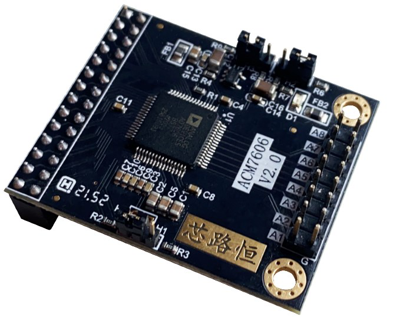

21-1  ACM7606

图

模块图

ADI

16

8

AD7606

模块使用

公司的

位

通道同步采样模数转换器

芯片。芯片

16

内置模拟输入箝位保护、二阶抗混叠滤波器、跟踪保持放大器、

位电荷再分配

ADC

2.5V

逐次逼近型模数转换器（

）、灵活的数字滤波器、

基准电压源、基准电

AD7606

5V

10V

压缓冲以及高速串行和并行接口。

采用

单电源供电，可以处理

5V

200kSPS

和

真双极性输入信号，同时所有通道均能以高达

的吞吐速率采样。

---
*下一页*

16.5V

输入箝位保护电路可以耐受最高达

的电压。无论以何种采样频率工作，

±

1M

其模拟输入阻抗均为

Ω。采用单电源工作方式，具有片内滤波和高输入阻抗，

AD7606

3dB

因此无需驱动运算放大器和外部双极性电源。

抗混叠滤波器的

截止

22kHz

200kSPS

40dB

频率为

；当采样频率为

时，具有

抗混叠抑制特性。

spi

AD7606

8

200KSPS

芯片对外提供

和并行的数字接口。当

的

个通道全部以

25.6Mbps

MCU

的最高速率进行转换时，数据输出速率达到了

，需要使用高性能

SPI

16

的

外设才能勉强满足该速率要求。因此可以使用

位并口来进行数据的传

ad7606

FPGA

SPI

输，提高数据传输速率。当

应用在

系统中的时候，使用

串行

FPGA

接口和并行接口都能够轻松的满足数据传输的速率需求。当在

系统上应

AD7606

FPGA

ad7606

用

时，可以通过在

上设计

的转换控制逻辑，将转换结

fifo

RAM

FPGA

果数据直接存储到片上的存储器如

或者

中，也可以存储到

片

SRAM

SDRAM

MCU

DSP

外的存储器如

或

中，

然后由其他主控芯片如

或

读

FPGA

FPGA

出，或者直接在

内部进行数据的运算和处理。当然，由于

片上可

以设计软核控制器，也可以直接使用软和控制器完成数据的处理和传输工作，如

Intel FPGA

NIOS II

AD7606

典型的，在

器件上使用

软核控制器，将

的转换结果

通过串口或以太网传输到电脑上，也可以直接将数据显示在液晶显示屏上。

21.2

功能框图

AD7606

21-2

芯片的功能框图如图

所示：

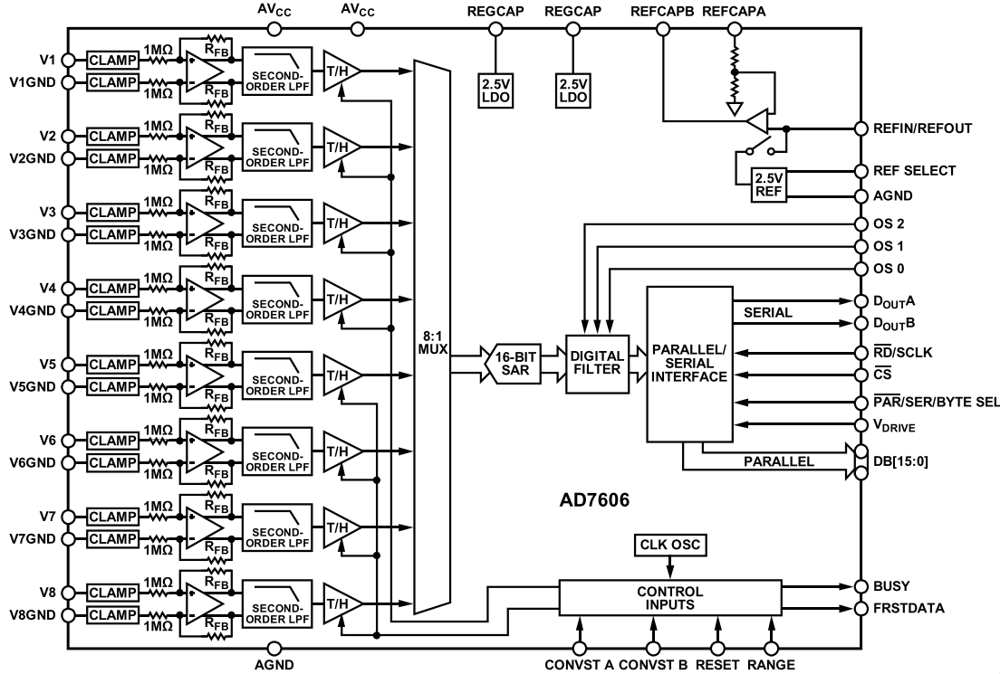

21-2  AD7606

图

功能框图

---
*下一页*

8

1

采集到的数据在经过稳压滤波和采样保持后通过

选

多路选择器被分别

16

ADC

AD7606

送入到

位逐次逼近型

芯片

中进行转换，最后经由数字滤波后

DoutA

DoutB

输出，当数据是以串行模式输出时，数据会从

、

中输出，如果数据

DB[15:0]

AD7606

是以并行方式输出，那么数据将从

中输出，下面为

部分模块的

说明介绍。

21.2.1

模拟输入

AD7606

RANGE

可处理真双极性、单端输入电压。

引脚的逻辑电平决定所

有模拟输入通道的模拟输入范围。如果此引脚与逻辑高电平相连，则所有通道的

V

模拟输入范围为

。如果此引脚与逻辑低电平相连，则所有通道的模拟输入

±10

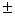

5V

AD7606

1M

AD7606

范围为

。

的模拟输入阻抗为

Ω。这是固定输入阻抗，不随

AD7606

采样频率而变化。

的模拟输入结构如下图，其各路模拟输入均含有箝位

5V

保护电路。虽然采用

单电源供电，但此模拟输入箝位保护允许输入过压达到

16.5V

。

±

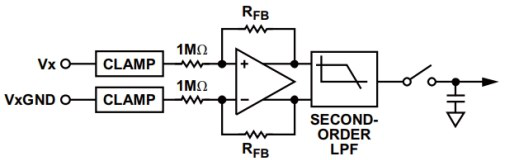

21-3  AD7606

图

模拟输入结构

21.2.2

数字滤波器与过采样

AD7606

sinc

内置一个可选的数字一阶

滤波器，在使用较低吞吐率或需要更

高信噪比或更宽动态范围的应用中，应使用该滤波器。数字滤波器的过采样倍率

OS[2:0]

AD7606

OS[2]

MSB

由过采样引脚

控制（具体参考

数据手册）。

为

控制

OS[0]

LSB

位，

为

控制位，下表提供了用来选择不同过采样倍率的过采样位解码。

21-1

表

不同过采样倍率下过采样位解码

OS[2:0]

5V

10V

5V

10V

过采样

最大吞

范

范

范

范

SNR(dB)

SN

3dB

3dB

吐量

倍率

围

围

围

带宽

围

带宽

dB

kHz

kHz

CONVST

（

）

（

）

（

）

频

kHz

率（

）

000

No OS

89

90

15

22

200

001

2

91.2

92

15

22

100

010

4

92.6

13.7

18.5

50

93

6

．

011

8

94.2

95

10.3

25

11

9

．

100

16

95.5

96

6

6

12.5

---
*下一页*

101

32

96.4

3

3

6.25

96

7

．

110

64

96.9

97

1.5

1.5

3.125

111

无效

OS

BUSY

引脚在

下降沿锁存，从而设置下一个转换的过采样倍率（如下图

OS

8

CONVST x

所示），如果

引脚选择过采样倍率

，则下一个

上升沿采集各通

7

道的第一个样点，一个内部产生的采样信号采集所有通道的其余

个样点，然后

SNR

CONVST A

CONVST

对这些样点求平均值，以改进

性能。开启过采样时，

和

B

BUSY

BUSY

引脚必须连在一起驱动，转换过程中

保持高电平的时间会延长。

BUSY

保持高电平的实际时间取决于所选的过采样倍率，过采样倍率越高，则

保

持高电平的时间或总转换时间越长。

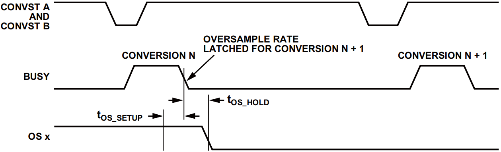

21-4  AD7606

图

过采样下时序图

21.2.3

工作时序

AD7606

根据采样方式不同具有多种驱动时序，本次采用的为并行输出（即

8

16

16

个

位的数据通过

根并行线一个接着一个输出），转化后读取模式。其时

1.

AD

2.

AD

ADI

序图有两部分组成：

完成

转化；

读取

数据。其中的时间可以参考

CONVST A

CONVST B

BUSY

公司的手册。当

和

通道都变为上升沿时，

信号转

BUSY

变为高电平，代表转换开始，直到

的下降沿到来，代表数据已经转换完

̅̅̅̅

成，正在锁存至输出数据寄存器中，当

变为下降沿时，数据将会被输送到总线

𝐶𝑆

̅̅̅̅

̅̅̅̅

上。并行工作模式下，当

和

都为低电平时，会使能总线，将转换结果输出

𝐶𝑆

𝑅𝐷

V1

FRSTDATA

到并行数据总线上，当

转换结果开始输出之后，

会随后转变为高

V1

电平，表示输出数据总线可以提供

的结果。并行模式下，每次数据的输出为

16

位，对应一个通道。

---
*下一页*

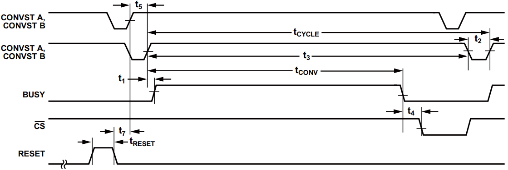

21-5  CONVST

--

图

时序

转换之后读取

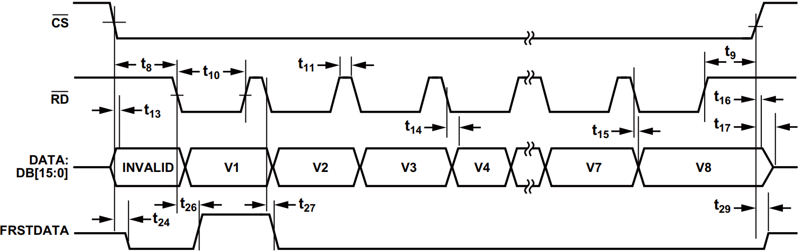

̅̅̅̅

̅̅̅̅

21-6

图

并行模式，独立的

和

𝐶𝑆

𝑅𝐷

AD7606

介绍完

的工作原理，接下来即可开始进行本次设计。

21.3

应用实例

ACM7606

40pin

本次设计将会使用到独立模块

，该模块通过开发板上

拓展

8

接口连接，支持

通道电压数据采集。用户可以设置采集其中任一通道的数据，

IP

自定义的

核会根据数据计算出其最大值、最小值、中间值等特殊值，这些数

DDR

据会存储进

中，最终在触摸屏中显示。用户可以通过触摸屏中的按键设置

不同的触发模式、采样频率、采样通道、触发电压等。

21.3.1

硬件逻辑系统设计

RGB_TFT

本次设计的显示部分与

工程相同，因此将会基于该工程搭建硬件

RGB_TFT

逻辑系统。将

另存为一个新工程，作为本次硬件设计的基础。

21.3.1.1

IP

导入

核

RGB_LCD

dynclk

rgb2lcd

IP

本次设计除了

实验所要用到的

和

这两个自定义

ADC_Acq2DDR_IP

rgb565to888

IP

IP

核，还需要添加

和

自定

核。这些

核存储

ip_repo

AC820

ZYNQ

FPSoC

在对应例程的

文件夹中，路径如下：

小梅哥

型

或安路

---
*下一页*

\

01_

\03_CPU

\ZYNQ \

21

开发板资料

教材文档

裸机编程教材文档

第

章

基于

ACM7606

\

21_ACM7606_Scope\

ACM7606_Scope\

ip_repo

的多通道简易示波器

。

21-7

添加完成后如图

所示：

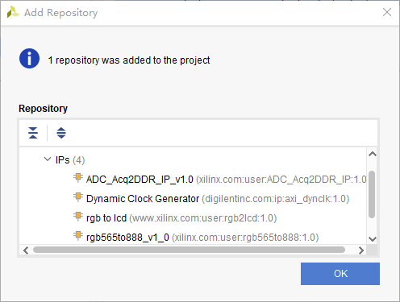

21-7

IP

图

添加自定义

核

IP

IP

添加完成后如果出现部分

核被锁的情况，用户只需更新

核即可。对于

Block Design

点击了稍后更新的用户可以关闭

，再重新打开便会再次看到更新提

醒。

ADC_Acq2DDR_IP

IP

除了

核外，其余

核我们在前面章节中都有过介绍，

ADC_Acq2DDR_IP

ACM7606

而

核则是我们自定义的一个用于驱动

采样并将符

HP

DDR

IP

IP

合触发条件的数据通过

接口存入

的自定义

核。该

核在本次设计

IP

中扮演着及其重要的角色，因此，接下来我们先来了解下该

的内部结构以及

工作原理。

21.3.1.2

ADC_Acq2DDR_IP

核介绍

ADC_Acq2DDR_IP

AXI4

IP

IP

核是我们自定义的一个带

接口的

核。该

核

ACM7606

能够实现对

模块触发模式、采样频率、采样通道、触发电压的输出和

ARM

ADC_Acq2DDR_IP

控制，同时能够将测量到的特殊值传输给

进一步处理。

21-8

核的结构框图如图

所示：

---
*下一页*

ADC_Acq2DDR_IP

S00_AXI

M_AXI_S

Trigger_Detect

ad7606_cs_n_o

AD7606_Driver

Clk_100M

ad7606_rd_n_o

ADC_Acq2DDR_IP

_v1_0_S00_AXI

ad7606_os_o

ADC_Special_Val

ad7606_db_i[15:0]

ad7606_reset_o

ADC_Measure_F

ad7606_busy_i

ad7606_convst_o

req

FIFO_Ctrl

21-8  ADC_Acq2DDR_IP

图

模块结构

S00_AXI

AXI4-Lite

IP

其中

为

总线接口，用户可以通过该接口，对

核内部

M_AXI_S

AXI4-Stream

ADC

进行读写配置。

为

总线接口，用于将

采集到的满足

HP

DDR

Clk_100M

100M

触发条件的信号通过

接口写入

中。

为

输入时钟信号，

ad7606_xxx

ad7606

为

相关的输入输出信号。

IP

下面将对该

中使用到的模块进行说明。

21.3.1.2.1

AD7606_Driver

AD7606

ad7606_driver

AD7606

8

控制器驱动模块

，该控制器实现了对

型

通

16

ADC

AD7606

道

位

的数据转换控制并输出。使用该控制器时，用户无需关心

ADC

的具体控制时序，一切都在控制器内部完成，用户只需要像使用并行

一样

21-9

取用数据即可，该模块的基本框图如图

所示：

Clk

Conv_Done

ad7606_cs_n_o

Reset_n

ad7606_rd_n_o

Go

ad7606_os_o[2:0]

AD7606_Driver

Speed_Set[25:0]

ad7606_reset_o

ad7606_convst_o

Channel_Set[2:0]

data_mult_ch[15:0]

ad7606_busy_i

data_flag[7:0]

ch_dat_valid

[15:0]ad7606_db_i

---
*下一页*

21-9  ad7606_driver

图

模块基本框图

该模块的接口信号功能如所示：

21-2  ad7606_driver

表

模块接口信号

I/O

信号名称

信号意义

Clk

I

100MHz

时钟信号，为了让采样速率准确，要求为

Reset_n

I

复位，低电平复位

采样使能信号，为高电平就使能采样，低电平则在已经开始的

Go

I

一轮采样结束后，停止下一次采样。

Speed_Set[25:0]

I

Speed_Set = 100000000/speed - 1

采样速率控制端口，

Channel_Set[2:0]

I

0

Channel_Set

采样通道设置，采集从

通道到设定通道

的值

ad7606

ad7606

转换状态标志信号，为高电平则表明

当前仍处于

转换状态，结果没有更新，如果此时读取，读取的结果就还是前一次

ad7606_busy_i

I

ad7606

的采样转换结果。需要待该信号变为低电平之后，再读取

中

的数据

ad7606_db_i[15:0]

I

ad7606

16

的

位数据线，读取时，输出对应通道的转换结果

8

一次采样完成标志信号，单时钟周期脉冲信号。每次

个通道

Conv_Done

O

结果都输出后，产生一个高脉冲信号。

ad7606

AD7606

芯片选中控制信号，可以从

中读取转换结果时，

ad7606_cs_n_o

O

需要使该信号为低电平

ad7606

AD7606

转换结果读取信号，该信号的下降沿，

将特定

ad7606_rd_n_o

O

16

rd_n

通道的采样结果送到

位数据线上，供外部读取。外部可以在

16

信号的上升沿读取

位数据线上的结果

ad7606

ad7606

过采样控制信号，使用过采样可以进一步提高

的

ad7606

采样精度，使用过采样会降低

的有效转换速率，关于过采样

ad7606_os_o[2:0]

O

ad7606

datasheet

0

的功能和使用方法，可以参考

的

，默认为

，则表

200Ksps

示不使用过采样。能够运行在最高的转换速率（

）

ad7606_reset_o

O

ad7606

ad7606

的复位信号，复位

内部各个功能单元的工作状态

ad7606

ad7606

转换开始信号，该信号的上升沿启动

内部的采样

ad7606_convst_o

O

转换逻辑开始新一轮的采样转换

16

多通道数据输出端口，该通道

位，在不同的时刻，输出不同

data_flag

data_flag

通道的转换结果，使用时，与

信号配合，

的哪一

data_mult_ch[15:0]

O

data_mult_ch

位出现高脉冲，则代表当前

的值为该通道的转换结果。

FIFO

RAM

该端口设计的目的是用于往

、

等存储器中存储结果时使

用。

AD7606

8

转换结果有效标志信号，因为

有

个通道，转换结果

8

Flag

是依次输出，并非同时的，所以设置

个

信号，每个通道的结

data_flag[7:0]

O

Flag

果就绪之后，就产生一个

信号，通知外部可以取用。另外，如

data_flag

果只关心其中的部分通道，

则只需要关心

中对应的位即

可

ch_dat_valid

O

输出通道有效信号

该控制器在工作时会根据主机的指令对采样频率进行修改，当信号转换完成

ADC

data_flag

data_mult_ch

后便对

写控制器发出

信号，控制其将转换完成数据

FIFO

RAM

写入

或者

的同时，也指出了该信号来自哪个通道。通过这两个信号，

ADC

我们可以实现让

以特定的采样速率多次采样一个或多个通道的数据。每当

---
*下一页*

data_flag

1

data_mult_ch

FIFO

RAM

中任意一位为

，则将

中的值写入

或者

中。

FIFO

RAM

由于

和

等存储器只有一个数据输入接口，所以这个时候用一个

data_mult_ch

data1~data8

8

端口分时输出不同通道的采样结果，就比使用

这

个

16

位的数据端口分别输出各自通道的采样结果要方便。

1

2

5

8

FIFO

例如，将通道

、

、

、

的采样结果存入

。就可以使用下面的写法：

module

adc_wr_fifo

(

input

Clk,

input

Reset_n,

input

[

7

:

0

]data_flag;

input

[

15

:

0

]data_mult_ch;

output

reg

fifo_wrreq,

output

reg

[

15

:

0

]fifo_data

);

always

@(

posedge

Clk

or

negedge

Reset_n)

if

(!Reset_n)

begin

fifo_wrreq <=

0

;

fifo_data <=

0

;

else

if

(data_flag ==

8'b1001_0011

)

begin

fifo_wrreq <=

1'd1

;

fifo_data <= data_mult_ch;

end

else

begin

fifo_wrreq <=

0

;

fifo_data <= fifo_data;

end

endmodule

21.3.1.2.2

ADC_Special_Val

ADC_Special_Val

ADC

模块用于得到

采集电压的最大、最小和中值，该模

21-10

块的基本结构如下图

所示。

Clk

[15:0]VMax

Rst_n

ADC_Special_Val

[15:0]VMin

[15:0]ADC_IN

[15:0]VMid

Data_Valid

21-10 ADC_Special_Val

图

模块的基本框图

21-3

该模块的信号说明如表

所示。

---
*下一页*

21-3 ADC_Special_Val

表

模块的信号说明表

I/O

信号名称

信号意义

Clk

I

100M

模块的时钟信号

Rst_n

I

模块的复位信号

ADC_IN[15:0]

I

ADC

16

采集得到的

位数据

Data_Valid

I

ADC

采集数据有效信号

VMaxt[15:0]

O

采集信号的最大值

VMin[15:0]

O

采集信号的最下值

VMid [15:0]

O

采集信号的中值

AD7606

AD7606

在获取

采集电压的特殊值时，首先需要知道

的输出编码方

0/1

0

式为二进制补码的方式，也就是说用

来区分一个数的符号，为

则代表正数，

1

21-11

为

代表复数，其电压对应的二进制值如下图

所示。

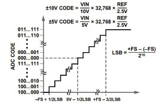

21-11

图

电压对应二进制数值图

AD7606

从上图可以看出，

采集的数值最高位对应的就是符号位，我们在获

取其采集电压的最大、最下值时，需要根据是正数还是复数进行判断。

1S

首先我们定义一个计数器，计时达到

时，重新开始计数，代码如下所示：

计时一秒

parameter

UPDATERATE =

99999999

;

//

always

@(

posedge

Clk

or

negedge

Rst_n)

if

(!Rst_n)

counter <=

0

;

else

if

(counter >= UPDATERATE)

counter <=

0

;

else

counter <= counter +

1'b1

;

1S

然后需要得到采集电压的最大值，当计数达到

时，使电压最大值

VMax_r

-32767

1111 1111 1111 1111

ADC_IN

为

（

）；当输入的电压

最高位

ADC_IN[15]

VMax_r

VMax_r[15]

小于

最高位

并且数据有效时，代表此时输入的

ADC_IN

VMax_r

VMax_r

ADC_IN

为正数，

为负数，最大值

为

；当输入电压

ADC_IN

ADC_IN[15]

VMax_r

VMax_r[15]

最高位

等于

最高位

时，代表此时两个

---
*下一页*

数都是正数或者复数，这时只需要比较两个值的大小，大的那个对应的就是电压

最大值，否则电压的最大值保持不变，代码如下所示：

always

@(

posedge

Clk)

if

(counter >= UPDATERATE)

VMax_r <= -

16'd32767

;

//-32767

为正，

为负，

else

if

((ADC_IN[

15

] < VMax_r[

15

]) && Data_Valid)

//IN

r

IN>r

VMax_r <= ADC_IN;

else

if

((ADC_IN[

15

]==VMax_r[

15

]) && (ADC_IN > VMax_r) && Data_Valid)

VMax_r <= ADC_IN;

else

VMax_r <= VMax_r;

1S

VMin_r

然后需要得到采集电压的最小值，当计数达到

时，使电压最小值

-32767

1111 1111 1111 1111

ADC_IN

ADC_IN[15]

为

（

）；当输入的电压

最高位

大

VMin_r

VMin_r [15]

ADC_IN

于

最高位

并且数据有效时，代表此时输入的

为负

VMax_r

VMin_r

ADC_IN

ADC_IN

数，

为正数，最小值

为

；当输入电压

最高位

ADC_IN[15]

VMin_r

VMin_r [15]

等于

最高位

时，代表此时两个数都是正数或者

复数，这时只需要比较两个值的大小，小的那个对应的就是电压最小值

，否则，

电压的最小值保持不变，代码如下所示：

always

@(

posedge

Clk)

if

(counter >= UPDATERATE)

VMin_r <=

16'd32767

;

为负，

为正，

else

if

((ADC_IN[

15

] > VMin_r[

15

]) && Data_Valid)

//IN

r

IN<r

VMin_r <= ADC_IN;

else

if

((ADC_IN[

15

]==VMin_r[

15

]) && (ADC_IN < VMin_r) && Data_Valid)

VMin_r <= ADC_IN;

else

VMin_r <= VMin_r;

1S

最后，当计数达到

后，将最大值和最小值进行输出，否则保持不变，代

码如下所示：

always

@(

posedge

Clk

or

negedge

Rst_n)

if

(!Rst_n)

begin

VMin <=

0

;

VMax <=

0

;

end

else

begin

if

(counter >= UPDATERATE)

begin

VMin <= VMin_r;

VMax <= VMax_r;

end

else

begin

VMin <= VMin;

---
*下一页*

VMax <= VMax;

end

end

2

得到最大、最下值之后，首先将其相加，然后除以

，便得到其中间值，代

码如下所示：

assign

VMid_r = $

signed

(VMax) + $

signed

(VMin);

assign

VMid = VMid_r[

16

:

1

];

$signed

VMax

VMin

上述代码中的

（）作用是将

和

作为有符号数进行相加，

在进行运算的时候就会按照有符号数进行扩位，在高位补符号位，然后取

VMid_r[16:1]

16

，这样就得到了

位的有符号的电压中值数据，举个例子，当最大

+29408

0111001011100000

-32520

1111111100001000

值为

（

），最小值为

（

），两者相

-29160(10111000111101000)

16

-14580

1011100011110100

加得到

，取高

位得到

（

），

-29160

2

也就是将

除以

的数值，也就是采集电压的中值。

21.3.1.2.3

ADC_Measure_Freq

ADC_Measure_Freq

模块用来得到采集信号的频率值，该模块的基本结构框

21-12

图如图

所示：

Clk

Rst_n

ADC_Measure_Freq

[15:0]Trig_Val

[15:0]ADC_Data

ADC_Conv_Done

21-12 ADC_Measure_Freq

图

模块的基本结构框图

21-4

该模块的信号说明如下表

所示。

21-4 ADC_Measure_Freq

表

模块的信号说明表

I/O

信号名称

信号意义

Clk

I

100M

模块的时钟信号

Rst_n

I

模块的复位信号

Trig_Val [15:0]

I

频率测量触发值

ADC_Data[15:0]

I

ADC

16

采集到的

位数据

ADC_Conv_Done

I

ADC

单次采集完成信号

Freq_Val [31:0]

O

采集信号的频率测量值

首先设计一个计数器，根据设定的计数值来控制采样时间，这里设定计数值

99999999

1S

为

，也就是计数

，代码如下所示：

---
*下一页*

设定计数值来控制采样时间

parameter

TIME_CNT_VAL =

99999999

;

//

计数

秒

//

1

always

@(

posedge

Clk

or

negedge

Rst_n)

begin

if

(!Rst_n)

Time_Cnt <=

0

;

else

if

(Time_Cnt >= TIME_CNT_VAL)

Time_Cnt <=

0

;

else

Time_Cnt <= Time_Cnt +

1

;

end

保存触发设定值，防止中途被修改，每次测完一秒后才允许被修改，代码如

下所示：

always

@(

posedge

Clk

or

negedge

Rst_n)

begin

if

(!Rst_n)

Trig_Val_r <=

0

;

else

if

(Time_Cnt >= TIME_CNT_VAL)

Trig_Val_r <= Trig_Val;

else

Trig_Val_r <= Trig_Val_r;

end

ADC

保存上一次

采集到的值，代码如下所示：

保存上一次

测量值

//

ADC

always

@(

posedge

Clk

or

negedge

Rst_n)

begin

if

(!Rst_n)

begin

ADC_Data_Pre <=

0

;

end

else

if

(ADC_Conv_Done)

begin

ADC_Data_Pre <= ADC_Data;

end

else

begin

ADC_Data_Pre <= ADC_Data_Pre;

end

end

1S

对

内的触发点的个数进行计数，以此测得频率。当上次采样的电压值

ADC_Data_Pre

Trig_Val_r

ADC_Data

小于触发值

、本次采样的电压值

大于

Trig_Val_r

ADC_Data_Pre

ADC_Data

、上次采样电压值

小于本次采样电压值

、单

1

次采样完成，满足以上条件，触发周期计数加

，这里以电压中值为触发，使用

采集电压的中值作为触发值，是因为在中值两边的电压变化最明显，测得的频率

21-13

最准，这里以正弦波为例，触发条件如下图

所示。

---
*下一页*

触发点

21-13

图

正弦波触发条件波形图

记录一次触发周期的时间，也就是满足触发条件所需时间，从上图可以看出，

两次触发之间需要的时间刚好是一个周期的时间，代码如下所示：

记录一次触发周期的时间

//

always

@(

posedge

Clk

or

negedge

Rst_n)

begin

if

(!Rst_n)

Cycle_Cnt <=

0

;

else

if

((ADC_Data_Pre<=Trig_Val_r) && (ADC_Data>=Trig_Val_r) &&

(ADC_Data_Pre<ADC_Data) && ADC_Conv_Done)

Cycle_Cnt <=

0

;

else

Cycle_Cnt <= Cycle_Cnt +

1

;

end

保存上一次触发周期的时间，用于比较两次触发周期的时间，防止出现误触

发的现象，代码如下所示：

always

@(

posedge

Clk

or

negedge

Rst_n)

begin

if

(!Rst_n)

Cycle_Cnt_Pre <=

0

;

else

if

((ADC_Data_Pre <= Trig_Val_r) && (ADC_Data >= Trig_Val_r)

&& (ADC_Data_Pre < ADC_Data) && ADC_Conv_Done)

Cycle_Cnt_Pre <= Cycle_Cnt;

else

Cycle_Cnt_Pre <= Cycle_Cnt_Pre;

end

1S

记录

内累加的触发计数，以此测得频率，如果当前周期计数小于等于上

一个计数周期的一半，则此次触发异常，触发计数无效，代码如下所示：

always

@(

posedge

Clk

or

negedge

Rst_n)

begin

if

(!Rst_n)

Freq_Add <=

0

;

else

if

(Time_Cnt >= TIME_CNT_VAL)

Freq_Add <=

0

;

---
*下一页*

else

if

((ADC_Data_Pre <= Trig_Val_r) && (ADC_Data >= Trig_Val_r)

&& (ADC_Data_Pre < ADC_Data) && ADC_Conv_Done)

begin

if

(Cycle_Cnt <= Cycle_Cnt_Pre[

31

:

1

])

Freq_Add <= Freq_Add;

else

Freq_Add <= Freq_Add +

1

;

end

else

Freq_Add <= Freq_Add;

end

1

最后将计数

后测出的频率值进行输出，代码如下所示：

always

@(

posedge

Clk

or

negedge

Rst_n)

begin

if

(!Rst_n)

Freq_Val <=

0

;

else

if

(Time_Cnt >= TIME_CNT_VAL)

Freq_Val <= Freq_Add;

else

Freq_Val <= Freq_Val;

end

21.3.1.2.4

FIFO_Ctrl

AD7606

AD7606_Driver

本次实验将

驱动模块

的采样率设置为其最高采样

200Ksps

频率

，如果想要改变其采样频率，可以通过对采样数据进行抽取重采样

40Ksps

50

的方法实现。比如希望以

的采样速率采样，则只需要每间隔

个采样数

49

40Ksps

据取一个结果存储或使用，其他

个数据直接舍弃，这样就能实现

的采

FIFO_Ctrl

样率。

模块就是用于实现该功能，该模块通过输入的采样分频值，最

FIFO

21-14

终产生数据有效标志，将需要数据写入至

中，该模块的基本结构如图

下所示。

Clk

Rst_n

FIFO_Ctrl

[10:0]ADC_Sample_Rate

Acq_Valid

ADC_Conv_Done

21-14 FIFO_Ctrl

图

模块的基本结构图

21-5

该模块的信号说明如下表

所示。

21-5 FIFO_Ctrl

表

模块信号说明表

---
*下一页*

I/O

信号名称

信号意义

Clk

I

100M

模块的时钟信号

Rst_n

I

模块的复位信号

ADC_Sample_Rate [10:0]

I

采样分频值

ADC_Conv_Done

I

ADC

单次采集完成信号

Acq_Valid

O

采集有效标志信号

首先设计一个采样分频计数器，根据采样分频值，当产生单次采集完成之后，

计数器进行计数，代码如下所示：

always

@(

posedge

Clk

or

negedge

Rst_n)

begin

if

(!Rst_n)

Acq_Div_Cnt <=

0

;

else

if

(Acq_Div_Cnt >= ADC_Sample_Rate)

Acq_Div_Cnt <=

0

;

else

if

(ADC_Conv_Done)

Acq_Div_Cnt <= Acq_Div_Cnt +

1

;

else

Acq_Div_Cnt <= Acq_Div_Cnt;

end

然后产生数据有效标志，当采样分频计数器达到设定值时，产生数据有效标

Acq_Valid

志信号

，否则，清除该标志信号，代码如下所示：

always

@(

posedge

Clk

or

negedge

Rst_n)

begin

if

(!Rst_n)

Acq_Valid <=

0

;

else

if

(Acq_Div_Cnt >= ADC_Sample_Rate)

Acq_Valid <=

1

;

else

Acq_Valid <=

0

;

end

21.3.1.2.5

Trigger_Detect

Trigger_Detect

触发检测模块（

）根据设置的不同触发模式得到的采集触发值，

RAM

最终输出传输有效标志信号，通过该信号，产生

的写使能信号，将数据写

RAM

21-15

入至

中，该模块的基本结构如下图

所示。

---
*下一页*

Clk100M

Rst_n

[15:0]ADC_Data

Trigger_Detect

t_valid

Acq_Valid

Start_Round_Acq

[15:0]Acq_Trigger_Value

21-15 Trigger_Detect

图

模块的基本结构框图

21-6

对该模块的信号说明如下表

所示。

21-6 Trigger_Detect

表

模块的信号说明表

I/O

信号名称

信号意义

Clk100M

I

100M

模块的时钟信号

Rst_n

I

模块的复位信号

ADC_Data [15:0]

I

ADC

16

采集的

位的数据信号

Acq_Valid

I

采集有效标志信号

Start_Round_Acq

I

启动一轮采集标志信号

Acq_Trigger_Value[15:0]

I

采集触发值

t_valid

O

传输有效标志信号

8

16

ADC

首先设置

个

位的寄存器，当产生采集有效标志信号时，对

输出

16

的

位的寄存器进行移位寄存，代码如下所示：

寄存器

reg

signed

[

15

:

0

]ADC_Data_Reg[

7

:

0

];

//

always

@(

posedge

Clk100M)

if

(Acq_Valid)

begin

ADC_Data_Reg[

7

] <= ADC_Data;

ADC_Data_Reg[

6

] <= ADC_Data_Reg[

7

];

ADC_Data_Reg[

5

] <= ADC_Data_Reg[

6

];

ADC_Data_Reg[

4

] <= ADC_Data_Reg[

5

];

ADC_Data_Reg[

3

] <= ADC_Data_Reg[

4

];

ADC_Data_Reg[

2

] <= ADC_Data_Reg[

3

];

ADC_Data_Reg[

1

] <= ADC_Data_Reg[

2

];

ADC_Data_Reg[

0

] <= ADC_Data_Reg[

1

];

end

8

16

设置一个累加器，产生采集有效标志信号的时候，将

个

位的寄存器进

行累加，代码如下所示：

累加器

reg

signed

[

18

:

0

]ADC_Data_Reg_Add;

//

always

@(

posedge

Clk100M)

begin

if

(Acq_Valid)

ADC_Data_Reg_Add <= ADC_Data_Reg[

7

] + ADC_Data_Reg[

6

] +

---
*下一页*

ADC_Data_Reg[

5

] + ADC_Data_Reg[

4

] +

ADC_Data_Reg[

3

] + ADC_Data_Reg[

2

] +

ADC_Data_Reg[

1

] + ADC_Data_Reg[

0

];

end

ADC

[18:3]

然后得到

输出数据的平均值，也就是累加器的

的数据，相当于除

8

以

，代码如下所示：

平均值

wire

signed

[

15

:

0

]ADC_Average_Val;

//

assign

ADC_Average_Val = ADC_Data_Reg_Add[

18

:

3

];

ADC_Average_Val

当产生数据有效信号的时候，将得到的

数据进行寄存，

ADC_Average_Val

这样在产生下一次的

信号的时候，使其保持不变，就相当于

ADC

保存上次的

采集的数据平均值信号，代码如下所示：

always

@(

posedge

Clk100M

or

negedge

Rst_n)

begin

if

(!Rst_n)

ADC_Average_Val_Pre <=

0

;

else

if

(Acq_Valid)

ADC_Average_Val_Pre <= ADC_Average_Val;

else

ADC_Average_Val_Pre <= ADC_Average_Val_Pre;

end

设计一个状态机，包含空闲状态和等待触发状态，如下所示：

localparam

空闲态

IDLE =

2'b01

,

//

等待触发态

WAIT =

2'b10

;

//

下面对这个状态的实现进行说明。

1.

IDLE

Trigger_Done

空闲状态，当在该状态的时候，传输完成信号

为低电平，当产

生开始信号的，进入等待触发状态，该状态的代码如下所示：

IDLE:

begin

Trigger_Done <=

0

;

if

(Start_Signal)

State <= WAIT;

else

State <= IDLE;

end

Start_Round_Acq

Start_Signal

当产生启动开始信号

之后，将开始信号

拉高，

进入等待触发状态之后，将该信号拉低，否则保持不变，代码如下所示：

always

@(

posedge

Clk100M

or

negedge

Rst_n)

begin

if

(!Rst_n)

Start_Signal <=

0

;

---
*下一页*

else

if

(Start_Round_Acq)

Start_Signal <=

1

;

else

if

(State == WAIT)

Start_Signal <=

0

;

else

Start_Signal <= Start_Signal;

end

2.

WAIT

ADC

当处于等待触发状态的时候，如果上一次

输出数据的平均值

ADC_Average_Val_Pre

Acq_Trigger_Value

ADC

小于触发值

同时本次

输出数据的

ADC_Average_Val

Acq_Trigger_Value

平均值

大于触发值

，此时代表触发完成，

Trigger_Done

将触发完成信号

拉低，并且进入空闲状态，该状态的代码如下所

示：

WAIT:

begin

if

((ADC_Average_Val_Pre<=Acq_Trigger_Value)&&(ADC_Average_Val>=

Acq_Trigger_Value))

begin

Trigger_Done <=

1

;

State <= IDLE;

end

else

Trigger_Done <=

0

;

end

ONE_ROUND_LENGTH

1024

在本次设计中，设置的一轮采集的长度

为

，

1024

ADC

Data_Valid

也就是

个

输出的数据个数，根据采集长度，设计一个

，当

Trigger_Done

Data_Valid

产生触发完成信号

之后，将

信号拉高，当计数器的值达

Data_Valid

到采集长度的时候，将

信号拉低，代码如下所示：

always

@(

posedge

Clk100M

or

negedge

Rst_n)

begin

if

(!Rst_n)

Data_Valid <=

0

;

else

if

(Trigger_Done)

Data_Valid <=

1

;

else

if

(Cnt >= ONE_ROUND_LENGTH)

Data_Valid <=

0

;

end

Data_Valid

Acq_Valid

当

为高电平的时候，并且

信号有效的情况下，计数器

Cnt

1024

进行计数，当计数值达到

个时候，将计数器清零，然后重新计数，代码

如下所示：

always

@(

posedge

Clk100M

or

negedge

Rst_n)

begin

if

(!Rst_n)

Cnt <=

0

;

---
*下一页*

else

if

(Data_Valid)

begin

if

(Cnt >= ONE_ROUND_LENGTH)

Cnt <=

0

;

else

if

(Acq_Valid)

Cnt <= Cnt +

1

;

else

Cnt <= Cnt;

end

else

Cnt <=

0

;

end

Data_Valid

Acq_Valid

最终当

有效并且

有效的情况下，输出传输有效信号

t_valid

，代码如下所示：

assign

t_valid = Data_Valid && Acq_Valid;

21.3.1.2.6

ADC_Acq2DDR_IP_v1_0_S00_AXI

21-16

该模块的基本结构如图

所示：

S_AXI

Start_Round_Acq

(AXI4-Lite)

RegRD_ADC_Freq[31:0]

ADC_Channel[2:0]

Acq_Round_Done

ADC_Acq2DDR_IP

ADC_Sample_Rate[10:0]

Acq_Trigger_State

_v1_0_S00_AXI

ADC_Mid_Val[15:0]

ADC_Trigger_Value[15:0]

ADC_Min_Val[15:0]

ADC_Trigger_Mode[1:0]

ADC_Max_Val[15:0]

21-16  24.3.1.2.1

ADC_Acq2DDR_IP_v1_0_S00_AXI

图

模块基本结构图

AXI4-Lite

ADC

用户可以通过

总线，配置该模块内部

相关寄存器。模块会

AD7606

根据寄存器中对应位的值，结合自身内部逻辑代码，产生

启动采样、采

样通道选择、采样速率、触发值以及触发模式等控制信号，输出给其他模块。

同时，其他模块输入的采样最大值、最小值、中值等特殊值，都会由该模块

AXI4-Lite

PS

TFT

通过

总线传输到

端，最终经过转换后，用于

屏显示。

21-7

该模块的各个接口信号功能如表

所示：

21-7

表

模块接口信号功能

I/O

信号名称

信号意义

S_AXI_xxx

IO

AXI4-Lite

ADC

总线，用于配置模块内部

相关寄存器以

---
*下一页*

(AXI4-Lite)

及传输测量得到的最大值、最小值、中值等特殊值

RegRD_ADC_Freq[31:0]

I

AD7606

采集信号频率值

I

Acq_Round_Done

AD7606

一轮采集完成信号

Acq_Trigger_State

I

AD7606

触发状态控制信号

ADC_Mid_Val[15:0]

I

AD7606

采集信号电压的中值

ADC_Min_Val[15:0]

I

AD7606

采集信号电压的最小值

ADC_Max_Val[15:0]

I

AD7606

采集信号电压的最大值

Start_Round_Acq

O

AD7606

开始一轮开始标志信号

ADC_Channel[2:0]

O

AD7606

通道选择信号

ADC_Sample_Rate[10:0]

O

AD7606

采样分频值

ADC_Trigger_Value[15:0]

O

AD7606

触发有效信号

ADC_Trigger_Mode[1:0]

O

AD7606

触发模式信号

ADC

4

32

其中，模块内部的

相关寄存器一共有

个，每个寄存器位宽为

位，

slv_reg0~slv_reg3

0x00

0x04

0x08

0x0C

分别为

，偏移地址分别为

、

、

、

。四个寄存

slv_reg0

21-8

器中我们只使用了其中的

，该寄存器的对应位描述如表

所示：

21-8  slv_reg0

表

寄存器位描述

寄存器

位

功能描述

bit[31:30]

AD7606

ADC_Trigger_Mode

用于产生

触发模式信号

slv_reg0

bit[29:14]

AD7606

ADC_Trigger_Value

用于产生

触发有效信号

(

偏移地址

bit[13:3]

AD7606

ADC_Sample_Rate

用于产生

采样分频信号

0x00)

bit[2:0]

AD7606

ADC_Channel

用于产生

通道选择信号

AXI4-Lite

用户通过

总线读写这四个寄存器，对于写操作，逻辑部分的代码

实现主要如下：

assign

slv_reg_wren = axi_wready && S_AXI_WVALID && axi_awready &&

S_AXI_AWVALID;

always

@(

posedge

S_AXI_ACLK )

begin

if

( S_AXI_ARESETN ==

1'b0

)

begin

slv_reg0 <=

0

;

slv_reg1 <=

0

;

slv_reg2 <=

0

;

slv_reg3 <=

0

;

Start_Round_Acq <=

0

;

end

else

begin

if

(slv_reg_wren)

begin

case

( axi_awaddr[ADDR_LSB+OPT_MEM_ADDR_BITS:ADDR_LSB] )

2'h0

:

begin

在寄存器

被写入时，启动一轮采集

Start_Round_Acq <=

1

;

//

0

---
*下一页*

for

( byte_index =

0

; byte_index <=

(C_S_AXI_DATA_WIDTH/

8

)-

1

; byte_index =

byte_index+

1

)

if

( S_AXI_WSTRB[byte_index] ==

1

)

begin

// Respective byte enables are asserted as per write strobes

// Slave register 0

slv_reg0[(byte_index*

8

) +:

8

] <=

S_AXI_WDATA[(byte_index*

8

) +:

8

];

end

end

2'h1

:

for

( byte_index =

0

; byte_index <=

(C_S_AXI_DATA_WIDTH/

8

)-

1

; byte_index = byte_index+

1

)

if

( S_AXI_WSTRB[byte_index] ==

1

)

begin

// Respective byte enables are asserted as per write strobes

// Slave register 1

slv_reg1[(byte_index*

8

) +:

8

] <=

S_AXI_WDATA[(byte_index*

8

) +:

8

];

end

2'h2

:

for

( byte_index =

0

; byte_index <=

(C_S_AXI_DATA_WIDTH/

8

)-

1

; byte_index = byte_index+

1

)

if

( S_AXI_WSTRB[byte_index] ==

1

)

begin

// Respective byte enables are asserted as per write strobes

// Slave register 2

slv_reg2[(byte_index*

8

) +:

8

] <=

S_AXI_WDATA[(byte_index*

8

) +:

8

];

end

2'h3

:

for

( byte_index =

0

; byte_index <=

(C_S_AXI_DATA_WIDTH/

8

)-

1

; byte_index = byte_index+

1

)

if

( S_AXI_WSTRB[byte_index] ==

1

)

begin

// Respective byte enables are asserted as per write strobes

// Slave register 3

slv_reg3[(byte_index*

8

) +:

8

] <=

S_AXI_WDATA[(byte_index*

8

) +:

8

];

end

default

:

begin

slv_reg0 <= slv_reg0;

slv_reg1 <= slv_reg1;

slv_reg2 <= slv_reg2;

slv_reg3 <= slv_reg3;

end

---
*下一页*

endcase

end

else

写完后清除信号

Start_Round_Acq <=

0

;

//

end

end

S_AXI_WDATA

AXI4-Lite

这里的

为用户通过

总线写入的数据。可以看到，

bit[3:2]

当写通道握手成功之后，逻辑代码会根据写地址的

来判断所需写入的寄

WSTRB

存器。随后，数据以字节为单位，根据写选通信号

的值，将有效数据写

入寄存器的对应位中。

slv_reg0

接着是控制信号的产生。写入

寄存器的数据会根据对应位的值，被

作为相关控制信号。相关代码实现如下：

assign

ADC_Channel = slv_reg0[

2

:

0

];

assign

ADC_Sample_Rate = slv_reg0[

13

:

3

];

assign

ADC_Trigger_Value = slv_reg0[

29

:

14

];

assign

ADC_Trigger_Mode = slv_reg0[

31

:

30

];

AXI4-Lite

最后是寄存器的读取操作，用户通过

总线，读取出其他模块测量

出的最大值、最小值、中值等特殊值。相关代码实现如下：

assign

slv_reg_rden = axi_arready & S_AXI_ARVALID & ~axi_rvalid;

always

@(*)

begin

// Address decoding for reading registers

case

( axi_araddr[ADDR_LSB+OPT_MEM_ADDR_BITS:ADDR_LSB] )

2'h0

: reg_data_out <= slv_reg0;

2'h1

: reg_data_out <= {ADC_Max_Val,ADC_Min_Val};

2'h2

: reg_data_out <=

{Acq_Round_Done,Acq_Trigger_State,ADC_Mid_Val};

2'h3

: reg_data_out <= RegRD_ADC_Freq;

default

: reg_data_out <=

0

;

endcase

end

// Output register or memory read data

always

@(

posedge

S_AXI_ACLK )

begin

if

( S_AXI_ARESETN ==

1'b0

)

begin

axi_rdata  <=

0

;

end

else

begin

// When there is a valid read address (S_AXI_ARVALID) with

---
*下一页*

// acceptance of read address by the slave (axi_arready),

// output the read dada

if

(slv_reg_rden)

begin

axi_rdata <= reg_data_out;

// register read data

end

end

end

4

slv_reg

bit[3:2]

可以看到，代码中使用读地址（

个

寄存器偏移地址）的

作

reg_data_out

reg_data_out

为条件，来判断待读出的值，并赋值给

。当读使能后，

AXI4-Lite

ARM

中的值便会通过

的读通道传输给

端处理。

通过这种方式，我们巧妙的利用寄存器的偏移地址，使用其他模块输入的测

slv_reg1~ slv_reg3

AXI4-Lite

量信号代替

寄存器输出。这样，用户只需遵循

总线

协议，通过使用这四个寄存器地址，便能读取到测量模块采集到的特殊值。

ADC_Acq2DDR_IP

至此，

中涉及的模块都已经介绍完成，对于顶层中对于

各个模块的例化连接这里就不再进行说明，读者请自行查看源代码。了解完

ADC_Acq2DDR_IP

核的结构及实现原理，接下来我们继续硬件逻辑系统的设计，

IP

开始在设计中添加

核并进行配置。

21.3.1.3

IP

核添加与配置

Block Design

+

Ctrl+i

IP

IP

I

打开

点击“

”或者

添加

核，本次所需添加

具体

如下：

1

ADC_Acq2DDR_IP_v1.0

、

IP

21-17

在添加栏中搜索并添加该

核，如图

所示。

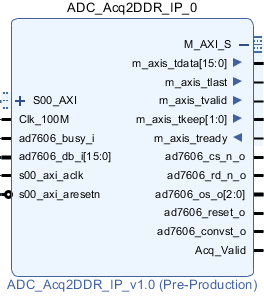

---
*下一页*

21-17  ADC_Acq2DDR_IP_v1.0

图

IP

21-18

这里该

核保持默认配置即可，如图

所示：

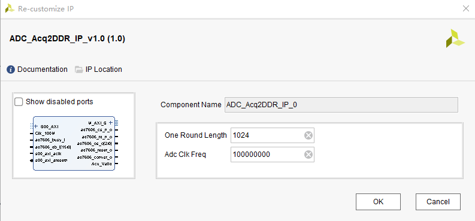

21-18  ADC_Acq2DDR_IP_0

图

核配置

2

RAM-based Shift Register

、

IP

21-19

在搜索栏搜索并添加该

核，添加后该核如图

所示：

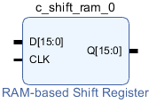

21-19  RAM-based Shift Register

图

寄存器

FIFO

该核是一个非常高效的多位宽移位寄存器，用于

类应用或作为延迟线。

IP

用户可以通过该

核创建固定长度或可变长度的移位寄存器。

IP

21-20

双击打开该

核的配置界面，本次设计配置如图

所示：

---
*下一页*

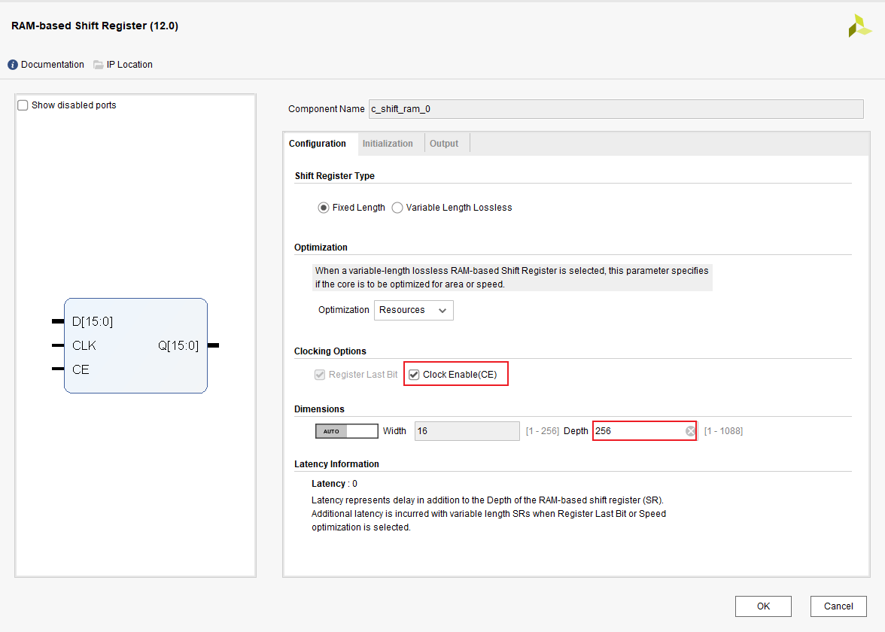

21-20

IP

图

配置

核

ADC

1024

对于本次设计，

每单位时间内会采集

个数据，这些数据将会转换

LCD

800*480

为图像数据显示。而

屏的分辨率为

，为了方便显示，屏幕中最多

只会显示一半的数据，而另外的数据用户则可以通过拖动滑块查看。为了使达到

1/4

触发条件的波形图像数据能够显示在屏幕中央，我们需要将数据延时

个屏幕

256

256

的数据量到来，也就是

个数据。因此这里将延时值设置为

。

3

AXI4-Stream Data FIFO

、

AXI4-Stream Data FIFO

IP

在添加栏中搜索

即可看到该

核，双击添加，添加

IP

IP

FIFO

完成后打开

核，对该

核的常规项进行配置。首先是

的深度，本次设

512

32

ADC

512*4=2048

计每个波形图像对应

个

位的

数据，即

字节这里为了防

FIFO

4096

止以后对工程修改时，

深度对工程造成影响，因此设置为了

（实际情

1024

TDATA

况下读写是同时进行的，及时设置为

也是可以的）；随后设置

数据

4

TKEEP

TLAST

OK

IP

位宽为

；最后使能

和

信号点击

即可完成配置。对

核的

21-22

配置操作如图

所示。

21-21

IP

图

添加

核

---
*下一页*

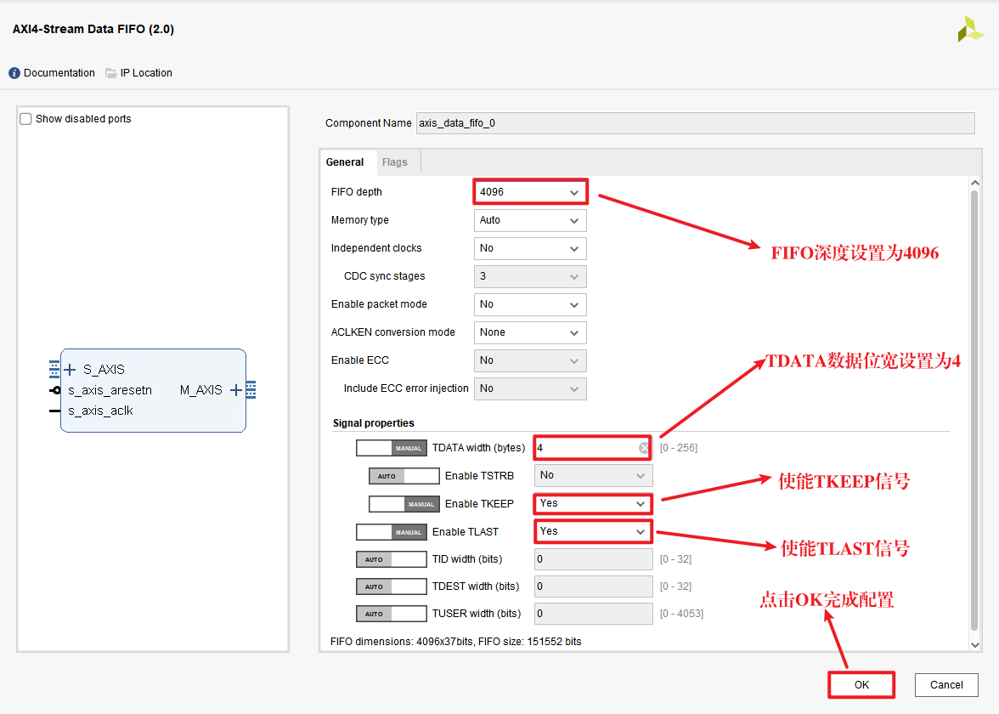

21-22

IP

图

配置

核

TDATA width

Enable TSTRB

Enable TKEEP

Enable TLAST

这里对

、

、

、

选项

进行介绍，各个选项作用如下：



TDATA width

AXI4-Stream

TDATA

：该项用于设置

接口上

信号的宽

BYTE

0

512

度，单位为

，可以在

到

间变化，当该信号被忽略时，

TKEEP

TSTRB

和

信号也会被忽略。



Enable TKEEP

TKEEP

TDATA Width

0

：用于使能

信号，仅当

大于

TKEEP

1

时，才可使能。

信号用于提供辅助信息，当该信号为

时，

0

代表该值有效，当该值为

时代表该值无效，该信号通常用于需要

进行数据宽度转换时。



Enable TSTRB

TSTRB

TDATA Width

0

：用于使能

信号，仅当

大于

TSTRB

1

时，才可使能。

信号也是用于提供辅助信息，当该信号为

TSTRB

0

时，表示对应的数据有效。

为

时，表示对应数据是占位数

position data

position data

sideband

据，

。在有的应用中，

可能被作为

data

TSTRB

TKEEP

TDATA

来使用。

信号和

信号一起构成了对

的

描述，表明当前传输的数据是有效、或是占位符或无效。



Enable TLAST

TLAST

STREAM FIFO

：用于使能

信号，对于

来说，

TLAST

信号的作用是指示一次传输数据流的最后一个数据，也指示

---
*下一页*

TLAST

SLAVE

着该数据流的结束。其会记录下

信号的位置，如果

SFIFO

TLASET

接口（

的数据写入接口）的某一个数据写入的同时

TLASET

MASTER

SFIFO

信号也为高的话，

信号会被记录。在

接口（

TLAST

的数据读出接口）读出该数据的同时，

信号也会被拉高。

TLAST

TLAST

总结起来就是，进的数据有

，该数据出的时候就会有

。

其他项由于本次并未使用到，这里暂不做介绍，想要了解的用户可以自行查

IP

pg085

阅该

核的官方手册

。

IP

21-23

FIFO

ACM7606

配置完成后该

核如图

所示。该

用来缓存

采集到的

DMA

DDR

数据，等待

将数据搬运到

中。

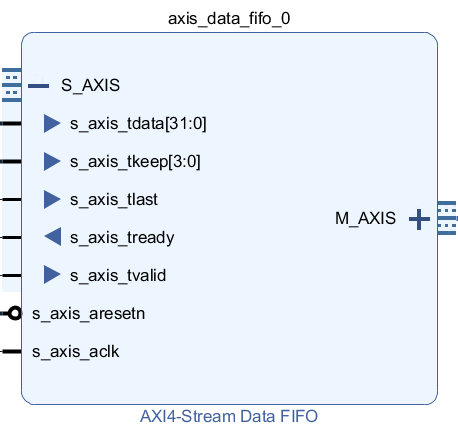

21-23  AXI4-Stream Data FIFO IP

图

核

4

AXI Direct Memory Access

、

AXI Direct Memory Access

IP

在添加栏中搜索

即可看到该

核，双击添加，

IP

IP

scatter

添加完成后打开

核进行配置。该

核需要配置的地方有两处：取消

gather engine

13

的使能以及将缓冲区长度寄存器位宽设置为

位，其余部分保持

默认配置。

---
*下一页*

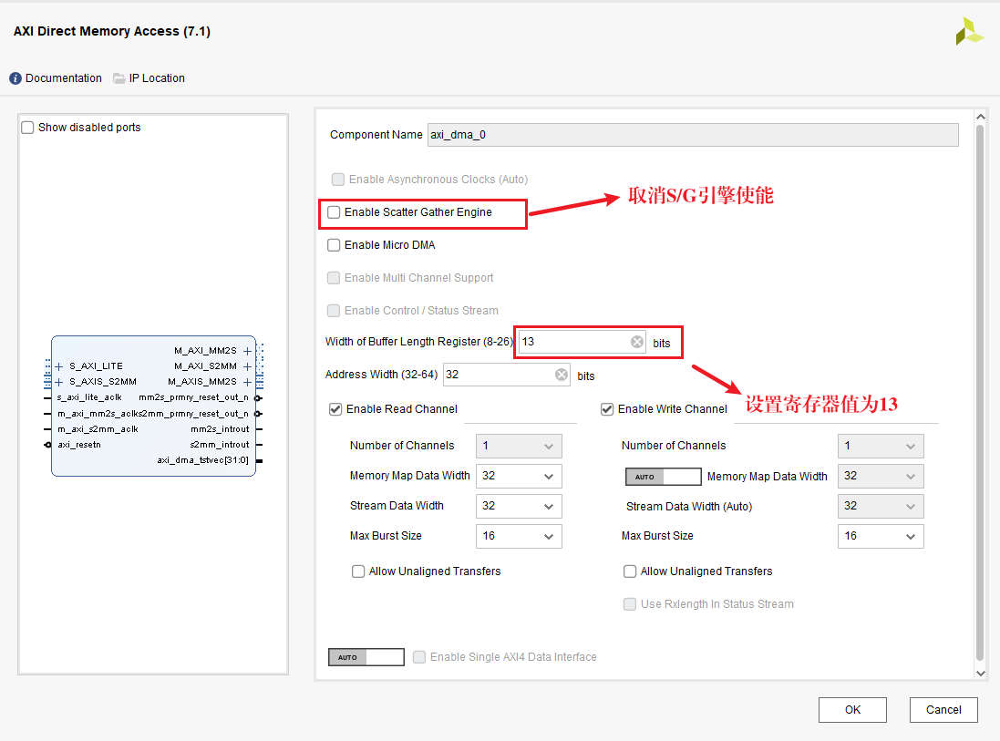

21-24

IP

图

配置

核

这里对这两个选项进行解释：



Enable Scatter Gather Engine

S/G

AXI DMA

：勾选后会启用

模式，并在

S/G

S/G

中包含

驱动。取消后将启用直接寄存器模式，此时

引擎所

有的输出端口都被绑定到零，且所有输入端口保持打开状态。



Width of Buffer Length Register

S/G

：该项用来设置在

描述符中传输

的控制字段缓冲区长度和状态字段字节的有效位数。对于直接寄存

MM2S_LEGNTH

S2MM_LEGNTH

器模式，它指定

和

寄存器中的

512

有效位数，即最大传输量。本次设计每次采集

个数据，所以最

512x4=2048

12

大传输量为

，即需要

位。为了防止意外，这里我们

13

8192

将寄存器的值设置为

，也就是能容纳

位数据。

IP

pg201

AC820

该

核对应的手册为

，在

开发板资料中有提供，对应路径为：

AC820

ZYNQ

FPSoC

\\10_Xilinx

小梅哥

型

或安路

开发板资料

原厂文档

。这里我

们只对修改的两项进行了介绍，对于其他项，用户可以自行查阅对应手册。

IP

21-25

IP

“

”

配置完成后的

核如图

所示，该

主要起通信

桥梁

的作用，可以

“

”

将所有外设映射的寄存器

连接

起来，这样就可以高速访问各寄存器。其传输不

CPU

“

”

flash

受

的支配，传输还是双向的；例如，从

表面

上看，它可以将

中的数

据与储存器中变量建立通讯，还可以将一外设的寄存器或缓冲器与另外设的寄存

---
*下一页*

IP

CPU

器或缓冲器建立双向通讯。由于该

核的通讯不会占用

资源，且传输速度

CPU

较快，因此可以有效节省

资源。

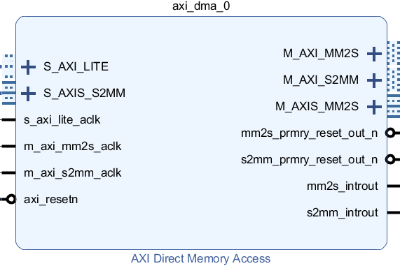

21-25  DMA IP

图

核

5

zynq

、

核配置

zynq IP

RGB_LCD

IP

核在

工程中已经被创建，因此本次只需对该

配置进行

TFT_LCD

SD0

MIO40...45

修改即可。在

工程基础上，我们需要使能

（

）用于存

I2C0

MIO50...51

储我们从内存中截取的图像数据；使能

（

）用于配置触摸屏以及

MIO

EMIO

读取触摸数据；使能

以及

用于截图以及触摸屏复位等功能。

PL

除了这些之外，为了方便设计我们还需要勾选

的中断使能，具体修改如

21-26

21-27

图

和图

所示：

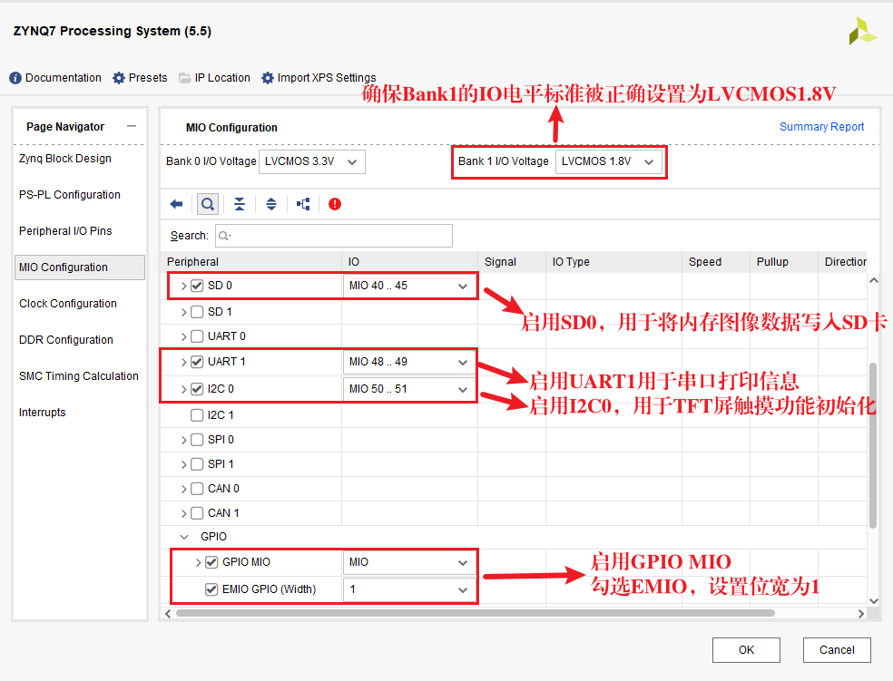

---
*下一页*

21-26

IP

图

配置

核

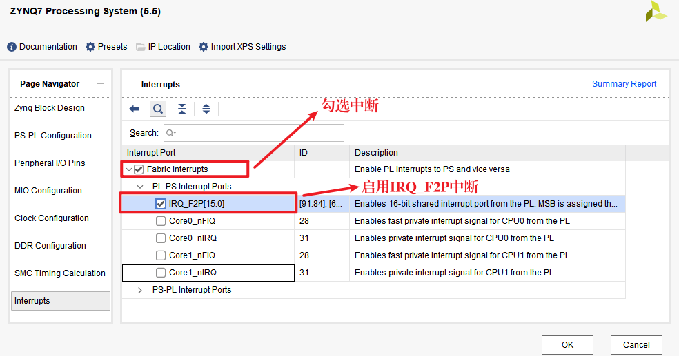

21-27

IP

图

配置

核

OK

zynq IP

配置完成后点击

，此时我们会发现

核会多出来一个引脚，将其

TP_Rst

导出，并修改命名为

。

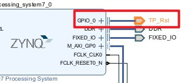

21-28

图

修改引脚名

IP

该步骤完成后，

核的添加与配置也已经完成，接下来即可开始对模块进行

连接。

21.3.1.4

端口连接

Run Connection Automation

21-29

首先点击“

”让软件连接部分端口，如图

所示：

---
*下一页*

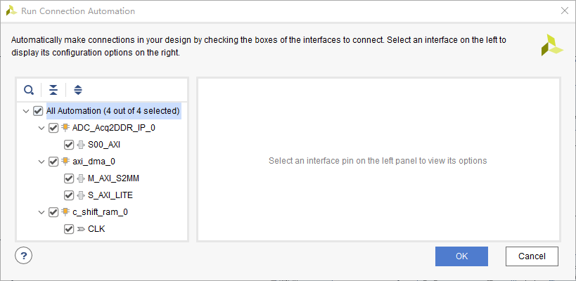

21-29

图

运行自动连接

21-30

:

此时的硬件逻辑系统如图

所示

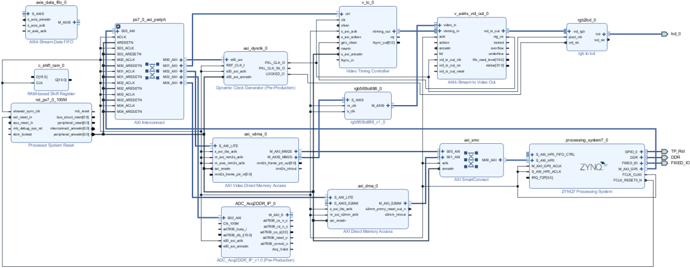

21-30

图

硬件逻辑系统

接下来我们需要手动连接其余部分端口，具体连接方式如下：

ADC_Acq2DDR_IP

ad7606_busy_i

ad7606_db_i[15:0]

ad7606_cs_n_o

ad7606_rd_n_o

①

导出

、

、

、

、

ad7606_os_o[2:0]

ad7606_reset_o

ad7606_convst_o

、

、

接口引脚

M_AXI_S

②

将

接口展开

m_axis_tdata[15:0]

D[15:0] (c_ shift_ram_0)

③

→

m_axis_tlast

s_axis_tlast (axis_data_fifo_0)

④

→

m_axis_tvalid

s_axis_tvalid (axis_data_fifo_0)

⑤

→

m_axis_tkeep[1:0] → s_axid_tkeep[1:0] (axis_data_fifo_0)

⑥

m_axis_tready → s_axid_tready (axis_data_fifo_0)

⑦

---
*下一页*

Acq_Valid

CE

(c_ shift_ram_0)

⑧

→

Clk_100M

FCLK_CLK0 (ZYNQ)

⑨

→

s00_axi_aresetn

peripheral_aresetn[0:0] (rst_ps7_0_100M)

⑩

→

axis_data_fifo_0

s_axis_tdata[15:0]

Q[15:0]  (c_ shift_ram_0)

①

→

s_axis_aresetn

peripheral_aresetn[0:0] (rst_ps7_0_100M)

②

→

M_AXIS

S_AXIS_S2MM (axi_dma_0)

③

→

m_axis_aclk

FCLK_CLK0 (ZYNQ)

④

→

s_axis_aclk

FCLK_CLK0 (ZYNQ)

⑤

→

axi_dma_0

s2mm_introut

IRQ_F2P[0:0]

①

→

其中箭头左边为该模块内的信号，箭头所指的为所要连接的信号，箭头仅代

表连接，不代表信号的方向，括号内为该信号所在的模块。连线完成后系统整体

21-31

框图如图

所示。如果硬件逻辑系统图片不够清晰，用户可以点击图片跳转

到网页查看。

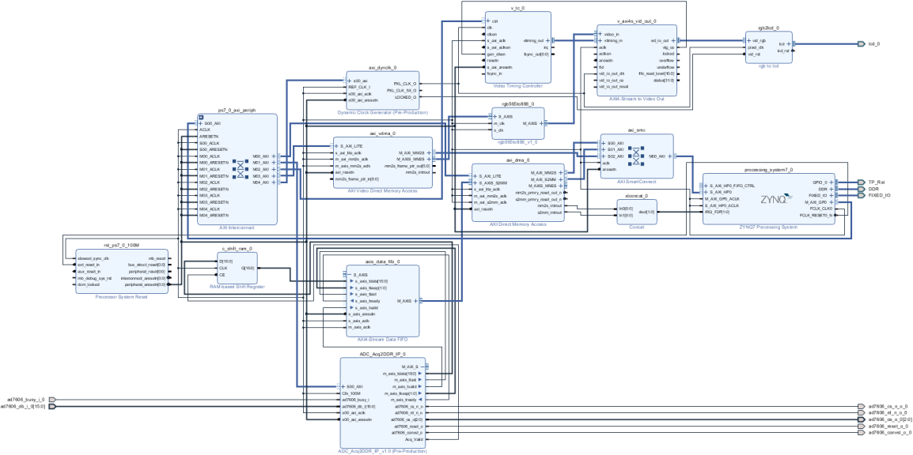

21-31

图

系统框图

接着点击√验证设计是否正确，确认设计无误后封装完即可进行管脚约束。

21.3.1.5

管脚约束

21-9

RGB_TFT

本次设计引脚约束表如表

所示，这里灰色部分为

章节中已

---
*下一页*

经分配好的引脚。

21-9

表

管脚分配表

Pin

Pin Name

Signial Name

Pin NO.

Pin Name

Signial Name

NO.

Display_R4

lcd_0_data[15]

AB21

ad_data[15]

ad7606_db_i_o[15]

AB11

Display_R3

lcd_0_data [14]

AA17

ad_data[14]

ad7606_db_i_o[14]

AA11

Display_R2

lcd_0_data [13]

AB17

ad_data[13]

ad7606_db_i_o[13]

AB12

Display_R1

lcd_0_data [12]

AA16

ad_data[12]

ad7606_db_i_o[12]

AA12

Display_R0

lcd_0_data [11]

AB16

ad_data[11]

ad7606_db_i_o[11]

W12

Display_G5

lcd_0_data [10]

Y13

ad_data[10]

ad7606_db_i_o[10]

V12

Display_G4

lcd_0_data [9]

AA13

ad_data[9]

ad7606_db_i_o[0]

V9

Display_G3

lcd_0_data [8]

W22

ad_data[8]

ad7606_db_i_o[8]

V10

Display_G2

lcd_0_data [7]

AA22

ad_data[7]

ad7606_db_i_o[7]

T6

Display_G1

lcd_0_data [6]

AB22

ad_data[6]

ad7606_db_i_o[6]

R6

Display_G0

lcd_0_data [5]

AA21

ad_data[5]

ad7606_db_i_o[5]

U4

Display_B4

lcd_0_data [4]

AB15

ad_data[4]

ad7606_db_i_o[4]

T4

Display_B3

lcd_0_data [3]

W13

ad_data[3]

ad7606_db_i_o[3]

V4

Display_B2

lcd_0_data [2]

V13

ad_data[2]

ad7606_db_i_o[2]

V5

Display_B1

lcd_0_data [1]

V15

ad_data[1]

ad7606_db_i_o[1]

U5

Display_B0

lcd_0_data [0]

V14

ad_data[0]

ad7606_db_i_o[0]

U6

Display _PCLK

lcd_0_pclk

V22

ad_os[2]

ad7606_os_o_0[2]

U9

Display_HSYNC

lcd_0_hs

AB14

ad_os[1]

ad7606_os_o_0[1]

U12

Display_VSYNC

lcd_0_vs

U14

ad_os[0]

ad7606_os_o_0[0]

U11

Display _DE

lcd_0_de

AB19

ad_busy

ad7606_busy_i_o

V7

Display _BL

lcd_0_bl

Y8

ad_convstab

ad7606_convst_o_0

U10

TP_RST

TP_Rst_tri_io[0]

R15

ad_cs

ad7606_cs_n_o_0

W7

ad_rd

ad7606_rd_n_o_0

Y11

ad_rsset

ad7606_reset _o_0

Y10

Ctrl+S

管脚约束完成后按住

保存，接下来就可以生成比特流并导出硬件运

Vitis

RGB_TFT

Vitis

行

了。由于本次设计是基于

工程创建的，为了避免在

中创

RGB_TFT

Vitis

建的工程收

硬件的影响。在导出硬件前，我们要先将

文件夹下

Launch Vitis IDE

的所有文件都删除再导出硬件然后才能

。

21.3.2

CPU

软件程序设计

首先还是新建一个硬件平台工程，再接着新建一个应用工程，本次设计代码

较为复杂，不适合教用户如何一步步实现，因此这里建议直接从例程中拷贝已经

设计完成的代码。

ACM7606_Scope

本次例程名为

，提供于开发板资料包中，相对路径如下：

AC820

ZYNQ

FPSoC

\

01_

\03_CPU

小梅哥

型

或安路

开发板资料

教材文档

裸机编

\ZYNQ \

21

ACM7606

\

程教材文档

第

章

基于

的多通道简易示波器

21_ACM7606_Scope\

Vitis

Vitis

ACM7606_Scope

。打开

文件夹下的

文件夹，将

AC820_Lib

src

.c

.h

文件夹拷贝到创建的工程中，将

文件夹下的

和

文件拷贝到工

src

21-32

程的

文件夹下，并添加它们的头文件路径，完成后工程资源目录如图

---
*下一页*

所示：

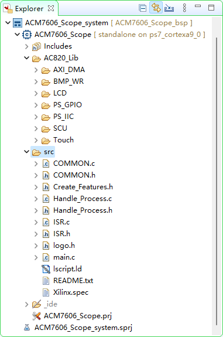

21-32

图

工程资源目录

AC820_Lib

src

文件夹下为本次设计所需要使用到的相关应用库，

下为本次

21-10

设计相关文件，各个文件的功能如表

所示：

21-10

表

设计相关文件说明

文件

描述

COMMON.c

用于存放用户的一些通用宏定义和参数的源文件

COMMON.h

包含本次所使用到的相关头文件以及通用全局变量声明

中断处理函数源文件，本次设计对应私有定时器中断处理函数、

ISR.c

GPIO

AXI DMA

中断处理函数与

接收中断处理函数。

中断处理函数头文件，包含对中断处理函数的声明以及相关标志的

ISR.h

全局修饰

main.c

主函数源文件

logo.h

log

log

文件，替换该文件即可替换界面

属性创建头文件，对按键、文本、波形的属性进行设置，包括颜色、

Create_Features.h

字体大小、对应坐标、长度、宽度等

进程处理源文件，包含本次设计中所需要使用到的各项进程，如界

Handle_Process.c

面绘制、波形更新、触发处理等

Handle_Process.h

进程处理头文件，对进程处理源文件所需要的函数、标志进行声明

---
*下一页*

SD

本次设计我们需要对

卡进行写操作，因此我们需要右键板级支持包进行

xilffs

FatFs

API

SD

21-33

设置，让支持包包含

库，以使用

中各种

来操作

卡，如图

所示：

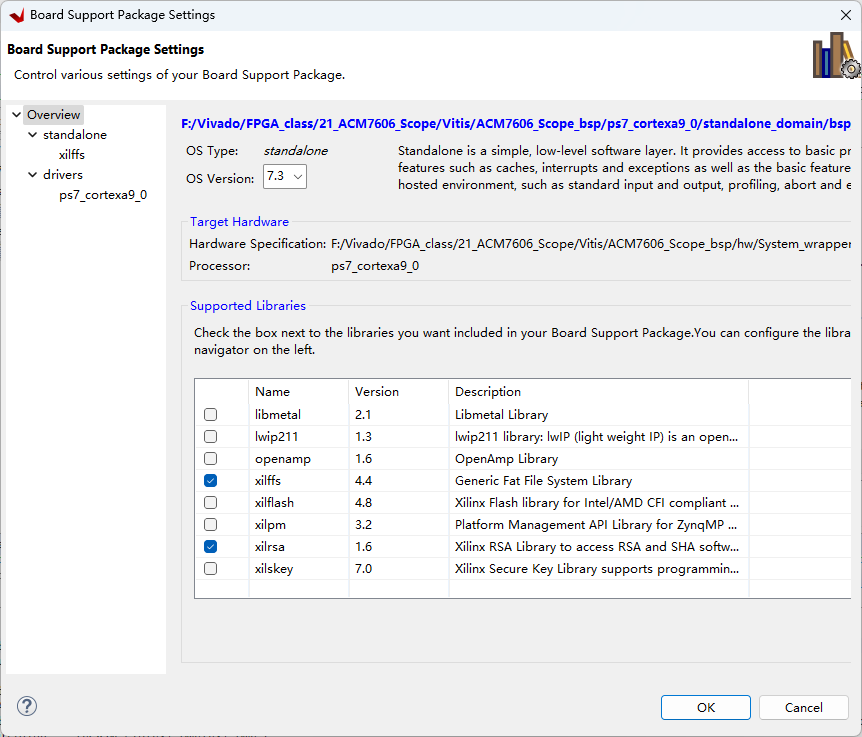

21-33

xilffs

图

包含

库

Vitis

设置完成后重新编译硬件平台，然后再重新编译应用工程，便完成了

部

main.c

分工程的创建。接下来我们双击打开

文件，查看本次设计

main.c

打开

文件，其中代码如下：

#include

"COMMON.h"

void

Handle_Events

(

void

);

主函数

//

int

main

(

void

)

{

初始化主页和控制器

Init_Homepage

();

//

循环处理事件

//

while

(

1

) {

Handle_Events

();

---
*下一页*

}

return

0

;

}

void

Handle_Events

(

void

)

{

如果开启了单次触发，触发成功则

，取消触发则恢复原状

//

STOP

if

(Single_TriggerFlag && (ADC_ROUND_DONE || Cancel_Trigger)) {

清标志

Single_TriggerFlag =

0

;

//

处理单次触发事件

Handle_Single_Trigger

();

//

}

每轮传输完成则刷新

并开启下一轮传输

//

DCache

if

(ADC_ROUND_DONE && Wave_Run && (!Single_TriggerFlag)) {

Handle_Round_Done

();

}

定时刷新波形窗口，

一次

//

10ms

if

(Flag_DrawWave) {

Flag_DrawWave =

0

;

刷新波形窗口

Refresh_WaveWindow

();

//

}

定时检测触摸，

一次

//

30ms

if

(Flag_TouchScan) {

Flag_TouchScan =

0

;

触摸扫描

Touch_Scan

();

//

}

定时刷网格背景，

一次

//

20ms

if

(Flag_DrawGrid) {

Flag_DrawGrid =

0

;

绘制网格背景

Draw_Grid_Background

(ADC_Wave);

//

}

定时刷测量值，

一次

//

500ms

if

(Flag_Refresh_Val && Wave_Run) {

Flag_Refresh_Val =

0

;

刷新测量值

Refresh_Measure_Val

();

//

}

}

While(1)

可以看到，主函数首先初始化主页和控制器，随后通过

循环处理事

Handle_Events

件

。当满足对应条件时便调用相关函数进行处理，这些被调用的

Handle_Process.c

函数全部定义于

中，下面我们以其中几个为例，带大家一起看

看函数的具体功能。

---
*下一页*

21.3.2.1

初始化页面和控制函数

Init_Homepage

LCD

函数用来初始化页面和控制器，函数中主要包含

屏的初

I2C

GPIO

GPIO

SD

始化、

的初始化、

及

中断初始化、

卡挂载、触摸初始化、定

时器初始化、以及一些背景、按键、显示波形窗口的绘制等，函数的实现的代码

如下所示：

初始化主页

//

void Init_Homepage()

{

FRESULT rc;

初始化通用中断控制器

ScuGic_Init();

//

初始化

LCD_Init();

//LCD

初始化

GT9147_Init();

//GT9147

定时器初始化，每

触发一次

//

10ms

ScuTimer_Int_Init(

10000

);

初始化，带中断功能

//DMA

AXI_DMA_Init(&AxiDma0,XPAR_AXIDMA_0_DEVICE_ID);

AXI_DMA_RxInt_Init(&AxiDma0,XPAR_FABRIC_AXI_DMA_0_S2MM_INTROUT_INTR,AXI_DMARx

_IRQHandler);

挂载

卡

rc = f_mount(&fatfs,

"0:/"

,

0

);

//

SD

if

(rc != FR_OK) {

若挂载失败则发出警告

printf(

"Mount Failed!

\n

"

);

//

}

及

中断初始化

//GPIO

GPIO

PS_GPIO_Init();

PS_GPIO_Int_Init(PS_GPIO_IRQ_Handler);

PS_GPIO_SetInt(

47

,XGPIOPS_IRQ_TYPE_EDGE_FALLING);

设置整体背景为黑色

LCD_Clear(LCD_BLACK);

//

笔画设定为白色

POINT_COLOR = LCD_WHITE;

//

笔画背景设定为黑色

BACK_COLOR = LCD_BLACK;

//

显示网址

LCD_ShowString(

3

,

20

,

180

,

16

,

16

,

0

,(uint8_t*)

"www.corecourse.cn"

);

//

画

LCD_DisplayPic(

20

,

50

,gImage_logo);

//

LOGO

Draw_Box(ADC_Wave.Window, LCD_WHITE,

0

);

Get_Waveform_Window_Parameters(&ADC_Wave);

Draw_Waveform_Windows(ADC_Wave, Sample_Rate[Sample_Set]);

//KHz

Draw_Normal_Button(Button_RUN);

Draw_Normal_Button(Button_AUTO);

---
*下一页*

Draw_Normal_Button(Button_CH_INC);

Draw_Normal_Button(Button_CH_DEC);

Draw_Normal_Button(Button_SA_INC);

Draw_Normal_Button(Button_SA_DEC);

Draw_Normal_Button(Button_Tri_Mode);

Draw_Normal_Button(Wave_Slider);

Fill_Box(Slider,LCD_BLUE,

5

);

sprintf(str,

"%.3fV"

,Get_ADC_Vmid());

strcpy(Button_TriggerVal.Text[

0

],str);

Draw_Normal_Button(Button_TriggerVal);

sprintf(str,

"CH%d"

,CH_Set);

Draw_Normal_Text(Text_CHANNEL, str);

sprintf(str,

"%dKHz"

,(int)Sample_Rate[Sample_Set]);

Draw_Normal_Text(Text_SAMPLE, str);

先把

数据所处的内存清零

//

ADC

memset(P_ADC_Data,

0

,ADC_DATA_LENGTH*

2

);

先采集一次

//

Set_ADC_Mode(CH_Set, Sample_Rate[Sample_Set], Trigger_Value, Trigger_Mode);

传输

//DMA

XAxiDma_SimpleTransfer(&AxiDma0,(UINTPTR) P_ADC_Data,

ADC_DATA_LENGTH*

2

, XAXIDMA_DEVICE_TO_DMA);

测量点为

轴线

//

Y

Measure_Point = ADC_Wave.Wave_Area.

X1

+ ADC_Wave.Wave_Area.Width/

2

;

触发点为

轴线

//

X

Trigger_Point = ADC_Wave.Wave_Area.Y1 + ADC_Wave.Wave_Area.Height/

2

;

}

TFT

关于绘图和初始化

、触摸的部分将不做介绍，下面将对该函数中比较重

要的几个点进行介绍。

1.

定时器初始化

10ms

在函数中，使用了私有定时器，通过对定时器初始化，使其每

触发一

次。通过计时器控制每个进程的触发间隔，启动对应的标志位，各个时间的标志

位和各个进程标志位如下所示：

各个时间标志位

//

static

uint8_t

Flag_20ms =

0

;

static

uint8_t

Flag_30ms =

0

;

static

uint8_t

Flag_50ms =

0

;

static

uint8_t

Flag_100ms =

0

;

static

uint8_t

Flag_200ms =

0

;

static

uint8_t

Flag_500ms =

0

;

---
*下一页*

定义各个进程的标志位

//

绘制波形，

一次

uint8_t

Flag_DrawWave =

0

;

//

10ms

绘制网格，

一次

uint8_t

Flag_DrawGrid =

0

;

//

20ms

触摸扫描，

一次

uint8_t

Flag_TouchScan =

0

;

//

30ms

刷新电压和频率数值，

一次

uint8_t

Flag_Refresh_Val =

0

;

//

500ms

关于标志位的使用将在后面进行介绍，得到需要控制的标志位之后，在定时

器中断函数中实现对标志位的控制，代码如下所示：

void ScuTimer_IRQ_Handler(void *CallBackRef)

{

用户处理

/* ↓↓↓

↓↓↓ */

以下通过计时器控制每个进程的触发间隔，启动对应的标志位

//

Flag_DrawWave =

1

;

if

(Flag_20ms >=

1

) {

Flag_20ms =

0

;

Flag_DrawGrid =

1

;

}

else

Flag_20ms++;

if

(Flag_30ms >=

2

) {

Flag_30ms =

0

;

Flag_TouchScan =

1

;

}

else

Flag_30ms++;

if

(Flag_50ms >=

4

) {

Flag_50ms =

0

;

}

else

Flag_50ms++;

if

(Flag_100ms >=

9

) {

Flag_100ms =

0

;

}

else

Flag_100ms++;

if

(Flag_200ms >=

19

) {

Flag_200ms =

0

;

---
*下一页*

}

else

Flag_200ms++;

if

(Flag_500ms >=

49

) {

Flag_500ms =

0

;

Flag_Refresh_Val =

1

;

}

else

Flag_500ms++;

结束处理

/* ↑↑↑

↑↑↑ */

XScuTimer_ClearInterruptStatus(&ScuTimer);

}

2.

DMA

初始化及第一轮传输

DMA

ACM9767

DDR

设计中

用来将

采集到的有效数据搬运到

中来，为了

DMA

让初始化界面时能够显示出采集到的波形数据，我们就需要对

初始化，初

始化完成后搬运采集到的有效数据，经过转化后用于显示。

DMA

DMA

代码中首先对

和

接收中断进行初始化，代码中的实现如下：

初始化，带中断功能

//DMA

AXI_DMA_Init(&AxiDma0,XPAR_AXIDMA_0_DEVICE_ID);

AXI_DMA_RxInt_Init(&AxiDma0,XPAR_FABRIC_AXI_DMA_0_S2MM_INTROUT_INTR,A

XI_DMARx_IRQHandler);

DMA

DMA

在

接收中断处理函数中会对中断事件进行判断，如果

接收错误

DMA

DMA

DMA

便复位

，重新使能

和

中断随后开始新一轮接收。如果接收成

RxDone

功便产生接收成功标志信号

，该信号的作用我们稍后再讲。这部分的代

码实现如下：

的

传输的中断服务函数

//DMA

Rx

void AXI_DMARx_IRQHandler(void *Callback)

{

uint32_t IrqStatus;

读取挂起的中断

//

IrqStatus = XAxiDma_IntrGetIrq(&AxiDma0, XAXIDMA_DEVICE_TO_DMA);

确认挂起的中断

//

XAxiDma_IntrAckIrq(&AxiDma0, IrqStatus, XAXIDMA_DEVICE_TO_DMA);

如果没有发生中断，则不执行任何操作

//

if

(!(IrqStatus & XAXIDMA_IRQ_ALL_MASK)) {

---
*下一页*

return;

}

如果发生错误则复位硬件，并重新启动传输

//

if

((IrqStatus & XAXIDMA_IRQ_ERROR_MASK)) {

Error =

1

;

//printf("RX Error!\n");

复位

//

XAxiDma_Reset(&AxiDma0);

等待复位完成

//

while

(!XAxiDma_ResetIsDone(&AxiDma0));

使能

的

中断

//

DMA

Rx

XAxiDma_IntrEnable(&AxiDma0,

XAXIDMA_IRQ_ALL_MASK,XAXIDMA_DEVICE_TO_DMA);

启动新一轮传输

//

XAxiDma_SimpleTransfer(&AxiDma0,(UINTPTR) P_ADC_Data,

ADC_DATA_LENGTH*

2

, XAXIDMA_DEVICE_TO_DMA);

return;

}

如果完成中断被断言，将

置

//

RxDone

1

if

((IrqStatus & XAXIDMA_IRQ_IOC_MASK)) {

RxDone =

1

;

//printf("RX Done!\n");

}

}

DMA

ADC

初始化完

后，需要传输一次

采集的数据，为了确保数据的准确

memset

ADC

ADC

性，首先用

将用来存储

数据的内存清零，随后发送指令控制

DMA

stream

ADC

stream

完成一次数据采集。接着再通过

将

类型的

数据（

类型

数据没有地址）存储到刚刚清零的地址中。相关代码实现如下：

先把

数据所处的内存清零

//

ADC

memset(P_ADC_Data,

0

,ADC_DATA_LENGTH*

2

);

先采集一次

//

Set_ADC_Mode(CH_Set, Sample_Rate[Sample_Set], Trigger_Value,

Trigger_Mode);

传输

//DMA

XAxiDma_SimpleTransfer(&AxiDma0,(UINTPTR) P_ADC_Data,

ADC_DATA_LENGTH*

2

, XAXIDMA_DEVICE_TO_DMA);

---
*下一页*

3.

ADC

设置

相关模式以及获取特殊值

ACM7606

slv_reg0~

设定

工作模式以及获取特殊值，都是通过操作寄存器

slv_reg3

ADC_Acq2DDR_IP

实现。这些寄存器的地址以及相关控制函数定义于

21-11

库中，四个寄存器对应地址以及位含义如表

所示：

21-11  ADC

表

相关寄存器

寄存器名称

寄存器地址

寄存器意义

ADC

控制寄存器

[2:0] ADC

Channel

通道选择

[13:3]ADC

Sample_Div

采样分频

REG_ADC_CONTROL

ADC_IP_BASEADDR+0x00

[29:14] ADC

触发电压值

Trigger_Val

[31:30]

ADC

触

发

模

式

Trigger_Mode

ADC

采集电压的最大最小值寄存

器

REG_ADC_MINMAX

ADC_IP_BASEADDR+0x04

[15:0]ADC

采样电压的最小值

[31:16]ADC

采样电压的最大值

ADC

采集电压的中值

REG_ADC_STATE

ADC_IP_BASEADDR+0x08

[15:0] ADC

采集信号中值

ADC_Mid_Val

ADC

采样频率寄存器，该寄存器

REG_ADC_FREQ

ADC_IP_BASEADDR+0x0C

中存储采样信号的频率值

Init_Homepage

ADC

在

函数中，我们使用以下函数配置

进行一次数据采集：

Set_ADC_Mode

(

Channel

,

Sample_Rate

[Sample_Set], Trigger_Value, Trigger_Mode);

对上述变量说明如下所示：

21-12 Set_ADC_Mode

表

函数变量说明表

变量名称

变量含义

变量值获取

Channel

8

0~7

0

通道设置

一共有

个通道可供选择（

），默认通道

，可以通过

触摸切换

Sample_Rate

=

200K/

采样分频设

采样分频值

原始采样率

设定采样率，可以通过触摸

置

设置

Trigger_Value

0V

触发电压值

默认触发值为

，可以通过设置

Trigger_Mode

0

1

2

触发模式设

表示自动触发，

表示手动触发，

表示单次触发，通过

置

触摸设置

ADC

设置完

的控制器之后，我们需要读取电压、频率相关寄存器中的值，

TFT LCD

读完之后，将这些值显示在

显示屏上，这里以读取电压最大值为例，

Get_ADC_Vmax

通过

函数实现读取电压的功能，电压最大值对应

GET_ADC_REG

16

的高

位，读取完成后，将得到的数值转换成电压值，转换公

式如下所示：

V =

𝑉

𝑇𝑚𝑝

32768

× 5

V_Tmp

V

上述公式中的

是从寄存器中读取出来的值，

是实际电压值，也就

---
*下一页*

Get_ADC_Vmax

是显示屏上需要显示的值，由此，我们便得到了

函数的实现方

式，如下所示：

float

Get_ADC_Vmax

()

{

uint32_t

Vmax_Val

;

int16_t

Vmax_Tmp

;

float

Vmax

;

Vmax_Val

= (

GET_ADC_REG

(REG_ADC_MINMAX) >>

16

);

无符号转有符号

Vmax_Tmp

=

Vmax_Val

;

//

Vmax

=

Vmax_Tmp

/

32768.0

*

5.0

;

return

Vmax

;

}

获取电压的最小值、频率值、中值的方式都可以参考上述方法实现。

4.

GPIO

SD

初始化及写

卡

PS

MIO

设计中使用

侧的按键控制截图功能，因此需要使用

读取按键状态，

GPIO

一旦按键电平发生变化，就进入到

中断，开始截取内存中的图像数据存储

SD

xilffs

FatFs

API

SD

到

卡中。设计中我们使用的

库，通过

中各种

来操作

卡，

SD

SD

在写

卡之前我们需要先对

卡挂载。因此，相关代码实现如下：

挂载

卡

rc = f_mount(&fatfs,

"0:/"

,

0

);

//

SD

if

(rc != FR_OK) {

若挂载失败则发出警告

printf(

"Mount Failed!

\n

"

);

//

}

及

中断初始化

//GPIO

GPIO

PS_GPIO_Init();

PS_GPIO_Int_Init(PS_GPIO_IRQ_Handler);

PS_GPIO_SetInt(

47

,XGPIOPS_IRQ_TYPE_EDGE_FALLING);

GPIO

PS

Bank

在

中断处理函数中，我们需要先正确识别到

按键所对应的

，

然后执行中断，当中断执行时，我们就对按键进行消抖，以确认按键确实被按下。

bmp_write()

bmp

SD

随后使用

函数将内存中的图像数据按照

格式写入

卡中。代

码实现如下：

volatile uint8_t Cnt =

0

;

char Pic_Name[

30

];

void PS_GPIO_IRQ_Handler(void *CallBackRef, uint32_t Bank, uint32_t

Status)

{

uint32_t Key_State,

;

Int_State

XGpioPs *Gpio = (XGpioPs *)CallBackRef;

添加判断来消除其它

的干扰

//

Bank

if

(Bank == (PS_KEY / 32)) {

---
*下一页*

Int_State = Status & (1 << (PS_KEY - ((PS_KEY / 32) * 32)));

}

else

{

Int_State = 0;

}

if

(Int_State) {

按键消抖

usleep(10000);

//

10ms

Key_State = XGpioPs_ReadPin(&GpioPs, PS_KEY);

if

(Key_State == 0) {

截图，存入

卡

//

SD

sprintf

(Pic_Name,

"Screenshot(%02d).bmp"

,Cnt);

bmp_write(Pic_Name, (

char

*)&BMODE_800x480, (

char

*)frame);

Cnt++;

}

}

}

TFT

RGB565

bmp_write()

设计中

显示使用的是

格式数据，

函数在从传入的

BmpMode

中获取图像尺寸后，便会基于该尺寸读取内存中图像数据。同时，函

RGB888

bmp

数会对数据各分量低位补零，从而扩充为

格式后，将数据以

格式

SD

写入

卡中。代码实现如下：

void bmp_write(char * name, char *head_buf, char *data_buf)

{

short y,

x

;

short Ximage;

short Yimage;

uint32_t iPixelAddr =

0

;

FRESULT res;

unsigned

int br;

// File R/W count

memset(&Write_line_buf,

0

,

1920

*

3

) ;

res = f_open(&fil, name, FA_CREATE_ALWAYS | FA_WRITE);

if

(res != FR_OK)

{

return ;

}

res = f_write(&fil, head_buf,

54

, &br) ;

if

(res != FR_OK)

{

return ;

}

Ximage=(

unsigned

short)((head_buf[

19

] <<

8

) | head_buf[

18

]);

Yimage=(

unsigned

short)((head_buf[

23

] <<

8

) | head_buf[

22

]);

---
*下一页*

iPixelAddr = (Yimage-

1

)*Ximage*

2

;

for

(y =

0

; y < Yimage ; y++)

{

for

(

x

=

0

;

x

< Ximage;

x

++)

{

Write_line_buf[

x

*

3

+

0

] = (data_buf[

x

*

2

+ iPixelAddr +

0

] & 0x1F) <<

3

;

Write_line_buf[

x

*

3

+

1

] = ((data_buf[

x

*

2

+ iPixelAddr +

1

] & 0x07)<<

5

)

|((data_buf[

x

*

2

+ iPixelAddr +

0

]& 0xE0)>>

3

);

Write_line_buf[

x

*

3

+

2

] = data_buf[

x

*

2

+ iPixelAddr +

1

] & 0xF8;

}

res = f_write(&fil, Write_line_buf, Ximage*

3

, &br) ;

if

(res != FR_OK)

{

printf(

"Write BMP Failed!

\n

"

);

return;

}

iPixelAddr -= Ximage*

2

;

}

f_close(&fil);

printf(

"Write BMP Successfully!

\n

"

);

}

21.3.2.2

单次触发函数

Handle_Single_Trigger

主要用来处理单次触发事件，在该函数中，首先通过

ADC_DataTransfer

RAM

函数读取

中存储的数据，当处于单次触发时，恢复按钮

STOP

STOP

的颜色，绘制按钮，触发取消则不再

，否则执行

操作，其实其中涉

及的都是按钮颜色背景的切换，比较容易理解，这里就不再进行详细说明，函数

的实现代码如下所示：

void

Handle_Single_Trigger

()

{

ADC_DataTransfer

(P_ADC_Data,ADC_DATA_LENGTH);

按钮恢复原色

//

if

(Trigger_Mode ==

0x03

) {

Button_TriggerVal

.

TextColor

= LCD_BLACK;

Button_TriggerVal

.

BackColor

= LCD_GREEN;

}

else

{

Button_TriggerVal

.

TextColor

= LCD_WHITE;

Button_TriggerVal

.

BackColor

= LCD_GRAY;

}

Draw_Normal_Button

(Button_TriggerVal);

---
*下一页*

Trigger_Enable_Press

();

触发取消则不再

if

(!Cancel_Trigger)

//

STOP

执行

操作

Perform_STOP

();

//

STOP

清标志

Cancel_Trigger =

0

;

//

}

21.3.2.3

启动下一次传输

Handle_Round_Done

Set_ADC_Mode

启动下一次传输函数（

）首先通过

函数

ADC

ADC_DataTransfer

RAM

设置

的控制寄存器，然后通过

函数读取

中存储的

数据，代码如下所示：

void

Handle_Round_Done

()

{

开启下一次传输

//

Set_ADC_Mode

(CH_Set,

Sample_Rate

[Sample_Set], Trigger_Value, Trigger_Mode);

ADC_DataTransfer

(P_ADC_Data,ADC_DATA_LENGTH);

}

21.3.2.4

刷新波形窗口

Refresh_WaveWindow

刷新波形窗口（

）函数首先读波形数据、然后执行刷新

电压值、刷新时间显示等操作，函数的实现代码如下所示：

void

Refresh_WaveWindow

()

{

读波形数据

Read_Wave_Data

();

//

画波形

Draw_Waveform

(ADC_Wave,Pre_Wave_Data,Wave_Data);

//

if

(Wave_Run) {

if

(Trigger_Mode)

画笔颜色

POINT_COLOR=LCD_ORANGE;

//

else

画笔颜色

POINT_COLOR=LCD_BRRED;

//

画横标线

//

Draw_Mark_Line

(

0

,Trigger_Point,

ADC_Wave

.

Wave_Area

.

X1

,

ADC_Wave

.

Wave_Area

.

X1

+

ADC_Wave

.

Wave_Area

.

Width

);

}

else

if

(!Wave_Run) {

画笔颜色

POINT_COLOR=LCD_CYAN;

//

画竖标线

//

Draw_Mark_Line

(

1

,Measure_Point,

ADC_Wave

.

Wave_Area

.

Y1

,

ADC_Wave

.

Wave_Area

.

Y1

+

ADC_Wave

.

Wave_Area

.

Height

);

刷新电压显示

//

Point_Voltage=

Wave_Data

[Measure_Point -

ADC_Wave

.

Wave_Area

.

X1

]*

5.0

/

32768

;

---
*下一页*

if

(Point_Voltage >=

0

)

sprintf

(str,

"

Voltage = +

%.3f

V

"

,Point_Voltage);

else

sprintf

(str,

"

Voltage =

%.3f

V

"

,Point_Voltage);

Draw_Normal_Text

(Text_Point_V, str);

刷新时间显示

//

Point_Time=(

float

)((Measure_Point-

ADC_Wave

.

Wave_Area

.

X1

)-

250

)/

Sample_Rate

[Sample_Set];

if

(Point_Time >=

0

)

sprintf

(str,

"

Time = +

%.3f

ms

"

,Point_Time);

else

sprintf

(str,

"

Time =

%.3f

ms

"

,Point_Time);

Draw_Normal_Text

(Text_Point_T, str);

}

画笔颜色

POINT_COLOR=LCD_BLACK;

//

}

上述函数中主要都是关于绘图的说明，这里将不做介绍，其中比较重要的就

Read_Wave_Data

是读取波形数据

函数的实现，函数波形的显示一共分为两页显

500

示，一页最多显示

个数据，首先保存上一次的波形数据，然后根据界面上的

Wave_Data

P_ADC_Data

滑动按钮，切换

保存的数据的起始地址，也就是设置的

中的起始第一个需要显示的数据，代码如下所示：

void

Read_Wave_Data

()

{

uint16_t

i ;

memcpy

(Pre_Wave_Data,Wave_Data,ADC_DATA_LENGTH*

2

);

for

(i =

0

;i<ADC_DATA_LENGTH;i++)

{

Wave_Data

[i] =

P_ADC_Data

[i+ADC_Wave_Offset];

}

}

至此，对于函数库中比较重要的部分，也就是数据处理部分我们已经有了较

为深入的了解。至于余下的触摸以及画图部分，请用户自行查看源代码进行理解。

接下来保存设计，软件自动编译无误后便可以进行板级验证了。

21.4

板级验证

21.4.1

系统所需硬件

1.

AC820

开发板一个

2.

电源线一根（可选）

3.

ADC7606

模块一个

---
*下一页*

4.

5

800*480

LCD

寸

分辨率

屏

5.

下载线一根

6.

信号发生器一个

7.

软排线一根

8.

SD

一个

9.

读卡器一个

21.4.2

硬件连接

21-34

21-35

21-36

本次系统设计硬件连接如图

、图

和图

所示，连接步骤如

下：

1.

LCD

21-34

用软排线连接好

屏，连接方法如图

所示

2.

AD7606

21-36

连接好

模块（右侧对齐），如图

所示

3.

AD7606

将信号发生器的输出信号连接到

上

4.

SD

SD

将

卡插入

卡卡槽

5.

连接下载线

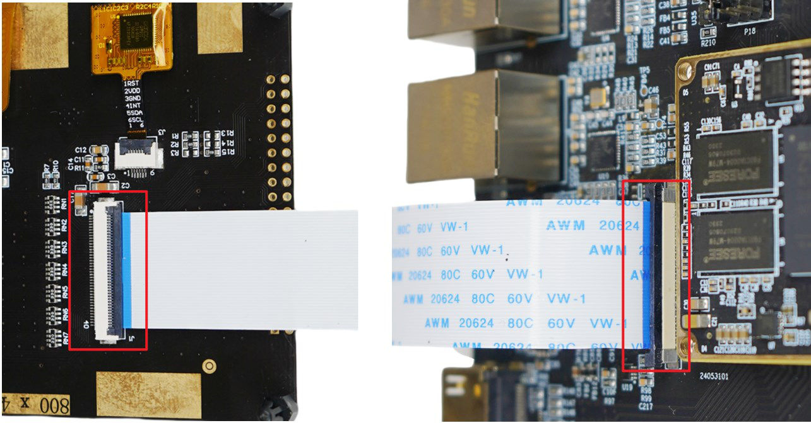

21-34  LCD

图

屏连接图

---
*下一页*

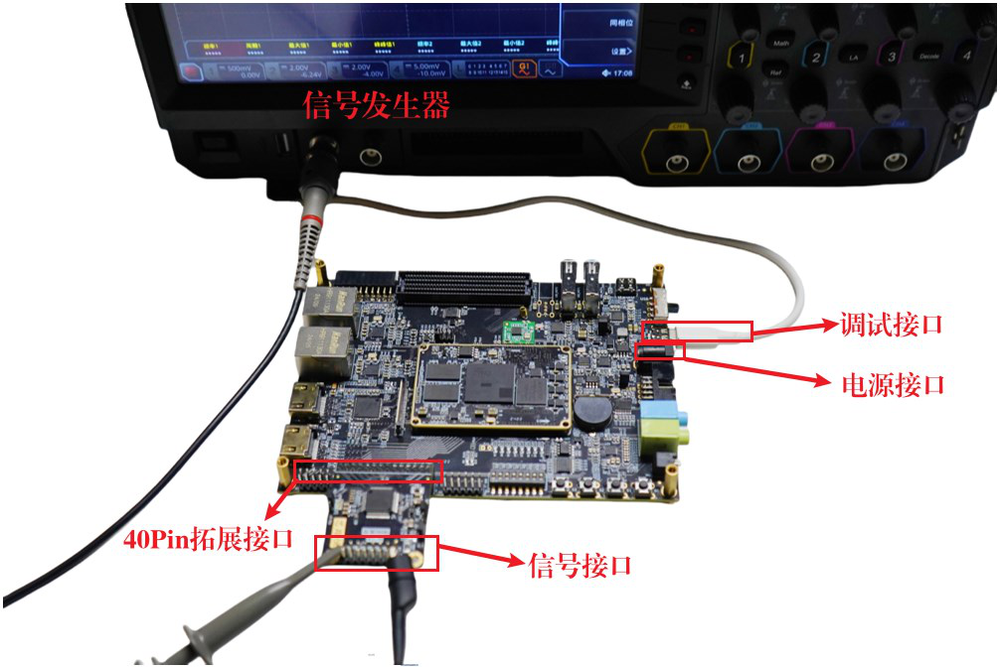

21-35

图

开发板正面连接图

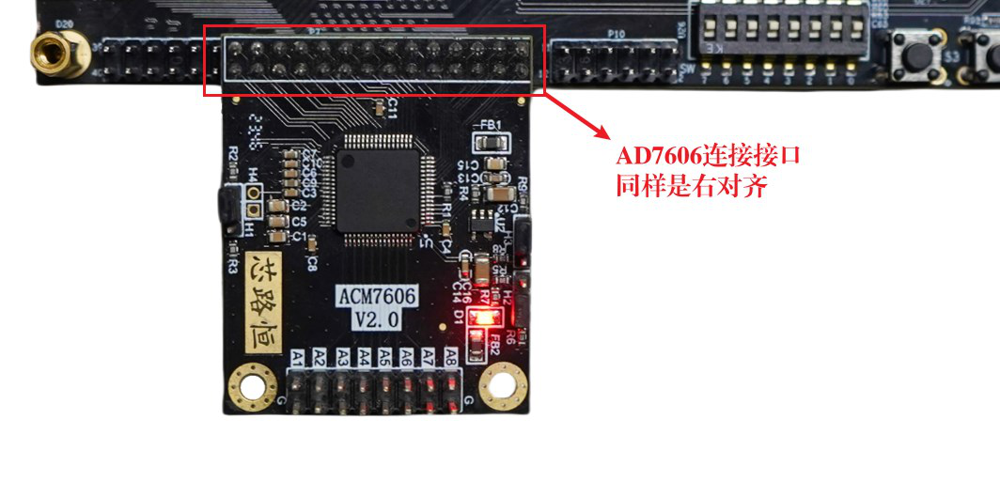

21-36  AD7606

图

连接图

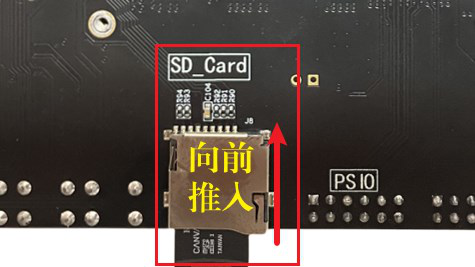

21-37  SD

图

卡插入

本次板级验证中，我们使用示波器作为信号源。有条件的用户也可以使用另

DDS

一块开发板自制一个

信号发生器作为信号源。在连接硬件时，需要注意

---
*下一页*

AD7606

1

40pin

1

模块的

号引脚与开发板上

拓展口的

号引脚相连。连接完成后

拨通开发板电源即可开始进行下载验证了。

21.4.3

串口终端连接

PS

AC820

打开设备管理器，查看

侧串口端口号，笔者电脑上

的串口标识如

21-38

图

所示：

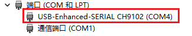

21-38

图

端口列表

PS

COM4

Vitis

COM4

此时笔者电脑上

端串口端口号为

，打开

终端，连接

。

115200

21-39

连接时将波特率设置为

，其余项保持默认即可，如图

所示：

21-39

图

串口终端连接

21-40

连接完成后终端会打印连接成功提醒，如图

所示：

---
*下一页*

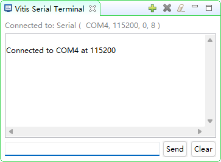

21-40

图

串口终端连接成功

连接完串口终端，接下来便可以将烧录文件下载到开发板验证设计了。

21.4.4

下载与验证

点击本次设计的工程资源文件，创建烧录任务，将生成的烧录文件下载至开

21-41

发板中，如图

所示，具体流程如下：

1.

创建烧录任务

2.

PS

确认添加比特流和

初始化脚本

3.

Reset entire system

Program FPGA

Run

勾选“

”和“

”，确认勾选了“

ps7_init

Run ps7_post_config

”和“

”

4.

Application

.elf

在

界面中检查是否添加

文件并勾选下载任务。

5.

Run

点击“

”开始烧录

---
*下一页*

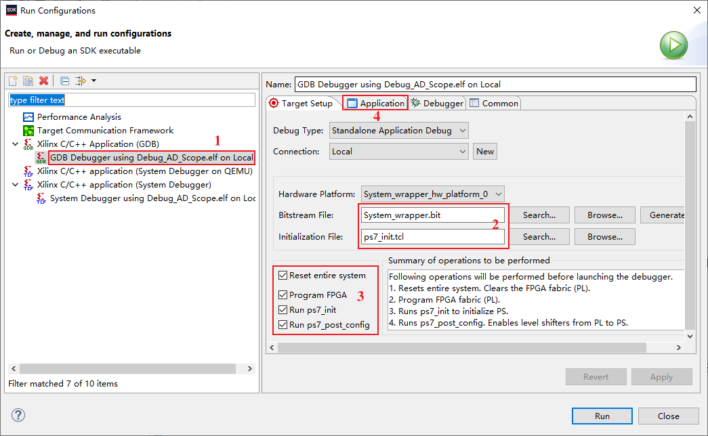

21-41

图

创建烧录任务

将本次烧录文件下载至开发板后，打开信号发生器，当软件右下角的下载进

LCD

度条消失且无报错时代表下载成功，稍等片刻即可看到

屏上显示出了波形

21-42

Vitis

21-43

界面，如图

所示，且

终端中也会打印相关版本信息，如图

。

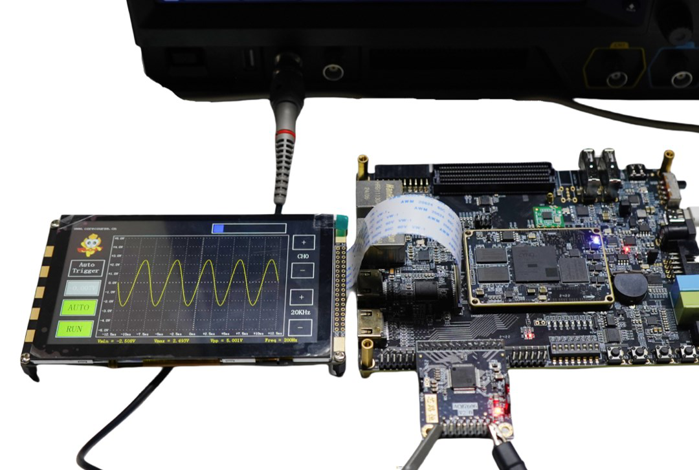

21-42

图

波形界面

---
*下一页*

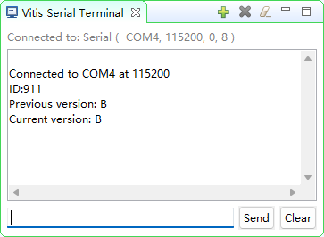

21-43

图

版本信息

21.4.5

功能介绍

21-44

程序下载成功之后，初始界面如下图

所示（未连接信号源）。

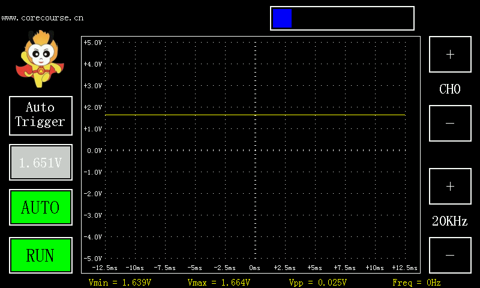

21-44

图

初始界面图

AD7606

1

200hz

Vpp=5V

然后给

的通道

输入一个

，

的正弦波，显示如下图

21-45

2.5V

，从图中最下一行的显示中，可以看到，其采集电压最大、最小值都为

200hz

左右，频率为

，与我们输入的信号一致。

---
*下一页*

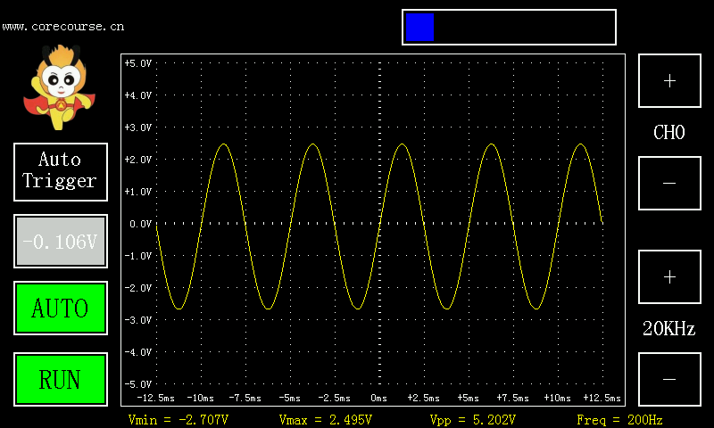

21-45

图

输入信号源之后，显示波形图

下面将对主界面中设计的一些功能进行说明。

21.4.5.1

主界面说明

21-46

主界面如下图

所示。

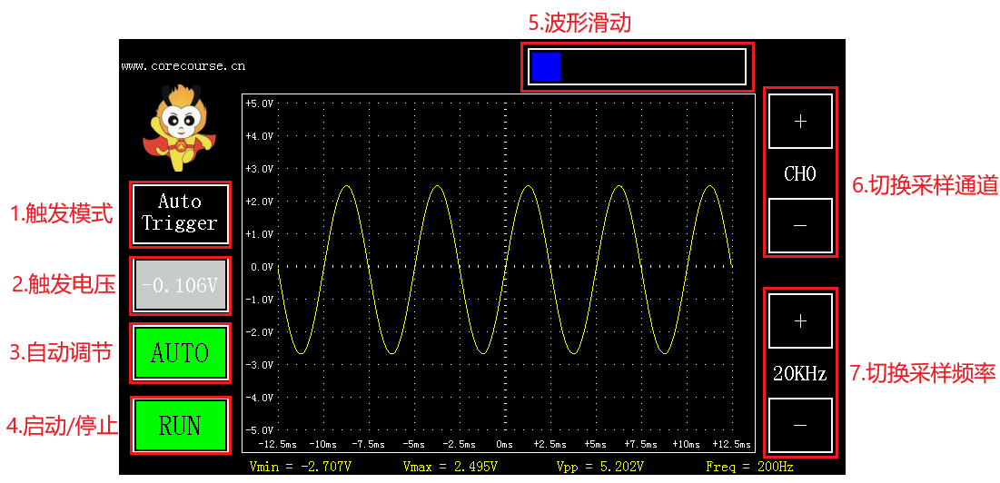

21-46

图

主界面示意图

1.

触发模式：可选自动触发、普通触发、单次触发三种模式；

2.

触发电压：手动模式下不可更改，在其他模式下，可通过滑动波形窗口

的橙色标线来选择当前的触发电压；

3.

自动调整：会根据当前输入的波形频率，自动调整到最佳的采样率，并

将触发模式切换为自动模式；

---
*下一页*

4.

/

/

启动

停止：启动

停止波形采集；

5.

1024

500

波形移动：本工程存储了长度为

的波形，但窗口只显示

，拖动

滑块即可移动波形；

6.

+

-

CH0~CH7

8

切换采样通道：点击“

”、“

”可切换

共

个采样通道；

7.

+

-

1KHz~1000KHz

10

选择采样率：点击“

”、“

”可切换

共

种采样率；

8.

显示输入电压的最值、峰峰值、频率值。

21.4.5.2

测量界面介绍

21-47

RUN

RUN

STOP

测量界面如下图

所示，在点击“

”按钮后，

“

”会变为“

”

表示停止波形采集，并进入测量界面在测量界面会有一条青色竖标线，触摸可以

移动标线，在上方会显示标线与波形交点处的电压值、相对时间值

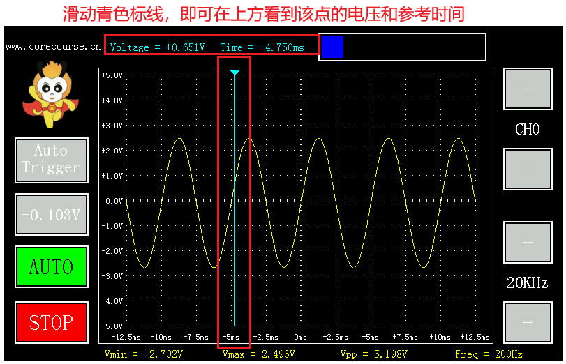

21-47

图

测量界面示意图

21.4.5.3

触发模式介绍

本工程支持三种触发方式：自动触发、普通触发、单次触发

1.

21-48

自动触发：触发值自动选择为输入电压的中值，如下图

所示。

---
*下一页*

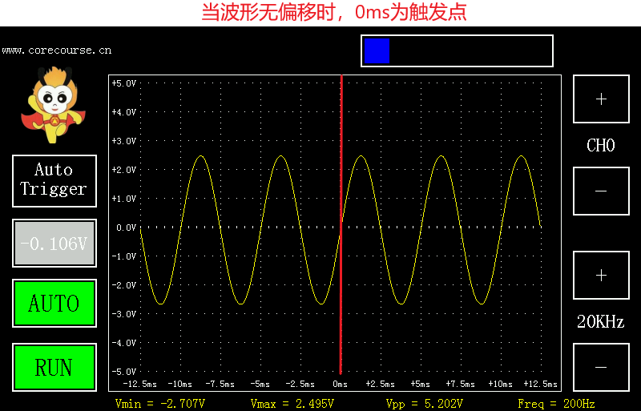

21-48

图

自动触发显示示意图

2.

21-49

普通触发：触发值由用户自己选择。如下图

，点击触发模式切换

0.917V

按键，切换到普通触发模式，然后设置触发电压为

，可以看到波

0.917V

形触发点变为

。

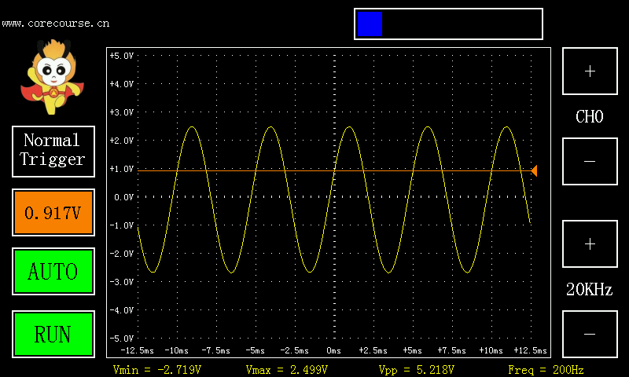

21-49

图

普通触发示意图

3.

单次触发：点击触发模式切换按键，切换到单次触发模式，“触发电压”

0.750V

0.750V

按钮会变为绿色可触摸，然后设置触发电压为

，点击“

”

启动单次触发，在等待触发时，“触发电压”按钮为红色，再次点击可退

---
*下一页*

21-50

出等待，如下图

所示。

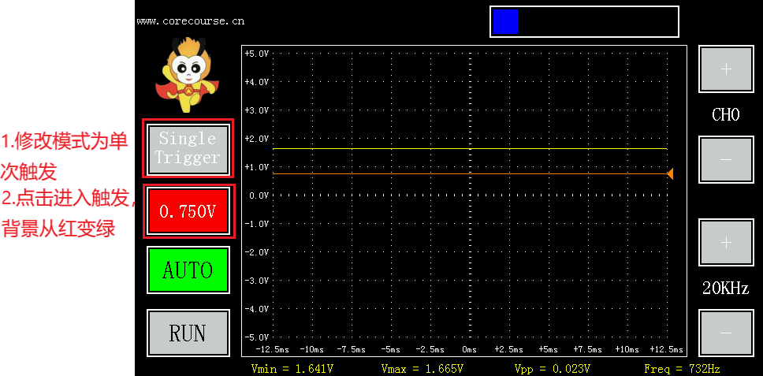

21-50

图

单次触发波形图

21-51

触发完成之后，会进入停止状态，方便观测波形，如下图

所示。

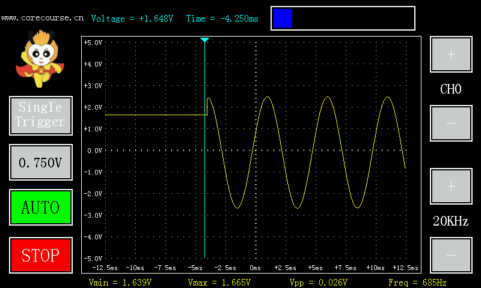

21-51

图

触发完成波形图

21.4.5.4

截图功能介绍

AC820

PS

设计使用

开发板

侧按键实现截图功能，用户按下按键后，程序会

.bmp

SD

拷贝内存数据，在处理后以

的命名方式写入

卡中，并通过串口打印出写

21-52

入结果。这里笔者截图了四次，串口打印情况如图

所示：

---
*下一页*

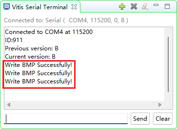

21-52

图

串口打印

SD

接下来将

卡从开发板中弹出，插入到读卡器内，再将读卡器插到电脑主

USB

windows

SD

机的

接口上。接下来我们打开

资源管理器，查看

卡中的内容，

21-53

如图

所示：

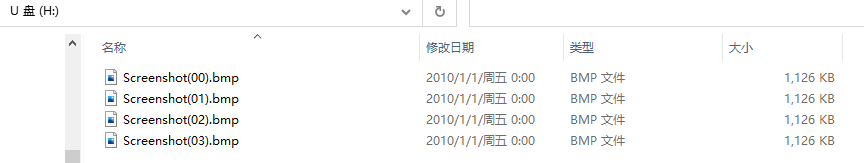

21-53

图

使用资源管理器查看截图保存文件

21-54

双击截图文件便能直接查看截图内容，如图

所示：

---
*下一页*

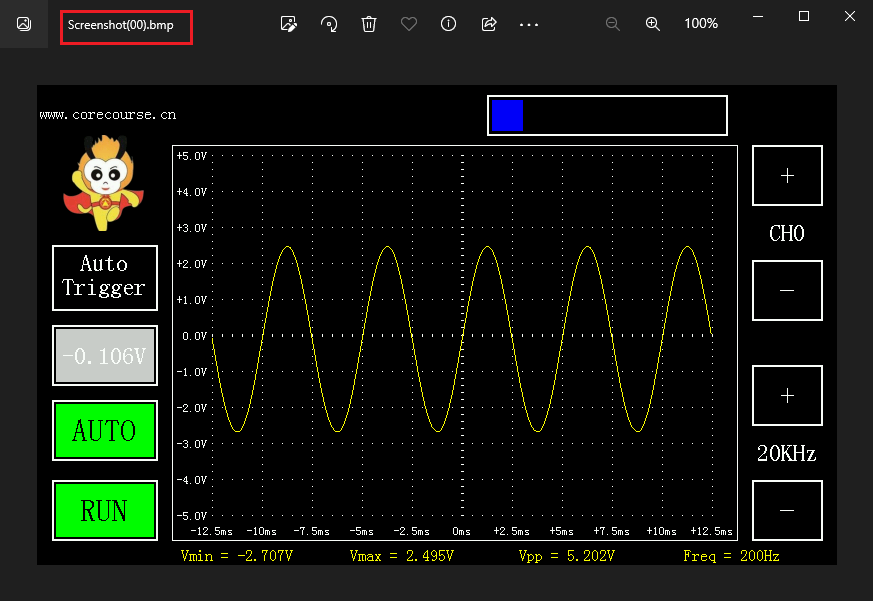

21-54

图

查看截图内容

至此，设计所有功能介绍完成，本次设计结束。

21.5

章节总结

1

RGB_LCD

AD7606

、本章设计以

实验为基础，结合

模块完成了多通道数

LCD

据采集系统的搭建，用户在使用时可以直接通过触摸

屏上对应按

/

钮，实现不同功能的切换

控制以及采集通道的选择。

2

、在进入单次触发之后，我们可以看到波形并不是从设定的触发电压之后

开始显示波形，而是在设定的触发电压之前就已经有波形数据了，这是

AD

因为我们在程序中添加了一个移位寄存器，将

采集的数据进行移位

RAM

之后，才送到

中进行显示，所以这里才能看到在触发之后，还会

显示触发之前的数据。

---
*下一页*

